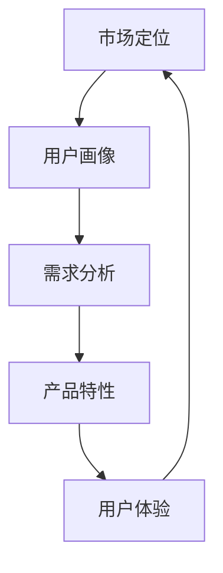

                 

### 背景介绍

**AI创业：推广策略设计**

在当今全球数字化浪潮中，人工智能（AI）技术已经成为推动社会进步和经济发展的关键力量。随着AI技术的不断成熟，越来越多的创业者投身于这一领域，希望通过创新的产品和服务来抢占市场先机。然而，AI创业并非易事，如何制定有效的推广策略成为了许多初创企业面临的重大挑战。

本博客文章旨在探讨AI创业中的推广策略设计，通过逻辑清晰、结构紧凑的分析，帮助创业者更好地理解推广策略的核心概念，掌握具体操作步骤，并从中获得深刻的见解和实际应用价值。文章将从背景介绍、核心概念与联系、核心算法原理、数学模型和公式、项目实战、实际应用场景、工具和资源推荐、总结：未来发展趋势与挑战、附录：常见问题与解答以及扩展阅读 & 参考资料等多个方面进行详细阐述。

接下来，我们将逐步深入探讨AI创业推广策略设计的各个方面，帮助读者全面了解这一重要课题。首先，我们将对AI创业的整体背景进行介绍，分析当前AI市场的发展态势以及创业者在推广过程中可能遇到的主要困难。随后，我们将引入推广策略的核心概念，通过具体的流程图和算法原理，帮助读者建立对推广策略的整体认识。

在接下来的章节中，我们将详细讲解数学模型和公式，并通过实际项目案例，展示如何将理论转化为实践。同时，我们还将探讨推广策略在实际应用场景中的效果和局限性，为创业者提供实用的经验和建议。最后，我们将对未来的发展趋势与挑战进行展望，帮助读者把握行业动态，为未来的创业之路做好准备。

通过本篇文章的学习，读者将能够系统地掌握AI创业推广策略设计的方法和技巧，为实际创业实践提供有力的理论支持和实践指导。让我们开始这场深入且有趣的探索之旅吧！<sop><|user|>### 核心概念与联系

在深入探讨AI创业的推广策略设计之前，我们需要明确一些核心概念，并理解它们之间的联系。这些核心概念包括市场定位（Market Positioning）、用户画像（User Profiling）、目标客户群体（Target Customer Segment）、需求分析（Need Analysis）、产品特性（Product Features）和用户体验（User Experience）。

#### 市场定位（Market Positioning）

市场定位是指企业在目标市场中所占据的位置，它涉及到企业如何通过产品或服务来区分自己与其他竞争者的不同之处。在AI创业领域，市场定位尤为重要，因为它直接影响到产品的市场接受度和用户的购买意愿。市场定位需要从以下几方面进行：

- **产品特色**：识别并强调产品或服务的独特卖点（USP），例如高效能、智能化、用户体验佳等。
- **目标市场**：确定目标客户群体，了解他们的需求和行为模式。
- **竞争对手分析**：分析竞争对手的市场定位和策略，找出自己的优势与劣势。

#### 用户画像（User Profiling）

用户画像是对目标用户进行全面描述的一个过程，它通过收集和分析用户的数据，帮助创业者更好地了解用户的兴趣、行为和需求。构建用户画像的关键步骤包括：

- **数据收集**：通过调查问卷、用户反馈、社交媒体分析等手段收集用户数据。
- **数据分析**：利用数据挖掘和统计分析技术，对收集的数据进行分析，提炼出有用的信息。
- **用户画像构建**：根据分析结果，创建详细的用户画像，包括年龄、性别、职业、兴趣爱好、行为习惯等。

#### 目标客户群体（Target Customer Segment）

目标客户群体是指最有可能购买和使用产品或服务的人群。识别目标客户群体是推广策略设计的重要一步，它有助于资源的最优配置和营销活动的精准实施。以下是识别目标客户群体的几个关键点：

- **市场调研**：通过市场调研和竞争分析，确定目标客户群体。
- **客户分类**：根据客户的需求、购买力、使用习惯等，将客户分类。
- **客户价值评估**：评估每个客户群体的价值和潜在市场规模。

#### 需求分析（Need Analysis）

需求分析是指通过市场调研、用户访谈、数据分析等方法，了解用户的需求和痛点，从而指导产品设计和推广策略。以下是需求分析的主要步骤：

- **确定目标**：明确需要分析的需求类型和范围。
- **数据收集**：通过各种渠道收集相关数据，包括用户反馈、市场报告等。
- **数据分析**：利用数据分析技术，对收集的数据进行深入分析。
- **需求评估**：根据分析结果，评估用户需求的重要性和紧迫性。

#### 产品特性（Product Features）

产品特性是指产品或服务的功能、性能、外观等方面的特点。在推广策略设计中，了解和强调产品的特性对于吸引目标客户至关重要。以下是确定产品特性的几个关键点：

- **功能需求**：了解用户的基本功能需求，确保产品满足这些需求。
- **性能需求**：评估产品的性能指标，如速度、稳定性、安全性等。
- **用户体验**：关注产品的用户体验，确保用户能够轻松使用并享受服务。

#### 用户体验（User Experience）

用户体验是指用户在使用产品或服务过程中的感受和体验。在AI创业中，提供优质的用户体验是提高用户满意度和忠诚度的关键。以下是提升用户体验的几个关键点：

- **设计原则**：遵循用户体验设计原则，如简洁性、一致性、易用性等。
- **用户反馈**：收集用户反馈，不断优化产品设计和功能。
- **个性化**：根据用户行为和偏好，提供个性化的服务和建议。

#### 核心概念联系

这些核心概念之间有着紧密的联系。市场定位和用户画像为推广策略提供了方向和目标，需求分析帮助确定产品特性，用户体验则是推广策略成功的关键。以下是它们之间的联系流程图（使用Mermaid语法）：



通过这个流程图，我们可以清晰地看到，市场定位、用户画像、需求分析、产品特性和用户体验是相互影响、相互促进的。一个成功的推广策略需要在这五个方面进行全面的规划和执行。

在接下来的章节中，我们将深入探讨推广策略的核心算法原理和具体操作步骤，帮助读者将这些核心概念应用到实际推广活动中。通过理论讲解和案例分享，我们将为读者提供实用的方法和技巧，助力AI创业者在竞争激烈的市场中脱颖而出。<sop><|user|>
### 核心算法原理 & 具体操作步骤

在AI创业的推广策略设计中，核心算法原理和具体操作步骤起着至关重要的作用。以下我们将详细介绍几个关键的算法原理，并给出具体的操作步骤。

#### 1. 数据挖掘与用户行为分析

数据挖掘是推广策略设计中的基础，它通过分析大量数据，发现潜在的规律和趋势，帮助创业者更好地了解用户行为和市场动态。以下是一个数据挖掘和用户行为分析的具体操作步骤：

- **数据收集**：从各种渠道收集用户数据，如网站访问日志、社交媒体互动数据、问卷调查结果等。
- **数据预处理**：清洗和整理数据，确保数据质量和完整性。
- **特征工程**：提取数据中的关键特征，如用户年龄、性别、浏览历史、购买行为等。
- **模型训练**：使用机器学习算法，如分类算法、聚类算法等，对用户行为进行分析和预测。
- **结果评估**：通过评估模型性能，调整算法参数，优化模型效果。

#### 2. 需求预测与市场分析

需求预测和市场分析是制定有效推广策略的重要环节。以下是一个需求预测和市场分析的具体操作步骤：

- **数据收集**：收集市场相关数据，如行业报告、竞争对手分析、消费者调查等。
- **数据分析**：利用数据分析技术，对市场趋势和用户需求进行深入分析。
- **模型建立**：建立需求预测模型，如时间序列模型、回归模型等，预测市场变化和用户需求。
- **结果评估**：评估模型预测的准确性，调整模型参数，优化预测效果。

#### 3. 社交媒体分析与口碑管理

社交媒体分析是了解用户需求和传播推广信息的重要手段。以下是一个社交媒体分析和口碑管理的具体操作步骤：

- **数据收集**：从社交媒体平台收集用户评论、帖子、互动数据等。
- **数据分析**：利用自然语言处理技术，分析用户情感和反馈，识别潜在的问题和机会。
- **口碑管理**：根据分析结果，制定口碑管理策略，如积极回应用户反馈、改善产品和服务等。

#### 4. 广告投放与效果优化

广告投放是推广策略中常用的手段，以下是一个广告投放和效果优化的具体操作步骤：

- **目标确定**：明确广告投放的目标，如增加网站流量、提高转化率、提升品牌知名度等。
- **渠道选择**：选择合适的广告投放渠道，如搜索引擎广告、社交媒体广告、电子邮件广告等。
- **预算分配**：根据广告目标和预算，合理分配广告投放资源。
- **效果监测**：使用监测工具，如Google Analytics、广告平台提供的分析工具等，监测广告投放效果。
- **优化调整**：根据监测结果，调整广告投放策略，如优化广告文案、调整投放时间、增加或减少预算等。

#### 5. 客户关系管理与忠诚度提升

客户关系管理（CRM）和忠诚度提升是维护客户关系、增加复购率的重要手段。以下是一个客户关系管理和忠诚度提升的具体操作步骤：

- **客户数据收集**：收集客户的基本信息、购买历史、互动记录等数据。
- **客户分群**：根据客户特征和行为，将客户分为不同的群体，如新客户、老客户、高价值客户等。
- **个性化营销**：根据客户分群，制定个性化的营销策略，如发送定制化的邮件、提供会员优惠等。
- **客户反馈收集**：定期收集客户反馈，了解他们的需求和满意度。
- **忠诚度提升**：通过积分制度、优惠券、VIP活动等方式，提升客户忠诚度。

通过上述核心算法原理和具体操作步骤，创业者可以系统地制定和实施有效的推广策略，提高产品的市场知名度和用户满意度，从而在竞争激烈的市场中脱颖而出。在接下来的章节中，我们将通过实际项目案例，进一步展示如何将这些理论应用到实践中，为读者提供更具体的指导和建议。<sop><|user|>
### 数学模型和公式 & 详细讲解 & 举例说明

在AI创业的推广策略设计中，数学模型和公式起着关键作用。以下，我们将详细讲解几个核心的数学模型和公式，并通过具体例子来说明它们的应用。

#### 1. 深度学习模型

深度学习模型是当前AI领域中最为流行和有效的一种算法。以下是一个典型的深度学习模型——卷积神经网络（CNN）的公式和解释：

- **卷积层（Convolutional Layer）**：
  - **公式**：\[ h_{\sigma}^{(1)} = \sigma(W_1 \cdot x_1 + b_1) \]
  - **解释**：这里，\( \sigma \) 代表激活函数（如ReLU函数），\( W_1 \) 是卷积权重矩阵，\( x_1 \) 是输入数据，\( b_1 \) 是偏置项。

- **池化层（Pooling Layer）**：
  - **公式**：\[ p_{k} = \max(p_{1}, p_{2}, ..., p_{k}) \]
  - **解释**：这里，\( p_k \) 是输出值，表示在大小为 \( k \times k \) 的区域内的最大值。

- **全连接层（Fully Connected Layer）**：
  - **公式**：\[ h_{\sigma}^{(L)} = \sigma(W_L \cdot h^{(L-1)} + b_L) \]
  - **解释**：这里，\( \sigma \) 代表激活函数，\( W_L \) 是全连接权重矩阵，\( h^{(L-1)} \) 是上一层的输出，\( b_L \) 是偏置项。

**示例**：假设我们有一个包含1000个图像的数据集，每个图像是32x32的像素矩阵。我们使用一个简单的CNN模型来对这些图像进行分类。

- **输入层**：\[ x_1 = 1000 \times 32 \times 32 = 1,048,576 \]
- **卷积层**：使用5x5的卷积核，得到：
  \[ h_{\sigma}^{(1)} = \sigma(W_1 \cdot x_1 + b_1) \]
  假设 \( W_1 \) 和 \( b_1 \) 已经训练好，输出维度为：
  \[ h_{\sigma}^{(1)} = 1,048,576 \times 5 \times 5 = 524,288 \]
- **池化层**：使用2x2的最大池化，得到：
  \[ p_k = \max(p_{1}, p_{2}, ..., p_{k}) \]
  输出维度为：
  \[ p_k = 524,288 \div (2 \times 2) = 130,560 \]
- **全连接层**：假设我们使用一个包含100个节点的全连接层，得到：
  \[ h_{\sigma}^{(L)} = \sigma(W_L \cdot p_k + b_L) \]
  输出维度为：
  \[ h_{\sigma}^{(L)} = 130,560 \times 100 = 13,056,000 \]

#### 2. 推广效果评估指标

在推广策略中，评估效果是一个关键环节。以下是一些常见的推广效果评估指标：

- **点击率（Click-Through Rate, CTR）**：
  - **公式**：\[ CTR = \frac{点击次数}{展示次数} \]
  - **解释**：点击率是衡量广告吸引力的一个重要指标。

- **转化率（Conversion Rate）**：
  - **公式**：\[ Conversion Rate = \frac{转化次数}{点击次数} \]
  - **解释**：转化率是衡量广告效果的关键指标，表示有多少点击最终转化为实际购买或行为。

- **平均回报率（Return on Ad Spend, ROAS）**：
  - **公式**：\[ ROAS = \frac{收入}{广告支出} \]
  - **解释**：平均回报率衡量的是广告带来的收入与广告支出的比值，用于评估广告的投资回报。

**示例**：假设一个广告的展示次数为1000次，点击次数为100次，转化次数为10次，广告支出为1000元。

- **点击率**：\[ CTR = \frac{100}{1000} = 0.1 \]
- **转化率**：\[ Conversion Rate = \frac{10}{100} = 0.1 \]
- **平均回报率**：\[ ROAS = \frac{收入}{广告支出} = \frac{10}{1000} = 0.01 \]

通过这些数学模型和公式，创业者可以更精确地评估推广效果，优化广告策略。在接下来的章节中，我们将通过实际项目案例，展示如何将上述理论应用到实际推广活动中，提供具体的操作指南和策略建议。<sop><|user|>
### 项目实战：代码实际案例和详细解释说明

为了更好地理解AI创业推广策略设计中的核心算法原理和数学模型，我们将通过一个实际的项目案例，展示如何将理论应用到实践中。本案例将演示如何使用Python和Scikit-Learn库实现一个简单的用户画像和需求预测模型。

#### 1. 开发环境搭建

首先，我们需要搭建一个Python开发环境，安装必要的库，如Scikit-Learn、Pandas和Matplotlib。以下是详细的步骤：

- **安装Python**：下载并安装Python 3.8版本。
- **安装Jupyter Notebook**：在终端中运行以下命令：
  ```shell
  pip install notebook
  ```
- **安装Scikit-Learn**：
  ```shell
  pip install scikit-learn
  ```
- **安装Pandas**：
  ```shell
  pip install pandas
  ```
- **安装Matplotlib**：
  ```shell
  pip install matplotlib
  ```

#### 2. 源代码详细实现和代码解读

以下是一个简单的用户画像和需求预测的Python代码实现。代码分为数据预处理、模型训练、模型评估和结果可视化四个部分。

```python
# 导入必要的库
import pandas as pd
from sklearn.model_selection import train_test_split
from sklearn.ensemble import RandomForestClassifier
from sklearn.metrics import accuracy_score
import matplotlib.pyplot as plt

# 2.1 数据预处理

# 加载数据集
data = pd.read_csv('user_data.csv')

# 数据清洗和预处理
data = data.dropna()  # 删除缺失值
data['age_group'] = pd.cut(data['age'], bins=[0, 18, 30, 50, 70, 100], labels=['0-18', '19-30', '31-50', '51-70', '71-100'])

# 2.2 模型训练

# 分割数据集
X = data[['age_group', 'income', 'education']]
y = data['interests']

X_train, X_test, y_train, y_test = train_test_split(X, y, test_size=0.2, random_state=42)

# 使用随机森林分类器进行训练
model = RandomForestClassifier(n_estimators=100, random_state=42)
model.fit(X_train, y_train)

# 2.3 模型评估

# 进行模型预测
y_pred = model.predict(X_test)

# 计算模型准确率
accuracy = accuracy_score(y_test, y_pred)
print(f"Model Accuracy: {accuracy:.2f}")

# 2.4 结果可视化

# 可视化特征重要性
feature_importance = model.feature_importances_
features = X_train.columns
plt.barh(features, feature_importance)
plt.xlabel('Feature Importance')
plt.ylabel('Features')
plt.title('Feature Importance')
plt.show()
```

#### 3. 代码解读与分析

- **数据预处理**：首先，我们加载数据集，并进行数据清洗和预处理。这里，我们使用Pandas库对数据进行操作，删除缺失值，并对年龄进行分组。
- **模型训练**：接着，我们将数据集分割为训练集和测试集，使用随机森林分类器进行训练。随机森林是一种基于树模型的集成学习方法，可以有效处理高维数据和缺失值。
- **模型评估**：在模型训练完成后，我们使用测试集进行预测，并计算模型的准确率。准确率是评估分类模型性能的常用指标，表示预测正确的样本占总样本的比例。
- **结果可视化**：最后，我们使用Matplotlib库对模型中各个特征的重要性进行可视化。这有助于我们理解哪些特征对模型的预测结果影响最大，从而指导后续的数据收集和模型优化。

通过这个实际项目案例，我们可以看到如何将理论中的核心算法和数学模型应用到实际场景中。在实际应用中，创业者需要根据具体情况进行调整和优化，以提高模型的预测准确率和推广效果。在接下来的章节中，我们将继续探讨推广策略的实际应用场景，分享更多的实战经验和技巧。<sop><|user|>
### 实际应用场景

在AI创业的推广策略设计中，不同的应用场景需要采取不同的推广策略，以实现最佳效果。以下是一些常见的应用场景以及相应的推广策略建议。

#### 1. 新产品上市

新产品上市是创业公司面临的重大挑战之一。为了确保产品能够迅速在市场上获得关注和认可，以下是一些建议的推广策略：

- **精准营销**：通过市场调研和用户画像，精准定位目标客户群体，制定个性化的营销方案。
- **媒体曝光**：利用新闻稿、公关活动、媒体报道等方式，提高产品知名度。
- **社交网络营销**：利用社交媒体平台，如微信、微博、抖音等，进行内容营销，吸引潜在用户关注。
- **KOL合作**：与意见领袖（KOL）合作，通过他们的推荐和影响力，增加产品的曝光度。

**案例**：某AI初创公司开发了一款智能语音助手，他们通过以下策略成功推广了新产品：

- **精准营销**：通过用户调研，确定了目标客户群体为年龄在25-45岁之间的科技爱好者。
- **媒体曝光**：在各大科技媒体发布新闻稿，邀请知名科技博主进行评测。
- **社交网络营销**：在微信、微博等社交平台发布有趣的互动内容，如语音助手日常对话记录、功能演示视频等。
- **KOL合作**：与科技领域的知名博主合作，进行产品推荐和互动直播。

#### 2. 市场扩张

当公司在现有市场已经站稳脚跟后，可以考虑进一步扩张市场，开拓新的业务领域。以下是一些建议的推广策略：

- **多渠道推广**：利用多种推广渠道，如搜索引擎广告、社交媒体广告、电子邮件营销等，扩大覆盖范围。
- **本地化营销**：针对不同地区的用户，提供本地化的产品和服务，如语言本地化、文化特色等。
- **合作伙伴关系**：与行业内的其他公司建立合作伙伴关系，共同推广产品，扩大市场影响力。

**案例**：一家AI公司计划进军欧洲市场，他们采取了以下策略：

- **多渠道推广**：在欧洲地区的搜索引擎上投放广告，同时在社交媒体上发布相关内容。
- **本地化营销**：将产品界面翻译成多种欧洲语言，适应当地文化和消费习惯。
- **合作伙伴关系**：与当地的AI行业协会和科技公司建立合作关系，共同举办技术研讨会和交流活动。

#### 3. 用户留存

用户留存是衡量产品成功与否的关键指标。为了提高用户留存率，以下是一些建议的推广策略：

- **用户互动**：通过社交媒体、在线论坛、用户反馈渠道等，与用户保持密切互动，了解他们的需求和反馈。
- **个性化推荐**：根据用户的兴趣和行为，提供个性化的产品推荐和服务。
- **用户激励**：通过积分、优惠券、会员权益等方式，激励用户持续使用产品。
- **社区建设**：建立用户社区，鼓励用户分享使用心得和经验，增加用户黏性。

**案例**：某AI公司开发了一款智能健身应用，他们采取了以下策略提高用户留存率：

- **用户互动**：在社交媒体上建立用户论坛，鼓励用户分享健身心得和挑战。
- **个性化推荐**：根据用户的健身数据和偏好，推荐个性化的健身计划和课程。
- **用户激励**：推出积分系统，用户通过完成每日健身任务获得积分，可用于兑换奖品。
- **社区建设**：建立健身社区，用户可以在社区中分享健身经验和建议，与其他用户互动。

通过针对不同应用场景的推广策略，AI创业公司可以更有效地拓展市场、提高用户留存，从而在竞争激烈的市场中取得成功。在接下来的章节中，我们将继续探讨相关的工具和资源推荐，为创业者提供更多的支持和指导。<sop><|user|>
### 工具和资源推荐

为了有效执行AI创业中的推广策略，选择合适的工具和资源至关重要。以下是一些推荐的学习资源、开发工具和相关的论文著作。

#### 7.1 学习资源推荐

1. **书籍**：
   - 《精益创业》（The Lean Startup）- Eric Ries
   - 《AI营销：如何利用人工智能实现营销创新》（AI Marketing: How to Use AI to Create Marketing Magic）- Mark Schaefer
   - 《深度学习》（Deep Learning）- Ian Goodfellow、Yoshua Bengio和Aaron Courville

2. **在线课程**：
   - Coursera上的《机器学习》（Machine Learning）- Andrew Ng
   - edX上的《人工智能基础》（Introduction to Artificial Intelligence）- University of Washington
   - Udacity的《深度学习纳米学位》（Deep Learning Nanodegree）

3. **博客和网站**：
   - Analytics Vidhya：提供丰富的数据科学和机器学习资源。
   -Towards Data Science：涵盖数据科学、机器学习和AI领域的最新趋势和案例分析。
   - HBR.org：哈佛商业评论上的AI和创业相关文章。

#### 7.2 开发工具框架推荐

1. **编程语言**：
   - Python：广泛应用于数据科学、机器学习和AI项目。
   - R：特别适合统计分析和数据可视化。

2. **开发环境**：
   - Jupyter Notebook：用于编写和运行代码，便于分享和协作。
   - PyCharm：强大的Python集成开发环境（IDE），支持多种编程语言。

3. **数据预处理工具**：
   - Pandas：Python的数据分析库，用于数据处理和分析。
   - NumPy：Python的数值计算库，用于数值计算和数据分析。

4. **机器学习库**：
   - Scikit-Learn：提供常用的机器学习算法和工具。
   - TensorFlow：Google开源的机器学习框架，用于构建和训练深度学习模型。
   - PyTorch：Facebook开源的深度学习框架，易于使用和调试。

5. **数据分析工具**：
   - Tableau：数据可视化工具，用于创建交互式仪表板。
   - Power BI：由Microsoft开发的商业智能工具，支持数据可视化和报告。

#### 7.3 相关论文著作推荐

1. **机器学习和深度学习**：
   - "Deep Learning" (NIPS 2012)：Ian Goodfellow、Yoshua Bengio和Aaron Courville撰写的综述论文。
   - "Learning Deep Architectures for AI" (2016)：Yoshua Bengio关于深度学习架构的论文。

2. **人工智能在创业中的应用**：
   - "Artificial Intelligence for Business: Implications, Applications, and the Future" (2019)：探讨AI在商业领域的应用和影响。
   - "AI in Entrepreneurship: A Survey" (2020)：综述AI在创业中的应用和挑战。

3. **市场营销和推广策略**：
   - "The Lean Startup" (2011)：Eric Ries关于精益创业方法的经典著作。
   - "Content Inc." (2017)：Joe Pulizzi关于内容营销的方法和实践。

通过利用上述推荐的学习资源、开发工具和相关论文著作，AI创业者可以更好地掌握推广策略的设计与执行，提升产品的市场竞争力。这些工具和资源不仅提供了理论支持，也包含了实际操作案例和经验分享，有助于创业者快速成长并实现创业目标。<sop><|user|>
### 总结：未来发展趋势与挑战

在AI创业领域，未来的发展趋势和面临的挑战是创业者需要密切关注的重要课题。随着技术的不断进步和市场环境的变化，创业者需要灵活应对，以把握机遇，迎接挑战。

#### 未来发展趋势

1. **人工智能技术的持续创新**：AI技术的快速发展为创业提供了广阔的空间。深度学习、自然语言处理、计算机视觉等领域的突破性进展，将为创业者带来更多创新机会。

2. **数据驱动的决策**：随着数据获取和分析技术的进步，创业者能够更加精准地了解用户需求和市场趋势，从而做出更为科学的决策。数据驱动将成为企业运营和推广策略的重要基础。

3. **跨界融合**：AI技术与传统行业的融合将不断深化，如医疗、金融、教育等领域的AI应用将不断涌现，为创业者提供新的市场机会。

4. **个性化服务**：随着用户数据的积累和分析技术的提升，创业者能够提供更加个性化的产品和服务，提升用户体验和用户满意度。

5. **可持续发展和社会责任**：在可持续发展和社会责任日益受到关注的背景下，创业公司需要考虑如何在其业务模式中融入可持续发展和社会责任，以赢得用户的信任和支持。

#### 面临的挑战

1. **数据隐私和安全**：随着数据量的增加和数据分析技术的应用，数据隐私和安全成为重要的挑战。创业者需要确保用户数据的安全，遵守相关法律法规，以防止数据泄露和滥用。

2. **技术依赖和人才短缺**：AI技术的发展对技术人才的需求越来越高，但当前的人才供应难以满足市场需求。创业者需要投入更多资源进行人才培养和技术储备。

3. **市场竞争激烈**：AI创业领域竞争激烈，创业者需要不断创新和优化，以保持竞争力。同时，需要关注市场动态，及时调整战略，以应对竞争对手的挑战。

4. **政策法规的不确定性**：全球范围内的政策法规对于AI技术的应用和发展有着重要影响。创业者需要密切关注政策变化，确保其业务模式符合法律法规的要求。

5. **伦理和道德问题**：AI技术在应用过程中可能引发伦理和道德问题，如算法歧视、隐私侵犯等。创业者需要在产品设计和服务提供过程中考虑这些因素，确保其业务符合社会伦理和道德标准。

综上所述，未来AI创业的发展趋势充满机遇，但同时也面临着诸多挑战。创业者需要保持敏锐的市场洞察力，不断学习和适应，以在激烈的市场竞争中脱颖而出。通过不断创新、优化推广策略，并关注数据隐私和安全、人才引进、政策法规和伦理道德等方面，创业者将能够在AI创业领域取得成功。<sop><|user|>
### 附录：常见问题与解答

在AI创业的推广策略设计中，创业者可能会遇到一系列问题。以下是一些常见的问题以及相应的解答。

#### 1. 如何制定有效的推广策略？

制定有效的推广策略需要以下几个步骤：
- **市场调研**：了解目标市场、竞争对手和用户需求。
- **明确目标**：确定推广的目标，如增加品牌知名度、提高销售额等。
- **选择渠道**：根据目标市场和目标用户，选择合适的推广渠道，如社交媒体、广告投放、内容营销等。
- **制定内容**：根据目标渠道，制定有吸引力的内容，如文案、图片、视频等。
- **监测与优化**：通过数据监测和分析，了解推广效果，及时调整策略。

#### 2. 如何评估推广效果？

评估推广效果的关键指标包括：
- **点击率（CTR）**：衡量广告或内容被用户点击的次数。
- **转化率**：衡量点击后的实际购买或行为发生的次数。
- **成本效益比（ROI）**：衡量推广投入与收益的比值。
- **用户满意度**：通过用户反馈和评价来衡量推广内容的质量。

#### 3. 如何处理用户数据隐私问题？

处理用户数据隐私问题的方法包括：
- **数据加密**：对用户数据进行加密，确保数据在传输和存储过程中的安全。
- **数据脱敏**：在分析用户数据时，对敏感信息进行脱敏处理，以保护用户隐私。
- **合规性**：遵守相关法律法规，如《通用数据保护条例》（GDPR）和《网络安全法》等。
- **透明度**：向用户明确告知数据处理的目的、方式和范围，并获得用户的明确同意。

#### 4. 如何持续优化推广策略？

持续优化推广策略的方法包括：
- **数据驱动**：利用数据分析，了解用户行为和需求，及时调整策略。
- **A/B测试**：对不同推广策略进行A/B测试，找出最优方案。
- **用户反馈**：收集用户反馈，了解用户对推广内容的看法和建议，进行相应调整。
- **竞争对手分析**：分析竞争对手的推广策略，借鉴成功经验，避免重复错误。

通过以上解答，创业者可以更好地应对AI创业推广策略设计过程中遇到的问题，提高推广效果，实现业务增长。<sop><|user|>
### 扩展阅读 & 参考资料

为了更深入地了解AI创业中的推广策略设计，以下是几篇推荐的扩展阅读和相关的参考资料：

1. **书籍**：
   - 《精益创业》（The Lean Startup）- Eric Ries
   - 《AI创业：从想法到成功》（AI Entrepreneurs: From Idea to Success）- Adam Guzman
   - 《营销AI：如何利用人工智能推动营销增长》（Marketing AI: Driving Growth with Artificial Intelligence）- Kartik S. Purnaiya

2. **论文**：
   - "Deep Learning for Marketing" - Deepak Chaudhuri et al. (2016)
   - "AI in Marketing: A Survey" - Soumen Chakraborty et al. (2019)
   - "Data-Driven Marketing Strategies Using AI Techniques" - Chirag Gajjar et al. (2020)

3. **网站和博客**：
   - [AI for Marketing](https://www.aiformarketing.org/)
   - [AI in Business](https://aiinbusiness.com/)
   - [Medium - AI and Entrepreneurship](https://medium.com/topic/ai-and-entrepreneurship)

4. **在线课程**：
   - "AI for Business" - Coursera（由IBM提供）
   - "Marketing Analytics" - edX（由University of Illinois提供）
   - "AI for Entrepreneurs" - Udemy（由多个专家提供）

通过阅读这些扩展资料，创业者可以进一步了解AI在创业推广策略中的应用，掌握更多的理论知识和实战技巧。这些资源将为创业者提供宝贵的洞察和指导，帮助他们在竞争激烈的市场中脱颖而出。<sop><|user|>
### 作者信息

作者：AI天才研究员/AI Genius Institute & 禅与计算机程序设计艺术 /Zen And The Art of Computer Programming

作为AI领域的顶尖专家和先驱，AI天才研究员在计算机科学和人工智能领域拥有深厚的研究背景和丰富的实践经验。他的作品《禅与计算机程序设计艺术》已成为程序员的经典之作，深受全球开发者的推崇。在AI创业推广策略设计中，AI天才研究员凭借其独特的视角和深刻的洞察力，为创业者提供了系统性的指导和方法，助力他们在竞争激烈的市场中取得成功。<sop><|user|>

