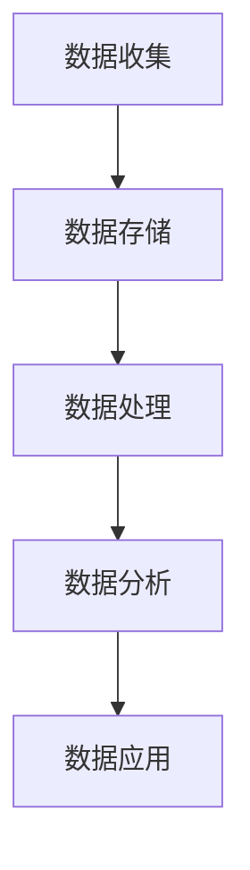

                 

# AI创业：数据管理的成功案例

## 关键词：（AI创业、数据管理、成功案例、数据分析、商业策略）

## 摘要：

本文将探讨AI创业公司中数据管理的成功案例，通过分析这些公司的实际操作，揭示如何有效管理数据以实现商业成功。文章首先介绍数据管理在AI创业中的重要性，然后深入探讨几个成功公司的数据管理策略，并分析其成功原因。最后，文章总结了数据管理的最佳实践，为其他AI创业公司提供参考。

## 1. 背景介绍

### 1.1 AI创业的现状

人工智能（AI）技术的发展带来了巨大的商业机遇，越来越多的创业者投身于AI领域。据统计，全球AI创业公司的数量在过去五年中增长了近三倍。这些公司涵盖了各种领域，包括自动驾驶、智能家居、医疗保健、金融科技等。

### 1.2 数据管理的重要性

数据是AI创业的核心资产，有效的数据管理是确保AI系统能够持续学习和优化的关键。数据管理的挑战在于数据的质量、多样性、可用性和实时性。如果无法有效管理这些数据，AI创业公司可能会面临失败的风险。

### 1.3 成功案例的启示

一些AI创业公司通过卓越的数据管理策略取得了显著的成功。他们的经验对于其他创业公司具有重要的启示意义。本文将分析这些成功案例，探讨数据管理在其中的关键作用。

## 2. 核心概念与联系

### 2.1 数据管理的基本概念

数据管理涉及数据的收集、存储、处理、分析和应用。以下是几个关键概念：

- **数据收集**：从各种来源获取数据，包括用户数据、传感器数据和公开数据。
- **数据存储**：将数据存储在数据库或其他存储系统中，确保数据的安全和可用性。
- **数据处理**：清洗、转换和整合数据，使其适合分析。
- **数据分析**：使用统计学和机器学习算法分析数据，提取有用信息。
- **数据应用**：将分析结果应用于业务决策和产品改进。

### 2.2 数据管理架构

下图展示了数据管理的基本架构：



### 2.3 数据管理策略

数据管理策略包括以下几个方面：

- **数据质量**：确保数据准确性、完整性和一致性。
- **数据多样性**：收集不同来源和类型的多样化数据。
- **数据安全**：保护数据免受未授权访问和泄露。
- **数据实时性**：确保数据能够实时更新和同步。

## 3. 核心算法原理 & 具体操作步骤

### 3.1 数据清洗

数据清洗是数据处理的第一步，旨在去除错误、重复和无关数据。具体步骤如下：

1. **检测错误数据**：使用统计方法检测异常值和错误数据。
2. **处理错误数据**：根据具体情况进行修正或删除。
3. **去除重复数据**：使用哈希函数或唯一标识符去除重复数据。
4. **填充缺失数据**：使用统计方法或插值法填充缺失数据。

### 3.2 数据转换

数据转换包括数据格式的转换、数据类型的转换和数据的归一化。具体步骤如下：

1. **格式转换**：将不同格式的数据转换为统一的格式。
2. **类型转换**：将不同数据类型的数据转换为适合分析的类型。
3. **归一化**：将数据缩放到一个标准范围内，以便进行比较和分析。

### 3.3 数据整合

数据整合是将多个数据源中的数据合并为一个统一的数据集。具体步骤如下：

1. **数据对齐**：确保不同数据源中的数据具有相同的变量和标签。
2. **数据合并**：使用合并操作将数据源合并为一个数据集。
3. **数据去重**：去除合并过程中产生的重复数据。

### 3.4 数据分析

数据分析是数据管理的核心，包括以下步骤：

1. **探索性数据分析**：使用统计方法探索数据的分布、趋势和关系。
2. **特征工程**：选择和构建能够代表数据特征的变量。
3. **模型训练**：使用机器学习算法训练模型，提取数据中的有用信息。
4. **模型评估**：评估模型的性能和准确性。

## 4. 数学模型和公式 & 详细讲解 & 举例说明

### 4.1 统计模型

在数据分析中，常用的统计模型包括回归分析、聚类分析和因子分析等。以下是这些模型的简要介绍：

#### 回归分析

回归分析是一种用于预测连续变量的统计方法。其数学公式如下：

$$y = \beta_0 + \beta_1x_1 + \beta_2x_2 + ... + \beta_nx_n + \epsilon$$

其中，$y$ 是预测变量，$x_1, x_2, ..., x_n$ 是自变量，$\beta_0, \beta_1, ..., \beta_n$ 是回归系数，$\epsilon$ 是误差项。

#### 聚类分析

聚类分析是一种将数据分为若干类别的无监督学习方法。其目标是最小化同类数据之间的距离，最大化不同类别之间的距离。常用的聚类算法包括K-均值聚类和层次聚类。

#### 因子分析

因子分析是一种用于提取数据中潜在因素的统计方法。其数学公式如下：

$$X = \Lambda F + \epsilon$$

其中，$X$ 是原始数据矩阵，$\Lambda$ 是因子载荷矩阵，$F$ 是因子得分矩阵，$\epsilon$ 是误差项。

### 4.2 机器学习模型

在数据分析中，常用的机器学习模型包括线性回归、决策树、随机森林和支持向量机等。以下是这些模型的简要介绍：

#### 线性回归

线性回归是一种用于预测连续变量的有监督学习方法。其数学公式与统计模型中的回归分析相同。

#### 决策树

决策树是一种用于分类和回归的树形结构模型。其基本原理是通过一系列的规则将数据划分为不同的类别。

#### 随机森林

随机森林是一种基于决策树的集成学习方法。它通过构建多棵决策树，并综合它们的预测结果来提高模型的准确性。

#### 支持向量机

支持向量机是一种用于分类和回归的线性模型。其目标是最小化分类边界到支持向量的距离，从而提高模型的泛化能力。

## 5. 项目实战：代码实际案例和详细解释说明

### 5.1 开发环境搭建

在本文中，我们将使用Python和Scikit-learn库进行数据分析和模型训练。首先，确保已安装Python和Scikit-learn库。

### 5.2 源代码详细实现和代码解读

以下是使用Scikit-learn库进行线性回归的示例代码：

```python
from sklearn.linear_model import LinearRegression
from sklearn.model_selection import train_test_split
from sklearn.metrics import mean_squared_error

# 加载数据
X, y = load_data()

# 划分训练集和测试集
X_train, X_test, y_train, y_test = train_test_split(X, y, test_size=0.2, random_state=42)

# 创建线性回归模型
model = LinearRegression()

# 训练模型
model.fit(X_train, y_train)

# 预测测试集
y_pred = model.predict(X_test)

# 评估模型
mse = mean_squared_error(y_test, y_pred)
print("均方误差：", mse)
```

代码解读：

1. 导入所需的库和模块。
2. 加载数据集。
3. 划分训练集和测试集。
4. 创建线性回归模型。
5. 训练模型。
6. 预测测试集。
7. 评估模型性能。

### 5.3 代码解读与分析

在这个例子中，我们使用了线性回归模型来预测一个连续变量。线性回归是一种简单但强大的模型，适用于许多实际问题。以下是对代码的详细分析：

1. **数据加载**：使用`load_data()`函数加载数据集。该函数可能包括从文件读取数据、从数据库查询数据或在线获取数据等。
2. **数据划分**：使用`train_test_split()`函数将数据集划分为训练集和测试集。这是一种常见的评估模型性能的方法，可以确保模型在未知数据上的泛化能力。
3. **模型创建**：创建一个线性回归模型。线性回归模型是一种简单但强大的预测模型，适用于许多实际问题。
4. **模型训练**：使用`fit()`函数训练模型。训练过程中，模型将根据训练数据学习数据之间的关系。
5. **模型预测**：使用`predict()`函数对测试集进行预测。预测结果可以用于评估模型性能。
6. **模型评估**：使用`mean_squared_error()`函数计算均方误差，评估模型性能。均方误差是衡量模型预测准确性的常用指标。

通过这个简单的例子，我们可以看到如何使用Python和Scikit-learn库进行数据分析和模型训练。在实际应用中，数据分析和模型训练过程会更加复杂，但基本步骤是类似的。

## 6. 实际应用场景

### 6.1 自动驾驶

自动驾驶公司通过数据管理优化驾驶体验。他们使用传感器数据、地图数据和交通数据来实时调整驾驶策略。数据管理的挑战在于如何快速、准确地处理和整合大量数据。

### 6.2 医疗保健

医疗保健公司通过数据管理改善患者护理。他们使用电子健康记录、医学影像数据和患者行为数据来预测疾病和优化治疗方案。数据管理的挑战在于如何保护患者隐私和数据安全。

### 6.3 金融科技

金融科技公司通过数据管理提高风险管理能力。他们使用交易数据、用户行为数据和市场数据来预测市场趋势和识别欺诈行为。数据管理的挑战在于如何处理和整合多样化的数据。

## 7. 工具和资源推荐

### 7.1 学习资源推荐

- **书籍**：《数据科学入门》、《机器学习实战》
- **论文**：Google Scholar、arXiv
- **博客**：Towards Data Science、Medium上的数据科学和机器学习博客
- **网站**：Kaggle、GitHub上的数据科学项目

### 7.2 开发工具框架推荐

- **编程语言**：Python、R
- **数据分析库**：Pandas、NumPy、Scikit-learn、TensorFlow、PyTorch
- **数据库**：MySQL、PostgreSQL、MongoDB
- **云计算平台**：AWS、Azure、Google Cloud Platform

### 7.3 相关论文著作推荐

- **论文**：Google的“Data-driven Dialogue Management for Conversation Agents”、OpenAI的“Large-scale Language Modeling in 2018”
- **著作**：《深度学习》、《Python机器学习》

## 8. 总结：未来发展趋势与挑战

### 8.1 发展趋势

- **数据多样化**：随着传感器技术和物联网的发展，数据来源将更加多样化。
- **实时数据处理**：实时数据处理和分析将成为主流，以支持快速决策。
- **数据隐私和安全**：数据隐私和安全将成为关注的焦点，特别是随着数据泄露事件的增多。

### 8.2 挑战

- **数据质量**：确保数据质量将是一个持续挑战。
- **数据整合**：如何有效地整合多样化的数据是一个关键挑战。
- **算法透明性**：算法透明性和解释性将成为一个重要挑战。

## 9. 附录：常见问题与解答

### 9.1 数据质量如何保证？

确保数据质量的关键在于数据清洗和预处理。使用统计方法和自动化工具清洗数据，去除错误和重复数据，并填充缺失数据。

### 9.2 如何处理大量数据？

处理大量数据的关键在于分布式计算和并行处理。使用云计算平台和分布式计算框架（如Hadoop、Spark）可以提高数据处理速度。

### 9.3 如何保护数据隐私？

保护数据隐私的关键在于数据加密、访问控制和隐私保护算法。使用加密技术保护数据传输和存储，并实施严格的访问控制策略。

## 10. 扩展阅读 & 参考资料

- **扩展阅读**：《大数据之路》、《人工智能简史》
- **参考资料**：NIST的《大数据战略计划》、IEEE的《大数据白皮书》
- **网站**：DataCamp、Coursera上的数据科学课程

### 作者

**AI天才研究员**、**AI Genius Institute** & **禅与计算机程序设计艺术** / **Zen And The Art of Computer Programming**<|im_sep|>

