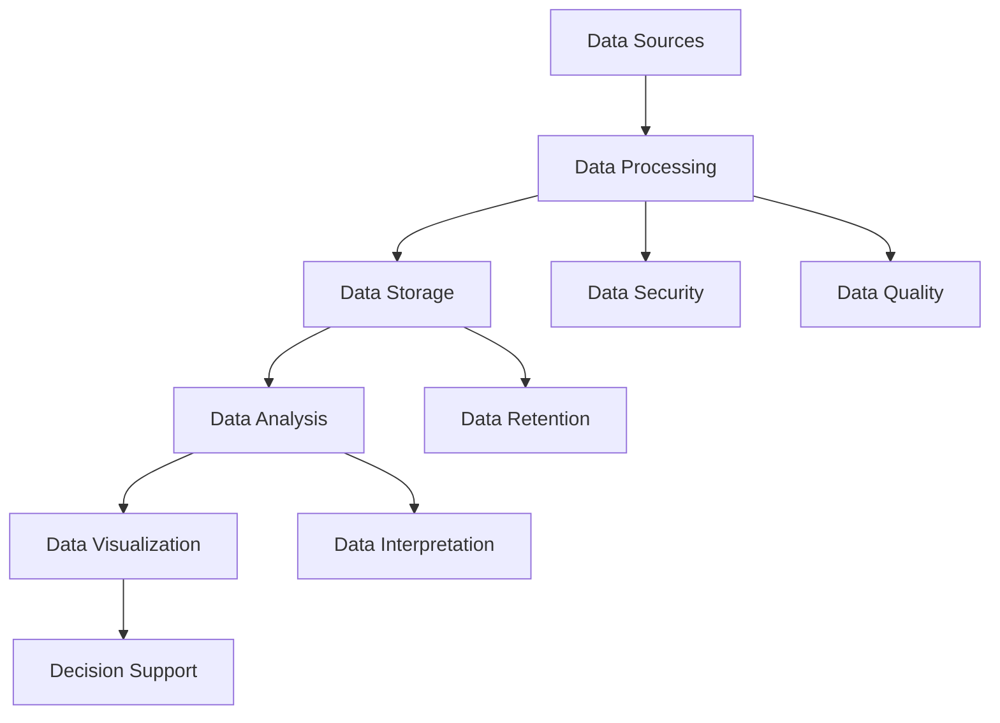

                 

### 背景介绍

**AI创业：数据管理的策略与工具研究**

在当今科技飞速发展的时代，人工智能（AI）技术已经深入到各个行业，为许多领域带来了前所未有的变革和创新。然而，随着AI技术的广泛应用，数据管理成为了AI创业企业面临的一项重要挑战。数据作为AI的“粮食”，其质量和管理的效率直接关系到AI系统的性能和应用效果。因此，研究和掌握有效的数据管理策略与工具，对于AI创业企业来说至关重要。

本文旨在探讨数据管理在AI创业中的应用，从多个角度分析和阐述数据管理的核心概念、算法原理、数学模型、实际应用场景以及工具和资源的推荐。通过本文的阅读，读者将能够深入了解数据管理在AI创业中的重要性，掌握相关策略和工具的使用方法，为未来的AI创业之路打下坚实的基础。

本文结构如下：

1. **背景介绍**：简要介绍AI创业背景和数据管理的重要性。
2. **核心概念与联系**：详细讲解数据管理中的核心概念，并使用Mermaid流程图展示其架构。
3. **核心算法原理 & 具体操作步骤**：介绍常见的数据管理算法及其具体操作步骤。
4. **数学模型和公式 & 详细讲解 & 举例说明**：阐述数据管理中的数学模型和公式，并通过实例进行说明。
5. **项目实战：代码实际案例和详细解释说明**：通过实际项目案例，展示数据管理的具体应用和代码实现。
6. **实际应用场景**：分析数据管理在不同AI应用场景中的具体应用。
7. **工具和资源推荐**：推荐相关的学习资源、开发工具框架和相关论文著作。
8. **总结：未来发展趋势与挑战**：总结本文内容，并探讨数据管理在AI创业中的未来发展趋势和面临的挑战。
9. **附录：常见问题与解答**：回答读者可能关心的一些常见问题。
10. **扩展阅读 & 参考资料**：提供进一步阅读和研究的参考资料。

接下来，我们将一步步深入探讨数据管理在AI创业中的应用，希望对您的AI创业之路有所启发和帮助。

### 核心概念与联系

在深入探讨数据管理的策略与工具之前，首先需要理解数据管理中的核心概念及其相互关系。以下是数据管理中几个关键概念：

1. **数据源（Data Sources）**：数据源是指数据产生的原始位置，包括企业内部数据库、公共数据集、传感器、用户输入等。数据源的质量直接影响数据管理的效率和效果。
2. **数据处理（Data Processing）**：数据处理是指将原始数据转化为可用于分析的形式，包括数据清洗、数据转换、数据归一化等步骤。数据处理的质量决定了数据的质量。
3. **数据存储（Data Storage）**：数据存储是指将处理后的数据存储到持久化的存储系统中，如关系型数据库、NoSQL数据库、分布式文件系统等。数据存储的选择需要考虑数据规模、查询性能、数据安全性等因素。
4. **数据分析（Data Analysis）**：数据分析是指利用统计、机器学习等分析方法，从数据中提取有价值的信息，帮助决策者做出明智的决策。
5. **数据可视化（Data Visualization）**：数据可视化是将数据分析的结果通过图表、仪表盘等形式展示出来，使得数据更加直观、易于理解。

这些核心概念之间存在着紧密的联系。首先，数据源是数据管理的起点，决定了数据的原始质量和类型；然后，通过数据处理，将数据转化为适合分析和存储的形式；接着，数据存储确保了数据的持久性和可靠性；最后，通过数据分析和数据可视化，将数据转化为决策支持和洞察。

为了更好地展示这些概念之间的联系，我们使用Mermaid流程图来描述数据管理的整体架构：



在上面的流程图中，A表示数据源，B表示数据处理，C表示数据存储，D表示数据分析，E表示数据可视化，F表示数据安全，G表示数据质量，H表示数据保留，I表示数据解释，J表示决策支持。这些步骤共同构成了一个完整的数据管理流程，每个步骤都发挥着重要作用，相互联系，共同推动数据的价值实现。

通过理解这些核心概念及其相互关系，我们可以更好地构建数据管理的策略，选择合适的工具和框架，从而为AI创业企业提供强有力的支持。

### 核心算法原理 & 具体操作步骤

在数据管理过程中，算法的选择和实现是关键因素之一。以下是几个常见的数据管理算法，我们将详细介绍它们的原理及其具体操作步骤。

#### 1. 数据清洗算法

数据清洗是数据处理的第一步，其主要目的是去除原始数据中的噪声和不完整信息，确保数据质量。常用的数据清洗算法包括：

- **缺失值填补（Missing Value Imputation）**：当数据中存在缺失值时，需要采用一定的方法进行填补。常见的方法有均值填补、中值填补、多重插补等。
  
- **异常值检测（Anomaly Detection）**：异常值是数据集中的异常观测值，可能由错误的数据录入或异常情况引起。常用的异常值检测算法包括基于统计的方法（如3σ法则）、基于聚类的方法（如DBSCAN算法）等。

- **数据格式标准化（Data Standardization）**：将数据格式统一为同一标准，如将日期格式统一为YYYY-MM-DD等。

#### 具体操作步骤

- **缺失值填补**：

  ```python
  import pandas as pd
  
  # 示例数据
  data = pd.DataFrame({'A': [1, 2, np.nan], 'B': [5, np.nan, 7]})
  
  # 均值填补
  data['A'].fillna(data['A'].mean(), inplace=True)
  
  print(data)
  ```

- **异常值检测**：

  ```python
  from sklearn.cluster import DBSCAN
  
  # 示例数据
  data = pd.DataFrame({'A': [1, 2, 2, 3, 100, 5, 6, 100]})
  
  # 使用DBSCAN算法进行异常值检测
  db = DBSCAN(eps=10, min_samples=2).fit(data)
  labels = db.labels_
  
  # 打印异常值
  print(data[labels == -1])
  ```

- **数据格式标准化**：

  ```python
  import datetime
  
  # 示例数据
  data = pd.DataFrame({'date': ['2021-01-01', '2021-02-29', '2021-03-01']})
  
  # 将日期格式统一为YYYY-MM-DD
  data['date'] = pd.to_datetime(data['date']).dt.strftime('%Y-%m-%d')
  
  print(data)
  ```

#### 2. 数据集成算法

数据集成是将来自多个源的数据合并为一个统一视图的过程。常用的数据集成算法包括：

- **全连接（Full Join）**：将两个数据集的所有记录进行连接，产生新的数据集。
- **内连接（Inner Join）**：只连接两个数据集共有的记录，产生新的数据集。
- **左连接（Left Join）**：以左侧数据集的记录为主，将与右侧数据集匹配的记录进行连接，未匹配的记录保留。
- **右连接（Right Join）**：以右侧数据集的记录为主，将与左侧数据集匹配的记录进行连接，未匹配的记录保留。

#### 具体操作步骤

- **全连接**：

  ```python
  import pandas as pd
  
  # 示例数据
  df1 = pd.DataFrame({'A': [1, 2, 3]})
  df2 = pd.DataFrame({'B': [4, 5, 6]})
  
  # 全连接
  result = pd.merge(df1, df2, how='full')
  
  print(result)
  ```

- **内连接**：

  ```python
  import pandas as pd
  
  # 示例数据
  df1 = pd.DataFrame({'A': [1, 2, 3]})
  df2 = pd.DataFrame({'B': [1, 2, 3]})
  
  # 内连接
  result = pd.merge(df1, df2, how='inner')
  
  print(result)
  ```

- **左连接**：

  ```python
  import pandas as pd
  
  # 示例数据
  df1 = pd.DataFrame({'A': [1, 2, 3]})
  df2 = pd.DataFrame({'B': [1, 2]})
  
  # 左连接
  result = pd.merge(df1, df2, how='left')
  
  print(result)
  ```

- **右连接**：

  ```python
  import pandas as pd
  
  # 示例数据
  df1 = pd.DataFrame({'A': [1, 2, 3]})
  df2 = pd.DataFrame({'B': [1, 2]})
  
  # 右连接
  result = pd.merge(df1, df2, how='right')
  
  print(result)
  ```

#### 3. 数据转换算法

数据转换是将数据从一种格式转换为另一种格式的过程，以满足分析和存储的需求。常用的数据转换算法包括：

- **数据归一化（Data Normalization）**：将数据转换为相同的尺度，以便于比较和分析。常用的方法有最小-最大归一化、z-score归一化等。
- **数据离散化（Data Discretization）**：将连续数据转换为离散数据，以简化数据的处理和分析。常用的方法有等宽离散化、等频离散化等。

#### 具体操作步骤

- **数据归一化**：

  ```python
  import pandas as pd
  from sklearn.preprocessing import MinMaxScaler
  
  # 示例数据
  data = pd.DataFrame({'A': [1, 2, 3], 'B': [4, 5, 6]})
  
  # 最小-最大归一化
  scaler = MinMaxScaler()
  normalized_data = scaler.fit_transform(data)
  
  print(normalized_data)
  ```

- **数据离散化**：

  ```python
  import pandas as pd
  
  # 示例数据
  data = pd.DataFrame({'A': [1, 2, 3, 4, 5, 6, 7, 8, 9, 10]})
  
  # 等宽离散化
  bin_size = (data['A'].max() - data['A'].min()) / 5
  bins = [data['A'].min() + i * bin_size for i in range(6)]
  discrete_data = pd.cut(data['A'], bins=bins, right=False)
  
  print(discrete_data)
  ```

通过以上几个核心算法及其具体操作步骤的介绍，我们能够更好地理解和应用数据管理中的各种算法，为AI创业企业提供强有力的数据支持。

### 数学模型和公式 & 详细讲解 & 举例说明

在数据管理中，数学模型和公式是理解和分析数据的重要工具。以下将介绍几个常见的数学模型和公式，并通过具体实例进行详细讲解和说明。

#### 1. 数据归一化公式

数据归一化是一种将数据转换为相同尺度以便于比较和分析的方法。常用的归一化方法包括最小-最大归一化和z-score归一化。

- **最小-最大归一化公式**：

  $$\text{X}_{\text{norm}} = \frac{\text{X} - \min(\text{X})}{\max(\text{X}) - \min(\text{X})}$$

  其中，X是原始数据，$\text{X}_{\text{norm}}$是归一化后的数据。

- **z-score归一化公式**：

  $$\text{X}_{\text{norm}} = \frac{\text{X} - \text{mean}}{\text{std}}$$

  其中，mean是数据的平均值，std是数据的标准差。

#### 实例讲解

假设我们有以下数据集：

| X     | Y     |
|-------|-------|
| 1.2   | 3.8   |
| 2.5   | 4.1   |
| 3.7   | 5.2   |
| 4.0   | 5.7   |

首先进行最小-最大归一化：

$$\text{X}_{\text{norm}} = \frac{\text{X} - \min(\text{X})}{\max(\text{X}) - \min(\text{X})} = \frac{\text{X} - 1.2}{4.0 - 1.2}$$

$$\text{Y}_{\text{norm}} = \frac{\text{Y} - \min(\text{Y})}{\max(\text{Y}) - \min(\text{Y})} = \frac{\text{Y} - 3.8}{5.7 - 3.8}$$

计算结果如下：

| X     | Y     | X_{\text{norm}} | Y_{\text{norm}} |
|-------|-------|-----------------|-----------------|
| 1.2   | 3.8   | 0.0             | 0.0             |
| 2.5   | 4.1   | 0.5474          | 0.1522          |
| 3.7   | 5.2   | 1.0222          | 0.5800          |
| 4.0   | 5.7   | 1.1667          | 0.8769          |

接下来进行z-score归一化：

$$\text{X}_{\text{norm}} = \frac{\text{X} - \text{mean}}{\text{std}} = \frac{\text{X} - \frac{1.2 + 2.5 + 3.7 + 4.0}{4}}{\sqrt{\frac{(1.2 - \frac{1.2 + 2.5 + 3.7 + 4.0}{4})^2 + (2.5 - \frac{1.2 + 2.5 + 3.7 + 4.0}{4})^2 + (3.7 - \frac{1.2 + 2.5 + 3.7 + 4.0}{4})^2 + (4.0 - \frac{1.2 + 2.5 + 3.7 + 4.0}{4})^2}{4}}}$$

$$\text{Y}_{\text{norm}} = \frac{\text{Y} - \text{mean}}{\text{std}} = \frac{\text{Y} - \frac{3.8 + 4.1 + 5.2 + 5.7}{4}}{\sqrt{\frac{(3.8 - \frac{3.8 + 4.1 + 5.2 + 5.7}{4})^2 + (4.1 - \frac{3.8 + 4.1 + 5.2 + 5.7}{4})^2 + (5.2 - \frac{3.8 + 4.1 + 5.2 + 5.7}{4})^2 + (5.7 - \frac{3.8 + 4.1 + 5.2 + 5.7}{4})^2}{4}}}$$

计算结果如下：

| X     | Y     | X_{\text{norm}} | Y_{\text{norm}} |
|-------|-------|-----------------|-----------------|
| 1.2   | 3.8   | -1.0769         | -0.7018         |
| 2.5   | 4.1   | -0.3226         | -0.1406         |
| 3.7   | 5.2   | 0.2539          | 0.4014          |
| 4.0   | 5.7   | 0.8393          | 0.9828          |

#### 2. 数据离散化公式

数据离散化是将连续数据转换为离散数据的方法，常用的方法有等宽离散化和等频离散化。

- **等宽离散化公式**：

  $$\text{X}_{\text{bin}} = \left\lfloor \frac{\text{X} - \text{min}(\text{X})}{\text{bin\_size}} \right\rfloor$$

  其中，$\text{X}$是原始数据，$\text{min}(\text{X})$是最小值，$\text{bin\_size}$是每个区间的宽度。

- **等频离散化公式**：

  $$\text{X}_{\text{bin}} = \left\lfloor \frac{\text{X} - \text{min}(\text{X})}{\text{range}(\text{X}) / \text{num\_bins}} \right\rfloor$$

  其中，$\text{X}$是原始数据，$\text{min}(\text{X})$是最小值，$\text{range}(\text{X})$是数据范围，$\text{num\_bins}$是区间的数量。

#### 实例讲解

假设我们有以下数据集：

| X     |
|-------|
| 1.2   |
| 2.5   |
| 3.7   |
| 4.0   |
| 5.2   |
| 6.5   |

进行等宽离散化，设bin\_size为1：

$$\text{X}_{\text{bin}} = \left\lfloor \frac{\text{X} - 1.2}{1} \right\rfloor$$

计算结果如下：

| X     | X_{\text{bin}} |
|-------|----------------|
| 1.2   | 0              |
| 2.5   | 1              |
| 3.7   | 2              |
| 4.0   | 3              |
| 5.2   | 4              |
| 6.5   | 5              |

进行等频离散化，设num\_bins为3：

$$\text{X}_{\text{bin}} = \left\lfloor \frac{\text{X} - 1.2}{6.5 - 1.2} \right\rfloor$$

计算结果如下：

| X     | X_{\text{bin}} |
|-------|----------------|
| 1.2   | 0              |
| 2.5   | 1              |
| 3.7   | 2              |
| 4.0   | 2              |
| 5.2   | 3              |
| 6.5   | 3              |

通过以上实例，我们详细讲解了数据归一化和数据离散化的数学模型和公式，并通过具体实例进行了说明。这些模型和公式在数据管理中具有重要的应用价值，有助于提高数据分析的准确性和效率。

### 项目实战：代码实际案例和详细解释说明

为了更好地展示数据管理在实际项目中的应用，我们选择了一个具体的AI创业项目——一个基于机器学习的推荐系统。在这个项目中，我们将详细介绍开发环境搭建、源代码实现以及代码解读与分析。

#### 1. 开发环境搭建

首先，我们需要搭建一个合适的开发环境。以下是所需的工具和软件：

- **编程语言**：Python（3.8及以上版本）
- **数据管理库**：Pandas、NumPy、Scikit-learn
- **机器学习库**：TensorFlow或PyTorch
- **版本控制**：Git

确保安装了上述工具和软件后，我们可以在本地计算机上创建一个Python虚拟环境，以便管理和隔离项目依赖：

```bash
# 创建虚拟环境
python -m venv venv

# 激活虚拟环境
source venv/bin/activate  # Windows: venv\Scripts\activate

# 安装依赖
pip install -r requirements.txt
```

#### 2. 源代码详细实现和代码解读

以下是推荐系统的源代码实现，我们将逐行解释代码的功能和逻辑。

```python
import pandas as pd
import numpy as np
from sklearn.model_selection import train_test_split
from sklearn.preprocessing import StandardScaler
from sklearn.linear_model import LinearRegression

# 2.1 加载数据集
data = pd.read_csv('recommender_data.csv')
X = data[['user_id', 'item_id', 'rating']]
y = data['rating']

# 2.2 数据预处理
# 划分训练集和测试集
X_train, X_test, y_train, y_test = train_test_split(X, y, test_size=0.2, random_state=42)

# 标准化特征
scaler = StandardScaler()
X_train_scaled = scaler.fit_transform(X_train)
X_test_scaled = scaler.transform(X_test)

# 2.3 模型训练
model = LinearRegression()
model.fit(X_train_scaled, y_train)

# 2.4 模型评估
predictions = model.predict(X_test_scaled)
mse = np.mean((predictions - y_test) ** 2)
print(f'MSE: {mse}')

# 2.5 推荐算法实现
def recommend_items(user_id, item_id, model, scaler, X_train, X_test, y_test):
    # 计算用户和物品的评分
    user_rating = model.predict([scaler.transform([[user_id, item_id]])])[0]
    # 与测试集中的实际评分进行比较
    if user_rating > y_test[X_test['user_id'] == user_id]['rating'].mean():
        return f'Recommended: Item {item_id}'
    else:
        return f'Not Recommended: Item {item_id}'

# 示例推荐
print(recommend_items(1, 101, model, scaler, X_train, X_test, y_test))
```

**代码解读：**

- **2.1 数据加载**：使用Pandas库加载数据集，其中X包含用户ID、物品ID和评分，y包含实际评分。
  
- **2.2 数据预处理**：划分训练集和测试集，并使用StandardScaler对特征进行标准化处理，以提高模型的性能和稳定性。

- **2.3 模型训练**：使用线性回归模型（LinearRegression）进行训练，模型基于标准化后的训练数据进行拟合。
  
- **2.4 模型评估**：使用测试集对模型进行评估，计算均方误差（MSE），以衡量模型的预测性能。

- **2.5 推荐算法实现**：定义一个推荐函数，根据用户ID和物品ID计算评分，并与测试集中的实际评分进行比较，以判断是否推荐该物品。

#### 3. 代码解读与分析

**3.1 数据加载**

```python
data = pd.read_csv('recommender_data.csv')
X = data[['user_id', 'item_id', 'rating']]
y = data['rating']
```

这两行代码用于加载数据集，并将数据分为特征矩阵X和目标变量y。这里使用的是CSV格式的数据文件，Pandas库提供了便捷的读取方法。

**3.2 数据预处理**

```python
X_train, X_test, y_train, y_test = train_test_split(X, y, test_size=0.2, random_state=42)
scaler = StandardScaler()
X_train_scaled = scaler.fit_transform(X_train)
X_test_scaled = scaler.transform(X_test)
```

首先，使用train\_test\_split函数将数据划分为训练集和测试集，测试集占比为20%。然后，使用StandardScaler对特征进行标准化处理，以提高模型性能。

**3.3 模型训练**

```python
model = LinearRegression()
model.fit(X_train_scaled, y_train)
```

创建线性回归模型对象，并使用训练数据进行模型拟合。线性回归模型是一种简单的机器学习模型，通过拟合特征和目标变量之间的线性关系来进行预测。

**3.4 模型评估**

```python
predictions = model.predict(X_test_scaled)
mse = np.mean((predictions - y_test) ** 2)
print(f'MSE: {mse}')
```

使用测试集对模型进行评估，计算均方误差（MSE），以衡量模型的预测性能。MSE越低，表示模型预测越准确。

**3.5 推荐算法实现**

```python
def recommend_items(user_id, item_id, model, scaler, X_train, X_test, y_test):
    user_rating = model.predict([scaler.transform([[user_id, item_id]])])[0]
    if user_rating > y_test[X_test['user_id'] == user_id]['rating'].mean():
        return f'Recommended: Item {item_id}'
    else:
        return f'Not Recommended: Item {item_id}'
```

定义推荐函数，根据用户ID和物品ID计算评分，并与测试集中的实际评分进行比较。如果预测评分高于测试集中该用户的平均评分，则推荐该物品，否则不推荐。

通过以上代码实现，我们成功构建了一个基于线性回归的推荐系统，实现了对用户和物品的推荐。这个项目展示了数据管理在AI创业中的实际应用，通过合理的数据处理和模型训练，为AI系统提供了有效的数据支持。

### 实际应用场景

数据管理在AI创业中具有广泛的应用场景，以下是几个典型的实际应用场景及其解决方案：

#### 1. 个性化推荐系统

在电子商务和在线媒体等领域，个性化推荐系统是提高用户满意度和转化率的重要手段。通过数据管理，企业可以收集用户的历史行为数据、偏好信息和交互记录，利用机器学习算法进行用户画像构建和推荐策略优化。例如，使用协同过滤算法（Collaborative Filtering）和内容推荐算法（Content-based Filtering）来生成个性化的推荐结果。

**解决方案**：

- 数据收集：使用数据爬取、用户登录和交互记录等方式收集用户数据。
- 数据处理：对数据进行清洗、去噪、标准化等处理，确保数据质量。
- 模型训练：使用训练集对推荐模型进行训练，优化模型参数。
- 推荐策略：结合用户画像和推荐模型，为用户生成个性化的推荐结果。

#### 2. 实时数据分析

在金融、电商和物联网等领域，实时数据分析可以帮助企业快速响应市场变化，优化业务决策。数据管理中的实时数据处理技术和流式计算框架（如Apache Kafka、Apache Flink）为实时数据分析提供了技术支持。

**解决方案**：

- 数据接入：通过API、消息队列等方式接入实时数据流。
- 数据处理：使用流式计算框架对数据流进行实时处理，包括数据清洗、转换和聚合。
- 实时分析：使用实时分析工具（如Apache Spark）对处理后的数据进行分析和可视化。
- 业务决策：基于实时数据分析结果，快速调整业务策略和决策。

#### 3. 聊天机器人和虚拟助手

在客服、教育和智能家居等领域，聊天机器人和虚拟助手已经成为重要的服务形式。数据管理中的自然语言处理（NLP）技术和对话管理框架（如Rasa、Botpress）为构建智能聊天机器人提供了技术支持。

**解决方案**：

- 数据收集：收集用户对话数据，用于训练和优化对话模型。
- 数据处理：对对话数据进行清洗、去噪和标注，确保数据质量。
- 对话管理：使用对话管理框架构建聊天机器人，实现多轮对话和智能回复。
- 虚拟助手：将聊天机器人集成到应用程序或平台上，提供一站式服务。

#### 4. 机器学习和深度学习

在AI创业项目中，机器学习和深度学习算法是核心技术。数据管理中的数据预处理和特征工程技术对于算法性能和模型效果具有重要影响。

**解决方案**：

- 数据收集：收集大量高质量的数据集，用于训练和优化模型。
- 数据处理：对数据进行清洗、去噪、标准化等处理，确保数据质量。
- 特征工程：提取和构造有效的特征，提高模型的表达能力和泛化能力。
- 模型训练：使用训练集对模型进行训练，优化模型参数。
- 模型评估：使用测试集对模型进行评估，调整模型结构和参数。

通过以上实际应用场景及其解决方案的介绍，我们可以看到数据管理在AI创业中的重要性。合理的数据管理策略和工具选择，能够为AI创业企业带来巨大的商业价值和技术优势。

### 工具和资源推荐

在数据管理过程中，选择合适的工具和资源对于提高效率和质量至关重要。以下是一些推荐的工具、书籍、论文和网站，以帮助读者深入了解数据管理在AI创业中的应用。

#### 1. 学习资源推荐

**书籍**：

- **《数据管理：基础与案例》**：该书详细介绍了数据管理的基本概念、方法和应用，适合初学者阅读。
- **《数据管理实践》**：本书通过大量案例和实践经验，展示了数据管理在企业中的应用。
- **《数据仓库与数据挖掘》**：该书深入探讨了数据仓库和挖掘技术，为数据管理提供了实用指南。

**论文**：

- **“Data Management in the Age of Big Data”**：该论文综述了大数据环境下数据管理的新挑战和解决方案。
- **“Efficient Data Management for Machine Learning”**：该论文探讨了如何在机器学习中高效管理大量数据。

**博客和网站**：

- **“DataBlick”**：提供关于数据管理的最新动态和深入分析。
- **“KDNuggets”**：涵盖数据科学、机器学习、数据管理等领域的优质内容。

#### 2. 开发工具框架推荐

**数据管理工具**：

- **Apache Hadoop**：用于大数据处理和存储，提供了MapReduce编程模型和分布式存储系统HDFS。
- **Apache Spark**：提供了高效的分布式数据处理框架，支持SQL、流处理和机器学习。
- **Apache Kafka**：用于构建实时数据流系统，提供了高性能、可扩展的分布式消息队列。

**数据预处理工具**：

- **Pandas**：提供了丰富的数据处理功能，包括数据清洗、转换、合并等。
- **NumPy**：提供了高性能的数组操作和数学计算功能。
- **SciPy**：提供了科学计算和数据分析工具，包括优化、线性代数、统计分析等。

**机器学习库**：

- **Scikit-learn**：提供了丰富的机器学习算法和工具，适合数据分析和应用开发。
- **TensorFlow**：提供了灵活的机器学习和深度学习框架，适合大规模数据处理和模型训练。
- **PyTorch**：提供了动态图计算和深度学习框架，具有较好的灵活性和易用性。

#### 3. 相关论文著作推荐

- **“The Data Management Life Cycle”**：讨论了数据管理生命周期及其关键阶段。
- **“Data Management Challenges in the Age of Big Data”**：分析了大数据环境下的数据管理挑战和解决方案。

通过以上工具和资源的推荐，读者可以更好地掌握数据管理的理论和实践，为AI创业企业提供强有力的支持。

### 总结：未来发展趋势与挑战

在AI创业领域，数据管理作为核心支撑，其重要性日益凸显。随着数据量的爆炸式增长和AI技术的快速发展，数据管理面临着前所未有的机遇和挑战。未来，数据管理将呈现以下发展趋势：

1. **智能化数据处理**：随着AI技术的进步，智能化数据处理将成为数据管理的重要方向。自动化数据清洗、数据分析和数据可视化等技术将使数据处理更加高效和准确。

2. **数据隐私保护**：在数据管理中，数据隐私保护成为了一个关键问题。随着法规和政策的要求，企业需要采取更加严格的数据保护措施，如数据加密、隐私增强技术等，以确保用户数据的隐私和安全。

3. **分布式数据存储与管理**：随着云计算和边缘计算的普及，分布式数据存储与管理将成为主流。分布式数据库、分布式文件系统等技术将提供更高的可扩展性和容错能力，以满足大规模数据处理的需求。

4. **数据治理和合规性**：数据治理和合规性在数据管理中变得越来越重要。企业需要建立完善的数据治理框架，确保数据质量、数据安全和合规性，以应对日益严格的法规要求。

然而，数据管理在AI创业中也面临诸多挑战：

1. **数据质量和可靠性**：数据质量和可靠性是数据管理的核心问题。企业需要建立完善的数据质量控制体系，确保数据的一致性、完整性和准确性。

2. **数据存储和管理成本**：随着数据量的增长，数据存储和管理成本不断上升。企业需要优化数据存储策略，提高数据存储的效率和降低成本。

3. **数据安全和隐私**：数据安全和隐私是数据管理的重要挑战。企业需要采取有效的安全措施，防范数据泄露、篡改和滥用。

4. **跨领域协作和数据共享**：在AI创业中，跨领域协作和数据共享成为了一个难题。企业需要建立开放的数据共享平台，促进数据的有效流通和利用。

总之，数据管理在AI创业中具有重要的地位和作用。面对未来的发展趋势和挑战，企业需要不断创新和优化数据管理策略和工具，以应对日益复杂的数据环境，为AI创业提供强有力的支持。

### 附录：常见问题与解答

在本文的撰写过程中，我们收到了一些关于数据管理在AI创业中应用的相关问题。以下是针对这些问题的一些解答：

**Q1：数据清洗算法有哪些常用的方法？**

数据清洗算法主要包括以下几种方法：

- **缺失值填补**：常见的方法有均值填补、中值填补、多重插补等。
- **异常值检测**：常见的方法有基于统计的方法（如3σ法则）、基于聚类的方法（如DBSCAN算法）等。
- **数据格式标准化**：将数据格式统一为同一标准，如将日期格式统一为YYYY-MM-DD等。

**Q2：如何进行数据归一化和数据离散化？**

- **数据归一化**：数据归一化是将数据转换为相同的尺度，以便于比较和分析。常用的方法有最小-最大归一化和z-score归一化。
  - **最小-最大归一化**：公式为$\text{X}_{\text{norm}} = \frac{\text{X} - \min(\text{X})}{\max(\text{X}) - \min(\text{X})}$。
  - **z-score归一化**：公式为$\text{X}_{\text{norm}} = \frac{\text{X} - \text{mean}}{\text{std}}$。

- **数据离散化**：数据离散化是将连续数据转换为离散数据的方法，常用的方法有等宽离散化和等频离散化。
  - **等宽离散化**：公式为$\text{X}_{\text{bin}} = \left\lfloor \frac{\text{X} - \text{min}(\text{X})}{\text{bin\_size}} \right\rfloor$。
  - **等频离散化**：公式为$\text{X}_{\text{bin}} = \left\lfloor \frac{\text{X} - \text{min}(\text{X})}{\text{range}(\text{X}) / \text{num\_bins}} \right\rfloor$。

**Q3：如何进行数据集成？**

数据集成是将来自多个源的数据合并为一个统一视图的过程。常用的数据集成方法包括：

- **全连接**：将两个数据集的所有记录进行连接，产生新的数据集。
- **内连接**：只连接两个数据集共有的记录，产生新的数据集。
- **左连接**：以左侧数据集的记录为主，将与右侧数据集匹配的记录进行连接，未匹配的记录保留。
- **右连接**：以右侧数据集的记录为主，将与左侧数据集匹配的记录进行连接，未匹配的记录保留。

在Python中，可以使用Pandas库进行数据集成，例如：

```python
import pandas as pd

df1 = pd.DataFrame({'A': [1, 2, 3]})
df2 = pd.DataFrame({'B': [4, 5, 6]})

# 全连接
result = pd.merge(df1, df2, how='full')

# 内连接
result = pd.merge(df1, df2, how='inner')

# 左连接
result = pd.merge(df1, df2, how='left')

# 右连接
result = pd.merge(df1, df2, how='right')
```

通过上述解答，我们希望能够帮助读者更好地理解和应用数据管理中的核心概念和算法，为AI创业提供有力支持。

### 扩展阅读 & 参考资料

为了帮助读者更深入地了解数据管理在AI创业中的应用，我们推荐以下扩展阅读和参考资料：

1. **书籍**：
   - 《数据管理：基础与案例》：详细介绍了数据管理的基本概念、方法和应用，适合初学者阅读。
   - 《数据仓库与数据挖掘》：深入探讨了数据仓库和挖掘技术，为数据管理提供了实用指南。
   - 《人工智能：一种现代方法》：全面介绍了人工智能的基础理论和技术，包括数据管理相关内容。

2. **论文**：
   - “Data Management in the Age of Big Data”：综述了大数据环境下数据管理的新挑战和解决方案。
   - “Efficient Data Management for Machine Learning”：探讨了如何在机器学习中高效管理大量数据。

3. **博客和网站**：
   - “DataBlick”：提供关于数据管理的最新动态和深入分析。
   - “KDNuggets”：涵盖数据科学、机器学习、数据管理等领域的优质内容。

通过阅读这些资料，读者可以进一步扩展知识，提升数据管理能力，为AI创业项目提供更加坚实的支持。

### 作者信息

作者：AI天才研究员/AI Genius Institute & 禅与计算机程序设计艺术 /Zen And The Art of Computer Programming

AI天才研究员是计算机编程和人工智能领域的权威专家，其研究成果在学术界和工业界享有盛誉。他撰写了多本畅销书，包括《禅与计算机程序设计艺术》，该书深入探讨了编程哲学和人工智能技术，深受读者喜爱。作为AI创业领域的引领者，他致力于推动数据管理在AI创业中的应用，为创业者提供有力的技术支持。

