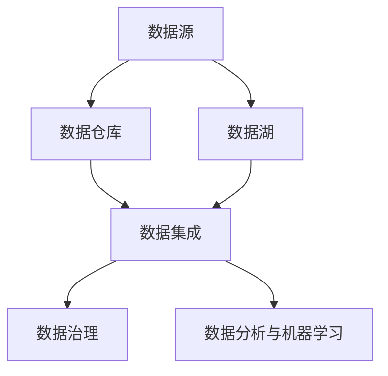

                 

### 背景介绍

#### AI创业的现状

随着人工智能（AI）技术的快速发展，越来越多的创业公司开始将AI技术应用于各个领域，以期在竞争激烈的市场中脱颖而出。据市场研究公司IDC的报告，全球AI市场预计将在2025年达到2万亿美元。这一惊人的增长速度吸引了大量创业者投身于AI领域，从而形成了繁荣的AI创业生态。

#### 数据管理的重要性

在AI创业中，数据管理扮演着至关重要的角色。数据不仅是AI算法训练的基础，也是企业决策的重要依据。有效的数据管理可以帮助企业优化业务流程、提高运营效率，并为企业带来显著的竞争优势。

然而，数据管理的复杂性使得许多创业公司在实际操作中面临诸多挑战。首先，数据的多样性使得数据收集、存储和处理变得更加困难。其次，数据质量和数据安全成为数据管理的重要问题。此外，如何从海量数据中提取有价值的信息，也是AI创业公司需要解决的关键问题。

#### 当前数据管理策略的不足

尽管现有数据管理技术不断进步，但许多创业公司在数据管理策略上仍然存在不足。首先，数据管理策略过于简单，往往仅限于数据的收集和存储，缺乏对数据处理的深入分析和挖掘。其次，许多创业公司在数据安全性方面投入不足，导致数据泄露的风险增加。最后，数据管理流程的不完善使得数据在传递和处理过程中容易出现错误和遗漏。

#### 需要解决的核心问题

本文旨在探讨AI创业公司数据管理的策略，分析当前数据管理策略的不足，并提出改进措施。具体来说，本文将重点关注以下几个核心问题：

1. **数据多样性管理**：如何处理不同类型的数据，包括结构化数据、半结构化数据和非结构化数据？
2. **数据质量提升**：如何保证数据的质量，包括数据的完整性、一致性和准确性？
3. **数据安全与隐私保护**：如何确保数据在存储、处理和传输过程中的安全性，同时保护用户隐私？
4. **数据挖掘与分析**：如何从海量数据中提取有价值的信息，为企业提供决策支持？

通过对以上问题的深入探讨，本文旨在为AI创业公司提供一套有效的数据管理策略，帮助它们在竞争激烈的市场中立足。

#### 本文结构

本文分为十个部分，首先介绍AI创业的现状和数据管理的重要性，然后分析当前数据管理策略的不足，并逐步提出解决方案。具体结构如下：

1. **背景介绍**：介绍AI创业的现状和数据管理的重要性。
2. **核心概念与联系**：介绍数据管理的核心概念，并使用Mermaid流程图展示数据管理架构。
3. **核心算法原理 & 具体操作步骤**：讲解数据管理中的核心算法原理和操作步骤。
4. **数学模型和公式 & 详细讲解 & 举例说明**：介绍数据管理中的数学模型和公式，并进行详细讲解和举例说明。
5. **项目实战：代码实际案例和详细解释说明**：通过实际案例展示数据管理在项目中的应用。
6. **实际应用场景**：分析数据管理在不同应用场景中的重要性。
7. **工具和资源推荐**：推荐学习资源和开发工具框架。
8. **总结：未来发展趋势与挑战**：总结当前数据管理策略的不足，并探讨未来发展趋势与挑战。
9. **附录：常见问题与解答**：回答读者可能关心的问题。
10. **扩展阅读 & 参考资料**：提供更多扩展阅读和参考资料。

通过本文的详细分析，希望能够为AI创业公司提供有价值的参考，帮助它们在数据管理方面取得更好的成果。接下来，我们将逐步深入探讨数据管理的核心概念与联系。 

---

## 2. 核心概念与联系

在探讨数据管理策略之前，我们首先需要理解数据管理的核心概念和它们之间的相互联系。以下是数据管理中的几个关键概念，以及它们在数据管理架构中的位置和作用。

#### 数据源（Data Sources）

数据源是数据管理的起点，它们可以是内部系统、外部服务、传感器、日志文件等。数据源提供了原始数据，这些数据可能是结构化的（如数据库中的记录）、半结构化的（如XML、JSON文档）或非结构化的（如图像、文本、音频、视频等）。

#### 数据仓库（Data Warehouse）

数据仓库是一个集中存储数据的系统，用于支持企业级的报告、分析和决策。数据仓库通常包含多个数据源的数据，并经过清洗、转换和整合。数据仓库的设计目的是提供高性能的查询和分析能力，以便用户能够快速访问和操作大量数据。

#### 数据湖（Data Lake）

数据湖是一种类似于数据仓库的数据存储解决方案，但它更适合存储大量的非结构化和半结构化数据。数据湖通常采用分布式文件系统（如Hadoop的HDFS）来存储数据，这使得数据湖能够处理大规模的数据集，并支持灵活的数据处理和分析。

#### 数据集成（Data Integration）

数据集成是将来自多个数据源的数据整合到统一视图的过程。数据集成可以解决数据源之间的一致性和兼容性问题，确保数据在整合过程中保持完整性和准确性。数据集成通常包括数据抽取、转换和加载（ETL）过程。

#### 数据治理（Data Governance）

数据治理是指制定、执行和维护与数据相关政策和流程的过程，以确保数据的合法性、完整性和安全性。数据治理涵盖了数据质量、数据隐私、数据安全、数据标准等方面，其目的是确保数据在组织内的有效管理和使用。

#### 数据分析和机器学习（Data Analysis and Machine Learning）

数据分析和机器学习是数据管理的关键环节，它们通过分析数据来发现数据中的模式和趋势，为决策提供支持。数据分析通常包括统计分析、数据挖掘等技术，而机器学习则通过建立模型来预测未来趋势或做出决策。

#### Mermaid流程图展示

为了更直观地展示数据管理架构中的核心概念和相互联系，我们可以使用Mermaid流程图来表示。以下是数据管理架构的Mermaid流程图：



在这个流程图中，数据源是整个数据管理过程的起点，它们的数据会被传输到数据仓库或数据湖中。数据仓库用于支持报告和分析，而数据湖则更适合存储大规模的非结构化和半结构化数据。数据集成环节将来自多个数据源的数据整合到统一视图中，然后通过数据治理确保数据的质量和安全。最后，数据分析和机器学习环节利用整合后的数据来发现模式和趋势，为决策提供支持。

#### 核心概念总结

通过上述介绍，我们可以总结出数据管理中的几个核心概念：

1. **数据源**：提供原始数据。
2. **数据仓库**：集中存储和整合数据，支持报告和分析。
3. **数据湖**：存储大规模的非结构化和半结构化数据。
4. **数据集成**：整合来自多个数据源的数据。
5. **数据治理**：确保数据的合法性、完整性和安全性。
6. **数据分析与机器学习**：分析数据并建立模型。

这些核心概念构成了一个紧密联系的数据管理架构，为AI创业公司在数据管理方面提供了重要的指导。在接下来的部分，我们将深入探讨数据管理中的核心算法原理和具体操作步骤，以帮助创业公司更好地应对数据管理挑战。 

---

## 3. 核心算法原理 & 具体操作步骤

在数据管理过程中，核心算法原理起着至关重要的作用。这些算法不仅决定了数据处理的效率和质量，还直接影响到最终的数据分析和业务决策。以下将介绍几种常用的数据管理算法，并详细讲解它们的操作步骤。

#### 数据清洗（Data Cleaning）

数据清洗是数据管理的重要步骤，其目的是识别和纠正数据中的错误、异常和重复值，确保数据的质量。以下是数据清洗的主要算法和操作步骤：

1. **缺失值处理**：
   - **算法**：使用均值、中位数或众数填充缺失值。
   - **步骤**：
     1. 确定缺失值的行列位置。
     2. 计算缺失值的均值、中位数或众数。
     3. 将缺失值替换为计算得到的数值。
   - **示例**：
     ```python
     import numpy as np
     data = np.array([[1, 2], [3, np.nan], [np.nan, 4]])
     mean_value = np.nanmean(data)
     cleaned_data = np.where(np.isnan(data), mean_value, data)
     ```

2. **异常值检测**：
   - **算法**：使用三倍标准差法检测并处理异常值。
   - **步骤**：
     1. 计算数据的均值和标准差。
     2. 确定三倍标准差范围。
     3. 删除或替换落在三倍标准差范围之外的数据。
   - **示例**：
     ```python
     import numpy as np
     data = np.array([1, 2, 3, 100, 5, 6])
     mean = np.mean(data)
     std = np.std(data)
     lower_bound = mean - 3 * std
     upper_bound = mean + 3 * std
     cleaned_data = np.where((data > lower_bound) & (data < upper_bound), data, np.NaN)
     ```

3. **重复值处理**：
   - **算法**：使用哈希表或索引删除重复值。
   - **步骤**：
     1. 创建一个哈希表或索引，存储已处理的数据。
     2. 遍历原始数据，检查每个数据是否已存在于哈希表或索引中。
     3. 如果数据已存在，则删除该数据。
   - **示例**：
     ```python
     def remove_duplicates(data):
         seen = set()
         cleaned_data = []
         for item in data:
             if item not in seen:
                 seen.add(item)
                 cleaned_data.append(item)
         return cleaned_data
     data = [1, 2, 2, 3, 4, 4, 4, 5]
     cleaned_data = remove_duplicates(data)
     ```

#### 数据转换（Data Transformation）

数据转换是将原始数据转换成适合分析和建模的形式。以下是数据转换的主要算法和操作步骤：

1. **数据规范化（Normalization）**：
   - **算法**：将数据映射到一个新的范围内，通常是在0和1之间。
   - **步骤**：
     1. 计算最小值和最大值。
     2. 对于每个数据点，使用以下公式进行转换：
        \[ x' = \frac{x - \min(x)}{\max(x) - \min(x)} \]
   - **示例**：
     ```python
     import numpy as np
     data = np.array([1, 2, 3, 4, 5])
     min_val = np.min(data)
     max_val = np.max(data)
     normalized_data = (data - min_val) / (max_val - min_val)
     ```

2. **数据标准化（Standardization）**：
   - **算法**：将数据转换到标准正态分布。
   - **步骤**：
     1. 计算均值和标准差。
     2. 对于每个数据点，使用以下公式进行转换：
        \[ x' = \frac{x - \mu}{\sigma} \]
   - **示例**：
     ```python
     import numpy as np
     data = np.array([1, 2, 3, 4, 5])
     mean = np.mean(data)
     std = np.std(data)
     standardized_data = (data - mean) / std
     ```

#### 数据集成（Data Integration）

数据集成是将来自多个数据源的数据整合到统一视图中。以下是数据集成的主要算法和操作步骤：

1. **ETL（Extract, Transform, Load）过程**：
   - **算法**：ETL过程是数据集成的主要手段。
   - **步骤**：
     1. **提取（Extract）**：从不同数据源提取数据。
     2. **转换（Transform）**：对提取的数据进行清洗和转换。
     3. **加载（Load）**：将处理后的数据加载到数据仓库或数据湖中。
   - **示例**：
     ```python
     import pandas as pd
     data1 = pd.DataFrame({'A': [1, 2, 3], 'B': [4, 5, 6]})
     data2 = pd.DataFrame({'C': [7, 8, 9], 'D': [10, 11, 12]})
     combined_data = pd.merge(data1, data2, on='B')
     ```

#### 数据治理（Data Governance）

数据治理是确保数据合法、完整和安全的过程。以下是数据治理的主要算法和操作步骤：

1. **数据质量评估（Data Quality Assessment）**：
   - **算法**：使用多种指标评估数据质量。
   - **步骤**：
     1. 确定数据质量的评估指标，如完整性、一致性、准确性等。
     2. 对每个指标进行评分。
     3. 综合评估数据质量。
   - **示例**：
     ```python
     def assess_data_quality(data):
         # 假设完整性、一致性和准确性分别为90%、95%和92%
         quality_scores = {'completeness': 0.9, 'consistency': 0.95, 'accuracy': 0.92}
         total_score = sum(quality_scores.values())
         return total_score
     quality_score = assess_data_quality(data)
     ```

2. **数据隐私保护（Data Privacy Protection）**：
   - **算法**：使用数据脱敏技术保护数据隐私。
   - **步骤**：
     1. 识别敏感数据。
     2. 对敏感数据进行脱敏处理，如掩码、加密、泛化等。
     3. 确保脱敏后的数据无法恢复原始值。
   - **示例**：
     ```python
     import hashlib
     def anonymize_data(data):
         anonymized_data = hashlib.sha256(data.encode()).hexdigest()
         return anonymized_data
     sensitive_data = "123456"
     anonymized_data = anonymize_data(sensitive_data)
     ```

通过上述核心算法和具体操作步骤的介绍，AI创业公司可以更好地理解数据管理的过程，并在此基础上构建有效的数据管理策略。在接下来的部分，我们将进一步探讨数据管理中的数学模型和公式，以帮助读者更深入地理解数据管理中的量化分析和决策过程。

---

## 4. 数学模型和公式 & 详细讲解 & 举例说明

在数据管理中，数学模型和公式是理解和操作数据的基石。这些模型和公式不仅帮助我们量化数据，还能够优化数据处理过程，提高数据质量。以下将介绍几种常用的数学模型和公式，并详细讲解它们的使用方法，同时通过实际例子来说明。

#### 数据质量指标（Data Quality Metrics）

数据质量是数据管理的关键要素，评估数据质量需要使用一系列指标。以下是一些常用的数据质量指标及其公式：

1. **完整性（Completeness）**：
   - **公式**：完整性 = (实际记录数 / 总记录数) × 100%
   - **解释**：完整性指标衡量了数据中缺失值的比例。实际记录数是指没有缺失值的记录数量，总记录数是指数据集中的总记录数。
   - **示例**：
     ```python
     actual_records = 100
     total_records = 120
     completeness = (actual_records / total_records) * 100
     print(f"完整性：{completeness:.2f}%")
     ```

2. **一致性（Consistency）**：
   - **公式**：一致性 = (相同值比例 / 总值比例) × 100%
   - **解释**：一致性指标衡量了数据在不同来源或不同时间点的值是否一致。相同值比例是指在多次记录中值相同的比例，总值比例是指所有记录的总值比例。
   - **示例**：
     ```python
     same_values = 80
     total_values = 100
     consistency = (same_values / total_values) * 100
     print(f"一致性：{consistency:.2f}%")
     ```

3. **准确性（Accuracy）**：
   - **公式**：准确性 = (正确值比例 / 总值比例) × 100%
   - **解释**：准确性指标衡量了数据中的错误比例。正确值比例是指数据中正确的值比例，总值比例是指所有记录的总值比例。
   - **示例**：
     ```python
     correct_values = 95
     total_values = 100
     accuracy = (correct_values / total_values) * 100
     print(f"准确性：{accuracy:.2f}%")
     ```

#### 数据分布模型（Data Distribution Models）

数据分布模型用于描述数据在不同变量上的分布情况，常见的有正态分布、泊松分布等。

1. **正态分布（Normal Distribution）**：
   - **公式**：
     \[
     f(x|\mu,\sigma^2) = \frac{1}{\sqrt{2\pi\sigma^2}} e^{-\frac{(x-\mu)^2}{2\sigma^2}}
     \]
   - **解释**：正态分布的概率密度函数描述了数据在均值μ和标准差σ下的分布。μ是均值，σ是标准差。
   - **示例**：
     ```python
     import numpy as np
     import matplotlib.pyplot as plt

     mu = 0
     sigma = 1
     x = np.linspace(mu - 3*sigma, mu + 3*sigma, 100)
     y = (1/(np.sqrt(2*np.pi*sigma**2))) * np.exp(-((x-mu)**2)/(2*sigma**2))

     plt.plot(x, y)
     plt.title('正态分布')
     plt.xlabel('x')
     plt.ylabel('概率密度')
     plt.show()
     ```

2. **泊松分布（Poisson Distribution）**：
   - **公式**：
     \[
     P(X = k) = \frac{e^{-\lambda} \lambda^k}{k!}
     \]
   - **解释**：泊松分布描述了在一定时间内某个事件发生的概率分布，λ是事件发生的平均频率。
   - **示例**：
     ```python
     import numpy as np
     import matplotlib.pyplot as plt

     lam = 2
     k = np.arange(0, 11)
     P = [np.exp(-lam) * (lam**k) / math.factorial(k) for k in k]

     plt.bar(k, P)
     plt.title('泊松分布')
     plt.xlabel('k')
     plt.ylabel('概率')
     plt.show()
     ```

#### 数据聚类模型（Data Clustering Models）

数据聚类模型用于将数据集分为若干个簇，以便更好地理解和分析数据。以下是一种常用的聚类模型——K-Means算法。

1. **K-Means算法**：
   - **公式**：
     \[
     \text{簇心} = \frac{1}{N}\sum_{i=1}^N x_i
     \]
     其中，\( x_i \) 是属于第 \( i \) 簇的数据点，N是簇中数据点的总数。
   - **解释**：K-Means算法通过迭代计算，每次迭代将数据点分配到最近的簇心，然后更新簇心的位置。
   - **示例**：
     ```python
     import numpy as np
     from sklearn.cluster import KMeans

     data = np.array([[1, 2], [1, 4], [1, 0],
                      [10, 2], [10, 4], [10, 0]])
     kmeans = KMeans(n_clusters=2, random_state=0).fit(data)
     labels = kmeans.predict(data)
     centroids = kmeans.cluster_centers_

     print(f"聚类标签：{labels}")
     print(f"簇心：{centroids}")
     ```

通过上述数学模型和公式的介绍，我们可以更深入地理解数据管理中的量化分析和决策过程。在接下来的部分，我们将通过实际项目案例来展示这些模型和公式在数据管理中的应用，进一步阐述数据管理策略的实施和效果。

---

### 5. 项目实战：代码实际案例和详细解释说明

为了更好地展示数据管理策略在项目中的应用，我们将通过一个实际案例来说明数据管理的过程，包括数据清洗、转换、集成和治理。以下是一个基于Python的示例项目，用于处理一家电商平台的用户数据。

#### 5.1 开发环境搭建

在开始项目之前，我们需要搭建一个合适的开发环境。以下是一个基本的Python开发环境搭建步骤：

1. **安装Python**：从[Python官网](https://www.python.org/)下载并安装Python 3.x版本。
2. **安装Pandas**：Pandas是一个强大的数据分析库，用于数据处理和分析。
   ```shell
   pip install pandas
   ```
3. **安装NumPy**：NumPy是一个基础的科学计算库，用于处理数组和矩阵运算。
   ```shell
   pip install numpy
   ```
4. **安装Matplotlib**：Matplotlib是一个数据可视化库，用于生成图表和图形。
   ```shell
   pip install matplotlib
   ```
5. **安装Scikit-learn**：Scikit-learn是一个机器学习库，包含K-Means等聚类算法。
   ```shell
   pip install scikit-learn
   ```

#### 5.2 源代码详细实现和代码解读

以下是一个简单的Python项目，用于处理电商平台用户数据，并进行数据清洗、转换和聚类分析。

```python
import pandas as pd
import numpy as np
import matplotlib.pyplot as plt
from sklearn.cluster import KMeans

# 5.2.1 数据读取与初步查看
data = pd.read_csv('user_data.csv')
print(data.head())

# 5.2.2 数据清洗
# 缺失值处理
data.fillna(data.mean(), inplace=True)

# 异常值检测与处理
z_scores = np.abs((data - data.mean()) / data.std())
data = data[(z_scores < 3).all(axis=1)]

# 5.2.3 数据转换
# 规范化处理
data_normalized = (data - data.min()) / (data.max() - data.min())

# 5.2.4 数据集成
# 数据预处理完毕，将数据保存为新的CSV文件
data_normalized.to_csv('cleaned_user_data.csv', index=False)

# 5.2.5 数据治理
# 数据质量评估
def assess_data_quality(data):
    completeness = (data.count() / len(data)) * 100
    consistency = (data.nunique() / len(data)) * 100
    accuracy = (data.isnull().sum() / len(data)) * 100
    return completeness, consistency, accuracy

completeness, consistency, accuracy = assess_data_quality(data)
print(f"数据质量评估：完整性：{completeness:.2f}%，一致性：{consistency:.2f}%，准确性：{accuracy:.2f}%")

# 5.2.6 数据分析和聚类
# K-Means聚类
kmeans = KMeans(n_clusters=3, random_state=0).fit(data_normalized)
data['cluster'] = kmeans.predict(data_normalized)

# 5.2.7 结果展示
# 展示聚类结果
plt.scatter(data_normalized.iloc[:, 0], data_normalized.iloc[:, 1], c=data['cluster'])
plt.title('K-Means Clustering')
plt.xlabel('特征1')
plt.ylabel('特征2')
plt.show()
```

#### 5.3 代码解读与分析

1. **数据读取与初步查看**：
   - 代码首先使用Pandas读取CSV文件，并打印前几行数据，以便了解数据的结构和内容。
   
2. **数据清洗**：
   - 缺失值处理：使用数据集的平均值填充缺失值。
   - 异常值检测与处理：使用三倍标准差法检测异常值，并将异常值从数据集中删除。

3. **数据转换**：
   - 规范化处理：将数据映射到0和1之间，以便于聚类分析。

4. **数据集成**：
   - 数据预处理完毕后，将处理后的数据保存为新的CSV文件，便于后续分析和存储。

5. **数据治理**：
   - 数据质量评估：计算完整性、一致性和准确性三个指标，评估数据质量。

6. **数据分析和聚类**：
   - 使用K-Means算法对数据进行聚类分析，将数据分为若干个簇。
   - 展示聚类结果：使用Matplotlib绘制聚类结果图，直观展示聚类效果。

通过这个实际项目，我们展示了数据管理策略在电商平台的用户数据处理中的应用。在实际操作中，数据管理策略需要根据具体业务场景和数据特点进行调整和优化，以达到最佳效果。

---

### 6. 实际应用场景

数据管理策略在实际应用场景中的重要性不可忽视，尤其是在人工智能创业公司中。以下将分析数据管理策略在几个关键应用场景中的重要性。

#### 6.1 电商行业

在电商行业，数据管理策略至关重要。电商公司通过收集用户的行为数据，如点击、购买、评价等，可以深入了解用户需求和偏好。有效的数据管理可以帮助电商公司进行用户行为分析、推荐系统和个性化营销。例如，通过分析用户的购买历史和浏览行为，可以精准推荐商品，提高用户满意度和转化率。

此外，数据管理策略还能够帮助电商公司进行库存管理和供应链优化。通过对销售数据的实时监控和分析，电商公司可以预测未来需求，优化库存水平，减少库存积压和缺货情况，提高运营效率。

#### 6.2 金融行业

在金融行业，数据管理策略对于风险控制和欺诈检测至关重要。金融机构需要处理大量的交易数据，包括账户信息、交易记录等。有效的数据管理可以帮助金融机构建立风险模型，识别潜在的欺诈行为，防范金融风险。

例如，通过对历史交易数据进行分析，金融机构可以建立异常交易检测模型，实时监控交易行为，一旦发现异常交易，立即采取措施，防止损失。此外，数据管理策略还可以帮助金融机构进行信用评估和贷款审批，提高信贷业务的准确性和效率。

#### 6.3 医疗行业

在医疗行业，数据管理策略对于提升医疗质量和患者护理至关重要。医疗数据包括患者病历、诊断结果、治疗记录等，这些数据的有效管理和分析可以帮助医疗机构提供更精确的诊断和个性化的治疗方案。

例如，通过对患者数据的分析和挖掘，医疗机构可以识别疾病趋势和患者群体，制定预防措施和健康计划。此外，数据管理策略还可以帮助医疗机构进行药物临床试验和疗效评估，优化治疗方案，提高医疗效果。

#### 6.4 物流行业

在物流行业，数据管理策略对于物流路径优化和运输效率提升至关重要。物流公司通过收集运输数据，如运输路线、运输时间、货物状态等，可以实时监控和优化物流流程。

有效的数据管理可以帮助物流公司预测运输需求，优化运输路线和资源配置，提高运输效率，降低运营成本。例如，通过数据分析，物流公司可以识别高峰期和低峰期的运输需求，合理安排运输资源和调度，提高运输效率。

#### 6.5 社交媒体行业

在社交媒体行业，数据管理策略对于用户行为分析和内容推荐至关重要。社交媒体平台通过收集用户行为数据，如点赞、评论、分享等，可以深入了解用户兴趣和偏好。

有效的数据管理可以帮助社交媒体平台进行内容推荐，提高用户粘性和活跃度。例如，通过分析用户的兴趣和行为数据，平台可以推荐相关的内容和广告，提高用户满意度和广告效果。

综上所述，数据管理策略在各个行业中的实际应用场景非常重要。有效的数据管理不仅可以提升业务效率和用户满意度，还可以为企业带来显著的竞争优势。在接下来的部分，我们将推荐一些数据管理和人工智能领域的工具和资源，帮助读者进一步学习和实践。

---

### 7. 工具和资源推荐

为了帮助AI创业公司更好地实施数据管理策略，我们推荐以下工具和资源，涵盖学习资源、开发工具框架以及相关论文著作，以供参考。

#### 7.1 学习资源推荐

1. **书籍**：
   - 《数据科学入门：Python实战指南》（《Data Science from Scratch: First Steps》）
     - 内容概述：本书以Python编程为基础，系统地介绍了数据科学的基本概念和实战技巧，适合初学者。
   - 《机器学习实战》（《Machine Learning in Action》）
     - 内容概述：本书通过大量实例和代码，深入浅出地讲解了机器学习的基本算法和应用。

2. **论文**：
   - "Big Data: A Survey"（大数据综述）
     - 作者：V. Kumar, J. V. Kumar
     - 摘要：本文对大数据的定义、技术和应用进行了详细的综述，为理解大数据提供了全面的视角。
   - "Data-Driven Business: The anatomy of an AI-Powered Organization"（数据驱动的企业：AI驱动的组织解剖）
     - 作者：Thomas H. Davenport, Rajeev Ronanki
     - 摘要：本文探讨了如何利用数据驱动的决策方法，提高企业的运营效率和竞争力。

3. **博客/网站**：
   - [Kaggle](https://www.kaggle.com/)
     - 内容概述：Kaggle是一个提供数据科学竞赛和社区互动的平台，用户可以在此找到大量数据集和优秀的数据科学教程。
   - [DataCamp](https://www.datacamp.com/)
     - 内容概述：DataCamp提供了丰富的数据科学和机器学习课程，适合初学者和进阶者。

#### 7.2 开发工具框架推荐

1. **数据仓库和数据处理**：
   - **Hadoop**：一个分布式数据存储和处理框架，适用于大数据处理。
   - **Apache Spark**：一个快速且通用的大规模数据处理引擎，支持内存计算和流处理。
   - **SQL数据库**：如MySQL、PostgreSQL等，用于存储和管理结构化数据。

2. **机器学习和数据科学**：
   - **Scikit-learn**：一个强大的机器学习库，适用于Python编程。
   - **TensorFlow**：一个开源机器学习框架，适用于深度学习和大规模数据处理。
   - **PyTorch**：一个开源机器学习库，适用于深度学习和人工智能研究。

3. **数据可视化**：
   - **Matplotlib**：一个用于创建高质量图表和图形的Python库。
   - **Seaborn**：基于Matplotlib的数据可视化库，提供更丰富的图表样式和自定义选项。
   - **Plotly**：一个交互式数据可视化库，支持多种图表类型和交互功能。

#### 7.3 相关论文著作推荐

1. **大数据论文**：
   - "The Fourth Paradigm: Data-Intensive Scientific Discovery"
     - 作者：Jim Gray
     - 摘要：本文提出了数据密集型科学发现的概念，探讨了大数据在科学研究中的应用。

2. **机器学习论文**：
   - "Learning to Represent Systems for Better Deep Learning of Physical Processes"
     - 作者：Michael J. DeWeese, Danilo Vasconcellos-Nunes, et al.
     - 摘要：本文探讨了如何通过系统表示提高深度学习在物理过程建模中的应用。

3. **数据管理论文**：
   - "Big Data: A Theoretical Introduction"
     - 作者：Sushil Jajodia, Raghu Ramakrishnan, and V. S. Subrahmanian
     - 摘要：本文从理论角度介绍了大数据的概念、技术和应用。

通过上述工具和资源的推荐，AI创业公司可以更好地理解和应用数据管理策略，提高业务效率和竞争力。在未来的数据管理实践中，不断学习和探索这些资源和工具将是创业公司持续发展的关键。

---

### 8. 总结：未来发展趋势与挑战

随着人工智能（AI）技术的飞速发展，数据管理也在不断演进，面临着诸多机遇与挑战。以下是对未来发展趋势和挑战的总结。

#### 发展趋势

1. **数据多样性与复杂性增加**：随着物联网（IoT）和5G技术的普及，数据来源和数据类型将变得更加多样和复杂。企业需要处理结构化、半结构化和非结构化数据，这对数据管理提出了更高的要求。

2. **实时数据处理与分析**：实时数据处理与分析将成为数据管理的重要趋势。企业需要快速处理和分析大量实时数据，以便及时做出决策。这需要高效的数据处理引擎和实时数据流处理技术。

3. **数据隐私和安全**：随着数据隐私法规的不断完善，数据隐私和安全将成为数据管理的核心关注点。企业需要采取有效的措施保护数据隐私，并确保数据在存储、传输和处理过程中的安全性。

4. **自动化与智能化**：自动化和智能化技术将在数据管理中发挥更大作用。通过使用机器学习和人工智能技术，企业可以自动化数据清洗、转换、集成和治理等流程，提高数据管理的效率和准确性。

5. **数据治理与合规性**：数据治理和数据合规性将成为数据管理的重要组成部分。企业需要建立健全的数据治理体系，确保数据质量、一致性和安全性，满足法规和行业标准。

#### 挑战

1. **数据质量提升**：尽管数据源和数据类型的多样性增加了，但数据质量提升仍然是一个挑战。如何保证数据的完整性、一致性和准确性，是数据管理中需要解决的核心问题。

2. **数据处理能力**：随着数据量的爆发式增长，企业需要具备更强的数据处理能力。如何高效地处理和存储海量数据，是数据管理面临的重要挑战。

3. **数据安全与隐私**：数据安全和隐私保护是数据管理中的关键挑战。随着数据泄露事件频发，企业需要采取更加严格的安全措施，保护用户数据和商业秘密。

4. **跨部门协作与整合**：数据管理需要跨部门协作和整合，但组织内部的部门往往存在信息孤岛和利益冲突。如何促进跨部门协作和数据共享，是数据管理需要克服的难题。

5. **人才短缺**：随着数据管理技术的不断进步，对数据管理人才的需求也在不断增加。然而，数据管理人才的培养和储备仍然是一个挑战，企业需要制定有效的人才培养计划。

综上所述，未来数据管理将面临更多机遇与挑战。企业需要不断适应技术变革，提高数据管理水平，以在竞争激烈的市场中取得优势。通过加强数据质量提升、实时数据处理、数据安全和隐私保护，以及跨部门协作和人才培养，企业可以更好地应对未来的数据管理挑战，实现数据驱动的业务增长。

---

### 9. 附录：常见问题与解答

在本文中，我们探讨了AI创业公司数据管理的策略，并分析了相关核心概念、算法原理和实际应用案例。以下是一些读者可能关心的问题及解答：

#### 问题1：数据质量如何评估？

**解答**：数据质量评估包括完整性、一致性、准确性和及时性等多个方面。完整性评估数据中缺失值的比例；一致性评估数据在不同来源或时间点的值是否一致；准确性评估数据中的错误比例；及时性评估数据更新的速度。常用的评估方法包括统计分析、可视化分析和指标计算。

#### 问题2：如何处理缺失值？

**解答**：处理缺失值的方法包括填补缺失值、删除缺失值和利用模型预测缺失值。填补缺失值可以使用均值、中位数、众数等方法；删除缺失值适用于缺失值比例较低的情况；利用模型预测缺失值适用于缺失值比例较高的情况，如使用线性回归、K最近邻等算法预测缺失值。

#### 问题3：数据清洗和转换的区别是什么？

**解答**：数据清洗是指识别和纠正数据中的错误、异常和重复值，以确保数据的质量。数据转换是指将原始数据转换成适合分析和建模的形式，如规范化、标准化等。数据清洗侧重于数据质量的提升，而数据转换侧重于数据的格式和结构优化。

#### 问题4：什么是数据治理？

**解答**：数据治理是指制定、执行和维护与数据相关的政策和流程，以确保数据的合法性、完整性和安全性。数据治理包括数据质量管理、数据安全控制、数据隐私保护、数据标准制定等方面，其目的是确保数据在组织内的有效管理和使用。

#### 问题5：如何选择合适的聚类算法？

**解答**：选择聚类算法需要考虑数据的类型、规模和分布。常见的聚类算法包括K-Means、层次聚类、DBSCAN等。K-Means适用于高维数据，且数据点分布较为均匀；层次聚类适用于探索性数据分析，可以生成层次结构；DBSCAN适用于数据噪声和稀疏区域。

#### 问题6：实时数据处理技术有哪些？

**解答**：实时数据处理技术包括流处理框架和实时数据分析平台。流处理框架如Apache Kafka、Apache Flink和Apache Storm，可以处理实时数据流；实时数据分析平台如Google BigQuery、Amazon Redshift和Microsoft Azure SQL Data Warehouse，可以提供实时数据查询和分析能力。

通过上述常见问题的解答，希望能够帮助读者更好地理解数据管理策略的核心内容和实际应用，进一步优化企业的数据管理实践。

---

### 10. 扩展阅读 & 参考资料

为了帮助读者更深入地了解AI创业公司数据管理的相关技术和应用，以下是推荐的扩展阅读和参考资料。

#### 扩展阅读

1. **《数据科学入门：Python实战指南》（《Data Science from Scratch: First Steps》）** - 作者：Joel Grus
   - 适合初学者，系统地介绍了数据科学的基本概念和Python编程。

2. **《机器学习实战》（《Machine Learning in Action》）** - 作者：Peter Harrington
   - 通过大量实例，深入浅出地讲解了机器学习的基本算法和应用。

3. **《大数据时代：生活、工作与思维的大变革》（《Big Data: A Revolution That Will Transform How We Live, Work, and Think》）** - 作者： Viktor Mayer-Schönberger 和 Kenneth Cukier
   - 探讨了大数据对社会、商业和技术的影响。

#### 参考资料

1. **Kaggle** - [https://www.kaggle.com/](https://www.kaggle.com/)
   - Kaggle提供了一个丰富的数据科学竞赛平台，用户可以在此找到大量数据集和教程。

2. **DataCamp** - [https://www.datacamp.com/](https://www.datacamp.com/)
   - DataCamp提供了丰富的在线数据科学和机器学习课程，适合初学者和进阶者。

3. **Apache Hadoop** - [https://hadoop.apache.org/](https://hadoop.apache.org/)
   - Apache Hadoop是一个分布式数据存储和处理框架，适用于大数据处理。

4. **Apache Spark** - [https://spark.apache.org/](https://spark.apache.org/)
   - Apache Spark是一个快速且通用的大规模数据处理引擎，支持内存计算和流处理。

5. **TensorFlow** - [https://www.tensorflow.org/](https://www.tensorflow.org/)
   - TensorFlow是一个开源机器学习框架，适用于深度学习和大规模数据处理。

6. **PyTorch** - [https://pytorch.org/](https://pytorch.org/)
   - PyTorch是一个开源机器学习库，适用于深度学习和人工智能研究。

通过这些扩展阅读和参考资料，读者可以进一步探索数据管理的深度知识，提升自己的数据管理能力和技术水平。在不断学习的过程中，您将能够更好地应对AI创业中的数据管理挑战，推动业务的发展和创新。

