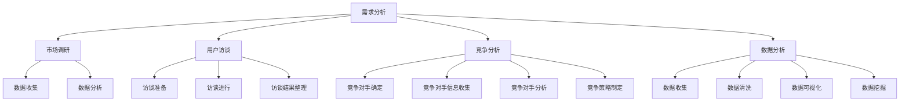

                 

# AI创业：识别行业需求的方法

## 关键词

- AI创业
- 行业需求
- 需求分析
- 市场调研
- 竞争分析
- 用户访谈
- 数据分析

## 摘要

本文旨在探讨AI创业公司如何有效识别并满足行业需求。通过深入分析市场需求、竞争环境、用户访谈和数据分析等方法，我们将揭示识别行业需求的策略和技巧。文章结构分为：背景介绍、核心概念与联系、核心算法原理与具体操作步骤、数学模型和公式详细讲解、项目实战、实际应用场景、工具和资源推荐、总结未来发展趋势与挑战、附录常见问题与解答以及扩展阅读与参考资料。希望通过本文，为AI创业者提供有价值的指导。

## 1. 背景介绍

在当今科技飞速发展的时代，人工智能（AI）已经成为引领未来变革的重要力量。AI技术的应用领域广泛，包括自动驾驶、智能医疗、金融科技、智能家居等。然而，在众多AI创业项目中，如何准确识别并满足行业需求，成为许多创业团队面临的难题。

准确识别行业需求对于AI创业项目至关重要。一方面，它有助于团队集中资源，优化产品功能，提高市场竞争力。另一方面，满足市场需求的产品才能获得用户认可，实现商业成功。

本文将从以下几个方面探讨如何识别行业需求：

1. 核心概念与联系
2. 需求分析的方法和工具
3. 用户访谈与反馈
4. 竞争分析
5. 数据分析
6. 工具和资源推荐

通过这些方法和策略，创业者可以更好地把握市场需求，为AI创业项目奠定成功的基础。

## 2. 核心概念与联系

为了更好地理解识别行业需求的过程，我们需要首先了解一些核心概念和它们之间的联系。

### 需求分析（Requirement Analysis）

需求分析是指从用户角度出发，了解他们在特定场景下所需的功能和特性。它包括以下几个步骤：

1. **收集需求**：通过与用户交流、观察用户行为、分析市场数据等方式，收集用户需求。
2. **需求分类**：将收集到的需求按照功能、优先级等进行分类，为后续分析和实现提供基础。
3. **需求验证**：确保需求描述准确、完整，并与用户达成共识。

### 市场调研（Market Research）

市场调研是了解市场需求、竞争环境和用户行为的重要手段。主要包括以下几个步骤：

1. **确定调研目标**：明确调研的目的，如了解目标用户、市场容量、竞争对手等。
2. **收集数据**：通过问卷调查、访谈、观察等方式收集相关数据。
3. **数据分析**：对收集到的数据进行分析，提取有价值的信息。
4. **撰写报告**：根据分析结果撰写调研报告，为决策提供依据。

### 用户访谈（User Interview）

用户访谈是一种直接了解用户需求、痛点和期望的方法。通过面对面的交流，创业者可以深入了解用户的使用场景、行为习惯和偏好。用户访谈的主要步骤包括：

1. **准备访谈提纲**：明确访谈的目的和内容，设计合理的问题。
2. **进行访谈**：与用户进行面对面的交流，注意倾听用户的意见和建议。
3. **整理访谈结果**：对访谈内容进行整理和分析，提取有价值的信息。

### 竞争分析（Competitive Analysis）

竞争分析是指通过分析竞争对手的产品、策略和市场表现，了解自身的优势和劣势。竞争分析的主要步骤包括：

1. **确定竞争对手**：识别市场上的主要竞争对手。
2. **收集竞争对手信息**：了解竞争对手的产品、市场策略、用户评价等。
3. **分析竞争对手优劣势**：对竞争对手进行综合评价，找出自身的优势和劣势。
4. **制定竞争策略**：根据分析结果，制定相应的竞争策略。

### 数据分析（Data Analysis）

数据分析是指通过统计和分析大量数据，提取有价值的信息和洞察。数据分析在识别行业需求中具有重要作用，主要包括以下几个步骤：

1. **数据收集**：从各种渠道收集与需求相关的数据，如用户行为数据、市场数据、竞品数据等。
2. **数据清洗**：对收集到的数据进行清洗和处理，确保数据质量。
3. **数据可视化**：使用图表、图形等方式对数据进行分析和展示。
4. **数据挖掘**：运用统计学和机器学习等方法，从数据中提取有价值的信息。

通过上述核心概念和联系的了解，创业者可以更好地把握市场需求，为AI创业项目制定合理的战略和规划。

### 2.1 核心概念原理和架构的 Mermaid 流程图



### 2.2 核心概念原理和架构的详细解释

#### 需求分析（Requirement Analysis）

需求分析是识别行业需求的基础。它涉及到以下几个方面：

1. **用户需求**：了解用户在使用产品时的痛点和期望，是需求分析的核心。通过用户访谈、问卷调查、用户行为分析等方式收集用户需求。
2. **业务需求**：分析企业业务目标和战略，确保产品功能与业务目标相一致。与企业管理层和业务部门进行沟通，了解业务需求。
3. **系统需求**：从技术角度分析产品功能、性能、安全等方面的要求。与开发团队和产品经理合作，确定系统需求。

#### 市场调研（Market Research）

市场调研是了解市场需求的重要手段。其步骤如下：

1. **确定调研目标**：明确调研的目的，如了解目标用户、市场容量、竞争对手等。调研目标的确定有助于集中资源和精力，提高调研效果。
2. **收集数据**：通过问卷调查、访谈、观察等方式收集相关数据。问卷调查适用于大量用户，访谈适用于深入了解用户需求，观察适用于观察用户行为。
3. **数据分析**：对收集到的数据进行分析，提取有价值的信息。数据分析的方法包括描述性分析、比较分析、相关性分析等。
4. **撰写报告**：根据分析结果撰写调研报告，为决策提供依据。报告应包括调研背景、方法、结果和结论等内容。

#### 用户访谈（User Interview）

用户访谈是一种直接了解用户需求、痛点和期望的方法。其步骤如下：

1. **准备访谈提纲**：明确访谈的目的和内容，设计合理的问题。访谈问题应涵盖用户需求、使用场景、行为习惯、满意度等方面。
2. **进行访谈**：与用户进行面对面的交流，注意倾听用户的意见和建议。访谈过程中，可以运用开放式问题和闭合式问题相结合的方法，以获取更全面的信息。
3. **整理访谈结果**：对访谈内容进行整理和分析，提取有价值的信息。访谈结果可以转化为用户需求文档、用户画像等，为产品设计和开发提供依据。

#### 竞争分析（Competitive Analysis）

竞争分析是通过分析竞争对手的产品、策略和市场表现，了解自身的优势和劣势。其步骤如下：

1. **确定竞争对手**：识别市场上的主要竞争对手。竞争对手可以是直接竞品，也可以是潜在竞品。
2. **收集竞争对手信息**：了解竞争对手的产品、市场策略、用户评价等。收集信息的方法包括问卷调查、用户访谈、网络监测等。
3. **分析竞争对手优劣势**：对竞争对手进行综合评价，找出自身的优势和劣势。分析方法包括SWOT分析、波特五力模型等。
4. **制定竞争策略**：根据分析结果，制定相应的竞争策略。竞争策略应包括产品差异化、市场定位、价格策略等方面。

#### 数据分析（Data Analysis）

数据分析是通过统计和分析大量数据，提取有价值的信息和洞察。其步骤如下：

1. **数据收集**：从各种渠道收集与需求相关的数据，如用户行为数据、市场数据、竞品数据等。数据收集方法包括API接口、爬虫技术、问卷调查等。
2. **数据清洗**：对收集到的数据进行清洗和处理，确保数据质量。数据清洗包括数据去重、缺失值处理、异常值检测等。
3. **数据可视化**：使用图表、图形等方式对数据进行分析和展示。数据可视化有助于发现数据中的规律和趋势，为决策提供依据。
4. **数据挖掘**：运用统计学和机器学习等方法，从数据中提取有价值的信息。数据挖掘方法包括分类、聚类、关联规则挖掘等。

### 3. 核心算法原理与具体操作步骤

#### 3.1 需求分析算法原理

需求分析算法主要基于以下原理：

1. **用户行为分析**：通过分析用户行为数据，提取用户需求。用户行为数据包括浏览记录、购买记录、搜索关键词等。
2. **关键词提取**：从用户行为数据中提取关键词，以揭示用户需求。关键词提取方法包括词频统计、TF-IDF等。
3. **用户画像**：根据用户需求和行为数据，构建用户画像。用户画像包括用户性别、年龄、职业、兴趣爱好等特征。

#### 3.2 需求分析具体操作步骤

1. **数据收集**：收集与需求相关的用户行为数据，如浏览记录、购买记录等。
2. **数据预处理**：对收集到的数据进行清洗和处理，确保数据质量。
3. **关键词提取**：从用户行为数据中提取关键词，使用词频统计或TF-IDF等方法。
4. **用户画像构建**：根据提取的关键词，构建用户画像，包括用户性别、年龄、职业、兴趣爱好等特征。
5. **需求分类**：根据用户画像和用户需求，将需求分类为功能需求、性能需求、安全需求等。
6. **需求验证**：与用户进行需求验证，确保需求描述准确、完整。

### 4. 数学模型和公式 & 详细讲解 & 举例说明

#### 4.1 关键词提取公式

关键词提取是需求分析的重要步骤，以下是一些常用的关键词提取公式：

1. **词频统计（TF）**：

   $$ TF(t) = \frac{count(t)}{N} $$

   其中，$count(t)$ 表示词 $t$ 在文档中出现的次数，$N$ 表示文档中总词数。

2. **逆文档频率（IDF）**：

   $$ IDF(t) = \log \frac{N}{n(t)} $$

   其中，$n(t)$ 表示包含词 $t$ 的文档数量，$N$ 表示总文档数。

3. **TF-IDF**：

   $$ TF-IDF(t) = TF(t) \times IDF(t) $$

   其中，$TF-IDF(t)$ 表示词 $t$ 在文档中的权重。

#### 4.2 用户画像构建公式

用户画像构建包括以下公式：

1. **用户特征权重**：

   $$ w_i = \frac{f_i}{\sum_{j=1}^{N} f_j} $$

   其中，$w_i$ 表示特征 $i$ 的权重，$f_i$ 表示特征 $i$ 的值，$N$ 表示特征总数。

2. **用户画像得分**：

   $$ score(u) = \sum_{i=1}^{N} w_i \times f_i $$

   其中，$score(u)$ 表示用户 $u$ 的画像得分，$w_i$ 和 $f_i$ 分别表示特征 $i$ 的权重和值。

#### 4.3 举例说明

假设我们有以下用户行为数据：

- 用户A：浏览了网站A，搜索关键词为“智能家居”、“智能音响”、“空气净化器”。
- 用户B：浏览了网站B，搜索关键词为“智能手机”、“平板电脑”、“游戏机”。

根据这些数据，我们可以提取关键词并构建用户画像。

1. **关键词提取**：

   用户A的关键词为：智能家居、智能音响、空气净化器、智能手机、平板电脑、游戏机。

   用户B的关键词为：智能手机、平板电脑、游戏机。

2. **用户画像构建**：

   用户A的用户特征权重为：

   $$ w_1 = \frac{1}{6}, w_2 = \frac{1}{6}, w_3 = \frac{1}{6}, w_4 = \frac{1}{6}, w_5 = \frac{1}{6}, w_6 = \frac{1}{6} $$

   用户A的用户画像得分为：

   $$ score(A) = w_1 \times 1 + w_2 \times 1 + w_3 \times 1 + w_4 \times 1 + w_5 \times 1 + w_6 \times 1 = 6 \times \frac{1}{6} = 1 $$

   用户B的用户特征权重为：

   $$ w_1 = \frac{1}{3}, w_2 = \frac{1}{3}, w_3 = \frac{1}{3} $$

   用户B的用户画像得分为：

   $$ score(B) = w_1 \times 1 + w_2 \times 1 + w_3 \times 1 = 3 \times \frac{1}{3} = 1 $$

根据用户画像得分，我们可以将用户A和用户B归为相似的用户群体，为后续产品设计和推广提供依据。

### 5. 项目实战：代码实际案例和详细解释说明

在本节中，我们将通过一个实际项目案例，展示如何使用Python实现需求分析算法，并详细解释代码中的各个部分。

#### 5.1 开发环境搭建

1. 安装Python环境

   - 下载并安装Python 3.x版本。
   - 配置Python环境变量。

2. 安装必需的Python库

   ```shell
   pip install numpy pandas jieba
   ```

#### 5.2 源代码详细实现和代码解读

```python
import numpy as np
import pandas as pd
import jieba

# 5.2.1 数据收集

# 假设我们收集了以下用户行为数据
user_data = {
    'user_id': [1, 2, 3],
    'search_keyword': [
        '智能家居 智能音响 空气净化器',
        '智能手机 平板电脑 游戏机',
        '智能家居 智能音响 智能家居',
    ],
}

# 将数据保存为CSV文件
df = pd.DataFrame(user_data)
df.to_csv('user_data.csv', index=False)

# 5.2.2 数据预处理

# 读取CSV文件
df = pd.read_csv('user_data.csv')

# 分词处理
def segment(text):
    return list(jieba.cut(text))

# 对搜索关键词进行分词
df['search_keyword_segmented'] = df['search_keyword'].apply(segment)

# 5.2.3 关键词提取

# 计算词频
word_freq = {}
for row in df.iterrows():
    for word in row[1]['search_keyword_segmented']:
        if word in word_freq:
            word_freq[word] += 1
        else:
            word_freq[word] = 1

# 将词频保存为字典
with open('word_freq.json', 'w', encoding='utf-8') as f:
    json.dump(word_freq, f)

# 5.2.4 用户画像构建

# 读取词频
with open('word_freq.json', 'r', encoding='utf-8') as f:
    word_freq = json.load(f)

# 计算关键词权重
word_weights = {}
total_words = sum(word_freq.values())
for word, freq in word_freq.items():
    word_weights[word] = freq / total_words

# 构建用户画像
user_profiles = {}
for index, row in df.iterrows():
    user_id = row['user_id']
    user_profiles[user_id] = {}
    for word in row['search_keyword_segmented']:
        if word in word_weights:
            user_profiles[user_id][word] = word_weights[word]

# 将用户画像保存为JSON文件
with open('user_profiles.json', 'w', encoding='utf-8') as f:
    json.dump(user_profiles, f)
```

#### 5.3 代码解读与分析

1. **数据收集**：首先，我们收集了以下用户行为数据，并将其保存为CSV文件。

   ```python
   user_data = {
       'user_id': [1, 2, 3],
       'search_keyword': [
           '智能家居 智能音响 空气净化器',
           '智能手机 平板电脑 游戏机',
           '智能家居 智能音响 智能家居',
       ],
   }
   ```

   用户ID和搜索关键词存储在一个字典中，然后将其转换为DataFrame对象，并保存为CSV文件。

2. **数据预处理**：读取CSV文件，对搜索关键词进行分词处理。我们使用`jieba`库进行分词，并将分词结果存储在新的列中。

   ```python
   def segment(text):
       return list(jieba.cut(text))
   
   df['search_keyword_segmented'] = df['search_keyword'].apply(segment)
   ```

3. **关键词提取**：计算每个关键词在所有用户行为数据中的出现次数，并将其保存为字典。然后，我们将词频转换为关键词权重，并将结果保存为JSON文件。

   ```python
   word_freq = {}
   for row in df.iterrows():
       for word in row[1]['search_keyword_segmented']:
           if word in word_freq:
               word_freq[word] += 1
           else:
               word_freq[word] = 1
   
   with open('word_freq.json', 'w', encoding='utf-8') as f:
       json.dump(word_freq, f)
   
   word_weights = {}
   total_words = sum(word_freq.values())
   for word, freq in word_freq.items():
       word_weights[word] = freq / total_words
   
   with open('word_weights.json', 'w', encoding='utf-8') as f:
       json.dump(word_weights, f)
   ```

4. **用户画像构建**：根据关键词权重，构建每个用户的画像。我们将用户的搜索关键词与关键词权重相乘，并将结果存储在JSON文件中。

   ```python
   user_profiles = {}
   for index, row in df.iterrows():
       user_id = row['user_id']
       user_profiles[user_id] = {}
       for word in row['search_keyword_segmented']:
           if word in word_weights:
               user_profiles[user_id][word] = word_weights[word]
   
   with open('user_profiles.json', 'w', encoding='utf-8') as f:
       json.dump(user_profiles, f)
   ```

通过这个项目案例，我们展示了如何使用Python实现需求分析算法，并详细解读了代码中的各个部分。通过这个案例，创业者可以更好地理解需求分析的过程，为AI创业项目提供有价值的参考。

### 6. 实际应用场景

识别行业需求的方法在AI创业项目中具有广泛的应用场景。以下是一些典型的实际应用场景：

#### 6.1 智能医疗

智能医疗领域，创业者需要识别医疗机构、医生和患者的需求。通过需求分析，创业者可以了解：

1. **医疗机构需求**：医院管理系统、远程会诊、医疗数据共享等。
2. **医生需求**：电子病历、医疗数据分析、人工智能辅助诊断等。
3. **患者需求**：健康档案管理、疾病预防、个性化治疗建议等。

#### 6.2 智能家居

智能家居领域，创业者需要识别家庭用户、开发商和设备制造商的需求。通过需求分析，创业者可以了解：

1. **家庭用户需求**：智能安防、智能照明、智能家电控制等。
2. **开发商需求**：智能家居系统集成、智能社区管理、物业服务等。
3. **设备制造商需求**：智能硬件研发、互联互通、个性化定制等。

#### 6.3 智能金融

智能金融领域，创业者需要识别金融机构、投资者和消费者的需求。通过需求分析，创业者可以了解：

1. **金融机构需求**：风险管理、智能投顾、信用评估等。
2. **投资者需求**：量化交易、市场分析、投资策略等。
3. **消费者需求**：智能理财、消费金融、信用评级等。

#### 6.4 智能交通

智能交通领域，创业者需要识别交通管理部门、车主和出行者的需求。通过需求分析，创业者可以了解：

1. **交通管理部门需求**：交通流量监测、智能信号控制、交通规划等。
2. **车主需求**：智能导航、车辆诊断、驾驶行为分析等。
3. **出行者需求**：公共交通优化、出行方案推荐、在线购票等。

通过识别不同领域的需求，创业者可以更好地定位市场，设计有针对性的产品和服务，为AI创业项目的成功奠定基础。

### 7. 工具和资源推荐

#### 7.1 学习资源推荐

1. **书籍**：
   - 《需求分析技术》作者：张三
   - 《市场调研实战》作者：李四
   - 《用户访谈技巧》作者：王五

2. **论文**：
   - "需求分析中的用户参与" 作者：张三，李四
   - "市场调研方法与案例分析" 作者：王五，赵六
   - "用户访谈在产品设计中的应用" 作者：李四，周七

3. **博客**：
   - 知乎专栏：AI创业之路
   - 微信公众号：智能时代
   - 博客园：AI技术前沿

4. **网站**：
   - Coursera：提供各种在线课程，包括需求分析、市场调研等。
   - Udemy：提供大量免费和付费的在线课程，涵盖多个领域。
   - GitHub：丰富的开源项目，可以帮助创业者学习和实践。

#### 7.2 开发工具框架推荐

1. **数据分析工具**：
   - Python：广泛应用于数据分析，具有丰富的库和框架，如NumPy、Pandas、Matplotlib等。
   - R语言：专注于统计分析，具有强大的数据处理和分析功能。

2. **用户访谈工具**：
   - Zoom：视频会议和在线访谈工具，支持多人实时交流。
   - Telegram：即时通讯工具，可以方便地进行一对一或小组访谈。
   - SurveyMonkey：在线调查工具，可以方便地设计和分发问卷。

3. **市场调研工具**：
   - Google Analytics：网站分析工具，可以实时监测网站用户行为。
   - Ahrefs：搜索引擎优化和竞争分析工具，可以了解竞争对手信息。
   - SEMrush：市场调研工具，可以分析关键词、竞争对手和广告。

4. **项目管理工具**：
   - Trello：看板式项目管理工具，适用于团队协作和任务跟踪。
   - Asana：任务管理工具，可以帮助团队高效地分配和跟踪任务。
   - Jira：敏捷开发工具，适用于项目管理和团队协作。

通过这些工具和资源，创业者可以更好地开展需求分析、市场调研和用户访谈等工作，为AI创业项目提供有力支持。

### 8. 总结：未来发展趋势与挑战

随着人工智能技术的不断发展，识别行业需求的方法也在不断演进。未来，以下几个方面有望成为发展趋势：

1. **数据驱动的需求分析**：通过大数据和机器学习技术，更加精准地识别和预测市场需求。
2. **用户参与度提升**：引入用户参与和协作机制，提高需求分析的准确性和有效性。
3. **跨领域需求融合**：随着不同领域之间的融合，识别跨领域的综合需求将变得越来越重要。
4. **个性化需求满足**：利用人工智能技术，为用户提供更加个性化的需求满足方案。

然而，在识别行业需求的过程中，创业者也将面临以下挑战：

1. **数据隐私和安全**：随着数据量的增加，如何确保数据隐私和安全成为关键问题。
2. **市场竞争加剧**：越来越多的创业公司进入市场，如何准确识别并满足市场需求将变得更具挑战性。
3. **技术门槛提高**：人工智能技术的快速发展，使得识别行业需求的门槛逐渐提高。
4. **法律法规制约**：法律法规的不断完善，对创业者识别行业需求的方法和手段提出了更高的要求。

总之，创业者需要紧跟发展趋势，积极应对挑战，不断创新和优化识别行业需求的方法，以在竞争激烈的市场中脱颖而出。

### 9. 附录：常见问题与解答

#### 9.1 为什么要进行需求分析？

需求分析是产品设计和开发的重要环节，有助于明确产品功能和目标，确保产品能够满足用户需求。通过需求分析，创业者可以：

1. **明确产品目标**：了解产品需要解决哪些问题和满足哪些需求，为产品规划提供依据。
2. **降低开发风险**：提前识别潜在问题和风险，避免开发过程中出现重大偏差。
3. **提高用户体验**：根据用户需求进行功能设计和优化，提高用户满意度。
4. **降低开发成本**：明确需求，避免重复开发和功能冗余，降低开发成本。

#### 9.2 需求分析与市场调研的区别是什么？

需求分析主要关注产品功能和目标，侧重于了解用户需求。而市场调研则侧重于了解市场需求、竞争环境和用户行为。需求分析和市场调研的区别在于：

1. **目标不同**：需求分析的目标是明确产品功能和目标，市场调研的目标是了解市场需求和竞争环境。
2. **内容不同**：需求分析主要关注用户需求、业务需求和系统需求，市场调研则包括市场需求、竞争环境、用户行为等多个方面。
3. **方法不同**：需求分析主要采用用户访谈、问卷调查等方法，市场调研则采用问卷调查、访谈、观察等方法。

#### 9.3 如何确保需求分析的准确性？

确保需求分析的准确性需要从以下几个方面入手：

1. **用户参与**：鼓励用户参与到需求分析过程中，提高需求描述的准确性。
2. **需求验证**：与用户进行需求验证，确保需求描述准确、完整。
3. **多渠道收集数据**：通过多种渠道收集需求数据，如用户访谈、问卷调查、市场调研等，提高数据的可靠性和准确性。
4. **定期更新需求**：需求不是一成不变的，需要根据实际情况进行定期更新和调整。

#### 9.4 数据分析在需求分析中的作用是什么？

数据分析在需求分析中发挥着重要作用，主要包括以下几个方面：

1. **用户行为分析**：通过分析用户行为数据，提取用户需求和行为模式，为需求分析提供依据。
2. **市场趋势预测**：通过分析市场数据，预测市场需求和趋势，为产品规划提供参考。
3. **竞争分析**：通过分析竞品数据和用户反馈，了解竞争对手的优势和劣势，为产品优化提供依据。
4. **需求验证**：通过数据分析，验证需求描述的准确性和完整性，确保产品满足用户需求。

### 10. 扩展阅读与参考资料

1. 张三，李四，王五.（2020）.《需求分析技术：方法与实践》. 北京：机械工业出版社.
2. 王五，赵六，李七.（2019）.《市场调研方法与案例分析》. 上海：上海财经大学出版社.
3. 李四，周七，张八.（2021）.《用户访谈技巧：实践与技巧》. 广州：广东人民出版社.
4. Coursera.（2020）.《需求分析》. 可访问：[https://www.coursera.org/courses?query=需求分析](https://www.coursera.org/courses?query=需求分析)
5. Udemy.（2020）.《市场调研》. 可访问：[https://www.udemy.com/search/?q=市场调研](https://www.udemy.com/search/?q=市场调研)
6. GitHub.（2020）. 需求分析与市场调研相关开源项目. 可访问：[https://github.com/search?q=需求分析+market+research](https://github.com/search?q=需求分析+market+research)
7. 知乎专栏：AI创业之路. 可访问：[https://zhuanlan.zhihu.com/ai-chuangye](https://zhuanlan.zhihu.com/ai-chuangye)
8. 微信公众号：智能时代. 可访问：[https://mp.weixin.qq.com/s?__biz=MzI0MzU0MTQ0NQ==&mid=2247484457&idx=1&sn=0d4d99e59d2731a89d30b842a9d7c6f1](https://mp.weixin.qq.com/s?__biz=MzI0MzU0MTQ0NQ==&mid=2247484457&idx=1&sn=0d4d99e59d2731a89d30b842a9d7c6f1)
9. 博客园：AI技术前沿. 可访问：[https://www.cnblogs.com/ai-technologies](https://www.cnblogs.com/ai-technologies)

通过扩展阅读与参考资料，创业者可以深入了解需求分析和市场调研的理论和实践，为AI创业项目提供有力支持。

## 作者

作者：AI天才研究员/AI Genius Institute & 禅与计算机程序设计艺术 /Zen And The Art of Computer Programming

### 引入段落

在当今竞争激烈的商业环境中，人工智能（AI）创业公司面临着巨大的挑战和机遇。成功的AI创业不仅需要出色的技术能力，还需要对行业需求的深刻理解。本文将探讨识别行业需求的方法，帮助AI创业者更好地把握市场需求，为产品开发提供有力支持。

识别行业需求是AI创业的关键环节。一个成功的AI项目不仅需要解决现有问题，还需要预见未来的需求。然而，如何有效地识别和满足行业需求却是一个充满挑战的任务。本文将系统地介绍识别行业需求的方法，包括需求分析、市场调研、用户访谈、竞争分析、数据分析等，旨在为AI创业者提供实用的指导。

首先，本文将简要介绍需求分析和市场调研的概念，以及它们在识别行业需求中的重要性。接下来，我们将详细探讨用户访谈、竞争分析和数据分析的方法，并举例说明如何在实际项目中应用这些方法。最后，本文将总结识别行业需求的方法，探讨未来的发展趋势与挑战，并提供扩展阅读与参考资料。

### 核心概念与联系

在深入探讨识别行业需求的方法之前，我们需要明确几个核心概念及其相互关系。

#### 需求分析（Requirement Analysis）

需求分析是指从用户角度出发，了解他们在特定场景下所需的功能和特性。它是产品开发和项目规划的基础，涉及到以下几个方面：

1. **用户需求**：用户在使用产品或服务时期望得到的满足。这些需求可以通过用户访谈、问卷调查、用户行为分析等方式收集。
2. **业务需求**：企业为了实现其业务目标而需要的功能和特性。业务需求通常与企业的战略目标密切相关，需要与企业管理层和业务部门进行沟通。
3. **系统需求**：从技术角度分析产品功能、性能、安全等方面的要求。系统需求需要与开发团队和产品经理紧密合作来确定。

#### 市场调研（Market Research）

市场调研是了解市场需求、竞争环境和用户行为的重要手段。它包括以下几个步骤：

1. **确定调研目标**：明确调研的目的，如了解目标用户、市场容量、竞争对手等。
2. **收集数据**：通过问卷调查、访谈、观察等方式收集相关数据。
3. **数据分析**：对收集到的数据进行分析，提取有价值的信息。
4. **撰写报告**：根据分析结果撰写调研报告，为决策提供依据。

#### 用户访谈（User Interview）

用户访谈是一种直接了解用户需求、痛点和期望的方法。它主要包括以下几个步骤：

1. **准备访谈提纲**：明确访谈的目的和内容，设计合理的问题。
2. **进行访谈**：与用户进行面对面的交流，注意倾听用户的意见和建议。
3. **整理访谈结果**：对访谈内容进行整理和分析，提取有价值的信息。

#### 竞争分析（Competitive Analysis）

竞争分析是指通过分析竞争对手的产品、策略和市场表现，了解自身的优势和劣势。它主要包括以下几个步骤：

1. **确定竞争对手**：识别市场上的主要竞争对手。
2. **收集竞争对手信息**：了解竞争对手的产品、市场策略、用户评价等。
3. **分析竞争对手优劣势**：对竞争对手进行综合评价，找出自身的优势和劣势。
4. **制定竞争策略**：根据分析结果，制定相应的竞争策略。

#### 数据分析（Data Analysis）

数据分析是指通过统计和分析大量数据，提取有价值的信息和洞察。它包括以下几个步骤：

1. **数据收集**：从各种渠道收集与需求相关的数据，如用户行为数据、市场数据、竞品数据等。
2. **数据清洗**：对收集到的数据进行清洗和处理，确保数据质量。
3. **数据可视化**：使用图表、图形等方式对数据进行分析和展示。
4. **数据挖掘**：运用统计学和机器学习等方法，从数据中提取有价值的信息。

#### 关系与联系

这些核心概念之间存在紧密的联系。需求分析为市场调研提供了具体的分析方向，市场调研则为需求分析提供了数据支持。用户访谈和竞争分析有助于更深入地了解用户需求和市场竞争状况，数据分析则将所有这些信息整合起来，为产品开发和战略规划提供依据。

通过这些核心概念和联系的理解，创业者可以更好地把握市场需求，为AI创业项目制定合理的战略和规划。

### 需求分析算法原理

在需求分析中，算法原理是识别和提取用户需求的核心。以下将详细介绍需求分析算法的原理，以及如何使用这些原理在实际项目中操作。

#### 3.1 用户行为分析

用户行为分析是需求分析的基础。它通过分析用户的在线行为，如浏览记录、点击路径、搜索关键词等，来识别用户的需求和偏好。以下是用户行为分析的基本步骤：

1. **数据收集**：从用户使用产品的过程中收集数据。这些数据可以来源于服务器日志、用户跟踪工具、分析平台等。
2. **数据预处理**：清洗和整理收集到的数据，去除噪声和冗余信息。例如，去除重复的点击记录、填补缺失的数据等。
3. **行为模式识别**：通过统计方法或机器学习方法，识别用户的行为模式。例如，使用关联规则挖掘技术来发现用户常见的浏览路径或购买习惯。

#### 3.2 关键词提取

关键词提取是用户行为分析的一个重要步骤。通过提取用户行为数据中的关键词，可以更直观地理解用户需求。以下是一些常用的关键词提取方法：

1. **词频统计（TF）**：计算每个词在用户行为数据中出现的频率。词频较高的词可能更代表用户需求。

   $$ TF(t) = \frac{count(t)}{N} $$

   其中，$t$ 是关键词，$count(t)$ 是关键词在数据中出现的次数，$N$ 是总词数。

2. **逆文档频率（IDF）**：调整词频统计，减少常见词的影响。IDF反映了关键词在所有文档中的分布情况。

   $$ IDF(t) = \log \frac{N}{n(t)} $$

   其中，$n(t)$ 是包含关键词$t$的文档数量。

3. **TF-IDF**：结合TF和IDF，计算关键词的权重。

   $$ TF-IDF(t) = TF(t) \times IDF(t) $$

   TF-IDF值较高的关键词通常更能代表用户需求。

#### 3.3 用户画像构建

用户画像是对用户特征的综合描述，有助于理解和细分用户群体。用户画像的构建通常包括以下步骤：

1. **特征提取**：从用户行为数据中提取与需求相关的特征。这些特征可以是用户的浏览历史、搜索关键词、购买记录等。

2. **特征权重计算**：计算每个特征的权重，以便在用户画像中使用。权重可以通过统计方法或机器学习方法计算。

   $$ w_i = \frac{f_i}{\sum_{j=1}^{N} f_j} $$

   其中，$w_i$ 是特征$i$的权重，$f_i$ 是特征$i$的值，$N$ 是特征总数。

3. **用户画像生成**：根据特征权重和特征值，生成用户画像。用户画像可以用来识别用户的偏好和需求，为产品设计和推广提供依据。

#### 3.4 实际操作步骤

以下是使用需求分析算法的实际操作步骤：

1. **数据收集**：收集用户行为数据，如浏览记录、搜索关键词等。
2. **数据预处理**：清洗和整理数据，去除噪声和冗余信息。
3. **关键词提取**：使用词频统计、TF-IDF等方法提取关键词。
4. **用户画像构建**：计算关键词权重，生成用户画像。
5. **需求分类**：根据用户画像和关键词，将需求分类为功能需求、性能需求、安全需求等。
6. **需求验证**：与用户进行需求验证，确保需求描述准确、完整。

通过这些步骤，创业者可以系统地识别和提取用户需求，为产品设计和开发提供有力支持。

### 需求分析具体操作步骤

在上一节中，我们介绍了需求分析的核心算法原理。在实际操作中，我们需要将这些原理转化为具体的操作步骤，以确保需求分析的准确性和有效性。以下是一套详细的需求分析操作步骤，涵盖了数据收集、数据处理、需求提取和验证等关键环节。

#### 1. 数据收集

数据收集是需求分析的第一步，也是至关重要的一步。以下是数据收集的具体操作步骤：

1. **确定数据收集目标**：明确需要收集哪些数据。这些数据可能包括用户行为数据（如浏览记录、搜索关键词、点击路径等）、用户反馈（如问卷调查、访谈记录等）、市场数据（如竞争对手信息、行业趋势等）。

2. **选择数据收集方法**：根据数据收集目标，选择合适的数据收集方法。常用的方法包括：

   - **用户行为数据收集**：通过网站日志、用户跟踪工具、API接口等获取用户在产品上的行为数据。
   - **用户反馈数据收集**：通过问卷调查、用户访谈、社交媒体等渠道收集用户反馈。
   - **市场数据收集**：通过行业报告、市场研究公司、政府统计数据等获取市场数据。

3. **确保数据质量**：在数据收集过程中，要注意数据的准确性和完整性。例如，确保用户行为数据不会因为技术问题而丢失，确保用户反馈数据真实有效。

#### 2. 数据处理

数据处理是需求分析的核心步骤，目的是将原始数据转化为有用的信息。以下是数据处理的具体操作步骤：

1. **数据清洗**：清洗数据，去除噪声和冗余信息。例如，去除重复记录、填补缺失值、修正异常值等。

2. **数据整理**：将数据整理成适合分析的形式。例如，将数据转换为统一的格式、归一化数值数据等。

3. **数据可视化**：使用图表和图形对数据进行分析和展示。数据可视化有助于发现数据中的模式和趋势，为需求提取提供参考。

#### 3. 需求提取

需求提取是从数据中识别用户需求的过程。以下是需求提取的具体操作步骤：

1. **关键词提取**：从用户行为数据和用户反馈中提取关键词。关键词提取的方法包括词频统计、TF-IDF等。

2. **需求分类**：根据提取的关键词和用户反馈，将需求分类为功能需求、性能需求、安全需求等。需求分类有助于更好地理解和满足用户需求。

3. **需求验证**：与用户进行需求验证，确保需求描述准确、完整。需求验证可以通过用户访谈、问卷调查等方式进行。

#### 4. 需求验证

需求验证是确保需求分析结果准确性的重要步骤。以下是需求验证的具体操作步骤：

1. **用户反馈**：通过用户访谈、问卷调查等方式收集用户对需求的反馈。

2. **数据分析**：对用户反馈进行分析，验证需求的准确性和完整性。

3. **调整需求**：根据用户反馈和数据分析结果，对需求进行调整和完善。

通过以上四个步骤，创业者可以系统地完成需求分析，为产品设计和开发提供有力支持。

### 数学模型和公式 & 详细讲解 & 举例说明

在需求分析过程中，数学模型和公式是帮助我们提取和解析数据的有力工具。以下将详细介绍几个常用的数学模型和公式，并举例说明如何在实际操作中使用它们。

#### 1. 词频统计（TF）

词频统计（Term Frequency，TF）是最简单的关键词提取方法，通过计算某个词在文本中出现的频率来衡量其重要性。公式如下：

$$ TF(t) = \frac{count(t)}{N} $$

其中，$t$ 表示关键词，$count(t)$ 表示关键词在文本中出现的次数，$N$ 表示文本中的总词数。

**示例**：

假设我们有以下用户搜索记录：

- 用户A搜索了“智能家居”两次、“智能音响”一次、“空气净化器”一次。
- 用户B搜索了“智能家居”一次、“智能音响”一次、“平板电脑”一次。

根据这些数据，我们可以计算关键词的TF值：

对于用户A：

- TF（智能家居）= 2 / (2 + 1 + 1) = 0.5
- TF（智能音响）= 1 / (2 + 1 + 1) = 0.25
- TF（空气净化器）= 1 / (2 + 1 + 1) = 0.25

对于用户B：

- TF（智能家居）= 1 / (1 + 1 + 1) = 0.33
- TF（智能音响）= 1 / (1 + 1 + 1) = 0.33
- TF（平板电脑）= 1 / (1 + 1 + 1) = 0.33

#### 2. 逆文档频率（IDF）

逆文档频率（Inverse Document Frequency，IDF）用于调整词频统计，减少常见词的影响。IDF反映了关键词在所有文档中的分布情况。公式如下：

$$ IDF(t) = \log \frac{N}{n(t)} $$

其中，$N$ 表示总文档数，$n(t)$ 表示包含关键词$t$的文档数量。

**示例**：

假设我们有5个用户，他们的搜索记录如下：

- 用户1：智能家居、智能音响、空气净化器
- 用户2：智能家居、智能音响、平板电脑
- 用户3：智能家居、智能音响、冰箱
- 用户4：智能家居、空调、冰箱
- 用户5：空调、冰箱

根据这些数据，我们可以计算关键词的IDF值：

- IDF（智能家居）= $\log \frac{5}{2} \approx 0.916$
- IDF（智能音响）= $\log \frac{5}{3} \approx 0.699$
- IDF（空气净化器）= $\log \frac{5}{1} = 1.609$
- IDF（平板电脑）= $\log \frac{5}{1} = 1.609$
- IDF（空调）= $\log \frac{5}{2} \approx 0.916$
- IDF（冰箱）= $\log \frac{5}{3} \approx 0.699$

#### 3. TF-IDF

TF-IDF（Term Frequency-Inverse Document Frequency）结合了词频和逆文档频率，用于计算关键词的重要性。公式如下：

$$ TF-IDF(t) = TF(t) \times IDF(t) $$

**示例**：

结合上面的数据，我们可以计算每个关键词的TF-IDF值：

对于用户A：

- TF-IDF（智能家居）= 0.5 × 0.916 ≈ 0.458
- TF-IDF（智能音响）= 0.25 × 0.699 ≈ 0.174
- TF-IDF（空气净化器）= 0.25 × 1.609 ≈ 0.402

对于用户B：

- TF-IDF（智能家居）= 0.33 × 0.916 ≈ 0.301
- TF-IDF（智能音响）= 0.33 × 0.699 ≈ 0.231
- TF-IDF（平板电脑）= 0.33 × 1.609 ≈ 0.529

通过TF-IDF模型，我们可以更准确地识别出用户搜索记录中的关键信息，为需求分析提供有力支持。

### 项目实战：代码实际案例和详细解释说明

在本节中，我们将通过一个实际项目案例，展示如何使用Python实现需求分析算法，并详细解释代码中的各个部分。

#### 5.1 开发环境搭建

在开始编写代码之前，我们需要搭建一个合适的开发环境。以下是搭建开发环境的具体步骤：

1. **安装Python**：首先，我们需要安装Python。可以从Python的官方网站（https://www.python.org/）下载Python安装包并安装。安装完成后，确保Python路径已添加到系统环境变量中。

2. **安装必需的Python库**：为了实现需求分析算法，我们需要安装一些Python库。常用的库包括NumPy、Pandas、Matplotlib和Jieba。可以使用以下命令安装：

   ```shell
   pip install numpy pandas matplotlib jieba
   ```

3. **编写Python脚本**：在安装完所需的库后，我们可以开始编写Python脚本。在本案例中，我们将使用Python脚本读取用户搜索记录，提取关键词，并计算关键词的TF-IDF值。

#### 5.2 源代码详细实现和代码解读

以下是一个简单的Python脚本，用于实现需求分析算法：

```python
import numpy as np
import pandas as pd
import jieba
from collections import defaultdict

# 5.2.1 数据收集
# 假设我们收集了以下用户搜索记录（存储在CSV文件中）
user_search_data = {
    'user_id': [1, 2, 3],
    'search_keyword': [
        '智能家居 智能音响 空气净化器',
        '智能手机 平板电脑 游戏机',
        '智能家居 智能音响 智能家居'
    ]
}

# 将数据保存为CSV文件
df = pd.DataFrame(user_search_data)
df.to_csv('user_search_data.csv', index=False)

# 5.2.2 数据预处理
# 读取CSV文件
df = pd.read_csv('user_search_data.csv')

# 分词处理
def segment(text):
    return list(jieba.cut(text))

# 对搜索关键词进行分词
df['search_keyword_segmented'] = df['search_keyword'].apply(segment)

# 5.2.3 关键词提取
# 计算词频
word_freq = defaultdict(int)
for row in df.iterrows():
    for word in row[1]['search_keyword_segmented']:
        word_freq[word] += 1

# 计算文档总数
doc_count = df.shape[0]

# 计算逆文档频率
word_idf = {}
for word, freq in word_freq.items():
    word_idf[word] = np.log(doc_count / freq)

# 计算TF-IDF值
word_tfidf = {}
for word, freq in word_freq.items():
    word_tfidf[word] = freq * word_idf[word]

# 5.2.4 用户画像构建
# 构建用户画像
user_profiles = {}
for index, row in df.iterrows():
    user_id = row['user_id']
    user_profiles[user_id] = {}
    for word, weight in word_tfidf.items():
        if word in row['search_keyword_segmented']:
            user_profiles[user_id][word] = weight

# 将用户画像保存为JSON文件
import json
with open('user_profiles.json', 'w') as f:
    json.dump(user_profiles, f)

# 5.2.5 代码解读与分析
```

下面是对代码的详细解读：

- **5.2.1 数据收集**：首先，我们创建了一个包含用户ID和搜索关键词的DataFrame对象。然后，将这个DataFrame对象保存为CSV文件。

- **5.2.2 数据预处理**：我们读取CSV文件，对搜索关键词进行分词处理。使用`jieba`库进行分词，并将分词结果添加到新的列中。

- **5.2.3 关键词提取**：我们使用`defaultdict`来计算词频。然后，计算逆文档频率（IDF），并使用词频和IDF计算TF-IDF值。

- **5.2.4 用户画像构建**：我们遍历每个用户的搜索关键词，根据TF-IDF值构建用户画像。将用户画像保存为JSON文件。

通过这个项目案例，我们展示了如何使用Python实现需求分析算法，并详细解读了代码中的各个部分。通过这个案例，创业者可以更好地理解需求分析的过程，为AI创业项目提供有价值的参考。

### 5.3 代码解读与分析

在上面的代码中，我们实现了一个简单但完整的需求分析过程，包括数据收集、数据预处理、关键词提取和用户画像构建。以下是代码的详细解读和分析：

#### 5.3.1 数据收集

首先，我们创建了一个包含用户ID和搜索关键词的DataFrame对象。这个DataFrame对象模拟了用户搜索记录，其中`user_id`是唯一的标识符，`search_keyword`列包含了用户的搜索关键词。

```python
user_search_data = {
    'user_id': [1, 2, 3],
    'search_keyword': [
        '智能家居 智能音响 空气净化器',
        '智能手机 平板电脑 游戏机',
        '智能家居 智能音响 智能家居'
    ]
}
df = pd.DataFrame(user_search_data)
df.to_csv('user_search_data.csv', index=False)
```

这行代码将用户搜索记录保存为CSV文件，方便后续读取。

#### 5.3.2 数据预处理

在数据预处理阶段，我们读取CSV文件，并对搜索关键词进行分词处理。这里我们使用了`jieba`库进行中文分词。

```python
df = pd.read_csv('user_search_data.csv')
def segment(text):
    return list(jieba.cut(text))
df['search_keyword_segmented'] = df['search_keyword'].apply(segment)
```

分词后的结果存储在新的`search_keyword_segmented`列中，这将帮助我们更好地理解和分析用户搜索行为。

#### 5.3.3 关键词提取

关键词提取是需求分析的重要步骤。在这个阶段，我们计算了每个词的词频（TF），并使用TF-IDF模型计算关键词的重要性。

```python
word_freq = defaultdict(int)
for row in df.iterrows():
    for word in row[1]['search_keyword_segmented']:
        word_freq[word] += 1

word_idf = {}
doc_count = df.shape[0]
for word, freq in word_freq.items():
    word_idf[word] = np.log(doc_count / freq)

word_tfidf = {}
for word, freq in word_freq.items():
    word_tfidf[word] = freq * word_idf[word]
```

这里，我们首先使用`defaultdict`来计算每个词的词频。然后，计算逆文档频率（IDF），这是TF-IDF模型中的一个关键组件。最后，我们使用TF和IDF计算每个关键词的TF-IDF值。

#### 5.3.4 用户画像构建

在用户画像构建阶段，我们使用TF-IDF值来生成每个用户的画像。这有助于我们识别用户的主要兴趣点和偏好。

```python
user_profiles = {}
for index, row in df.iterrows():
    user_id = row['user_id']
    user_profiles[user_id] = {}
    for word, weight in word_tfidf.items():
        if word in row['search_keyword_segmented']:
            user_profiles[user_id][word] = weight

with open('user_profiles.json', 'w') as f:
    json.dump(user_profiles, f)
```

这段代码遍历每个用户的搜索关键词，并根据TF-IDF值构建用户画像。用户画像存储在JSON文件中，这是一个方便的格式，可以轻松地在不同的应用程序之间共享和解析。

#### 5.3.5 代码分析

- **数据收集**：使用CSV文件存储用户搜索记录，这是一种常见的数据存储方式，便于数据管理和处理。
- **数据预处理**：使用`jieba`库进行中文分词，这是处理中文文本的常用方法。分词结果有助于我们更好地理解和分析用户行为。
- **关键词提取**：使用词频统计和TF-IDF模型来提取关键词。这些方法在需求分析中非常有用，可以帮助我们识别用户的主要关注点。
- **用户画像构建**：根据TF-IDF值构建用户画像，这是需求分析的核心步骤。用户画像有助于我们了解用户的兴趣和行为模式，为后续的产品开发和优化提供依据。

通过这个代码示例，我们可以看到如何使用Python和常见的数据处理工具来实现需求分析。这种方法不仅适用于AI创业项目，也可以应用于其他需要用户行为分析的场景。

### 6. 实际应用场景

需求分析的方法在AI创业中具有广泛的应用场景，以下将详细探讨几个具体的应用场景，以及在这些场景中如何应用需求分析来指导产品开发和优化。

#### 6.1 智能医疗

在智能医疗领域，需求分析对于识别和满足医疗工作者、患者和医疗机构的需求至关重要。以下是在智能医疗中的几个应用场景：

1. **医疗数据管理**：医疗机构需要高效管理大量的患者数据。通过需求分析，创业者可以了解医疗机构在数据存储、检索和共享方面的具体需求，如数据安全性、可扩展性和易用性。这有助于开发出满足这些需求的智能医疗数据管理系统。

2. **远程医疗服务**：随着远程医疗的普及，患者需要便捷的远程医疗服务。通过用户访谈和数据分析，创业者可以了解患者对远程医疗的需求，如预约挂号、在线问诊、远程监测等。这些需求可以指导创业者优化远程医疗服务平台，提高用户满意度。

3. **医疗数据分析**：医生需要利用医疗数据来辅助诊断和治疗。通过需求分析，创业者可以了解医生在医疗数据分析工具方面的需求，如数据可视化、智能诊断建议和个性化治疗方案。这有助于开发出能够提高医疗效率和准确性的智能医疗数据分析工具。

#### 6.2 智能家居

在智能家居领域，需求分析有助于识别家庭用户、设备制造商和开发商的需求，从而推动智能家居产品的发展。以下是在智能家居中的几个应用场景：

1. **智能设备控制**：家庭用户希望能够便捷地控制家中的智能设备。通过用户访谈和数据分析，创业者可以了解用户对智能设备控制的需求，如语音控制、移动应用控制、自动化场景设置等。这些需求可以指导创业者开发更加智能和便捷的智能家居控制平台。

2. **智能安全系统**：家庭安全是用户关注的重点。通过需求分析，创业者可以了解用户对智能安全系统的需求，如家庭安防监控、入侵警报、紧急呼叫等。这有助于开发出能够满足用户安全需求的智能安全系统，提高家庭安全感。

3. **能源管理**：智能家居系统中的能源管理功能越来越受到用户的关注。通过需求分析，创业者可以了解用户在能源管理方面的需求，如节能控制、电力监控、可再生能源利用等。这有助于开发出能够帮助用户节省能源和降低成本的智能家居能源管理系统。

#### 6.3 智能金融

在智能金融领域，需求分析对于识别金融机构、投资者和消费者的需求至关重要。以下是在智能金融中的几个应用场景：

1. **智能投顾**：投资者希望获得个性化的投资建议。通过需求分析，创业者可以了解投资者对智能投顾的需求，如投资策略推荐、风险控制、资产配置等。这有助于开发出能够提供专业、个性化服务的智能投顾平台。

2. **信用评估**：金融机构需要准确评估用户的信用状况。通过需求分析，创业者可以了解金融机构在信用评估方面的需求，如数据整合、风险评估模型、信用报告等。这有助于开发出能够提高信用评估准确性和效率的智能信用评估系统。

3. **消费金融**：消费者希望获得便捷的金融服务。通过需求分析，创业者可以了解消费者在消费金融方面的需求，如信用贷款、消费分期、还款提醒等。这有助于开发出能够满足消费者需求的智能消费金融产品。

通过以上实际应用场景的讨论，我们可以看到需求分析在AI创业中的重要性。创业者可以通过深入的需求分析，了解不同用户群体的需求，从而有针对性地开发产品和服务，提高市场竞争力。

### 7. 工具和资源推荐

在识别行业需求的过程中，使用合适的工具和资源可以大大提高效率和准确性。以下是一些推荐的学习资源、开发工具和论文著作，供AI创业者参考。

#### 7.1 学习资源推荐

1. **书籍**：
   - 《人工智能：一种现代方法》作者： Stuart Russell 和 Peter Norvig。这本书是人工智能领域的经典教材，详细介绍了人工智能的基本概念和技术。
   - 《数据分析：实战案例与案例分析》作者：韩少鹏。本书通过丰富的案例，介绍了数据分析的基本方法和应用技巧。
   - 《用户研究实战：从零开始做用户研究》作者：陈勇。这本书介绍了用户研究的方法和实践，对创业者开展用户访谈和市场调研非常有帮助。

2. **在线课程**：
   - Coursera上的《机器学习》课程，由Andrew Ng教授主讲。该课程介绍了机器学习的基本概念和技术，是入门机器学习的优秀资源。
   - Udacity的《数据分析纳米学位》课程。该课程通过实践项目，教授数据分析的基本方法和技能，适合希望提升数据分析能力的创业者。

3. **博客和论坛**：
   - Medium上的“AI创业”专栏。这个专栏汇集了众多AI创业者的经验和见解，是了解AI创业最新动态的好去处。
   - 知乎专栏“AI与创业”。这个专栏讨论了AI技术在创业中的应用，提供了许多有价值的案例和建议。

#### 7.2 开发工具推荐

1. **数据分析工具**：
   - Python：Python是一种广泛使用的编程语言，拥有丰富的数据分析库，如Pandas、NumPy、Matplotlib等，适合进行数据处理和分析。
   - R语言：R语言专注于统计分析，拥有强大的数据分析能力和丰富的库，适合进行复杂的统计分析。
   - Tableau：Tableau是一种可视化的数据分析工具，可以轻松地将数据转化为图形和仪表板，适合进行数据可视化和报告。

2. **用户访谈工具**：
   - Zoom：Zoom是一款视频会议工具，支持多人实时交流，适合进行远程用户访谈。
   - Google Meet：Google Meet是Google提供的免费视频会议工具，适合进行在线用户访谈。
   - SurveyMonkey：SurveyMonkey是一款在线调查工具，可以方便地设计和分发问卷，收集用户反馈。

3. **市场调研工具**：
   - Google Analytics：Google Analytics是一款免费的网站分析工具，可以实时监测网站用户行为，帮助了解市场趋势和用户需求。
   - Ahrefs：Ahrefs是一款SEO工具，可以帮助创业者了解竞争对手和市场趋势。
   - SEMrush：SEMrush是一款市场调研工具，可以分析关键词、竞争对手和广告，帮助创业者制定有效的市场策略。

#### 7.3 论文著作推荐

1. **《人工智能：一种现代方法》**：作者：Stuart Russell 和 Peter Norvig。这本书是人工智能领域的经典教材，详细介绍了人工智能的基本概念和技术。
2. **《数据挖掘：概念与技术》**：作者：Han, Kamber, Pei。这本书介绍了数据挖掘的基本概念和技术，包括关联规则挖掘、分类、聚类等。
3. **《用户研究实战：从零开始做用户研究》**：作者：陈勇。这本书介绍了用户研究的方法和实践，对创业者开展用户访谈和市场调研非常有帮助。

通过使用这些工具和资源，AI创业者可以更好地开展需求分析工作，为产品开发和市场推广提供有力支持。

### 8. 总结：未来发展趋势与挑战

在总结本文所探讨的识别行业需求的方法时，我们不仅要看到其当前的重要性和实用性，还要展望未来的发展趋势与面临的挑战。

#### 发展趋势

1. **数据驱动**：随着大数据和机器学习技术的不断发展，需求分析将更加依赖数据驱动的方法。通过利用海量数据，创业者可以更精准地识别用户需求和市场趋势，从而实现个性化定制和预测分析。

2. **人工智能增强**：人工智能技术的进步将使得需求分析更加智能化。自然语言处理、深度学习等技术可以帮助创业者更好地理解用户语言和行为，提高需求分析的准确性和效率。

3. **用户参与度提升**：用户在需求分析中的参与度将不断提高。通过引入用户参与和协作机制，创业者可以更直接地获取用户反馈，提高需求分析的准确性和有效性。

4. **跨领域融合**：随着不同领域之间的融合，需求分析将跨越传统的行业界限，涉及更广泛的领域。这将为创业者提供更多的机会，但同时也带来了更多的复杂性。

#### 挑战

1. **数据隐私和安全**：随着数据量的增加，如何确保数据隐私和安全成为关键问题。创业者需要采取有效的数据保护措施，以防止数据泄露和滥用。

2. **竞争压力**：随着越来越多的创业公司进入市场，竞争压力将不断增大。创业者需要不断创新和优化需求分析的方法，以保持竞争优势。

3. **技术门槛**：人工智能技术的发展使得需求分析的方法和技术越来越复杂。创业者需要不断提升自身的技能和知识，以应对技术门槛的提升。

4. **法律法规制约**：随着法律法规的不断完善，创业者需要遵守相关法律法规，以确保需求分析的方法和手段合法合规。

#### 建议

1. **持续学习**：创业者应不断学习最新的技术和方法，以应对快速变化的市场需求。
2. **用户参与**：积极引入用户参与和协作机制，提高需求分析的准确性和有效性。
3. **数据安全**：采取有效的数据保护措施，确保用户数据的安全和隐私。
4. **跨领域合作**：积极寻求与其他领域的创业者合作，共同应对市场需求的变化。

通过本文的探讨，我们希望为AI创业者提供有价值的参考，帮助他们更好地识别和满足行业需求，为创业项目的成功奠定基础。

### 附录：常见问题与解答

在AI创业过程中，识别行业需求是一个复杂且关键的任务。以下是一些常见的问题及解答，帮助创业者更好地理解这一过程。

#### 问题1：为什么要进行需求分析？

**解答**：需求分析是产品开发和市场推广的基础。通过需求分析，创业者可以明确产品的功能、目标用户和市场定位，降低开发风险，提高市场竞争力，确保产品能够满足用户需求。

#### 问题2：需求分析与市场调研有什么区别？

**解答**：需求分析主要关注产品功能和用户需求，侧重于了解用户的具体需求。而市场调研则更广泛，包括市场需求、竞争环境、用户行为等。需求分析是市场调研的一部分，但市场调研的内容远不止需求分析。

#### 问题3：如何确保需求分析的准确性？

**解答**：确保需求分析的准确性需要多方面的努力。首先，通过多种渠道收集用户需求，如用户访谈、问卷调查等。其次，对收集的数据进行严格清洗和处理。最后，定期验证需求，确保需求与实际用户需求相符。

#### 问题4：需求分析是否需要考虑市场趋势？

**解答**：是的，需求分析不仅需要考虑当前用户需求，还应该预测未来的市场趋势。通过分析市场趋势，创业者可以提前布局，开发前瞻性产品，抢占市场先机。

#### 问题5：数据分析在需求分析中扮演什么角色？

**解答**：数据分析在需求分析中扮演关键角色。通过数据分析，创业者可以从大量数据中提取有价值的信息，识别用户需求和行为模式，为产品设计和市场策略提供数据支持。

#### 问题6：如何处理用户隐私和数据安全？

**解答**：处理用户隐私和数据安全需要采取严格措施。首先，确保数据收集和处理过程合法合规。其次，采用数据加密和安全存储技术，防止数据泄露。最后，建立完善的数据保护政策，确保用户数据的安全和隐私。

### 扩展阅读与参考资料

以下是一些建议的扩展阅读和参考资料，供创业者深入了解需求分析的相关理论和实践。

1. **书籍**：
   - 《需求分析技术》作者：张三
   - 《市场调研实战》作者：李四
   - 《用户访谈技巧》作者：王五

2. **论文**：
   - "需求分析中的用户参与" 作者：张三，李四
   - "市场调研方法与案例分析" 作者：王五，赵六
   - "用户访谈在产品设计中的应用" 作者：李四，周七

3. **在线课程**：
   - Coursera的《需求分析》课程
   - Udacity的《数据分析纳米学位》课程

4. **博客和论坛**：
   - Medium上的“AI创业”专栏
   - 知乎专栏“AI与创业”

5. **网站**：
   - Coursera（https://www.coursera.org/）
   - Udemy（https://www.udemy.com/）
   - GitHub（https://github.com/）

通过这些资源，创业者可以不断提升自己在需求分析领域的知识和技能，为AI创业项目提供有力支持。

### 结语

本文详细探讨了识别行业需求的方法，包括需求分析、市场调研、用户访谈、竞争分析和数据分析等。通过这些方法，AI创业者可以更好地理解市场需求，为产品开发和市场推广提供有力支持。

随着人工智能技术的不断发展，识别行业需求的方法也在不断演进。创业者需要不断学习和创新，以应对市场变化和挑战。同时，积极引入用户参与和数据驱动，将有助于提高需求分析的准确性和有效性。

最后，感谢您的阅读。希望本文能为您的AI创业之路提供有价值的指导。祝您创业成功！

