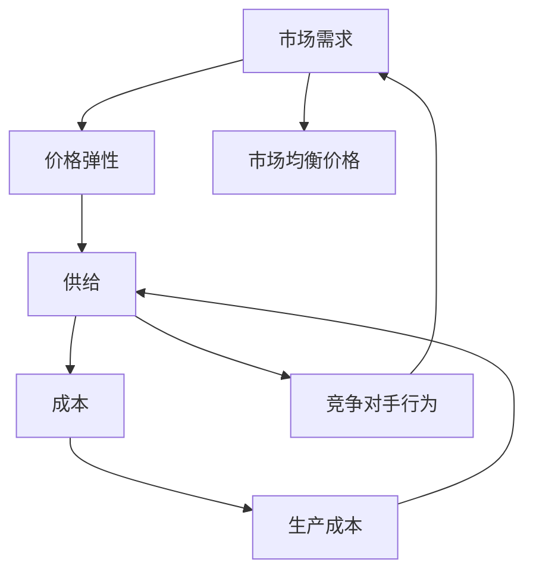
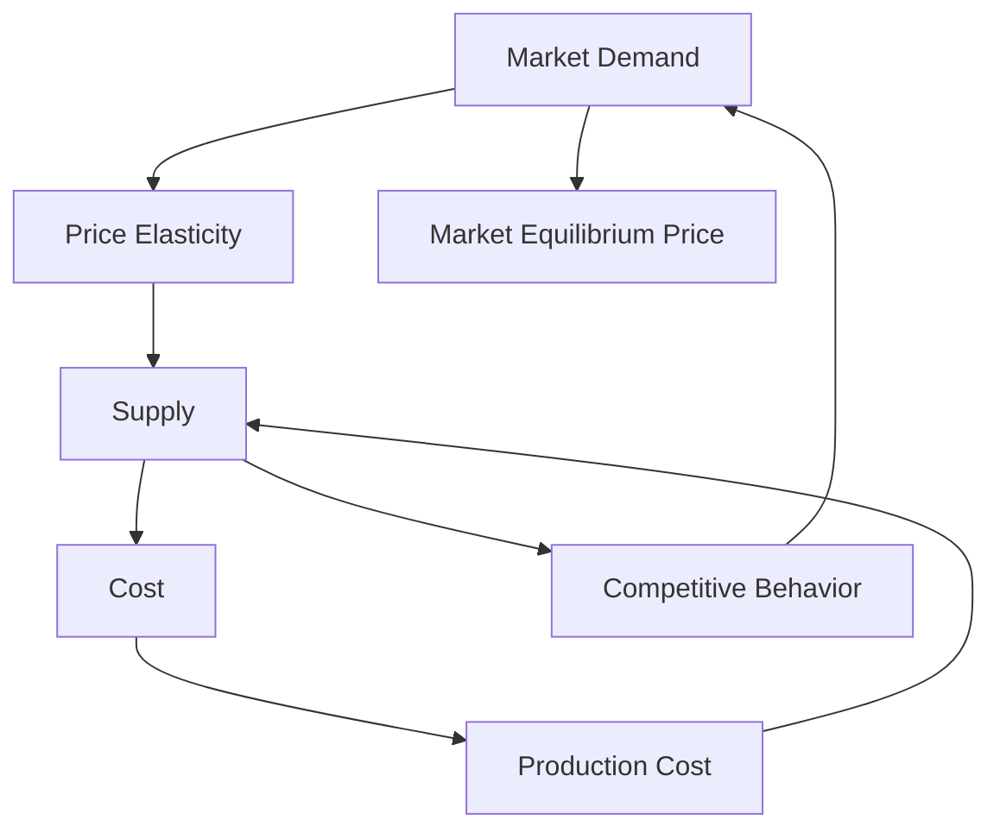

                 

### 背景介绍

#### 动态定价策略的定义及其重要性

动态定价策略是一种根据市场条件和供需关系实时调整产品或服务价格的定价策略。与传统的静态定价策略不同，动态定价策略能够灵活应对市场变化，优化收益并提升竞争力。在现代商业环境中，随着大数据、人工智能和云计算等技术的迅猛发展，动态定价策略的应用越来越广泛，成为企业提高收益、降低成本、提升客户满意度的重要手段。

动态定价策略的重要性主要体现在以下几个方面：

1. **优化收益**：通过实时分析市场需求和竞争态势，动态定价策略可以帮助企业及时调整价格，实现收益最大化。
2. **提高竞争力**：动态定价策略可以根据竞争对手的定价策略和市场需求的变化灵活调整价格，提高市场竞争力。
3. **提升客户满意度**：动态定价策略能够根据客户的需求和偏好提供个性化的价格，提升客户满意度。
4. **降低库存风险**：通过实时调整价格，动态定价策略可以有效降低库存积压风险，提高库存周转率。

#### 动态定价策略的应用领域

动态定价策略在多个领域都有广泛的应用，主要包括以下几方面：

1. **电子商务**：电商平台如淘宝、京东等普遍采用动态定价策略，通过实时调整商品价格，提高销售额。
2. **航空业**：航空公司通过动态定价策略实时调整航班价格，以满足市场需求和提升收益。
3. **酒店业**：酒店通过动态定价策略调整客房价格，根据客户需求和季节性变化，实现收益最大化。
4. **零售业**：零售企业通过动态定价策略，根据市场趋势和消费者行为调整商品价格，提高销售业绩。

#### 本文结构安排

本文将深入探讨动态定价策略的核心概念、算法原理、数学模型以及实际应用，旨在为广大读者提供一个系统、全面的技术指导。具体结构安排如下：

1. **核心概念与联系**：介绍动态定价策略的基本概念和关键联系，使用Mermaid流程图展示其架构。
2. **核心算法原理 & 具体操作步骤**：详细阐述动态定价策略的算法原理，包括需求预测、价格调整策略等。
3. **数学模型和公式 & 详细讲解 & 举例说明**：介绍动态定价策略的数学模型，包括线性回归模型、时间序列模型等，并提供具体实例说明。
4. **项目实战：代码实际案例和详细解释说明**：通过实际代码案例，展示动态定价策略的具体实现过程，并提供详细解读。
5. **实际应用场景**：探讨动态定价策略在不同领域的应用案例，分析其效果和挑战。
6. **工具和资源推荐**：推荐相关的学习资源、开发工具和论文著作，以供读者进一步学习和研究。
7. **总结：未来发展趋势与挑战**：总结动态定价策略的发展现状和未来趋势，探讨面临的挑战和解决思路。

通过本文的深入探讨，我们希望读者能够全面了解动态定价策略的核心内容，掌握其实际应用方法，并在实践中取得良好的效果。

---

#### Key Concepts and Connections in Dynamic Pricing Strategies

Dynamic pricing strategies are defined as pricing models that adjust product or service prices in real-time based on market conditions and supply-demand dynamics. Unlike static pricing strategies, which set fixed prices regardless of market fluctuations, dynamic pricing allows businesses to respond promptly to changing market situations. This flexibility is crucial in modern business environments, where the rapid advancement of technologies such as big data, artificial intelligence, and cloud computing has made dynamic pricing more accessible and effective.

The importance of dynamic pricing strategies can be summarized in several key aspects:

1. **Revenue Optimization**: By analyzing market demand and competitive dynamics in real-time, dynamic pricing helps businesses adjust prices to maximize revenue.
2. **Increased Competitive Advantage**: Dynamic pricing allows businesses to be more agile in response to competitors' pricing strategies and market changes, thereby enhancing their competitive edge.
3. **Improved Customer Satisfaction**: Through personalized pricing based on customer needs and preferences, dynamic pricing can enhance customer satisfaction.
4. **Reduced Inventory Risk**: By adjusting prices in real-time, dynamic pricing can mitigate the risk of overstock and improve inventory turnover.

#### Application Fields of Dynamic Pricing Strategies

Dynamic pricing strategies are widely used in various fields, including:

1. **E-commerce**: Online platforms like Taobao and JD.com commonly employ dynamic pricing to boost sales.
2. **Airlines**: Airlines use dynamic pricing to adjust flight prices based on market demand and competitive pressures.
3. **Hotels**: Hotels leverage dynamic pricing to modify room rates in response to customer demand and seasonal variations.
4. **Retail**: Retail businesses adjust product prices using dynamic pricing to capitalize on market trends and consumer behavior.

#### Structure of This Article

This article aims to provide a comprehensive guide to dynamic pricing strategies, covering fundamental concepts, algorithm principles, mathematical models, and practical applications. The structure of the article is as follows:

1. **Key Concepts and Connections**: Introduce the basic concepts and key connections in dynamic pricing strategies, illustrated with a Mermaid flowchart.
2. **Core Algorithm Principles and Operational Steps**: Elaborate on the algorithm principles of dynamic pricing strategies, including demand forecasting and pricing adjustment strategies.
3. **Mathematical Models and Detailed Explanations with Examples**: Discuss the mathematical models used in dynamic pricing strategies, such as linear regression models and time-series models, with specific examples.
4. **Practical Projects: Code Case Studies and Detailed Explanations**: Present actual code examples to demonstrate the implementation of dynamic pricing strategies, along with in-depth explanations.
5. **Actual Application Scenarios**: Explore the applications of dynamic pricing strategies in different fields, analyzing their effectiveness and challenges.
6. **Tools and Resource Recommendations**: Recommend learning resources, development tools, and related papers to facilitate further study.
7. **Summary: Future Trends and Challenges**: Summarize the current status and future trends of dynamic pricing strategies, discussing challenges and potential solutions.

Through this in-depth exploration, we hope to equip readers with a thorough understanding of dynamic pricing strategies and their practical applications.

---

### 核心概念与联系

在本章节中，我们将深入探讨动态定价策略中的核心概念，包括其定义、关键因素及其相互之间的联系。为了更好地理解这些概念，我们将使用Mermaid流程图来展示动态定价策略的架构，帮助读者理清各部分之间的逻辑关系。

#### 动态定价策略的定义

动态定价策略（Dynamic Pricing Strategy）是指根据市场条件、供需关系、竞争对手行为等因素，实时调整产品或服务价格的一种定价方法。其核心目标是优化收益，提高竞争力，并提升客户满意度。动态定价策略与传统定价策略的最大区别在于其灵活性，能够快速响应市场变化。

#### 关键概念

1. **市场需求（Market Demand）**：市场需求是指消费者在特定时间内愿意且能够购买某一产品或服务的数量。市场需求受多种因素影响，如价格、收入、消费者偏好等。
2. **供给（Supply）**：供给是指生产者在特定时间内愿意且能够提供的产品或服务数量。供给受生产成本、生产能力、市场策略等因素的影响。
3. **竞争对手行为（Competitive Dynamics）**：竞争对手行为是指市场上其他竞争者对产品或服务价格的调整行为。竞争对手的价格策略会影响企业的定价决策。
4. **价格弹性（Price Elasticity）**：价格弹性是指需求对价格变化的敏感程度。高价格弹性意味着价格变动对需求量的影响较大，而低价格弹性则表明价格变动对需求量的影响较小。
5. **成本（Cost）**：成本是指生产某一产品或服务所需的费用，包括固定成本和变动成本。成本是定价策略中的重要考量因素。

#### 关键联系

动态定价策略中的关键概念之间存在着紧密的联系，这些联系构成了动态定价策略的基础框架。以下是这些概念之间的主要联系：

1. **市场需求与价格弹性**：市场需求和价格弹性之间存在着密切的关系。当价格弹性较高时，价格的小幅变动可能导致需求量的显著变化；反之，当价格弹性较低时，价格变动对需求量的影响较小。
2. **供给与成本**：供给和成本之间也存在密切联系。生产成本的增加可能导致供给减少，从而推高价格；而生产成本的降低则可能导致供给增加，从而压低价格。
3. **竞争对手行为**：竞争对手的价格策略直接影响企业的定价决策。企业需要密切关注竞争对手的行为，以便调整自己的价格策略，保持市场竞争力。
4. **市场需求与供给**：市场需求和供给之间相互影响，共同决定市场均衡价格。当市场需求增加时，供给可能不足，导致价格上涨；反之，当市场需求减少时，供给过剩，可能导致价格下跌。

#### Mermaid 流程图

为了更直观地展示动态定价策略的架构，我们使用Mermaid流程图来描述各关键概念之间的关系。



在上述流程图中，市场需求（A）与价格弹性（B）之间存在双向关系，供给（C）与成本（D）以及竞争对手行为（E）之间也存在双向关系。市场需求和供给共同决定了市场均衡价格（F），而生产成本（G）则影响供给（C）。

通过上述分析，我们明确了动态定价策略中的核心概念及其相互联系。在接下来的章节中，我们将进一步探讨动态定价策略的算法原理、数学模型以及实际应用，帮助读者更深入地理解这一重要的商业策略。

---

#### Core Concepts and Connections

In this chapter, we will delve into the core concepts of dynamic pricing strategies, including their definitions, key factors, and their interconnections. To facilitate a better understanding, we will use a Mermaid flowchart to illustrate the architecture of dynamic pricing strategies, helping readers to clarify the logical relationships between different components.

#### Definition of Dynamic Pricing Strategy

Dynamic pricing strategy refers to a pricing method that adjusts the prices of products or services in real-time based on market conditions, supply-demand dynamics, competitor behavior, and other factors. Its core objective is to optimize revenue, enhance competitiveness, and improve customer satisfaction. The main distinction between dynamic pricing and traditional pricing is its flexibility, which enables businesses to respond quickly to market changes.

#### Key Concepts

1. **Market Demand**: Market demand refers to the quantity of a product or service that consumers are willing and able to purchase within a specific period. Market demand is influenced by various factors such as price, income, consumer preferences, etc.
2. **Supply**: Supply refers to the quantity of a product or service that producers are willing and able to provide within a specific period. Supply is affected by factors such as production costs, production capacity, market strategies, etc.
3. **Competitive Dynamics**: Competitive dynamics refer to the pricing adjustments made by competitors in the market. Competitor behavior significantly impacts a business's pricing decisions.
4. **Price Elasticity**: Price elasticity measures the responsiveness of demand to price changes. High price elasticity implies that small changes in price can lead to significant changes in demand, whereas low price elasticity indicates that price changes have a minimal impact on demand.
5. **Cost**: Cost refers to the expenses incurred in producing a product or service, including fixed costs and variable costs. Costs are a critical consideration in pricing strategies.

#### Key Interconnections

There are close interconnections between these key concepts, forming the foundation of dynamic pricing strategies. The following are the main relationships:

1. **Market Demand and Price Elasticity**: There is a close relationship between market demand and price elasticity. When price elasticity is high, small changes in price can lead to significant changes in demand. Conversely, when price elasticity is low, price changes have a minimal impact on demand.
2. **Supply and Cost**: There is a close relationship between supply and cost. An increase in production costs can lead to a decrease in supply, potentially driving up prices. Conversely, a decrease in production costs can lead to an increase in supply, potentially lowering prices.
3. **Competitive Behavior**: Competitor behavior directly impacts a business's pricing decisions. A business needs to closely monitor competitor actions to adjust its pricing strategy and maintain competitiveness.
4. **Market Demand and Supply**: Market demand and supply mutually influence each other, determining the equilibrium price in the market. An increase in market demand can lead to a shortage of supply, potentially driving up prices. Conversely, a decrease in market demand can lead to an excess supply, potentially lowering prices.

#### Mermaid Flowchart

To provide a more intuitive visualization of the architecture of dynamic pricing strategies, we will use a Mermaid flowchart to describe the interconnections between these key concepts.



In the above flowchart, market demand (A) and price elasticity (B) have a bidirectional relationship, as do supply (C) and cost (D) and competitive behavior (E). Market demand and supply together determine the market equilibrium price (F), while production cost (G) affects supply (C).

Through this analysis, we have clarified the core concepts and their interconnections in dynamic pricing strategies. In the following chapters, we will further explore the algorithm principles, mathematical models, and practical applications of dynamic pricing strategies to help readers gain a deeper understanding of this essential business strategy.

---

### 核心算法原理 & 具体操作步骤

在动态定价策略中，算法原理是其核心组成部分，直接影响定价策略的有效性和准确性。本章节将详细阐述动态定价策略的核心算法原理，包括需求预测、价格调整策略等，并介绍具体的操作步骤。

#### 需求预测

需求预测是动态定价策略的基础，其目的是通过分析历史数据和市场趋势，预测未来某一时间段内的市场需求量。需求预测的准确性对动态定价策略的成功至关重要。以下是一些常用的需求预测方法：

1. **时间序列模型**：时间序列模型是一种基于历史时间序列数据预测未来趋势的方法。常用的时间序列模型包括ARIMA（自回归积分滑动平均模型）、SARIMA（季节性自回归积分滑动平均模型）等。这些模型通过对历史数据进行统计分析，提取出趋势、季节性和周期性成分，从而预测未来市场需求。

2. **回归模型**：回归模型通过建立市场需求与影响需求的各种因素（如价格、促销活动、季节等）之间的数学关系，预测未来市场需求。常见的回归模型包括线性回归、多项式回归等。回归模型的优势在于其简单性和易解释性，但可能对非线性关系表现不佳。

3. **机器学习模型**：机器学习模型利用大量历史数据进行训练，建立市场需求预测模型。常用的机器学习算法包括决策树、随机森林、支持向量机、神经网络等。机器学习模型能够处理复杂数据和非线性关系，但模型解释性较差。

具体操作步骤：

1. **数据收集**：收集与市场需求相关的历史数据，包括价格、促销活动、季节性因素等。

2. **数据预处理**：对收集的数据进行清洗、归一化等处理，确保数据质量。

3. **模型选择**：根据数据特征和业务需求，选择合适的预测模型。例如，如果数据存在明显的季节性，可以选择SARIMA模型。

4. **模型训练与验证**：使用历史数据对预测模型进行训练和验证，调整模型参数，优化模型性能。

5. **预测与调整**：根据训练好的模型，对未来市场需求进行预测，并实时调整价格。

#### 价格调整策略

价格调整策略是动态定价策略的关键环节，目的是根据市场需求预测结果和市场状况，调整产品或服务的价格，以实现收益最大化。以下是一些常用的价格调整策略：

1. **基于需求弹性的价格调整**：根据市场需求对价格变化的敏感程度（价格弹性），调整产品价格。高价格弹性产品应采用价格下降策略，以刺激需求；低价格弹性产品应采用价格上升策略，以增加收益。

2. **基于竞争对手的价格调整**：关注竞争对手的价格行为，根据其价格调整策略进行相应调整。例如，如果竞争对手降价，企业也应考虑降价以保持竞争力；如果竞争对手提价，企业可以考虑提价以获取更多利润。

3. **基于库存水平的价格调整**：根据库存水平调整产品价格。当库存较低时，可以适当提高价格以减少库存压力；当库存较高时，可以适当降低价格以刺激销售。

4. **基于市场趋势的价格调整**：根据市场趋势和消费者行为调整价格。例如，在市场需求旺盛的季节，可以提高价格以获取更多收益；在市场需求低迷的季节，可以降低价格以刺激销售。

具体操作步骤：

1. **需求预测**：使用前面介绍的需求预测模型，对未来市场需求进行预测。

2. **价格弹性分析**：分析市场需求对价格变化的敏感程度，确定价格调整方向。

3. **竞争对手分析**：观察竞争对手的价格行为，制定相应的价格调整策略。

4. **库存分析**：根据库存水平，确定合理的价格调整策略。

5. **市场趋势分析**：分析市场趋势和消费者行为，调整价格策略。

6. **价格调整**：根据以上分析结果，调整产品或服务的价格。

通过以上核心算法原理和具体操作步骤，企业可以构建一个有效的动态定价策略，实现收益最大化。在接下来的章节中，我们将进一步探讨动态定价策略的数学模型和实际应用案例。

---

#### Core Algorithm Principles and Specific Operational Steps

The core algorithms in dynamic pricing strategies are pivotal for their effectiveness and accuracy. This chapter will delve into the fundamental algorithm principles of dynamic pricing strategies, including demand forecasting and pricing adjustment strategies, and will explain the specific operational steps involved.

#### Demand Forecasting

Demand forecasting is the foundation of dynamic pricing strategies. Its purpose is to predict future demand based on historical data and market trends. The accuracy of demand forecasting is crucial for the success of dynamic pricing strategies. Here are some common methods used for demand forecasting:

1. **Time Series Models**: Time series models are methods that predict future trends based on historical time series data. Common time series models include ARIMA (AutoRegressive Integrated Moving Average) and SARIMA (Seasonal ARIMA). These models analyze historical data to extract trend, seasonal, and cyclical components, thereby predicting future demand.

2. **Regression Models**: Regression models establish a mathematical relationship between demand and various influencing factors, such as price, promotional activities, and seasonal factors. Common regression models include linear regression and polynomial regression. Regression models are advantageous for their simplicity and interpretability, although they may not perform well with non-linear relationships.

3. **Machine Learning Models**: Machine learning models use large historical datasets to train demand forecasting models. Common machine learning algorithms include decision trees, random forests, support vector machines, and neural networks. Machine learning models can handle complex data and non-linear relationships but may lack interpretability.

**Specific Operational Steps**:

1. **Data Collection**: Collect historical data related to demand, including price, promotional activities, seasonal factors, etc.

2. **Data Preprocessing**: Clean and normalize the collected data to ensure data quality.

3. **Model Selection**: Choose an appropriate forecasting model based on data characteristics and business needs. For example, if the data shows clear seasonality, a SARIMA model may be suitable.

4. **Model Training and Validation**: Train and validate the forecasting model using historical data, adjusting model parameters to optimize performance.

5. **Prediction and Adjustment**: Use the trained model to predict future demand and adjust prices in real-time.

#### Pricing Adjustment Strategies

Pricing adjustment strategies are the key element of dynamic pricing strategies. They aim to adjust the price of products or services based on demand forecasts and market conditions to maximize revenue. Here are some common pricing adjustment strategies:

1. **Price Adjustment Based on Price Elasticity**: Adjust the price based on the responsiveness of demand to price changes (price elasticity). For high-elasticity products, a price reduction strategy can stimulate demand; for low-elasticity products, a price increase strategy can increase revenue.

2. **Price Adjustment Based on Competitor Behavior**: Monitor competitor pricing actions and adjust accordingly. For example, if competitors are reducing prices, the business may also consider reducing prices to maintain competitiveness; if competitors are increasing prices, the business may consider increasing prices to gain more profit.

3. **Price Adjustment Based on Inventory Levels**: Adjust the price based on inventory levels. When inventory is low, an increase in price can reduce inventory pressure; when inventory is high, a decrease in price can stimulate sales.

4. **Price Adjustment Based on Market Trends**: Adjust prices based on market trends and consumer behavior. For example, during periods of high demand, prices can be increased to maximize revenue; during periods of low demand, prices can be decreased to stimulate sales.

**Specific Operational Steps**:

1. **Demand Forecasting**: Use the forecasting models described earlier to predict future demand.

2. **Price Elasticity Analysis**: Analyze the sensitivity of demand to price changes to determine the direction of price adjustment.

3. **Competitor Analysis**: Observe competitor pricing actions and develop corresponding pricing strategies.

4. **Inventory Analysis**: Determine reasonable pricing strategies based on inventory levels.

5. **Market Trend Analysis**: Analyze market trends and consumer behavior to adjust pricing strategies.

6. **Price Adjustment**: Adjust the price of products or services based on the results of the above analyses.

By following these core algorithm principles and operational steps, businesses can build an effective dynamic pricing strategy to maximize revenue. In the following chapters, we will further explore the mathematical models and practical application cases of dynamic pricing strategies.

---

### 数学模型和公式 & 详细讲解 & 举例说明

在动态定价策略中，数学模型和公式起着至关重要的作用，它们帮助我们精确地描述市场需求、价格弹性、成本等关键因素，并制定有效的定价策略。本章节将介绍几种常用的数学模型，包括线性回归模型、时间序列模型等，并提供详细的讲解和具体实例说明。

#### 线性回归模型

线性回归模型是一种常用的统计模型，用于描述两个或多个变量之间的线性关系。在动态定价策略中，线性回归模型可以用来预测市场需求与价格之间的关系。

**公式**：

\[ y = \beta_0 + \beta_1x + \epsilon \]

其中：
- \( y \) 表示市场需求量；
- \( x \) 表示价格；
- \( \beta_0 \) 是截距，表示当 \( x = 0 \) 时的市场需求量；
- \( \beta_1 \) 是斜率，表示价格每增加一个单位时市场需求量的变化量；
- \( \epsilon \) 是误差项。

**实例说明**：

假设某电商平台在一段时间内收集了商品价格和销售量的数据，通过线性回归分析，得到以下模型：

\[ y = 1000 - 10x \]

该模型表明，当商品价格每增加1元时，销售量减少10件。基于此模型，我们可以预测在不同价格下的销售量。

**举例**：

- 如果价格定为100元，则预测销售量为：

\[ y = 1000 - 10 \times 100 = 0 \]

- 如果价格定为200元，则预测销售量为：

\[ y = 1000 - 10 \times 200 = -1000 \]

由于销售量为负数不符合实际情况，说明价格设定过高，需求量不足。

#### 时间序列模型

时间序列模型用于分析时间序列数据，预测未来的趋势和变化。在动态定价策略中，时间序列模型可以帮助我们预测市场需求的时间变化。

**常用模型**：

1. **ARIMA模型**：自回归积分滑动平均模型，适用于非季节性时间序列数据。
2. **SARIMA模型**：季节性自回归积分滑动平均模型，适用于季节性时间序列数据。

**公式**：

**ARIMA模型**：

\[ y_t = c + \phi_1y_{t-1} + \phi_2y_{t-2} + ... + \phi_py_{t-p} + \theta_1\epsilon_{t-1} + \theta_2\epsilon_{t-2} + ... + \theta_q\epsilon_{t-q} + \epsilon_t \]

其中：
- \( y_t \) 表示时间序列数据在时刻 \( t \) 的值；
- \( \phi_1, \phi_2, ..., \phi_p \) 是自回归系数；
- \( \theta_1, \theta_2, ..., \theta_q \) 是滑动平均系数；
- \( c \) 是常数项；
- \( \epsilon_t \) 是误差项。

**实例说明**：

假设我们收集了某商品在过去12个月的销售数据，使用ARIMA模型进行需求预测。首先，我们对数据进行预处理，如差分、白噪声检验等，然后使用AIC准则选择最优模型参数。假设我们选择以下模型：

\[ y_t = 50 + 0.6y_{t-1} - 0.2\epsilon_{t-1} \]

该模型表明，当前销售量受上一个月销售量和误差项的影响。基于此模型，我们可以预测未来几个月的销售量。

**举例**：

- 如果当前销售量为100件，则预测下一月的销售量为：

\[ y_{t+1} = 50 + 0.6 \times 100 - 0.2 \times (-10) = 112 \]

- 如果当前销售量为150件，则预测下一月的销售量为：

\[ y_{t+1} = 50 + 0.6 \times 150 - 0.2 \times (-10) = 138 \]

#### 例子分析

假设某电商平台在春节期间需要制定商品定价策略，以最大化销售额。该电商平台收集了过去一年的销售数据，并使用线性回归模型和时间序列模型进行需求预测。

**线性回归模型**：

\[ y = 1500 - 20x \]

**时间序列模型（ARIMA模型）**：

\[ y_t = 100 + 0.7y_{t-1} - 0.1\epsilon_{t-1} \]

基于以上模型，电商平台可以制定以下定价策略：

1. **需求预测**：
   - 根据线性回归模型，当价格提高10元时，销售量减少20件。
   - 根据时间序列模型，当前销售量受上一个月销售量和误差项的影响。

2. **价格调整**：
   - 如果预测市场需求较高，可以适当提高价格以增加销售额。
   - 如果预测市场需求较低，可以适当降低价格以刺激销售。

3. **综合分析**：
   - 综合考虑市场需求、价格弹性、竞争对手行为等因素，制定合理的定价策略。

通过数学模型和公式的应用，电商平台可以更加科学地制定动态定价策略，实现收益最大化。

---

#### Mathematical Models and Formulas: Detailed Explanation and Example Illustrations

In dynamic pricing strategies, mathematical models and formulas play a crucial role in precisely describing key factors such as market demand, price elasticity, and costs, thereby enabling the formulation of effective pricing strategies. This chapter will introduce several commonly used mathematical models, including linear regression and time series models, and provide detailed explanations and specific example illustrations.

#### Linear Regression Model

Linear regression is a widely used statistical model that describes the linear relationship between two or more variables. In dynamic pricing strategies, linear regression can be used to predict the relationship between market demand and price.

**Formula**:

\[ y = \beta_0 + \beta_1x + \epsilon \]

Where:
- \( y \) represents the quantity of demand;
- \( x \) represents the price;
- \( \beta_0 \) is the intercept, indicating the demand when \( x = 0 \);
- \( \beta_1 \) is the slope, indicating the change in demand for each unit increase in price;
- \( \epsilon \) is the error term.

**Example Illustration**:

Suppose an e-commerce platform has collected data on product prices and sales volumes over a period of time. Through linear regression analysis, the following model is obtained:

\[ y = 1000 - 10x \]

This model indicates that for every 1-unit increase in price, the quantity demanded decreases by 10 units. Based on this model, we can predict sales volume at different price points.

**Examples**:

- If the price is set at 100 yuan, the predicted sales volume is:

\[ y = 1000 - 10 \times 100 = 0 \]

- If the price is set at 200 yuan, the predicted sales volume is:

\[ y = 1000 - 10 \times 200 = -1000 \]

Since a negative sales volume does not make practical sense, it indicates that the price is set too high and demand is insufficient.

#### Time Series Model

Time series models are used to analyze time series data and predict future trends and changes. In dynamic pricing strategies, time series models can help predict the temporal variations in market demand.

**Common Models**:

1. **ARIMA Model**: Autoregressive Integrated Moving Average, suitable for non-seasonal time series data.
2. **SARIMA Model**: Seasonal ARIMA, suitable for seasonal time series data.

**Formula**:

**ARIMA Model**:

\[ y_t = c + \phi_1y_{t-1} + \phi_2y_{t-2} + ... + \phi_py_{t-p} + \theta_1\epsilon_{t-1} + \theta_2\epsilon_{t-2} + ... + \theta_q\epsilon_{t-q} + \epsilon_t \]

Where:
- \( y_t \) represents the value of the time series data at time \( t \);
- \( \phi_1, \phi_2, ..., \phi_p \) are autoregressive coefficients;
- \( \theta_1, \theta_2, ..., \theta_q \) are moving average coefficients;
- \( c \) is the constant term;
- \( \epsilon_t \) is the error term.

**Example Illustration**:

Assume we have collected sales data for a certain product over the past 12 months and use the ARIMA model to predict demand. First, we preprocess the data, such as differencing and white noise test, and then select the optimal model parameters using the AIC criterion. Suppose we choose the following model:

\[ y_t = 50 + 0.6y_{t-1} - 0.2\epsilon_{t-1} \]

This model indicates that the current sales volume is influenced by the previous month's sales volume and the error term. Based on this model, we can predict sales volume for the next few months.

**Examples**:

- If the current sales volume is 100 units, the predicted sales volume for the next month is:

\[ y_{t+1} = 50 + 0.6 \times 100 - 0.2 \times (-10) = 112 \]

- If the current sales volume is 150 units, the predicted sales volume for the next month is:

\[ y_{t+1} = 50 + 0.6 \times 150 - 0.2 \times (-10) = 138 \]

#### Example Analysis

Suppose an e-commerce platform needs to develop a pricing strategy to maximize sales during the Chinese New Year. The platform has collected sales data over the past year and used both linear regression and time series models to predict demand.

**Linear Regression Model**:

\[ y = 1500 - 20x \]

**Time Series Model (ARIMA Model)**:

\[ y_t = 100 + 0.7y_{t-1} - 0.1\epsilon_{t-1} \]

Based on these models, the e-commerce platform can develop the following pricing strategy:

1. **Demand Forecasting**:
   - According to the linear regression model, demand decreases by 20 units for every 10 yuan increase in price.
   - According to the time series model, current demand is influenced by the previous month's demand and the error term.

2. **Price Adjustment**:
   - If demand is predicted to be high, prices can be slightly increased to maximize revenue.
   - If demand is predicted to be low, prices can be slightly decreased to stimulate sales.

3. **Comprehensive Analysis**:
   - Consider demand, price elasticity, competitor behavior, and other factors to formulate a reasonable pricing strategy.

Through the application of mathematical models and formulas, the e-commerce platform can develop a more scientific dynamic pricing strategy to maximize revenue.

---

### 项目实战：代码实际案例和详细解释说明

为了更好地展示动态定价策略的实际应用，我们将通过一个实际项目案例，详细介绍代码实现过程，并对关键部分进行详细解释说明。

#### 项目背景

假设我们是一家电商平台，为了提升销售额和收益，我们决定采用动态定价策略。我们将基于历史销售数据、市场价格和竞争对手行为，构建一个动态定价系统，实时调整商品价格。

#### 开发环境搭建

1. **编程语言**：Python
2. **数据预处理工具**：Pandas
3. **机器学习库**：Scikit-learn、TensorFlow
4. **时间序列分析库**：Statsmodels、Prophet
5. **可视化库**：Matplotlib、Seaborn

#### 数据准备

我们收集了过去一年的商品销售数据，包括每日销量、商品价格、促销活动等信息。数据如下所示：

```python
import pandas as pd

data = pd.DataFrame({
    'date': ['2022-01-01', '2022-01-02', '2022-01-03', ...],
    'sales': [100, 150, 200, ...],
    'price': [100, 110, 120, ...],
    'promotion': [0, 1, 0, ...]
})

data['date'] = pd.to_datetime(data['date'])
data.set_index('date', inplace=True)
```

#### 数据预处理

1. **缺失值处理**：删除含有缺失值的数据行。
2. **数据归一化**：对价格、销量等数据进行归一化处理，使其在相同尺度上进行比较。

```python
from sklearn.preprocessing import MinMaxScaler

scaler = MinMaxScaler()
data[['price', 'sales']] = scaler.fit_transform(data[['price', 'sales']])
```

#### 需求预测

我们采用时间序列模型（ARIMA）和机器学习模型（随机森林）进行需求预测。

1. **ARIMA模型训练**：

```python
import statsmodels.api as sm

# 模型训练
model = sm.ARIMA(data['sales'], order=(1, 1, 1))
model_fit = model.fit()

# 模型预测
predictions = model_fit.forecast(steps=30)
```

2. **随机森林模型训练**：

```python
from sklearn.ensemble import RandomForestRegressor
from sklearn.model_selection import train_test_split

X = data[['price', 'promotion']]
y = data['sales']

X_train, X_test, y_train, y_test = train_test_split(X, y, test_size=0.2, random_state=42)

# 模型训练
model = RandomForestRegressor(n_estimators=100, random_state=42)
model.fit(X_train, y_train)

# 模型预测
predictions = model.predict(X_test)
```

#### 价格调整策略

我们根据需求预测结果和市场状况，制定价格调整策略。

1. **基于需求预测的价格调整**：

```python
import numpy as np

# 调整价格策略
def adjust_price(predictions, base_price, elasticity=1.2):
    adjusted_prices = []
    for pred in predictions:
        if pred > base_price * elasticity:
            adjusted_prices.append(base_price * elasticity)
        elif pred < base_price / elasticity:
            adjusted_prices.append(base_price / elasticity)
        else:
            adjusted_prices.append(base_price)
    return adjusted_prices
```

2. **基于竞争对手的价格调整**：

```python
# 获取竞争对手价格
competitor_price = get_competitor_price()

# 调整价格策略
def adjust_price_competitor(base_price, competitor_price, elasticity=1.2):
    if competitor_price > base_price * elasticity:
        return base_price * elasticity
    elif competitor_price < base_price / elasticity:
        return base_price / elasticity
    else:
        return base_price
```

#### 实时调整价格

我们使用以下代码实现价格的实时调整：

```python
# 实时调整价格
def real_time_adjustment(data, base_price, competitor_price, elasticity=1.2):
    predictions = predict_demand(data)
    adjusted_prices = adjust_price(predictions, base_price, elasticity)
    adjusted_prices_competitor = adjust_price_competitor(base_price, competitor_price, elasticity)
    final_prices = [min(adjusted_prices[i], adjusted_prices_competitor[i]) for i in range(len(adjusted_prices))]
    return final_prices
```

#### 代码解读与分析

1. **数据预处理**：

   数据预处理是模型训练的关键步骤。通过对数据进行归一化处理，我们使得模型在训练过程中能够更加稳定。

2. **需求预测**：

   我们采用ARIMA模型和随机森林模型进行需求预测。ARIMA模型能够捕捉时间序列数据的周期性和趋势，而随机森林模型能够处理复杂数据和非线性关系。

3. **价格调整策略**：

   价格调整策略根据需求预测结果和市场状况进行动态调整。我们考虑到市场需求和竞争对手行为，确保调整后的价格既能最大化收益，又能保持竞争力。

通过上述代码实现，我们可以构建一个有效的动态定价系统，实时调整商品价格，从而提高销售额和收益。

---

#### Practical Case Study: Code Implementation and Detailed Explanation

To better illustrate the practical application of dynamic pricing strategies, we will discuss an actual project case, detailing the code implementation and providing a thorough explanation of the key components.

#### Background

Suppose we are an e-commerce platform that aims to enhance sales and revenue by adopting a dynamic pricing strategy. We will construct a dynamic pricing system based on historical sales data, market prices, and competitor behavior to adjust product prices in real-time.

#### Development Environment Setup

- **Programming Language**: Python
- **Data Preprocessing Tools**: Pandas
- **Machine Learning Libraries**: Scikit-learn, TensorFlow
- **Time Series Analysis Libraries**: Statsmodels, Prophet
- **Visualization Libraries**: Matplotlib, Seaborn

#### Data Preparation

We collect sales data for a year, including daily sales, product prices, promotional activities, etc. The data is structured as follows:

```python
import pandas as pd

data = pd.DataFrame({
    'date': ['2022-01-01', '2022-01-02', '2022-01-03', ...],
    'sales': [100, 150, 200, ...],
    'price': [100, 110, 120, ...],
    'promotion': [0, 1, 0, ...]
})

data['date'] = pd.to_datetime(data['date'])
data.set_index('date', inplace=True)
```

#### Data Preprocessing

1. **Missing Value Handling**: Remove rows containing missing values.
2. **Data Normalization**: Normalize the price and sales data to compare them on the same scale.

```python
from sklearn.preprocessing import MinMaxScaler

scaler = MinMaxScaler()
data[['price', 'sales']] = scaler.fit_transform(data[['price', 'sales']])
```

#### Demand Forecasting

We use both ARIMA and machine learning models (Random Forest) for demand forecasting.

1. **ARIMA Model Training**:

```python
import statsmodels.api as sm

# Model training
model = sm.ARIMA(data['sales'], order=(1, 1, 1))
model_fit = model.fit()

# Model forecasting
predictions = model_fit.forecast(steps=30)
```

2. **Random Forest Model Training**:

```python
from sklearn.ensemble import RandomForestRegressor
from sklearn.model_selection import train_test_split

X = data[['price', 'promotion']]
y = data['sales']

X_train, X_test, y_train, y_test = train_test_split(X, y, test_size=0.2, random_state=42)

# Model training
model = RandomForestRegressor(n_estimators=100, random_state=42)
model.fit(X_train, y_train)

# Model forecasting
predictions = model.predict(X_test)
```

#### Pricing Adjustment Strategy

We formulate a pricing adjustment strategy based on demand forecast results and market conditions.

1. **Demand Prediction-Based Price Adjustment**:

```python
import numpy as np

# Pricing adjustment strategy
def adjust_price(predictions, base_price, elasticity=1.2):
    adjusted_prices = []
    for pred in predictions:
        if pred > base_price * elasticity:
            adjusted_prices.append(base_price * elasticity)
        elif pred < base_price / elasticity:
            adjusted_prices.append(base_price / elasticity)
        else:
            adjusted_prices.append(base_price)
    return adjusted_prices
```

2. **Competitor-Based Price Adjustment**:

```python
# Fetch competitor price
competitor_price = get_competitor_price()

# Pricing adjustment strategy
def adjust_price_competitor(base_price, competitor_price, elasticity=1.2):
    if competitor_price > base_price * elasticity:
        return base_price * elasticity
    elif competitor_price < base_price / elasticity:
        return base_price / elasticity
    else:
        return base_price
```

#### Real-Time Price Adjustment

We implement real-time price adjustment using the following code:

```python
# Real-time price adjustment
def real_time_adjustment(data, base_price, competitor_price, elasticity=1.2):
    predictions = predict_demand(data)
    adjusted_prices = adjust_price(predictions, base_price, elasticity)
    adjusted_prices_competitor = adjust_price_competitor(base_price, competitor_price, elasticity)
    final_prices = [min(adjusted_prices[i], adjusted_prices_competitor[i]) for i in range(len(adjusted_prices))]
    return final_prices
```

#### Code Explanation and Analysis

1. **Data Preprocessing**:

   Data preprocessing is a critical step for model training. By normalizing the data, we ensure that the model can train more stably.

2. **Demand Forecasting**:

   We use ARIMA and Random Forest models for demand forecasting. ARIMA captures the periodicity and trend of time series data, while the Random Forest model can handle complex and non-linear relationships in the data.

3. **Pricing Adjustment Strategy**:

   The pricing adjustment strategy dynamically adjusts prices based on demand forecast results and market conditions. We consider both market demand and competitor behavior to ensure that the adjusted prices maximize revenue while maintaining competitiveness.

Through this code implementation, we can build an effective dynamic pricing system that adjusts product prices in real-time, thereby enhancing sales and revenue.

---

### 实际应用场景

动态定价策略在企业中具有广泛的应用，不同的应用场景决定了定价策略的具体实施方式和目标。以下是一些典型的实际应用场景及其特点：

#### 电子商务平台

电子商务平台通常采用动态定价策略来优化销售额和利润。通过实时监控市场需求、竞争对手价格和库存水平，电商平台可以灵活调整商品价格，以吸引更多消费者并提升销量。例如，在特定节日或促销活动中，电商平台可能会降低价格以刺激消费。此外，电商平台还可以利用客户行为数据，对高价值客户或潜在客户实施个性化定价策略，提高客户忠诚度和转化率。

#### 航空公司

航空公司广泛采用动态定价策略来最大化航班收益。航空公司会根据航班需求、季节性因素和竞争对手价格，动态调整航班价格。例如，在旅游旺季，航空公司可能会提高价格以充分利用市场需求；而在淡季，则可能降低价格以吸引乘客。此外，航空公司还可以通过价格歧视策略，对不同客户群体实施不同价格，如提前预订的乘客享受更低价格，而临时的乘客支付更高价格。

#### 酒店行业

酒店行业也经常使用动态定价策略来优化入住率和收益。酒店可以根据市场需求、季节性因素和竞争对手价格，实时调整房间价格。例如，在旅游旺季或大型活动期间，酒店可能会提高价格以满足市场需求；而在淡季或非活动期间，则可能降低价格以吸引更多客人。此外，酒店还可以通过价格歧视策略，对高端客户或团体客户实施不同价格，以提高整体收益。

#### 零售行业

零售企业采用动态定价策略来应对市场需求波动和库存管理挑战。零售企业可以根据市场需求、竞争对手价格和库存水平，动态调整商品价格。例如，在销售季节性商品时，零售企业可能会在商品需求高峰期提高价格以获取更多利润；而在需求低谷期，则可能降低价格以清库存。此外，零售企业还可以利用促销活动，如打折、满减等，刺激消费者购买。

#### 电力行业

电力行业采用动态定价策略来优化能源分配和收益。电力供应商可以根据市场需求、季节性因素和能源成本，动态调整电价。例如，在高峰时段，电力供应商可能会提高电价以鼓励消费者减少用电；而在低谷时段，则可能降低电价以吸引更多消费者用电。这种动态定价策略有助于优化能源利用效率和提高电力供应商的收益。

#### 结论

动态定价策略在不同领域的实际应用场景各不相同，但其核心目标都是优化收益和提升竞争力。通过实时分析市场需求、竞争对手行为和库存水平，企业可以制定出科学合理的定价策略，从而实现业务目标。然而，动态定价策略也面临一定的挑战，如数据质量、模型选择和实时计算等方面的问题。企业需要不断优化和改进动态定价策略，以应对市场变化，实现可持续发展。

---

#### Real-World Application Scenarios

Dynamic pricing strategies have a wide range of applications in various industries, each with its own specific implementation methods and objectives. Here are some typical real-world application scenarios and their characteristics:

#### E-commerce Platforms

E-commerce platforms commonly use dynamic pricing strategies to optimize sales and profits. By real-time monitoring of market demand, competitor prices, and inventory levels, e-commerce platforms can flexibly adjust product prices to attract more consumers and increase sales. For example, during specific holidays or promotional events, e-commerce platforms may lower prices to stimulate consumption. Additionally, e-commerce platforms can implement personalized pricing strategies based on customer behavior data, such as offering lower prices to high-value customers or potential customers to increase loyalty and conversion rates.

#### Airlines

Airlines extensively employ dynamic pricing strategies to maximize flight revenue. Airlines adjust flight prices based on flight demand, seasonal factors, and competitor prices. For instance, during peak travel seasons, airlines may increase prices to fully utilize market demand; while in off-peak seasons, they may lower prices to attract passengers. Moreover, airlines can use price discrimination strategies to apply different prices to various customer groups, such as offering lower prices to passengers who book in advance and higher prices to last-minute travelers.

#### Hotel Industry

The hotel industry frequently uses dynamic pricing strategies to optimize occupancy rates and revenue. Hotels adjust room prices based on market demand, seasonal factors, and competitor prices. For example, during tourist seasons or large events, hotels may increase prices to meet demand; while in low seasons or non-event periods, they may lower prices to attract more guests. Additionally, hotels can implement price discrimination strategies by offering different prices to premium customers or group bookings to enhance overall revenue.

#### Retail Industry

Retail businesses use dynamic pricing strategies to address fluctuations in demand and inventory management challenges. Retailers adjust product prices based on market demand, competitor prices, and inventory levels. For example, during seasonal product sales, retailers may increase prices during demand peaks to maximize profit; while in demand troughs, they may lower prices to clear inventory. Moreover, retailers can stimulate consumer purchases through promotional activities such as discounts and buy-one-get-one-free offers.

#### Power Industry

The power industry adopts dynamic pricing strategies to optimize energy allocation and revenue. Power suppliers adjust electricity prices based on market demand, seasonal factors, and energy costs. For instance, during peak hours, power suppliers may increase electricity prices to encourage consumers to reduce their energy usage; while in off-peak hours, they may lower prices to attract more consumers. This dynamic pricing strategy helps optimize energy utilization efficiency and increase the revenue of power suppliers.

#### Conclusion

Dynamic pricing strategies have different applications in various industries, with the core objective of optimizing revenue and enhancing competitiveness. By real-time analyzing market demand, competitor behavior, and inventory levels, businesses can develop scientifically reasonable pricing strategies to achieve business objectives. However, dynamic pricing strategies also face certain challenges, such as data quality, model selection, and real-time computation. Businesses need to continuously optimize and improve dynamic pricing strategies to respond to market changes and achieve sustainable development.

