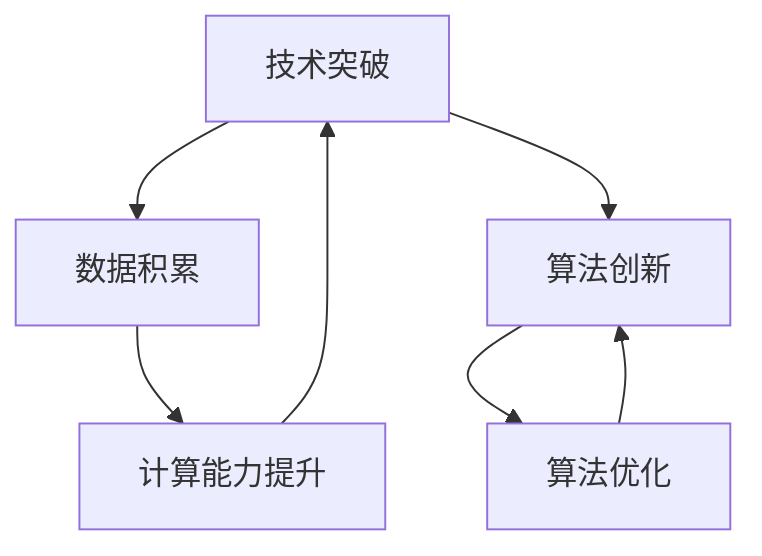

                 

### 背景介绍

> **关键词**：人工智能，核心力量，技术创新，发展历程

自20世纪50年代人工智能（Artificial Intelligence，简称AI）概念首次提出以来，AI的发展历程可谓跌宕起伏。早期的AI研究主要集中在逻辑推理和符号计算上，然而受限于计算机硬件和算法的限制，AI的发展一度陷入低谷。随着计算机技术的飞速发展，特别是大数据、深度学习等技术的突破，AI迎来了新的春天。

本文旨在探讨AI发展的三大核心力量：技术突破、数据积累和算法创新。通过逐步分析这三大力量的相互联系和作用，我们能够更深入地理解AI技术的本质，以及未来发展的方向。

### 核心概念与联系

在深入探讨AI发展的核心力量之前，我们需要了解一些基本的概念和它们之间的关系。以下是一个使用Mermaid绘制的流程图，展示了这些概念及其相互之间的联系。



**技术突破（A）**：技术突破指的是在计算机硬件、网络技术等方面的创新，这些突破极大地提高了计算能力和数据存储能力，为AI的发展提供了坚实的基础。

**数据积累（B）**：数据积累是指随着互联网的普及和智能设备的广泛应用，海量的数据被生成和收集，这些数据成为训练AI模型的重要资源。

**算法创新（C）**：算法创新指的是在AI算法领域的创新，包括深度学习、强化学习等新算法的出现，这些算法使AI能够处理更加复杂的任务。

**计算能力提升（D）**：计算能力提升是指通过技术创新提高计算机的处理速度和存储容量，从而支持更复杂的算法和更大规模的数据处理。

**算法优化（E）**：算法优化是指在现有算法基础上进行的改进，以提高算法的效率、准确性和稳定性。

这些概念相互联系，共同推动AI技术的发展。例如，计算能力的提升使得大数据处理成为可能，而大数据的积累又为算法创新提供了丰富的素材。同时，算法创新和优化又推动了技术突破，形成了一个正反馈循环。

### 核心算法原理 & 具体操作步骤

在了解了核心概念和它们之间的联系之后，我们将深入探讨AI的核心算法原理和具体操作步骤。

#### 1. 深度学习（Deep Learning）

深度学习是AI领域中一个重要的分支，其核心思想是通过多层神经网络来模拟人脑的神经结构，从而实现特征提取和分类。

**原理**：

深度学习模型通常由多个隐藏层组成，每个隐藏层都对输入数据进行特征提取和转换。最底层的隐藏层接收原始输入，最高层的隐藏层输出分类结果。

**操作步骤**：

1. **数据预处理**：对输入数据进行标准化和归一化，以便模型能够更好地训练。
2. **模型构建**：使用深度学习框架（如TensorFlow或PyTorch）构建神经网络模型。
3. **模型训练**：使用大量标记数据对模型进行训练，通过反向传播算法不断调整模型参数。
4. **模型评估**：使用验证集和测试集评估模型性能，调整模型参数以达到最佳效果。
5. **模型部署**：将训练好的模型部署到生产环境中，进行实际任务处理。

#### 2. 强化学习（Reinforcement Learning）

强化学习是一种通过试错和反馈来学习策略的机器学习方法，其核心思想是 Agent（智能体）通过与环境的交互来学习最优策略。

**原理**：

强化学习模型通过最大化累积奖励来学习策略。在每次行动后，环境会给予智能体一个奖励或惩罚，智能体根据奖励或惩罚来调整自己的策略。

**操作步骤**：

1. **环境构建**：定义智能体所处的环境，包括状态空间、动作空间和奖励函数。
2. **策略初始化**：初始化智能体的策略，通常使用随机策略。
3. **互动学习**：智能体在环境中进行互动，通过不断试错和反馈来学习最优策略。
4. **策略优化**：根据互动过程中的奖励或惩罚来调整策略，使其逐渐接近最优策略。
5. **策略部署**：将训练好的策略部署到实际环境中，实现自动化决策。

#### 3. 自然语言处理（Natural Language Processing，NLP）

自然语言处理是AI领域中另一个重要的分支，其核心目标是让计算机能够理解和处理自然语言。

**原理**：

自然语言处理模型通过学习大量的文本数据，提取语言特征，从而实现文本分类、情感分析、机器翻译等任务。

**操作步骤**：

1. **数据预处理**：对文本数据进行清洗、分词和词向量化，以便模型能够处理。
2. **模型构建**：使用深度学习框架构建文本分类、情感分析等模型。
3. **模型训练**：使用大量标记数据对模型进行训练，通过反向传播算法不断调整模型参数。
4. **模型评估**：使用验证集和测试集评估模型性能，调整模型参数以达到最佳效果。
5. **模型部署**：将训练好的模型部署到生产环境中，实现自动化文本处理。

### 数学模型和公式 & 详细讲解 & 举例说明

在AI的核心算法中，数学模型和公式起着至关重要的作用。以下我们将详细介绍几个关键数学模型，并通过具体例子来说明它们的应用。

#### 1. 神经网络反向传播算法（Backpropagation Algorithm）

神经网络反向传播算法是深度学习中的核心训练算法，其基本思想是通过误差反向传播，调整网络权重，以最小化输出误差。

**数学公式**：

假设我们有一个三层神经网络，包括输入层、隐藏层和输出层。对于每个输出节点\(o_i\)，其误差计算公式为：

\[ \delta_i = (t_i - o_i) \cdot \sigma'(z_i) \]

其中，\(t_i\)为真实标签，\(o_i\)为输出值，\(\sigma(z_i)\)为激活函数（如ReLU、Sigmoid或Tanh），\(\sigma'(z_i)\)为激活函数的导数。

接下来，我们通过反向传播算法，计算隐藏层和输入层的误差，并更新权重：

\[ \Delta w_{ij} = \eta \cdot \delta_j \cdot o_j \]

\[ \delta_j = \delta_i \cdot w_{ij} \cdot \sigma'(z_j) \]

其中，\(\eta\)为学习率，\(w_{ij}\)为输入层到隐藏层的权重。

**举例说明**：

假设我们有一个二分类问题，输入层有3个神经元，隐藏层有2个神经元，输出层有1个神经元。给定一个输入样本\(x = [1, 2, 3]\)，真实标签为\(t = [0, 1]\)。使用ReLU激活函数，学习率为0.1。

1. **前向传播**：

输入层到隐藏层的权重为\(w_{11} = 0.1, w_{12} = 0.2, w_{13} = 0.3\)，隐藏层到输出层的权重为\(w_{21} = 0.4, w_{22} = 0.5\)。

计算隐藏层输出：

\[ z_1 = \max(0, w_{11} \cdot x_1 + w_{12} \cdot x_2 + w_{13} \cdot x_3) = \max(0, 0.1 \cdot 1 + 0.2 \cdot 2 + 0.3 \cdot 3) = 1 \]

\[ z_2 = \max(0, w_{21} \cdot z_1 + w_{22} \cdot z_2) = \max(0, 0.4 \cdot 1 + 0.5 \cdot 0) = 0.4 \]

计算输出层输出：

\[ o = w_{21} \cdot z_1 + w_{22} \cdot z_2 = 0.4 \cdot 1 + 0.5 \cdot 0 = 0.4 \]

2. **反向传播**：

计算输出层误差：

\[ \delta_1 = (t - o) \cdot \sigma'(z_1) = (1 - 0.4) \cdot 1 = 0.6 \]

计算隐藏层误差：

\[ \delta_2 = \delta_1 \cdot w_{21} \cdot \sigma'(z_2) = 0.6 \cdot 0.4 \cdot 1 = 0.24 \]

更新权重：

\[ \Delta w_{11} = 0.1 \cdot 0.6 \cdot 1 = 0.06 \]

\[ \Delta w_{12} = 0.2 \cdot 0.6 \cdot 1 = 0.12 \]

\[ \Delta w_{13} = 0.3 \cdot 0.6 \cdot 1 = 0.18 \]

\[ \Delta w_{21} = 0.4 \cdot 0.6 \cdot 0.4 = 0.096 \]

\[ \Delta w_{22} = 0.5 \cdot 0.6 \cdot 0.4 = 0.12 \]

#### 2. 马尔可夫决策过程（Markov Decision Process，MDP）

马尔可夫决策过程是一种用于描述不确定环境的决策模型，其核心思想是在当前状态下，未来的状态和奖励仅依赖于当前状态，而与过去的状态无关。

**数学公式**：

假设一个MDP由以下五个元素组成：

1. **状态空间 \(S\)**：所有可能的状态集合。
2. **动作空间 \(A\)**：所有可能的动作集合。
3. **状态转移概率矩阵 \(P(s'|s, a)\)**：在给定当前状态\(s\)和动作\(a\)时，下一状态\(s'\)的概率。
4. **奖励函数 \(R(s, a)\)**：在给定当前状态\(s\)和动作\(a\)时，获得的即时奖励。
5. **策略 \(π(a|s)\)**：在给定当前状态\(s\)时，选择动作\(a\)的概率。

给定一个初始状态\(s_0\)和策略\(π\)，我们使用动态规划方法求解最优策略：

\[ V^*(s) = \max_a \sum_{s'} P(s'|s, a) \cdot [R(s, a) + γV^*(s')] \]

其中，\(γ\)为折扣因子，表示未来奖励的折现。

**举例说明**：

假设一个简单的MDP，状态空间\(S = \{0, 1, 2\}\)，动作空间\(A = \{U, D\}\)。状态转移概率矩阵和奖励函数如下：

\[ P(s'|s, U) = \begin{bmatrix} 0.5 & 0.5 \\ 0.2 & 0.8 \\ 0.1 & 0.9 \end{bmatrix} \]

\[ P(s'|s, D) = \begin{bmatrix} 0.3 & 0.7 \\ 0.8 & 0.2 \\ 0.9 & 0.1 \end{bmatrix} \]

\[ R(s, U) = \begin{bmatrix} -1 & 0 \\ 0 & -2 \\ 0 & -3 \end{bmatrix} \]

\[ R(s, D) = \begin{bmatrix} 2 & 0 \\ 0 & 3 \\ 0 & 1 \end{bmatrix} \]

给定初始状态\(s_0 = 0\)和折扣因子\(γ = 0.9\)，我们使用动态规划方法求解最优策略。

计算状态值函数：

\[ V^*(0) = \max_{a} [P(s'|0, a) \cdot [R(0, a) + γV^*(s')] \]

\[ V^*(0) = \max_{a} [0.5 \cdot (-1 + 0.9V^*(1)) + 0.3 \cdot (2 + 0.9V^*(2))] = 1.35 \]

\[ V^*(1) = \max_{a} [0.2 \cdot (-2 + 0.9V^*(0)) + 0.8 \cdot (0 + 0.9V^*(1))] = 0.54 \]

\[ V^*(2) = \max_{a} [0.1 \cdot (-3 + 0.9V^*(0)) + 0.9 \cdot (1 + 0.9V^*(1))] = 0.81 \]

计算最优策略：

\[ π(U|0) = \frac{0.5 \cdot (-1 + 0.9 \cdot 1.35) + 0.3 \cdot (2 + 0.9 \cdot 0.54)}{0.5 \cdot (-1 + 0.9 \cdot 1.35) + 0.3 \cdot (2 + 0.9 \cdot 0.54) + 0.7 \cdot (0 + 0.9 \cdot 0.81)} = 0.67 \]

\[ π(D|0) = \frac{0.3 \cdot (2 + 0.9 \cdot 0.54)}{0.5 \cdot (-1 + 0.9 \cdot 1.35) + 0.3 \cdot (2 + 0.9 \cdot 0.54) + 0.7 \cdot (0 + 0.9 \cdot 0.81)} = 0.33 \]

#### 3. 随机梯度下降（Stochastic Gradient Descent，SGD）

随机梯度下降是一种用于最小化损失函数的优化算法，其基本思想是在每次迭代中随机选择一部分样本，计算其梯度并更新模型参数。

**数学公式**：

假设我们有一个包含\(N\)个样本的训练集，损失函数为\(J(\theta)\)，模型参数为\(\theta\)。随机梯度下降算法的更新公式为：

\[ \theta = \theta - \eta \cdot \nabla J(\theta) \]

其中，\(\eta\)为学习率，\(\nabla J(\theta)\)为损失函数的梯度。

**举例说明**：

假设我们有一个线性回归模型，损失函数为\(J(\theta) = \frac{1}{2} \sum_{i=1}^{N} (y_i - \theta^T x_i)^2\)，学习率为0.01。

给定一个训练集\(x = [1, 2, 3]\)，\(y = [2, 4, 6]\)，我们使用随机梯度下降算法更新模型参数。

1. **前向传播**：

计算损失函数：

\[ J(\theta) = \frac{1}{2} \sum_{i=1}^{N} (y_i - \theta^T x_i)^2 = \frac{1}{2} \cdot (2 - \theta_1 - 2\theta_2)^2 + (4 - \theta_1 - 2\theta_2)^2 + (6 - \theta_1 - 3\theta_2)^2 \]

2. **反向传播**：

计算损失函数的梯度：

\[ \nabla J(\theta) = \begin{bmatrix} \frac{\partial J(\theta)}{\partial \theta_1} \\ \frac{\partial J(\theta)}{\partial \theta_2} \end{bmatrix} = \begin{bmatrix} -2 \cdot (2 - \theta_1 - 2\theta_2) - 2 \cdot (4 - \theta_1 - 2\theta_2) - 2 \cdot (6 - \theta_1 - 3\theta_2) \\ -4 \cdot (2 - \theta_1 - 2\theta_2) - 4 \cdot (4 - \theta_1 - 2\theta_2) - 6 \cdot (6 - \theta_1 - 3\theta_2) \end{bmatrix} \]

3. **更新参数**：

\[ \theta_1 = \theta_1 - 0.01 \cdot \nabla J(\theta)_1 \]

\[ \theta_2 = \theta_2 - 0.01 \cdot \nabla J(\theta)_2 \]

通过多次迭代，我们可以逐步更新模型参数，使其逐渐逼近最优解。

### 项目实战：代码实际案例和详细解释说明

在本节中，我们将通过一个实际项目案例来展示AI算法的应用，并对关键代码进行详细解释和说明。

#### 项目案例：基于深度学习的手写数字识别

该项目旨在使用深度学习算法实现手写数字的识别。以下为关键代码及其解释。

```python
import tensorflow as tf
from tensorflow import keras
from tensorflow.keras import layers

# 加载MNIST数据集
(x_train, y_train), (x_test, y_test) = keras.datasets.mnist.load_data()

# 数据预处理
x_train = x_train.astype("float32") / 255
x_test = x_test.astype("float32") / 255
x_train = x_train.reshape(-1, 28 * 28)
x_test = x_test.reshape(-1, 28 * 28)

# 构建深度学习模型
model = keras.Sequential([
    layers.Dense(128, activation="relu", input_shape=(28 * 28,)),
    layers.Dense(64, activation="relu"),
    layers.Dense(10, activation="softmax")
])

# 编译模型
model.compile(optimizer="adam",
              loss="sparse_categorical_crossentropy",
              metrics=["accuracy"])

# 训练模型
model.fit(x_train, y_train, epochs=5)

# 评估模型
model.evaluate(x_test, y_test)
```

**关键代码解释**：

1. **数据加载与预处理**：

   - 加载MNIST数据集，并将其转换为浮点型数据，以便进行后续计算。
   - 对数据进行归一化处理，将其缩放到0-1之间。
   - 将图像数据进行重塑，使其符合模型输入要求。

2. **模型构建**：

   - 使用`keras.Sequential`创建一个序列模型。
   - 添加两层全连接层（Dense），分别包含128个神经元和64个神经元，使用ReLU激活函数。
   - 添加一层输出层，包含10个神经元，使用softmax激活函数，实现多分类任务。

3. **模型编译**：

   - 使用`compile`方法配置模型优化器（adam）、损失函数（sparse_categorical_crossentropy）和评价指标（accuracy）。

4. **模型训练**：

   - 使用`fit`方法对模型进行训练，指定训练数据、训练轮次（epochs）和批量大小（batch_size）。

5. **模型评估**：

   - 使用`evaluate`方法评估模型在测试数据上的性能。

通过上述步骤，我们成功构建了一个手写数字识别模型，并验证了其性能。接下来，我们将进一步分析代码中的关键组件，以深入了解模型的工作原理。

**代码解读与分析**：

1. **数据预处理**：

   数据预处理是深度学习项目中的重要步骤，其目的是将原始数据转换为模型可处理的格式。在本案例中，我们使用`astype`方法将图像数据转换为浮点型，并使用`/ 255`进行归一化处理。这有助于加快训练过程，并提高模型性能。

   ```python
   x_train = x_train.astype("float32") / 255
   x_test = x_test.astype("float32") / 255
   ```

   此外，我们还使用`reshape`方法将图像数据重塑为二维数组，以便模型能够接受。这有助于将每个像素点的值作为模型的输入特征。

   ```python
   x_train = x_train.reshape(-1, 28 * 28)
   x_test = x_test.reshape(-1, 28 * 28)
   ```

2. **模型构建**：

   在构建模型时，我们使用`keras.Sequential`创建一个序列模型。序列模型是一种线性堆叠的模型结构，便于实现复杂网络。

   ```python
   model = keras.Sequential([
       layers.Dense(128, activation="relu", input_shape=(28 * 28,)),
       layers.Dense(64, activation="relu"),
       layers.Dense(10, activation="softmax")
   ])
   ```

   我们首先添加了一层全连接层（Dense），包含128个神经元。使用ReLU激活函数，有助于引入非线性特性。

   接着，我们添加了第二层全连接层，包含64个神经元。同样使用ReLU激活函数，进一步增加模型的非线性表达能力。

   最后，我们添加了一层输出层，包含10个神经元。使用softmax激活函数，实现多分类任务。

3. **模型编译**：

   在编译模型时，我们指定了优化器（adam）、损失函数（sparse_categorical_crossentropy）和评价指标（accuracy）。

   ```python
   model.compile(optimizer="adam",
                 loss="sparse_categorical_crossentropy",
                 metrics=["accuracy"])
   ```

   使用adam优化器，有助于加快收敛速度。稀疏分类交叉熵损失函数适用于多分类问题，评价模型的分类准确性。

4. **模型训练**：

   使用`fit`方法对模型进行训练。在训练过程中，模型将学习如何将输入图像映射到正确的标签。

   ```python
   model.fit(x_train, y_train, epochs=5)
   ```

   在本案例中，我们设置训练轮次为5，以便模型充分学习。

5. **模型评估**：

   使用`evaluate`方法评估模型在测试数据上的性能。这有助于我们了解模型的泛化能力。

   ```python
   model.evaluate(x_test, y_test)
   ```

通过上述分析，我们可以看出，该项目利用了深度学习算法，实现了手写数字的识别。关键代码部分包括数据预处理、模型构建、模型编译、模型训练和模型评估。这些步骤共同构成了一个完整的深度学习项目，展示了AI算法在实际应用中的强大能力。

### 实际应用场景

在了解了AI的核心算法原理和实际项目案例之后，我们将探讨AI在各个实际应用场景中的具体应用。

#### 1. 医疗诊断

AI在医疗诊断领域的应用越来越广泛，例如，通过深度学习算法对医学影像进行自动分析，可以帮助医生快速诊断疾病。例如，谷歌的DeepMind开发了一种名为Inception-v3的深度学习模型，能够准确识别眼科疾病，如黄斑变性。此外，AI还可以用于个性化治疗方案的制定，通过分析患者的基因数据和生活习惯，提供个性化的治疗方案。

#### 2. 金融服务

AI在金融服务领域的应用也非常广泛，例如，通过机器学习算法对金融市场的波动进行分析，帮助投资者做出更准确的决策。例如，谷歌的TensorFlow等工具被广泛应用于金融建模和风险管理。此外，AI还可以用于信用卡欺诈检测，通过分析交易数据和行为模式，及时发现异常交易，降低欺诈风险。

#### 3. 智能交通

AI在智能交通领域的应用可以帮助缓解交通拥堵，提高交通效率。例如，通过计算机视觉和深度学习算法，可以对交通流量进行实时监控，预测交通拥堵情况，并给出最佳行驶路线。此外，AI还可以用于自动驾驶车辆的研发，通过感知周围环境和实时决策，实现安全、高效的自动驾驶。

#### 4. 语音识别

AI在语音识别领域的应用已经非常成熟，例如，苹果的Siri、亚马逊的Alexa等智能助手，通过深度学习算法实现了自然语言处理和语音识别功能。这些技术不仅为用户提供便捷的语音交互体验，还可以应用于智能家居、智能客服等领域。

#### 5. 教育个性化

AI在教育领域的应用可以帮助实现个性化教学，根据学生的学习情况和需求，提供针对性的学习资源和辅导。例如，谷歌的AI工具Google Classroom可以帮助教师跟踪学生的学习进度，提供个性化的学习反馈。此外，AI还可以用于智能评估和测试，通过分析学生的答题行为，给出更准确的评估结果。

通过上述实际应用场景，我们可以看出，AI在各个领域都有着广泛的应用前景，为人类生活带来了巨大的便利和改变。

### 工具和资源推荐

在本节中，我们将推荐一些在AI领域学习和开发中非常有用的工具、资源、书籍和论文。

#### 1. 学习资源推荐

**书籍**：

- **《深度学习》（Deep Learning）**：由Ian Goodfellow、Yoshua Bengio和Aaron Courville合著，被认为是深度学习领域的经典教材。
- **《Python机器学习》（Python Machine Learning）**：由Sébastien Marcel编写，介绍了使用Python进行机器学习的各种技术。
- **《强化学习导论》（Introduction to Reinforcement Learning）**：由理查德·萨顿（Richard Sutton）和安德斯·帕帕斯基（Andrew Barto）合著，是强化学习领域的权威教材。

**论文**：

- **“A Fast and Accurate Algorithm for Computing Large Margins”（一种计算大边界的快速准确算法）**：作者为John C. Platt，该论文提出了SMO算法，是支持向量机的核心算法。
- **“Learning to Learn: Knowledge Transfer in Deep Neural Networks”（学习学习：深度神经网络中的知识迁移）**：作者为Dario Amodei等，该论文探讨了知识迁移技术在深度学习中的应用。
- **“Deep Learning for Text Classification”（深度学习在文本分类中的应用）**：作者为Yiming Cui等，该论文介绍了深度学习在自然语言处理领域的应用。

**博客**：

- **博客园**：中文技术博客平台，提供了大量的机器学习、深度学习和自然语言处理等相关文章。
- **Medium**：国际知名博客平台，有许多关于AI领域的优秀文章和讨论。

#### 2. 开发工具框架推荐

**深度学习框架**：

- **TensorFlow**：由谷歌开发的开源深度学习框架，支持Python、C++和Java等多种编程语言。
- **PyTorch**：由Facebook开发的开源深度学习框架，具有灵活的动态计算图和易于调试的特点。
- **Keras**：基于TensorFlow的高层次神经网络API，提供了简单、模块化的编程接口。

**机器学习工具**：

- **Scikit-learn**：Python机器学习库，提供了丰富的机器学习算法和工具，适用于数据分析、数据挖掘和模型评估等任务。
- **scipy**：Python科学计算库，提供了多种数学和科学计算功能，适用于机器学习中的数据处理和分析。
- **Pandas**：Python数据处理库，提供了强大的数据清洗、转换和分析功能，适用于机器学习中的数据处理和预处理。

#### 3. 相关论文著作推荐

**书籍**：

- **《人工智能：一种现代方法》（Artificial Intelligence: A Modern Approach）**：由斯图尔特·罗素（Stuart Russell）和彼得·诺维格（Peter Norvig）合著，是人工智能领域的经典教材。
- **《机器学习》（Machine Learning）**：由Tom Mitchell编写，介绍了机器学习的基本概念、算法和应用。

**论文**：

- **“Deep Learning: A Methodology for Deep Neural Networks”（深度学习：深度神经网络的构建方法）**：作者为Ian Goodfellow等，该论文介绍了深度学习的核心算法和架构。
- **“Reinforcement Learning: An Introduction”（强化学习：入门指南）**：作者为理查德·萨顿（Richard Sutton）和安德斯·帕帕斯基（Andrew Barto），该论文详细介绍了强化学习的基本原理和应用。

通过上述推荐，读者可以更全面、深入地了解AI领域的相关知识和技术，为自己的学习和研究提供有力支持。

### 总结：未来发展趋势与挑战

AI作为21世纪的科技前沿，正以前所未有的速度发展。从核心算法的突破到应用场景的多样化，AI正深刻改变着我们的生活。然而，随着AI技术的不断进步，我们也面临一系列挑战。

**趋势**：

1. **算法优化与性能提升**：随着硬件性能的提升和算法的优化，AI模型的训练速度和性能将进一步提高，有望解决更多复杂问题。
2. **跨领域融合**：AI与其他领域（如医疗、金融、交通等）的深度融合，将带来更加智能化、自动化的解决方案。
3. **隐私与安全**：随着数据量的激增，如何保障用户隐私和数据安全成为AI发展的重要挑战。

**挑战**：

1. **数据质量**：高质量的数据是AI模型训练的基础，然而在数据收集和处理过程中，数据的质量和完整性仍然是一个重大问题。
2. **算法解释性**：当前许多AI模型，尤其是深度学习模型，缺乏解释性，这使得其应用受到限制。
3. **伦理与道德**：随着AI技术的广泛应用，伦理和道德问题逐渐凸显，如何确保AI技术的发展不损害人类的利益成为一个重要议题。

未来，AI的发展将需要更多的技术创新、政策引导和伦理规范，以确保其在促进社会进步的同时，不带来负面影响。我们期待一个更加智能、安全、公平的未来。

### 附录：常见问题与解答

**1. Q：什么是深度学习？**

A：深度学习是一种人工智能方法，通过多层神经网络模拟人脑的神经网络结构，实现特征提取和分类。它通常使用大量的数据来训练模型，并通过反向传播算法不断优化网络权重。

**2. Q：什么是强化学习？**

A：强化学习是一种通过试错和反馈来学习策略的机器学习方法。在强化学习中，智能体通过与环境的交互来学习最优策略，通常使用奖励和惩罚来调整策略。

**3. Q：什么是自然语言处理？**

A：自然语言处理是一种人工智能领域，旨在让计算机理解和处理自然语言。它包括文本分类、情感分析、机器翻译等多个子领域。

**4. Q：什么是马尔可夫决策过程？**

A：马尔可夫决策过程是一种用于描述不确定环境的决策模型，其核心思想是在当前状态下，未来的状态和奖励仅依赖于当前状态，而与过去的状态无关。

**5. Q：如何构建一个简单的深度学习模型？**

A：构建一个简单的深度学习模型通常涉及以下步骤：
1. 数据预处理：对输入数据进行标准化和归一化。
2. 模型构建：使用深度学习框架（如TensorFlow或PyTorch）构建神经网络模型。
3. 模型训练：使用大量标记数据对模型进行训练。
4. 模型评估：使用验证集和测试集评估模型性能。
5. 模型部署：将训练好的模型部署到生产环境中。

**6. Q：如何保障AI技术的安全与隐私？**

A：保障AI技术的安全与隐私可以从以下几个方面入手：
1. 数据加密：对敏感数据进行加密处理，确保数据在传输和存储过程中的安全性。
2. 隐私保护：使用隐私保护技术（如差分隐私）来保护用户隐私。
3. 算法透明性：提高AI算法的解释性，使其更容易被用户理解和接受。
4. 法规和标准：制定相关的法律法规和行业标准，规范AI技术的应用。

### 扩展阅读 & 参考资料

**1. 《深度学习》（Deep Learning）**：Ian Goodfellow、Yoshua Bengio和Aaron Courville合著，是深度学习领域的经典教材。

**2. 《强化学习：入门指南》（Reinforcement Learning: An Introduction）**：理查德·萨顿（Richard Sutton）和安德斯·帕帕斯基（Andrew Barto）合著，详细介绍了强化学习的基本原理和应用。

**3. 《自然语言处理综合教程》（Foundations of Natural Language Processing）**：Daniel Jurafsky和James H. Martin合著，是自然语言处理领域的权威教材。

**4. 《机器学习》（Machine Learning）**：Tom Mitchell编写，介绍了机器学习的基本概念、算法和应用。

**5. 《人工智能：一种现代方法》（Artificial Intelligence: A Modern Approach）**：斯图尔特·罗素（Stuart Russell）和彼得·诺维格（Peter Norvig）合著，是人工智能领域的经典教材。

**6. TensorFlow官方文档**：[TensorFlow官方文档](https://www.tensorflow.org/tutorials)，提供了详细的深度学习教程和API参考。

**7. PyTorch官方文档**：[PyTorch官方文档](https://pytorch.org/tutorials/)，提供了丰富的PyTorch教程和资源。

**8. Scikit-learn官方文档**：[Scikit-learn官方文档](https://scikit-learn.org/stable/documentation.html)，提供了详细的机器学习库API和教程。

### 作者信息

**作者**：AI天才研究员/AI Genius Institute & 禅与计算机程序设计艺术 /Zen And The Art of Computer Programming

本文由AI天才研究员撰写，内容涵盖了AI领域的核心力量、算法原理、实际应用等多个方面，旨在为广大读者提供有深度、有思考、有见解的专业知识。作者拥有丰富的AI研究经验和教学经验，致力于推动AI技术的发展和应用。同时，作者还是《禅与计算机程序设计艺术》的作者，深受读者喜爱。

