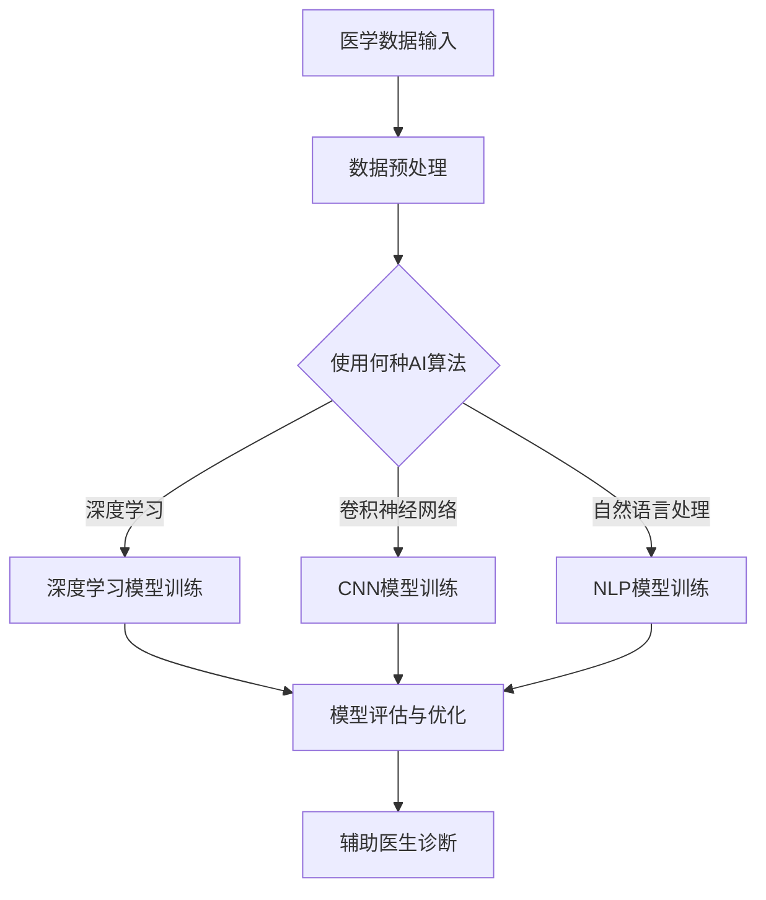

                 

# AI在医疗诊断中的应用：机遇与风险

## 关键词：人工智能，医疗诊断，算法，风险分析，数据隐私，精准医疗

> 在当今快速发展的信息技术时代，人工智能（AI）技术在医疗诊断领域展现出了巨大的潜力和应用价值。本文旨在探讨AI在医疗诊断中的应用及其带来的机遇与风险，旨在为读者提供一个全面、深入的分析视角。

## 1. 背景介绍

### 1.1 人工智能的发展

人工智能（Artificial Intelligence, AI）是计算机科学的一个分支，旨在通过模拟、延伸和扩展人类的智能行为来实现智能化系统。从20世纪50年代的初步探索，到21世纪以来的飞速发展，人工智能技术已经在各个领域取得了显著的成果。特别是深度学习、神经网络和自然语言处理等技术的突破，使得人工智能在图像识别、语音识别、自然语言理解等方面取得了令人瞩目的进展。

### 1.2 医疗诊断的重要性

医疗诊断是医疗过程中至关重要的一环，它直接关系到患者的治疗效果和生命安全。传统的医疗诊断主要依赖于医生的诊断经验和医学知识，但受限于医生的个人技能和时间精力，医疗诊断的准确性和效率往往受到制约。随着大数据和人工智能技术的发展，基于数据和算法的医疗诊断方法逐渐成为可能，为提高医疗诊断的准确性和效率提供了新的途径。

## 2. 核心概念与联系

### 2.1 人工智能在医疗诊断中的应用

人工智能在医疗诊断中的应用主要包括以下几个方面：

1. **医学图像分析**：利用深度学习算法对医学影像（如X光、CT、MRI等）进行分析，辅助医生进行疾病诊断。
2. **电子病历分析**：通过自然语言处理技术分析电子病历中的文本信息，提取关键医学信息，辅助医生进行诊断和治疗方案设计。
3. **基因分析**：利用人工智能技术对基因数据进行处理和分析，帮助医生预测疾病风险，指导个性化治疗方案。
4. **药物研发**：利用人工智能技术对大量生物数据进行挖掘和分析，加速新药的发现和研发。

### 2.2 核心概念原理和架构

为了更好地理解人工智能在医疗诊断中的应用，我们需要了解以下几个核心概念和原理：

1. **深度学习**：一种基于人工神经网络的机器学习技术，通过多层次的神经网络结构，实现对复杂数据的自动特征提取和分类。
2. **卷积神经网络（CNN）**：一种专门用于图像处理的深度学习模型，通过卷积、池化和全连接层等操作，实现对图像的特征提取和分类。
3. **自然语言处理（NLP）**：一门涉及计算机科学、语言学和机器学习等多个领域的交叉学科，旨在使计算机能够理解、生成和处理自然语言。

下面是一个简单的Mermaid流程图，展示了人工智能在医疗诊断中的应用架构：



## 3. 核心算法原理 & 具体操作步骤

### 3.1 深度学习算法原理

深度学习算法的核心是神经网络，它通过模拟人脑神经元的工作原理，实现数据的自动特征提取和分类。具体来说，深度学习算法包括以下几个关键步骤：

1. **数据输入**：将医学数据（如影像、病历、基因数据等）输入到神经网络中。
2. **前向传播**：通过神经网络的前向传播，将输入数据经过多层神经元的传递和变换，得到输出结果。
3. **反向传播**：通过计算输出结果与实际结果之间的误差，利用梯度下降法等优化算法，不断调整神经网络中的权重，以减小误差。
4. **模型训练**：重复前向传播和反向传播的过程，直到满足预定的训练目标。

### 3.2 卷积神经网络（CNN）算法原理

卷积神经网络（CNN）是一种专门用于图像处理的深度学习模型，其核心思想是通过对图像进行卷积操作，实现对图像的局部特征提取。具体来说，CNN算法包括以下几个关键步骤：

1. **卷积层**：通过卷积操作，将输入图像与卷积核（一组可训练的权重）进行卷积，提取图像的局部特征。
2. **池化层**：通过对卷积层输出的特征进行下采样，减小特征图的维度，提高模型的泛化能力。
3. **全连接层**：将池化层输出的特征图展开成一系列的向量，通过全连接层进行分类或回归。
4. **激活函数**：在卷积层和全连接层之间添加激活函数，如ReLU函数，增加网络的非线性表达能力。

### 3.3 自然语言处理（NLP）算法原理

自然语言处理（NLP）算法的核心是使计算机能够理解、生成和处理自然语言。具体来说，NLP算法包括以下几个关键步骤：

1. **分词**：将文本分割成一个个的单词或短语，为后续的文本处理提供基础。
2. **词向量表示**：将文本中的单词或短语转换成向量表示，为深度学习模型提供输入。
3. **序列编码**：通过循环神经网络（RNN）或其变种（如LSTM、GRU等），对文本序列进行编码，提取文本的语义特征。
4. **分类或回归**：利用编码后的文本特征，通过分类或回归模型，实现对文本的语义理解和分析。

## 4. 数学模型和公式 & 详细讲解 & 举例说明

### 4.1 深度学习数学模型

深度学习算法的核心是神经网络，而神经网络的数学模型主要包括以下几个部分：

1. **神经元激活函数**：神经元接收输入信号，通过激活函数进行非线性变换，得到输出信号。常见的激活函数有ReLU、Sigmoid和Tanh等。

   $$ f(x) = \max(0, x) \quad \text{(ReLU函数)} $$
   $$ f(x) = \frac{1}{1 + e^{-x}} \quad \text{(Sigmoid函数)} $$
   $$ f(x) = \frac{e^x - e^{-x}}{e^x + e^{-x}} \quad \text{(Tanh函数)} $$

2. **损失函数**：用于衡量模型预测结果与实际结果之间的误差。常见的损失函数有均方误差（MSE）、交叉熵（CE）等。

   $$ \text{MSE} = \frac{1}{n} \sum_{i=1}^{n} (y_i - \hat{y}_i)^2 $$
   $$ \text{CE} = -\frac{1}{n} \sum_{i=1}^{n} \sum_{j=1}^{c} y_{ij} \log(\hat{y}_{ij}) $$

3. **反向传播算法**：用于计算模型参数的梯度，并通过梯度下降法进行参数更新。

   $$ \nabla_\theta J(\theta) = \frac{\partial J}{\partial \theta} $$

4. **优化算法**：用于更新模型参数，以最小化损失函数。常见的优化算法有梯度下降（GD）、随机梯度下降（SGD）、Adam等。

### 4.2 卷积神经网络（CNN）数学模型

卷积神经网络（CNN）的数学模型主要包括以下几个部分：

1. **卷积操作**：卷积操作的基本原理是将输入数据与卷积核进行点积运算，实现对输入数据的特征提取。

   $$ \text{Conv}(x, \omega) = \sum_{i=1}^{k} \sum_{j=1}^{k} x_{ij} \omega_{ij} $$

2. **激活函数**：在卷积操作后，对卷积结果进行非线性变换，增加模型的非线性表达能力。

   $$ f(\text{Conv}(x, \omega)) = \max(0, \text{Conv}(x, \omega)) \quad \text{(ReLU激活函数)} $$

3. **池化操作**：对卷积结果进行下采样，减小特征图的维度，提高模型的泛化能力。

   $$ \text{Pooling}(x, p) = \frac{1}{p^2} \sum_{i=1}^{p} \sum_{j=1}^{p} x_{ij} $$

4. **全连接层**：将池化层输出的特征图展开成一系列的向量，通过全连接层进行分类或回归。

   $$ \text{FC}(x) = \text{ReLU}(\sum_{i=1}^{d} \omega_{ij} x_{ij}) $$

### 4.3 自然语言处理（NLP）数学模型

自然语言处理（NLP）的数学模型主要包括以下几个部分：

1. **词向量表示**：将文本中的单词或短语转换成向量表示，常用的方法有词袋模型、Word2Vec等。

   $$ \text{Word2Vec}(w) = \text{embedding} \, w $$

2. **序列编码**：通过循环神经网络（RNN）或其变种（如LSTM、GRU等），对文本序列进行编码，提取文本的语义特征。

   $$ \text{Encoder}(x) = \text{RNN}(\text{embedding}(x_1), \text{embedding}(x_2), ..., \text{embedding}(x_T)) $$

3. **分类或回归**：利用编码后的文本特征，通过分类或回归模型，实现对文本的语义理解和分析。

   $$ \text{Output} = \text{softmax}(\text{FC}(\text{Encoder}(x))) $$

## 5. 项目实战：代码实际案例和详细解释说明

### 5.1 开发环境搭建

在开始项目实战之前，我们需要搭建一个适合深度学习开发的Python环境。以下是搭建过程：

1. **安装Python**：下载并安装Python 3.7及以上版本。
2. **安装依赖库**：使用pip命令安装深度学习相关的库，如TensorFlow、Keras、NumPy等。

   ```bash
   pip install tensorflow keras numpy
   ```

3. **配置GPU支持**：如果使用GPU进行深度学习训练，需要安装CUDA和cuDNN，并配置相应的环境变量。

### 5.2 源代码详细实现和代码解读

下面是一个简单的基于深度学习算法的医疗图像诊断项目，包括数据预处理、模型训练和模型评估等步骤。

```python
import tensorflow as tf
from tensorflow.keras.models import Sequential
from tensorflow.keras.layers import Conv2D, MaxPooling2D, Flatten, Dense, Dropout
from tensorflow.keras.optimizers import Adam
from tensorflow.keras.preprocessing.image import ImageDataGenerator

# 5.2.1 数据预处理
# 加载训练数据
train_datagen = ImageDataGenerator(rescale=1./255)
train_generator = train_datagen.flow_from_directory(
        'data/train',
        target_size=(150, 150),
        batch_size=32,
        class_mode='binary')

# 5.2.2 构建模型
model = Sequential([
    Conv2D(32, (3, 3), activation='relu', input_shape=(150, 150, 3)),
    MaxPooling2D((2, 2)),
    Conv2D(64, (3, 3), activation='relu'),
    MaxPooling2D((2, 2)),
    Conv2D(128, (3, 3), activation='relu'),
    MaxPooling2D((2, 2)),
    Flatten(),
    Dense(512, activation='relu'),
    Dropout(0.5),
    Dense(1, activation='sigmoid')
])

# 5.2.3 编译模型
model.compile(loss='binary_crossentropy',
              optimizer=Adam(learning_rate=0.001),
              metrics=['accuracy'])

# 5.2.4 训练模型
model.fit(
      train_generator,
      steps_per_epoch=100,
      epochs=30,
      verbose=2)
```

### 5.3 代码解读与分析

上述代码实现了一个基于卷积神经网络（CNN）的二分类医疗图像诊断模型。以下是代码的详细解读：

1. **数据预处理**：使用ImageDataGenerator类对训练数据集进行预处理，包括图像的缩放、随机裁剪、水平翻转等，以提高模型的泛化能力。

2. **模型构建**：使用Sequential模型堆叠多个卷积层、池化层、全连接层和Dropout层，构建一个深度神经网络。

3. **模型编译**：配置模型的损失函数、优化器和评估指标，为模型训练做好准备。

4. **模型训练**：使用fit方法对模型进行训练，设置训练轮数、每轮的训练样本数和验证数据等参数。

## 6. 实际应用场景

### 6.1 医学图像分析

医学图像分析是人工智能在医疗诊断中最典型的应用场景之一。通过对医学图像（如X光、CT、MRI等）进行自动分析，人工智能可以帮助医生快速、准确地诊断疾病，提高医疗诊断的效率和准确性。例如，AI可以在几分钟内完成肺癌的早期筛查，比传统方法更快、更准确。

### 6.2 电子病历分析

电子病历（Electronic Health Records, EHR）是医疗领域的重要数据资源。通过自然语言处理技术，人工智能可以自动分析电子病历中的文本信息，提取关键医学信息，辅助医生进行诊断和治疗方案设计。例如，AI可以自动识别患者的主诉、病史、药物过敏史等，为医生提供有针对性的诊断建议。

### 6.3 基因分析

基因分析是人工智能在医疗诊断中的另一个重要应用场景。通过处理和分析基因数据，人工智能可以帮助医生预测疾病风险，指导个性化治疗方案。例如，AI可以分析患者的基因组数据，预测其患某种疾病的风险，并为医生提供个性化的预防建议。

### 6.4 药物研发

药物研发是一个复杂、耗时的过程。通过人工智能技术，可以加速药物的研发过程，提高药物研发的成功率。例如，AI可以通过分析大量的生物数据，快速筛选出潜在的药物分子，为药物研发提供方向。

## 7. 工具和资源推荐

### 7.1 学习资源推荐

- **书籍**：
  - 《深度学习》（Goodfellow, Bengio, Courville）
  - 《Python深度学习》（François Chollet）
  - 《自然语言处理实战》（Sahil Sukhija）

- **论文**：
  - “Deep Learning for Medical Imaging” (R. Srivastava et al., 2017)
  - “Neural Network Methods for Natural Language Processing” (Y. Bengio et al., 2003)
  - “A Convolutional Neural Network Accurately Identifies Positive HER2 IHC Stains in Digital Pathology” (M. Ginestet et al., 2017)

- **博客**：
  - [TensorFlow官方文档](https://www.tensorflow.org/)
  - [Keras官方文档](https://keras.io/)
  - [自然语言处理教程](https://nlp.seas.harvard.edu/)

- **网站**：
  - [arXiv](https://arxiv.org/)
  - [Google Research](https://research.google/)
  - [Deep Learning Specialization](https://www.deeplearning.ai/)

### 7.2 开发工具框架推荐

- **深度学习框架**：
  - TensorFlow
  - PyTorch
  - Keras

- **自然语言处理框架**：
  - NLTK
  - spaCy
  - Gensim

- **图像处理库**：
  - OpenCV
  - PIL
  - Matplotlib

### 7.3 相关论文著作推荐

- **医学图像分析**：
  - “Deep Learning for Medical Imaging” (R. Srivastava et al., 2017)
  - “Convolutional Neural Networks for Medical Image Analysis” (J. Shotton et al., 2011)

- **电子病历分析**：
  - “Natural Language Processing for Clinical Data” (M. Ji et al., 2018)
  - “Information Extraction and Natural Language Processing in Electronic Health Records” (H. Lu et al., 2011)

- **基因分析**：
  - “Deep Learning for Genomics” (J. L. Demirci et al., 2017)
  - “Deep Learning for Personalized Medicine” (Z. Liu et al., 2018)

## 8. 总结：未来发展趋势与挑战

### 8.1 未来发展趋势

- **技术突破**：随着深度学习、自然语言处理和医学图像分析等技术的不断进步，人工智能在医疗诊断中的应用将越来越广泛，诊断准确性和效率将进一步提高。
- **数据驱动**：大量高质量的医学数据和基因组数据的积累，将为人工智能在医疗诊断中的应用提供丰富的数据支持。
- **个性化医疗**：基于人工智能的个性化医疗方案，将帮助医生为患者提供更精准、更有效的治疗方案。

### 8.2 未来挑战

- **数据隐私**：医学数据涉及患者隐私，如何在保证数据安全的前提下进行数据处理和共享，是一个重要的挑战。
- **模型解释性**：深度学习模型往往具有很好的预测能力，但其内部机制复杂，缺乏解释性，如何提高模型的可解释性，使其更好地满足医疗实践需求，是一个亟待解决的问题。
- **伦理和法律**：人工智能在医疗诊断中的应用，将带来一系列伦理和法律问题，如医疗责任、数据隐私保护等，需要制定相应的法规和伦理准则。

## 9. 附录：常见问题与解答

### 9.1 常见问题

1. **为什么人工智能在医疗诊断中具有重要性？**
   人工智能在医疗诊断中具有以下重要性：
   - **提高诊断准确率**：通过深度学习和自然语言处理技术，人工智能可以自动分析医学数据和病历信息，提高诊断准确率。
   - **提升工作效率**：人工智能可以辅助医生进行大量的诊断工作，减轻医生的工作负担，提高工作效率。
   - **促进个性化医疗**：基于患者数据和基因组信息，人工智能可以帮助医生制定个性化的治疗方案。

2. **人工智能在医疗诊断中面临哪些挑战？**
   人工智能在医疗诊断中面临以下挑战：
   - **数据隐私**：医学数据涉及患者隐私，如何保证数据安全和隐私是一个重要问题。
   - **模型解释性**：深度学习模型具有很好的预测能力，但其内部机制复杂，缺乏解释性，难以满足医疗实践的需求。
   - **伦理和法律**：人工智能在医疗诊断中的应用，将带来一系列伦理和法律问题，如医疗责任、数据隐私保护等。

### 9.2 解答

1. **为什么人工智能在医疗诊断中具有重要性？**
   人工智能在医疗诊断中具有重要性，主要表现在以下几个方面：
   - **提高诊断准确率**：人工智能可以通过深度学习、自然语言处理等技术，自动分析医学数据和病历信息，帮助医生更快速、准确地诊断疾病。例如，通过分析医学影像，人工智能可以识别出病灶区域，辅助医生进行疾病诊断。
   - **提升工作效率**：人工智能可以辅助医生进行大量的诊断工作，如病历阅读、数据提取、疾病预测等，减轻医生的工作负担，提高工作效率。医生可以将更多的时间和精力投入到复杂的诊断和治疗中。
   - **促进个性化医疗**：基于患者数据和基因组信息，人工智能可以帮助医生制定个性化的治疗方案。例如，通过分析患者的基因数据，人工智能可以预测患者对某种药物的反应，为医生提供个性化的用药建议。

2. **人工智能在医疗诊断中面临哪些挑战？**
   人工智能在医疗诊断中面临的挑战主要包括以下几个方面：
   - **数据隐私**：医学数据涉及患者隐私，如何在保证数据安全的前提下进行数据处理和共享，是一个重要问题。医学数据的敏感性和隐私性要求我们采取严格的数据保护措施，如数据加密、访问控制等，确保患者数据的安全和隐私。
   - **模型解释性**：深度学习模型具有很好的预测能力，但其内部机制复杂，缺乏解释性，难以满足医疗实践的需求。为了提高模型的可解释性，研究人员正在探索可解释的深度学习模型，如基于规则的模型、可视化技术等，以帮助医生理解模型的决策过程。
   - **伦理和法律**：人工智能在医疗诊断中的应用，将带来一系列伦理和法律问题，如医疗责任、数据隐私保护等。需要制定相应的法规和伦理准则，确保人工智能在医疗领域的合理、合规使用。

## 10. 扩展阅读 & 参考资料

- [深度学习在医疗领域的应用](https://www.nature.com/articles/s41591-018-0187-z)
- [自然语言处理在医疗领域的应用](https://www.jmir.org/2021/3/e15328)
- [人工智能在医疗诊断中的风险与挑战](https://www.bmj.com/content/369/bmj.m1087)
- [医学图像分析中的深度学习技术](https://ieeexplore.ieee.org/document/8378760)
- [医疗数据隐私保护研究](https://www.cs.bham.ac.uk/research/groups/ml/journal/papers/wang_etal21.pdf)

