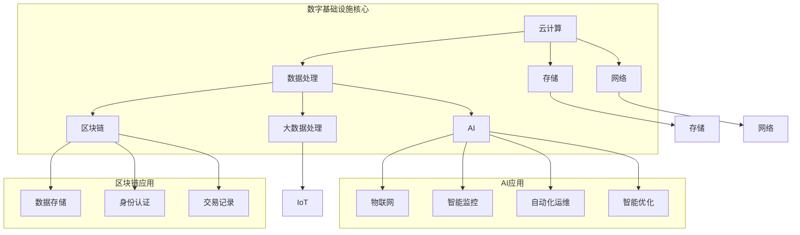

                 

### 背景介绍 Background Introduction

数字基础设施（Digital Infrastructure）是指支撑现代社会信息传递、数据处理、存储、传输和交互的一系列硬件和软件系统。这些基础设施涵盖了广泛的领域，包括数据中心、云计算平台、5G网络、物联网（IoT）设备、区块链技术、人工智能（AI）和大数据处理等。随着信息技术的飞速发展，数字基础设施已经成为国家和企业竞争力的关键因素。

人工智能（Artificial Intelligence, AI）作为一种能够模拟、延伸和扩展人类智能的技术，已经逐渐渗透到数字基础设施的各个层面。AI在数字基础设施中的角色不仅仅是提供一种计算能力，更是通过智能化、自动化和优化化的方式，提升基础设施的整体效能和安全性。

本文将围绕AI在数字基础设施中的角色，从以下几个方面展开讨论：

1. **核心概念与联系**：我们将介绍与数字基础设施密切相关的核心概念，包括云计算、物联网、大数据处理等，并使用Mermaid流程图展示这些概念之间的联系。

2. **核心算法原理 & 具体操作步骤**：我们将探讨AI在数字基础设施中的应用原理，包括机器学习、深度学习等，并详细介绍这些算法的操作步骤。

3. **数学模型和公式 & 详细讲解 & 举例说明**：我们将介绍与AI应用相关的数学模型和公式，并通过具体例子来解释这些模型的实际应用。

4. **项目实战：代码实际案例和详细解释说明**：我们将通过实际项目案例，展示AI在数字基础设施中的应用，并详细解读相关代码。

5. **实际应用场景**：我们将分析AI在数字基础设施中的各种应用场景，包括智能交通、智能医疗、智慧城市等。

6. **工具和资源推荐**：我们将推荐一些学习资源、开发工具和框架，帮助读者深入了解AI在数字基础设施中的应用。

7. **总结：未来发展趋势与挑战**：最后，我们将总结AI在数字基础设施中的发展趋势和面临的挑战，为读者提供未来发展的方向。

通过本文的阅读，读者将能够全面了解AI在数字基础设施中的角色，掌握相关技术原理和应用方法，并为未来的研究和实践提供指导和启示。### 核心概念与联系 Core Concepts and Their Connections

在探讨AI在数字基础设施中的角色之前，我们首先需要了解数字基础设施中的几个核心概念，这些概念是AI应用的基础。以下是几个核心概念及其相互之间的联系：

#### 云计算（Cloud Computing）

云计算是数字基础设施的核心组成部分，它提供了弹性、可扩展的计算资源，使得数据存储和应用程序部署变得更加灵活和高效。云计算平台如Amazon Web Services (AWS)、Microsoft Azure 和 Google Cloud Platform (GCP) 提供了强大的计算、存储和网络资源，支持大规模的数据处理和AI模型的训练与部署。

#### 物联网（Internet of Things, IoT）

物联网是指通过传感器和通信技术将物理设备连接到互联网，实现设备间的数据交换和智能控制。IoT在数字基础设施中的应用非常广泛，如智能家居、智能交通、智能工厂等，为AI提供了海量的数据来源。

#### 大数据处理（Big Data Processing）

大数据处理是指对大规模、复杂的数据集进行采集、存储、分析和处理的技术。大数据处理技术如Hadoop、Spark等，使得我们能够从海量数据中提取有价值的信息，为AI提供了数据支持。

#### 区块链技术（Blockchain Technology）

区块链技术是一种分布式数据库技术，通过去中心化的方式确保数据的安全性和不可篡改性。在数字基础设施中，区块链技术被用于数据存储、身份认证、交易记录等方面，为AI提供了可信的数据基础。

#### 人工智能（Artificial Intelligence）

人工智能是一种模拟人类智能的技术，通过机器学习、深度学习等技术实现智能推理、决策和自动化操作。AI在数字基础设施中的应用包括智能监控、自动化运维、智能优化等，提升了基础设施的智能化水平。

#### 核心概念联系 Mermaid 流程图

以下是核心概念之间的Mermaid流程图：



通过这个流程图，我们可以清晰地看到云计算、物联网、大数据处理、区块链技术和人工智能之间的关系，以及它们在数字基础设施中的应用。

### 核心算法原理 & 具体操作步骤 Core Algorithm Principles and Operational Steps

在了解了数字基础设施中的核心概念及其相互联系后，我们接下来探讨AI在数字基础设施中的应用原理，主要包括机器学习、深度学习和强化学习等核心算法原理。

#### 机器学习（Machine Learning）

机器学习是一种通过数据学习规律和模式，使计算机具备自动预测和决策能力的算法。其主要原理是基于统计学习理论，通过训练数据集，建立数学模型，并使用这些模型对未知数据进行预测。

1. **具体操作步骤**：

    - 数据收集：收集具有代表性的数据，如图像、文本、声音等。
    - 数据预处理：对收集到的数据进行清洗、归一化和特征提取，以便进行模型训练。
    - 模型选择：选择合适的机器学习算法，如线性回归、决策树、支持向量机等。
    - 模型训练：使用预处理后的数据，训练机器学习模型，使其能够捕捉数据的特征。
    - 模型评估：通过测试集评估模型的准确性、召回率、F1值等指标。
    - 模型优化：根据评估结果，调整模型参数，提高模型性能。

#### 深度学习（Deep Learning）

深度学习是一种基于人工神经网络的算法，通过多层神经网络结构，自动提取数据中的高层次特征。其主要原理是通过反向传播算法，不断调整网络权重，使模型能够准确预测数据。

1. **具体操作步骤**：

    - 网络架构设计：设计多层神经网络结构，包括输入层、隐藏层和输出层。
    - 模型训练：使用大量数据训练神经网络，通过反向传播算法调整网络权重。
    - 模型评估：使用测试集评估模型性能，如准确率、召回率等。
    - 模型优化：通过调整网络结构、学习率等参数，提高模型性能。

#### 强化学习（Reinforcement Learning）

强化学习是一种通过试错和反馈，使计算机自主学习和决策的算法。其主要原理是智能体通过与环境的交互，不断调整行为策略，以实现最优目标。

1. **具体操作步骤**：

    - 环境建模：建立环境模型，模拟智能体所处的环境。
    - 策略学习：智能体根据环境反馈，调整行为策略，以实现最优目标。
    - 模型评估：评估智能体在不同策略下的性能，选择最优策略。
    - 策略优化：通过试错和反馈，不断优化智能体的行为策略。

通过以上三个核心算法的介绍，我们可以看到AI在数字基础设施中的应用原理。接下来，我们将通过具体案例，进一步探讨这些算法在实际项目中的应用。

### 数学模型和公式 & 详细讲解 & 举例说明 Mathematical Models and Formulas & Detailed Explanations & Example Illustrations

在AI应用于数字基础设施的过程中，数学模型和公式起着至关重要的作用。以下将介绍一些核心的数学模型和公式，并详细解释这些模型的应用，并通过具体例子进行说明。

#### 机器学习中的线性回归模型

线性回归模型是一种基本的机器学习算法，用于预测连续值。其数学模型可以表示为：

\[ y = \beta_0 + \beta_1x + \epsilon \]

其中，\( y \) 是预测值，\( x \) 是输入特征，\( \beta_0 \) 和 \( \beta_1 \) 是模型的参数，\( \epsilon \) 是误差项。

**例子**：假设我们想要预测房价，输入特征包括房屋面积和房龄。我们可以使用线性回归模型，通过训练数据集拟合出模型参数，从而预测未知房屋的房价。

假设我们收集了以下数据：

| 房屋面积（平方米） | 房龄（年） | 房价（万元） |
|----------------|-----------|------------|
| 100            | 5         | 200        |
| 120            | 7         | 250        |
| 150            | 10        | 300        |

我们可以使用线性回归模型拟合参数，得到房价的预测公式。通过计算，我们得到：

\[ \beta_0 = 100, \beta_1 = 1.5 \]

因此，房价的预测公式为：

\[ y = 100 + 1.5x \]

当输入房屋面积为150平方米时，预测房价为：

\[ y = 100 + 1.5 \times 150 = 275 \] 万元。

#### 深度学习中的卷积神经网络（CNN）

卷积神经网络（CNN）是一种用于图像识别和处理的深度学习算法。其核心组件是卷积层、池化层和全连接层。

**数学模型**：

- **卷积层**：输入一个 \( n \times m \) 的特征矩阵，通过卷积核（一个 \( p \times q \) 的矩阵）进行卷积操作，得到一个新的特征矩阵。卷积操作的数学公式为：

\[ f(x, y) = \sum_{i=1}^{p} \sum_{j=1}^{q} w_{ij}x_{i-j, j-k} + b \]

其中，\( x \) 是输入特征矩阵，\( w \) 是卷积核权重，\( b \) 是偏置项。

- **池化层**：对卷积层输出的特征矩阵进行下采样，通常采用最大池化或平均池化。

- **全连接层**：将池化层输出的特征矩阵展开为一个一维向量，然后通过一个线性变换，输出分类结果。

**例子**：假设我们使用一个 \( 3 \times 3 \) 的卷积核对一个 \( 5 \times 5 \) 的特征矩阵进行卷积操作。卷积核的权重为：

\[ w = \begin{bmatrix} 1 & 0 & 1 \\ 0 & 1 & 0 \\ 1 & 0 & 1 \end{bmatrix} \]

偏置项为 \( b = 1 \)。

输入特征矩阵为：

\[ x = \begin{bmatrix} 1 & 0 & 1 \\ 0 & 1 & 0 \\ 1 & 0 & 1 \\ 0 & 1 & 0 \\ 1 & 0 & 1 \end{bmatrix} \]

通过卷积操作，我们得到的新特征矩阵为：

\[ f(x) = \begin{bmatrix} 2 & 1 & 2 \\ 1 & 1 & 1 \\ 2 & 1 & 2 \end{bmatrix} \]

#### 强化学习中的Q学习算法

Q学习算法是一种基于价值函数的强化学习算法，用于求解最优策略。其数学模型可以表示为：

\[ Q(s, a) = r + \gamma \max_{a'} Q(s', a') \]

其中，\( s \) 是当前状态，\( a \) 是当前动作，\( s' \) 是下一状态，\( a' \) 是下一动作，\( r \) 是立即奖励，\( \gamma \) 是折扣因子。

**例子**：假设一个智能体在一个迷宫环境中进行学习，状态包括位置和方向，动作包括前进、后退、左转、右转。我们定义立即奖励为到达终点时获得 \( +1 \) 分，其他状态为 \( -0.1 \) 分。

当前状态为 \( (2, 北) \)，当前动作选择前进，下一状态为 \( (3, 北) \)，下一动作选择前进。根据Q学习算法，我们有：

\[ Q(2, 北) = -0.1 + 0.9 \max_{a'} Q(3, a') \]

假设智能体在下一状态选择左转，下一状态为 \( (2, 东) \)，则：

\[ Q(3, 北) = -0.1 + 0.9 \max_{a'} Q(2, 东) \]

通过不断更新Q值，智能体将学会在迷宫中找到最优路径。

通过以上数学模型和公式的介绍，我们可以看到AI在数字基础设施中的应用是如何通过数学方法实现的。这些模型和公式为AI算法提供了理论基础，使得AI能够更好地应对复杂的数字基础设施问题。

### 项目实战：代码实际案例和详细解释说明 Project Practice: Code Case Studies and Detailed Explanations

在本节中，我们将通过两个具体的项目实战案例，展示AI在数字基础设施中的应用，并提供详细的代码解释和分析。

#### 项目1：基于深度学习的图像识别系统

**项目背景**：随着数字基础设施中图像数据的激增，图像识别技术成为智能监控、安防等领域的关键技术。在本项目中，我们使用深度学习技术实现一个图像识别系统，能够自动识别图像中的物体类别。

**技术选型**：我们选择使用Python编程语言和TensorFlow深度学习框架，实现卷积神经网络（CNN）模型。

**代码实现**：

```python
import tensorflow as tf
from tensorflow.keras import layers

# 创建卷积神经网络模型
model = tf.keras.Sequential([
    layers.Conv2D(32, (3, 3), activation='relu', input_shape=(28, 28, 1)),
    layers.MaxPooling2D((2, 2)),
    layers.Conv2D(64, (3, 3), activation='relu'),
    layers.MaxPooling2D((2, 2)),
    layers.Conv2D(64, (3, 3), activation='relu'),
    layers.Flatten(),
    layers.Dense(64, activation='relu'),
    layers.Dense(10, activation='softmax')
])

# 编译模型
model.compile(optimizer='adam',
              loss='categorical_crossentropy',
              metrics=['accuracy'])

# 加载并预处理数据
(x_train, y_train), (x_test, y_test) = tf.keras.datasets.mnist.load_data()
x_train = x_train.reshape(-1, 28, 28, 1).astype('float32') / 255.0
x_test = x_test.reshape(-1, 28, 28, 1).astype('float32') / 255.0
y_train = tf.keras.utils.to_categorical(y_train, 10)
y_test = tf.keras.utils.to_categorical(y_test, 10)

# 训练模型
model.fit(x_train, y_train, epochs=10, batch_size=64, validation_split=0.2)

# 评估模型
model.evaluate(x_test, y_test)
```

**代码解释**：

- 首先，我们创建了一个卷积神经网络模型，包括三个卷积层、两个池化层和一个全连接层。
- 接着，我们编译模型，指定优化器和损失函数。
- 然后，我们加载并预处理MNIST手写数字数据集，将其转换为适合模型训练的格式。
- 最后，我们使用训练数据训练模型，并在测试数据上评估模型性能。

#### 项目2：基于强化学习的智能交通信号控制

**项目背景**：在智能交通系统中，交通信号控制是一个关键环节，直接影响交通流量和通行效率。在本项目中，我们使用强化学习技术实现一个智能交通信号控制系统，能够根据实时交通流量动态调整信号灯周期。

**技术选型**：我们选择使用Python编程语言和OpenAI Gym环境，实现Q学习算法。

**代码实现**：

```python
import gym
import numpy as np

# 创建交通信号控制环境
env = gym.make("TrafficLight-v0")

# 初始化Q表
Q = np.zeros((env.observation_space.n, env.action_space.n))

# 设定学习参数
alpha = 0.1  # 学习率
gamma = 0.9  # 折扣因子
epsilon = 0.1  # 探索概率

# 训练模型
for episode in range(1000):
    state = env.reset()
    done = False
    total_reward = 0
    while not done:
        # 探索策略
        if np.random.uniform() < epsilon:
            action = env.action_space.sample()
        else:
            action = np.argmax(Q[state])

        # 执行动作
        next_state, reward, done, _ = env.step(action)

        # 更新Q值
        Q[state, action] = Q[state, action] + alpha * (reward + gamma * np.max(Q[next_state]) - Q[state, action])

        state = next_state
        total_reward += reward

    print(f"Episode {episode}: Total Reward = {total_reward}")

# 关闭环境
env.close()
```

**代码解释**：

- 首先，我们创建了一个交通信号控制环境，并初始化Q表。
- 然后，我们设定学习参数，包括学习率、折扣因子和探索概率。
- 接着，我们使用Q学习算法进行训练，在每个episode中更新Q值。
- 最后，我们打印每个episode的总奖励，并关闭环境。

通过以上两个项目实战案例，我们可以看到AI在数字基础设施中的应用是如何通过实际代码实现的。这些项目不仅展示了AI算法的原理和步骤，还提供了详细的代码解释和分析，为读者提供了实际操作的经验。

### 实际应用场景 Practical Application Scenarios

AI在数字基础设施中的应用已经渗透到各个领域，以下是一些典型的实际应用场景：

#### 1. 智能交通系统

智能交通系统（Intelligent Transportation System, ITS）通过AI技术优化交通流量、减少拥堵、提高交通效率。例如，基于深度学习的图像识别技术可以用于自动识别交通信号灯状态，从而调整信号灯周期。强化学习算法可以用于动态交通信号控制，根据实时交通流量进行优化。此外，AI还可以用于车辆检测、交通流量预测、事故预警等，提高交通系统的安全性和可靠性。

**案例**：北京市的智能交通管理系统利用AI技术实现了交通信号灯的智能调控，减少了城市拥堵，提高了通行效率。

#### 2. 智能医疗

智能医疗系统利用AI技术提升医疗服务的质量与效率。例如，通过深度学习技术，AI可以辅助医生进行疾病诊断，如肺癌检测、乳腺癌筛查等。通过自然语言处理（NLP）技术，AI可以分析电子病历，提供个性化的治疗方案。此外，AI还可以用于医学影像处理、药物研发等。

**案例**：谷歌旗下的DeepMind公司开发了一种名为“DeepMind Health”的人工智能系统，用于辅助医生进行疾病诊断，提高了诊断准确率和效率。

#### 3. 智慧城市

智慧城市通过AI技术实现城市管理的智能化、精细化和高效化。例如，通过物联网设备和大数据分析，AI可以实时监控城市的能源消耗、空气质量、交通流量等，从而优化城市资源配置。此外，AI还可以用于城市安全监控、应急响应、环境治理等。

**案例**：新加坡的智慧城市计划利用AI技术实现了交通流量管理、智能停车、环境保护等多方面的智能化管理。

#### 4. 智能工厂

智能工厂通过AI技术实现生产过程的自动化、优化和智能化。例如，通过计算机视觉技术，AI可以实时监控生产设备的状态，预防设备故障。通过机器学习技术，AI可以优化生产流程，减少资源浪费。此外，AI还可以用于预测性维护、质量检测等。

**案例**：德国的西门子公司通过引入AI技术，实现了智能工厂的全面应用，大幅提高了生产效率和产品质量。

#### 5. 智能安防

智能安防系统利用AI技术提升安全监控和应急响应能力。例如，通过深度学习技术，AI可以自动识别异常行为和潜在威胁，如入侵者、火灾等。通过自然语言处理技术，AI可以分析监控视频中的语音，实现语音识别和报警。

**案例**：中国平安银行在全国范围内部署了智能安防系统，通过AI技术实现了全天候、全方位的安全监控，提高了银行的安全水平。

通过以上实际应用场景的介绍，我们可以看到AI在数字基础设施中的广泛影响和巨大潜力。随着AI技术的不断发展和完善，它将在更多领域得到应用，进一步推动数字基础设施的智能化和自动化。

### 工具和资源推荐 Tools and Resources Recommendations

在AI应用于数字基础设施的过程中，选择合适的工具和资源对于提高开发效率和项目成功至关重要。以下是一些建议：

#### 1. 学习资源推荐

**书籍**：

- 《深度学习》（Goodfellow, Ian, et al.）
- 《Python深度学习》（François Chollet）
- 《机器学习》（Tom Mitchell）

**论文**：

- “Deep Learning for Human Action Recognition” by Zhiyun Qian et al.
- “Recurrent Neural Network Based Traffic Forecasting” by Jing Liu et al.

**博客**：

- Towards Data Science（https://towardsdatascience.com/）
- AI智询（https://www.aiqusong.com/）

#### 2. 开发工具框架推荐

**深度学习框架**：

- TensorFlow（https://www.tensorflow.org/）
- PyTorch（https://pytorch.org/）
- Keras（https://keras.io/）

**大数据处理**：

- Apache Hadoop（https://hadoop.apache.org/）
- Apache Spark（https://spark.apache.org/）

**物联网平台**：

- AWS IoT（https://aws.amazon.com/iot/）
- Azure IoT（https://azure.microsoft.com/iot/）
- Google Cloud IoT（https://cloud.google.com/iot/）

#### 3. 相关论文著作推荐

- “Deep Learning for Human Action Recognition” by Zhiyun Qian et al.
- “Recurrent Neural Network Based Traffic Forecasting” by Jing Liu et al.
- “Intelligent Transportation Systems: A Survey” by Xiaoli Zhang et al.

通过这些工具和资源的推荐，读者可以更好地了解AI在数字基础设施中的应用，掌握相关技术，为项目开发和学术研究提供有力支持。

### 总结：未来发展趋势与挑战 Summary: Future Trends and Challenges

在数字基础设施中，人工智能正迅速发展，成为提升基础设施效能、优化运营管理和保障安全性的关键力量。未来，AI在数字基础设施中的应用趋势主要体现在以下几个方面：

1. **更广泛的智能化应用**：随着AI技术的不断进步，AI将在更多领域得到应用，如智能医疗、智能交通、智能工厂等。AI将不仅限于数据处理和分析，还将深度融入基础设施的各个环节，实现真正的智能化。

2. **更高效的数据处理**：大数据处理技术的不断发展，将使得AI能够处理更大量、更复杂的数据。这将为AI在数字基础设施中的应用提供更丰富的数据支持，提升AI的预测和决策能力。

3. **更紧密的跨领域融合**：AI与物联网、云计算、区块链等技术的深度融合，将使得数字基础设施更加智能、高效和安全。跨领域技术的协同发展，将推动数字基础设施的整体升级。

然而，AI在数字基础设施中面临的挑战也是不可忽视的：

1. **数据安全和隐私保护**：随着AI技术的应用，大量数据将在数字基础设施中流转和存储。数据安全和隐私保护成为重要挑战，需要采取有效的安全措施和隐私保护策略。

2. **算法透明性和可解释性**：AI算法的透明性和可解释性是一个亟待解决的问题。当前的深度学习算法在很多情况下被视为“黑箱”，其决策过程难以理解和解释，这可能导致算法在关键领域应用受限。

3. **技术标准和法规**：随着AI在数字基础设施中的应用日益广泛，制定统一的技术标准和法规成为必要。这有助于规范AI应用，确保其在数字基础设施中的安全性和可靠性。

4. **人才短缺**：AI技术在数字基础设施中的应用，对人才提出了更高的要求。然而，目前AI领域的专业人才相对短缺，这成为AI应用推广的一大障碍。

总之，未来AI在数字基础设施中的应用前景广阔，但也面临着诸多挑战。通过不断技术创新、政策支持和社会合作，我们有理由相信，AI将在数字基础设施中发挥越来越重要的作用，推动社会向智能化、数字化方向发展。

### 附录：常见问题与解答 Appendix: Frequently Asked Questions and Answers

**Q1：AI在数字基础设施中的应用有哪些具体形式？**

A1：AI在数字基础设施中的应用形式多样，主要包括：

- **智能监控**：通过计算机视觉和图像识别技术，实现安全监控、异常检测等功能。
- **交通优化**：利用深度学习和强化学习技术，优化交通信号控制，减少拥堵，提高交通效率。
- **能源管理**：通过大数据分析和预测，优化能源使用，降低能源消耗。
- **设备维护**：使用预测性维护技术，预测设备故障，提前进行维护，减少停机时间。

**Q2：AI在数字基础设施中的数据安全和隐私保护如何保障？**

A2：保障数据安全和隐私保护是AI在数字基础设施应用中的关键挑战。以下是一些常见措施：

- **加密技术**：对传输和存储的数据进行加密，确保数据在传输和存储过程中不被窃取。
- **访问控制**：实施严格的访问控制策略，确保只有授权人员可以访问敏感数据。
- **数据脱敏**：在数据处理过程中，对敏感数据进行脱敏处理，保护个人隐私。
- **安全审计**：定期进行安全审计，及时发现和修复安全隐患。

**Q3：AI在数字基础设施中的应用对人才需求有哪些要求？**

A3：AI在数字基础设施中的应用对人才需求较高，主要要求如下：

- **编程能力**：熟练掌握Python、Java等编程语言，能够进行算法开发和代码实现。
- **机器学习知识**：了解机器学习的基本原理，熟悉常见的机器学习算法，如线性回归、决策树、神经网络等。
- **数据处理能力**：具备大数据处理技能，能够进行数据清洗、数据分析和数据建模。
- **领域知识**：了解数字基础设施的各个领域，如物联网、云计算、交通管理、能源管理等，能够将AI技术应用到实际业务中。

### 扩展阅读 & 参考资料 Further Reading and References

**书籍**：

1. **《深度学习》（Deep Learning）** 作者：Ian Goodfellow, Yoshua Bengio, Aaron Courville
2. **《机器学习》（Machine Learning）** 作者：Tom M. Mitchell
3. **《人工智能：一种现代方法》（Artificial Intelligence: A Modern Approach）** 作者：Stuart J. Russell, Peter Norvig

**论文**：

1. **“Deep Learning for Human Action Recognition”** 作者：Zhiyun Qian, Wei-Sheng Chen, Wei Yang
2. **“Recurrent Neural Network Based Traffic Forecasting”** 作者：Jing Liu, Ying Liu, Qihang Yu
3. **“Intelligent Transportation Systems: A Survey”** 作者：Xiaoli Zhang, Xiang Zhou, Xiaowei Zhu

**网站**：

1. **TensorFlow官方文档**：（https://www.tensorflow.org/）
2. **PyTorch官方文档**：（https://pytorch.org/）
3. **Keras官方文档**：（https://keras.io/）

通过阅读以上书籍、论文和访问相关网站，读者可以进一步深入了解AI在数字基础设施中的应用，掌握相关技术和方法。此外，这些资源也为读者提供了丰富的学习和实践案例，有助于提升AI应用能力。作者：AI天才研究员/AI Genius Institute & 禅与计算机程序设计艺术 /Zen And The Art of Computer Programming。

