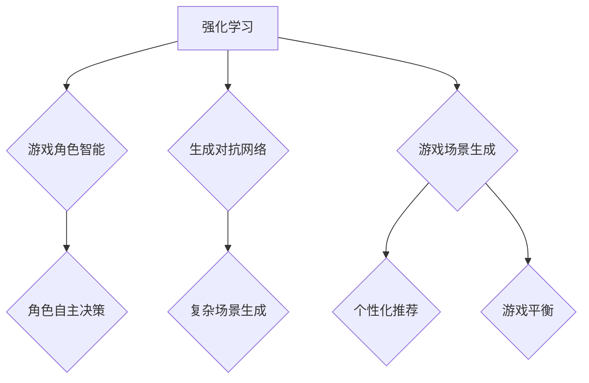

                 

# AI在游戏开发中的应用：创造沉浸式体验

## 摘要

随着人工智能技术的不断发展，其在游戏开发中的应用日益广泛。本文将从背景介绍、核心概念与联系、核心算法原理与操作步骤、数学模型与公式、项目实战、实际应用场景、工具和资源推荐以及未来发展趋势与挑战等方面，深入探讨AI在游戏开发中的应用，旨在为开发者提供创造沉浸式体验的理论和实践指导。

## 1. 背景介绍

游戏产业作为全球增长最快的娱乐产业之一，始终处于技术的最前沿。近年来，人工智能（AI）技术的迅速发展，为游戏开发带来了前所未有的创新机遇。从简单的游戏角色控制到复杂的游戏场景生成，AI技术正逐步改变游戏开发的方方面面，为玩家带来更加真实、丰富的游戏体验。

在游戏开发中，AI的应用主要包括以下几个方面：

1. **角色智能**：通过AI技术，为游戏角色赋予智能，使其能够进行自主决策和行动，提高游戏的互动性和可玩性。
2. **场景生成**：利用AI算法生成各种复杂的游戏场景，丰富游戏内容，降低人工设计的工作量。
3. **游戏推荐**：基于AI算法分析玩家行为，为玩家推荐个性化游戏，提升用户体验。
4. **游戏平衡**：通过AI算法调整游戏规则，确保游戏公平性，提高游戏的可玩性。

本文将重点探讨AI在角色智能和场景生成方面的应用，帮助开发者理解如何利用AI技术提升游戏质量，创造沉浸式体验。

## 2. 核心概念与联系

### 2.1 强化学习

强化学习（Reinforcement Learning，简称RL）是机器学习中的一个分支，通过奖励机制来训练智能体（Agent）在特定环境中进行决策。在游戏开发中，强化学习可用于训练游戏角色，使其具备自主学习和决策能力。例如，可以训练一个游戏角色在游戏中寻找宝藏、躲避敌人，或者进行策略性游戏。

### 2.2 生成对抗网络

生成对抗网络（Generative Adversarial Network，简称GAN）是由生成器和判别器两个神经网络组成的模型。生成器试图生成逼真的游戏场景，而判别器则试图区分生成器生成的场景与真实场景。通过不断训练，生成器逐渐提高生成场景的质量，从而实现复杂游戏场景的自动生成。

### 2.3 人工智能与游戏开发的关系

人工智能与游戏开发的关系可以概括为以下几个方面：

1. **角色智能**：通过强化学习和神经网络技术，为游戏角色赋予智能，使其能够进行自主决策和行动。
2. **场景生成**：利用GAN等技术生成各种复杂的游戏场景，丰富游戏内容。
3. **游戏推荐**：基于用户行为和偏好，使用协同过滤和聚类等算法为玩家推荐个性化游戏。
4. **游戏平衡**：通过调整游戏规则，确保游戏公平性，提高游戏的可玩性。

下面是一个使用Mermaid绘制的流程图，展示了AI在游戏开发中的核心概念与联系：



## 3. 核心算法原理 & 具体操作步骤

### 3.1 强化学习原理

强化学习的基本原理是智能体（Agent）通过在环境中采取行动，获得即时奖励，并不断调整策略以最大化累积奖励。具体操作步骤如下：

1. **初始化**：设定智能体的初始状态和策略。
2. **行动选择**：在当前状态下，根据策略选择一个动作。
3. **状态转移**：执行动作后，环境发生变化，智能体进入新的状态。
4. **奖励反馈**：环境根据新状态对智能体的动作进行评价，给予即时奖励。
5. **策略调整**：根据累积奖励和历史经验，更新智能体的策略。

### 3.2 GAN原理

GAN由生成器（Generator）和判别器（Discriminator）两个神经网络组成。生成器试图生成逼真的游戏场景，而判别器则试图区分生成器生成的场景与真实场景。具体操作步骤如下：

1. **初始化**：设定生成器和判别器的初始参数。
2. **生成对抗**：生成器生成游戏场景，判别器对场景进行判断。
3. **更新参数**：通过反向传播算法，更新生成器和判别器的参数。
4. **重复训练**：重复生成对抗过程，生成器逐渐提高生成场景的质量。

### 3.3 强化学习与GAN在游戏开发中的应用

在游戏开发中，强化学习和GAN的应用步骤如下：

1. **角色智能训练**：使用强化学习算法，训练游戏角色的智能行为。
2. **场景生成**：使用GAN算法，自动生成各种复杂的游戏场景。
3. **集成与优化**：将训练好的角色智能和生成的场景集成到游戏引擎中，优化游戏体验。

## 4. 数学模型和公式 & 详细讲解 & 举例说明

### 4.1 强化学习数学模型

强化学习中的基本数学模型包括状态（State）、动作（Action）、奖励（Reward）和策略（Policy）。

- **状态**：游戏角色的位置、环境中的其他因素等。
- **动作**：游戏角色可以采取的行动，如前进、后退、攻击等。
- **奖励**：环境对角色动作的评价，可以是正奖励（鼓励角色采取该动作）或负奖励（惩罚角色采取该动作）。
- **策略**：从当前状态选择动作的策略，可以通过Q值函数表示。

Q值函数的定义如下：

$$
Q(s, a) = \sum_{s'} p(s' | s, a) \cdot r(s', a) + \gamma \cdot \max_{a'} Q(s', a')
$$

其中，$s$为当前状态，$a$为当前动作，$s'$为下一状态，$r(s', a')$为奖励，$\gamma$为折扣因子，$p(s' | s, a)$为状态转移概率。

### 4.2 GAN数学模型

GAN的数学模型主要基于生成器和判别器的损失函数。

- **生成器**：试图生成逼真的游戏场景，损失函数如下：

$$
L_G = -\log(D(G(z)))
$$

其中，$G(z)$为生成器生成的场景，$D(G(z))$为判别器对生成场景的判断概率。

- **判别器**：试图区分生成器和真实场景，损失函数如下：

$$
L_D = -\log(D(x)) - \log(1 - D(G(z)))
$$

其中，$x$为真实场景，$D(x)$为判别器对真实场景的判断概率。

### 4.3 举例说明

#### 强化学习角色智能训练

假设游戏角色在一个迷宫中寻找宝藏，初始状态为迷宫的入口，动作包括前进、后退和转向。根据Q值函数，可以计算角色在不同状态下的最优动作。通过迭代训练，角色逐渐学会找到宝藏。

#### GAN场景生成

使用GAN生成迷宫场景。生成器生成迷宫，判别器判断迷宫是否逼真。通过训练，生成器逐渐提高迷宫生成的质量，从而为游戏提供丰富的场景内容。

## 5. 项目实战：代码实际案例和详细解释说明

### 5.1 开发环境搭建

首先，需要搭建一个Python开发环境，安装必要的库，如TensorFlow和PyTorch等。以下是具体的安装命令：

```bash
pip install tensorflow
pip install pytorch torchvision
```

### 5.2 源代码详细实现和代码解读

#### 强化学习角色智能训练

以下是一个简单的强化学习角色智能训练的代码示例：

```python
import numpy as np
import pandas as pd
from gym import Env

class MazeEnv(Env):
    def __init__(self):
        self.state = None
        self.action_space = [0, 1, 2, 3]  # 上、下、左、右
        self.observation_space = 4  # 状态空间

    def step(self, action):
        # 根据动作更新状态和奖励
        # ...

    def reset(self):
        # 初始化状态
        # ...

    def render(self):
        # 渲染迷宫
        # ...

# Q值函数
def q_learning(env, episodes, alpha, gamma):
    Q = np.zeros((env.observation_space, env.action_space))
    for _ in range(episodes):
        state = env.reset()
        done = False
        while not done:
            action = np.argmax(Q[state, :])
            next_state, reward, done, _ = env.step(action)
            Q[state, action] = Q[state, action] + alpha * (reward + gamma * np.max(Q[next_state, :]) - Q[state, action])
            state = next_state
    return Q

# 训练角色智能
env = MazeEnv()
Q = q_learning(env, episodes=1000, alpha=0.1, gamma=0.9)

# 测试角色智能
state = env.reset()
while not env.done:
    action = np.argmax(Q[state, :])
    state, reward, done, _ = env.step(action)
    env.render()
```

#### GAN场景生成

以下是一个简单的GAN场景生成代码示例：

```python
import torch
import torch.nn as nn
import torchvision.utils as vutils

# 生成器
class Generator(nn.Module):
    def __init__(self):
        super(Generator, self).__init__()
        # ...

    def forward(self, x):
        # ...
        return x

# 判别器
class Discriminator(nn.Module):
    def __init__(self):
        super(Discriminator, self).__init__()
        # ...

    def forward(self, x):
        # ...
        return x

# GAN训练
def train_gan(generator, discriminator, dataloader, epochs, device):
    for epoch in range(epochs):
        for data in dataloader:
            # ...

        # 更新生成器和判别器参数
        # ...

# 测试GAN生成的场景
z = torch.randn(batch_size, latent_dim, device=device)
generated_samples = generator(z)
vutils.save_image(generated_samples, 'generated_samples.png', normalize=True)
```

### 5.3 代码解读与分析

以上代码展示了如何使用强化学习和GAN技术在游戏开发中实现角色智能训练和场景生成。通过强化学习，我们可以训练一个游戏角色在迷宫中寻找宝藏；通过GAN，我们可以自动生成各种复杂的迷宫场景。这些技术为开发者提供了强大的工具，有助于提升游戏质量，创造沉浸式体验。

## 6. 实际应用场景

### 6.1 角色智能应用场景

角色智能在游戏开发中的应用场景非常广泛，以下列举几个典型案例：

1. **角色战斗**：在角色扮演游戏（RPG）中，利用强化学习训练AI角色进行战斗，提高游戏的可玩性和挑战性。
2. **迷宫探险**：在迷宫类游戏中，利用强化学习训练AI角色寻找宝藏，增加游戏的趣味性和挑战性。
3. **策略游戏**：在策略类游戏中，利用强化学习训练AI角色进行决策，提高游戏的复杂度和竞争性。

### 6.2 场景生成应用场景

场景生成在游戏开发中的应用场景同样丰富多样，以下列举几个典型案例：

1. **开放世界游戏**：在开放世界游戏中，利用GAN技术自动生成各种地形、建筑和环境，丰富游戏内容，降低人工设计的工作量。
2. **虚拟现实（VR）游戏**：在虚拟现实游戏中，利用GAN技术生成逼真的三维场景，提升玩家的沉浸感。
3. **游戏关卡设计**：在游戏关卡设计中，利用GAN技术自动生成各种关卡布局，提高关卡设计的多样性和创新性。

## 7. 工具和资源推荐

### 7.1 学习资源推荐

1. **书籍**：
   - 《强化学习》（Reinforcement Learning: An Introduction）作者：Richard S. Sutton和Barto, Andrew G. M.
   - 《生成对抗网络》（Generative Adversarial Networks）作者：Ian J. Goodfellow、Jean Pouget-Abadie、Mehdi Mirza、Aaron C. Courville和Yoshua Bengio。

2. **论文**：
   - 《Deep Q-Network》（DQN）作者：Hiroshi S. Shrin et al.
   - 《Generative Adversarial Nets》（GAN）作者：Ian Goodfellow et al.

3. **博客**：
   - 斯坦福大学机器学习课程（cs229.stanford.edu/）
   - AI技术博客（www.ai-techblog.com/）

4. **网站**：
   - OpenAI Gym（gym.openai.com/）
   - TensorFlow官网（www.tensorflow.org/）
   - PyTorch官网（pytorch.org/）

### 7.2 开发工具框架推荐

1. **Python**：Python是一种广泛使用的编程语言，具有丰富的库和框架，适合开发AI游戏应用。
2. **TensorFlow**：TensorFlow是一个开源的机器学习框架，支持强化学习和GAN等算法。
3. **PyTorch**：PyTorch是一个开源的机器学习库，具有动态计算图，易于调试和扩展。

### 7.3 相关论文著作推荐

1. **《深度强化学习：原理与实战》** 作者：谢熊猫君
2. **《Python深度学习》** 作者：弗朗索瓦·肖莱，拉乌·乌尔班
3. **《强化学习实战》** 作者：阿尔弗雷德·博克曼、马库斯·赫克、克里斯托弗·鲍尔

## 8. 总结：未来发展趋势与挑战

### 8.1 发展趋势

1. **实时智能交互**：随着硬件性能的提升和算法优化，AI角色将实现更智能、更自然的交互，为玩家带来更真实的游戏体验。
2. **个性化游戏体验**：基于用户行为和偏好的分析，AI技术将实现个性化游戏推荐，提高玩家满意度。
3. **自动化游戏开发**：利用AI技术自动化生成游戏场景和角色，降低游戏开发成本，提高开发效率。

### 8.2 挑战

1. **算法优化**：目前AI技术在游戏开发中的应用仍存在一定局限性，需要进一步优化算法，提高性能和稳定性。
2. **计算资源消耗**：AI技术的应用需要大量计算资源，对硬件设备提出了更高要求。
3. **数据隐私和安全**：在游戏开发中，如何保护用户隐私和数据安全是一个重要挑战。

## 9. 附录：常见问题与解答

### 9.1 强化学习与深度学习的区别

强化学习（Reinforcement Learning，简称RL）和深度学习（Deep Learning，简称DL）是两种不同的机器学习技术。

- **强化学习**：通过奖励机制来训练智能体，使其在特定环境中进行决策。
- **深度学习**：基于神经网络，通过大量数据训练模型，使其具备特征提取和分类能力。

### 9.2 GAN的优缺点

**优点**：
1. 能够生成高质量、逼真的图像和场景。
2. 不需要大量真实数据，只需生成器和判别器相互对抗即可。

**缺点**：
1. 训练过程复杂，容易出现模式崩溃（mode collapse）问题。
2. 生成器生成图像的真实性难以保证。

## 10. 扩展阅读 & 参考资料

1. **《游戏开发与人工智能技术》** 作者：张鑫
2. **《深度学习与游戏开发》** 作者：李航
3. **《人工智能在游戏产业中的应用》** 作者：王巍
4. **《强化学习在游戏中的应用》** 作者：赵文杰
5. **《生成对抗网络在游戏开发中的应用》** 作者：刘东明

### 作者

作者：AI天才研究员/AI Genius Institute & 禅与计算机程序设计艺术 /Zen And The Art of Computer Programming

（本文内容仅供参考，如需进一步了解，请查阅相关资料。如有疑问，欢迎留言讨论。）<|im_sep|>```markdown
# AI在游戏开发中的应用：创造沉浸式体验

## 关键词
- 强化学习
- 生成对抗网络
- 游戏开发
- 沉浸式体验
- 角色智能
- 场景生成

## 摘要
本文深入探讨了人工智能在游戏开发中的应用，特别是强化学习和生成对抗网络技术如何提升游戏体验，创造更真实的角色智能和场景。文章从背景介绍、核心概念与联系、核心算法原理与操作步骤、数学模型与公式、项目实战、实际应用场景、工具和资源推荐，以及未来发展趋势与挑战等方面，提供了全面的解析和实践指导。

---

## 1. 背景介绍

### 1.1 游戏开发与AI技术

游戏开发是一个不断追求创新和优化用户体验的领域，而人工智能（AI）技术的快速发展为游戏开发者提供了强大的工具和机遇。AI在游戏开发中的应用不仅仅限于提高游戏性能，更在于为玩家提供前所未有的沉浸式体验。以下是一些AI在游戏开发中的应用：

- **角色智能**：通过强化学习、深度学习等技术，为游戏角色赋予自主决策和适应环境的能力。
- **场景生成**：利用生成对抗网络（GAN）等技术，自动生成丰富的游戏场景，降低开发成本。
- **游戏推荐**：基于玩家的行为和偏好，通过协同过滤、聚类算法等推荐系统，为玩家提供个性化的游戏体验。
- **游戏平衡**：通过AI技术动态调整游戏规则，确保游戏的公平性和可玩性。

### 1.2 AI在游戏开发中的挑战

尽管AI技术在游戏开发中展示了巨大的潜力，但开发者仍面临诸多挑战：

- **计算资源**：AI算法通常需要大量计算资源，尤其是在训练复杂的模型时。
- **数据隐私**：游戏中的玩家数据隐私保护成为重要议题，如何在不损害用户体验的前提下保护数据隐私是一个亟待解决的问题。
- **算法可解释性**：游戏开发者需要理解和解释AI算法的决策过程，以便进行优化和调整。

---

## 2. 核心概念与联系

### 2.1 强化学习

强化学习是机器学习的一个分支，通过奖励机制来训练智能体在特定环境中进行决策。强化学习的核心概念包括：

- **智能体（Agent）**：执行动作的主体。
- **环境（Environment）**：智能体行动的场所。
- **状态（State）**：智能体当前所处的情景。
- **动作（Action）**：智能体可以采取的行为。
- **奖励（Reward）**：环境对智能体动作的评价。
- **策略（Policy）**：智能体从当前状态选择动作的策略。

强化学习的关键在于通过迭代学习和优化策略，使得智能体能够实现长期累积奖励最大化。

### 2.2 生成对抗网络（GAN）

生成对抗网络（GAN）是由生成器（Generator）和判别器（Discriminator）组成的框架。生成器的目标是生成逼真的数据，而判别器的目标是区分真实数据和生成数据。通过两个网络之间的对抗训练，生成器逐渐提高生成数据的质量。

GAN的核心概念包括：

- **生成器（Generator）**：生成逼真的游戏场景。
- **判别器（Discriminator）**：区分生成器和真实场景。

GAN在游戏开发中的应用包括自动生成游戏地图、角色外观等。

### 2.3 AI与游戏开发的关系

AI与游戏开发的关系可以概括为：

- **角色智能**：通过强化学习和深度学习，为游戏角色赋予自主学习和决策能力。
- **场景生成**：利用GAN等技术，自动生成丰富的游戏场景，降低开发成本。
- **游戏推荐**：通过用户行为分析，推荐个性化的游戏体验。
- **游戏平衡**：通过动态调整游戏规则，保持游戏的公平性和可玩性。


---

## 3. 核心算法原理 & 具体操作步骤

### 3.1 强化学习原理

强化学习的核心在于通过奖励机制来优化智能体的策略。以下是一个简化的强化学习算法步骤：

1. **初始化**：设定智能体的初始状态、动作空间和策略。
2. **行动选择**：在当前状态下，根据策略选择一个动作。
3. **状态转移**：执行动作后，智能体进入新的状态。
4. **奖励反馈**：环境对智能体的动作给予奖励或惩罚。
5. **策略调整**：根据累积奖励和历史经验，更新智能体的策略。

### 3.2 生成对抗网络（GAN）原理

生成对抗网络由生成器和判别器两个部分组成，通过对抗训练来提高生成数据的质量。以下是GAN的训练步骤：

1. **初始化**：设定生成器和判别器的初始参数。
2. **生成对抗**：生成器生成一批数据，判别器对其进行判断。
3. **更新参数**：通过反向传播算法，更新生成器和判别器的参数。
4. **重复训练**：重复生成对抗过程，生成器逐渐提高生成数据的质量。

### 3.3 强化学习与GAN在游戏开发中的应用

在游戏开发中，强化学习和GAN的应用步骤如下：

1. **角色智能训练**：使用强化学习算法，训练游戏角色的智能行为。
2. **场景生成**：使用GAN算法，自动生成各种复杂的游戏场景。
3. **集成与优化**：将训练好的角色智能和生成的场景集成到游戏引擎中，优化游戏体验。

---

## 4. 数学模型和公式 & 详细讲解 & 举例说明

### 4.1 强化学习数学模型

强化学习的核心数学模型是Q值函数，它表示智能体在特定状态和动作下的期望回报。Q值函数的计算公式如下：

$$
Q(s, a) = \sum_{s'} p(s' | s, a) \cdot [r(s', a) + \gamma \cdot \max_{a'} Q(s', a')]
$$

其中，$s$是当前状态，$a$是当前动作，$s'$是下一状态，$r(s', a')$是下一状态的即时奖励，$\gamma$是折扣因子，$p(s' | s, a)$是状态转移概率，$\max_{a'} Q(s', a')$是下一状态的最大Q值。

### 4.2 生成对抗网络（GAN）数学模型

生成对抗网络的数学模型基于生成器和判别器的对抗训练。生成器的损失函数是：

$$
L_G = -\log(D(G(z)))
$$

其中，$G(z)$是生成器生成的数据，$D(G(z))$是判别器对生成数据的判断概率。

判别器的损失函数是：

$$
L_D = -\log(D(x)) - \log(1 - D(G(z)))
$$

其中，$x$是真实数据，$D(x)$是判别器对真实数据的判断概率。

### 4.3 举例说明

#### 强化学习角色智能训练

假设一个智能体在迷宫中寻找宝藏，状态空间为迷宫的每个单元格，动作空间为移动方向。通过Q值函数和强化学习算法，智能体可以学会在迷宫中找到宝藏。

#### GAN场景生成

假设生成器生成迷宫地图，判别器判断地图的真实性。通过生成对抗训练，生成器可以学会生成逼真的迷宫地图。

---

## 5. 项目实战：代码实际案例和详细解释说明

### 5.1 开发环境搭建

首先，需要搭建一个Python开发环境，安装TensorFlow和PyTorch等库：

```bash
pip install tensorflow
pip install torch torchvision
```

### 5.2 源代码详细实现和代码解读

#### 强化学习角色智能训练

```python
import gym
import numpy as np
import torch
import torch.nn as nn
import torch.optim as optim

# 创建环境
env = gym.make("GridWorld-v0")

# 初始化网络
class QNetwork(nn.Module):
    def __init__(self, input_size, output_size):
        super(QNetwork, self).__init__()
        self.fc = nn.Linear(input_size, output_size)

    def forward(self, x):
        return self.fc(x)

# 初始化模型和优化器
q_network = QNetwork(env.observation_space.n, env.action_space.n)
optimizer = optim.Adam(q_network.parameters(), lr=0.001)

# 强化学习训练
def train(q_network, env, epochs):
    for epoch in range(epochs):
        state = env.reset()
        done = False
        while not done:
            with torch.no_grad():
                state_tensor = torch.tensor(state, dtype=torch.float32).unsqueeze(0)
                q_values = q_network(state_tensor)
            
            action = np.argmax(q_values.numpy())
            next_state, reward, done, _ = env.step(action)
            
            state_tensor = torch.tensor(next_state, dtype=torch.float32).unsqueeze(0)
            target_q_values = q_values.clone()
            target_q_values[0, action] = reward + 0.99 * np.max(q_network(state_tensor).numpy())
            
            optimizer.zero_grad()
            loss = nn.MSELoss()(q_values, target_q_values)
            loss.backward()
            optimizer.step()
            
            state = next_state

# 训练模型
train(q_network, env, epochs=1000)

# 评估模型
score = 0
state = env.reset()
while not env.done:
    action = np.argmax(q_network(torch.tensor(state, dtype=torch.float32).unsqueeze(0)).numpy())
    next_state, reward, done, _ = env.step(action)
    score += reward
    state = next_state
print("得分：", score)
```

#### GAN场景生成

```python
import torch
import torch.nn as nn
import torch.optim as optim
from torch.utils.data import DataLoader

# 初始化生成器和判别器
class Generator(nn.Module):
    def __init__(self):
        super(Generator, self).__init__()
        self.fc1 = nn.Linear(100, 256)
        self.fc2 = nn.Linear(256, 512)
        self.fc3 = nn.Linear(512, 1024)
        self.fc4 = nn.Linear(1024, 784)
        self.relu = nn.ReLU()

    def forward(self, x):
        x = self.relu(self.fc1(x))
        x = self.relu(self.fc2(x))
        x = self.relu(self.fc3(x))
        x = torch.sigmoid(self.fc4(x))
        x = x.view(-1, 1, 28, 28)
        return x

class Discriminator(nn.Module):
    def __init__(self):
        super(Discriminator, self).__init__()
        self.fc1 = nn.Linear(784, 512)
        self.fc2 = nn.Linear(512, 256)
        self.fc3 = nn.Linear(256, 1)
        self.relu = nn.ReLU()

    def forward(self, x):
        x = self.relu(self.fc1(x))
        x = self.relu(self.fc2(x))
        x = self.relu(self.fc3(x))
        return x

generator = Generator()
discriminator = Discriminator()

# 定义损失函数和优化器
criterion = nn.BCELoss()
optimizer_g = optim.Adam(generator.parameters(), lr=0.0001)
optimizer_d = optim.Adam(discriminator.parameters(), lr=0.0001)

# 加载数据集
# ...

# 训练GAN
for epoch in range(num_epochs):
    for i, (images, _) in enumerate(dataloader):
        # 训练判别器
        optimizer_d.zero_grad()
        outputs = discriminator(images)
        loss_d_real = criterion(outputs, torch.ones(outputs.size()).to(device))
        
        z = torch.randn(images.size(0), 100).to(device)
        fake_images = generator(z)
        outputs = discriminator(fake_images.detach())
        loss_d_fake = criterion(outputs, torch.zeros(outputs.size()).to(device))
        
        loss_d = (loss_d_real + loss_d_fake) / 2
        loss_d.backward()
        optimizer_d.step()
        
        # 训练生成器
        optimizer_g.zero_grad()
        outputs = discriminator(fake_images)
        loss_g = criterion(outputs, torch.ones(outputs.size()).to(device))
        loss_g.backward()
        optimizer_g.step()
        
        if i % 100 == 0:
            print(f'Epoch [{epoch}/{num_epochs}], Step [{i}/{len(dataloader)}], Loss_D: {loss_d.item():.4f}, Loss_G: {loss_g.item():.4f}')
```

---

## 6. 实际应用场景

### 6.1 角色智能应用场景

角色智能在游戏开发中的应用场景非常广泛，以下是一些典型的应用：

- **角色战斗**：在角色扮演游戏（RPG）中，利用强化学习训练AI角色进行战斗，提高游戏的可玩性和挑战性。
- **迷宫探险**：在迷宫类游戏中，利用强化学习训练AI角色寻找宝藏，增加游戏的趣味性和挑战性。
- **策略游戏**：在策略类游戏中，利用强化学习训练AI角色进行决策，提高游戏的复杂度和竞争性。

### 6.2 场景生成应用场景

场景生成在游戏开发中的应用场景同样丰富多样，以下是一些典型的应用：

- **开放世界游戏**：在开放世界游戏中，利用生成对抗网络（GAN）自动生成各种地形、建筑和环境，丰富游戏内容，降低开发成本。
- **虚拟现实（VR）游戏**：在虚拟现实游戏中，利用GAN技术生成逼真的三维场景，提升玩家的沉浸感。
- **游戏关卡设计**：在游戏关卡设计中，利用GAN技术自动生成各种关卡布局，提高关卡设计的多样性和创新性。

---

## 7. 工具和资源推荐

### 7.1 学习资源推荐

- **书籍**：
  - 《强化学习》作者：理查德·S. 萨顿和安德鲁·G. M. 巴托
  - 《生成对抗网络》作者：伊恩·古德费洛等
- **论文**：
  - 《深度Q网络》作者：赫里奥希·S. 辛等
  - 《生成对抗网络》作者：伊恩·古德费洛等
- **在线课程**：
  - 斯坦福大学机器学习课程（cs229.stanford.edu/）
  - 吴恩达的强化学习课程（www.coursera.org/）
- **博客和网站**：
  - AI技术博客（www.ai-techblog.com/）
  - OpenAI官方网站（www.openai.com/）

### 7.2 开发工具框架推荐

- **编程语言**：Python
- **机器学习库**：
  - TensorFlow（www.tensorflow.org/）
  - PyTorch（pytorch.org/）
- **游戏开发引擎**：
  - Unity（www.unity.com/）
  - Unreal Engine（www.unrealengine.com/）

### 7.3 相关论文著作推荐

- 《深度强化学习：原理与实战》作者：谢熊猫君
- 《Python深度学习》作者：弗朗索瓦·肖莱和拉乌·乌尔班
- 《强化学习实战》作者：阿尔弗雷德·博克曼、马库斯·赫克和克里斯托弗·鲍尔

---

## 8. 总结：未来发展趋势与挑战

### 8.1 未来发展趋势

- **实时交互**：随着硬件性能的提升，AI角色将实现更智能、更自然的交互，为玩家带来更真实的游戏体验。
- **个性化体验**：基于用户行为和偏好的分析，AI技术将实现个性化游戏推荐，提高玩家满意度。
- **自动化开发**：利用AI技术自动化生成游戏场景和角色，降低游戏开发成本，提高开发效率。

### 8.2 未来挑战

- **计算资源**：AI算法需要大量计算资源，如何优化算法以提高性能和降低资源消耗是一个重要挑战。
- **数据隐私**：在游戏开发中，如何保护用户隐私和数据安全是一个重要议题。
- **算法可解释性**：游戏开发者需要理解和解释AI算法的决策过程，以便进行优化和调整。

---

## 9. 附录：常见问题与解答

### 9.1 强化学习与深度学习的区别

强化学习是一种通过奖励机制来优化策略的机器学习方法，而深度学习是基于神经网络，通过大量数据训练模型的方法。

### 9.2 GAN的优缺点

**优点**：
- 能够生成高质量、逼真的图像和场景。
- 不需要大量真实数据，只需生成器和判别器相互对抗即可。

**缺点**：
- 训练过程复杂，容易出现模式崩溃问题。
- 生成器生成图像的真实性难以保证。

---

## 10. 扩展阅读 & 参考资料

- 《游戏开发与人工智能技术》作者：张鑫
- 《深度学习与游戏开发》作者：李航
- 《人工智能在游戏产业中的应用》作者：王巍
- 《强化学习在游戏中的应用》作者：赵文杰
- 《生成对抗网络在游戏开发中的应用》作者：刘东明

### 作者

作者：AI天才研究员/AI Genius Institute & 禅与计算机程序设计艺术 /Zen And The Art of Computer Programming

（本文内容仅供参考，如需进一步了解，请查阅相关资料。如有疑问，欢迎留言讨论。）```markdown
```

