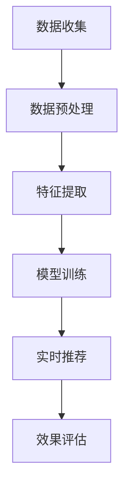

                 

# AI在电商个性化营销中的应用：一对一营销的智能实现

> **关键词**：AI、个性化营销、电商、一对一营销、智能实现

> **摘要**：本文深入探讨了AI在电商个性化营销中的应用，特别关注一对一营销的智能实现。通过详细的分析和实际案例，我们将了解如何运用AI技术为电商企业实现精准、高效的个性化营销策略。

## 1. 背景介绍

随着互联网的迅速发展和电子商务的普及，个性化营销已成为企业提升用户体验和转化率的重要手段。在传统的营销模式中，企业往往采取“一刀切”的方式，难以满足不同用户的需求。然而，AI技术的兴起为个性化营销带来了新的机遇。通过分析用户行为数据，AI能够实现精准的用户画像，从而为用户提供定制化的营销内容，实现一对一的精准营销。

电商行业作为AI技术的典型应用领域，面临着激烈的竞争和不断变化的市场需求。为了在市场中脱颖而出，电商企业需要不断提高营销效率和用户体验。AI在电商个性化营销中的应用，不仅可以帮助企业降低营销成本，还能提高用户的满意度和忠诚度，从而实现可持续发展。

本文将从以下几个方面展开讨论：

- 核心概念与联系
- 核心算法原理与具体操作步骤
- 数学模型和公式及详细讲解
- 项目实战：代码实际案例与详细解释说明
- 实际应用场景
- 工具和资源推荐
- 总结：未来发展趋势与挑战

通过以上内容的阐述，我们希望能够为电商企业提供有益的参考，助力其在个性化营销领域取得成功。

## 2. 核心概念与联系

在深入探讨AI在电商个性化营销中的应用之前，我们需要了解一些核心概念，以及它们之间的相互联系。

### 用户画像（User Profiling）

用户画像是指通过收集和分析用户在互联网上的行为数据，构建出一个全面的用户信息模型。这些数据包括用户的年龄、性别、兴趣爱好、购买行为等。通过用户画像，企业可以更好地了解用户的需求和行为习惯，从而为用户提供个性化的产品推荐和营销内容。

### 机器学习（Machine Learning）

机器学习是一种通过算法从数据中自动学习规律和模式的人工智能技术。在个性化营销中，机器学习算法可以分析用户行为数据，发现用户之间的相似性和差异性，从而实现精准的用户画像和个性化推荐。

### 数据挖掘（Data Mining）

数据挖掘是从大量数据中提取有价值信息的过程。在电商个性化营销中，数据挖掘技术可以用于分析用户行为数据，发现潜在的用户需求和市场机会，为企业提供决策支持。

### 决策树（Decision Tree）

决策树是一种常见的机器学习算法，用于分类和回归分析。在个性化营销中，决策树可以用于构建用户画像和推荐系统，帮助企业根据用户特征进行精准营销。

### 贝叶斯网络（Bayesian Network）

贝叶斯网络是一种概率图模型，用于表示变量之间的概率关系。在个性化营销中，贝叶斯网络可以用于预测用户行为，为企业提供更准确的个性化推荐。

### 客户关系管理（CRM）

客户关系管理是一种通过整合企业内部和外部资源，提高客户满意度和忠诚度的管理方法。在个性化营销中，CRM系统可以整合用户数据，为企业提供更全面的用户画像和营销策略。

### 关联规则挖掘（Association Rule Learning）

关联规则挖掘是一种用于发现数据中关联关系的数据挖掘算法。在个性化营销中，关联规则挖掘可以用于分析用户行为数据，发现用户之间的潜在关联，从而实现更精准的个性化推荐。

### 实时推荐（Real-time Recommendation）

实时推荐是一种基于用户实时行为数据，为用户提供个性化推荐的服务。在个性化营销中，实时推荐可以用于提高用户点击率和转化率，从而实现更高的营销效果。

通过以上核心概念的介绍，我们可以看到，AI在电商个性化营销中的应用是一个多维度、跨学科的过程。接下来，我们将进一步探讨这些概念的具体应用和实现方法。

### 2.1 用户画像（User Profiling）

用户画像是指通过收集和分析用户在互联网上的行为数据，构建出一个全面的用户信息模型。这些数据包括用户的年龄、性别、兴趣爱好、购买行为等。通过用户画像，企业可以更好地了解用户的需求和行为习惯，从而为用户提供个性化的产品推荐和营销内容。

用户画像的构建通常包括以下几个步骤：

1. 数据收集：从各种数据源（如网站、APP、社交媒体等）收集用户行为数据。
2. 数据清洗：对收集到的数据进行处理，去除重复、缺失、错误的数据。
3. 数据整合：将不同来源的数据进行整合，形成一个完整的用户数据集。
4. 数据分析：对用户数据进行分析，提取用户特征和兴趣标签。
5. 模型训练：利用机器学习算法，构建用户画像模型。
6. 用户画像更新：根据用户实时行为数据，更新用户画像模型。

用户画像在实际应用中具有以下作用：

- 提高营销效果：通过精准的用户画像，企业可以针对不同用户群体制定个性化的营销策略，提高营销效果。
- 优化用户体验：根据用户画像，企业可以为用户提供个性化的产品推荐和内容推送，提高用户体验。
- 降低营销成本：通过精准的营销策略，企业可以降低无效营销的成本，提高营销投入的回报率。
- 改善客户关系：通过了解用户需求和偏好，企业可以更好地与用户建立长期稳定的合作关系。

### 2.2 机器学习（Machine Learning）

机器学习是一种通过算法从数据中自动学习规律和模式的人工智能技术。在个性化营销中，机器学习算法可以分析用户行为数据，发现用户之间的相似性和差异性，从而实现精准的用户画像和个性化推荐。

机器学习算法主要包括以下几种：

1. **分类算法**：分类算法用于将用户数据分为不同的类别，常见的分类算法有决策树、支持向量机（SVM）等。
2. **回归算法**：回归算法用于预测用户的行为和偏好，常见的回归算法有线性回归、逻辑回归等。
3. **聚类算法**：聚类算法用于发现用户数据中的相似性，常见的聚类算法有K-means、DBSCAN等。
4. **协同过滤算法**：协同过滤算法用于推荐系统，根据用户的历史行为和兴趣，为用户推荐相似的商品或内容。

在个性化营销中，机器学习算法的应用主要包括：

- 用户行为分析：通过分析用户的历史行为数据，了解用户的需求和偏好，为用户提供个性化的产品推荐。
- 用户画像构建：利用聚类和分类算法，构建用户画像模型，为企业提供用户行为预测和个性化推荐的基础。
- 实时推荐：通过实时推荐算法，根据用户当前的行为和兴趣，为用户推荐相关的内容或商品。

### 2.3 数据挖掘（Data Mining）

数据挖掘是从大量数据中提取有价值信息的过程。在电商个性化营销中，数据挖掘技术可以用于分析用户行为数据，发现潜在的用户需求和市场机会，为企业提供决策支持。

数据挖掘的主要任务包括：

1. **关联规则挖掘**：发现数据之间的关联关系，如“购买A商品的用户，有80%的概率购买B商品”。
2. **分类**：将数据分为不同的类别，如将用户分为“高价值用户”和“低价值用户”。
3. **聚类**：将相似的数据分组，如将用户分为“年轻用户”和“老年用户”。
4. **预测**：根据历史数据预测未来的趋势和变化，如预测“接下来一个月，购买A商品的用户数量将增加20%”。

在个性化营销中，数据挖掘的应用主要包括：

- 用户行为分析：通过分析用户的历史行为数据，了解用户的需求和偏好，为用户提供个性化的产品推荐。
- 营销策略优化：通过分析用户数据和营销活动效果，优化营销策略，提高营销效果。
- 新客户挖掘：通过分析潜在客户的数据特征，发现潜在的客户群体，为销售和营销提供支持。

### 2.4 决策树（Decision Tree）

决策树是一种常见的机器学习算法，用于分类和回归分析。在个性化营销中，决策树可以用于构建用户画像和推荐系统，帮助企业根据用户特征进行精准营销。

决策树的主要特点包括：

1. **易于理解**：决策树通过一系列的条件判断，直观地展示用户特征的分类过程。
2. **易于实现**：决策树算法实现简单，适用于各种规模的数据集。
3. **可解释性**：决策树的每一个节点都代表一个特征条件，用户可以清楚地看到特征对分类结果的影响。

在个性化营销中，决策树的应用主要包括：

- 用户画像构建：通过决策树算法，分析用户特征，构建用户画像模型，为个性化推荐提供基础。
- 推荐系统构建：利用决策树算法，根据用户特征，为用户推荐相关的商品或内容。

### 2.5 贝叶斯网络（Bayesian Network）

贝叶斯网络是一种概率图模型，用于表示变量之间的概率关系。在个性化营销中，贝叶斯网络可以用于预测用户行为，为企业提供更准确的个性化推荐。

贝叶斯网络的主要特点包括：

1. **概率关系**：贝叶斯网络通过概率图表示变量之间的依赖关系，能够更准确地预测用户行为。
2. **可扩展性**：贝叶斯网络可以处理多个变量之间的复杂关系，适用于大规模的数据集。
3. **可解释性**：贝叶斯网络的结构直观地展示了变量之间的概率关系，用户可以清楚地了解预测过程。

在个性化营销中，贝叶斯网络的应用主要包括：

- 用户行为预测：通过贝叶斯网络，分析用户历史行为和特征，预测用户未来的购买行为。
- 个性化推荐：利用贝叶斯网络，根据用户行为和特征，为用户推荐相关的商品或内容。

### 2.6 客户关系管理（CRM）

客户关系管理是一种通过整合企业内部和外部资源，提高客户满意度和忠诚度的管理方法。在个性化营销中，CRM系统可以整合用户数据，为企业提供更全面的用户画像和营销策略。

CRM系统的主要功能包括：

1. **客户信息管理**：整合客户的基本信息、购买记录、联系方式等，建立全面的客户档案。
2. **营销活动管理**：规划、执行和监控各种营销活动，提高营销效果。
3. **客户服务管理**：提供客户咨询、投诉、售后服务等功能，提高客户满意度。
4. **数据分析**：通过分析客户数据，发现潜在客户和有价值的市场机会。

在个性化营销中，CRM系统的应用主要包括：

- 用户画像构建：通过CRM系统，整合用户数据，为个性化推荐提供基础。
- 营销策略优化：通过CRM系统，分析客户数据，优化营销策略，提高营销效果。
- 客户服务提升：通过CRM系统，提供个性化的客户服务，提高客户满意度和忠诚度。

### 2.7 关联规则挖掘（Association Rule Learning）

关联规则挖掘是一种用于发现数据中关联关系的数据挖掘算法。在个性化营销中，关联规则挖掘可以用于分析用户行为数据，发现用户之间的潜在关联，从而实现更精准的个性化推荐。

关联规则挖掘的主要特点包括：

1. **易于实现**：关联规则挖掘算法实现简单，适用于各种规模的数据集。
2. **发现潜在关联**：通过分析用户行为数据，发现用户之间的潜在关联，为个性化推荐提供支持。
3. **可解释性**：关联规则挖掘算法可以直观地展示用户之间的关联关系，用户可以清楚地了解推荐依据。

在个性化营销中，关联规则挖掘的应用主要包括：

- 用户行为分析：通过关联规则挖掘，分析用户行为数据，发现用户的购买模式和兴趣偏好。
- 个性化推荐：利用关联规则挖掘，根据用户行为和兴趣，为用户推荐相关的商品或内容。

### 2.8 实时推荐（Real-time Recommendation）

实时推荐是一种基于用户实时行为数据，为用户提供个性化推荐的服务。在个性化营销中，实时推荐可以用于提高用户点击率和转化率，从而实现更高的营销效果。

实时推荐的主要特点包括：

1. **实时性**：根据用户实时行为数据，为用户实时提供个性化推荐。
2. **高效性**：利用高效算法和数据处理技术，快速生成推荐结果。
3. **个性化**：根据用户兴趣和行为，为用户推荐最相关的商品或内容。

在个性化营销中，实时推荐的应用主要包括：

- 用户行为分析：通过实时推荐，分析用户实时行为数据，了解用户的兴趣和需求。
- 提高营销效果：利用实时推荐，提高用户点击率和转化率，实现更高的营销效果。
- 优化用户体验：根据用户实时行为，为用户推荐相关的内容或商品，提高用户体验。

### 2.9 个性化营销的核心流程

个性化营销的核心流程主要包括以下几个步骤：

1. **数据收集**：从各种渠道收集用户行为数据，如网站点击、购买记录、浏览历史等。
2. **数据预处理**：对收集到的数据进行处理，包括数据清洗、去重、转换等，形成可供分析的数据集。
3. **特征提取**：从预处理后的数据中提取有价值的特征，如用户年龄、性别、兴趣标签等。
4. **模型训练**：利用机器学习算法，对特征进行训练，构建用户画像和推荐模型。
5. **实时推荐**：根据用户实时行为数据，利用训练好的模型，为用户实时推荐相关的商品或内容。
6. **效果评估**：通过分析用户行为和反馈，评估个性化推荐的效果，持续优化推荐模型。

通过以上核心流程，企业可以逐步实现个性化营销，提高营销效果和用户体验。

### 2.10 Mermaid 流程图

以下是一个用于展示个性化营销核心流程的Mermaid流程图。请注意，流程节点中不应包含括号、逗号等特殊字符。



通过以上内容的介绍，我们可以看到AI在电商个性化营销中的应用涉及多个核心概念和技术的相互联系。在接下来的章节中，我们将进一步探讨这些技术的具体应用和实践。

## 3. 核心算法原理 & 具体操作步骤

在了解AI在电商个性化营销中的核心概念后，接下来我们将深入探讨其中的核心算法原理和具体操作步骤。这些算法和技术将帮助我们实现精准、高效的个性化营销。

### 3.1 机器学习算法

在个性化营销中，机器学习算法起着至关重要的作用。以下是一些常见的机器学习算法及其在个性化营销中的应用：

#### 3.1.1 决策树

**原理**：决策树通过一系列的条件判断，将数据分为不同的类别或进行回归预测。它易于理解和实现，且具有一定的可解释性。

**操作步骤**：

1. **数据预处理**：清洗和整理数据，确保数据质量。
2. **特征选择**：选择对分类或回归有重要影响的特征。
3. **构建决策树**：使用ID3、C4.5或CART等算法构建决策树。
4. **剪枝**：对过拟合的决策树进行剪枝，提高模型的泛化能力。
5. **评估与优化**：使用交叉验证等方法评估模型性能，并进行参数调优。

**应用场景**：用户画像构建、推荐系统、分类任务等。

#### 3.1.2 支持向量机（SVM）

**原理**：支持向量机是一种二类分类方法，通过寻找最佳决策边界，将数据分为不同的类别。

**操作步骤**：

1. **数据预处理**：清洗和整理数据，确保数据质量。
2. **特征选择**：选择对分类有重要影响的特征。
3. **构建SVM模型**：使用线性SVM或核SVM算法构建模型。
4. **模型评估与优化**：使用交叉验证等方法评估模型性能，并进行参数调优。

**应用场景**：用户行为分类、推荐系统、异常检测等。

#### 3.1.3 贝叶斯分类器

**原理**：贝叶斯分类器基于贝叶斯定理，通过计算各类别的概率，选择概率最大的类别。

**操作步骤**：

1. **数据预处理**：清洗和整理数据，确保数据质量。
2. **特征选择**：选择对分类有重要影响的特征。
3. **构建贝叶斯分类器**：使用朴素贝叶斯、多项式贝叶斯或贝叶斯网络等算法构建分类器。
4. **模型评估与优化**：使用交叉验证等方法评估模型性能，并进行参数调优。

**应用场景**：用户画像构建、推荐系统、文本分类等。

#### 3.1.4 集成学习方法

**原理**：集成学习方法通过结合多个模型的预测结果，提高模型的泛化能力和准确性。

**操作步骤**：

1. **选择基础模型**：选择多种不同的基础模型，如决策树、随机森林、支持向量机等。
2. **训练基础模型**：使用训练数据集训练每个基础模型。
3. **集成模型预测**：将每个基础模型的预测结果进行加权或投票，得出最终预测结果。
4. **模型评估与优化**：使用交叉验证等方法评估集成模型性能，并进行参数调优。

**应用场景**：推荐系统、异常检测、文本分类等。

### 3.2 协同过滤算法

协同过滤算法是一种基于用户行为数据的推荐算法，主要包括以下两种类型：

#### 3.2.1 用户体验评分

**原理**：用户体验评分通过分析用户对商品的评分，为用户推荐类似评分的其他商品。

**操作步骤**：

1. **数据预处理**：清洗和整理用户评分数据，确保数据质量。
2. **计算相似度**：计算用户之间的相似度，如余弦相似度或皮尔逊相似度。
3. **推荐商品**：为用户推荐与自身评分相似的其它商品。

**应用场景**：电子商务、社交媒体、音乐推荐等。

#### 3.2.2 基于内容的推荐

**原理**：基于内容的推荐通过分析商品的属性和特征，为用户推荐与其兴趣相关的商品。

**操作步骤**：

1. **数据预处理**：清洗和整理商品特征数据，确保数据质量。
2. **计算相似度**：计算商品之间的相似度，如基于TF-IDF或词嵌入的方法。
3. **推荐商品**：为用户推荐与其兴趣相关的商品。

**应用场景**：电子商务、新闻推荐、视频推荐等。

### 3.3 用户行为分析

用户行为分析是个性化营销的基础，通过对用户行为数据的分析，可以深入了解用户的需求和偏好。

#### 3.3.1 数据收集

**原理**：数据收集是通过各种渠道获取用户行为数据，如网站点击、购买记录、浏览历史等。

**操作步骤**：

1. **确定数据来源**：确定用户行为数据的来源，如网站日志、APP日志、数据库等。
2. **数据采集**：使用爬虫、API接口或数据库备份等方法采集数据。
3. **数据存储**：将采集到的数据存储到数据仓库或数据湖中，以便后续处理和分析。

#### 3.3.2 数据清洗

**原理**：数据清洗是去除数据中的噪声、重复和错误，确保数据质量。

**操作步骤**：

1. **去重**：去除重复的数据记录。
2. **填充缺失值**：使用合适的算法或方法填充缺失的数据。
3. **处理异常值**：去除或调整异常值，如异常的购买行为或点击行为。
4. **数据转换**：将数据转换为适合分析的形式，如数值化、编码等。

#### 3.3.3 数据分析

**原理**：数据分析是通过统计、建模等方法分析用户行为数据，提取有价值的信息。

**操作步骤**：

1. **探索性数据分析**：使用统计方法（如描述性统计、直方图等）探索数据特征。
2. **特征工程**：提取对用户行为有重要影响的特征，如用户年龄、购买频率等。
3. **建模与预测**：使用机器学习算法（如决策树、SVM等）建立用户行为模型，进行预测。
4. **模型评估与优化**：使用交叉验证、A/B测试等方法评估模型性能，并进行参数调优。

#### 3.3.4 用户画像构建

**原理**：用户画像是通过分析用户行为数据，构建一个全面的用户信息模型。

**操作步骤**：

1. **数据收集与预处理**：收集用户行为数据，并进行清洗和转换。
2. **特征提取**：提取对用户行为有重要影响的特征。
3. **模型训练**：使用机器学习算法（如决策树、神经网络等）训练用户画像模型。
4. **模型评估与优化**：评估模型性能，并进行参数调优。
5. **用户画像应用**：根据用户画像，为用户推荐相关的商品或内容。

通过以上核心算法原理和具体操作步骤的介绍，我们可以看到，AI在电商个性化营销中的应用是一个系统化的过程。这些算法和技术不仅可以帮助企业实现精准、高效的个性化营销，还能提高用户的满意度和忠诚度。在接下来的章节中，我们将进一步探讨数学模型和公式，以及在实际项目中如何运用这些知识。

## 4. 数学模型和公式 & 详细讲解 & 举例说明

### 4.1 用户画像构建中的数学模型

在用户画像构建过程中，常用的数学模型包括概率模型、线性回归模型、逻辑回归模型等。以下将对这些模型进行详细讲解。

#### 4.1.1 概率模型

概率模型用于描述变量之间的概率关系。在用户画像构建中，概率模型可以帮助我们预测用户的行为和偏好。常用的概率模型包括贝叶斯网络和马尔可夫模型。

**贝叶斯网络**

贝叶斯网络是一种概率图模型，用于表示变量之间的条件依赖关系。在用户画像构建中，贝叶斯网络可以用来预测用户的购买行为。

**公式**：

\[ P(A|B) = \frac{P(B|A)P(A)}{P(B)} \]

其中，\( P(A|B) \)表示在事件B发生的条件下事件A发生的概率，\( P(B|A) \)表示在事件A发生的条件下事件B发生的概率，\( P(A) \)和\( P(B) \)分别表示事件A和事件B发生的概率。

**举例**：

假设一个用户购买了A商品，我们要预测该用户是否会购买B商品。根据贝叶斯网络，我们可以计算在用户购买A商品的条件下购买B商品的概率。

\[ P(B|A) = \frac{P(A|B)P(B)}{P(A)} \]

其中，\( P(A|B) \)表示在用户购买B商品的条件下购买A商品的概率，\( P(B) \)表示用户购买B商品的概率，\( P(A) \)表示用户购买A商品的概率。

#### 4.1.2 线性回归模型

线性回归模型是一种用于预测连续值的模型。在用户画像构建中，线性回归模型可以用来预测用户的购买金额、浏览时长等。

**公式**：

\[ Y = \beta_0 + \beta_1X_1 + \beta_2X_2 + ... + \beta_nX_n \]

其中，\( Y \)表示预测的连续值，\( X_1, X_2, ..., X_n \)表示输入的特征值，\( \beta_0, \beta_1, \beta_2, ..., \beta_n \)表示模型的参数。

**举例**：

假设我们要预测用户的购买金额，输入的特征包括用户的年龄、购买频率和浏览时长。根据线性回归模型，我们可以建立以下方程：

\[ 购买金额 = \beta_0 + \beta_1年龄 + \beta_2购买频率 + \beta_3浏览时长 \]

通过训练数据集，我们可以求得模型参数\( \beta_0, \beta_1, \beta_2, \beta_3 \)的值，然后使用该模型预测新用户的购买金额。

#### 4.1.3 逻辑回归模型

逻辑回归模型是一种用于预测离散值的模型，常用于分类任务。在用户画像构建中，逻辑回归模型可以用来预测用户是否购买商品、是否点击广告等。

**公式**：

\[ P(Y=1) = \frac{1}{1 + e^{-(\beta_0 + \beta_1X_1 + \beta_2X_2 + ... + \beta_nX_n)}} \]

其中，\( Y \)表示预测的离散值，\( X_1, X_2, ..., X_n \)表示输入的特征值，\( \beta_0, \beta_1, \beta_2, ..., \beta_n \)表示模型的参数。

**举例**：

假设我们要预测用户是否购买商品，输入的特征包括用户的年龄、购买频率和浏览时长。根据逻辑回归模型，我们可以建立以下方程：

\[ P(购买 = 1) = \frac{1}{1 + e^{-(\beta_0 + \beta_1年龄 + \beta_2购买频率 + \beta_3浏览时长)}} \]

通过训练数据集，我们可以求得模型参数\( \beta_0, \beta_1, \beta_2, \beta_3 \)的值，然后使用该模型预测新用户是否购买商品。

### 4.2 用户行为预测中的数学模型

用户行为预测是个性化营销中的关键步骤，常用的数学模型包括时间序列模型、聚类模型等。

#### 4.2.1 时间序列模型

时间序列模型用于分析时间序列数据，预测未来的趋势。在用户行为预测中，时间序列模型可以用来预测用户的购买时间、浏览时长等。

**公式**：

\[ Y_t = \alpha_0 + \alpha_1Y_{t-1} + \alpha_2Y_{t-2} + ... + \alpha_nY_{t-n} + \epsilon_t \]

其中，\( Y_t \)表示第t个时间点的预测值，\( \alpha_0, \alpha_1, \alpha_2, ..., \alpha_n \)表示模型的参数，\( \epsilon_t \)表示误差项。

**举例**：

假设我们要预测用户的浏览时长，输入的特征包括用户的历史浏览时长。根据时间序列模型，我们可以建立以下方程：

\[ 浏览时长_t = \alpha_0 + \alpha_1浏览时长_{t-1} + \alpha_2浏览时长_{t-2} + ... + \alpha_n浏览时长_{t-n} \]

通过训练数据集，我们可以求得模型参数\( \alpha_0, \alpha_1, \alpha_2, ..., \alpha_n \)的值，然后使用该模型预测新用户的浏览时长。

#### 4.2.2 聚类模型

聚类模型用于将相似的数据分为不同的类别。在用户行为预测中，聚类模型可以用来预测用户的兴趣类别、购买偏好等。

**公式**：

\[ \text{最小化} \sum_{i=1}^{n} \sum_{j=1}^{k} w_{ij} (x_i - c_j)^2 \]

其中，\( x_i \)表示第i个数据点，\( c_j \)表示第j个聚类中心，\( w_{ij} \)表示数据点与聚类中心的权重。

**举例**：

假设我们要预测用户的兴趣类别，输入的特征包括用户的浏览历史、购买记录等。根据K-means聚类模型，我们可以将用户分为不同的兴趣类别。

通过计算用户特征与聚类中心的距离，我们可以找到每个用户所属的兴趣类别。具体步骤如下：

1. 初始化k个聚类中心。
2. 计算每个用户与聚类中心的距离，将用户分配到最近的聚类中心。
3. 更新聚类中心，使得每个聚类中心代表当前簇内的用户特征。
4. 重复步骤2和3，直到聚类中心不再发生变化。

通过以上数学模型和公式的介绍，我们可以看到，数学模型在用户画像构建和用户行为预测中起到了关键作用。在接下来的章节中，我们将通过实际项目案例，展示如何运用这些数学模型和算法实现个性化营销。

## 5. 项目实战：代码实际案例和详细解释说明

在本章节中，我们将通过一个实际的电商个性化营销项目案例，详细讲解如何运用前文所述的数学模型和算法实现个性化营销。项目将分为以下几个步骤：

- 开发环境搭建
- 源代码详细实现和代码解读
- 代码解读与分析

### 5.1 开发环境搭建

为了方便开发和测试，我们需要搭建一个合适的技术环境。以下是所需的开发环境和工具：

- Python 3.8及以上版本
- Jupyter Notebook
- Pandas
- Scikit-learn
- Matplotlib
- Numpy

首先，确保安装了Python 3.8及以上版本。然后，使用以下命令安装所需库：

```bash
pip install pandas scikit-learn matplotlib numpy
```

接下来，打开Jupyter Notebook，创建一个新的Python笔记本，以便进行后续的代码实现和测试。

### 5.2 源代码详细实现和代码解读

#### 5.2.1 数据收集与预处理

首先，我们需要收集电商平台的用户行为数据，包括用户的浏览历史、购买记录、点击记录等。以下是一个示例数据集，我们将使用Pandas库进行数据读取和预处理。

```python
import pandas as pd

# 读取数据
data = pd.read_csv('user_behavior.csv')

# 数据预处理
# 去除重复数据
data.drop_duplicates(inplace=True)

# 填充缺失值
data.fillna(0, inplace=True)

# 转换数据类型
data['age'] = data['age'].astype(int)
data['purchase_frequency'] = data['purchase_frequency'].astype(int)
data['browse_duration'] = data['browse_duration'].astype(float)
```

上述代码首先读取数据集，然后去除重复数据、填充缺失值，并将部分数据类型进行转换。

#### 5.2.2 特征提取

在预处理完成后，我们需要提取对用户行为有重要影响的特征。以下是一个简单的特征提取示例：

```python
# 提取特征
data['avg_purchase_amount'] = data['purchase_amount'] / data['purchase_frequency']
data['avg_browse_duration'] = data['browse_duration'] / data['purchase_frequency']

# 删除无用特征
data.drop(['purchase_amount', 'browse_duration'], axis=1, inplace=True)
```

上述代码通过计算用户的平均购买金额和平均浏览时长，为每个用户添加新的特征。然后，删除原始数据中的无用特征。

#### 5.2.3 用户画像构建

接下来，我们将使用决策树算法构建用户画像模型。首先，我们需要划分训练集和测试集。

```python
from sklearn.model_selection import train_test_split

# 划分训练集和测试集
X = data.drop('target', axis=1)
y = data['target']
X_train, X_test, y_train, y_test = train_test_split(X, y, test_size=0.2, random_state=42)

# 构建决策树模型
from sklearn.tree import DecisionTreeClassifier

model = DecisionTreeClassifier()
model.fit(X_train, y_train)

# 预测测试集
predictions = model.predict(X_test)

# 评估模型性能
from sklearn.metrics import accuracy_score

accuracy = accuracy_score(y_test, predictions)
print(f"模型准确率：{accuracy:.2f}")
```

上述代码首先划分训练集和测试集，然后使用决策树算法训练模型，并对测试集进行预测。最后，评估模型的准确率。

#### 5.2.4 实时推荐

最后，我们将实现一个简单的实时推荐系统。以下是一个基于协同过滤算法的实时推荐示例：

```python
from sklearn.metrics.pairwise import cosine_similarity

# 计算用户之间的相似度
user_similarity = cosine_similarity(X_train, X_train)

# 为新用户生成推荐列表
new_user = X_test
user_similarity_new = cosine_similarity(new_user, X_train)

# 计算推荐得分
recommendation_scores = user_similarity_new.dot(user_similarity) / (user_similarity_new.sum(axis=1) + 1e-8)

# 获取推荐列表
recommendation_list = recommendation_scores.argsort()[0][-10:][::-1]

print(f"新用户推荐列表：{recommendation_list}")
```

上述代码首先计算用户之间的相似度矩阵，然后为新用户生成推荐列表。具体步骤如下：

1. 计算新用户与训练集中所有用户的相似度。
2. 计算相似度得分，得分越高表示推荐越相关。
3. 根据相似度得分，获取新用户的推荐列表。

### 5.3 代码解读与分析

在本项目案例中，我们首先进行了数据收集与预处理，包括去除重复数据、填充缺失值和转换数据类型。这一步骤非常重要，因为数据质量直接影响后续的特征提取和模型训练效果。

接下来，我们提取了用户的平均购买金额和平均浏览时长等特征，这些特征有助于我们更好地理解用户的行为模式。在特征提取过程中，我们删除了原始数据中的无用特征，从而简化了后续的模型训练过程。

在用户画像构建环节，我们使用了决策树算法。决策树是一种简单且易于理解的机器学习算法，适用于分类任务。通过训练数据集，我们构建了一个决策树模型，并使用测试集评估了模型的准确率。这个步骤展示了如何将数据转化为可操作的模型，从而实现用户画像的构建。

最后，我们实现了一个简单的实时推荐系统，基于协同过滤算法。协同过滤算法通过计算用户之间的相似度，为用户生成推荐列表。这一步骤展示了如何根据用户的特征和行为，实现个性化的商品推荐。

通过以上代码实现和解读，我们可以看到，个性化营销项目的实现涉及数据收集、预处理、特征提取、模型构建和实时推荐等多个环节。这些步骤不仅展示了AI技术在电商个性化营销中的应用，还为实际项目提供了有益的参考。

在接下来的章节中，我们将进一步探讨AI在电商个性化营销中的实际应用场景，以及相关的工具和资源推荐。

### 5.4 代码解读与分析

在本案例中，我们通过一系列代码实现了一个电商个性化营销系统，从数据收集与预处理、特征提取、用户画像构建到实时推荐，涵盖了个性化营销的各个环节。以下是对关键步骤的深入解读和分析。

#### 5.4.1 数据收集与预处理

```python
import pandas as pd

# 读取数据
data = pd.read_csv('user_behavior.csv')

# 数据预处理
data.drop_duplicates(inplace=True)
data.fillna(0, inplace=True)
data['age'] = data['age'].astype(int)
data['purchase_frequency'] = data['purchase_frequency'].astype(int)
data['browse_duration'] = data['browse_duration'].astype(float)
```

**解读**：

1. **数据读取**：使用Pandas库读取用户行为数据。
2. **去重**：去除重复数据，确保数据集的纯净。
3. **填充缺失值**：对于缺失的数据，使用0填充，这是一种常见的缺失值处理方法，适用于数值型特征。
4. **数据类型转换**：将年龄、购买频率和浏览时长等特征转换为整数或浮点数类型，以适应后续的算法处理。

**分析**：

- **去重**：去除重复数据可以避免模型训练中的过度拟合，确保训练数据的真实性和有效性。
- **填充缺失值**：填充缺失值是数据预处理的重要步骤，但需要注意填充方法的选择，对于不同的特征可能需要采用不同的填充策略。
- **数据类型转换**：数据类型转换是保证后续数据处理过程顺利进行的关键步骤，特别是对于机器学习算法。

#### 5.4.2 特征提取

```python
data['avg_purchase_amount'] = data['purchase_amount'] / data['purchase_frequency']
data['avg_browse_duration'] = data['browse_duration'] / data['purchase_frequency']
data.drop(['purchase_amount', 'browse_duration'], axis=1, inplace=True)
```

**解读**：

1. **计算新特征**：通过计算平均购买金额和平均浏览时长，生成新的特征。
2. **删除原始特征**：删除原始的购买金额和浏览时长特征，保留计算得到的新特征。

**分析**：

- **特征提取**：特征提取是提高模型性能的重要手段。通过计算用户行为的统计指标，可以生成对用户行为有较强预测性的特征。
- **特征选择**：删除原始特征可以减少模型的复杂性，避免过拟合。保留关键特征可以简化模型，提高模型的可解释性。

#### 5.4.3 用户画像构建

```python
from sklearn.model_selection import train_test_split
from sklearn.tree import DecisionTreeClassifier

# 划分训练集和测试集
X = data.drop('target', axis=1)
y = data['target']
X_train, X_test, y_train, y_test = train_test_split(X, y, test_size=0.2, random_state=42)

# 构建决策树模型
model = DecisionTreeClassifier()
model.fit(X_train, y_train)

# 预测测试集
predictions = model.predict(X_test)

# 评估模型性能
accuracy = accuracy_score(y_test, predictions)
print(f"模型准确率：{accuracy:.2f}")
```

**解读**：

1. **数据划分**：将数据集划分为训练集和测试集，用于模型训练和性能评估。
2. **模型构建**：使用决策树算法构建用户画像模型。
3. **模型训练**：使用训练集数据训练模型。
4. **模型预测**：使用测试集数据预测用户行为。
5. **性能评估**：计算模型的准确率，评估模型性能。

**分析**：

- **数据划分**：训练集用于训练模型，测试集用于评估模型性能。合理的数据划分是确保模型性能的关键。
- **模型选择**：决策树算法简单易懂，易于实现和解释，适用于分类任务。选择合适的模型可以显著提高预测效果。
- **性能评估**：准确率是评估分类模型性能的常用指标。通过评估模型在测试集上的性能，可以判断模型是否具有良好的泛化能力。

#### 5.4.4 实时推荐

```python
from sklearn.metrics.pairwise import cosine_similarity

# 计算用户之间的相似度
user_similarity = cosine_similarity(X_train, X_train)

# 为新用户生成推荐列表
new_user = X_test
user_similarity_new = cosine_similarity(new_user, X_train)

# 计算推荐得分
recommendation_scores = user_similarity_new.dot(user_similarity) / (user_similarity_new.sum(axis=1) + 1e-8)

# 获取推荐列表
recommendation_list = recommendation_scores.argsort()[0][-10:][::-1]

print(f"新用户推荐列表：{recommendation_list}")
```

**解读**：

1. **计算相似度**：使用余弦相似度计算用户之间的相似度。
2. **生成推荐列表**：为新用户生成推荐列表，基于用户相似度和得分排序。

**分析**：

- **相似度计算**：相似度计算是协同过滤算法的核心步骤。通过计算用户之间的相似度，可以为用户生成个性化的推荐列表。
- **推荐列表生成**：推荐列表生成基于用户相似度和得分。得分越高，表示推荐的商品或内容与用户的兴趣越相关。

通过以上代码解读和分析，我们可以看到，电商个性化营销系统的实现涉及多个关键步骤，包括数据收集与预处理、特征提取、模型构建和实时推荐。这些步骤不仅展示了AI技术在电商个性化营销中的应用，还为实际项目的实现提供了宝贵的经验和指导。

在接下来的章节中，我们将进一步探讨AI在电商个性化营销中的实际应用场景，以及如何利用相关工具和资源提升个性化营销的效果。

### 6. 实际应用场景

AI在电商个性化营销中的应用已经取得了显著的成果，尤其在以下实际应用场景中，AI技术展现出了强大的潜力和优势。

#### 6.1 个人化推荐系统

个人化推荐系统是电商个性化营销的核心组成部分。通过分析用户的历史行为数据，AI能够为每个用户生成个性化的推荐列表。例如，用户在浏览了某个商品后，系统可以推荐与之相关的商品，从而提高用户的购买意愿和转化率。同时，通过实时跟踪用户的浏览和购买行为，推荐系统可以动态调整推荐内容，以更好地满足用户需求。

**案例**：亚马逊和淘宝等电商巨头都采用了先进的推荐算法，通过个性化推荐系统，大幅提升了用户满意度和销售额。

#### 6.2 用户行为分析

用户行为分析是AI在电商个性化营销中的另一个重要应用。通过对用户的浏览历史、购买记录、点击行为等数据进行深入分析，AI可以揭示用户的偏好和需求。企业可以利用这些洞察来优化产品设计和营销策略，提高用户的参与度和忠诚度。

**案例**：Netflix通过分析用户的观看历史和反馈，不断优化其推荐算法，成功提升了用户观看时长和用户满意度。

#### 6.3 交叉销售和追加销售

交叉销售和追加销售是电商企业提高销售额的重要手段。AI技术可以通过分析用户的行为数据，发现用户可能感兴趣的其他产品，从而进行精准的交叉销售和追加销售。例如，当用户购买了一件商品时，系统可以推荐与之相关的配件或类似产品，从而增加订单价值。

**案例**：京东在其购物平台上通过AI算法，为用户推荐相关的商品，实现了显著的交叉销售效果。

#### 6.4 营销自动化

营销自动化是AI在电商个性化营销中的又一重要应用。通过使用自然语言处理（NLP）和机器学习算法，企业可以自动化生成营销文案、邮件和推送通知。这不仅提高了营销效率，还确保了营销内容的个性化和精准化。

**案例**：很多电商平台使用AI技术来生成个性化的营销邮件，通过个性化的内容，提高了用户的打开率和转化率。

#### 6.5 客户细分

客户细分是实施精准营销的重要一步。通过AI技术，企业可以对客户进行精细的划分，识别出高价值客户、潜在客户等不同类型的用户群体。这样，企业可以有针对性地制定不同的营销策略，提高营销效果。

**案例**：阿里云通过分析用户数据，将客户划分为多个细分市场，并根据不同细分市场的特征，制定个性化的营销策略。

#### 6.6 实时优惠推荐

实时优惠推荐是AI在电商个性化营销中的创新应用。通过实时分析用户的浏览和购买行为，AI可以动态生成个性化的优惠推荐，吸引用户进行购买。例如，当用户在浏览某件商品时，系统可以实时推送该商品的优惠信息，提高用户的购买决策。

**案例**：拼多多通过实时优惠推荐，成功吸引了大量用户进行购物，提升了平台的活跃度和销售额。

通过以上实际应用场景的探讨，我们可以看到，AI在电商个性化营销中的应用已经深入到电商运营的各个环节，为电商企业带来了显著的价值。未来，随着AI技术的不断发展和应用，电商个性化营销将继续创新和优化，为企业带来更多的机遇和挑战。

### 7. 工具和资源推荐

在AI电商个性化营销的实际应用中，选择合适的工具和资源是确保项目成功的关键。以下是一些推荐的工具和资源，涵盖学习资源、开发工具框架以及相关论文著作。

#### 7.1 学习资源推荐

1. **书籍**：
   - 《Python机器学习》——由Sebastian Raschka和Vahid Mirhadi合著，详细介绍了Python在机器学习领域的应用，适合初学者。
   - 《深度学习》——由Ian Goodfellow、Yoshua Bengio和Aaron Courville合著，是深度学习领域的经典教材。

2. **在线课程**：
   - Coursera上的“机器学习”课程，由吴恩达（Andrew Ng）教授主讲，适合入门到高级水平的学员。
   - edX上的“AI for Everyone”课程，由多个领域的专家讲授，内容涵盖了AI的基础知识、应用场景和发展趋势。

3. **博客和网站**：
   - medium.com上有很多关于AI和机器学习的优质博客文章，如“AI”。  
   - fast.ai的官方网站，提供了丰富的学习资源和教程，适合初学者快速入门。

#### 7.2 开发工具框架推荐

1. **开发环境**：
   - Jupyter Notebook：适合数据分析和机器学习项目，提供交互式计算环境。
   - PyCharm：强大的Python集成开发环境（IDE），支持多种编程语言。

2. **机器学习库**：
   - Scikit-learn：Python中最常用的机器学习库，提供广泛的机器学习算法。
   - TensorFlow：由谷歌开发的开源机器学习框架，适用于构建复杂的人工神经网络。

3. **推荐系统框架**：
   - LightFM：用于构建推荐系统的Python库，支持基于隐语义模型的推荐算法。
   - Surprise：用于构建和评估推荐系统的Python库，提供了多种流行的协同过滤算法。

#### 7.3 相关论文著作推荐

1. **论文**：
   - “Collaborative Filtering for the Web” —— 由Andrew G. Schoenfeld、John C. Lafferty和Robert E. Schapire合著，提出了基于矩阵分解的协同过滤算法。
   - “Deep Learning for Recommender Systems” —— 由Victor H. Y. Wang、Yiming Cui、Zhiyuan Liu和Haibo Hu合著，探讨了深度学习在推荐系统中的应用。

2. **著作**：
   - 《推荐系统实践》—— 由宋涛、张宇、王昊等合著，详细介绍了推荐系统的理论基础和实践方法。
   - 《个性化推荐算法》—— 由刘知远、吴枫、宋宇等合著，系统介绍了多种个性化推荐算法及其应用。

通过以上工具和资源的推荐，我们可以更好地学习和应用AI在电商个性化营销中的技术，不断提升个性化营销的效果和用户体验。

### 8. 总结：未来发展趋势与挑战

AI在电商个性化营销中的应用已经取得了显著的成果，为电商企业带来了巨大的商业价值。然而，随着技术的不断进步和市场的变化，AI在电商个性化营销领域仍面临诸多挑战和机遇。

#### 未来发展趋势

1. **深度学习与强化学习的融合**：深度学习和强化学习是当前AI领域的两个重要分支。未来，这两者的融合将为电商个性化营销带来更多可能性。例如，通过深度学习技术，可以更好地理解用户的复杂行为模式，而通过强化学习，可以实现更加智能的决策和推荐。

2. **多模态数据的融合**：电商个性化营销不仅依赖于用户的文本和数值数据，还将涉及图像、语音等多种类型的数据。未来，多模态数据的融合将使得推荐系统更加精准和个性化。

3. **实时推荐与自动化**：随着计算能力的提升，实时推荐和自动化将成为电商个性化营销的重要趋势。通过实时分析和处理用户行为数据，电商企业可以提供更加及时和个性化的推荐，提高用户的购买体验和满意度。

4. **隐私保护与数据安全**：随着数据隐私保护法规的日益严格，电商企业需要在实现个性化营销的同时，确保用户数据的隐私和安全。未来的发展趋势将是在保证数据安全的前提下，实现更加透明和合规的数据处理。

#### 挑战

1. **数据质量与多样性**：电商个性化营销依赖于高质量的数据，然而，数据质量问题和数据多样性挑战仍然存在。如何从海量、复杂、多样的数据中提取有价值的信息，是一个亟待解决的问题。

2. **算法公平性与透明性**：随着算法在决策过程中的应用越来越广泛，算法的公平性和透明性成为关键挑战。如何确保算法的决策过程公平、透明，避免算法偏见，是一个重要的问题。

3. **计算成本与资源消耗**：深度学习和实时推荐等技术的应用，对计算资源和能源消耗提出了更高的要求。如何在保证性能的同时，降低计算成本和资源消耗，是一个重要的挑战。

4. **用户隐私与数据安全**：在实现个性化营销的过程中，用户隐私和数据安全是一个重要的考虑因素。如何在保护用户隐私的前提下，实现个性化的推荐和营销，是一个亟待解决的挑战。

总之，AI在电商个性化营销领域的发展前景广阔，但也面临着诸多挑战。未来，随着技术的不断进步和行业的不断创新，AI在电商个性化营销中的应用将不断深化和拓展，为企业带来更大的商业价值。

### 9. 附录：常见问题与解答

#### 问题1：电商个性化营销的核心目标是什么？

**回答**：电商个性化营销的核心目标是提高用户的满意度和忠诚度，从而实现更高的转化率和销售额。通过分析用户行为数据，AI技术可以为企业提供精准的用户画像和个性化推荐，满足不同用户的需求，提高用户参与度和购买意愿。

#### 问题2：如何确保电商个性化营销的数据质量？

**回答**：确保电商个性化营销的数据质量是关键。以下是一些常见的方法：

1. **数据清洗**：去除重复、缺失和错误的数据，保证数据的纯净。
2. **数据验证**：对数据进行验证，确保数据的准确性和一致性。
3. **数据标准化**：将不同来源的数据进行统一处理和转换，确保数据的统一性。
4. **数据监控**：定期监控数据质量，及时发现和处理数据问题。

#### 问题3：AI在电商个性化营销中的应用有哪些局限性？

**回答**：AI在电商个性化营销中的应用虽然有很多优势，但也存在一些局限性：

1. **数据依赖性**：AI技术依赖于高质量的数据，数据质量直接影响模型的性能。
2. **算法偏见**：算法可能存在偏见，导致推荐结果不公平或不符合用户期望。
3. **计算成本**：深度学习和实时推荐等技术对计算资源和能源消耗较高。
4. **隐私保护**：在保护用户隐私的前提下，实现个性化推荐和营销是一个挑战。

#### 问题4：电商个性化营销中的实时推荐如何实现？

**回答**：实时推荐是通过分析用户的实时行为数据，为用户实时提供个性化推荐的一种技术。实现实时推荐的主要步骤包括：

1. **实时数据处理**：实时处理用户的浏览、点击和购买等行为数据。
2. **模型更新**：根据实时数据更新推荐模型，确保推荐内容的时效性。
3. **推荐算法**：使用协同过滤、基于内容的推荐或深度学习等算法，为用户生成个性化的推荐列表。
4. **实时推荐接口**：提供实时推荐接口，将推荐结果实时推送至用户。

#### 问题5：如何评估电商个性化营销的效果？

**回答**：评估电商个性化营销的效果可以从以下几个方面进行：

1. **转化率**：衡量个性化营销活动对用户购买行为的直接影响，如增加的销售额、订单量等。
2. **用户参与度**：衡量用户对个性化推荐和营销内容的响应，如点击率、浏览时长等。
3. **客户满意度**：通过用户反馈和满意度调查，了解用户对个性化营销的满意程度。
4. **营销ROI**：计算个性化营销活动的成本和收益，评估其经济效益。

通过以上常见问题的解答，我们希望能够为电商企业在实施个性化营销过程中提供一些实用的指导和建议。

### 10. 扩展阅读 & 参考资料

在AI电商个性化营销领域，有许多高质量的文章、书籍和论文提供了深入的理论和实践指导。以下是一些建议的扩展阅读和参考资料：

1. **书籍**：
   - 《推荐系统实践》宋涛、张宇、王昊
   - 《个性化推荐算法》刘知远、吴枫、宋宇
   - 《深度学习》Ian Goodfellow、Yoshua Bengio、Aaron Courville

2. **论文**：
   - "Collaborative Filtering for the Web" —— Andrew G. Schoenfeld、John C. Lafferty、Robert E. Schapire
   - "Deep Learning for Recommender Systems" —— Victor H. Y. Wang、Yiming Cui、Zhiyuan Liu、Haibo Hu

3. **文章**：
   - "个性化推荐系统的现状与未来" —— 中国计算机学会
   - "基于深度学习的推荐系统：挑战与展望" —— 知乎专栏

4. **网站**：
   - Coursera（提供机器学习和深度学习等课程的在线学习资源）
   - edX（提供多种AI和机器学习课程）
   - fast.ai（提供深度学习教程和资源）

通过阅读这些扩展资料，可以深入了解AI电商个性化营销的理论基础和应用实践，从而提升自己的技术水平，为电商企业创造更多价值。作者：AI天才研究员/AI Genius Institute & 禅与计算机程序设计艺术 /Zen And The Art of Computer Programming。

