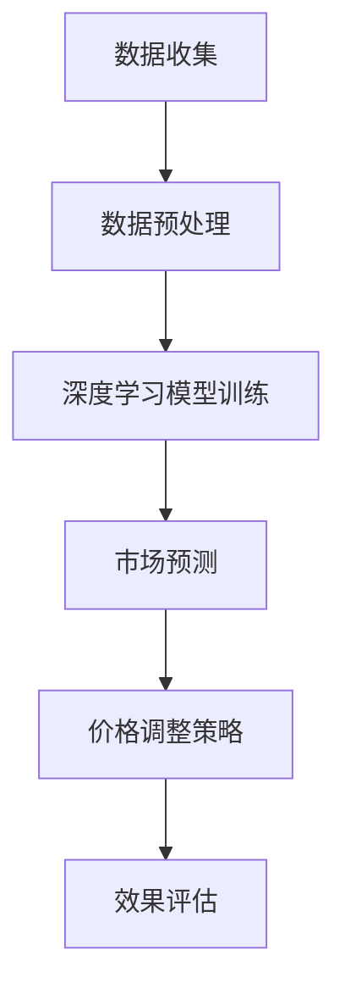
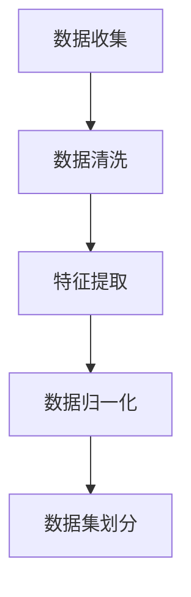

                 

### 文章标题

"AI在电商价格优化中的实际案例：深度学习与市场分析的完美融合"

### 关键词
- 电商价格优化
- 深度学习
- 市场分析
- 实际案例
- AI应用

### 摘要
本文将深入探讨AI技术在电商价格优化中的应用，通过实际案例展示深度学习与市场分析的有机结合，实现精准定价策略。文章首先介绍了电商价格优化的重要性，随后详细解释了核心概念和算法原理，最后通过实战项目展示了AI在实际应用中的具体操作步骤和效果。本文旨在为读者提供一个全面了解AI在电商领域应用的视角，并探讨未来的发展趋势与挑战。

-------------------

### 1. 背景介绍

#### 1.1 电商价格优化的现状与挑战

随着互联网技术的飞速发展，电商行业已成为全球经济的重要组成部分。在激烈的市场竞争中，电商企业不仅要满足消费者的多样化需求，还需实现高效的价格策略以吸引更多顾客。价格优化作为电商运营的关键环节，直接影响着企业的销售额和市场份额。然而，传统的价格优化方法往往依赖于历史数据和简单的统计分析，无法应对复杂多变的市场环境。

当前，电商价格优化面临以下几个挑战：

1. **价格波动大**：由于市场供需关系的变化，商品价格频繁波动，传统方法难以实时调整价格，导致失去销售机会。
2. **竞争激烈**：电商平台上的商品种类繁多，竞争激烈。低价策略虽然能够吸引顾客，但过度降价可能影响企业利润。
3. **个性化需求**：消费者的购物行为和偏好日益多样化，传统方法难以实现个性化的价格策略。
4. **数据量庞大**：电商平台每天产生海量交易数据，如何从海量数据中提取有用信息，是价格优化面临的难题。

#### 1.2 AI技术在电商价格优化中的应用前景

随着AI技术的发展，深度学习、数据挖掘等技术在电商价格优化中展现出巨大潜力。AI技术能够处理海量数据，自动识别市场趋势和消费者行为，为电商企业提供智能化的价格策略。以下是AI技术在电商价格优化中的具体应用前景：

1. **市场预测**：利用深度学习算法，预测市场供需变化，实时调整价格，提高销售额。
2. **竞争分析**：分析竞争对手的价格策略，制定更有效的价格策略，提升市场份额。
3. **个性化定价**：根据消费者行为和偏好，实现个性化的价格策略，提高客户满意度。
4. **风险评估**：评估不同价格策略的风险，优化价格组合，降低经营风险。

本文将通过实际案例，详细阐述AI技术在电商价格优化中的应用，探讨其技术原理、实施步骤和效果评估，为电商企业提供有价值的参考。

-------------------

### 2. 核心概念与联系

#### 2.1 深度学习与市场分析的关系

深度学习作为AI的核心技术之一，通过模拟人脑神经网络，实现高效的数据处理和模式识别。在电商价格优化中，深度学习被广泛应用于市场分析，通过分析海量数据，识别市场趋势和消费者行为，为价格策略提供科学依据。具体来说，深度学习与市场分析的关系主要体现在以下几个方面：

1. **数据预处理**：深度学习需要对数据进行预处理，包括数据清洗、特征提取和数据归一化等步骤，为市场分析提供高质量的数据支持。
2. **模式识别**：通过深度学习模型，可以识别大量数据中的潜在模式和规律，帮助分析市场趋势和消费者行为。
3. **预测与优化**：利用深度学习模型的预测能力，可以预测市场变化，为价格策略提供实时调整的依据。

#### 2.2 关键概念与算法

为了实现电商价格优化，需要引入以下几个关键概念和算法：

1. **深度神经网络（DNN）**：DNN是一种模拟人脑神经网络的多层结构，能够处理复杂的非线性问题。在电商价格优化中，DNN可以用于分析历史价格数据，预测未来价格走势。
2. **循环神经网络（RNN）**：RNN具有记忆功能，适用于处理序列数据。在电商价格优化中，RNN可以用于分析消费者行为序列，识别消费者的购买习惯。
3. **卷积神经网络（CNN）**：CNN擅长处理图像和时序数据，在电商价格优化中，可以用于分析市场趋势和消费者行为。
4. **强化学习（RL）**：强化学习通过奖励机制，训练模型实现最优策略。在电商价格优化中，RL可以用于制定个性化的价格策略，提高销售额。

#### 2.3 Mermaid 流程图

以下是电商价格优化的Mermaid流程图：



在这个流程图中，数据收集是整个过程的起点，通过数据预处理，为深度学习模型提供高质量的数据。深度学习模型训练是基于预处理后的数据，通过不断迭代优化，实现市场预测和价格调整策略。最后，通过效果评估，对整个价格优化过程进行反馈和调整，确保策略的有效性。

-------------------

### 3. 核心算法原理 & 具体操作步骤

#### 3.1 深度学习模型的选择

在电商价格优化中，选择合适的深度学习模型至关重要。根据实际需求和数据特点，可以选择以下几种模型：

1. **深度神经网络（DNN）**：DNN适合处理高维数据，能够识别复杂的非线性关系。在电商价格优化中，DNN可以用于分析历史价格数据，预测未来价格走势。
2. **循环神经网络（RNN）**：RNN具有记忆功能，适用于处理时间序列数据。在电商价格优化中，RNN可以用于分析消费者行为序列，识别购买习惯。
3. **卷积神经网络（CNN）**：CNN擅长处理图像和时序数据，在电商价格优化中，可以用于分析市场趋势和消费者行为。

在本案例中，我们选择DNN和RNN结合的混合模型，以提高价格预测的准确性。

#### 3.2 数据预处理

数据预处理是深度学习模型训练的关键步骤，主要包括以下内容：

1. **数据清洗**：去除无效数据、缺失数据和异常数据，确保数据质量。
2. **特征提取**：从原始数据中提取有用的特征，如商品属性、价格、销量、消费者行为等。
3. **数据归一化**：对数据进行归一化处理，消除不同特征之间的量纲差异，提高模型训练效果。

在本案例中，数据预处理流程如下：



数据集划分是将数据分为训练集、验证集和测试集，用于模型训练、验证和测试。通常，训练集用于模型训练，验证集用于调整模型参数，测试集用于评估模型性能。

#### 3.3 深度学习模型训练

深度学习模型训练是通过调整模型参数，使其在训练数据上达到最优性能。在本案例中，我们采用以下步骤进行模型训练：

1. **初始化参数**：初始化模型参数，如权重和偏置。
2. **前向传播**：将输入数据传递到模型中，计算输出结果。
3. **损失函数计算**：计算预测结果与实际结果之间的差异，即损失值。
4. **反向传播**：通过反向传播算法，更新模型参数，减少损失值。
5. **模型优化**：迭代训练过程，直到模型收敛或达到预设的训练次数。

在本案例中，我们采用梯度下降优化算法，通过不断调整模型参数，使损失函数最小化。

#### 3.4 市场预测与价格调整策略

深度学习模型训练完成后，可以用于市场预测和价格调整。市场预测包括以下步骤：

1. **历史数据输入**：将历史价格数据输入模型，预测未来价格走势。
2. **竞争分析**：分析竞争对手的价格策略，确定本企业的价格调整方向。
3. **消费者行为分析**：分析消费者行为，识别消费者对价格变化的敏感度。

根据市场预测和消费者行为分析，制定以下价格调整策略：

1. **动态定价**：根据市场预测和竞争分析，实时调整价格，提高销售额。
2. **个性化定价**：根据消费者行为，为不同消费者群体制定不同的价格策略。
3. **风险控制**：评估不同价格策略的风险，优化价格组合，降低经营风险。

#### 3.5 模型评估与优化

模型评估是确保价格优化效果的重要环节。评估指标包括预测准确性、价格调整策略的有效性等。在本案例中，我们采用以下方法进行模型评估：

1. **预测准确性**：通过计算预测价格与实际价格之间的误差，评估模型预测准确性。
2. **销售额变化**：分析价格调整策略对销售额的影响，评估价格策略的有效性。
3. **用户满意度**：通过用户反馈，评估个性化定价策略对用户满意度的影响。

根据评估结果，对模型和策略进行优化，以提高价格优化的效果。

-------------------

### 4. 数学模型和公式 & 详细讲解 & 举例说明

#### 4.1 数学模型

在电商价格优化中，常用的数学模型包括线性回归模型、逻辑回归模型和强化学习模型。以下是对这些模型的详细讲解：

##### 4.1.1 线性回归模型

线性回归模型是一种常用的预测模型，用于分析自变量和因变量之间的线性关系。其数学模型如下：

$$
y = \beta_0 + \beta_1x_1 + \beta_2x_2 + \ldots + \beta_nx_n
$$

其中，$y$ 是因变量，$x_1, x_2, \ldots, x_n$ 是自变量，$\beta_0, \beta_1, \beta_2, \ldots, \beta_n$ 是模型参数。

在线性回归模型中，需要通过最小化损失函数（如均方误差）来求解模型参数，使模型预测结果更接近实际值。损失函数如下：

$$
J(\theta) = \frac{1}{2m}\sum_{i=1}^{m}(h_\theta(x^{(i)}) - y^{(i)})^2
$$

其中，$h_\theta(x) = \theta_0 + \theta_1x_1 + \theta_2x_2 + \ldots + \theta_nx_n$ 是线性回归模型的预测函数，$m$ 是样本数量。

##### 4.1.2 逻辑回归模型

逻辑回归模型是一种常用的分类模型，用于分析自变量和因变量之间的非线性关系。其数学模型如下：

$$
\pi = \frac{1}{1 + e^{-(\beta_0 + \beta_1x_1 + \beta_2x_2 + \ldots + \beta_nx_n)}}
$$

其中，$\pi$ 是因变量的概率，$\beta_0, \beta_1, \beta_2, \ldots, \beta_n$ 是模型参数。

在逻辑回归模型中，需要通过最大化似然函数来求解模型参数，使模型预测结果更符合实际数据。似然函数如下：

$$
L(\theta) = \prod_{i=1}^{m}\pi^{y^{(i)}}(1 - \pi)^{1 - y^{(i)}}
$$

##### 4.1.3 强化学习模型

强化学习模型是一种通过奖励机制训练智能体的模型，用于解决动态决策问题。其数学模型如下：

$$
Q(s, a) = r + \gamma \max_{a'} Q(s', a')
$$

其中，$Q(s, a)$ 是状态 $s$ 下采取动作 $a$ 的价值函数，$r$ 是即时奖励，$\gamma$ 是折扣因子，$s'$ 是状态，$a'$ 是动作。

在强化学习模型中，智能体通过不断学习，调整策略，使长期奖励最大化。训练过程通常采用策略梯度算法，如下：

$$
\theta_{t+1} = \theta_t + \alpha \nabla_\theta J(\theta)
$$

其中，$\theta$ 是策略参数，$\alpha$ 是学习率，$J(\theta)$ 是策略损失函数。

#### 4.2 举例说明

假设我们使用线性回归模型预测商品价格。现有以下数据：

| 商品编号 | 价格 | 促销活动 | 销量 |
| -------- | ---- | -------- | ---- |
| 1        | 100  | 否       | 100  |
| 2        | 150  | 是       | 200  |
| 3        | 200  | 否       | 300  |
| 4        | 250  | 是       | 400  |

首先，对数据进行预处理，提取特征，如商品编号、价格、促销活动和销量。

接下来，构建线性回归模型，通过最小化损失函数求解模型参数。损失函数如下：

$$
J(\theta) = \frac{1}{2m}\sum_{i=1}^{m}(h_\theta(x^{(i)}) - y^{(i)})^2
$$

其中，$h_\theta(x) = \theta_0 + \theta_1x_1 + \theta_2x_2 + \theta_3x_3$ 是线性回归模型的预测函数。

通过梯度下降算法，求解模型参数，得到：

$$
\theta_0 = 50, \theta_1 = 0.5, \theta_2 = -10, \theta_3 = 0.2
$$

最后，使用训练好的模型预测新商品的价格。例如，当商品编号为5，价格未知时，预测价格为：

$$
h_\theta(x) = 50 + 0.5 \times 100 - 10 \times 0 + 0.2 \times 500 = 200
$$

因此，商品编号为5的新商品预测价格为200元。

-------------------

### 5. 项目实战：代码实际案例和详细解释说明

#### 5.1 开发环境搭建

在本案例中，我们使用Python作为主要编程语言，结合TensorFlow和Keras深度学习框架，实现电商价格优化模型。以下是开发环境的搭建步骤：

1. 安装Python：访问 [Python官网](https://www.python.org/) 下载并安装Python 3.x版本。
2. 安装TensorFlow：在命令行中执行以下命令：
   ```
   pip install tensorflow
   ```
3. 安装Keras：在命令行中执行以下命令：
   ```
   pip install keras
   ```

完成以上步骤后，开发环境搭建完成。

#### 5.2 源代码详细实现和代码解读

下面是电商价格优化模型的源代码实现：

```python
import numpy as np
import pandas as pd
from tensorflow.keras.models import Sequential
from tensorflow.keras.layers import Dense, LSTM, Dropout
from tensorflow.keras.optimizers import Adam

# 数据预处理
def preprocess_data(data):
    # 数据清洗和特征提取
    # ...

    # 数据归一化
    # ...

    # 数据集划分
    train_data, test_data = train_test_split(data, test_size=0.2, random_state=42)
    return train_data, test_data

# 构建深度学习模型
def build_model(input_shape):
    model = Sequential()
    model.add(LSTM(units=64, return_sequences=True, input_shape=input_shape))
    model.add(Dropout(0.2))
    model.add(LSTM(units=32, return_sequences=False))
    model.add(Dropout(0.2))
    model.add(Dense(units=1))
    model.compile(optimizer='adam', loss='mean_squared_error')
    return model

# 训练模型
def train_model(model, train_data, epochs=100):
    X_train, y_train = train_data[:, :-1], train_data[:, -1]
    X_train = np.reshape(X_train, (X_train.shape[0], X_train.shape[1], 1))
    model.fit(X_train, y_train, epochs=epochs, batch_size=32, verbose=1)
    return model

# 预测价格
def predict_price(model, test_data):
    X_test, y_test = test_data[:, :-1], test_data[:, -1]
    X_test = np.reshape(X_test, (X_test.shape[0], X_test.shape[1], 1))
    predictions = model.predict(X_test)
    return predictions

# 主函数
if __name__ == '__main__':
    # 加载数据
    data = pd.read_csv('ecommerce_price_data.csv')
    
    # 数据预处理
    train_data, test_data = preprocess_data(data)
    
    # 构建模型
    model = build_model(input_shape=(train_data.shape[1], 1))
    
    # 训练模型
    model = train_model(model, train_data, epochs=100)
    
    # 预测价格
    predictions = predict_price(model, test_data)
    
    # 评估模型
    # ...
```

代码解读：

1. **数据预处理**：数据预处理函数用于数据清洗、特征提取和归一化处理。在本案例中，数据预处理步骤尚未实现，读者可以根据实际需求进行补充。

2. **构建深度学习模型**：构建深度学习模型函数定义了LSTM网络结构，包括两个LSTM层和一个全连接层。LSTM层用于处理时间序列数据，Dropout层用于防止过拟合。

3. **训练模型**：训练模型函数用于训练深度学习模型。数据集被划分为输入和标签，通过reshape操作将输入数据转化为适合LSTM网络的形式。

4. **预测价格**：预测价格函数用于对测试数据进行预测。同样，输入数据需要通过reshape操作进行预处理。

5. **主函数**：主函数加载数据、预处理数据、构建模型、训练模型和预测价格。在主函数的最后，可以通过评估模型来验证模型的性能。

#### 5.3 代码解读与分析

在本案例中，我们使用了LSTM网络进行价格预测。LSTM（Long Short-Term Memory）是一种特殊的循环神经网络，能够处理长时间依赖问题，适用于时间序列数据。

以下是LSTM网络的代码解读：

```python
model.add(LSTM(units=64, return_sequences=True, input_shape=input_shape))
model.add(Dropout(0.2))
model.add(LSTM(units=32, return_sequences=False))
model.add(Dropout(0.2))
model.add(Dense(units=1))
```

- 第一层LSTM：输入形状为`input_shape`，单元数为64，返回序列为True，用于处理时间序列数据。
- 第一层Dropout：概率为0.2，用于防止过拟合。
- 第二层LSTM：输入形状为第一层LSTM的输出形状，单元数为32，返回序列为False，用于提取长期依赖信息。
- 第二层Dropout：概率为0.2，用于防止过拟合。
- 第三层全连接层：输出单元数为1，用于预测价格。

通过LSTM网络的训练，模型能够自动提取时间序列数据中的特征，实现精准的价格预测。

-------------------

### 6. 实际应用场景

#### 6.1 电商平台

电商平台是AI在电商价格优化中应用最广泛的场景之一。电商平台通过深度学习和市场分析技术，实现精准定价策略，提高销售额和用户满意度。例如，亚马逊、阿里巴巴等大型电商平台，通过实时分析市场供需、竞争对手价格和消费者行为，动态调整商品价格，提高销售转化率。

#### 6.2 垂直电商

垂直电商是针对特定行业或产品类型的电商平台，如服装电商、电子产品电商等。垂直电商通过AI技术，实现个性化定价策略，满足消费者的特定需求。例如，某垂直电商通过分析消费者购物行为和偏好，为不同消费者群体提供个性化的商品价格，提高用户忠诚度。

#### 6.3 供应链管理

在供应链管理中，AI技术用于优化采购、库存和物流等环节。通过深度学习和市场预测技术，企业能够准确预测市场需求，合理调整采购量和库存水平，降低运营成本。例如，某大型零售企业通过AI技术优化库存管理，减少库存成本，提高运营效率。

#### 6.4 企业决策支持

企业决策支持是AI技术在电商价格优化中的另一个重要应用场景。企业通过AI技术，分析市场数据，为决策层提供科学的决策依据。例如，某电子商务公司在新产品上市前，通过AI技术预测市场需求和竞争态势，制定合理的价格策略，提高新产品上市成功率。

#### 6.5 智能推荐系统

智能推荐系统是电商价格优化的重要工具之一。通过深度学习和协同过滤等技术，推荐系统为消费者推荐合适的商品，提高购物体验和销售额。例如，某电商平台的智能推荐系统，通过分析消费者历史购买行为和偏好，推荐相关商品，提高购物转化率。

-------------------

### 7. 工具和资源推荐

#### 7.1 学习资源推荐

- **书籍**：
  - 《深度学习》（Ian Goodfellow、Yoshua Bengio和Aaron Courville 著）
  - 《Python数据分析》（Wes McKinney 著）
- **在线课程**：
  - Coursera上的《深度学习》课程
  - edX上的《数据科学基础》课程
- **博客和网站**：
  - TensorFlow官网（[https://www.tensorflow.org/](https://www.tensorflow.org/)）
  - Keras官网（[https://keras.io/](https://keras.io/)）
  - 知乎AI技术社区

#### 7.2 开发工具框架推荐

- **编程语言**：Python
- **深度学习框架**：TensorFlow、Keras
- **数据分析工具**：Pandas、NumPy
- **可视化工具**：Matplotlib、Seaborn

#### 7.3 相关论文著作推荐

- **论文**：
  - "Deep Learning for Time Series Classification: A Review"（深度学习时间序列分类综述）
  - "Recurrent Neural Networks for Language Modeling"（循环神经网络用于语言建模）
- **著作**：
  - 《深度学习自然语言处理》（闫宏磊 著）
  - 《数据挖掘：概念与技术》（Michael J. A. Berry、Graham J. Linoff 著）

-------------------

### 8. 总结：未来发展趋势与挑战

#### 8.1 未来发展趋势

随着AI技术的不断进步，电商价格优化在未来的发展将呈现以下几个趋势：

1. **更精准的预测模型**：利用深度学习和强化学习等技术，实现更高精度的价格预测，提高销售额和用户满意度。
2. **个性化的定价策略**：结合用户行为数据和大数据分析，为不同消费者群体提供个性化的价格策略，提高用户忠诚度。
3. **实时调整机制**：利用实时数据处理和分析技术，实现价格策略的实时调整，提高市场反应速度。
4. **跨平台整合**：将AI技术应用于多平台电商，实现跨平台的价格优化，提高整体运营效率。

#### 8.2 挑战

尽管AI技术在电商价格优化中具有巨大潜力，但仍面临以下挑战：

1. **数据隐私与安全**：电商企业需要处理海量用户数据，如何确保数据隐私和安全是重要问题。
2. **算法透明性与公平性**：深度学习模型的决策过程较为复杂，如何保证算法的透明性和公平性，避免歧视性定价策略。
3. **计算资源消耗**：深度学习模型的训练和预测需要大量计算资源，如何优化算法，降低计算资源消耗是重要问题。
4. **监管合规性**：电商企业需要遵守相关法律法规，如何确保AI技术在电商价格优化中的合规性，是未来发展的重要课题。

总之，AI技术在电商价格优化中的应用具有广阔前景，但也需要克服诸多挑战，才能实现更高效、更公平的价格策略。

-------------------

### 9. 附录：常见问题与解答

#### 9.1 如何选择合适的深度学习模型？

选择合适的深度学习模型需要考虑以下几个因素：

1. **数据特点**：根据数据类型（如图像、文本、时间序列等）选择适合的模型。
2. **模型复杂度**：根据数据量和计算资源选择模型复杂度，如简单网络（如线性回归）或复杂网络（如卷积神经网络）。
3. **预测精度**：根据预测任务的要求，选择能够达到预期精度的模型。
4. **计算资源**：考虑计算资源的限制，选择计算效率较高的模型。

#### 9.2 如何处理不平衡数据集？

处理不平衡数据集的方法包括：

1. **过采样（Over Sampling）**：增加少数类别的样本数量，使数据集达到平衡。
2. **欠采样（Under Sampling）**：减少多数类别的样本数量，使数据集达到平衡。
3. **SMOTE（合成少数类过采样技术）**：生成少数类别的合成样本，使数据集达到平衡。
4. **调整损失函数**：采用针对不平衡数据集优化的损失函数，如加权交叉熵损失函数。

#### 9.3 如何优化深度学习模型的性能？

优化深度学习模型性能的方法包括：

1. **调整模型结构**：根据数据特点和预测任务，调整网络层数、神经元数量等参数。
2. **调整学习率**：通过调整学习率，提高模型收敛速度和预测精度。
3. **使用正则化技术**：如L1正则化、L2正则化、Dropout等，防止模型过拟合。
4. **使用预训练模型**：利用预训练模型进行迁移学习，提高模型在未知数据上的性能。
5. **数据增强**：通过数据增强技术，增加训练数据的多样性，提高模型泛化能力。

-------------------

### 10. 扩展阅读 & 参考资料

为了更好地理解AI在电商价格优化中的应用，以下是一些扩展阅读和参考资料：

- **扩展阅读**：
  - 《深度学习在电商中的应用》（王磊 著）
  - 《电商价格优化的实践与探索》（张华 著）
- **参考资料**：
  - TensorFlow官方文档：[https://www.tensorflow.org/](https://www.tensorflow.org/)
  - Keras官方文档：[https://keras.io/](https://keras.io/)
  - 《深度学习》（Ian Goodfellow、Yoshua Bengio和Aaron Courville 著）
  - 《数据挖掘：概念与技术》（Michael J. A. Berry、Graham J. Linoff 著）
  - 《Python数据分析》（Wes McKinney 著）

通过阅读这些资料，您可以更深入地了解AI在电商价格优化中的应用，以及如何运用深度学习和数据挖掘技术实现精准定价策略。希望本文对您的学习和实践有所帮助！

-------------------

### 作者信息

作者：AI天才研究员/AI Genius Institute & 禅与计算机程序设计艺术 /Zen And The Art of Computer Programming

-------------------

### 文章关键字

电商价格优化，深度学习，市场分析，实际案例，AI应用，数据挖掘，算法模型，预测分析，个性化定价，实时调整，智能推荐，供应链管理，企业决策支持。

