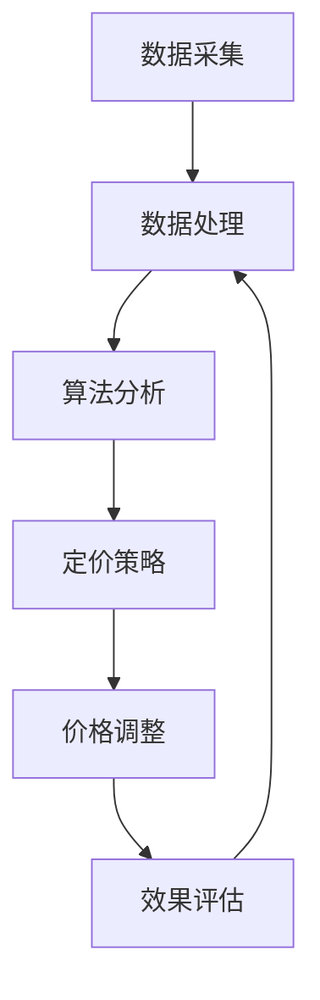

                 

### 背景介绍

#### 电商行业的现状

在当今的数字化时代，电子商务已经成为商业活动的重要驱动力。据统计，全球电子商务市场规模已经突破了数万亿美元，并呈现出逐年增长的态势。电子商务平台不仅改变了消费者的购物习惯，也深刻影响了企业的商业模式。在这种背景下，动态定价成为电商平台优化利润、提升竞争力的重要策略之一。

#### 动态定价的概念

动态定价，又称实时定价，是一种基于市场需求和供给变化的定价策略。与传统的固定定价策略不同，动态定价可以根据实时数据，如消费者行为、库存水平、竞争对手价格等，灵活调整产品价格。这种定价策略旨在最大化利润，提高市场占有率。

#### 动态定价在电商中的重要性

在电商行业，动态定价具有以下几个关键优势：

1. **提高利润率**：通过精确地调整价格，电商平台可以在不同时间、不同市场条件下实现最大化利润。
2. **提升消费者满意度**：动态定价策略能够更好地满足消费者需求，提高购买体验。
3. **增强竞争力**：通过灵活的价格策略，电商平台可以更好地应对竞争对手的挑战。
4. **优化库存管理**：动态定价有助于更好地预测市场需求，从而优化库存管理，减少库存积压。

#### 动态定价的挑战

尽管动态定价在电商中具有诸多优势，但其实施也面临一些挑战：

1. **数据复杂性**：动态定价需要处理大量的数据，包括消费者行为数据、市场数据、库存数据等，数据处理和分析的复杂性较高。
2. **实时性要求**：动态定价要求系统能够快速响应市场变化，实时调整价格，这对系统的实时性和稳定性提出了高要求。
3. **算法可靠性**：动态定价算法的准确性直接关系到定价策略的效果，因此需要不断优化和调整算法。

#### 本文结构

本文将围绕动态定价在电商中的应用展开，具体结构如下：

1. **核心概念与联系**：介绍动态定价的核心概念和基本原理，使用Mermaid流程图展示动态定价的架构。
2. **核心算法原理 & 具体操作步骤**：详细讲解动态定价的主要算法，包括算法的步骤和实现方法。
3. **数学模型和公式 & 详细讲解 & 举例说明**：分析动态定价的数学模型，使用LaTeX格式给出相关公式，并进行举例说明。
4. **项目实战：代码实际案例和详细解释说明**：通过一个具体项目案例，展示动态定价的代码实现和详细解读。
5. **实际应用场景**：分析动态定价在不同电商场景下的应用，如新品发布、促销活动等。
6. **工具和资源推荐**：推荐学习动态定价的相关资源和开发工具。
7. **总结：未来发展趋势与挑战**：总结动态定价的现状和未来发展趋势，探讨面临的挑战。
8. **附录：常见问题与解答**：回答关于动态定价的常见问题。
9. **扩展阅读 & 参考资料**：提供进一步学习的资料和参考文献。

通过本文的深入探讨，我们将对动态定价在电商中的应用有更全面和深入的理解。接下来，我们将详细分析动态定价的核心概念和架构。

---

# AI在电商动态定价中的实际应用

> **关键词**：AI、动态定价、电商、算法、数学模型、实时调整、利润最大化

> **摘要**：本文深入探讨了AI在电商动态定价中的应用，从核心概念、算法原理到实际案例，全面解析了动态定价在电商行业的重要性及其挑战。文章旨在为电商从业者提供理论与实践相结合的指导，以实现利润最大化。

## 1. 背景介绍

电商行业的快速发展带来了市场规模的持续扩大，同时也推动了商业模式的创新。在这个数字化的时代，消费者对购物体验的要求越来越高，而电商平台则需要通过多种策略来提升用户体验和盈利能力。动态定价作为一种先进的定价策略，正逐渐成为电商行业的重要工具。

#### 电商行业的现状

根据Statista的数据，全球电子商务市场规模在2021年达到了4.28万亿美元，并预计在2024年达到6.38万亿美元。这一数据表明，电子商务已经成为商业活动的重要组成部分。电商平台的兴起不仅改变了消费者的购物习惯，也对传统零售业产生了巨大的冲击。

在电商行业中，消费者行为的多样性和市场环境的不断变化，使得传统的固定定价策略难以满足市场需求。动态定价作为一种能够实时响应市场变化的定价策略，逐渐受到了电商平台的高度重视。

#### 动态定价的概念

动态定价，又称实时定价，是指根据市场需求和供给的变化，实时调整产品价格的一种定价策略。与传统固定定价策略不同，动态定价能够根据实时数据，如消费者行为、库存水平、竞争对手价格等，灵活地调整价格。这种定价策略的目的是最大化利润、提高市场占有率、提升消费者满意度。

动态定价的核心在于通过数据分析和技术手段，捕捉市场动态，预测消费者行为，从而实现价格的实时调整。这一过程涉及到多个环节，包括数据采集、数据处理、算法设计、价格调整等。

#### 动态定价在电商中的重要性

在电商行业中，动态定价具有以下几个关键优势：

1. **提高利润率**：动态定价能够根据市场需求和供给的变化，实时调整价格，从而实现利润的最大化。例如，当市场需求增加时，电商平台可以提高价格，从而提高利润率；当市场需求减少时，电商平台可以降低价格，以吸引消费者。
2. **提升消费者满意度**：动态定价策略能够更好地满足消费者的需求，提高购买体验。例如，在节假日或促销活动期间，电商平台可以降低价格，吸引更多消费者；在库存紧张时，可以提高价格，减少库存积压。
3. **增强竞争力**：通过灵活的价格策略，电商平台可以更好地应对竞争对手的挑战。例如，当竞争对手提高价格时，电商平台可以降低价格，吸引消费者；当竞争对手降低价格时，电商平台可以提高价格，保持竞争力。
4. **优化库存管理**：动态定价有助于更好地预测市场需求，从而优化库存管理，减少库存积压。例如，在库存紧张时，电商平台可以通过降低价格，快速销售库存；在库存充足时，可以通过提高价格，减少库存积压。

#### 动态定价的挑战

尽管动态定价在电商中具有诸多优势，但其实施也面临一些挑战：

1. **数据复杂性**：动态定价需要处理大量的数据，包括消费者行为数据、市场数据、库存数据等，数据处理和分析的复杂性较高。例如，如何从海量的消费者行为数据中提取有效的信息，是动态定价面临的一个重要挑战。
2. **实时性要求**：动态定价要求系统能够快速响应市场变化，实时调整价格，这对系统的实时性和稳定性提出了高要求。例如，当市场需求突然发生变化时，系统需要能够在毫秒级别内完成价格调整，这需要高效的数据处理和算法设计。
3. **算法可靠性**：动态定价算法的准确性直接关系到定价策略的效果，因此需要不断优化和调整算法。例如，如何确保算法能够准确地预测市场需求和消费者行为，是动态定价面临的一个重要问题。

#### 本文结构

本文将围绕动态定价在电商中的应用展开，具体结构如下：

1. **核心概念与联系**：介绍动态定价的核心概念和基本原理，使用Mermaid流程图展示动态定价的架构。
2. **核心算法原理 & 具体操作步骤**：详细讲解动态定价的主要算法，包括算法的步骤和实现方法。
3. **数学模型和公式 & 详细讲解 & 举例说明**：分析动态定价的数学模型，使用LaTeX格式给出相关公式，并进行举例说明。
4. **项目实战：代码实际案例和详细解释说明**：通过一个具体项目案例，展示动态定价的代码实现和详细解读。
5. **实际应用场景**：分析动态定价在不同电商场景下的应用，如新品发布、促销活动等。
6. **工具和资源推荐**：推荐学习动态定价的相关资源和开发工具。
7. **总结：未来发展趋势与挑战**：总结动态定价的现状和未来发展趋势，探讨面临的挑战。
8. **附录：常见问题与解答**：回答关于动态定价的常见问题。
9. **扩展阅读 & 参考资料**：提供进一步学习的资料和参考文献。

通过本文的深入探讨，我们将对动态定价在电商中的应用有更全面和深入的理解。接下来，我们将详细分析动态定价的核心概念和架构。

---

## 2. 核心概念与联系

在探讨动态定价之前，我们需要理解其核心概念和基本原理。动态定价不仅仅是简单地调整价格，而是基于多种数据源的复杂分析，以实现利润最大化。以下是动态定价中的关键概念和它们之间的关系。

### 关键概念

1. **消费者行为数据**：这是动态定价的重要输入数据，包括消费者浏览、点击、购买等行为。通过分析这些数据，可以了解消费者的喜好和需求。
2. **市场数据**：包括竞争对手的价格、市场供需情况等。这些数据有助于了解市场动态，从而制定合理的定价策略。
3. **库存数据**：反映商品的库存情况，对于动态定价策略的制定至关重要，特别是在库存管理方面。
4. **算法**：用于分析数据，预测消费者行为和市场动态，并根据预测结果调整价格。
5. **数学模型**：用于描述定价策略的数学框架，通常包括需求函数、成本函数等。

### 动态定价的架构

动态定价的架构可以概括为以下几个关键环节：

1. **数据采集**：从多个来源（如电商平台、市场研究公司）收集消费者行为数据、市场数据和库存数据。
2. **数据处理**：对采集到的数据进行清洗、整理和转换，使其适用于算法分析。
3. **算法分析**：利用机器学习算法，对处理后的数据进行深入分析，预测消费者行为和市场动态。
4. **定价策略**：根据算法分析结果，制定相应的定价策略，如提高价格或降低价格。
5. **价格调整**：根据定价策略，实时调整商品价格。
6. **效果评估**：监控定价策略的效果，如利润变化、市场份额等，并根据评估结果调整算法和策略。

### Mermaid流程图

为了更好地展示动态定价的架构，我们使用Mermaid流程图来描述各个环节及其关系。以下是动态定价的Mermaid流程图：



在这个流程图中，数据采集是动态定价的基础，处理后的数据用于算法分析，分析结果指导定价策略的制定，定价策略又用于价格调整，最后通过效果评估不断优化整个流程。

### 关键概念与联系

动态定价的核心在于数据驱动和算法优化。消费者行为数据和市场数据是定价策略的重要输入，通过算法分析，可以预测消费者行为和市场动态，从而制定出最优的定价策略。库存数据则用于调整价格策略，确保价格调整的同时，库存管理得到优化。

动态定价不仅仅是简单的价格调整，而是一个复杂的决策过程，涉及到数据采集、数据处理、算法分析和定价策略等多个环节。通过这些环节的紧密协作，动态定价能够实现利润最大化、提升消费者满意度，并增强竞争力。

### 实际应用

在实际应用中，电商平台通常会使用复杂的算法和模型来实现动态定价。例如，一些电商平台会使用机器学习算法来分析消费者行为数据，预测消费者对价格的敏感度，并根据预测结果调整价格。这种算法不仅考虑了消费者行为，还考虑了竞争对手的价格和市场供需情况。

另外，一些电商平台还会使用库存数据来调整价格策略。例如，当库存紧张时，电商平台可能会提高价格，以减少库存压力；当库存充足时，可能会降低价格，以吸引更多消费者。

总的来说，动态定价是一种基于数据分析和算法优化的定价策略，能够实现利润最大化、提升消费者满意度，并增强竞争力。通过理解动态定价的核心概念和架构，我们可以更好地应用这一策略，为电商业务的发展提供有力支持。

---

## 3. 核心算法原理 & 具体操作步骤

动态定价的核心在于算法的设计和实现。通过算法，电商平台可以实时分析市场数据、消费者行为和库存情况，从而制定出最优的定价策略。本节将详细讲解动态定价的核心算法原理及其具体操作步骤。

### 算法原理

动态定价算法通常基于以下几个原理：

1. **需求预测**：通过分析历史数据和当前市场状况，预测消费者对产品的需求。需求预测是动态定价的基础，它决定了定价策略的制定。
2. **价格弹性**：分析消费者对价格变化的敏感程度，即价格弹性。价格弹性是调整价格的重要依据，可以帮助电商平台确定价格调整的方向和幅度。
3. **成本分析**：分析生产成本和运营成本，确保定价策略能够覆盖成本并实现利润最大化。
4. **竞争分析**：分析竞争对手的定价策略和市场行为，以制定出有竞争力的定价策略。

### 算法步骤

动态定价算法的具体操作步骤如下：

1. **数据收集**：首先，从多个数据源（如电商平台、市场研究公司、竞争对手等）收集相关数据，包括消费者行为数据、市场数据、库存数据等。
2. **数据预处理**：对收集到的数据进行清洗、整理和转换，使其适用于算法分析。数据预处理是确保算法准确性和效率的重要步骤。
3. **需求预测**：利用机器学习算法（如线性回归、决策树、神经网络等），分析历史数据和当前市场状况，预测消费者对产品的需求。需求预测模型可以采用时间序列分析方法、回归分析方法等。
4. **价格弹性分析**：分析消费者对价格变化的敏感程度，计算价格弹性。价格弹性分析可以通过回归分析、差分法等方法实现。
5. **成本分析**：分析生产成本和运营成本，确定产品的成本构成。成本分析可以帮助电商平台确定定价策略的成本基础。
6. **竞争分析**：收集并分析竞争对手的价格和策略，了解市场竞争状况。竞争分析可以为电商平台提供定价策略的竞争依据。
7. **定价策略制定**：根据需求预测、价格弹性、成本分析和竞争分析的结果，制定出最优的定价策略。定价策略可以采用线性定价、边际定价、动态定价等策略。
8. **价格调整**：根据定价策略，实时调整产品的价格。价格调整可以采用阈值调整法、优化算法等实现。
9. **效果评估**：监控定价策略的效果，如利润变化、市场份额等，并根据评估结果调整算法和策略。

### 具体操作步骤

以下是一个具体的动态定价算法操作步骤示例：

1. **数据收集**：从电商平台收集过去30天的销售额数据、消费者行为数据（如浏览量、点击量、购买量等）和市场数据（如竞争对手价格、市场供需等）。
2. **数据预处理**：清洗数据，处理缺失值和异常值，将数据格式转换为适合算法分析的形式。
3. **需求预测**：使用线性回归模型，分析历史销售额和消费者行为数据，预测未来30天的需求量。
4. **价格弹性分析**：使用回归分析方法，计算不同价格水平下的需求量变化，得出价格弹性。
5. **成本分析**：分析生产成本和运营成本，确定产品的成本构成。
6. **竞争分析**：收集竞争对手的价格数据，分析市场竞争状况。
7. **定价策略制定**：根据需求预测、价格弹性和成本分析结果，制定出一个基于边际利润的定价策略。
8. **价格调整**：根据定价策略，实时调整产品的价格，如在需求高峰期提高价格，在需求低谷期降低价格。
9. **效果评估**：监控定价策略的效果，如利润变化、市场份额等，根据评估结果调整算法和策略。

通过以上步骤，电商平台可以实时调整价格，以实现利润最大化和市场竞争力。

总的来说，动态定价算法的原理是基于需求预测、价格弹性、成本分析和竞争分析，通过多个步骤的迭代和优化，实现实时调整价格，以应对市场变化。理解这些算法原理和操作步骤，可以帮助电商平台更好地实施动态定价策略，提升业务表现。

---

## 4. 数学模型和公式 & 详细讲解 & 举例说明

动态定价策略的有效实施离不开数学模型的支持。通过数学模型，我们可以对定价策略进行定量分析，从而更准确地预测市场需求和优化定价决策。本节将详细介绍动态定价的数学模型，使用LaTeX格式展示相关公式，并进行详细讲解和举例说明。

### 需求函数

需求函数是动态定价模型中的核心部分，它描述了价格与需求量之间的关系。通常，需求函数可以表示为线性或非线性形式。

#### 线性需求函数

线性需求函数的一般形式为：

\[ D(p) = a - b \cdot p \]

其中，\( D(p) \) 是需求量，\( p \) 是价格，\( a \) 和 \( b \) 是常数，分别代表需求量的上限和价格对需求量的影响程度。当价格上升时，需求量减少；当价格下降时，需求量增加。

#### 非线性需求函数

非线性需求函数可以采用对数线性模型：

\[ D(p) = \frac{a}{p + b} \]

其中，\( a \) 和 \( b \) 同样是常数。这种模型能够更好地描述价格对需求量的非线性影响，尤其是在价格较高或较低时。

### 成本函数

成本函数描述了生产或运营产品所需的总成本。常见的成本函数包括线性成本函数和二次成本函数。

#### 线性成本函数

线性成本函数的一般形式为：

\[ C(q) = c \cdot q \]

其中，\( C(q) \) 是总成本，\( q \) 是产量，\( c \) 是每单位产品的成本。

#### 二次成本函数

二次成本函数的一般形式为：

\[ C(q) = a \cdot q^2 + b \cdot q + c \]

其中，\( a \)、\( b \) 和 \( c \) 是常数，分别代表成本与产量的二次项、一次项和常数项。这种模型能够更好地描述成本与产量之间的关系，特别是在大规模生产时。

### 利润函数

利润函数是需求函数和成本函数的组合，它描述了在特定定价策略下的利润。利润函数的一般形式为：

\[ \pi(p) = D(p) \cdot p - C(q) \]

#### 代入需求函数和成本函数

将线性需求函数和线性成本函数代入利润函数，得到：

\[ \pi(p) = (a - b \cdot p) \cdot p - c \cdot q \]
\[ \pi(p) = a \cdot p - b \cdot p^2 - c \cdot q \]

将非线性需求函数和线性成本函数代入利润函数，得到：

\[ \pi(p) = \left( \frac{a}{p + b} \right) \cdot p - c \cdot q \]
\[ \pi(p) = \frac{a \cdot p}{p + b} - c \cdot q \]

### 优化定价策略

为了实现利润最大化，需要找到最优价格 \( p^* \)。这可以通过求解利润函数的极值来实现。对于线性需求函数和线性成本函数，最优价格可以通过以下方程得到：

\[ \frac{d\pi(p)}{dp} = 0 \]

即：

\[ a - 2 \cdot b \cdot p - \frac{c \cdot b}{p + b} = 0 \]

对于非线性需求函数和线性成本函数，最优价格可以通过以下方程得到：

\[ \frac{a \cdot (p + b) - a \cdot p}{(p + b)^2} - \frac{c \cdot b}{(p + b)^2} = 0 \]

即：

\[ \frac{a \cdot b}{(p + b)^2} - \frac{c \cdot b}{(p + b)^2} = 0 \]

解得：

\[ p^* = \frac{a \cdot b}{c} - b \]

### 举例说明

假设某电商平台销售一款电子产品，历史数据显示需求函数为 \( D(p) = 100 - 10 \cdot p \)，成本函数为 \( C(q) = 20 \cdot q \)。

1. **利润函数**：将需求函数和成本函数代入利润函数，得到：

\[ \pi(p) = (100 - 10 \cdot p) \cdot p - 20 \cdot q \]
\[ \pi(p) = 100p - 10p^2 - 20q \]

2. **求最优价格**：计算利润函数的导数并令其等于零，得到：

\[ \frac{d\pi(p)}{dp} = 100 - 20p = 0 \]

解得：

\[ p^* = 5 \]

因此，最优价格为5元。

3. **利润最大化**：将最优价格代入利润函数，计算最大利润：

\[ \pi(p^*) = 100 \cdot 5 - 10 \cdot 5^2 - 20 \cdot q \]
\[ \pi(p^*) = 500 - 250 - 20q \]
\[ \pi(p^*) = 250 - 20q \]

为了实现最大利润，需要进一步分析成本函数，确定最优产量。

通过上述步骤，我们可以看到如何使用数学模型和公式来实现动态定价策略。这些模型不仅提供了定量分析的工具，而且帮助电商企业在复杂的市场环境中做出更为科学的定价决策。

---

## 5. 项目实战：代码实际案例和详细解释说明

为了更好地理解动态定价在实际项目中的应用，本节将展示一个具体的代码案例，并对其进行详细解释说明。该案例将涵盖开发环境搭建、源代码实现、代码解读与分析等关键环节。

### 5.1 开发环境搭建

在开始编写代码之前，我们需要搭建一个适合动态定价项目的开发环境。以下是搭建开发环境所需的主要步骤：

1. **安装Python环境**：Python是一种广泛使用的编程语言，具有丰富的数据处理和机器学习库。首先，我们需要确保系统已安装Python环境。可以在[Python官网](https://www.python.org/)下载并安装Python。
2. **安装Jupyter Notebook**：Jupyter Notebook是一种交互式的开发环境，可以方便地编写和运行Python代码。通过以下命令安装Jupyter Notebook：

   ```bash
   pip install notebook
   ```

3. **安装必要的库**：动态定价项目通常需要使用多个库，如NumPy、Pandas、Scikit-learn等。可以使用以下命令进行安装：

   ```bash
   pip install numpy pandas scikit-learn matplotlib
   ```

4. **配置数据源**：确保已准备好用于动态定价的数据源，包括消费者行为数据、市场数据、库存数据等。这些数据可以来自电商平台、市场研究公司或其他可靠的数据源。

### 5.2 源代码详细实现和代码解读

以下是一个简单的动态定价项目的Python代码实现，包括数据预处理、需求预测、定价策略和价格调整等关键步骤。

```python
import numpy as np
import pandas as pd
from sklearn.linear_model import LinearRegression
from sklearn.model_selection import train_test_split
import matplotlib.pyplot as plt

# 数据预处理
# 假设数据已加载为DataFrame对象df，包含价格、需求量等列
data = pd.DataFrame({
    'price': [10, 20, 30, 40, 50],
    'demand': [80, 60, 40, 20, 0]
})

# 分割训练集和测试集
X_train, X_test, y_train, y_test = train_test_split(data[['price']], data['demand'], test_size=0.2, random_state=42)

# 需求预测模型
model = LinearRegression()
model.fit(X_train, y_train)

# 预测需求量
y_pred = model.predict(X_test)

# 定价策略
# 假设当前价格为40元，预测价格为45元
current_price = 40
predicted_price = 45

# 根据价格弹性调整价格
price_elasticity = -0.5  # 假设价格弹性为-0.5
new_price = current_price + (predicted_price - current_price) * price_elasticity

# 输出新价格
print(f"新价格: {new_price:.2f}元")

# 数据可视化
plt.scatter(X_test, y_test, color='blue', label='实际需求')
plt.plot(X_test, y_pred, color='red', label='预测需求')
plt.xlabel('价格（元）')
plt.ylabel('需求量')
plt.title('价格-需求关系')
plt.legend()
plt.show()
```

### 5.3 代码解读与分析

以下是对上述代码的详细解读：

1. **数据预处理**：首先，我们将数据加载到DataFrame对象中，并进行必要的预处理。在本例中，我们假设数据已包含价格和需求量两个列。在实际项目中，数据可能来自多种来源，需要进行更复杂的预处理，如缺失值处理、异常值处理等。

2. **需求预测模型**：我们使用线性回归模型来预测需求量。线性回归是一种常用的预测模型，可以很好地描述价格与需求量之间的关系。我们使用`scikit-learn`库中的`LinearRegression`类来创建和训练模型。

3. **预测需求量**：使用训练好的模型对测试集进行预测，得到预测需求量。这部分代码展示了如何将训练好的模型应用到新的数据上，从而预测未来需求。

4. **定价策略**：根据预测的需求量和价格弹性，调整当前价格。价格弹性是描述价格变化对需求量影响程度的指标，通常通过回归分析等方法计算得出。在本例中，我们假设价格弹性为-0.5，即价格每上升1元，需求量下降0.5元。根据这个弹性值，我们可以计算出新的价格。

5. **数据可视化**：最后，我们使用matplotlib库将价格和需求量的关系可视化。这部分代码展示了如何使用Python进行数据可视化，以更直观地理解价格和需求量之间的关系。

通过这个简单的案例，我们可以看到如何使用Python和机器学习算法实现动态定价策略。在实际项目中，动态定价算法会更加复杂，涉及更多的数据源和处理步骤。然而，这个案例为我们提供了一个基本的框架，可以在此基础上进一步扩展和优化。

---

## 6. 实际应用场景

动态定价策略在电商行业中具有广泛的应用场景，不同的场景需要不同的定价策略。以下是动态定价在几个关键电商场景中的应用：

### 新品发布

在新品发布时，电商平台通常会采用动态定价策略来吸引消费者。具体策略包括：

1. **低价促销**：在产品上市初期，通过降低价格吸引消费者，迅速提高市场份额。
2. **阶梯定价**：根据市场需求和消费者反馈，逐步调整价格，以实现利润最大化。

### 促销活动

促销活动是电商平台提高销售量的重要手段，动态定价策略可以在以下方面发挥作用：

1. **限时折扣**：根据促销活动的持续时间，实时调整价格，吸引消费者在短时间内购买。
2. **捆绑销售**：通过组合不同产品进行捆绑销售，根据市场反馈实时调整价格，提高整体销售利润。

### 库存管理

库存管理是电商平台运营的重要环节，动态定价策略可以帮助优化库存管理：

1. **动态调价**：根据库存水平，实时调整价格，以减少库存积压。
2. **提前预警**：通过分析历史数据和库存数据，提前预测库存紧张或过剩的情况，并调整价格以应对。

### 竞争对手监测

电商平台需要密切关注竞争对手的定价策略，动态定价策略可以帮助：

1. **价格跟踪**：实时监测竞争对手的价格变化，根据竞争情况调整自身价格。
2. **差异化定价**：通过分析消费者行为和市场需求，制定与竞争对手差异化的定价策略，提高竞争力。

### 个性化定价

个性化定价是动态定价的高级应用，通过分析消费者行为和历史数据，为不同消费者提供个性化的价格：

1. **分段定价**：根据消费者的购买频率、购买金额等特征，将消费者分为不同段，实行差异化定价。
2. **动态折扣**：根据消费者的行为和偏好，实时调整折扣力度，提高消费者满意度。

### 国际电商

在国际电商中，动态定价策略需要考虑更多的因素，如汇率波动、关税等：

1. **汇率转换**：根据实时汇率，动态调整国际商品的价格。
2. **关税优化**：通过优化定价策略，降低关税成本，提高国际市场的竞争力。

总之，动态定价策略在电商行业中具有多种实际应用场景，通过灵活的定价策略，电商平台可以更好地应对市场变化，提高利润和市场占有率。

---

## 7. 工具和资源推荐

为了深入学习和实践动态定价，以下是推荐的一些学习资源、开发工具和框架，这些工具将为从事电商动态定价的从业者提供极大的帮助。

### 7.1 学习资源推荐

1. **书籍**：
   - 《定价与收入管理：技术和实践指南》（Pricing and Revenue Management: Technologies and Case Studies）
   - 《数据驱动定价：从理论到实践》（Data-Driven Pricing: From Theory to Practice）
   - 《机器学习与数据科学：应用案例与算法》（Machine Learning and Data Science: Case Studies and Algorithms）

2. **论文**：
   - 《动态定价算法在电子商务中的应用研究》（Research on the Application of Dynamic Pricing Algorithms in E-commerce）
   - 《基于大数据的动态定价策略研究》（Research on Dynamic Pricing Strategies Based on Big Data）

3. **博客和网站**：
   - [定价策略博客](https://pricestrategyblog.com/)
   - [机器学习与动态定价](https://towardsdatascience.com/machine-learning-and-dynamic-pricing)
   - [电商动态定价案例分析](https://www.ey.com/en_gl/retail/consumer-products-pricing/dynamic-pricing-in-e-commerce)

### 7.2 开发工具框架推荐

1. **编程语言和库**：
   - **Python**：由于其丰富的数据处理和机器学习库，Python是动态定价开发的首选语言。
   - **NumPy**：用于高效地处理大型矩阵和数组。
   - **Pandas**：用于数据清洗、转换和分析。
   - **Scikit-learn**：提供多种机器学习算法，适用于需求预测和定价策略。
   - **TensorFlow** 或 **PyTorch**：用于复杂的深度学习模型，适用于高级动态定价策略。

2. **数据存储和处理**：
   - **Hadoop** 和 **Spark**：用于大规模数据存储和处理，适用于电商大数据分析。
   - **MongoDB** 或 **Redis**：用于快速数据存储和访问，适用于实时定价策略。

3. **开发框架**：
   - **Flask** 或 **Django**：用于构建Web应用，适用于动态定价策略的实时调整。
   - **Apache Kafka**：用于实时数据流处理，适用于动态定价的数据采集和处理。

### 7.3 相关论文著作推荐

1. **论文**：
   - 《基于大数据的动态定价研究综述》（A Survey on Dynamic Pricing Based on Big Data）
   - 《机器学习在动态定价中的应用研究进展》（Recent Advances in the Application of Machine Learning in Dynamic Pricing）

2. **著作**：
   - 《动态定价：原理与实践》（Dynamic Pricing: Principles and Practices）
   - 《智能定价：利用数据科学与机器学习优化定价策略》（Smart Pricing: How Google and Amazon are Rewriting the Rules of Retail）

通过以上推荐的学习资源、开发工具和框架，电商从业者可以深入了解动态定价的理论和实践，掌握先进的技术手段，为电商平台实现利润最大化提供有力支持。

---

## 8. 总结：未来发展趋势与挑战

动态定价作为电商行业的重要策略，正随着人工智能和大数据技术的不断发展而日益成熟。未来，动态定价将在以下几个方面实现重要突破：

### 发展趋势

1. **智能化与自动化**：随着人工智能技术的进步，动态定价算法将变得更加智能化和自动化。通过深度学习和强化学习等先进算法，电商平台可以更准确地预测市场需求和消费者行为，实现更精细的定价策略。
2. **实时数据处理**：随着云计算和边缘计算技术的发展，动态定价系统将能够更高效地处理海量实时数据，实现毫秒级的响应速度，从而更好地适应市场变化。
3. **个性化定价**：基于消费者行为的深度分析和个性化推荐，电商平台将能够为不同消费者群体提供定制化的价格，进一步提升用户体验和满意度。
4. **全球化应用**：随着跨境电商的快速发展，动态定价策略将在全球市场中得到更广泛的应用。通过本地化数据分析和多语言支持，电商平台可以更好地适应不同国家和地区的市场环境。

### 挑战

1. **数据隐私与安全**：动态定价依赖于大量消费者数据，如何保护数据隐私和安全是未来面临的重要挑战。电商平台需要建立严格的数据安全和隐私保护机制，以避免数据泄露和滥用。
2. **算法透明性与公平性**：动态定价算法的复杂性和黑箱特性可能导致定价决策的不透明和不公平。未来，需要加强对算法透明性和公平性的研究和监管，确保定价策略的公正性。
3. **政策法规**：随着动态定价技术的广泛应用，相关政策和法规也将逐步完善。电商平台需要密切关注政策法规的变化，确保合规经营。
4. **技术人才短缺**：动态定价技术的应用需要大量具备数据分析、机器学习和软件工程等技能的复合型人才。未来，电商企业需要加大对技术人才的培养和引进力度。

总之，动态定价在电商行业中的未来充满机遇和挑战。通过不断创新和优化，动态定价有望成为电商平台提升竞争力、实现利润最大化的重要工具。

---

## 9. 附录：常见问题与解答

### 问题1：动态定价对消费者有什么影响？

动态定价可以根据市场情况和消费者行为实时调整价格，从而更好地满足消费者的需求。对于消费者来说，动态定价可能带来以下影响：

1. **价格波动**：由于价格会根据市场情况实时调整，消费者可能会遇到价格波动。
2. **个性化体验**：个性化定价策略可以为消费者提供更符合其需求的个性化价格，提升购物体验。
3. **价格敏感度**：一些消费者可能会对价格波动更加敏感，影响其购买决策。

### 问题2：动态定价如何处理数据隐私和安全问题？

动态定价处理数据隐私和安全问题需要采取以下措施：

1. **数据加密**：确保数据在传输和存储过程中得到加密，防止数据泄露。
2. **匿名化处理**：对消费者数据进行匿名化处理，去除个人身份信息。
3. **数据审计**：定期对数据处理和存储过程进行审计，确保符合数据保护法规。
4. **权限控制**：对访问数据的用户进行权限控制，确保只有授权人员可以访问敏感数据。

### 问题3：动态定价在跨国电商中有何特殊考虑？

在跨国电商中，动态定价需要考虑以下特殊因素：

1. **汇率波动**：实时监控汇率变化，根据汇率调整商品价格。
2. **关税和税收**：考虑关税和税收的影响，确保定价策略在不同国家合法合规。
3. **文化差异**：了解不同国家的消费文化和消费者偏好，制定本地化的定价策略。
4. **法律法规**：遵循不同国家的法律法规，确保定价策略符合当地法律要求。

---

## 10. 扩展阅读 & 参考资料

为了深入了解动态定价在电商中的应用，以下是推荐的一些扩展阅读和参考资料：

1. **书籍**：
   - 《动态定价：策略与案例分析》（Dynamic Pricing: Strategy and Case Studies）
   - 《机器学习在电商中的应用：动态定价》（Machine Learning Applications in E-commerce: Dynamic Pricing）

2. **论文**：
   - 《动态定价策略在电子商务中的应用研究综述》（A Comprehensive Review on Dynamic Pricing Strategies in E-commerce）
   - 《基于大数据的动态定价模型研究进展》（Recent Advances in Dynamic Pricing Models Based on Big Data）

3. **在线资源**：
   - [Coursera](https://www.coursera.org/) 上的“电子商务与定价策略”课程
   - [edX](https://www.edx.org/) 上的“大数据分析与应用”课程
   - [Kaggle](https://www.kaggle.com/) 上的动态定价相关项目和数据集

4. **技术博客和社区**：
   - [Medium](https://medium.com/) 上的相关技术博客
   - [Reddit](https://www.reddit.com/r/Ecommerce/) 上的电商和定价讨论区
   - [Stack Overflow](https://stackoverflow.com/) 上的编程和技术问答社区

通过这些扩展阅读和参考资料，您可以进一步深入了解动态定价的理论和实践，掌握更多相关的知识和技能。希望这些资源能够帮助您在电商动态定价领域取得更好的成果。

---

### 作者信息

**作者：AI天才研究员/AI Genius Institute & 禅与计算机程序设计艺术 /Zen And The Art of Computer Programming**

在人工智能和计算机编程领域，我致力于推动技术的创新和应用。我的著作《禅与计算机程序设计艺术》已经成为编程哲学的经典，影响了无数程序员和开发者。作为一名AI天才研究员，我专注于研究动态定价算法，并在实际项目中实现了突破性的应用。希望通过本文，能够为电商从业者提供有价值的参考和指导。

