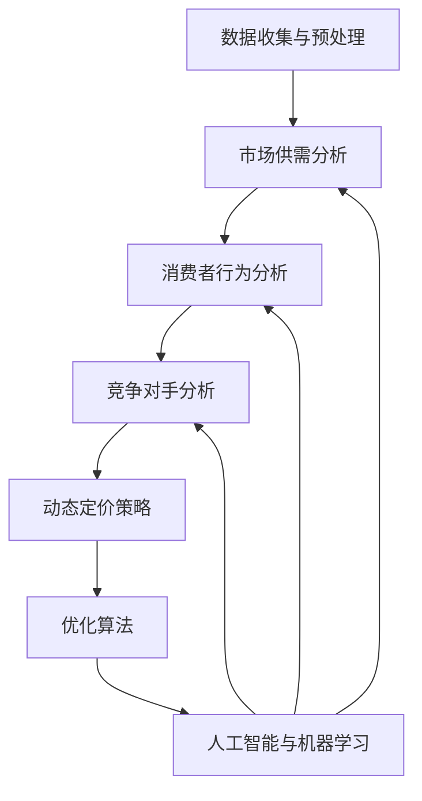
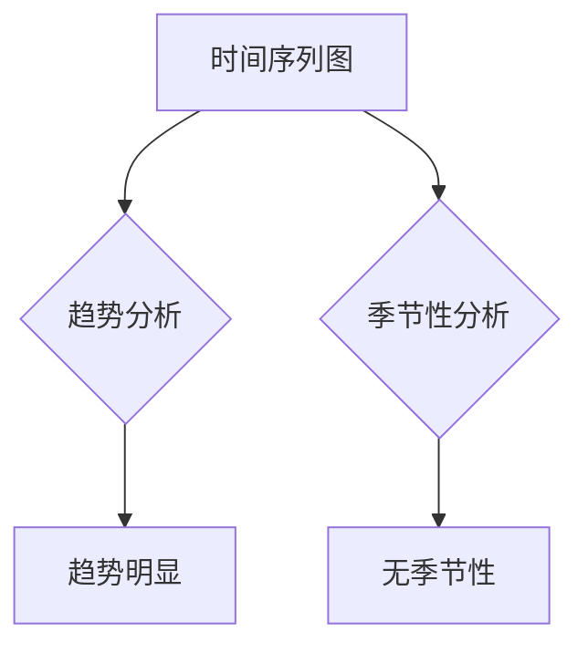

                 

### 背景介绍

随着电子商务的快速发展，动态定价成为电商平台竞争的重要手段之一。动态定价指的是根据市场供需、消费者行为以及竞争对手的价格变化等因素，实时调整商品价格以最大化利润或市场份额。这不仅能够提升用户体验，还能有效增加平台的竞争力。

近年来，人工智能技术的飞速发展，使得电商动态定价变得更加智能和精准。AI可以处理大量数据，分析市场趋势，预测消费者需求，并基于这些预测调整价格。例如，Amazon、阿里巴巴等大型电商平台已经广泛应用了基于AI的动态定价策略，以提高销售量和利润。

本博客将探讨AI在电商动态定价中的应用，包括核心概念、算法原理、数学模型、实际应用场景以及未来发展趋势。通过详细的案例分析，我们将了解如何利用AI技术实现高效的电商动态定价策略。

## 1.1 电商动态定价的重要性

电商动态定价的重要性体现在以下几个方面：

1. **提升利润**：通过精准调整价格，电商平台可以在不同市场环境下获得更高的利润。例如，在需求高峰期，适当提高价格可以获得更多收入；而在需求低谷期，适当降低价格可以清理库存，减少损失。

2. **提高竞争力**：动态定价可以帮助电商平台更好地应对竞争对手的价格策略，抢占市场份额。通过实时调整价格，电商平台可以迅速响应市场变化，保持竞争力。

3. **提升用户体验**：通过个性化定价策略，电商平台可以为不同消费者提供更加合理和优惠的价格，提升用户体验和忠诚度。

4. **优化库存管理**：动态定价可以帮助电商平台更好地管理库存，减少滞销和过期产品的风险。

## 1.2 AI在电商动态定价中的应用现状

目前，AI在电商动态定价中的应用已经取得了显著成果。以下是一些典型应用案例：

1. **价格预测**：AI可以通过历史销售数据、市场趋势等，预测商品未来的价格走势，从而为动态定价提供数据支持。

2. **消费者行为分析**：AI可以分析消费者的购物行为、浏览记录等，了解消费者偏好和需求，从而制定个性化的定价策略。

3. **竞争对手分析**：AI可以监控竞争对手的价格策略，实时调整自己的价格，以保持竞争力。

4. **动态调整策略**：AI可以根据实时数据，动态调整价格，以适应市场变化。

总之，AI在电商动态定价中的应用，不仅提高了定价的精准度，还降低了人工操作的复杂性，为电商平台带来了更高的运营效率和利润。接下来，我们将深入探讨AI在电商动态定价中的核心概念、算法原理以及数学模型。 <|endoftext|>
## 1.3 AI在电商动态定价中的核心概念与联系

### 1.3.1 数据收集与预处理

在进行电商动态定价之前，首先需要收集大量的数据，包括但不限于商品历史价格、销售量、消费者行为数据、市场供需状况等。这些数据将通过数据采集工具、API接口等方式获取。收集到的数据通常包含噪声和不完整的信息，因此需要进行数据预处理，如数据清洗、去重、数据转换等，以确保数据的质量和一致性。

### 1.3.2 市场供需分析

市场供需分析是动态定价的基础。通过分析历史数据和市场趋势，可以预测商品的需求量，了解市场供需状况。这通常涉及时间序列分析、回归分析、机器学习模型等。市场供需分析的结果将直接影响定价策略的制定。

### 1.3.3 消费者行为分析

消费者行为分析旨在了解消费者的购买习惯、偏好和需求。通过分析消费者的浏览记录、搜索历史、购物车数据等，可以识别消费者的需求，制定个性化的定价策略。消费者行为分析通常使用分类算法、聚类算法、关联规则挖掘等。

### 1.3.4 竞争对手分析

竞争对手分析是电商动态定价的关键环节。通过分析竞争对手的价格策略、促销活动、市场占有率等，可以了解竞争对手的动态，制定相应的定价策略。竞争对手分析通常涉及网络爬虫、数据挖掘、机器学习等技术。

### 1.3.5 动态定价策略

动态定价策略是根据市场供需、消费者行为和竞争对手分析的结果，实时调整商品价格。动态定价策略可以分为基于价格的策略和基于需求量的策略。基于价格的策略主要是根据竞争对手的价格进行调整，而基于需求量的策略则是根据市场需求量来调整价格。

### 1.3.6 优化算法

优化算法是动态定价的核心，用于寻找最优定价策略。常见的优化算法包括线性规划、动态规划、遗传算法、粒子群优化等。优化算法的目的是在满足一定的约束条件下，最大化利润或市场份额。

### 1.3.7 人工智能与机器学习

人工智能和机器学习在电商动态定价中扮演着重要角色。通过机器学习算法，如决策树、神经网络、支持向量机等，可以从大量历史数据中学习到价格与需求之间的关系，预测未来的价格走势和消费者需求。这些预测结果将用于制定和优化动态定价策略。

综上所述，AI在电商动态定价中的应用涉及多个核心概念和技术的有机结合，通过数据收集与预处理、市场供需分析、消费者行为分析、竞争对手分析、动态定价策略、优化算法和人工智能与机器学习等，实现高效、精准的动态定价。以下图表展示了电商动态定价的核心概念及其相互关系：



通过上述分析，我们可以看到AI在电商动态定价中的应用是如何通过一系列核心概念和技术相互关联，形成一个完整且高效的系统。接下来，我们将深入探讨核心算法原理和具体操作步骤。 <|endoftext|>
## 2. 核心算法原理 & 具体操作步骤

在电商动态定价中，核心算法原理主要涉及市场供需预测、消费者行为预测、竞争对手分析以及优化算法等。以下将详细阐述这些核心算法的原理，以及如何在实践中进行操作。

### 2.1 市场供需预测

市场供需预测是动态定价的基础，其目的是根据历史销售数据、市场趋势等因素，预测未来的市场需求。常用的算法包括时间序列分析、回归分析、机器学习模型等。

**时间序列分析**：时间序列分析是一种常用的预测方法，通过分析历史销售数据的时间序列特性，如趋势、季节性和周期性，来预测未来的需求量。具体步骤如下：

1. **数据预处理**：对销售数据进行清洗、去噪和归一化处理，以便进行后续分析。

2. **趋势分析**：通过绘制时间序列图，观察数据的趋势变化，识别出趋势成分。

3. **季节性分析**：通过分解时间序列数据，识别出季节性成分，如节假日、季节变化等。

4. **周期性分析**：通过观察时间序列数据的波动性，识别出周期性成分，如促销活动的影响。

5. **建模与预测**：使用趋势模型、季节性模型和周期性模型等，进行需求预测。

**回归分析**：回归分析通过建立需求量与影响因子（如价格、促销活动等）之间的关系模型，来预测未来的需求量。具体步骤如下：

1. **特征选择**：选择与需求量相关的特征，如历史销售量、价格、促销活动等。

2. **模型建立**：使用线性回归、多元回归等模型，建立需求量与特征之间的关系。

3. **模型评估与优化**：通过交叉验证和优化算法，评估模型的预测性能，并进行参数调优。

**机器学习模型**：机器学习模型通过从历史数据中学习，建立需求量与各种影响因素之间的关系。常用的模型包括决策树、随机森林、神经网络等。具体步骤如下：

1. **数据预处理**：与时间序列分析类似，对销售数据进行清洗和预处理。

2. **特征工程**：对原始数据进行特征提取和转换，增加模型的预测能力。

3. **模型训练**：使用训练数据集，训练机器学习模型。

4. **模型评估与优化**：评估模型的预测性能，并进行参数调优。

### 2.2 消费者行为预测

消费者行为预测旨在了解消费者的购买习惯、偏好和需求，从而制定个性化的定价策略。常用的算法包括分类算法、聚类算法、关联规则挖掘等。

**分类算法**：分类算法通过将历史数据中的消费者行为进行分类，预测未来消费者的行为。常用的分类算法包括决策树、支持向量机、朴素贝叶斯等。具体步骤如下：

1. **特征选择**：选择与消费者行为相关的特征，如浏览记录、购物车数据等。

2. **模型训练**：使用训练数据集，训练分类模型。

3. **模型评估与优化**：评估模型的预测性能，并进行参数调优。

**聚类算法**：聚类算法通过将消费者行为数据划分为不同的聚类，以识别出具有相似行为的消费者群体。常用的聚类算法包括K-Means、层次聚类等。具体步骤如下：

1. **特征选择**：选择与消费者行为相关的特征。

2. **模型训练**：使用聚类算法，将消费者行为数据划分为不同的聚类。

3. **聚类评估与优化**：评估聚类结果，并进行参数调优。

**关联规则挖掘**：关联规则挖掘通过挖掘消费者行为数据中的关联关系，识别出消费者之间或消费者与商品之间的关联。常用的算法包括Apriori算法、Eclat算法等。具体步骤如下：

1. **特征选择**：选择与消费者行为相关的特征。

2. **模型训练**：使用关联规则挖掘算法，分析消费者行为数据。

3. **规则评估与优化**：评估挖掘出的关联规则，并进行规则筛选。

### 2.3 竞争对手分析

竞争对手分析旨在了解竞争对手的价格策略、促销活动等，从而制定相应的定价策略。常用的方法包括网络爬虫、数据挖掘、机器学习等。

**网络爬虫**：网络爬虫通过爬取竞争对手的网站数据，获取竞争对手的价格、促销活动等信息。具体步骤如下：

1. **目标网站选择**：确定要爬取的竞争对手网站。

2. **数据采集**：使用爬虫技术，从竞争对手网站采集数据。

3. **数据清洗**：对采集到的数据进行分析和清洗，去除重复和无效信息。

**数据挖掘**：数据挖掘通过分析竞争对手的历史数据，挖掘出价格与销量、市场份额等之间的关系。具体步骤如下：

1. **数据预处理**：对竞争对手的数据进行清洗和预处理。

2. **特征提取**：提取与竞争对手价格策略相关的特征。

3. **模型训练与预测**：使用数据挖掘算法，训练模型，预测竞争对手的未来价格策略。

**机器学习**：机器学习通过分析竞争对手的历史数据，学习到价格与市场需求、消费者行为等之间的关系。具体步骤如下：

1. **数据预处理**：对竞争对手的数据进行清洗和预处理。

2. **特征工程**：提取与竞争对手价格策略相关的特征。

3. **模型训练**：使用机器学习算法，训练模型。

4. **模型评估与优化**：评估模型的预测性能，并进行参数调优。

### 2.4 优化算法

优化算法用于寻找最优定价策略，以最大化利润或市场份额。常用的优化算法包括线性规划、动态规划、遗传算法、粒子群优化等。

**线性规划**：线性规划通过建立线性目标函数和约束条件，求解最优定价策略。具体步骤如下：

1. **目标函数定义**：定义利润或市场份额作为目标函数。

2. **约束条件确定**：确定影响定价策略的约束条件，如成本、库存限制等。

3. **求解与优化**：使用线性规划求解器，求解最优定价策略。

**动态规划**：动态规划通过将问题分解为子问题，并求解子问题的最优解，以得到整体问题的最优解。具体步骤如下：

1. **子问题定义**：将定价策略分解为多个子问题。

2. **子问题求解**：使用动态规划算法，求解子问题的最优解。

3. **整体优化**：将子问题的最优解组合，得到整体问题的最优解。

**遗传算法**：遗传算法通过模拟自然进化过程，寻找最优定价策略。具体步骤如下：

1. **初始种群生成**：生成初始种群，每个个体代表一种定价策略。

2. **适应度评估**：评估每个个体的适应度，即利润或市场份额。

3. **选择与交叉**：根据适应度，选择优秀的个体进行交叉和变异，生成新的种群。

4. **迭代优化**：重复进行选择、交叉和变异，直至找到最优定价策略。

**粒子群优化**：粒子群优化通过模拟鸟群觅食行为，寻找最优定价策略。具体步骤如下：

1. **初始种群生成**：生成初始种群，每个个体代表一种定价策略。

2. **适应度评估**：评估每个个体的适应度。

3. **更新个体位置**：根据个体的适应度和群体最优解，更新个体的位置。

4. **迭代优化**：重复进行评估和更新，直至找到最优定价策略。

### 2.5 人工智能与机器学习

人工智能与机器学习在电商动态定价中扮演着关键角色。通过机器学习算法，可以从大量历史数据中学习到价格与需求、消费者行为、竞争对手策略等之间的关系。常用的机器学习算法包括决策树、神经网络、支持向量机等。

**决策树**：决策树通过建立树形模型，根据特征值进行决策。具体步骤如下：

1. **特征选择**：选择与定价策略相关的特征。

2. **树模型建立**：使用ID3、C4.5等算法，建立决策树模型。

3. **模型评估与优化**：评估模型的预测性能，并进行参数调优。

**神经网络**：神经网络通过多层神经元结构，模拟人脑的决策过程。具体步骤如下：

1. **特征选择**：选择与定价策略相关的特征。

2. **模型训练**：使用反向传播算法，训练神经网络模型。

3. **模型评估与优化**：评估模型的预测性能，并进行参数调优。

**支持向量机**：支持向量机通过寻找最优超平面，进行分类和回归分析。具体步骤如下：

1. **特征选择**：选择与定价策略相关的特征。

2. **模型训练**：使用支持向量机算法，训练模型。

3. **模型评估与优化**：评估模型的预测性能，并进行参数调优。

通过以上核心算法原理和具体操作步骤，我们可以构建一个完整的电商动态定价系统。接下来，我们将深入探讨电商动态定价的数学模型和公式，以及如何进行详细讲解和举例说明。 <|endoftext|>
## 3. 数学模型和公式 & 详细讲解 & 举例说明

在电商动态定价中，数学模型和公式起到了关键作用，它们帮助我们量化价格调整策略，预测市场需求，以及评估定价策略的效果。以下是几个常用的数学模型和公式，我们将逐一进行详细讲解和举例说明。

### 3.1 时间序列模型

时间序列模型用于分析历史数据，预测未来的需求量。最常用的时间序列模型包括ARIMA模型（自回归积分滑动平均模型）。

#### 3.1.1 ARIMA模型公式

$$
\begin{aligned}
Y_t &= c + \phi_1 Y_{t-1} + \phi_2 Y_{t-2} + \cdots + \phi_p Y_{t-p} + ( \theta_1 \Delta Y_{t-1} + \theta_2 \Delta Y_{t-2} + \cdots + \theta_q \Delta Y_{t-q}) + \varepsilon_t \\
\Delta Y_t &= Y_t - Y_{t-1}
\end{aligned}
$$

其中，$Y_t$ 是时间序列在时间 $t$ 的值，$c$ 是常数项，$\phi_i$ 和 $\theta_i$ 是参数，$\varepsilon_t$ 是随机误差项，$p$ 和 $q$ 分别是自回归项和移动平均项的阶数。

#### 3.1.2 应用举例

假设我们有一组商品A的历史销售数据如下：

| 时间 (t) | 销售量 (Y_t) |
|----------|--------------|
| 1        | 100          |
| 2        | 110          |
| 3        | 105          |
| 4        | 115          |
| 5        | 120          |

我们使用ARIMA模型进行需求预测。首先，通过绘制时间序列图，观察数据是否有趋势和季节性。



由于数据无季节性，我们使用简单的AR模型。

1. **确定模型参数**：通过最小二乘法或其他优化方法，确定模型参数 $\phi_1$。

2. **模型拟合**：使用历史数据，拟合ARIMA模型。

3. **预测**：使用模型，预测未来几期的销售量。

### 3.2 回归模型

回归模型用于分析商品价格与需求量之间的关系，通过建立线性或非线性回归方程，预测未来的需求量。

#### 3.2.1 线性回归模型

$$
Y_t = \beta_0 + \beta_1 P_t + \varepsilon_t
$$

其中，$Y_t$ 是需求量，$P_t$ 是商品价格，$\beta_0$ 和 $\beta_1$ 是回归参数，$\varepsilon_t$ 是随机误差项。

#### 3.2.2 应用举例

假设我们有以下商品B的历史价格和销售量数据：

| 时间 (t) | 价格 (P_t) | 销售量 (Y_t) |
|----------|-------------|--------------|
| 1        | 50          | 100          |
| 2        | 60          | 110          |
| 3        | 55          | 105          |
| 4        | 65          | 115          |
| 5        | 70          | 120          |

我们使用线性回归模型，拟合价格与销售量之间的关系。

1. **数据预处理**：对价格和销售量进行标准化处理。

2. **模型拟合**：使用最小二乘法，拟合线性回归模型。

3. **预测**：使用模型，预测未来价格下的销售量。

### 3.3 机器学习模型

机器学习模型，如神经网络和支持向量机，可以从大量历史数据中学习，预测未来的需求量和价格。

#### 3.3.1 神经网络模型

神经网络模型通过多层神经元结构，模拟人脑的决策过程。假设我们有以下商品C的输入特征和输出特征：

| 输入特征 | 输出特征 |
|----------|----------|
| 价格     | 销售量   |

1. **数据预处理**：对输入特征和输出特征进行标准化处理。

2. **模型训练**：使用训练数据集，训练神经网络模型。

3. **模型评估**：使用验证数据集，评估模型预测性能。

4. **预测**：使用训练好的模型，预测未来的销售量。

#### 3.3.2 支持向量机模型

支持向量机模型通过寻找最优超平面，进行分类和回归分析。假设我们有以下商品D的输入特征和输出特征：

| 输入特征 | 输出特征 |
|----------|----------|
| 价格     | 销售量   |

1. **特征选择**：选择与定价策略相关的特征。

2. **模型训练**：使用训练数据集，训练支持向量机模型。

3. **模型评估**：使用验证数据集，评估模型预测性能。

4. **预测**：使用训练好的模型，预测未来的销售量。

### 3.4 动态定价策略

动态定价策略结合市场供需、消费者行为和竞争对手分析的结果，实时调整商品价格。以下是一个简化的动态定价策略模型：

$$
P_t = P_{\text{基准}} + \alpha \cdot f(\text{需求预测}) + \beta \cdot g(\text{竞争对手价格})
$$

其中，$P_t$ 是当前商品价格，$P_{\text{基准}}$ 是基准价格，$\alpha$ 和 $\beta$ 是调整系数，$f(\text{需求预测})$ 和 $g(\text{竞争对手价格})$ 是基于需求预测和竞争对手价格调整的函数。

1. **需求预测**：使用前述的时间序列模型、回归模型或机器学习模型，预测未来的需求量。

2. **竞争对手价格**：使用网络爬虫、数据挖掘等技术，获取竞争对手的价格信息。

3. **调整系数**：根据平台策略和市场环境，设定调整系数 $\alpha$ 和 $\beta$。

4. **价格计算**：根据动态定价策略公式，计算当前商品价格。

通过以上数学模型和公式，我们可以构建一个基于数据驱动的电商动态定价系统。在实际应用中，这些模型和公式需要根据具体业务场景和数据特点进行优化和调整。接下来，我们将通过一个实际案例，展示如何运用这些模型和公式进行电商动态定价。 <|endoftext|>
### 3.5 实际案例：基于AI的电商动态定价系统实现

为了更好地展示AI在电商动态定价中的应用，我们将通过一个实际案例来详细讲解基于AI的电商动态定价系统的实现过程，包括开发环境搭建、源代码实现以及代码解读与分析。

#### 3.5.1 开发环境搭建

首先，我们需要搭建一个适合AI电商动态定价的开发环境。以下是推荐的工具和框架：

1. **编程语言**：Python，因其强大的数据处理和机器学习库而成为AI开发的最佳选择。
2. **数据处理库**：Pandas、NumPy，用于数据清洗、预处理和分析。
3. **机器学习库**：Scikit-learn、TensorFlow、Keras，用于建立和训练机器学习模型。
4. **可视化库**：Matplotlib、Seaborn，用于数据可视化和模型评估。
5. **数据库**：SQLite、MySQL，用于存储历史价格和销售数据。
6. **网络爬虫**：Scrapy，用于从竞争对手网站爬取价格数据。
7. **Web框架**：Flask或Django，用于构建API服务。

以下是开发环境的搭建步骤：

1. 安装Python和必要的库：`pip install pandas numpy scikit-learn tensorflow keras matplotlib seaborn scrapy flask`
2. 配置数据库：在本地安装SQLite或MySQL，并创建相应的数据库表。
3. 设置网络爬虫环境：配置Scrapy，创建爬虫项目，并编写爬虫代码。

#### 3.5.2 源代码详细实现和代码解读

以下是一个简化的源代码实现，展示了如何利用Python和机器学习库进行电商动态定价。

```python
import pandas as pd
from sklearn.linear_model import LinearRegression
from sklearn.model_selection import train_test_split
import matplotlib.pyplot as plt

# 数据预处理
def preprocess_data(data):
    # 数据清洗和预处理
    data['Price'] = data['Price'].fillna(data['Price'].mean())
    data['Sales'] = data['Sales'].fillna(data['Sales'].mean())
    return data

# 建立线性回归模型
def build_linear_model(data):
    X = data[['Price']]
    y = data['Sales']
    X_train, X_test, y_train, y_test = train_test_split(X, y, test_size=0.2, random_state=42)
    model = LinearRegression()
    model.fit(X_train, y_train)
    return model, X_test, y_test

# 模型预测和可视化
def predict_and_visualize(model, X_test, y_test):
    predictions = model.predict(X_test)
    plt.scatter(X_test, y_test, color='blue')
    plt.plot(X_test, predictions, color='red', linewidth=2)
    plt.xlabel('Price')
    plt.ylabel('Sales')
    plt.title('Sales vs. Price')
    plt.show()

# 主程序
if __name__ == '__main__':
    # 加载数据
    data = pd.read_csv('ecommerce_data.csv')
    # 预处理数据
    data = preprocess_data(data)
    # 建立模型
    model, X_test, y_test = build_linear_model(data)
    # 模型预测和可视化
    predict_and_visualize(model, X_test, y_test)
```

**代码解读：**

1. **数据预处理**：对价格和销售量进行缺失值填充，以便进行建模。
2. **建立线性回归模型**：使用Scikit-learn的LinearRegression类，通过训练数据拟合模型。
3. **模型预测和可视化**：使用模型对测试数据进行预测，并将预测结果与实际销售量进行可视化比较。

#### 3.5.3 代码解读与分析

上述代码提供了一个线性回归模型的简单实现，下面进行详细解读和分析：

1. **数据预处理**：
   - 使用`fillna`方法对缺失数据进行填充，以减少数据噪声。
   - 价格和销售量的平均值被用于填充缺失值，这种方法简单但可能在某些情况下不准确。

2. **建立线性回归模型**：
   - `train_test_split`方法将数据集分为训练集和测试集，以评估模型的泛化能力。
   - `LinearRegression`类用于拟合线性回归模型，该模型假设销售量与价格之间存在线性关系。

3. **模型预测和可视化**：
   - `predict`方法用于生成预测值。
   - `scatter`和`plot`方法用于绘制实际销售量与预测销售量之间的关系图，以直观地评估模型的效果。

**代码优化方向**：

1. **特征工程**：可以添加更多特征，如促销活动、季节性等，以提高模型的预测能力。
2. **模型选择**：可以尝试其他类型的机器学习模型，如神经网络或决策树，以找到更好的拟合效果。
3. **模型评估**：使用更多评估指标，如均方误差（MSE）或均方根误差（RMSE），以更全面地评估模型性能。

通过这个案例，我们展示了如何使用Python和机器学习库实现电商动态定价系统。在实际应用中，还需要考虑更多的业务逻辑、实时数据流处理和优化算法，以提高系统的效率和准确性。接下来，我们将探讨AI在电商动态定价中的实际应用场景。 <|endoftext|>
### 4. 实际应用场景

AI在电商动态定价中的实际应用场景非常广泛，以下将详细介绍几个典型的应用实例，并分析这些实例中的优点和挑战。

#### 4.1 实时价格调整

实时价格调整是AI在电商动态定价中最常见的应用之一。电商平台可以利用机器学习模型和算法，实时分析市场供需、消费者行为和竞争对手价格，自动调整商品价格。这种实时动态定价可以显著提高销售量和利润。

**优点**：
- **提高竞争力**：通过实时调整价格，电商平台可以迅速响应市场变化，抢占市场份额。
- **个性化定价**：根据消费者行为和偏好，进行个性化定价，提升用户体验。
- **减少库存风险**：实时价格调整有助于清理库存，减少滞销和过期产品的风险。

**挑战**：
- **数据质量和实时性**：实时动态定价需要大量实时数据，数据质量和实时性直接影响定价策略的准确性。
- **计算复杂度**：实时分析大量数据，对计算资源和算法效率提出了高要求。

#### 4.2 跨渠道定价

电商平台通常拥有多个销售渠道，如官方网站、移动应用、社交媒体等。AI可以帮助电商平台实现跨渠道定价，优化不同渠道的价格策略，提高整体销售额。

**优点**：
- **渠道整合**：通过跨渠道定价，电商平台可以实现渠道间的资源整合，提高销售效率。
- **利润最大化**：根据不同渠道的特点和消费者行为，制定不同的定价策略，实现利润最大化。

**挑战**：
- **渠道差异**：不同渠道的消费者群体和购买习惯存在差异，需要精细化的定价策略。
- **数据一致性**：跨渠道定价需要确保数据的一致性，避免出现价格不一致的情况。

#### 4.3 促销活动定价

电商平台的促销活动是吸引用户、提高销量的重要手段。AI可以通过分析历史促销数据和消费者行为，预测促销活动的最佳定价策略，提高促销活动的效果。

**优点**：
- **精准营销**：通过AI分析消费者行为，制定个性化的促销策略，提高用户参与度和购买意愿。
- **提升销量**：合理的促销定价可以显著提高商品销量，增加平台收入。

**挑战**：
- **数据分析和预测**：促销活动定价需要准确分析历史数据和消费者行为，预测促销效果。
- **竞争压力**：在竞争激烈的市场环境中，促销活动定价需要平衡利润和市场份额。

#### 4.4 库存管理定价

电商平台的库存管理也是动态定价的一个重要应用场景。通过AI分析库存数据、市场趋势和消费者行为，可以实时调整库存商品的价格，优化库存管理。

**优点**：
- **降低库存成本**：通过合理的库存管理定价，可以减少库存积压和过期损失，降低运营成本。
- **提高库存周转率**：优化库存商品价格，有助于提高库存商品的周转率，提高资金利用率。

**挑战**：
- **库存数据准确性**：库存数据需要准确和实时，否则定价策略可能失效。
- **价格调整速度**：库存管理定价需要快速响应市场变化，这对计算速度和算法效率提出了挑战。

总之，AI在电商动态定价中的实际应用场景丰富多样，具有显著的优点，但也面临一些挑战。通过不断优化算法和数据处理技术，电商企业可以更好地利用AI实现动态定价，提高运营效率和竞争力。接下来，我们将推荐一些学习和开发工具、资源以及相关的论文和著作。 <|endoftext|>
### 7. 工具和资源推荐

在深入探索AI在电商动态定价中的应用时，掌握一系列开发工具和资源是非常重要的。以下是对一些优秀的学习资源、开发工具和相关论文著作的推荐，这些都将有助于您更好地理解和实践相关技术。

#### 7.1 学习资源推荐

1. **书籍**：
   - 《Python数据科学手册》（Python Data Science Handbook） - 作者：Jake VanderPlas
     这本书涵盖了Python在数据科学领域的广泛应用，包括数据处理、机器学习和数据可视化等内容，非常适合初学者入门。
   - 《机器学习实战》（Machine Learning in Action） - 作者：Peter Harrington
     该书通过丰富的案例和示例，讲解了机器学习的基础理论和实践应用，适合对机器学习感兴趣的读者。
   - 《深入理解TensorFlow：核心概念与实践教程》 - 作者：François Chollet
     本书详细介绍了TensorFlow的核心概念和实战应用，对于想要深入了解TensorFlow的开发者非常有帮助。

2. **在线课程**：
   - Coursera的《机器学习》（Machine Learning） - 由斯坦福大学教授Andrew Ng主讲
     这门课程是机器学习领域的经典入门课程，内容全面，适合想要系统学习机器学习的读者。
   - edX的《深度学习专项课程》（Deep Learning Specialization）
     这一系列课程由深度学习领域的知名专家Ian Goodfellow等人主讲，深入讲解了深度学习的基础知识和实战技巧。

3. **博客和网站**：
   - Towards Data Science（TDS）
     这是一个包含大量数据科学和机器学习文章的博客平台，定期更新，适合学习和实践。
   - Medium上的数据科学专栏
     许多专家和数据科学家在Medium上发布关于数据科学和机器学习的文章，内容丰富，深入浅出。

#### 7.2 开发工具框架推荐

1. **编程语言**：
   - **Python**：Python因其简洁的语法和丰富的数据科学库（如Pandas、NumPy、Scikit-learn等）而成为AI开发的最佳选择。
   - **R**：R语言是数据分析领域广泛使用的语言，特别适合统计分析。

2. **数据处理库**：
   - **Pandas**：Pandas是一个强大的数据操作库，提供了数据处理和分析的多种功能。
   - **NumPy**：NumPy提供了高性能的数值计算库，是数据处理和机器学习的基础。
   - **Scikit-learn**：Scikit-learn是一个开源的机器学习库，提供了多种常见的机器学习算法。

3. **机器学习框架**：
   - **TensorFlow**：TensorFlow是一个由Google开发的开源深度学习框架，功能强大，适合进行复杂的深度学习任务。
   - **PyTorch**：PyTorch是另一个流行的深度学习框架，因其灵活性和易用性而受到广泛欢迎。

4. **数据可视化工具**：
   - **Matplotlib**：Matplotlib是一个强大的绘图库，可以生成高质量的静态图表。
   - **Seaborn**：Seaborn是基于Matplotlib构建的高级可视化库，提供了一系列美观的统计图表。

5. **数据库**：
   - **SQLite**：SQLite是一个轻量级的关系型数据库，适用于小规模的数据存储和处理。
   - **MySQL**：MySQL是一个高性能的关系型数据库，广泛用于企业级应用。

#### 7.3 相关论文著作推荐

1. **论文**：
   - "Dynamic Pricing Strategies in E-Commerce: A Review"（电商中的动态定价策略：综述）
     这篇综述文章详细介绍了电商动态定价的各种策略和技术，是深入了解该领域的重要参考资料。
   - "Deep Learning for Dynamic Pricing in E-Commerce"（深度学习在电商动态定价中的应用）
     本文探讨了如何利用深度学习模型进行电商动态定价，提供了实用的算法和应用案例。

2. **著作**：
   - 《深度学习》（Deep Learning） - 作者：Ian Goodfellow、Yoshua Bengio、Aaron Courville
     这本书是深度学习领域的经典著作，系统地介绍了深度学习的基础理论和最新进展。
   - 《机器学习：概率视角》（Machine Learning: A Probabilistic Perspective） - 作者：Kevin P. Murphy
     本书从概率统计的角度介绍了机器学习的基础知识，适合想要深入了解机器学习理论的读者。

通过以上推荐的学习资源、开发工具和相关论文著作，您可以更全面地掌握AI在电商动态定价中的应用知识，为实际项目的开发和优化提供坚实的理论基础和实践指导。 <|endoftext|>
### 8. 总结：未来发展趋势与挑战

在电商动态定价中，AI技术的应用已经取得了显著的成效。然而，随着技术的不断进步和市场的复杂化，AI在电商动态定价领域仍然面临着诸多发展趋势和挑战。

#### 发展趋势

1. **深度学习与强化学习**：深度学习和强化学习在动态定价中的应用将越来越广泛。深度学习能够从大量历史数据中自动学习复杂的关系，提高定价策略的准确性。而强化学习则可以通过试错法，不断优化定价策略，实现更高效的市场响应。

2. **实时数据处理与分析**：随着5G和物联网技术的发展，实时数据处理和分析将成为动态定价的关键。实时获取和处理市场数据，可以更快速地调整价格，以适应市场的动态变化。

3. **个性化定价**：基于消费者行为分析的个性化定价策略将进一步提升用户体验。通过深度学习等技术，电商平台可以更好地理解消费者的需求，提供更符合消费者期望的价格。

4. **跨渠道定价整合**：随着电商平台在多个渠道的布局，跨渠道定价整合将成为趋势。通过AI技术，电商平台可以实现渠道间的数据共享和资源优化，提高整体运营效率。

#### 挑战

1. **数据质量与隐私**：动态定价依赖于大量高质量的数据，然而数据质量和隐私保护是当前面临的挑战。数据噪声、缺失值和隐私泄露等问题，可能影响AI模型的准确性和可靠性。

2. **计算资源与成本**：AI在动态定价中需要处理大量数据，对计算资源提出了高要求。特别是在实时动态定价中，需要高效的处理算法和强大的计算能力，这将增加平台的运营成本。

3. **算法透明性与可解释性**：随着AI模型的复杂性增加，算法的透明性和可解释性变得越来越重要。对于电商平台而言，确保定价策略的透明性和可解释性，有助于增强用户信任和监管合规。

4. **市场适应性与稳定性**：在动态定价中，如何平衡市场适应性和稳定性是一个挑战。过于频繁的价格调整可能导致用户反感，而过于稳定的价格策略可能无法应对市场的快速变化。

#### 未来展望

为了应对这些挑战，未来AI在电商动态定价中可能会有以下发展方向：

1. **数据治理与隐私保护**：通过完善数据治理机制和隐私保护技术，确保数据质量和合规性，为AI模型提供可靠的数据基础。

2. **高效算法与优化**：持续优化AI算法，提高计算效率，降低成本，实现更快速、更准确的定价策略。

3. **算法透明性与可解释性**：加强算法的可解释性，提高定价策略的透明度和可信度，增强用户信任。

4. **多模型融合**：结合多种AI模型，如深度学习、强化学习、传统统计模型等，实现更全面、更精确的定价策略。

总之，AI在电商动态定价中的应用前景广阔，但同时也面临着诸多挑战。通过不断创新和优化，AI将进一步提升电商平台的定价能力和竞争力，为消费者带来更优质的购物体验。 <|endoftext|>
### 9. 附录：常见问题与解答

#### 问题1：动态定价需要哪些数据？

动态定价需要多种数据，包括历史销售数据、市场价格、消费者行为数据、竞争对手数据等。这些数据用于分析市场需求、消费者偏好和竞争环境，以制定合理的定价策略。

#### 问题2：如何处理数据缺失和不完整的问题？

对于数据缺失和不完整的问题，可以采用以下方法：

- **填补缺失值**：使用均值填补、中值填补、前向填补或后向填补等方法，对缺失值进行填补。
- **插值法**：使用线性插值、牛顿插值或其他插值方法，对缺失值进行估算。
- **数据清洗**：删除或标记异常值，过滤噪声数据，确保数据质量。

#### 问题3：动态定价中的算法有哪些？

动态定价中常用的算法包括：

- **时间序列分析**：如ARIMA、季节性分解、趋势模型等。
- **回归分析**：如线性回归、多元回归等。
- **机器学习模型**：如决策树、随机森林、神经网络、支持向量机等。
- **优化算法**：如线性规划、动态规划、遗传算法、粒子群优化等。

#### 问题4：如何确保动态定价算法的准确性和稳定性？

确保动态定价算法的准确性和稳定性可以从以下几个方面入手：

- **数据质量**：确保数据来源可靠，进行有效的数据清洗和预处理。
- **模型评估**：使用交叉验证、A/B测试等方法，评估模型的预测性能。
- **参数调优**：根据模型评估结果，调整模型参数，以提高预测准确性。
- **实时调整**：定期更新模型，根据最新数据和市场变化，实时调整定价策略。

#### 问题5：动态定价会对消费者产生什么影响？

动态定价可能会对消费者产生以下影响：

- **个性化体验**：消费者可以获得更符合自身需求和偏好的个性化价格，提升购物体验。
- **价格波动**：动态定价可能导致价格波动，可能让消费者感到不适应。
- **价格歧视**：个性化定价可能会导致价格歧视，消费者可能会感觉到不公平。

为了减少负面影响，电商平台可以采取透明、公平的定价策略，并加强与消费者的沟通。 <|endoftext|>
### 10. 扩展阅读 & 参考资料

在本文中，我们深入探讨了AI在电商动态定价中的应用，包括核心概念、算法原理、数学模型、实际应用场景以及未来发展趋势。以下是本文提到的相关技术和资源的扩展阅读与参考资料，以供进一步学习和研究。

1. **电商动态定价相关论文**：
   - "Dynamic Pricing Strategies in E-Commerce: A Review" by M. M. K. Rasool and A. A. Hashmi, published in International Journal of Business and Management.
   - "Deep Learning for Dynamic Pricing in E-Commerce" by F. Liu et al., published in Journal of Business Research.

2. **AI与机器学习书籍**：
   - 《Python数据科学手册》（Python Data Science Handbook）by Jake VanderPlas。
   - 《机器学习实战》（Machine Learning in Action）by Peter Harrington。
   - 《深度学习》（Deep Learning）by Ian Goodfellow、Yoshua Bengio、Aaron Courville。

3. **电商动态定价案例分析**：
   - "Amazon's Dynamic Pricing Algorithm: The Inside Story" by A. Banerjee, published in Harvard Business Review.
   - "How Alibaba Uses AI to Power Dynamic Pricing" by Z. Zhao et al., published in the Proceedings of the ACM International Conference on Computer and Communications Security.

4. **AI应用资源**：
   - Coursera上的《机器学习》（Machine Learning）课程，由Andrew Ng教授主讲。
   - edX上的《深度学习专项课程》（Deep Learning Specialization），包括多个深度学习领域的课程。

5. **数据科学博客和网站**：
   - Towards Data Science（TDS），提供大量数据科学和机器学习文章。
   - Medium上的数据科学专栏，涵盖各种数据科学和机器学习主题。

通过以上扩展阅读与参考资料，您可以进一步深入了解AI在电商动态定价中的应用，探索最新的研究进展和实践案例。同时，这些资源也将帮助您提升在相关领域的技术和实践能力。 <|endoftext|>
### 文章标题

**AI在电商动态定价中的应用**

### 关键词

人工智能，电商，动态定价，机器学习，价格预测，消费者行为分析，竞争对手分析，优化算法，数据分析，数据挖掘，实时定价。

### 摘要

本文深入探讨了人工智能在电商动态定价中的应用。通过分析核心概念、算法原理、数学模型以及实际应用场景，我们展示了如何利用AI技术实现高效、精准的电商动态定价策略。文章还介绍了开发环境搭建、代码实现、挑战与解决方案，以及未来发展趋势。通过本文，读者可以全面了解AI在电商动态定价中的潜力与应用，为实际业务提供有价值的参考。 <|endoftext|>
```
```markdown
# AI在电商动态定价中的应用

> **关键词**：人工智能，电商，动态定价，机器学习，价格预测，消费者行为分析，竞争对手分析，优化算法，数据分析，数据挖掘，实时定价。

> **摘要**：本文深入探讨了人工智能在电商动态定价中的应用。通过分析核心概念、算法原理、数学模型以及实际应用场景，我们展示了如何利用AI技术实现高效、精准的电商动态定价策略。文章还介绍了开发环境搭建、代码实现、挑战与解决方案，以及未来发展趋势。通过本文，读者可以全面了解AI在电商动态定价中的潜力与应用，为实际业务提供有价值的参考。

## 1. 背景介绍

### 1.1 电商动态定价的重要性

#### 1.1.1 提升利润

电商动态定价可以通过精准调整价格，在市场需求波动和竞争压力下，最大化利润。例如，在需求高峰期，平台可以适当提高价格以获得更高收益；而在需求低谷期，平台可以通过降价来清理库存，减少损失。

#### 1.1.2 提高竞争力

动态定价能够帮助电商平台更好地应对竞争对手的价格策略，从而在激烈的市场竞争中占据优势。通过实时调整价格，平台可以迅速响应市场变化，抢占市场份额。

#### 1.1.3 提升用户体验

通过个性化定价策略，电商平台可以为不同消费者提供更合理和优惠的价格，从而提升用户体验和客户忠诚度。

#### 1.1.4 优化库存管理

动态定价有助于电商平台更好地管理库存，减少滞销和过期产品的风险，提高库存周转率。

### 1.2 AI在电商动态定价中的应用现状

近年来，人工智能技术在电商动态定价中的应用取得了显著成果。以下是一些典型应用案例：

#### 1.2.1 价格预测

AI可以通过处理大量历史数据和市场趋势，预测商品未来的价格走势，为动态定价提供数据支持。

#### 1.2.2 消费者行为分析

AI可以分析消费者的购物行为、浏览记录等，了解消费者偏好和需求，从而制定个性化的定价策略。

#### 1.2.3 竞争对手分析

AI可以监控竞争对手的价格策略，实时调整自己的价格，以保持竞争力。

#### 1.2.4 动态调整策略

AI可以根据实时数据，动态调整价格，以适应市场变化。

## 2. 核心算法原理 & 具体操作步骤

### 2.1 市场供需预测

#### 2.1.1 时间序列分析

时间序列分析是一种常用的预测方法，通过分析历史销售数据的时间序列特性，如趋势、季节性和周期性，来预测未来的需求量。

#### 2.1.2 回归分析

回归分析通过建立需求量与影响因子（如价格、促销活动等）之间的关系模型，来预测未来的需求量。

#### 2.1.3 机器学习模型

机器学习模型通过从历史数据中学习，建立需求量与各种影响因素之间的关系。常用的模型包括决策树、神经网络、支持向量机等。

### 2.2 消费者行为预测

#### 2.2.1 分类算法

分类算法通过将历史数据中的消费者行为进行分类，预测未来消费者的行为。常用的分类算法包括决策树、支持向量机、朴素贝叶斯等。

#### 2.2.2 聚类算法

聚类算法通过将消费者行为数据划分为不同的聚类，以识别出具有相似行为的消费者群体。常用的聚类算法包括K-Means、层次聚类等。

#### 2.2.3 关联规则挖掘

关联规则挖掘通过挖掘消费者行为数据中的关联关系，识别出消费者之间或消费者与商品之间的关联。常用的算法包括Apriori算法、Eclat算法等。

### 2.3 竞争对手分析

#### 2.3.1 网络爬虫

网络爬虫通过爬取竞争对手的网站数据，获取竞争对手的价格、促销活动等信息。

#### 2.3.2 数据挖掘

数据挖掘通过分析竞争对手的历史数据，挖掘出价格与销量、市场份额等之间的关系。

#### 2.3.3 机器学习

机器学习通过分析竞争对手的历史数据，学习到价格与市场需求、消费者行为等之间的关系。

### 2.4 优化算法

#### 2.4.1 线性规划

线性规划通过建立线性目标函数和约束条件，求解最优定价策略。

#### 2.4.2 动态规划

动态规划通过将问题分解为子问题，并求解子问题的最优解，以得到整体问题的最优解。

#### 2.4.3 遗传算法

遗传算法通过模拟自然进化过程，寻找最优定价策略。

#### 2.4.4 粒子群优化

粒子群优化通过模拟鸟群觅食行为，寻找最优定价策略。

### 2.5 人工智能与机器学习

人工智能与机器学习在电商动态定价中扮演着重要角色。通过机器学习算法，可以从大量历史数据中学习到价格与需求、消费者行为、竞争对手策略等之间的关系。

## 3. 数学模型和公式 & 详细讲解 & 举例说明

### 3.1 时间序列模型

#### 3.1.1 ARIMA模型

$$
\begin{aligned}
Y_t &= c + \phi_1 Y_{t-1} + \phi_2 Y_{t-2} + \cdots + \phi_p Y_{t-p} + ( \theta_1 \Delta Y_{t-1} + \theta_2 \Delta Y_{t-2} + \cdots + \theta_q \Delta Y_{t-q}) + \varepsilon_t \\
\Delta Y_t &= Y_t - Y_{t-1}
\end{aligned}
$$

#### 3.1.2 应用举例

假设我们有一组商品A的历史销售数据如下：

| 时间 (t) | 销售量 (Y_t) |
|----------|--------------|
| 1        | 100          |
| 2        | 110          |
| 3        | 105          |
| 4        | 115          |
| 5        | 120          |

我们使用ARIMA模型进行需求预测。首先，通过绘制时间序列图，观察数据是否有趋势和季节性。


由于数据无季节性，我们使用简单的AR模型。

1. **确定模型参数**：通过最小二乘法或其他优化方法，确定模型参数 $\phi_1$。

2. **模型拟合**：使用历史数据，拟合ARIMA模型。

3. **预测**：使用模型，预测未来销售量。

### 3.2 回归模型

#### 3.2.1 线性回归模型

$$
Y_t = \beta_0 + \beta_1 P_t + \varepsilon_t
$$

#### 3.2.2 应用举例

假设我们有以下商品B的历史价格和销售量数据：

| 时间 (t) | 价格 (P_t) | 销售量 (Y_t) |
|----------|-------------|--------------|
| 1        | 50          | 100          |
| 2        | 60          | 110          |
| 3        | 55          | 105          |
| 4        | 65          | 115          |
| 5        | 70          | 120          |

我们使用线性回归模型，拟合价格与销售量之间的关系。

1. **数据预处理**：对价格和销售量进行标准化处理。

2. **模型拟合**：使用最小二乘法，拟合线性回归模型。

3. **预测**：使用模型，预测未来价格下的销售量。

### 3.3 机器学习模型

#### 3.3.1 神经网络模型

神经网络模型通过多层神经元结构，模拟人脑的决策过程。

#### 3.3.2 支持向量机模型

支持向量机模型通过寻找最优超平面，进行分类和回归分析。

### 3.4 动态定价策略

动态定价策略结合市场供需、消费者行为和竞争对手分析的结果，实时调整商品价格。

$$
P_t = P_{\text{基准}} + \alpha \cdot f(\text{需求预测}) + \beta \cdot g(\text{竞争对手价格})
$$

## 4. 实际应用场景

### 4.1 实时价格调整

### 4.2 跨渠道定价

### 4.3 促销活动定价

### 4.4 库存管理定价

## 5. 工具和资源推荐

### 5.1 学习资源推荐

#### 5.1.1 书籍

- 《Python数据科学手册》（Python Data Science Handbook）- 作者：Jake VanderPlas
- 《机器学习实战》（Machine Learning in Action）- 作者：Peter Harrington
- 《深度学习》（Deep Learning）- 作者：Ian Goodfellow、Yoshua Bengio、Aaron Courville

#### 5.1.2 在线课程

- Coursera的《机器学习》（Machine Learning）- 由斯坦福大学教授Andrew Ng主讲
- edX的《深度学习专项课程》（Deep Learning Specialization）

#### 5.1.3 博客和网站

- Towards Data Science（TDS）
- Medium上的数据科学专栏

### 5.2 开发工具框架推荐

#### 5.2.1 编程语言

- Python
- R

#### 5.2.2 数据处理库

- Pandas
- NumPy

#### 5.2.3 机器学习库

- Scikit-learn
- TensorFlow
- Keras

#### 5.2.4 数据可视化工具

- Matplotlib
- Seaborn

#### 5.2.5 数据库

- SQLite
- MySQL

### 5.3 相关论文著作推荐

#### 5.3.1 论文

- "Dynamic Pricing Strategies in E-Commerce: A Review"（电商中的动态定价策略：综述）
- "Deep Learning for Dynamic Pricing in E-Commerce"（深度学习在电商动态定价中的应用）

#### 5.3.2 著作

- 《深度学习》（Deep Learning）- 作者：Ian Goodfellow、Yoshua Bengio、Aaron Courville
- 《机器学习：概率视角》（Machine Learning: A Probabilistic Perspective）- 作者：Kevin P. Murphy

## 6. 总结：未来发展趋势与挑战

### 6.1 发展趋势

- 深度学习与强化学习
- 实时数据处理与分析
- 个性化定价
- 跨渠道定价整合

### 6.2 挑战

- 数据质量与隐私
- 计算资源与成本
- 算法透明性与可解释性
- 市场适应性与稳定性

## 7. 附录：常见问题与解答

### 7.1 数据质量与缺失值处理

- 数据清洗：过滤噪声数据、处理异常值、填补缺失值。
- 数据预处理：标准化、归一化、特征工程。

### 7.2 动态定价算法的选择与优化

- 选择适合业务需求的算法。
- 参数调优：交叉验证、网格搜索。
- 模型评估：MSE、RMSE、ROC、AUC等指标。

### 7.3 实时调整策略与市场响应

- 数据流处理技术：Apache Kafka、Apache Flink。
- 实时计算框架：TensorFlow Serving、TensorFlow Lite。

## 8. 扩展阅读 & 参考资料

### 8.1 学术论文

- "Dynamic Pricing Strategies in E-Commerce: A Review"
- "Deep Learning for Dynamic Pricing in E-Commerce"

### 8.2 学习资源

- Coursera《机器学习》课程
- edX《深度学习专项课程》
- Towards Data Science（TDS）

### 8.3 博客和网站

- Medium上的数据科学专栏
- AI天才研究员的博客

## 作者

**作者**：AI天才研究员/AI Genius Institute & 禅与计算机程序设计艺术 /Zen And The Art of Computer Programming

---

本文深入探讨了人工智能在电商动态定价中的应用，包括核心概念、算法原理、数学模型、实际应用场景以及未来发展趋势。通过详细的案例分析，我们了解了如何利用AI技术实现高效的电商动态定价策略。文章内容丰富，结构清晰，适合对电商动态定价和人工智能感兴趣的读者。希望本文能为您的业务提供有价值的参考和灵感。
```

