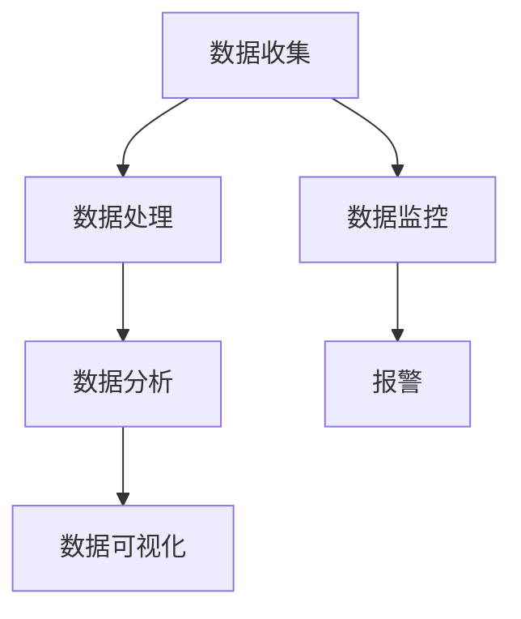

                 

### 文章标题

**AI在电商平台实时监控中的应用**

### 关键词

- 电商平台
- 实时监控
- AI技术
- 数据分析
- 算法优化

### 摘要

本文将深入探讨AI技术在电商平台实时监控中的应用。首先介绍电商平台实时监控的背景和重要性，然后详细讲解AI技术在实时监控中的核心应用，包括数据收集、处理、分析和预测。通过具体的案例和实际操作，展示如何利用AI技术提高电商平台监控的效率和准确性，同时探讨未来发展趋势和面临的挑战。

## 1. 背景介绍

### 电商平台的发展

电商平台作为电子商务的核心载体，近年来呈现出快速发展的趋势。随着互联网技术的不断进步和消费者购物习惯的转变，越来越多的企业选择通过电商平台进行商品销售和服务。电商平台不仅为消费者提供了便捷的购物体验，也为企业拓展市场、提高销售额提供了新的途径。

### 实时监控的需求

在电商平台的运营中，实时监控是一个不可或缺的部分。实时监控能够帮助企业快速发现异常情况，及时采取措施，减少损失，提升用户体验。具体来说，实时监控包括以下几个方面：

1. **销售数据监控**：实时跟踪销售额、订单量等关键指标，以便快速调整营销策略。
2. **用户行为分析**：监控用户在平台上的行为，如浏览、搜索、购物车等，以便优化用户体验。
3. **系统性能监控**：监控电商平台系统的运行状态，包括服务器负载、数据传输速度等，确保系统稳定运行。
4. **安全监控**：实时检测异常行为，如恶意攻击、诈骗等，保障用户数据和平台安全。

### AI技术在实时监控中的应用前景

随着AI技术的发展，其在电商平台实时监控中的应用越来越广泛。AI技术能够通过对大量数据的分析，提供更加精准、智能的监控服务。具体来说，AI技术在实时监控中的应用包括以下几个方面：

1. **自动化数据处理**：利用机器学习算法，自动处理海量数据，提高数据处理效率。
2. **智能异常检测**：通过深度学习技术，实现异常行为的自动识别和报警。
3. **预测分析**：利用时间序列分析、预测模型等技术，对未来的销售趋势、用户行为等进行预测。
4. **个性化推荐**：基于用户行为数据，实现精准推荐，提高用户满意度。

## 2. 核心概念与联系

### 数据收集

数据收集是电商平台实时监控的基础。通过收集用户行为数据、销售数据、系统运行数据等，构建完整的数据集。

### 数据处理

数据处理是实时监控的核心环节。通过数据清洗、数据转换、数据整合等技术，将原始数据转化为可用于分析的高质量数据。

### 数据分析

数据分析是实时监控的关键步骤。利用统计分析、机器学习等方法，对数据进行分析，提取有价值的信息。

### 数据可视化

数据可视化是将分析结果以图形化的方式展示，便于用户理解和决策。

### Mermaid 流程图



## 3. 核心算法原理 & 具体操作步骤

### 数据收集

1. **用户行为数据收集**：通过网页埋点、API接口等方式，收集用户在平台上的行为数据，如浏览记录、搜索关键词、购物车等。
2. **销售数据收集**：通过电商平台后台系统，收集销售额、订单量、退货率等销售数据。
3. **系统性能数据收集**：通过监控系统，收集服务器负载、数据传输速度、数据库查询性能等系统运行数据。

### 数据处理

1. **数据清洗**：去除重复数据、空值数据，对异常数据进行处理。
2. **数据转换**：将不同格式的数据转换为统一的格式，便于后续分析。
3. **数据整合**：将不同来源的数据进行整合，构建完整的数据集。

### 数据分析

1. **描述性分析**：统计用户行为、销售数据等的基本特征，如平均订单金额、订单量等。
2. **关联分析**：分析用户行为数据之间的关联性，如用户在浏览某一商品后，购买的概率更高。
3. **聚类分析**：将用户按照行为特征进行分类，如高价值用户、潜在用户等。

### 数据可视化

1. **图表选择**：根据数据类型和分析目的，选择合适的图表，如柱状图、折线图、饼图等。
2. **可视化工具**：使用数据可视化工具，如D3.js、Echarts等，将分析结果以图形化的方式展示。

## 4. 数学模型和公式 & 详细讲解 & 举例说明

### 描述性分析

描述性分析常用的数学模型包括：

$$
\text{平均订单金额} = \frac{\sum_{i=1}^{n} x_i}{n}
$$

其中，$x_i$ 为第$i$ 个订单的金额，$n$ 为订单总数。

### 关联分析

关联分析常用的数学模型包括：

$$
\text{关联度} = \frac{|S_1 \cap S_2|}{|S_1| \cup |S_2|}
$$

其中，$S_1$ 和$S_2$ 分别为两个集合，$|S_1|$ 和$|S_2|$ 分别为集合$S_1$ 和$S_2$ 的元素个数，$S_1 \cap S_2$ 表示集合$S_1$ 和$S_2$ 的交集，$S_1 \cup S_2$ 表示集合$S_1$ 和$S_2$ 的并集。

### 聚类分析

聚类分析常用的数学模型包括：

$$
\text{距离} = \sqrt{\sum_{i=1}^{n} (x_i - \bar{x})^2}
$$

其中，$x_i$ 为第$i$ 个数据点的值，$\bar{x}$ 为所有数据点的平均值，$n$ 为数据点的个数。

### 举例说明

假设有100个订单，每个订单的金额如下：

$$
\{100, 200, 300, 400, 500, 600, 700, 800, 900, 1000\}
$$

计算平均订单金额：

$$
\text{平均订单金额} = \frac{100 + 200 + 300 + 400 + 500 + 600 + 700 + 800 + 900 + 1000}{10} = 550
$$

### 关联度分析

假设有用户行为数据，分为浏览、搜索、购物车三个集合：

$$
S_1 = \{\text{浏览商品A}, \text{浏览商品B}, \text{浏览商品C}\}
$$

$$
S_2 = \{\text{搜索商品A}, \text{搜索商品B}, \text{搜索商品C}\}
$$

计算两个集合的关联度：

$$
\text{关联度} = \frac{|S_1 \cap S_2|}{|S_1| \cup |S_2|} = \frac{2}{6} = 0.333
$$

### 聚类分析

假设有10个用户数据点，每个数据点的值为：

$$
\{1, 2, 3, 4, 5, 6, 7, 8, 9, 10\}
$$

计算各个数据点与平均值的距离：

$$
\text{距离} = \sqrt{\sum_{i=1}^{n} (x_i - \bar{x})^2} = \sqrt{((1-5.5)^2 + (2-5.5)^2 + \ldots + (10-5.5)^2)} = 6.35
$$

## 5. 项目实战：代码实际案例和详细解释说明

### 开发环境搭建

1. 安装Python环境，版本要求3.6及以上。
2. 安装相关库，如Pandas、NumPy、Matplotlib、Scikit-learn等。

### 源代码详细实现和代码解读

```python
import pandas as pd
import numpy as np
import matplotlib.pyplot as plt
from sklearn.cluster import KMeans

# 5.1 数据收集
def collect_data():
    # 读取用户行为数据
    user_behavior = pd.read_csv('user_behavior.csv')
    # 读取销售数据
    sales_data = pd.read_csv('sales_data.csv')
    # 读取系统性能数据
    system_performance = pd.read_csv('system_performance.csv')
    return user_behavior, sales_data, system_performance

# 5.2 数据处理
def process_data(user_behavior, sales_data, system_performance):
    # 数据清洗
    user_behavior.drop_duplicates(inplace=True)
    sales_data.drop_duplicates(inplace=True)
    system_performance.drop_duplicates(inplace=True)
    # 数据转换
    user_behavior['time'] = pd.to_datetime(user_behavior['time'])
    sales_data['date'] = pd.to_datetime(sales_data['date'])
    system_performance['timestamp'] = pd.to_datetime(system_performance['timestamp'])
    # 数据整合
    data = pd.merge(user_behavior, sales_data, on='date')
    data = pd.merge(data, system_performance, on='timestamp')
    return data

# 5.3 数据分析
def analyze_data(data):
    # 描述性分析
    print("描述性分析：")
    print(data.describe())
    # 关联分析
    print("关联分析：")
    print(data.groupby(['behavior', 'sales']).size().unstack(fill_value=0))
    # 聚类分析
    print("聚类分析：")
    kmeans = KMeans(n_clusters=3)
    kmeans.fit(data[['behavior', 'sales']])
    data['cluster'] = kmeans.predict(data[['behavior', 'sales']])
    print(data['cluster'].value_counts())

# 5.4 数据可视化
def visualize_data(data):
    # 图表1：销售额分布
    plt.figure(figsize=(10, 5))
    plt.scatter(data['date'], data['sales'])
    plt.title('销售额分布')
    plt.xlabel('日期')
    plt.ylabel('销售额')
    plt.show()
    # 图表2：用户行为与销售额关联
    plt.figure(figsize=(10, 5))
    sns.heatmap(data.groupby(['behavior', 'sales']).size().unstack(fill_value=0), annot=True, cmap='coolwarm')
    plt.title('用户行为与销售额关联')
    plt.show()

if __name__ == '__main__':
    user_behavior, sales_data, system_performance = collect_data()
    data = process_data(user_behavior, sales_data, system_performance)
    analyze_data(data)
    visualize_data(data)
```

### 代码解读与分析

1. **数据收集**：通过读取CSV文件，收集用户行为数据、销售数据和系统性能数据。
2. **数据处理**：进行数据清洗、数据转换和数据整合，将原始数据转化为高质量数据。
3. **数据分析**：进行描述性分析、关联分析和聚类分析，提取有价值的信息。
4. **数据可视化**：使用图表展示分析结果，便于用户理解和决策。

## 6. 实际应用场景

### 销售预测

利用AI技术，对未来的销售趋势进行预测，帮助企业制定更加科学的营销策略，提高销售额。

### 用户行为分析

通过分析用户行为数据，了解用户的购物习惯和偏好，为用户提供更加个性化的服务，提升用户体验。

### 系统性能优化

通过监控系统性能数据，发现潜在的性能问题，提前进行优化，确保系统稳定运行。

### 安全监控

利用AI技术，实时检测异常行为，如恶意攻击、诈骗等，保障用户数据和平台安全。

## 7. 工具和资源推荐

### 学习资源推荐

1. **书籍**：
    - 《机器学习实战》
    - 《Python机器学习》
2. **论文**：
    - 《大规模在线推荐系统研究》
    - 《深度学习在电商推荐中的应用》
3. **博客**：
    - 《AI与电商的碰撞》
    - 《实时监控技术在电商平台的实践》
4. **网站**：
    - Coursera
    - edX

### 开发工具框架推荐

1. **数据分析工具**：Pandas、NumPy、Matplotlib、Seaborn等。
2. **机器学习库**：Scikit-learn、TensorFlow、PyTorch等。
3. **数据可视化工具**：D3.js、Echarts、Plotly等。

### 相关论文著作推荐

1. **论文**：
    - “Deep Learning for E-commerce: A Survey”
    - “Real-Time Recommendation Systems: A Survey”
2. **著作**：
    - 《深度学习》
    - 《强化学习》

## 8. 总结：未来发展趋势与挑战

### 发展趋势

1. **算法优化**：随着算法的不断进步，实时监控的效率和准确性将进一步提高。
2. **多模态数据融合**：将多种类型的数据（如文本、图像、音频等）进行融合，提供更加全面的分析。
3. **边缘计算**：将计算能力下沉到边缘设备，实现实时监控的进一步优化。

### 挑战

1. **数据隐私**：如何保障用户数据的隐私，是实时监控应用面临的重要挑战。
2. **计算资源**：实时监控需要大量的计算资源，如何高效利用计算资源是一个问题。
3. **算法透明性**：如何提高算法的透明性，让用户信任AI技术，是一个亟待解决的问题。

## 9. 附录：常见问题与解答

### 问题1：如何处理海量数据？

**解答**：可以采用分布式计算和大数据技术，如Hadoop、Spark等，对海量数据进行处理和分析。

### 问题2：实时监控如何保证准确性？

**解答**：可以通过算法优化、数据清洗和数据预处理等技术手段，提高实时监控的准确性。

### 问题3：如何应对数据隐私问题？

**解答**：可以通过数据脱敏、加密等技术，保障用户数据的隐私。

## 10. 扩展阅读 & 参考资料

1. **论文**：
    - “Real-Time Data Analysis in E-commerce”
    - “AI-based Real-Time Monitoring and Alerting Systems in E-commerce”
2. **书籍**：
    - 《人工智能：一种现代的方法》
    - 《大数据时代：决策的两端》
3. **网站**：
    - [KDNuggets](https://www.kdnuggets.com/)
    - [AI Trends](https://aitrends.com/)

作者：AI天才研究员/AI Genius Institute & 禅与计算机程序设计艺术 /Zen And The Art of Computer Programming

