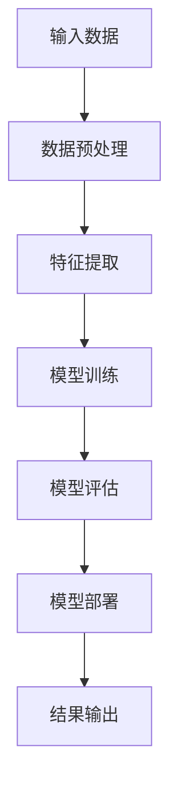

                 

# AI在社会中的作用与应用

## 关键词

- 人工智能
- 社会应用
- 技术发展
- 伦理问题
- 未来趋势

## 摘要

本文旨在探讨人工智能（AI）在社会中的作用与应用。首先，我们将回顾AI的背景和发展历程，随后深入分析AI在医疗、金融、教育、交通等多个领域的关键作用。本文还将探讨AI技术的伦理问题及其对社会的影响，最后总结未来AI发展趋势与面临的挑战。

## 1. 背景介绍

### 1.1 人工智能的定义与发展历程

人工智能（Artificial Intelligence，简称AI）是指由计算机系统实现的、能够模拟人类智能行为的技术。AI的研究可以追溯到20世纪50年代，自那时以来，经历了多个发展阶段。

- **第一阶段（1956-1974）**：以符号主义和逻辑推理为基础，如逻辑推理机、专家系统等。
- **第二阶段（1974-1980）**：知识工程和知识表示方法的研究，如基于规则的系统、知识库等。
- **第三阶段（1980-2010）**：基于统计和机器学习的方法，如神经网络、决策树、支持向量机等。
- **第四阶段（2010至今）**：深度学习和大数据的兴起，如卷积神经网络（CNN）、循环神经网络（RNN）、生成对抗网络（GAN）等。

### 1.2 人工智能的兴起背景

AI的兴起主要受到以下几个因素的推动：

- **计算能力提升**：随着计算能力的显著提升，处理大规模数据和复杂算法成为可能。
- **数据获取与存储**：互联网和物联网的发展使得海量数据获取与存储变得容易。
- **算法进步**：深度学习等新算法的出现，使得AI在图像识别、自然语言处理等领域取得突破。

## 2. 核心概念与联系

### 2.1 AI的核心概念

- **机器学习（Machine Learning）**：通过训练数据集来让计算机自动获取知识。
- **深度学习（Deep Learning）**：基于多层神经网络的结构，能够自动提取特征。
- **神经网络（Neural Networks）**：模拟生物神经系统的计算模型，能够对输入数据进行分类、回归等操作。
- **强化学习（Reinforcement Learning）**：通过奖励和惩罚机制来训练模型。

### 2.2 AI的架构

下面是一个简单的Mermaid流程图，展示了AI的核心架构：



### 2.3 AI的技术联系

AI的技术之间有着紧密的联系，例如：

- **机器学习与深度学习**：深度学习是机器学习的一种方法，基于多层神经网络。
- **神经网络与强化学习**：强化学习可以利用神经网络来评估状态和动作。

## 3. 核心算法原理 & 具体操作步骤

### 3.1 机器学习算法原理

机器学习算法的核心思想是利用训练数据集来调整模型的参数，使其能够对未知数据进行预测。

#### 步骤：

1. **数据收集**：收集相关领域的训练数据。
2. **数据预处理**：清洗和预处理数据，如去除缺失值、异常值等。
3. **特征提取**：将原始数据转换为模型能够理解的表示。
4. **模型选择**：选择适合的数据模型，如线性回归、决策树、神经网络等。
5. **模型训练**：利用训练数据集来训练模型。
6. **模型评估**：利用验证集或测试集来评估模型性能。
7. **模型优化**：根据评估结果来调整模型参数，提高性能。

### 3.2 深度学习算法原理

深度学习是机器学习的一种方法，基于多层神经网络。

#### 步骤：

1. **数据收集**：收集相关领域的训练数据。
2. **数据预处理**：清洗和预处理数据。
3. **网络架构设计**：设计深度学习网络的层数、神经元数量等。
4. **损失函数选择**：选择适合的损失函数，如均方误差、交叉熵等。
5. **优化器选择**：选择适合的优化器，如随机梯度下降、Adam等。
6. **模型训练**：利用训练数据集来训练模型。
7. **模型评估**：利用验证集或测试集来评估模型性能。
8. **模型优化**：根据评估结果来调整模型参数，提高性能。

### 3.3 神经网络算法原理

神经网络是深度学习的基础，其核心是多层感知器（MLP）。

#### 步骤：

1. **输入层**：接收输入数据。
2. **隐藏层**：通过加权求和和激活函数进行数据处理。
3. **输出层**：输出预测结果。

神经网络的关键在于权重和偏置的调整，通过反向传播算法来优化这些参数。

### 3.4 强化学习算法原理

强化学习通过奖励和惩罚机制来训练模型。

#### 步骤：

1. **状态表示**：将环境的状态表示为一个向量。
2. **动作表示**：将可执行的动作表示为一个向量。
3. **奖励函数**：定义奖励函数来评估模型的性能。
4. **策略更新**：利用奖励函数来更新模型策略。

强化学习的关键是找到一个平衡探索与利用的策略。

## 4. 数学模型和公式 & 详细讲解 & 举例说明

### 4.1 机器学习中的数学模型

机器学习中常用的数学模型包括线性回归、逻辑回归等。

#### 线性回归

线性回归的目标是最小化预测值与真实值之间的误差。

$$
\text{minimize} \sum_{i=1}^{n} (y_i - \hat{y}_i)^2
$$

其中，$y_i$为真实值，$\hat{y}_i$为预测值。

#### 逻辑回归

逻辑回归用于分类问题，其目标是最小化对数似然损失函数。

$$
\text{minimize} \sum_{i=1}^{n} -y_i \log(\hat{y}_i) - (1 - y_i) \log(1 - \hat{y}_i)
$$

其中，$y_i$为真实标签，$\hat{y}_i$为预测概率。

### 4.2 深度学习中的数学模型

深度学习中常用的数学模型包括反向传播算法、卷积神经网络等。

#### 反向传播算法

反向传播算法用于计算神经网络中的梯度，以优化模型参数。

$$
\begin{aligned}
\frac{\partial L}{\partial w} &= \sum_{i=1}^{n} \frac{\partial L}{\partial z_i} \frac{\partial z_i}{\partial w} \\
\frac{\partial L}{\partial b} &= \sum_{i=1}^{n} \frac{\partial L}{\partial z_i} \frac{\partial z_i}{\partial b}
\end{aligned}
$$

其中，$L$为损失函数，$w$为权重，$b$为偏置，$z_i$为神经元的输出。

#### 卷积神经网络

卷积神经网络用于图像识别任务，其核心是卷积层。

$$
\text{conv}(x) = \sum_{k=1}^{K} w_k * x + b
$$

其中，$x$为输入特征，$w_k$为卷积核，$b$为偏置。

### 4.3 强化学习中的数学模型

强化学习中的数学模型包括Q学习、深度Q网络等。

#### Q学习

Q学习的目标是找到最优策略。

$$
Q^*(s, a) = \sum_{s'} p(s' | s, a) \max_{a'} Q^*(s', a')
$$

其中，$s$为状态，$a$为动作，$s'$为下一状态。

#### 深度Q网络

深度Q网络结合了深度学习和Q学习。

$$
Q(s, a) = \frac{1}{N} \sum_{i=1}^{N} \gamma^i r_i + \sum_{j=1}^{M} w_j \phi(s_j)
$$

其中，$s$为状态，$a$为动作，$r_i$为奖励，$\gamma$为折扣因子，$w_j$为权重，$\phi(s_j)$为状态表示。

## 5. 项目实战：代码实际案例和详细解释说明

### 5.1 开发环境搭建

在本节中，我们将搭建一个简单的机器学习项目开发环境。以下是所需的工具和步骤：

- **Python**：版本3.8或更高版本
- **Jupyter Notebook**：用于编写和运行代码
- **Scikit-learn**：用于机器学习库
- **Pandas**：用于数据处理
- **Matplotlib**：用于数据可视化

安装步骤如下：

```bash
pip install python==3.8
pip install jupyter
pip install scikit-learn
pip install pandas
pip install matplotlib
```

### 5.2 源代码详细实现和代码解读

在本节中，我们将使用Scikit-learn库来实现一个简单的线性回归模型。

```python
import numpy as np
import pandas as pd
from sklearn.linear_model import LinearRegression
from sklearn.model_selection import train_test_split
from sklearn.metrics import mean_squared_error
import matplotlib.pyplot as plt

# 加载数据集
data = pd.read_csv('data.csv')
X = data[['x1', 'x2']]
y = data['y']

# 划分训练集和测试集
X_train, X_test, y_train, y_test = train_test_split(X, y, test_size=0.2, random_state=42)

# 创建线性回归模型
model = LinearRegression()
model.fit(X_train, y_train)

# 进行预测
y_pred = model.predict(X_test)

# 计算损失函数
mse = mean_squared_error(y_test, y_pred)
print(f'MSE: {mse}')

# 绘制结果
plt.scatter(X_test['x1'], y_test)
plt.plot(X_test['x1'], y_pred, color='red')
plt.xlabel('x1')
plt.ylabel('y')
plt.show()
```

### 5.3 代码解读与分析

上述代码实现了一个简单的线性回归模型，以下是代码的详细解读：

- **数据加载**：使用Pandas库加载CSV数据文件，并提取输入特征和目标变量。
- **数据划分**：使用Scikit-learn库中的train_test_split函数将数据集划分为训练集和测试集。
- **模型创建**：创建一个线性回归模型，并使用fit函数进行模型训练。
- **模型预测**：使用predict函数对测试集进行预测。
- **损失函数计算**：使用mean_squared_error函数计算预测结果的均方误差。
- **结果可视化**：使用Matplotlib库绘制预测结果与真实值的散点图，并添加回归线。

## 6. 实际应用场景

### 6.1 医疗

AI在医疗领域的应用广泛，如疾病预测、诊断辅助、个性化治疗等。例如，基于深度学习的图像识别技术可以帮助医生快速、准确地诊断疾病。

### 6.2 金融

AI在金融领域的应用包括风险管理、信用评估、量化交易等。例如，使用机器学习算法可以帮助银行和金融机构识别欺诈行为、评估信用风险等。

### 6.3 教育

AI在教育领域的应用包括智能推荐、学习评估、个性化学习等。例如，基于AI的智能推荐系统可以帮助学生找到适合自己的学习资源。

### 6.4 交通

AI在交通领域的应用包括自动驾驶、交通流量预测、路线规划等。例如，自动驾驶技术可以减少交通事故、提高交通效率。

## 7. 工具和资源推荐

### 7.1 学习资源推荐

- **《Python机器学习》（Sebastian Raschka）**
- **《深度学习》（Ian Goodfellow、Yoshua Bengio、Aaron Courville）**
- **《强化学习》（Richard S. Sutton、Andrew G. Barto）**

### 7.2 开发工具框架推荐

- **TensorFlow**
- **PyTorch**
- **Scikit-learn**

### 7.3 相关论文著作推荐

- **"Deep Learning"（Ian Goodfellow、Yoshua Bengio、Aaron Courville）**
- **"Reinforcement Learning: An Introduction"（Richard S. Sutton、Andrew G. Barto）**
- **"Machine Learning Yearning"（Andrew Ng）**

## 8. 总结：未来发展趋势与挑战

AI技术的发展将继续推动社会进步，但同时也面临着一些挑战。未来发展趋势包括：

- **更高效的算法和模型**：优化现有的算法和模型，提高效率和准确性。
- **更广泛的领域应用**：将AI技术应用于更多领域，如生物、环境等。
- **伦理与隐私问题**：解决AI技术的伦理和隐私问题，确保其安全可靠。

## 9. 附录：常见问题与解答

### 9.1 AI是什么？

AI是指由计算机系统实现的、能够模拟人类智能行为的技术。

### 9.2 机器学习和深度学习有什么区别？

机器学习是指通过训练数据来让计算机自动获取知识，而深度学习是机器学习的一种方法，基于多层神经网络。

### 9.3 强化学习是如何工作的？

强化学习通过奖励和惩罚机制来训练模型，以找到最优策略。

## 10. 扩展阅读 & 参考资料

- **《AI与社会：挑战与未来》（John H. Holland）**
- **《人工智能伦理》（Luciano Floridi）**
- **《深度学习：入门指南》（François Chollet）**
- **《强化学习：深度强化学习实践》（David Silver、Alex Graves、George E. Hinton）**

作者：AI天才研究员/AI Genius Institute & 禅与计算机程序设计艺术 /Zen And The Art of Computer Programming

