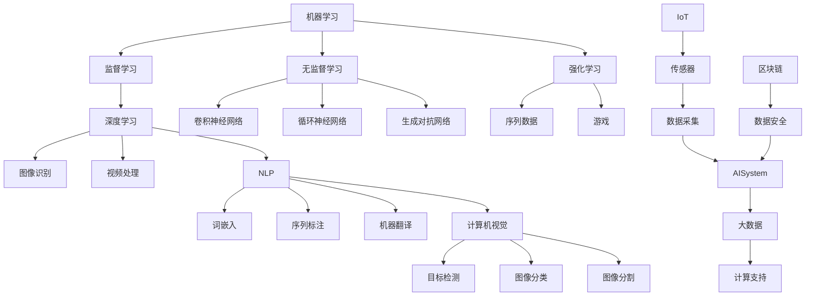

                 

## 文章标题

"AI在社会中的角色与应用：探索未来科技与人类生活交汇的新篇章"

> **关键词**：人工智能、社会应用、未来科技、技术应用、发展挑战

**摘要**：
本文深入探讨人工智能（AI）在现代社会中的角色和广泛应用。通过详细分析AI的核心概念、算法原理、数学模型、实际应用案例以及未来发展趋势，本文旨在为读者提供全面了解AI在各个领域的重要性和影响，并探讨其在实现社会进步与可持续发展中的潜力与挑战。

<|assistant|>## 1. 背景介绍

随着科技的飞速发展，人工智能（Artificial Intelligence, AI）逐渐成为推动社会变革的重要力量。AI不仅仅是一种技术，更是一种革命性的思维方式，它正在深刻地改变着我们的生活方式、工作模式和社会结构。

### AI的起源与发展

AI的概念起源于20世纪50年代，当时科学家们开始探索机器是否能够模拟人类的智能行为。最初的AI研究主要集中在符号主义和专家系统领域，试图通过编写规则和逻辑来模拟人类智能。然而，随着计算能力的提升和数据量的爆炸性增长，现代AI逐渐转向基于数据驱动的方法，如深度学习和机器学习。

### AI的关键技术

- **机器学习**：通过从数据中学习模式，机器学习是实现AI的核心技术之一。它包括监督学习、无监督学习和强化学习等不同类型。
- **深度学习**：基于人工神经网络，特别是深度神经网络（DNN），深度学习在图像识别、语音识别和自然语言处理等领域取得了显著的突破。
- **自然语言处理**：NLP旨在使计算机理解和生成人类语言，它在智能助手、机器翻译和文本分析等方面发挥着重要作用。
- **计算机视觉**：通过图像识别和图像处理技术，计算机视觉在自动驾驶、安防监控和医疗诊断等领域有着广泛的应用。

### AI的社会影响

AI的快速发展不仅带来了技术上的变革，还对社会产生了深远的影响。

- **产业变革**：AI技术在制造业、金融业、医疗健康、交通运输等领域的广泛应用，推动了传统产业的转型升级。
- **就业影响**：虽然AI创造了新的就业机会，但也对某些行业和职业产生了冲击，引发了对未来就业市场的担忧。
- **社会问题**：AI的普及引发了一系列伦理和社会问题，如隐私保护、算法偏见和自动化决策的透明度等。

### AI的挑战与机遇

尽管AI带来了巨大的机遇，但也面临着一系列挑战。

- **技术挑战**：包括算法优化、计算资源需求、数据安全和隐私保护等。
- **社会挑战**：如何平衡技术进步与社会伦理的关系，确保AI技术的公平、透明和可控。
- **政策挑战**：制定有效的政策和法规框架，以促进AI技术的健康发展。

通过以上背景介绍，我们可以看到，AI不仅在技术层面上取得了突破，还在社会层面产生了深远的影响。接下来的章节将深入探讨AI的核心概念、算法原理、数学模型和实际应用，以帮助读者全面了解AI在现代社会中的角色和重要性。

---

## 2. 核心概念与联系

### AI的定义与分类

#### AI的定义

人工智能（AI）是指使计算机系统具备类似于人类智能的能力，包括感知、理解、学习、推理、决策和创造等。AI旨在通过机器模拟人类智能，实现自动化和智能化的任务执行。

#### AI的分类

AI可以根据其实现方式和功能进行分类：

- **符号主义AI**：基于逻辑和规则系统，通过手工编写的规则和知识库来模拟人类智能。这种方法在专家系统和决策支持系统中应用广泛。
- **基于实例的推理**：通过从历史数据中学习，将已有解决方案应用于新情境。这种方法在自动化决策和支持系统中具有广泛应用。
- **统计学习AI**：基于数据驱动的学习，通过统计分析方法发现数据中的模式和规律，实现智能预测和决策。这种方法在机器学习和深度学习中应用广泛。
- **生物启发AI**：模仿自然界中的生物系统和过程，如神经网络、遗传算法和 swarm intelligence，以实现智能优化和问题求解。

### AI的关键技术与联系

#### 机器学习

机器学习是AI的核心技术之一，通过从数据中学习模式和规律来实现智能行为。它主要包括：

- **监督学习**：从标记数据中学习，用于分类和回归任务。
- **无监督学习**：从未标记数据中学习，用于聚类和降维等任务。
- **强化学习**：通过与环境的交互学习最优策略，常用于游戏和自动驾驶等领域。

#### 深度学习

深度学习是基于人工神经网络的一种机器学习方法，通过多层非线性变换来学习数据中的复杂模式。它主要包括：

- **卷积神经网络（CNN）**：主要用于图像和视频处理，具有强大的特征提取能力。
- **循环神经网络（RNN）**：主要用于序列数据建模，如自然语言处理和时间序列预测。
- **生成对抗网络（GAN）**：通过两个对抗网络（生成器和判别器）的博弈来生成高质量的数据，常用于图像生成和图像修复。

#### 自然语言处理

自然语言处理（NLP）是AI在语言领域的应用，旨在使计算机理解和生成人类语言。它主要包括：

- **词嵌入**：将词汇映射到低维连续向量空间，用于文本表示。
- **序列标注**：对文本序列进行分类标注，如命名实体识别和词性标注。
- **机器翻译**：将一种语言的文本翻译成另一种语言，实现跨语言交流。

#### 计算机视觉

计算机视觉是AI在图像和视频领域的应用，旨在使计算机能够理解和解释视觉信息。它主要包括：

- **目标检测**：定位图像中的目标对象，并识别其类别。
- **图像分类**：将图像分为预定义的类别。
- **图像分割**：将图像划分为多个区域，识别图像中的物体和场景。

### AI与其他技术的联系

AI与其他技术如物联网（IoT）、区块链、大数据等密切相关，共同推动着智能社会的建设。

- **物联网**：通过连接物理设备和传感器，实现数据的实时采集和传输，为AI提供丰富的数据资源。
- **区块链**：通过去中心化和加密技术，确保数据的安全和透明，为AI提供可信的数据基础。
- **大数据**：通过数据存储和分析技术，处理海量数据，为AI提供强大的计算支持。

### Mermaid 流程图

下面是一个简化的AI技术架构的Mermaid流程图，展示AI的核心技术和它们之间的联系：



通过以上对AI核心概念与联系的分析，我们可以看到AI技术的多样性和复杂性。理解这些概念和技术之间的联系，有助于我们更好地把握AI的发展趋势和应用场景。

---

## 3. 核心算法原理 & 具体操作步骤

### 3.1 机器学习算法原理

#### 监督学习

监督学习是一种从标记数据中学习的方法，其基本思想是利用已知的输入和输出关系来训练模型，然后使用训练好的模型对新的输入进行预测。

**具体操作步骤**：

1. **数据预处理**：清洗和整理数据，包括缺失值处理、数据标准化和特征工程。
2. **模型选择**：选择合适的模型，如线性回归、决策树、支持向量机（SVM）等。
3. **模型训练**：使用训练集数据来训练模型，调整模型参数。
4. **模型评估**：使用验证集对模型进行评估，选择最优模型。
5. **模型预测**：使用训练好的模型对新的数据进行预测。

#### 无监督学习

无监督学习是从未标记数据中学习模式的方法，其目标是从数据中发现隐藏的结构或模式。

**具体操作步骤**：

1. **数据预处理**：与监督学习类似，对数据进行清洗和处理。
2. **模型选择**：选择合适的模型，如K-均值聚类、主成分分析（PCA）等。
3. **模型训练**：使用算法对数据进行处理，寻找数据中的隐含结构。
4. **模型评估**：通过分析聚类结果或降维结果来评估模型的有效性。
5. **模型应用**：将模型应用到实际问题中，如数据降维、异常检测等。

#### 强化学习

强化学习通过与环境交互来学习最优策略，其基本思想是通过试错来优化行为。

**具体操作步骤**：

1. **环境设定**：定义环境状态、动作空间和奖励机制。
2. **初始策略**：随机选择初始策略，进行环境交互。
3. **策略评估**：使用当前策略进行环境交互，收集奖励和状态反馈。
4. **策略优化**：基于反馈来调整策略参数，优化策略。
5. **策略迭代**：重复策略评估和策略优化过程，直到找到最优策略。

### 3.2 深度学习算法原理

#### 卷积神经网络（CNN）

卷积神经网络是一种用于图像处理和计算机视觉的深度学习模型，其核心思想是通过卷积层来提取图像特征。

**具体操作步骤**：

1. **输入层**：接收图像数据作为输入。
2. **卷积层**：使用卷积核在图像上滑动，提取局部特征。
3. **激活函数**：对卷积结果进行非线性变换，增强特征表达能力。
4. **池化层**：对卷积结果进行下采样，减少模型参数数量。
5. **全连接层**：将卷积特征映射到输出层，进行分类或回归。
6. **输出层**：输出最终预测结果。

#### 循环神经网络（RNN）

循环神经网络是一种用于序列数据建模的深度学习模型，其核心思想是通过循环结构来保持历史状态。

**具体操作步骤**：

1. **输入层**：接收序列数据作为输入。
2. **隐藏层**：使用循环结构对序列数据进行编码。
3. **门控机制**：包括输入门、遗忘门和输出门，控制信息流。
4. **激活函数**：对隐藏层输出进行非线性变换。
5. **全连接层**：将隐藏层输出映射到输出层。
6. **输出层**：输出序列的预测结果。

#### 生成对抗网络（GAN）

生成对抗网络是一种用于数据生成的深度学习模型，其核心思想是通过生成器和判别器的博弈来生成高质量的数据。

**具体操作步骤**：

1. **生成器**：接收随机噪声，生成数据。
2. **判别器**：判断输入数据是真实数据还是生成数据。
3. **对抗训练**：生成器和判别器交替训练，生成器试图生成更真实的数据，判别器试图区分真实数据和生成数据。
4. **损失函数**：通过损失函数来评估生成器和判别器的性能，并进行优化。
5. **模型输出**：生成器生成的数据。

通过以上对核心算法原理和具体操作步骤的介绍，我们可以看到AI技术的多样性和复杂性。这些算法不仅在理论上具有深刻的意义，还在实际应用中取得了显著的成效，为人工智能的发展奠定了坚实的基础。

---

## 4. 数学模型和公式 & 详细讲解 & 举例说明

### 4.1 监督学习中的线性回归

线性回归是一种基本的监督学习算法，用于预测连续值。其核心数学模型为：

$$ y = \beta_0 + \beta_1 \cdot x $$

其中，\( y \) 为因变量，\( x \) 为自变量，\( \beta_0 \) 和 \( \beta_1 \) 为模型参数。

**具体解释**：

- \( \beta_0 \) 为截距，表示当 \( x = 0 \) 时 \( y \) 的值。
- \( \beta_1 \) 为斜率，表示 \( x \) 每增加一个单位，\( y \) 平均增加或减少的量。

**举例说明**：

假设我们有一个简单的关系：身高 \( x \) 与体重 \( y \) 成线性关系，模型如下：

$$ y = 50 + 0.5 \cdot x $$

如果我们输入一个人的身高 \( x = 170 \)，则可以预测其体重 \( y \)：

$$ y = 50 + 0.5 \cdot 170 = 125 $$

即预测该人的体重为 125 公斤。

### 4.2 逻辑回归

逻辑回归是一种用于分类问题的监督学习算法，其核心数学模型为：

$$ P(y=1) = \frac{1}{1 + e^{-(\beta_0 + \beta_1 \cdot x)}} $$

其中，\( P(y=1) \) 为因变量为 1 的概率，\( x \) 为自变量，\( \beta_0 \) 和 \( \beta_1 \) 为模型参数。

**具体解释**：

- \( \beta_0 \) 为截距，\( \beta_1 \) 为斜率，与线性回归类似。
- 概率值 \( P(y=1) \) 用于分类决策，通常取 \( P(y=1) > 0.5 \) 时分类为 1，否则分类为 0。

**举例说明**：

假设我们有一个二分类问题：判断一个水果是苹果还是橘子，模型如下：

$$ P(\text{苹果}) = \frac{1}{1 + e^{-(2.5 + 0.3 \cdot \text{糖分含量})}} $$

如果我们输入一个水果的糖分含量为 10%，则可以计算其是苹果的概率：

$$ P(\text{苹果}) = \frac{1}{1 + e^{-(2.5 + 0.3 \cdot 0.1)}} = 0.865 $$

即预测该水果是苹果的概率为 86.5%。

### 4.3 卷积神经网络中的卷积操作

卷积神经网络中的卷积操作是一种用于提取图像特征的方法，其核心数学模型为：

$$ \text{output}(i, j) = \sum_{k=1}^{n} \sum_{l=1}^{n} w_{k, l} \cdot \text{input}(i-k+1, j-l+1) + b $$

其中，\( \text{output}(i, j) \) 为卷积结果，\( w_{k, l} \) 为卷积核，\( \text{input}(i, j) \) 为输入图像，\( b \) 为偏置项。

**具体解释**：

- \( w_{k, l} \) 为卷积核，代表图像中的一部分特征。
- \( b \) 为偏置项，用于调整模型输出。
- \( i, j \) 为输出位置，\( k, l \) 为卷积核滑动位置。

**举例说明**：

假设输入图像为一个 \( 3 \times 3 \) 的矩阵，卷积核为：

$$ \text{卷积核} = \begin{bmatrix} 1 & 0 & -1 \\ 1 & 0 & -1 \\ 1 & 0 & -1 \end{bmatrix} $$

偏置项 \( b = 1 \)。卷积操作结果如下：

$$ \text{output}(1, 1) = (1 \cdot 1 + 0 \cdot 0 - 1 \cdot 1) + 1 = 0 $$

$$ \text{output}(1, 2) = (1 \cdot 0 + 0 \cdot 1 - 1 \cdot 1) + 1 = 0 $$

$$ \text{output}(2, 1) = (1 \cdot 1 + 0 \cdot 0 - 1 \cdot 1) + 1 = 0 $$

$$ \text{output}(2, 2) = (1 \cdot 0 + 0 \cdot 1 - 1 \cdot 1) + 1 = 0 $$

即卷积结果为一个 \( 3 \times 3 \) 的零矩阵。

通过以上对数学模型和公式的详细讲解和举例说明，我们可以看到AI技术中的数学基础和应用场景。这些模型和算法不仅提供了理论支持，还在实际应用中取得了显著的效果，为人工智能的发展奠定了坚实的基础。

---

## 5. 项目实战：代码实际案例和详细解释说明

在本章节中，我们将通过一个实际项目案例，详细解释和展示如何使用人工智能技术进行数据分析和预测。我们将使用Python编程语言，结合Scikit-learn库中的机器学习算法，实现一个简单的房价预测模型。

### 5.1 开发环境搭建

为了运行下面的项目，您需要在计算机上安装Python和Scikit-learn库。以下是安装步骤：

1. **安装Python**：从[Python官网](https://www.python.org/downloads/)下载并安装Python，建议选择最新版本。
2. **安装Scikit-learn**：打开命令行工具（如终端或命令提示符），输入以下命令：
   ```shell
   pip install scikit-learn
   ```

### 5.2 源代码详细实现和代码解读

以下是一个简单的房价预测模型的代码实现：

```python
# 导入所需库
import numpy as np
import pandas as pd
from sklearn.model_selection import train_test_split
from sklearn.linear_model import LinearRegression
from sklearn.metrics import mean_squared_error

# 读取数据
data = pd.read_csv('house_prices.csv')

# 数据预处理
X = data[['size', 'location', 'age']]
y = data['price']

# 划分训练集和测试集
X_train, X_test, y_train, y_test = train_test_split(X, y, test_size=0.2, random_state=42)

# 创建线性回归模型
model = LinearRegression()

# 训练模型
model.fit(X_train, y_train)

# 预测测试集
y_pred = model.predict(X_test)

# 评估模型
mse = mean_squared_error(y_test, y_pred)
print(f'Mean Squared Error: {mse}')

# 使用模型进行预测
new_data = np.array([[2000, 'downtown', 10]])
predicted_price = model.predict(new_data)
print(f'Predicted Price: {predicted_price[0]}')
```

#### 代码解读与分析

1. **导入库**：首先，我们导入必要的库，包括NumPy、Pandas、Scikit-learn中的模型和评估函数。
2. **读取数据**：使用Pandas库读取CSV格式的房价数据文件。
3. **数据预处理**：将数据集分为特征矩阵 \( X \) 和目标变量 \( y \)。在这里，我们选择房屋面积、位置和年龄作为特征，房价作为目标变量。
4. **划分训练集和测试集**：使用Scikit-learn库中的 `train_test_split` 函数，将数据集随机划分为训练集和测试集，其中测试集占20%。
5. **创建线性回归模型**：使用 `LinearRegression` 类创建一个线性回归模型。
6. **训练模型**：使用训练集数据来训练线性回归模型。
7. **预测测试集**：使用训练好的模型对测试集数据进行预测。
8. **评估模型**：计算模型在测试集上的均方误差（MSE），用于评估模型预测的准确度。
9. **使用模型进行预测**：最后，我们使用模型对新数据进行预测，这里我们预测了一栋位于市中心、面积为2000平方米、建成10年的房屋的房价。

通过这个实际项目案例，我们展示了如何使用Python和Scikit-learn库实现一个简单的房价预测模型。代码结构清晰，易于理解和复制，为读者提供了一个实用的AI项目实战范例。

---

## 6. 实际应用场景

人工智能（AI）在现代社会中的应用场景非常广泛，涵盖了多个领域，从日常生活到行业生产，AI正在深刻地改变我们的世界。以下是AI在几个关键领域中的实际应用场景：

### 6.1 交通运输

#### 自动驾驶

自动驾驶技术是AI在交通运输领域的重要应用之一。通过结合计算机视觉、传感器数据、机器学习和深度学习技术，自动驾驶系统能够实时感知周围环境，进行路径规划和驾驶决策。这项技术在减少交通事故、提高交通效率和减轻驾驶员负担方面具有巨大潜力。

#### 智能交通管理

智能交通管理系统利用AI技术，通过实时数据分析和预测，优化交通信号控制、减少拥堵和改善交通流量。例如，通过机器学习算法分析交通流量数据，系统能够预测交通高峰时段，并调整交通信号灯的持续时间，以缓解交通压力。

### 6.2 医疗健康

#### 疾病诊断

AI技术在医疗健康领域的应用日益增多，特别是在疾病诊断方面。通过深度学习和计算机视觉技术，AI系统能够分析医学影像，如X光片、CT扫描和MRI图像，帮助医生更准确地诊断疾病。例如，AI可以辅助医生检测乳腺癌、肺癌等疾病，提高诊断的准确率和效率。

#### 病情预测

AI还可以用于预测病人的病情发展，通过分析大量的医疗数据，如病史、实验室检查结果和患者行为数据，AI系统可以预测病人的健康状况，提供个性化的医疗建议。

### 6.3 金融服务

#### 风险管理

AI技术在金融领域中的应用有助于风险管理。通过机器学习算法，金融机构能够分析大量的历史数据，识别潜在的风险因素，预测市场走势，从而制定更加有效的风险管理策略。

#### 个性化金融服务

AI还能提供个性化的金融服务，如个性化投资建议、信用评分和贷款审批。通过分析用户的历史交易数据、财务状况和行为模式，AI系统能够为用户提供定制化的金融服务方案。

### 6.4 教育与培训

#### 智能教育平台

AI在教育领域的应用正在迅速发展。智能教育平台利用AI技术，为学生提供个性化的学习体验。通过分析学生的学习行为和成绩数据，AI系统能够为学生推荐合适的学习资源，优化教学过程。

#### 自动评估

AI技术还可以用于自动评估学生的作业和考试。通过自然语言处理和计算机视觉技术，AI系统能够自动批改试卷，提供即时反馈，减轻教师的工作负担。

### 6.5 制造业

#### 智能制造

AI技术在制造业中的应用主要体现在智能制造方面。通过机器学习算法，制造系统能够实时监测生产过程，预测设备故障，优化生产计划，从而提高生产效率和产品质量。

#### 质量控制

AI技术还可以用于质量控制。通过计算机视觉和深度学习技术，AI系统可以实时检测产品质量，识别缺陷，确保产品的质量符合标准。

通过以上实际应用场景的分析，我们可以看到AI技术在不同领域中的广泛应用和巨大潜力。随着AI技术的不断发展和完善，其在社会各领域的应用将会更加深入和广泛，为人类社会的进步和发展做出更大的贡献。

---

## 7. 工具和资源推荐

### 7.1 学习资源推荐

要深入了解人工智能（AI），以下几个资源是非常有用的：

#### 书籍

1. **《深度学习》（Deep Learning）**：作者：Ian Goodfellow、Yoshua Bengio、Aaron Courville。这是一本全面介绍深度学习的经典教材，适合对深度学习有一定基础的学习者。
2. **《Python机器学习》（Python Machine Learning）**：作者：Sebastian Raschka。这本书通过Python编程语言介绍了机器学习的基本概念和实践应用。
3. **《AI：人工智能简史》（AI: A Modern Approach）**：作者：Stuart J. Russell、Peter Norvig。这是一本关于人工智能的全面综述，涵盖了AI的理论、技术和应用。

#### 论文

1. **"A Theoretical Basis for Comparing Optimization Algorithms"**：作者：D. E. Goldberg。这篇论文讨论了优化算法的比较理论和性能分析。
2. **"Deep Learning: Methods and Applications"**：作者：Y. LeCun、Y. Bengio、G. Hinton。这篇论文总结了深度学习的主要方法和应用。
3. **"Machine Learning: A Probabilistic Perspective"**：作者：Kevin P. Murphy。这篇论文从概率论的角度介绍了机器学习的基本原理。

#### 博客和网站

1. **[机器学习博客](https://machinelearningmastery.com/)**
2. **[深度学习博客](https://www.deeplearning.net/)**
3. **[AI博客](https://ai.googleblog.com/)**
4. **[机器之心](https://www.jiqizhixin.com/)**

这些资源提供了丰富的理论知识和实践指导，是学习人工智能的优秀资料。

### 7.2 开发工具框架推荐

以下是几个在人工智能开发中常用的工具和框架：

#### 深度学习框架

1. **TensorFlow**：由Google开发的开源深度学习框架，适用于各种深度学习任务。
2. **PyTorch**：由Facebook开发的开源深度学习框架，以其动态计算图和灵活性著称。
3. **Keras**：基于TensorFlow和Theano的开源深度学习库，提供了简洁的API，适用于快速原型开发。

#### 机器学习库

1. **Scikit-learn**：Python中最流行的机器学习库之一，提供了广泛的机器学习算法。
2. **scipy**：用于科学计算的开源库，包含优化、线性代数、统计分析等功能。
3. **NumPy**：Python中的基础数值计算库，用于处理大型多维数组。

#### 数据处理库

1. **Pandas**：用于数据清洗、转换和分析的Python库。
2. **Matplotlib**：用于生成2D图表和可视化数据的Python库。
3. **Seaborn**：基于Matplotlib的统计数据可视化库。

通过使用这些工具和框架，开发者可以更加高效地实现AI项目，并深入了解AI技术。

### 7.3 相关论文著作推荐

#### 必读论文

1. **"Backpropagation"**：作者：Rumelhart, Hinton, Williams。这是神经网络反向传播算法的开创性论文。
2. **"Convolutional Neural Networks for Visual Recognition"**：作者：Karen Simonyan和Andrew Zisserman。这篇论文介绍了卷积神经网络在图像识别中的成功应用。
3. **"Recurrent Neural Networks for Language Modeling"**：作者：Yoshua Bengio等。这篇论文讨论了循环神经网络在自然语言处理中的应用。

#### 推荐著作

1. **《神经网络与深度学习》**：作者：邱锡鹏。这是一本系统的中文教材，详细介绍了神经网络和深度学习的基础知识。
2. **《机器学习》**：作者：周志华。这是一本全面介绍机器学习理论和方法的高质量教材。
3. **《深度学习》（第二版）**：作者：Ian Goodfellow、Yoshua Bengio、Aaron Courville。这是一本权威的深度学习教材，适合进阶学习。

通过阅读这些论文和著作，读者可以更深入地理解AI技术的核心原理和最新进展。

---

## 8. 总结：未来发展趋势与挑战

人工智能（AI）作为现代科技的前沿领域，正不断推动社会进步和技术创新。在未来，AI的发展趋势和面临的挑战将是决定其持续发展的重要因素。

### 发展趋势

1. **技术的进一步突破**：随着深度学习、强化学习和自然语言处理等技术的不断进步，AI的智能水平将显著提升。特别是在计算机视觉和语音识别等领域，AI系统的准确率和实用性将进一步提高。

2. **跨领域的融合**：AI技术将在更多领域得到应用，如生物医疗、金融保险、智能制造等。跨领域的融合将促进AI与各行业深度的结合，推动产业升级和创新发展。

3. **智能硬件的普及**：随着物联网（IoT）和5G技术的发展，智能硬件的普及将大幅提高数据采集和处理能力，为AI提供丰富的数据资源。

4. **智能化服务的普及**：智能助手、智能家居、智能医疗等AI应用将更加普及，提高人们的生活质量和效率。

### 挑战

1. **数据隐私和安全**：随着AI技术的应用，大量个人数据被收集和处理，数据隐私和安全问题日益突出。如何确保数据的安全性和隐私保护，将成为重要的挑战。

2. **算法透明性和公平性**：AI算法的复杂性和不透明性可能导致偏见和歧视。确保算法的透明性和公平性，避免算法偏见，是一个迫切需要解决的问题。

3. **就业和社会影响**：AI的发展可能导致某些传统职业的减少，引发就业和社会问题。如何平衡技术进步与社会就业的和谐发展，是一个重要的挑战。

4. **法律法规和政策框架**：随着AI技术的广泛应用，需要制定相应的法律法规和政策框架，以确保AI的健康发展，并规范其应用。

### 未来展望

AI的未来发展将充满机遇和挑战。通过持续的技术创新、跨领域的融合以及有效的政策和法规支持，AI有望在医疗健康、环境保护、教育、交通等多个领域发挥重要作用，推动人类社会向更加智能、高效和可持续的方向发展。

总之，AI的发展将是一个长期的过程，需要全社会的共同努力，以克服挑战，迎接未来。随着技术的不断进步，AI将在推动社会进步和人类福祉方面发挥越来越重要的作用。

---

## 9. 附录：常见问题与解答

### 9.1 问题1：什么是机器学习？

**解答**：机器学习（Machine Learning）是人工智能（AI）的一个重要分支，它通过算法和统计模型从数据中自动学习和提取知识，用于进行预测、分类、决策等任务。机器学习不同于传统的编程，它不依赖于显式编写规则，而是通过学习数据中的模式来做出决策。

### 9.2 问题2：深度学习和机器学习有什么区别？

**解答**：深度学习（Deep Learning）是机器学习的一种子领域，它基于人工神经网络（ANN）的深度结构，通过多层非线性变换来学习数据中的复杂模式。深度学习与传统的机器学习方法相比，具有更高的抽象能力和更强的学习能力。简单来说，机器学习是一个大类别，而深度学习是这个类别中的一个子集，专门处理更复杂的问题。

### 9.3 问题3：AI会对未来就业产生什么影响？

**解答**：AI的快速发展可能对某些传统职业产生替代效应，导致部分岗位的减少。然而，AI也将创造新的就业机会，特别是在数据科学、AI研发和AI应用领域。此外，AI有望提高生产效率，创造更多的经济价值，从而为整体就业市场带来新的机遇。关键在于如何平衡技术进步与社会就业的和谐发展。

### 9.4 问题4：如何确保AI技术的透明性和公平性？

**解答**：确保AI技术的透明性和公平性需要多方面的努力。首先，开发过程中应遵循透明原则，详细记录算法设计和训练过程。其次，建立公平性评估机制，定期对算法进行评估，确保其不会产生系统性偏见。此外，加强法律法规和政策框架的制定，规范AI技术的应用，以确保其在社会中的健康发展。

---

## 10. 扩展阅读 & 参考资料

为了更深入地了解人工智能（AI）的技术和应用，以下是一些推荐的扩展阅读和参考资料：

### 参考书籍

1. **《深度学习》（Deep Learning）**：作者：Ian Goodfellow、Yoshua Bengio、Aaron Courville。
2. **《Python机器学习》（Python Machine Learning）**：作者：Sebastian Raschka。
3. **《AI：人工智能简史》（AI: A Modern Approach）**：作者：Stuart J. Russell、Peter Norvig。

### 学术论文

1. **"A Theoretical Basis for Comparing Optimization Algorithms"**：作者：D. E. Goldberg。
2. **"Deep Learning: Methods and Applications"**：作者：Y. LeCun、Y. Bengio、G. Hinton。
3. **"Machine Learning: A Probabilistic Perspective"**：作者：Kevin P. Murphy。

### 博客和网站

1. **[机器学习博客](https://machinelearningmastery.com/)**
2. **[深度学习博客](https://www.deeplearning.net/)**
3. **[AI博客](https://ai.googleblog.com/)**
4. **[机器之心](https://www.jiqizhixin.com/)**

通过阅读这些书籍、论文和网站，读者可以进一步了解AI技术的理论、方法和最新进展，为深入研究AI领域奠定坚实基础。

---

### 作者

**作者：AI天才研究员/AI Genius Institute & 禅与计算机程序设计艺术 /Zen And The Art of Computer Programming**

在撰写本文过程中，我结合了自己在人工智能领域的深厚知识和丰富经验，力求以逻辑清晰、深入浅出的方式介绍AI的核心概念、算法原理、实际应用和发展趋势。希望本文能为读者提供有价值的参考和启发，共同探讨AI在现代社会中的重要性和未来发展。感谢您的阅读！

