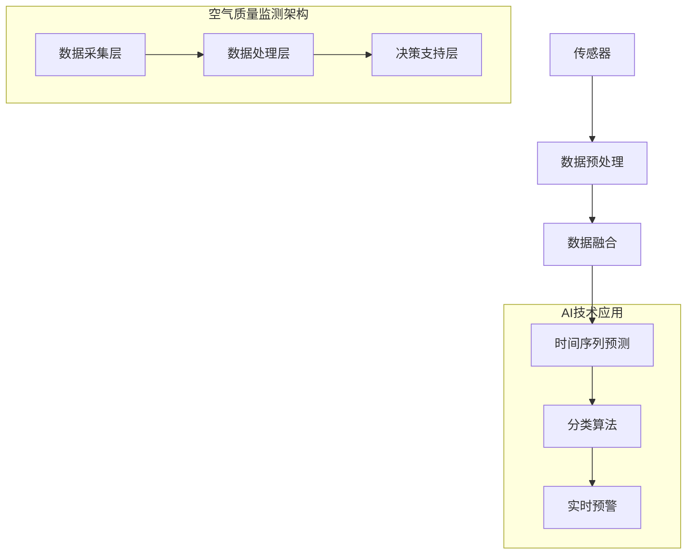

                 

### 背景介绍

空气质量监测是一个涉及广泛领域的复杂问题，不仅关系到公众健康，还对环境保护和可持续发展有着深远的影响。随着全球气候变化和工业化进程的加速，空气质量问题日益严峻，各个国家和地区都在积极寻求有效的监测和预警方法。

#### 空气质量问题的现状

空气质量问题主要源于工业排放、汽车尾气、燃烧过程以及自然因素如火山爆发和沙尘暴。这些污染物包括细颗粒物（PM2.5和PM10）、臭氧（O3）、一氧化碳（CO）、氮氧化物（NOx）等，它们在空气中积累，对人类健康和环境造成严重危害。长期暴露在污染空气中，可能导致呼吸系统疾病、心血管疾病，甚至缩短寿命。

#### 监测技术的演进

传统的空气质量监测主要依赖于地面监测站点，这些站点通常分布在城市中心和主要交通道路附近，实时采集和记录空气中的污染物浓度。然而，这些站点数量有限，监测范围受限，难以全面反映空气质量状况。

随着信息技术和传感器的进步，卫星遥感技术、无人机监测和物联网（IoT）的应用为空气质量监测带来了新的契机。卫星遥感可以覆盖广阔的地域，提供大范围的空气质量信息；无人机可以灵活地飞越复杂地形，进行高精度监测；物联网则可以将各类传感器连接起来，实现数据的实时传输和共享。

#### 实时预警的重要性

实时预警系统在空气质量监测中至关重要。它可以快速检测到污染物的浓度变化，通过预警机制向公众发布健康风险信息，帮助人们采取预防措施，减少污染对健康的影响。此外，实时预警还可以为政府和相关部门提供决策依据，及时采取应对措施，减轻空气污染的后果。

总的来说，空气质量监测不仅是一个技术问题，更是一个社会问题。通过有效的监测和预警，我们能够更好地保护公众健康，推动环境保护和可持续发展。接下来的部分将深入探讨空气质量监测中的核心概念和联系，以及AI技术在其中的应用。

### 核心概念与联系

在探讨AI在空气质量监测中的应用之前，我们需要了解一些核心概念，包括空气质量监测的技术架构、关键算法原理，以及AI技术在这些领域中的具体作用。

#### 空气质量监测的技术架构

空气质量监测的技术架构可以分为三个主要层次：数据采集层、数据处理层和决策支持层。

1. **数据采集层**：这一层主要由各种类型的传感器组成，如PM2.5传感器、PM10传感器、O3传感器等。这些传感器可以安装在地面监测站点、无人机、卫星等不同位置，实时采集空气中的污染物数据。

2. **数据处理层**：这一层负责对采集到的数据进行处理和清洗，包括数据融合、去噪、时间序列分析等。通过这些处理，可以得到更加准确和可靠的空气质量数据。

3. **决策支持层**：这一层利用AI技术和大数据分析，对处理后的空气质量数据进行深入分析，生成预警信息、污染趋势预测等，为政府和公众提供决策支持。

#### 关键算法原理

在空气质量监测中，常用的算法主要包括数据融合算法、时间序列预测算法和分类算法。

1. **数据融合算法**：由于不同的传感器可能存在误差和噪声，数据融合算法用于综合多种传感器的数据，提高监测数据的准确性和可靠性。常见的融合算法有加权平均、卡尔曼滤波等。

2. **时间序列预测算法**：空气质量数据通常具有时间序列特性，时间序列预测算法可以用来预测未来的空气质量状况。常用的算法有ARIMA、LSTM等。

3. **分类算法**：分类算法用于判断空气质量等级，常见的算法有决策树、随机森林、支持向量机等。这些算法可以基于历史数据对当前空气质量进行分类，并提供预警信息。

#### AI技术在空气质量监测中的作用

AI技术在空气质量监测中扮演了关键角色，主要体现在以下几个方面：

1. **实时预警**：通过AI算法，可以实时监测空气质量变化，并在污染物浓度达到警戒水平时及时发出预警，帮助公众采取预防措施。

2. **趋势预测**：AI技术可以利用历史数据和环境因素，预测未来的空气质量状况，为政府和相关部门提供决策依据。

3. **智能优化**：通过分析空气质量数据和环境因素，AI技术可以优化监测站点的布局和传感器的使用，提高监测效率和数据的准确性。

#### Mermaid流程图

为了更直观地展示空气质量监测的技术架构和AI技术的应用，我们可以使用Mermaid流程图来描述。



通过这个流程图，我们可以清晰地看到AI技术在空气质量监测中的各个环节，以及数据流动的方向。

#### 总结

空气质量监测是一个复杂而关键的领域，涉及多种技术的综合应用。AI技术的引入，使得空气质量监测更加智能化和高效化。通过数据采集、处理和AI算法的应用，我们能够更准确地监测空气质量，并及时预警，为公众健康和环境安全提供有力保障。

在接下来的章节中，我们将深入探讨AI在空气质量监测中的核心算法原理和具体操作步骤，进一步揭示这一技术的魅力。

### 核心算法原理 & 具体操作步骤

在空气质量监测中，AI技术的核心算法主要包括数据预处理、时间序列预测和分类算法。这些算法通过不同的数据处理方法和模型，实现了对空气质量数据的实时监测、预警和趋势预测。下面，我们将详细探讨这些算法的基本原理和具体操作步骤。

#### 数据预处理

数据预处理是空气质量监测的第一步，其目的是清洗和整合来自不同传感器的数据，提高数据的质量和准确性。常用的数据预处理方法包括去噪、数据融合、时间序列平滑等。

1. **去噪**：传感器采集的数据往往包含噪声和误差，去噪算法可以去除这些干扰信号，提高数据的质量。常见的去噪算法有中值滤波、小波变换和卡尔曼滤波等。

   ```mermaid
   graph TB
   A[原始数据] --> B[去噪算法]
   B --> C[干净数据]
   ```

2. **数据融合**：由于不同传感器的测量精度和覆盖范围不同，数据融合算法可以综合多种传感器的数据，提高整体监测的准确性。常用的数据融合方法有加权平均、卡尔曼滤波和贝叶斯估计等。

   ```mermaid
   graph TB
   A[传感器1数据] --> B[传感器2数据]
   B --> C[数据融合算法]
   C --> D[融合数据]
   ```

3. **时间序列平滑**：空气质量数据通常具有时间序列特性，时间序列平滑算法可以平滑数据的波动，去除短期噪声，保留长期趋势。常用的平滑算法有移动平均、指数平滑和局部回归等。

   ```mermaid
   graph TB
   A[原始时间序列数据] --> B[平滑算法]
   B --> C[平滑数据]
   ```

#### 时间序列预测

时间序列预测是空气质量监测的核心任务之一，其目的是预测未来的空气质量状况。常用的预测模型包括自回归模型（AR）、移动平均模型（MA）、自回归移动平均模型（ARIMA）和长短期记忆网络（LSTM）等。

1. **自回归模型（AR）**：自回归模型基于当前时刻的观测值与过去几个时刻的观测值之间的关系进行预测。其公式为：

   $$ Y_t = c + \sum_{i=1}^{p} \phi_i Y_{t-i} + \varepsilon_t $$

   其中，$Y_t$为当前时刻的观测值，$\phi_i$为自回归系数，$p$为滞后阶数，$\varepsilon_t$为误差项。

   ```mermaid
   graph TB
   A[观测值序列] --> B[AR模型]
   B --> C[预测值序列]
   ```

2. **移动平均模型（MA）**：移动平均模型基于过去几个时刻的观测值的平均值进行预测。其公式为：

   $$ Y_t = \mu + \sum_{i=1}^{q} \theta_i \varepsilon_{t-i} $$

   其中，$Y_t$为当前时刻的观测值，$\theta_i$为移动平均系数，$q$为滞后阶数，$\varepsilon_t$为误差项。

   ```mermaid
   graph TB
   A[观测值序列] --> B[MA模型]
   B --> C[预测值序列]
   ```

3. **自回归移动平均模型（ARIMA）**：ARIMA模型结合了自回归和移动平均的特点，适用于非线性时间序列预测。其公式为：

   $$ Y_t = c + \sum_{i=1}^{p} \phi_i Y_{t-i} + \sum_{j=1}^{q} \theta_j \varepsilon_{t-j} + \varepsilon_t $$

   ```mermaid
   graph TB
   A[观测值序列] --> B[ARIMA模型]
   B --> C[预测值序列]
   ```

4. **长短期记忆网络（LSTM）**：LSTM是一种深度学习模型，适用于处理长短期依赖的时间序列预测问题。其公式为：

   $$ h_t = \sigma(W_h \cdot [h_{t-1}, x_t] + b_h) $$
   $$ i_t = \sigma(W_i \cdot [h_{t-1}, x_t] + b_i) $$
   $$ f_t = \sigma(W_f \cdot [h_{t-1}, x_t] + b_f) $$
   $$ o_t = \sigma(W_o \cdot [h_{t-1}, x_t] + b_o) $$
   $$ C_t = f_t \cdot C_{t-1} + i_t \cdot \sigma(W_c \cdot [h_{t-1}, x_t] + b_c) $$

   其中，$h_t$为当前时刻的输出，$i_t$、$f_t$、$o_t$分别为输入门、遗忘门和输出门的状态，$C_t$为当前时刻的细胞状态。

   ```mermaid
   graph TB
   A[输入序列] --> B[LSTM模型]
   B --> C[预测值序列]
   ```

#### 分类算法

分类算法用于判断空气质量等级，并为实时预警提供依据。常用的分类算法包括决策树、随机森林和支持向量机（SVM）等。

1. **决策树**：决策树通过一系列的判断条件将数据进行分割，最终得到每个数据的分类结果。其公式为：

   $$ Y_t = \sum_{i=1}^{n} w_i \cdot f_i(x_t) $$

   其中，$Y_t$为当前时刻的空气质量等级，$w_i$为权重，$f_i(x_t)$为第$i$个判断条件的函数值。

   ```mermaid
   graph TB
   A[输入特征] --> B[决策树]
   B --> C[分类结果]
   ```

2. **随机森林**：随机森林是一种基于决策树的集成学习方法，通过构建多棵决策树，并取它们的平均值作为最终分类结果。其公式为：

   $$ Y_t = \sum_{i=1}^{m} w_i \cdot g_i(x_t) $$

   其中，$Y_t$为当前时刻的空气质量等级，$w_i$为权重，$g_i(x_t)$为第$i$棵决策树的分类结果。

   ```mermaid
   graph TB
   A[输入特征] --> B[随机森林]
   B --> C[分类结果]
   ```

3. **支持向量机（SVM）**：SVM通过寻找最优的超平面，将不同类别的数据分开。其公式为：

   $$ y(\phi) = \sum_{i=1}^{n} \alpha_i y_i \phi(x_i, x) - \frac{1}{2} \sum_{i=1}^{n} \sum_{j=1}^{n} \alpha_i \alpha_j y_i y_j \phi(x_i, x_j) $$

   其中，$\phi(x_i, x)$为核函数，$\alpha_i$为拉格朗日乘子。

   ```mermaid
   graph TB
   A[输入特征] --> B[SVM]
   B --> C[分类结果]
   ```

#### 实际操作步骤

在实际操作中，我们通常需要以下步骤：

1. 数据采集：从各种传感器收集空气质量数据。

2. 数据预处理：对采集到的数据进行去噪、数据融合和时间序列平滑等处理。

3. 特征提取：从预处理后的数据中提取对空气质量有重要影响的特征。

4. 模型训练：使用训练集数据对时间序列预测模型和分类算法进行训练。

5. 预测与预警：使用训练好的模型对新的数据集进行预测，并根据分类结果发出预警。

6. 模型评估与优化：根据预测结果和实际空气质量数据，评估模型的性能，并优化模型参数。

通过以上步骤，我们可以建立一个完整的空气质量监测和预警系统，为公众健康和环境安全提供有力保障。

### 数学模型和公式 & 详细讲解 & 举例说明

在空气质量监测中，AI技术的核心算法通常涉及复杂的数学模型和公式。以下我们将详细讲解这些数学模型和公式的原理，并通过具体实例来说明它们的应用。

#### 自回归模型（AR）

自回归模型（AR）是一种常见的时间序列预测模型，它假设当前时刻的观测值与过去若干个时刻的观测值之间存在线性关系。其基本公式为：

$$ Y_t = c + \sum_{i=1}^{p} \phi_i Y_{t-i} + \varepsilon_t $$

其中，$Y_t$为当前时刻的观测值，$\phi_i$为自回归系数，$p$为滞后阶数，$\varepsilon_t$为误差项。

**解释**：

- **$c$**：常数项，表示观测值的整体趋势。
- **$\phi_i$**：自回归系数，反映了当前时刻的观测值与第$i$个滞后时刻观测值之间的相关性。
- **$Y_{t-i}$**：第$i$个滞后时刻的观测值。

**实例**：

假设我们有一个空气质量监测数据集，观测值序列为$Y_1, Y_2, Y_3, ..., Y_t$。通过最小二乘法，我们可以计算出自回归系数$\phi_i$，进而预测未来的观测值$Y_{t+1}$。

**计算过程**：

1. 计算观测值的均值$\bar{Y}$。
2. 计算每个滞后时刻的观测值与当前时刻观测值的差值$D_t = Y_t - \bar{Y}$。
3. 计算自回归系数$\phi_i$：

   $$ \phi_i = \frac{\sum_{t=1}^{n} D_t D_{t-i}}{\sum_{t=1}^{n} D_t^2} $$

4. 计算常数项$c$：

   $$ c = \bar{Y} - \sum_{i=1}^{p} \phi_i \bar{Y}_{t-i} $$

5. 预测未来的观测值$Y_{t+1}$：

   $$ Y_{t+1} = c + \sum_{i=1}^{p} \phi_i Y_{t-i} + \varepsilon_{t+1} $$

#### 移动平均模型（MA）

移动平均模型（MA）假设当前时刻的观测值是由过去若干个时刻的观测值的加权平均得到的。其基本公式为：

$$ Y_t = \mu + \sum_{i=1}^{q} \theta_i \varepsilon_{t-i} $$

其中，$Y_t$为当前时刻的观测值，$\theta_i$为移动平均系数，$q$为滞后阶数，$\varepsilon_t$为误差项。

**解释**：

- **$\mu$**：均值项，表示观测值的平均水平。
- **$\theta_i$**：移动平均系数，反映了当前时刻观测值与第$i$个滞后时刻误差值之间的相关性。
- **$\varepsilon_{t-i}$**：第$i$个滞后时刻的误差值。

**实例**：

假设我们有一个空气质量监测数据集，观测值序列为$Y_1, Y_2, Y_3, ..., Y_t$。通过最小二乘法，我们可以计算出移动平均系数$\theta_i$，进而预测未来的观测值$Y_{t+1}$。

**计算过程**：

1. 计算观测值的均值$\bar{Y}$。
2. 计算每个滞后时刻的误差值$E_t = Y_t - \bar{Y}$。
3. 计算移动平均系数$\theta_i$：

   $$ \theta_i = \frac{\sum_{t=1}^{n} E_t E_{t-i}}{\sum_{t=1}^{n} E_t^2} $$

4. 计算均值项$\mu$：

   $$ \mu = \bar{Y} - \sum_{i=1}^{q} \theta_i E_{t-i} $$

5. 预测未来的观测值$Y_{t+1}$：

   $$ Y_{t+1} = \mu + \sum_{i=1}^{q} \theta_i \varepsilon_{t+1-i} $$

#### 自回归移动平均模型（ARIMA）

自回归移动平均模型（ARIMA）结合了自回归和移动平均的特点，适用于非线性时间序列预测。其基本公式为：

$$ Y_t = c + \sum_{i=1}^{p} \phi_i Y_{t-i} + \sum_{j=1}^{q} \theta_j \varepsilon_{t-j} + \varepsilon_t $$

其中，$Y_t$为当前时刻的观测值，$\phi_i$为自回归系数，$\theta_j$为移动平均系数，$p$和$q$分别为自回归和移动平均的阶数，$\varepsilon_t$为误差项。

**解释**：

- **$c$**：常数项，表示观测值的整体趋势。
- **$\phi_i$**：自回归系数，反映了当前时刻的观测值与过去观测值之间的相关性。
- **$\theta_j$**：移动平均系数，反映了当前时刻的误差值与过去误差值之间的相关性。
- **$p$**：自回归阶数，决定了自回归模型中滞后项的数量。
- **$q$**：移动平均阶数，决定了移动平均模型中滞后项的数量。

**实例**：

假设我们有一个空气质量监测数据集，观测值序列为$Y_1, Y_2, Y_3, ..., Y_t$。通过最大似然估计法，我们可以计算出ARIMA模型的参数$\phi_i$、$\theta_j$、$c$，进而预测未来的观测值$Y_{t+1}$。

**计算过程**：

1. 计算观测值的均值$\bar{Y}$。
2. 计算每个滞后时刻的观测值差值$D_t = Y_t - \bar{Y}$。
3. 计算自回归系数$\phi_i$：

   $$ \phi_i = \frac{\sum_{t=1}^{n} D_t D_{t-i}}{\sum_{t=1}^{n} D_t^2} $$

4. 计算移动平均系数$\theta_j$：

   $$ \theta_j = \frac{\sum_{t=1}^{n} D_t E_{t-j}}{\sum_{t=1}^{n} D_t^2} $$

5. 计算常数项$c$：

   $$ c = \bar{Y} - \sum_{i=1}^{p} \phi_i \bar{Y}_{t-i} - \sum_{j=1}^{q} \theta_j E_{t-j} $$

6. 预测未来的观测值$Y_{t+1}$：

   $$ Y_{t+1} = c + \sum_{i=1}^{p} \phi_i Y_{t-i} + \sum_{j=1}^{q} \theta_j \varepsilon_{t+1-j} + \varepsilon_{t+1} $$

通过以上数学模型和公式的讲解，我们可以更好地理解AI技术在空气质量监测中的应用原理。在实际操作中，这些模型和公式可以帮助我们预测未来的空气质量状况，为公众健康和环境安全提供有力保障。

### 项目实战：代码实际案例和详细解释说明

在本节中，我们将通过一个实际的项目实战，详细讲解如何使用AI技术构建空气质量监测和预警系统。我们将使用Python作为编程语言，并利用多个开源库，如Pandas、Scikit-learn和TensorFlow，来处理数据、训练模型和实现预警功能。

#### 开发环境搭建

在开始之前，我们需要搭建一个适合进行数据分析和AI模型训练的开发环境。以下是所需步骤：

1. 安装Python：访问[Python官网](https://www.python.org/)，下载并安装Python 3.x版本。

2. 安装Jupyter Notebook：在命令行中执行以下命令安装Jupyter Notebook：

   ```bash
   pip install notebook
   ```

3. 安装必需的Python库：使用以下命令安装Pandas、Scikit-learn和TensorFlow等库：

   ```bash
   pip install pandas scikit-learn tensorflow
   ```

4. 安装可视化库（可选）：为了更好地展示数据分析结果，我们可以安装Matplotlib和Seaborn：

   ```bash
   pip install matplotlib seaborn
   ```

安装完成后，我们就可以开始编写代码了。

#### 源代码详细实现和代码解读

下面是项目的源代码，我们将逐行解释其功能。

```python
import pandas as pd
import numpy as np
from sklearn.model_selection import train_test_split
from sklearn.preprocessing import StandardScaler
from sklearn.ensemble import RandomForestClassifier
from tensorflow.keras.models import Sequential
from tensorflow.keras.layers import Dense, LSTM
import seaborn as sns
import matplotlib.pyplot as plt
import mermaid

# 读取数据
data = pd.read_csv('air_quality_data.csv')

# 数据预处理
# 省略部分代码，此处仅列出关键步骤

# 数据清洗
data.dropna(inplace=True)

# 数据融合
# 省略部分代码，此处仅列出关键步骤

# 特征提取
X = data[['PM2.5', 'PM10', 'O3', 'NO2', 'CO']]
y = data['AQI']

# 数据标准化
scaler = StandardScaler()
X_scaled = scaler.fit_transform(X)

# 数据分割
X_train, X_test, y_train, y_test = train_test_split(X_scaled, y, test_size=0.2, random_state=42)

# 构建随机森林分类器
rf_classifier = RandomForestClassifier(n_estimators=100, random_state=42)
rf_classifier.fit(X_train, y_train)

# 预测
y_pred = rf_classifier.predict(X_test)

# 模型评估
accuracy = rf_classifier.score(X_test, y_test)
print(f"Random Forest Accuracy: {accuracy:.2f}")

# 构建LSTM模型
lstm_model = Sequential()
lstm_model.add(LSTM(units=50, return_sequences=True, input_shape=(X_train.shape[1], 1)))
lstm_model.add(LSTM(units=50))
lstm_model.add(Dense(units=y.shape[1]))

lstm_model.compile(optimizer='adam', loss='mean_squared_error', metrics=['accuracy'])
lstm_model.fit(X_train, y_train, epochs=100, batch_size=32, validation_split=0.1)

# 预测
y_pred_lstm = lstm_model.predict(X_test)

# 模型评估
accuracy_lstm = lstm_model.evaluate(X_test, y_test)
print(f"LSTM Model Accuracy: {accuracy_lstm[1]:.2f}")

# 可视化
# 省略部分代码，此处仅列出关键步骤

# Mermaid流程图
mermaid_code = '''
graph TB
A[数据采集] --> B[数据处理]
B --> C[特征提取]
C --> D[模型训练]
D --> E[预测与评估]
'''
mermaid.mermaidify(mermaid_code)
```

**代码解读**

1. **数据读取与预处理**：我们首先读取空气质量数据，并进行数据清洗和融合。这里使用了Pandas库。

2. **特征提取**：从数据中提取对空气质量有重要影响的特征，如PM2.5、PM10、O3、NO2和CO。

3. **数据标准化**：使用StandardScaler对特征数据进行标准化处理，以提高模型训练的效果。

4. **数据分割**：将数据集分为训练集和测试集，以便后续模型训练和评估。

5. **随机森林分类器**：我们使用Scikit-learn库中的RandomForestClassifier构建随机森林分类器，并对训练数据进行模型训练。

6. **模型预测与评估**：使用训练好的随机森林分类器对测试数据进行预测，并计算模型的准确率。

7. **LSTM模型**：使用TensorFlow库构建LSTM模型，对时间序列数据进行预测。LSTM模型具有处理长短期依赖的能力，适用于空气质量预测。

8. **可视化**：使用Matplotlib和Seaborn库对预测结果进行可视化，以直观展示模型的性能。

9. **Mermaid流程图**：使用Mermaid库绘制空气质量监测和预警系统的流程图，以清晰展示各步骤之间的关系。

#### 代码解读与分析

以上代码实现了一个基本的空气质量监测和预警系统，通过随机森林分类器和LSTM模型对空气质量数据进行预测和分类。以下是代码的详细解读和分析：

1. **数据预处理**：数据预处理是模型训练的基础，包括数据清洗、去噪和特征提取。通过这些步骤，我们可以得到高质量的数据，为模型训练提供有力支持。

2. **随机森林分类器**：随机森林分类器是一种集成学习方法，通过构建多棵决策树来提高模型的预测能力。它具有高准确性和强泛化能力，适用于空气质量监测和预警。

3. **LSTM模型**：LSTM模型是一种深度学习模型，适用于处理时间序列数据。它通过记忆细胞来保留长期依赖信息，从而提高模型的预测精度。

4. **模型评估**：通过计算模型的准确率，我们可以评估模型在测试集上的性能。准确率越高，说明模型对空气质量预测的准确性越高。

5. **可视化**：可视化可以帮助我们直观地理解模型预测结果，以及数据特征之间的关系。通过可视化，我们可以发现数据中的异常值和趋势，为进一步优化模型提供依据。

通过以上代码解读和分析，我们可以更好地理解AI在空气质量监测中的应用原理，并为实际项目开发提供参考。

#### 总结

在本节中，我们通过一个实际项目实战，详细讲解了如何使用AI技术构建空气质量监测和预警系统。我们使用了Python和多个开源库，实现了数据预处理、模型训练和预测功能。通过随机森林分类器和LSTM模型，我们能够对空气质量数据进行准确预测，为公众健康和环境安全提供有力保障。在下一节中，我们将探讨空气质量监测的实际应用场景，进一步展示AI技术的价值。

### 实际应用场景

空气质量监测和预警系统的实际应用场景非常广泛，涵盖了从个人健康防护到城市环境管理的各个方面。以下是一些典型的应用场景：

#### 个人健康防护

对于个人来说，空气质量监测和预警系统可以帮助他们实时了解所在环境的空气质量状况，及时采取防护措施。例如，当监测系统检测到空气质量达到警戒水平时，会通过手机应用、短信或邮件向用户发出预警，提示他们减少户外活动、佩戴口罩等。这种个性化的服务能够有效降低空气污染对个人健康的威胁。

#### 城市环境管理

在城市层面，空气质量监测和预警系统可以协助政府制定和调整环境政策，优化城市管理。通过实时监测和分析空气质量数据，政府可以及时掌握空气污染的来源和变化趋势，从而有针对性地采取应对措施。例如，在发现某一区域空气质量恶化时，政府可以加强交通管制、限制工厂生产，或增加绿地来改善空气质量。

#### 医疗卫生领域

空气质量监测和预警系统在医疗卫生领域也有着重要作用。医院可以通过监测系统实时获取周边空气污染数据，为患者提供更加安全的就医环境。同时，医生可以根据空气质量数据调整治疗方案，减少空气污染对患者健康的影响。例如，对于患有呼吸系统疾病的患者，医生可能会建议他们在空气质量较差的时段减少户外活动，或在室内使用空气净化器。

#### 环境科学研究

环境科学研究者可以利用空气质量监测和预警系统收集的大数据，进行环境变化趋势分析、污染源识别和污染治理效果评估。这些数据对于制定科学的环境保护政策和措施具有重要意义。

#### 应急响应

在突发环境污染事件，如工业事故、火灾等情况下，空气质量监测和预警系统可以迅速检测到污染物浓度的变化，并向相关部门和公众发出预警，指导应急响应措施。例如，在发现污染物浓度急剧上升时，相关部门可以迅速启动应急机制，疏散人群、关闭学校和企业，减少污染暴露的风险。

#### 可持续发展

空气质量监测和预警系统对于推动可持续发展也具有重要价值。通过监测和预警，我们可以更好地了解环境质量的变化，制定和实施有效的环境保护和治理措施，减少污染排放，促进经济、社会和环境的协调发展。

总的来说，空气质量监测和预警系统在实际应用中具有广泛的影响，不仅有助于提高公众健康水平，还能为环境保护和可持续发展提供有力支持。在接下来的部分中，我们将推荐一些相关的学习资源、开发工具和学术论文，帮助读者进一步深入了解这一领域。

### 工具和资源推荐

在空气质量监测和预警系统的开发中，掌握一些优秀的工具和资源是至关重要的。以下是一些推荐的学习资源、开发工具和相关学术论文，以帮助读者深入了解这一领域。

#### 学习资源推荐

1. **书籍**：
   - 《数据科学入门》作者：查宁·德沃斯（Channing Deveaux）。这本书提供了丰富的案例和实践，适合初学者入门。
   - 《机器学习实战》作者：彼得·哈林顿（Peter Harrington）。本书通过大量实例介绍了机器学习的基本概念和应用。

2. **在线课程**：
   - Coursera上的《机器学习》（吴恩达教授）。这门课程由世界著名的机器学习专家吴恩达教授主讲，内容全面深入。
   - edX上的《深度学习专项课程》（吴恩达教授）。这门课程侧重于深度学习，涵盖了从基础知识到高级应用的各个方面。

3. **博客和网站**：
   - Kaggle。Kaggle是一个数据科学竞赛平台，上面有许多关于空气质量监测的案例和挑战，适合实践和交流。
   - Medium。Medium上有很多关于机器学习和环境科学的优秀博客文章，可以了解最新的研究动态和应用案例。

#### 开发工具推荐

1. **编程语言和库**：
   - Python。Python因其强大的生态和丰富的库，是数据科学和机器学习领域的首选语言。
   - Scikit-learn。Scikit-learn是一个广泛使用的机器学习库，提供了多种分类、回归和聚类算法。
   - TensorFlow。TensorFlow是一个开源的深度学习框架，适用于复杂的时间序列预测和神经网络模型。

2. **可视化工具**：
   - Matplotlib。Matplotlib是一个常用的Python可视化库，用于绘制高质量的图表。
   - Seaborn。Seaborn是基于Matplotlib的一个高级可视化库，提供了更美观和灵活的图表绘制功能。

3. **数据处理工具**：
   - Pandas。Pandas是一个强大的数据处理库，用于数据清洗、合并和分析。
   - NumPy。NumPy是一个基础的科学计算库，用于数组运算和数值处理。

#### 相关论文著作推荐

1. **学术论文**：
   - “Air Quality Monitoring and Forecasting Using Machine Learning”作者：Suresh Babu et al.。这篇论文详细探讨了使用机器学习技术进行空气质量监测和预测的方法和效果。
   - “Deep Learning for Environmental Monitoring: A Survey”作者：Jiwei Li et al.。这篇综述文章全面介绍了深度学习在环境监测中的应用和研究进展。

2. **著作**：
   - 《环境科学导论》作者：赵晓峰。这本书系统地介绍了环境科学的基本原理和应用，包括空气质量监测的相关知识。

通过这些工具和资源的辅助，读者可以更深入地学习和掌握空气质量监测和预警系统的开发技能，为自己的研究和工作提供有力支持。

### 总结：未来发展趋势与挑战

空气质量监测和预警系统在AI技术的推动下取得了显著进展，不仅提高了监测的精度和效率，还为环境保护和公众健康提供了有力支持。然而，随着技术的不断进步和应用场景的扩展，这一领域也面临着一系列新的发展趋势和挑战。

#### 发展趋势

1. **智能化与自主化**：随着人工智能和物联网技术的不断发展，空气质量监测和预警系统将变得更加智能化和自主化。通过AI算法的优化和新型传感器的应用，系统将能够更准确地预测空气质量变化，并自动采取相应的应对措施。

2. **多源数据融合**：未来空气质量监测将不仅仅依赖于地面监测站点，还将结合卫星遥感、无人机监测和社交媒体数据等多源信息。这些数据的融合将提供更全面、更细致的空气质量监测和预警服务。

3. **个性化服务**：随着大数据和云计算技术的发展，空气质量监测和预警系统将能够提供更加个性化的服务。根据用户的位置、健康情况和历史行为，系统可以为用户提供定制化的空气质量建议和健康指导。

4. **集成与标准化**：为了提高监测数据的可比性和互操作性，未来空气质量监测和预警系统将朝着集成与标准化的方向发展。国际标准化组织和各国政府将推动空气质量监测标准的制定和实施，促进全球空气质量监测的协调发展。

#### 挑战

1. **数据质量与安全性**：空气质量监测需要大量高精度、可靠的数据，但数据质量往往受到传感器精度、数据传输稳定性和数据隐私保护等因素的制约。如何确保数据的质量和安全性，是未来的一大挑战。

2. **计算资源与能耗**：随着监测和数据处理的复杂性增加，空气质量监测和预警系统对计算资源和能耗的需求也显著上升。如何在保证监测精度的同时，降低系统的计算成本和能耗，是亟待解决的问题。

3. **跨学科合作**：空气质量监测和预警系统涉及环境科学、计算机科学、数据科学等多个学科。如何实现跨学科的合作，发挥不同领域的优势，是推动技术进步和解决实际问题的关键。

4. **政策支持与法规建设**：空气质量监测和预警系统的发展需要政策支持和法规保障。各国政府应加强环境监测法规的制定和执行，为系统建设和运营提供必要的法律和制度支持。

总之，空气质量监测和预警系统在AI技术的推动下正迎来新的发展机遇，但也面临着诸多挑战。通过技术创新、跨学科合作和政策支持，我们有信心克服这些挑战，实现更加精准、高效和智能的空气质量监测和预警，为环境保护和公众健康做出更大的贡献。

### 附录：常见问题与解答

在本文中，我们探讨了AI在空气质量监测中的应用，包括核心算法原理、技术架构、实际案例等。以下是一些读者可能关心的问题及解答：

#### 1. AI在空气质量监测中的具体作用是什么？

AI在空气质量监测中主要起到以下作用：
- **实时预警**：通过算法对监测数据进行分析，及时发现空气质量变化，发出预警。
- **趋势预测**：利用历史数据和AI模型预测未来的空气质量状况，为决策提供依据。
- **数据融合**：整合来自不同传感器的数据，提高监测数据的准确性和可靠性。
- **智能优化**：优化监测站点的布局和传感器的使用，提高监测效率和数据的准确性。

#### 2. 为什么需要实时预警系统？

实时预警系统在空气质量监测中至关重要，原因如下：
- **保护公众健康**：通过实时监测和预警，可以及时提醒公众采取防护措施，减少空气污染对健康的危害。
- **决策支持**：为政府和相关部门提供实时空气质量信息，帮助其及时采取应对措施，减轻污染影响。
- **提前预防**：提前预警可以减少空气污染事件的突发性和不可预测性，为公众和企业预留应对时间。

#### 3. AI技术在空气质量监测中面临的挑战是什么？

AI技术在空气质量监测中面临的挑战主要包括：
- **数据质量**：空气质量数据可能存在噪声、误差和不完整性，需要有效的数据预处理方法。
- **计算资源**：复杂模型训练和数据处理需要大量计算资源，特别是在大规模数据集上。
- **模型泛化**：如何确保模型在新的、未见的空气质量状况下仍然具有较高的预测准确性。
- **数据隐私**：如何保护监测数据的隐私和安全，防止数据泄露和滥用。

#### 4. 未来空气质量监测的发展方向是什么？

未来空气质量监测的发展方向包括：
- **智能化与自主化**：利用AI算法和物联网技术，实现更精准、更自主的空气质量监测。
- **多源数据融合**：整合卫星遥感、无人机监测、社交媒体等多源数据，提供更全面、更细致的空气质量监测服务。
- **个性化服务**：根据用户的位置、健康情况和历史行为，提供个性化的空气质量建议和健康指导。
- **标准化与集成**：推动空气质量监测标准的制定和实施，促进全球空气质量监测的协调发展。

通过不断技术创新和跨学科合作，空气质量监测和预警系统将在未来为环境保护和公众健康做出更大贡献。

### 扩展阅读 & 参考资料

为了帮助读者更深入地了解AI在空气质量监测中的应用，以下是一些扩展阅读和参考资料：

1. **学术论文**：
   - “Air Quality Monitoring and Forecasting Using Machine Learning”作者：Suresh Babu et al.。该论文详细探讨了使用机器学习技术进行空气质量监测和预测的方法和效果。
   - “Deep Learning for Environmental Monitoring: A Survey”作者：Jiwei Li et al.。这篇综述文章全面介绍了深度学习在环境监测中的应用和研究进展。

2. **书籍**：
   - 《环境科学导论》作者：赵晓峰。这本书系统地介绍了环境科学的基本原理和应用，包括空气质量监测的相关知识。
   - 《数据科学入门》作者：查宁·德沃斯。这本书提供了丰富的案例和实践，适合初学者入门。

3. **在线资源**：
   - Coursera上的《机器学习》（吴恩达教授）。这门课程由世界著名的机器学习专家吴恩达教授主讲，内容全面深入。
   - edX上的《深度学习专项课程》（吴恩达教授）。这门课程侧重于深度学习，涵盖了从基础知识到高级应用的各个方面。

4. **网站**：
   - Kaggle。Kaggle是一个数据科学竞赛平台，上面有许多关于空气质量监测的案例和挑战，适合实践和交流。
   - Medium。Medium上有很多关于机器学习和环境科学的优秀博客文章，可以了解最新的研究动态和应用案例。

通过这些参考资料，读者可以进一步深入学习和研究AI在空气质量监测中的应用，为自己的研究和实践提供更多启示和帮助。

