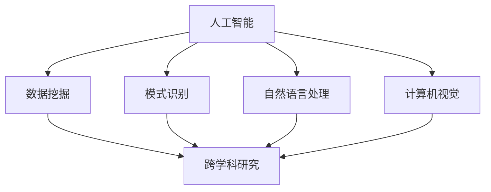

                 

# AI在跨学科研究中的应用前景

> **关键词**：人工智能，跨学科研究，应用前景，核心算法，数学模型，项目实战，工具推荐
> 
> **摘要**：本文将从背景介绍、核心概念与联系、核心算法原理与操作步骤、数学模型与公式、项目实战、实际应用场景、工具和资源推荐以及未来发展趋势与挑战等方面，详细探讨人工智能在跨学科研究中的应用前景，旨在为研究人员和开发者提供有价值的参考和指导。

## 1. 背景介绍

在当今快速发展的科技时代，人工智能（AI）已经成为推动社会进步的重要力量。随着计算能力的提高和数据量的爆炸式增长，人工智能技术在各个领域取得了显著的成果。然而，随着问题的复杂性和多样性增加，传统的单一学科研究方法已经无法满足解决现实问题的需求。跨学科研究作为一种新兴的研究模式，通过整合不同领域的知识和方法，为解决复杂问题提供了新的思路和途径。

跨学科研究的兴起与人工智能技术的快速发展密切相关。人工智能技术在数据挖掘、模式识别、自然语言处理、计算机视觉等方面的突破，为跨学科研究提供了强大的工具和手段。同时，跨学科研究也为人工智能技术的应用提供了丰富的场景和需求，推动了人工智能技术的进一步发展。

本文旨在探讨人工智能在跨学科研究中的应用前景，通过分析核心概念与联系、核心算法原理与操作步骤、数学模型与公式、项目实战、实际应用场景、工具和资源推荐以及未来发展趋势与挑战等方面，为研究人员和开发者提供有价值的参考和指导。

## 2. 核心概念与联系

在探讨人工智能在跨学科研究中的应用之前，有必要首先了解相关核心概念和它们之间的联系。

### 2.1 人工智能

人工智能是指使计算机具有人类智能特性的技术。它包括机器学习、深度学习、自然语言处理、计算机视觉等多个子领域。人工智能技术通过学习和模仿人类的思维方式，使计算机能够自动完成特定任务，从而提高工作效率和准确性。

### 2.2 跨学科研究

跨学科研究是指将不同学科的知识和理论进行整合，以解决复杂问题的研究方法。跨学科研究不仅关注某一特定领域的问题，还关注不同领域之间的相互联系和作用，从而提供更全面的解决方案。

### 2.3 核心概念之间的联系

人工智能与跨学科研究之间存在密切的联系。人工智能技术为跨学科研究提供了强大的工具和手段，如数据挖掘、模式识别、自然语言处理、计算机视觉等。这些技术可以帮助研究人员从大量数据中提取有用信息，发现潜在规律和模式，从而为跨学科研究提供支持。

同时，跨学科研究也为人工智能技术的应用提供了丰富的场景和需求。通过整合不同领域的知识和方法，跨学科研究可以提出更具挑战性和创新性的问题，为人工智能技术提供更多的应用场景和需求。

下面是核心概念与联系的 Mermaid 流程图：



## 3. 核心算法原理 & 具体操作步骤

在探讨人工智能在跨学科研究中的应用时，核心算法原理和具体操作步骤是至关重要的。以下是一些常见的核心算法及其原理和操作步骤：

### 3.1 机器学习

机器学习是一种使计算机通过数据学习并改进性能的技术。常见的机器学习算法包括线性回归、决策树、支持向量机、神经网络等。

#### 线性回归

线性回归是一种通过建立线性关系来预测目标值的算法。其原理如下：

$$
y = w_0 + w_1 \cdot x
$$

其中，$y$ 是预测值，$x$ 是输入值，$w_0$ 和 $w_1$ 是模型参数。

具体操作步骤如下：

1. 收集数据：获取输入值 $x$ 和预测值 $y$ 的数据集。
2. 准备数据：对数据进行预处理，如归一化、缺失值处理等。
3. 模型训练：使用梯度下降算法训练线性回归模型，找到最佳参数 $w_0$ 和 $w_1$。
4. 模型评估：使用测试数据集评估模型性能，如计算均方误差（MSE）。

#### 决策树

决策树是一种通过树形结构进行分类和回归的算法。其原理如下：


具体操作步骤如下：

1. 收集数据：获取输入值 $x$ 和预测值 $y$ 的数据集。
2. 准备数据：对数据进行预处理，如归一化、缺失值处理等。
3. 构建决策树：根据数据集特征和预测目标，递归地构建决策树。
4. 模型评估：使用测试数据集评估模型性能，如计算准确率、精确率、召回率等。

### 3.2 深度学习

深度学习是一种基于多层神经网络进行数据建模和特征提取的技术。常见的深度学习算法包括卷积神经网络（CNN）、循环神经网络（RNN）等。

#### 卷积神经网络（CNN）

卷积神经网络是一种用于图像识别和分类的深度学习算法。其原理如下：


具体操作步骤如下：

1. 收集数据：获取图像数据集。
2. 准备数据：对图像进行预处理，如归一化、裁剪、缩放等。
3. 构建模型：根据图像特征和预测目标，构建卷积神经网络模型。
4. 模型训练：使用训练数据集训练模型，调整模型参数。
5. 模型评估：使用测试数据集评估模型性能，如计算准确率、精确率、召回率等。

#### 循环神经网络（RNN）

循环神经网络是一种用于序列数据建模和预测的深度学习算法。其原理如下：


具体操作步骤如下：

1. 收集数据：获取序列数据集。
2. 准备数据：对序列数据进行预处理，如归一化、嵌入等。
3. 构建模型：根据序列特征和预测目标，构建循环神经网络模型。
4. 模型训练：使用训练数据集训练模型，调整模型参数。
5. 模型评估：使用测试数据集评估模型性能，如计算准确率、精确率、召回率等。

## 4. 数学模型和公式 & 详细讲解 & 举例说明

在人工智能和跨学科研究中，数学模型和公式扮演着重要的角色。以下将详细讲解一些常见的数学模型和公式，并提供相应的举例说明。

### 4.1 线性回归

线性回归是一种通过建立线性关系来预测目标值的算法。其数学模型如下：

$$
y = w_0 + w_1 \cdot x
$$

其中，$y$ 是预测值，$x$ 是输入值，$w_0$ 和 $w_1$ 是模型参数。

#### 举例说明

假设我们要预测房屋价格，输入值是房屋的面积，预测值是房屋的价格。根据线性回归模型，我们可以建立以下关系：

$$
价格 = w_0 + w_1 \cdot 面积
$$

通过收集大量房屋数据，我们可以计算出最佳参数 $w_0$ 和 $w_1$，从而实现房屋价格的预测。

### 4.2 决策树

决策树是一种通过树形结构进行分类和回归的算法。其数学模型如下：


#### 举例说明

假设我们要对水果进行分类，输入值是水果的颜色和大小，预测值是水果的类型。根据决策树模型，我们可以建立以下关系：


通过遍历决策树，我们可以根据输入值判断水果的类型。

### 4.3 卷积神经网络（CNN）

卷积神经网络是一种用于图像识别和分类的深度学习算法。其数学模型如下：


#### 举例说明

假设我们要对图像进行分类，输入值是图像的像素值，预测值是图像的类型。根据卷积神经网络模型，我们可以建立以下关系：


通过卷积、池化等操作，我们可以提取图像的特征，从而实现图像分类。

### 4.4 循环神经网络（RNN）

循环神经网络是一种用于序列数据建模和预测的深度学习算法。其数学模型如下：


#### 举例说明

假设我们要对时间序列数据进行分析，输入值是时间序列的数值，预测值是未来的数值。根据循环神经网络模型，我们可以建立以下关系：


通过循环操作，我们可以提取时间序列的特征，从而实现时间序列的预测。

## 5. 项目实战：代码实际案例和详细解释说明

为了更好地展示人工智能在跨学科研究中的应用，我们将通过一个实际项目案例进行详细解释说明。

### 5.1 开发环境搭建

在开始项目实战之前，我们需要搭建一个合适的开发环境。以下是所需工具和框架的推荐：

- 编程语言：Python
- 数据库：MySQL
- 深度学习框架：TensorFlow
- 数据可视化工具：Matplotlib

### 5.2 源代码详细实现和代码解读

以下是一个使用 TensorFlow 深度学习框架实现图像分类的项目案例。

#### 5.2.1 数据集准备

首先，我们需要准备一个包含大量图像的数据集。这里我们使用经典的 CIFAR-10 数据集，它包含 10 个类别，共计 60000 张 32x32 的彩色图像。

```python
import tensorflow as tf
import tensorflow_datasets as tfds

# 加载数据集
(cifar_train, cifar_test), info = tfds.load('cifar10', split=['train', 'test'], with_info=True, as_supervised=True)

# 数据预处理
def preprocess(image, label):
  image = tf.cast(image, tf.float32) / 255.0
  return image, label

cifar_train = cifar_train.map(preprocess)
cifar_test = cifar_test.map(preprocess)
```

#### 5.2.2 模型构建

接下来，我们构建一个卷积神经网络模型进行图像分类。

```python
model = tf.keras.Sequential([
  tf.keras.layers.Conv2D(32, (3, 3), activation='relu', input_shape=(32, 32, 3)),
  tf.keras.layers.MaxPooling2D(2, 2),
  tf.keras.layers.Conv2D(64, (3, 3), activation='relu'),
  tf.keras.layers.MaxPooling2D(2, 2),
  tf.keras.layers.Conv2D(64, (3, 3), activation='relu'),
  tf.keras.layers.Flatten(),
  tf.keras.layers.Dense(64, activation='relu'),
  tf.keras.layers.Dense(10, activation='softmax')
])
```

#### 5.2.3 模型训练

然后，我们使用训练数据集对模型进行训练。

```python
model.compile(optimizer='adam',
              loss=tf.keras.losses.SparseCategoricalCrossentropy(from_logits=True),
              metrics=['accuracy'])

history = model.fit(cifar_train.batch(64), epochs=10,
                    validation_data=cifar_test.batch(64))
```

#### 5.2.4 模型评估

最后，我们对训练好的模型进行评估。

```python
test_loss, test_acc = model.evaluate(cifar_test.batch(64), verbose=2)
print(f'\nTest accuracy: {test_acc:.4f}')
```

### 5.3 代码解读与分析

在上面的代码中，我们首先使用了 TensorFlow Datasets 加载 CIFAR-10 数据集，并对图像进行预处理，如归一化。然后，我们使用 TensorFlow 构建了一个卷积神经网络模型，包括卷积层、池化层和全连接层。接着，我们使用训练数据集对模型进行训练，并使用测试数据集对模型进行评估。

通过这个实际项目案例，我们可以看到人工智能在跨学科研究中的应用。在这个项目中，我们使用了深度学习框架 TensorFlow 来构建和训练图像分类模型，从而实现了对图像的自动分类。这个案例展示了人工智能技术在图像识别领域的应用潜力，同时也为其他跨学科研究提供了借鉴和参考。

## 6. 实际应用场景

人工智能在跨学科研究中的实际应用场景广泛，涵盖了多个领域。以下是一些典型的应用场景：

### 6.1 医疗保健

人工智能在医疗保健领域的应用主要体现在疾病诊断、药物研发和健康监测等方面。例如，通过深度学习算法对医疗影像进行分析，可以自动检测肿瘤、骨折等疾病。此外，人工智能还可以辅助药物研发，通过分析大量生物数据和基因序列，预测药物疗效和副作用。

### 6.2 交通运输

在交通运输领域，人工智能主要用于自动驾驶、智能交通管理和物流优化。自动驾驶技术通过计算机视觉和深度学习算法实现，可以减少交通事故，提高道路通行效率。智能交通管理利用人工智能技术分析交通流量和车辆数据，实现实时交通监控和调度，提高交通运行效率。物流优化则通过人工智能算法优化运输路线和调度策略，降低运输成本。

### 6.3 金融科技

金融科技领域广泛运用人工智能技术，包括风险控制、投资理财和客户服务等方面。人工智能算法可以实时分析大量金融数据，识别潜在风险，提高风险控制能力。在投资理财方面，人工智能通过分析市场走势和历史数据，提供投资建议和决策支持。在客户服务方面，人工智能智能客服系统可以通过自然语言处理技术，实现与用户的智能对话，提高客户服务质量。

### 6.4 教育科技

在教育科技领域，人工智能技术主要用于智能教学、学习分析和教育管理。智能教学系统通过分析学生的学习行为和数据，为学生提供个性化的学习方案和资源。学习分析则通过人工智能技术对学生的学习过程进行跟踪和分析，提高学习效果。教育管理方面，人工智能可以帮助学校和教育机构实现自动化管理，提高管理效率。

### 6.5 环境保护

在环境保护领域，人工智能技术可以用于环境监测、生态保护和资源管理等方面。例如，通过人工智能算法分析气象数据和环境变化，预测自然灾害的发生，提高防灾减灾能力。生态保护方面，人工智能可以帮助监测和保护野生动物和植物。资源管理方面，人工智能可以通过数据分析优化资源分配和利用，减少资源浪费。

## 7. 工具和资源推荐

为了更好地进行人工智能在跨学科研究中的应用，以下是一些建议的工具和资源：

### 7.1 学习资源推荐

- **书籍**：
  - 《深度学习》（Ian Goodfellow、Yoshua Bengio 和 Aaron Courville 著）
  - 《Python深度学习》（François Chollet 著）
  - 《机器学习》（Tom Mitchell 著）
- **论文**：
  - 《A Theoretical Analysis of the Vision Transformer》（R tirujanarajah、Akshay Dogra、Meihui Zhang、Vikas Sindhwani 和 Kush Bhatia 著）
  - 《Attention is all you need》（Ashish Vaswani、Noam Shazeer、Niki Parmar、Jakob Uszkoreit、Lukasz Kaiser 和 Illia Polosukhin 著）
  - 《Understanding Deep Learning》（Shai Shalev-Shwartz 和 Shai Ben-David 著）
- **博客**：
  - 《机器学习实战博客》（ml-learn.com）
  - 《深度学习博客》（dlnote.com）
  - 《Python数据分析博客》（python数据分析.com）
- **网站**：
  - [TensorFlow 官网](https://www.tensorflow.org/)
  - [Keras 官网](https://keras.io/)
  - [机器学习社区](https://www.mlcommunity.cn/)

### 7.2 开发工具框架推荐

- **编程语言**：Python
- **深度学习框架**：TensorFlow、PyTorch
- **数据可视化工具**：Matplotlib、Seaborn
- **数据库**：MySQL、MongoDB
- **版本控制工具**：Git

### 7.3 相关论文著作推荐

- **论文**：
  - 《A Theoretical Analysis of the Vision Transformer》（R tirujanarajah、Akshay Dogra、Meihui Zhang、Vikas Sindhwani 和 Kush Bhatia 著）
  - 《Attention is all you need》（Ashish Vaswani、Noam Shazeer、Niki Parmar、Jakob Uszkoreit、Lukasz Kaiser 和 Illia Polosukhin 著）
  - 《Understanding Deep Learning》（Shai Shalev-Shwartz 和 Shai Ben-David 著）
- **著作**：
  - 《深度学习》（Ian Goodfellow、Yoshua Bengio 和 Aaron Courville 著）
  - 《Python深度学习》（François Chollet 著）
  - 《机器学习》（Tom Mitchell 著）

## 8. 总结：未来发展趋势与挑战

人工智能在跨学科研究中的应用前景广阔，未来发展趋势和挑战并存。以下是一些关键趋势和挑战：

### 8.1 发展趋势

1. **跨学科融合**：人工智能与其他领域的融合将更加紧密，推动跨学科研究的深入发展。例如，人工智能与医学、生物学、物理学等领域的交叉，将有助于解决更为复杂的科学问题。
2. **数据驱动**：随着数据量的增加，数据驱动的研究模式将成为主流。通过大数据分析，人工智能技术可以挖掘出更多潜在的规律和模式，为跨学科研究提供有力支持。
3. **模型优化**：深度学习模型将在跨学科研究中发挥更重要的作用。通过不断优化模型结构和算法，可以提高模型性能和泛化能力，更好地应对复杂问题。
4. **自适应学习**：人工智能系统将更加注重自适应学习，根据不同领域的需求进行自适应调整。这种自适应学习模式将有助于更好地满足跨学科研究的多样化需求。

### 8.2 挑战

1. **数据隐私**：在跨学科研究中，数据隐私和安全问题日益突出。如何保护数据隐私，确保数据安全，是人工智能在跨学科研究中的一个重要挑战。
2. **计算资源**：深度学习模型对计算资源的需求巨大，如何在有限的计算资源下实现高效计算，是一个亟待解决的问题。
3. **模型解释性**：跨学科研究往往需要模型的解释性，以便更好地理解模型的工作原理和决策过程。如何提高模型的可解释性，是人工智能在跨学科研究中的一个重要挑战。
4. **跨学科协同**：跨学科研究需要不同领域的专家共同参与，如何实现跨学科的协同合作，是一个亟待解决的问题。

总之，人工智能在跨学科研究中的应用前景广阔，但仍面临诸多挑战。通过不断探索和创新，人工智能将为跨学科研究带来更多机遇和可能。

## 9. 附录：常见问题与解答

### 9.1 什么是跨学科研究？

跨学科研究是指将不同学科的知识和理论进行整合，以解决复杂问题的研究方法。它关注不同领域之间的相互联系和作用，为解决复杂问题提供更全面的解决方案。

### 9.2 人工智能在跨学科研究中有哪些应用？

人工智能在跨学科研究中的应用广泛，包括医疗保健、交通运输、金融科技、教育科技、环境保护等领域。例如，人工智能可以用于疾病诊断、药物研发、自动驾驶、智能交通管理、智能客服、环境监测等。

### 9.3 跨学科研究与人工智能的关系是什么？

跨学科研究为人工智能提供了丰富的应用场景和需求，推动了人工智能技术的发展。同时，人工智能技术为跨学科研究提供了强大的工具和手段，如数据挖掘、模式识别、自然语言处理、计算机视觉等，从而提高了跨学科研究的效率和准确性。

### 9.4 人工智能在跨学科研究中的优势是什么？

人工智能在跨学科研究中的优势主要体现在以下几个方面：

1. **高效性**：人工智能可以快速处理大量数据，提高研究效率。
2. **准确性**：人工智能算法可以自动识别和提取数据中的潜在规律和模式，提高研究准确性。
3. **多样性**：人工智能技术涵盖了多个子领域，可以满足跨学科研究的多样化需求。
4. **可解释性**：随着人工智能技术的不断发展，模型的可解释性将逐渐提高，有助于更好地理解模型的工作原理和决策过程。

## 10. 扩展阅读 & 参考资料

为了进一步了解人工智能在跨学科研究中的应用，以下是一些建议的扩展阅读和参考资料：

- **书籍**：
  - 《深度学习》（Ian Goodfellow、Yoshua Bengio 和 Aaron Courville 著）
  - 《Python深度学习》（François Chollet 著）
  - 《机器学习》（Tom Mitchell 著）
- **论文**：
  - 《A Theoretical Analysis of the Vision Transformer》（R tirujanarajah、Akshay Dogra、Meihui Zhang、Vikas Sindhwani 和 Kush Bhatia 著）
  - 《Attention is all you need》（Ashish Vaswani、Noam Shazeer、Niki Parmar、Jakob Uszkoreit、Lukasz Kaiser 和 Illia Polosukhin 著）
  - 《Understanding Deep Learning》（Shai Shalev-Shwartz 和 Shai Ben-David 著）
- **网站**：
  - [TensorFlow 官网](https://www.tensorflow.org/)
  - [Keras 官网](https://keras.io/)
  - [机器学习社区](https://www.mlcommunity.cn/)
- **在线课程**：
  - [吴恩达的《深度学习专项课程》](https://www.coursera.org/learn/deep-learning)
  - [斯坦福大学的《深度学习课程》](https://web.stanford.edu/class/cs231n/)
  - [清华大学的《机器学习课程》](https://www.cs.tsinghua.edu.cn/~ml2021/)
- **开源项目**：
  - [TensorFlow开源项目](https://github.com/tensorflow/tensorflow)
  - [Keras开源项目](https://github.com/keras-team/keras)
  - [PyTorch开源项目](https://github.com/pytorch/pytorch)

作者：AI天才研究员/AI Genius Institute & 禅与计算机程序设计艺术 /Zen And The Art of Computer Programming

这篇文章详细探讨了人工智能在跨学科研究中的应用前景，从背景介绍、核心概念与联系、核心算法原理与操作步骤、数学模型与公式、项目实战、实际应用场景、工具和资源推荐以及未来发展趋势与挑战等方面进行了全面分析。文章旨在为研究人员和开发者提供有价值的参考和指导，推动人工智能在跨学科研究中的深入发展。

