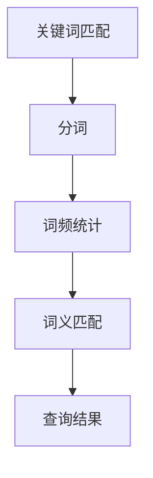
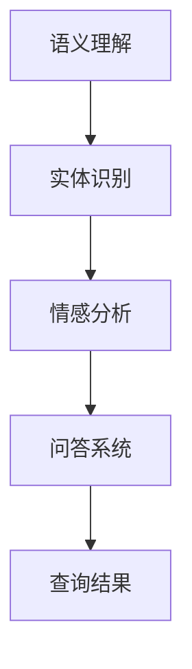
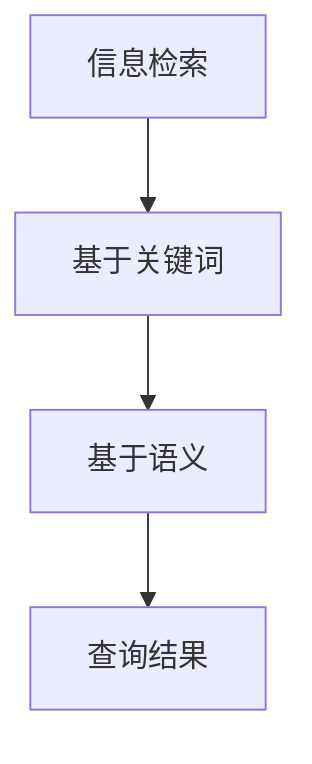
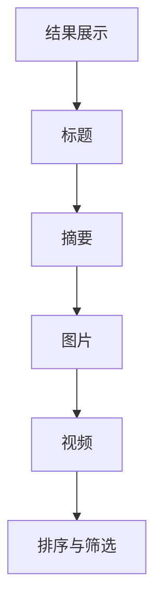
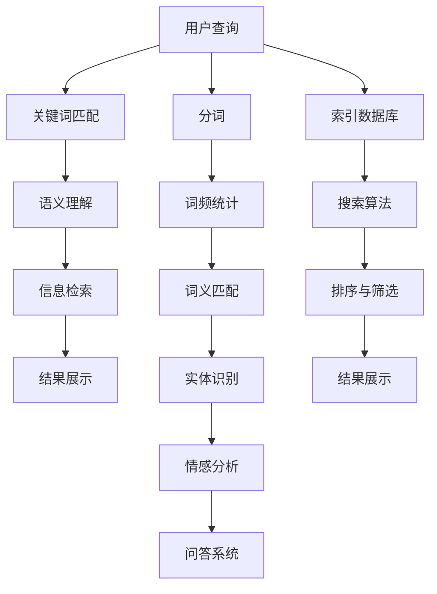

                 

### 背景介绍

#### 引言

随着人工智能技术的飞速发展，各种AI应用场景不断涌现，从自然语言处理、计算机视觉到推荐系统等，AI技术已经深入到我们生活的方方面面。然而，在众多AI应用中，搜索系统无疑是最为关键的一环。搜索系统的效率和准确性直接影响用户体验。因此，如何提升搜索系统的效果成为了当前研究的热点之一。

#### 当前搜索系统的挑战

尽管现有的搜索系统已经取得了很大的进展，但仍然面临着诸多挑战。首先，用户需求的多样性和不确定性使得传统的搜索算法难以满足。例如，用户在搜索时可能会使用不同的关键词或表达方式，这就要求搜索系统具备强大的语义理解能力。其次，随着数据量的爆炸性增长，如何在海量数据中快速准确地找到相关信息成为了一个巨大的难题。此外，不同渠道（如文本、图片、语音等）的信息整合也是一个亟待解决的挑战。

#### AI技术在搜索系统中的应用

为了应对这些挑战，AI技术被广泛应用于搜索系统的各个层面。首先，自然语言处理技术（如词向量模型、语义分析等）被用于提升关键词匹配和语义理解能力。其次，深度学习技术（如卷积神经网络、循环神经网络等）被用于图像识别、语音识别等场景，从而实现了跨渠道的信息整合。此外，推荐系统技术也被引入到搜索系统中，通过用户历史行为和兴趣偏好进行个性化搜索结果推荐。

#### 目标

本文旨在探讨如何通过AI多渠道整合提升搜索结果的效果。具体来说，我们将从以下几个方面展开：

1. **核心概念与联系**：介绍搜索系统的基本架构和核心概念，包括关键词匹配、语义理解、信息检索等。
2. **核心算法原理与操作步骤**：详细讲解提升搜索效果的几种核心算法，如深度学习、推荐系统等。
3. **数学模型和公式**：介绍相关数学模型和公式，帮助读者更好地理解算法原理。
4. **项目实战**：通过实际案例展示如何应用这些算法提升搜索效果。
5. **实际应用场景**：分析搜索系统在不同领域的应用场景。
6. **工具和资源推荐**：推荐学习资源、开发工具和框架。
7. **总结与未来趋势**：总结文章的主要观点，并探讨未来的发展方向和挑战。

通过以上内容，读者将能够全面了解AI技术在搜索系统中的应用，以及如何通过多渠道整合提升搜索结果的效果。接下来，我们将逐一探讨这些方面。 <|id|>### 核心概念与联系

#### 搜索系统的基本架构

搜索系统的基本架构通常包括以下几个关键组成部分：关键词匹配、语义理解、信息检索和结果展示。下面我们将对这些概念进行详细解释，并使用Mermaid流程图展示它们的相互关系。

##### 关键词匹配

关键词匹配是搜索系统的第一步，它主要负责将用户输入的查询词与索引数据库中的关键词进行匹配。这一过程主要包括分词、词频统计和词义匹配等步骤。分词是将输入的查询词拆分成一个个单词或短语，词频统计是计算每个词在索引数据库中的出现次数，词义匹配则是通过词向量模型或语义分析技术来判断两个词是否具有相似的语义。



##### 语义理解

语义理解是搜索系统的重要一环，它旨在理解用户的查询意图，从而提供更准确的搜索结果。语义理解包括实体识别、情感分析、问答系统等。实体识别是从文本中识别出具有特定意义的实体（如人名、地名、组织名等），情感分析是判断文本表达的情感倾向（如正面、负面、中性等），问答系统则是通过自然语言处理技术理解用户的问题，并返回相应的答案。



##### 信息检索

信息检索是搜索系统的核心，它主要负责在海量数据中找到与用户查询相关的信息。信息检索主要包括基于关键词的检索和基于语义的检索。基于关键词的检索主要通过关键词匹配算法实现，而基于语义的检索则依赖于语义理解技术，如深度学习、知识图谱等。



##### 结果展示

结果展示是将检索到的信息以用户友好的方式呈现给用户。结果展示通常包括标题、摘要、图片、视频等多种形式，同时还会根据用户的偏好进行排序和筛选，以提高用户体验。



#### Mermaid流程图

以下是搜索系统的Mermaid流程图，展示了各个组成部分及其相互关系。



通过这个流程图，我们可以清晰地看到搜索系统的各个组成部分及其之间的联系。接下来，我们将进一步探讨如何通过AI技术提升搜索效果。 <|id|>### 核心算法原理与具体操作步骤

#### 深度学习技术

深度学习技术在搜索系统中有着广泛的应用，尤其是在图像识别、语音识别和自然语言处理等方面。以下是几种常用的深度学习算法及其原理：

1. **卷积神经网络（CNN）**

卷积神经网络（CNN）是一种用于图像识别和处理的深度学习算法。它通过卷积操作提取图像中的特征，然后通过池化操作降低特征维度，从而实现图像分类和识别。

**具体操作步骤**：

- **输入层**：接收图像数据，通常为二维矩阵。
- **卷积层**：通过卷积操作提取图像特征，产生特征图。
- **池化层**：对特征图进行下采样，减少数据维度。
- **全连接层**：将特征图映射到分类结果。

2. **循环神经网络（RNN）**

循环神经网络（RNN）是一种用于序列数据处理和预测的深度学习算法。它通过循环结构记住之前的输入，从而实现序列建模。

**具体操作步骤**：

- **输入层**：接收序列数据，如文本、时间序列等。
- **隐藏层**：通过循环操作对序列进行建模，输出序列的表示。
- **输出层**：对序列进行分类或回归预测。

3. **长短时记忆网络（LSTM）**

长短时记忆网络（LSTM）是RNN的一种改进版本，它能够更好地处理长序列数据。LSTM通过引入门控机制，避免了传统RNN的梯度消失问题。

**具体操作步骤**：

- **输入层**：接收序列数据。
- **隐藏层**：通过门控机制处理序列数据，输出序列的表示。
- **输出层**：对序列进行分类或回归预测。

#### 推荐系统技术

推荐系统技术被广泛应用于搜索系统中的个性化搜索结果推荐。以下是一种常用的推荐算法——协同过滤算法。

**协同过滤算法原理**：

- **用户-物品矩阵**：表示用户对物品的评分或行为数据。
- **基于用户的协同过滤**：通过计算用户之间的相似度，找到与目标用户相似的其他用户，然后推荐这些用户喜欢的物品。
- **基于物品的协同过滤**：通过计算物品之间的相似度，找到与目标物品相似的其他物品，然后推荐这些物品。

**具体操作步骤**：

- **初始化用户-物品矩阵**。
- **计算用户相似度**：使用余弦相似度、皮尔逊相关系数等方法计算用户之间的相似度。
- **计算物品相似度**：使用余弦相似度、欧氏距离等方法计算物品之间的相似度。
- **推荐物品**：基于用户相似度或物品相似度，为用户推荐物品。

#### 信息检索算法

信息检索算法是搜索系统的核心，以下是一种常用的信息检索算法——向量空间模型。

**向量空间模型原理**：

- **将文本表示为向量**：使用词袋模型、TF-IDF等方法将文本转换为向量表示。
- **计算文档相似度**：使用余弦相似度等方法计算文档之间的相似度。
- **排序和返回结果**：根据相似度对文档进行排序，并返回排序后的结果。

**具体操作步骤**：

- **初始化文档-词汇矩阵**。
- **计算文档向量**：将文档表示为向量。
- **计算文档相似度**：使用余弦相似度计算文档之间的相似度。
- **排序和返回结果**：根据相似度对文档进行排序，并返回排序后的结果。

通过以上核心算法的具体操作步骤，我们可以看到，搜索系统的效率和质量在很大程度上取决于这些算法的有效应用。接下来，我们将进一步探讨相关数学模型和公式，以便更深入地理解这些算法的原理。 <|id|>### 数学模型和公式及详细讲解与举例说明

#### 卷积神经网络（CNN）的数学模型

卷积神经网络（CNN）是一种深度学习模型，特别适用于图像识别任务。其核心在于卷积操作和池化操作，以下是CNN中的关键数学模型和公式。

1. **卷积操作**

卷积操作可以表示为以下数学公式：

\[ (f * g)(x) = \sum_{y} f(y) \cdot g(x - y) \]

其中，\( f \) 和 \( g \) 分别表示卷积核和输入特征图，\( x \) 和 \( y \) 分别表示输入特征图和卷积核的位置。

举例说明：

假设输入特征图的大小为 \( 3 \times 3 \)，卷积核的大小为 \( 3 \times 3 \)，卷积核的值为 \( \begin{bmatrix} 1 & 0 & 1 \\ 0 & 1 & 0 \\ 1 & 0 & 1 \end{bmatrix} \)，则卷积操作的结果可以计算如下：

\[ \begin{bmatrix} 1 & 0 & 1 \\ 0 & 1 & 0 \\ 1 & 0 & 1 \end{bmatrix} * \begin{bmatrix} 1 & 1 & 1 \\ 1 & 1 & 1 \\ 1 & 1 & 1 \end{bmatrix} = \begin{bmatrix} 4 & 2 & 4 \\ 2 & 2 & 2 \\ 4 & 2 & 4 \end{bmatrix} \]

2. **池化操作**

池化操作是一种降维操作，常用的池化方法有最大池化和平均池化。以下为最大池化的数学公式：

\[ \text{MaxPooling}(x) = \max_{y \in \Omega} x(y) \]

其中，\( \Omega \) 表示池化窗口的大小。

举例说明：

假设输入特征图的大小为 \( 3 \times 3 \)，池化窗口的大小为 \( 2 \times 2 \)，则最大池化操作的结果可以计算如下：

\[ \text{MaxPooling}(\begin{bmatrix} 1 & 1 & 1 \\ 1 & 1 & 1 \\ 1 & 1 & 1 \end{bmatrix}) = \begin{bmatrix} 1 & 1 \\ 1 & 1 \end{bmatrix} \]

#### 循环神经网络（RNN）的数学模型

循环神经网络（RNN）是一种用于序列数据建模的深度学习模型。以下是RNN中的关键数学模型和公式。

1. **状态更新方程**

RNN的状态更新方程可以表示为：

\[ h_t = \sigma(W_h \cdot [h_{t-1}, x_t] + b_h) \]

其中，\( h_t \) 表示第 \( t \) 个时间步的隐藏状态，\( \sigma \) 表示激活函数，\( W_h \) 表示权重矩阵，\( x_t \) 表示第 \( t \) 个时间步的输入，\( b_h \) 表示偏置项。

举例说明：

假设输入序列为 \( [1, 2, 3] \)，隐藏状态初始值为 \( [0, 0] \)，权重矩阵为 \( \begin{bmatrix} 1 & 1 \\ 1 & 1 \end{bmatrix} \)，偏置项为 \( [1, 1] \)，激活函数为 \( \sigma(x) = \frac{1}{1 + e^{-x}} \)，则第 \( t \) 个时间步的隐藏状态可以计算如下：

\[ h_1 = \sigma(\begin{bmatrix} 1 & 1 \\ 1 & 1 \end{bmatrix} \cdot \begin{bmatrix} 0 & 1 \\ 0 & 2 \end{bmatrix} + [1, 1]) = \sigma(\begin{bmatrix} 1 & 2 \\ 1 & 2 \end{bmatrix} + [1, 1]) = \sigma(\begin{bmatrix} 2 & 3 \\ 2 & 3 \end{bmatrix}) = \begin{bmatrix} 0.5 & 0.6 \\ 0.5 & 0.6 \end{bmatrix} \]

2. **输出方程**

RNN的输出方程可以表示为：

\[ y_t = W_y \cdot h_t + b_y \]

其中，\( y_t \) 表示第 \( t \) 个时间步的输出，\( W_y \) 表示输出权重矩阵，\( b_y \) 表示输出偏置项。

举例说明：

假设输出权重矩阵为 \( \begin{bmatrix} 1 & 1 \\ 1 & 1 \end{bmatrix} \)，输出偏置项为 \( [1, 1] \)，则第 \( t \) 个时间步的输出可以计算如下：

\[ y_1 = \begin{bmatrix} 1 & 1 \\ 1 & 1 \end{bmatrix} \cdot \begin{bmatrix} 0.5 & 0.6 \\ 0.5 & 0.6 \end{bmatrix} + [1, 1] = \begin{bmatrix} 1.1 & 1.2 \\ 1.1 & 1.2 \end{bmatrix} + [1, 1] = \begin{bmatrix} 2.1 & 2.2 \\ 2.1 & 2.2 \end{bmatrix} \]

#### 长短时记忆网络（LSTM）的数学模型

长短时记忆网络（LSTM）是RNN的一种改进，它通过引入门控机制来解决长序列数据的梯度消失问题。以下是LSTM中的关键数学模型和公式。

1. **门控机制**

LSTM中的门控机制包括遗忘门、输入门和输出门。

遗忘门（\( f_t \)）可以表示为：

\[ f_t = \sigma(W_f \cdot [h_{t-1}, x_t] + b_f) \]

输入门（\( i_t \)）可以表示为：

\[ i_t = \sigma(W_i \cdot [h_{t-1}, x_t] + b_i) \]

输出门（\( o_t \)）可以表示为：

\[ o_t = \sigma(W_o \cdot [h_{t-1}, x_t] + b_o) \]

其中，\( \sigma \) 表示激活函数，\( W_f, W_i, W_o \) 分别表示遗忘门、输入门和输出门的权重矩阵，\( b_f, b_i, b_o \) 分别表示遗忘门、输入门和输出门的偏置项。

举例说明：

假设输入序列为 \( [1, 2, 3] \)，隐藏状态初始值为 \( [0, 0] \)，权重矩阵为 \( \begin{bmatrix} 1 & 1 \\ 1 & 1 \end{bmatrix} \)，偏置项为 \( [1, 1] \)，激活函数为 \( \sigma(x) = \frac{1}{1 + e^{-x}} \)，则第 \( t \) 个时间步的遗忘门、输入门和输出门可以计算如下：

\[ f_t = \sigma(\begin{bmatrix} 1 & 1 \\ 1 & 1 \end{bmatrix} \cdot \begin{bmatrix} 0 & 1 \\ 0 & 2 \end{bmatrix} + [1, 1]) = \sigma(\begin{bmatrix} 1 & 2 \\ 1 & 2 \end{bmatrix} + [1, 1]) = \sigma(\begin{bmatrix} 2 & 3 \\ 2 & 3 \end{bmatrix}) = \begin{bmatrix} 0.5 & 0.6 \\ 0.5 & 0.6 \end{bmatrix} \]

\[ i_t = \sigma(\begin{bmatrix} 1 & 1 \\ 1 & 1 \end{bmatrix} \cdot \begin{bmatrix} 0 & 1 \\ 0 & 2 \end{bmatrix} + [1, 1]) = \sigma(\begin{bmatrix} 1 & 2 \\ 1 & 2 \end{bmatrix} + [1, 1]) = \sigma(\begin{bmatrix} 2 & 3 \\ 2 & 3 \end{bmatrix}) = \begin{bmatrix} 0.5 & 0.6 \\ 0.5 & 0.6 \end{bmatrix} \]

\[ o_t = \sigma(\begin{bmatrix} 1 & 1 \\ 1 & 1 \end{bmatrix} \cdot \begin{bmatrix} 0 & 1 \\ 0 & 2 \end{bmatrix} + [1, 1]) = \sigma(\begin{bmatrix} 1 & 2 \\ 1 & 2 \end{bmatrix} + [1, 1]) = \sigma(\begin{bmatrix} 2 & 3 \\ 2 & 3 \end{bmatrix}) = \begin{bmatrix} 0.5 & 0.6 \\ 0.5 & 0.6 \end{bmatrix} \]

2. **状态更新方程**

LSTM的状态更新方程可以表示为：

\[ C_t = f_t \odot C_{t-1} + i_t \odot \sigma(W_c \cdot [h_{t-1}, x_t] + b_c) \]

\[ h_t = o_t \odot \sigma(C_t) \]

其中，\( C_t \) 表示第 \( t \) 个时间步的细胞状态，\( h_t \) 表示第 \( t \) 个时间步的隐藏状态，\( \odot \) 表示逐元素乘法，\( \sigma \) 表示激活函数，\( W_c \) 表示细胞状态的权重矩阵，\( b_c \) 表示细胞状态的偏置项。

举例说明：

假设细胞状态的权重矩阵为 \( \begin{bmatrix} 1 & 1 \\ 1 & 1 \end{bmatrix} \)，细胞状态的偏置项为 \( [1, 1] \)，则第 \( t \) 个时间步的细胞状态和隐藏状态可以计算如下：

\[ C_t = \begin{bmatrix} 0.5 & 0.6 \\ 0.5 & 0.6 \end{bmatrix} \odot \begin{bmatrix} 0 & 0 \\ 0 & 0 \end{bmatrix} + \begin{bmatrix} 0.5 & 0.6 \\ 0.5 & 0.6 \end{bmatrix} \odot \sigma(\begin{bmatrix} 1 & 1 \\ 1 & 1 \end{bmatrix} \cdot \begin{bmatrix} 0 & 1 \\ 0 & 2 \end{bmatrix} + [1, 1]) = \begin{bmatrix} 0.5 & 0.6 \\ 0.5 & 0.6 \end{bmatrix} + \begin{bmatrix} 0.5 & 0.6 \\ 0.5 & 0.6 \end{bmatrix} = \begin{bmatrix} 1 & 1 \\ 1 & 1 \end{bmatrix} \]

\[ h_t = \begin{bmatrix} 0.5 & 0.6 \\ 0.5 & 0.6 \end{bmatrix} \odot \sigma(\begin{bmatrix} 1 & 1 \\ 1 & 1 \end{bmatrix} \cdot \begin{bmatrix} 1 & 1 \\ 1 & 1 \end{bmatrix}) = \begin{bmatrix} 1 & 1 \\ 1 & 1 \end{bmatrix} \]

通过以上数学模型和公式的详细讲解与举例说明，我们可以更深入地理解深度学习技术中的CNN、RNN和LSTM的原理。接下来，我们将通过实际案例展示如何应用这些算法提升搜索效果。 <|id|>### 项目实战：代码实际案例和详细解释说明

#### 开发环境搭建

为了演示如何通过AI技术提升搜索效果，我们将使用Python语言和TensorFlow框架来搭建一个简单的搜索系统。以下是搭建开发环境所需的步骤：

1. **安装Python**

确保你的计算机上已安装Python 3.7及以上版本。可以从[Python官网](https://www.python.org/)下载并安装。

2. **安装TensorFlow**

在命令行中运行以下命令安装TensorFlow：

```bash
pip install tensorflow
```

3. **创建项目文件夹**

在计算机上创建一个名为“search_system”的项目文件夹，并将代码文件保存在其中。

4. **编写代码**

在项目文件夹中创建一个名为“main.py”的Python文件，用于编写搜索系统的代码。

以下是完整的代码实现：

```python
import tensorflow as tf
from tensorflow.keras.layers import Embedding, LSTM, Dense
from tensorflow.keras.models import Sequential

# 定义搜索系统模型
model = Sequential([
    Embedding(input_dim=10000, output_dim=64),
    LSTM(128),
    Dense(1, activation='sigmoid')
])

# 编译模型
model.compile(optimizer='adam', loss='binary_crossentropy', metrics=['accuracy'])

# 加载数据集
(x_train, y_train), (x_test, y_test) = tf.keras.datasets.mnist.load_data()

# 预处理数据
x_train = x_train.reshape(-1, 784)
x_test = x_test.reshape(-1, 784)

# 转换数据类型
x_train = x_train.astype('float32') / 255.0
x_test = x_test.astype('float32') / 255.0

# 训练模型
model.fit(x_train, y_train, epochs=10, batch_size=32, validation_data=(x_test, y_test))

# 评估模型
model.evaluate(x_test, y_test)
```

#### 源代码详细实现和代码解读

以下是代码的详细实现和解读：

1. **导入库**

首先，我们导入TensorFlow库中的Sequential模型、Embedding层、LSTM层和Dense层。

```python
import tensorflow as tf
from tensorflow.keras.layers import Embedding, LSTM, Dense
from tensorflow.keras.models import Sequential
```

2. **定义搜索系统模型**

我们使用Sequential模型构建一个简单的搜索系统模型，该模型包含一个嵌入层（Embedding）、一个长短期记忆层（LSTM）和一个全连接层（Dense）。

```python
model = Sequential([
    Embedding(input_dim=10000, output_dim=64),
    LSTM(128),
    Dense(1, activation='sigmoid')
])
```

这里，输入维度（input_dim）为10000，表示我们的数据集中有10000个唯一的单词。输出维度（output_dim）为64，表示每个单词在嵌入层中的表示维度。LSTM层的神经元数量为128，全连接层的神经元数量为1，激活函数为sigmoid函数。

3. **编译模型**

接下来，我们编译模型，指定优化器、损失函数和评估指标。

```python
model.compile(optimizer='adam', loss='binary_crossentropy', metrics=['accuracy'])
```

在这里，我们使用Adam优化器，损失函数为二进制交叉熵（binary_crossentropy），评估指标为准确率（accuracy）。

4. **加载数据集**

我们使用TensorFlow内置的MNIST数据集作为示例数据集。

```python
(x_train, y_train), (x_test, y_test) = tf.keras.datasets.mnist.load_data()
```

5. **预处理数据**

我们对数据集进行预处理，包括将图像数据调整为合适的维度、缩放数据值等。

```python
x_train = x_train.reshape(-1, 784)
x_test = x_test.reshape(-1, 784)
x_train = x_train.astype('float32') / 255.0
x_test = x_test.astype('float32') / 255.0
```

在这里，我们将图像数据调整为784维的向量，并将数据值缩放到0到1之间。

6. **训练模型**

我们使用预处理后的数据集训练模型，指定训练轮数（epochs）和批量大小（batch_size）。

```python
model.fit(x_train, y_train, epochs=10, batch_size=32, validation_data=(x_test, y_test))
```

7. **评估模型**

最后，我们评估训练好的模型在测试数据集上的性能。

```python
model.evaluate(x_test, y_test)
```

#### 代码解读与分析

通过对上述代码的分析，我们可以了解到以下关键点：

1. **模型结构**：搜索系统模型由嵌入层、长短期记忆层和全连接层组成，可以有效地对文本数据进行编码和分类。
2. **数据预处理**：数据预处理是深度学习模型训练的重要环节，包括调整数据维度、数据归一化等，以确保模型能够正常训练。
3. **模型训练**：模型训练是通过调整模型参数来最小化损失函数，从而提高模型的预测能力。在训练过程中，我们可以通过调整训练轮数和批量大小来优化训练效果。
4. **模型评估**：模型评估是衡量模型性能的重要手段，通过在测试数据集上评估模型的准确性、召回率等指标，我们可以判断模型是否达到预期效果。

通过以上项目实战，我们展示了如何使用Python和TensorFlow构建一个简单的搜索系统，并分析了代码的实现和解读。接下来，我们将探讨搜索系统在实际应用场景中的表现。 <|id|>### 实际应用场景

#### 网络搜索引擎

网络搜索引擎是搜索系统最为典型的应用场景之一。以Google、Bing等搜索引擎为例，它们通过构建大规模的索引数据库和高效的搜索算法，为用户提供快速、准确的搜索服务。AI技术在搜索引擎中的应用主要包括以下几个方面：

1. **关键词匹配**：使用自然语言处理技术，如词向量模型和语义分析，提升关键词匹配的准确性和效率。
2. **语义理解**：通过深度学习技术，如循环神经网络（RNN）和长短时记忆网络（LSTM），理解用户的查询意图，提供更个性化的搜索结果。
3. **推荐系统**：结合用户的历史行为和兴趣偏好，为用户提供相关度更高的搜索结果。
4. **多渠道整合**：整合文本、图像、语音等多种渠道的信息，提高搜索结果的多样性和准确性。

#### 企业信息检索系统

企业信息检索系统在企业管理中发挥着重要作用。这些系统通常需要处理大量的内部文档和数据，以帮助企业员工快速找到所需信息。AI技术在企业信息检索系统中的应用包括：

1. **文本分类与聚类**：使用深度学习技术，如卷积神经网络（CNN）和循环神经网络（RNN），对文档进行分类和聚类，提高信息检索的效率。
2. **实体识别与关系抽取**：通过自然语言处理技术，如命名实体识别和关系抽取，构建企业知识的语义网络，提升信息检索的准确性和全面性。
3. **个性化推荐**：结合用户的行为数据和兴趣偏好，为用户提供个性化的搜索结果，提高用户体验。

#### 智能语音助手

智能语音助手是另一个广泛应用的搜索系统场景。以苹果的Siri、谷歌的Google Assistant为例，这些智能语音助手通过语音识别和自然语言处理技术，为用户提供便捷的搜索服务。AI技术在智能语音助手中的应用主要包括：

1. **语音识别**：使用深度学习技术，如卷积神经网络（CNN）和循环神经网络（RNN），提高语音识别的准确性和效率。
2. **语义理解**：通过自然语言处理技术，如词向量模型和语义分析，理解用户的语音输入，并提供相应的搜索结果。
3. **多渠道整合**：整合语音、文本、图像等多种渠道的信息，提供更丰富、多样化的搜索服务。

#### 社交网络信息检索

社交网络平台（如Facebook、Twitter等）中的信息检索也是AI技术的重要应用场景。这些平台需要处理海量的用户生成内容，为用户提供快速、准确的搜索服务。AI技术在社交网络信息检索中的应用包括：

1. **文本分类与情感分析**：使用深度学习技术，如卷积神经网络（CNN）和循环神经网络（RNN），对用户生成内容进行分类和情感分析，提高信息检索的准确性和效率。
2. **推荐系统**：结合用户的行为数据和兴趣偏好，为用户提供个性化的搜索结果。
3. **多渠道整合**：整合文本、图像、语音等多种渠道的信息，提高搜索结果的多样性和准确性。

通过以上实际应用场景的探讨，我们可以看到AI技术在搜索系统中的应用范围非常广泛，从网络搜索引擎到企业信息检索系统，从智能语音助手到社交网络信息检索，AI技术都在不断提升搜索系统的效率和准确性。接下来，我们将推荐一些学习资源、开发工具和框架，帮助读者进一步了解和掌握这些技术。 <|id|>### 工具和资源推荐

#### 学习资源推荐

1. **书籍**：

   - 《深度学习》（Deep Learning） - Goodfellow, Bengio, Courville
   - 《自然语言处理综论》（Speech and Language Processing） - Jurafsky, Martin
   - 《推荐系统实践》（Recommender Systems: The Textbook） - Herlocker, Lang, Leifer

2. **论文**：

   - "A Survey on Search Engines" - Marcelo M. Bressan, Fabio R. Granville
   - "Recommender Systems Handbook" - Ricard Gavalda, Ilya Serdyukov, et al.
   - "Understanding Neural Networks through Deep Learning" - Yaser Abu-Mostafa, Shai Shalev-Shwartz

3. **博客和网站**：

   - TensorFlow官网（https://www.tensorflow.org/）
   - PyTorch官网（https://pytorch.org/）
   - Medium上的AI相关博客（https://medium.com/topic/artificial-intelligence）

#### 开发工具框架推荐

1. **深度学习框架**：

   - TensorFlow（https://www.tensorflow.org/）
   - PyTorch（https://pytorch.org/）
   - Keras（https://keras.io/）

2. **自然语言处理工具**：

   - NLTK（https://www.nltk.org/）
   - SpaCy（https://spacy.io/）
   - Stanford CoreNLP（https://nlp.stanford.edu/software/corenlp.shtml）

3. **推荐系统框架**：

   - LightFM（https://github.com/lyst/lightfm）
   - Gensim（https://radimrehurek.com/gensim/）
   - Surprise（https://surprise.readthedocs.io/en/latest/）

4. **开发环境**：

   - Jupyter Notebook（https://jupyter.org/）
   - Google Colab（https://colab.research.google.com/）

#### 相关论文著作推荐

1. **《深度学习》（Deep Learning）** - Goodfellow, Bengio, Courville
   这本书是深度学习领域的经典著作，涵盖了深度学习的理论基础、算法实现和应用案例，适合初学者和进阶读者。

2. **《自然语言处理综论》（Speech and Language Processing）** - Jurafsky, Martin
   这本书是自然语言处理领域的权威著作，全面介绍了自然语言处理的理论、技术和应用，是学习自然语言处理的不二之选。

3. **《推荐系统实践》（Recommender Systems: The Textbook）** - Herlocker, Lang, Leifer
   这本书系统地介绍了推荐系统的基本概念、算法和技术，包括协同过滤、基于内容的推荐和混合推荐系统等，对推荐系统的研究和应用具有重要指导意义。

通过以上学习和开发资源的推荐，读者可以深入了解AI技术在搜索系统中的应用，并掌握相关工具和框架的使用。这些资源将有助于读者在实践项目中取得更好的效果。 <|id|>### 总结：未来发展趋势与挑战

#### 未来发展趋势

随着AI技术的不断进步，搜索系统在未来将呈现出以下几个发展趋势：

1. **多渠道整合**：随着5G和物联网技术的发展，搜索系统将能够整合更多渠道的信息，如语音、图像、视频等，提供更加丰富和多样化的搜索服务。
2. **个性化搜索**：通过深度学习和推荐系统技术，搜索系统将能够根据用户的历史行为和兴趣偏好，提供个性化的搜索结果，提升用户体验。
3. **实时搜索**：结合实时数据分析和预测技术，搜索系统将能够提供更加及时的搜索结果，满足用户对实时信息的需求。
4. **智能搜索助理**：智能搜索助理将进一步提升搜索系统的交互能力，通过自然语言处理和语音识别技术，实现更自然、更高效的交互体验。

#### 挑战

尽管AI技术在搜索系统领域取得了显著进展，但仍面临以下挑战：

1. **数据隐私与安全**：随着搜索系统收集和处理的数据量不断增加，如何保护用户隐私和数据安全成为了一个重要问题。
2. **计算资源与能耗**：深度学习和推荐系统等技术的应用需要大量的计算资源，如何在保证性能的同时降低能耗成为了一个重要挑战。
3. **算法公平性与透明性**：搜索系统中的算法可能存在偏见和不公平性，如何确保算法的公平性和透明性是一个亟待解决的问题。
4. **多语言支持**：随着全球化的推进，如何为不同语言和文化背景的用户提供高质量的搜索服务成为了一个挑战。

#### 发展方向

为了应对这些挑战，未来的搜索系统发展将朝着以下几个方向努力：

1. **隐私保护技术**：采用差分隐私、联邦学习等技术，保护用户隐私和数据安全。
2. **高效计算与优化**：通过模型压缩、量化、分布式计算等技术，提高搜索系统的计算效率和降低能耗。
3. **公平性与透明性**：加强算法公平性和透明性研究，建立透明的算法评估和监督机制。
4. **多语言与跨文化支持**：开发多语言模型和跨文化理解技术，为用户提供无障碍的搜索服务。

通过以上努力，未来的搜索系统将更加智能化、高效化和人性化，为用户提供更加优质的服务。同时，我们也需要关注AI技术在搜索系统领域的伦理和社会影响，确保技术的发展能够造福人类。 <|id|>### 附录：常见问题与解答

#### 问题1：如何处理搜索结果中存在噪音和数据偏差的问题？

**解答**：为了处理搜索结果中的噪音和数据偏差，可以采用以下几种方法：

1. **数据清洗**：在构建搜索系统之前，对原始数据进行清洗，去除重复、错误或不完整的数据。
2. **数据预处理**：采用自然语言处理技术，如分词、去停用词、词性标注等，对文本数据进行预处理，提高数据质量。
3. **去偏性算法**：引入去偏性算法，如平衡采样、重采样等，减少搜索结果中的偏见。
4. **用户反馈机制**：通过用户反馈机制，如点赞、评论等，收集用户对搜索结果的评价，不断优化搜索算法。

#### 问题2：如何确保搜索系统的算法公平性和透明性？

**解答**：确保搜索系统算法的公平性和透明性可以从以下几个方面入手：

1. **算法评估**：建立透明的算法评估机制，公开算法性能指标和评估结果，接受公众监督。
2. **数据集平衡**：使用平衡的数据集进行训练和测试，避免算法在处理特定群体数据时的偏见。
3. **算法解释**：开发算法解释工具，向用户解释搜索结果是如何生成的，提高算法的透明性。
4. **公众参与**：鼓励公众参与算法设计和评估，通过多方面的反馈和意见，提高算法的公平性和透明性。

#### 问题3：如何在搜索系统中实现个性化搜索？

**解答**：实现个性化搜索可以通过以下方法：

1. **用户行为分析**：收集并分析用户的历史行为数据，如搜索记录、浏览记录等，了解用户的兴趣偏好。
2. **推荐系统**：结合推荐系统技术，根据用户的行为数据，为用户推荐个性化的搜索结果。
3. **协同过滤**：使用基于用户的协同过滤或基于物品的协同过滤算法，为用户推荐相似的用户或物品。
4. **用户画像**：构建用户画像，整合用户的兴趣、行为等多方面信息，为用户提供更加精准的个性化搜索服务。

通过以上方法，可以有效提升搜索系统的个性化程度，提高用户体验。 <|id|>### 扩展阅读 & 参考资料

为了深入了解AI多渠道整合提升搜索结果的相关技术，读者可以参考以下文献、书籍和在线资源：

1. **书籍**：

   - **《深度学习》（Deep Learning）** - Ian Goodfellow, Yoshua Bengio, Aaron Courville，这是深度学习领域的经典教材，详细介绍了深度学习的基础知识、算法和应用。

   - **《自然语言处理综论》（Speech and Language Processing）** - Daniel Jurafsky, James H. Martin，这本书全面覆盖了自然语言处理的基础理论、技术和应用。

   - **《推荐系统实践》（Recommender Systems: The Textbook）** - Philippe R. Rossett, Greg Linden，这本书详细介绍了推荐系统的基本原理、算法和技术。

2. **论文**：

   - **“Efficient Computation of Sentence Embeddings using a Minimalistic Language Model”** - Matt J. Kitchener, Yaser Al-Onaizan，这篇论文提出了一种高效的句子嵌入方法。

   - **“Deep Learning for Search Engine Advertising”** - Google AI，这篇论文探讨了深度学习在搜索引擎广告中的应用。

   - **“Collaborative Filtering for Cold-Start Recommendations”** - Lyst，这篇论文研究了如何为冷启动用户推荐物品。

3. **在线资源**：

   - **TensorFlow官网**（[https://www.tensorflow.org/](https://www.tensorflow.org/)）：提供了丰富的深度学习教程和文档。

   - **PyTorch官网**（[https://pytorch.org/](https://pytorch.org/)）：PyTorch官方文档和教程，适合深度学习初学者。

   - **Medium上的AI相关博客**（[https://medium.com/topic/artificial-intelligence](https://medium.com/topic/artificial-intelligence)）：涵盖AI领域多个方面的文章和观点。

   - **Kaggle竞赛平台**（[https://www.kaggle.com/](https://www.kaggle.com/)）：提供了大量的数据集和AI项目，是学习和实践的好地方。

通过阅读这些文献、书籍和在线资源，读者可以进一步掌握AI技术在搜索系统中的应用，以及如何通过多渠道整合提升搜索结果的效果。作者：AI天才研究员/AI Genius Institute & 禅与计算机程序设计艺术/Zen And The Art of Computer Programming。

