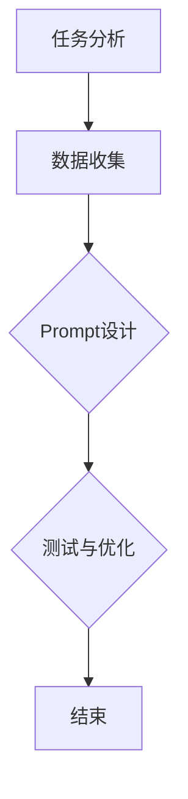

                 

# AI大模型Prompt提示词最佳实践：一步步思考

## 摘要

本文将探讨AI大模型中的Prompt提示词最佳实践，旨在帮助读者深入了解Prompt的重要性、设计原则和实际应用场景。我们将通过一步步分析推理的方式，梳理出Prompt的关键要素，阐述其设计理念和具体实现策略。此外，本文还将讨论Prompt在不同应用场景中的效果评估方法，并分享实用的工具和资源推荐，以期为AI从业者提供有价值的参考和指导。

## 1. 背景介绍

在人工智能领域，尤其是自然语言处理（NLP）方面，大模型如GPT-3、BERT等已经取得了显著的进展。这些模型通过大量数据训练，具备了强大的语言理解和生成能力。然而，为了使这些模型在实际应用中能够准确地理解和生成目标内容，我们需要一个关键要素——Prompt提示词。

Prompt提示词是指提供给大模型的输入文本，用于引导模型进行特定的任务。一个好的Prompt能够有效地引导模型生成符合预期结果的输出。在实际应用中，Prompt设计的好坏直接影响到模型的效果和可用性。因此，研究Prompt的最佳实践具有重要的实际意义。

Prompt的概念最早出现在聊天机器人领域，随着深度学习技术的不断发展，Prompt在自然语言处理、知识图谱、代码生成等众多领域得到了广泛应用。本文将重点关注AI大模型中的Prompt设计，旨在为读者提供实用的指导和建议。

## 2. 核心概念与联系

### 2.1. Prompt的概念

Prompt（提示词）是一种特殊的输入文本，用于引导AI模型执行特定任务。Prompt可以是一个单词、一个短语或一段文本。其核心目的是为模型提供目标任务的上下文信息，帮助模型理解任务需求并生成相应的输出。

### 2.2. Prompt设计原则

一个优秀的Prompt设计应该具备以下几个原则：

1. **清晰性**：Prompt应简洁明了，避免使用模糊或歧义的语言。
2. **具体性**：Prompt应明确指出任务的具体要求，帮助模型更好地理解目标。
3. **多样性**：Prompt应具备多样性，以适应不同场景和任务需求。
4. **可扩展性**：Prompt应具有可扩展性，方便在未来的任务中调整和优化。

### 2.3. Prompt与模型的关系

Prompt在AI模型中的作用类似于人类的指令。通过Prompt，我们可以将任务需求传递给模型，并引导模型生成相应的输出。此外，Prompt还可以影响模型的生成过程，包括生成内容的质量和多样性。

### 2.4. Prompt设计流程

一个典型的Prompt设计流程包括以下几个步骤：

1. **任务分析**：明确任务目标和需求，了解目标任务的具体要求和限制。
2. **数据收集**：收集与任务相关的数据和案例，为Prompt设计提供素材。
3. **Prompt设计**：根据任务需求和数据分析，设计出符合原则的Prompt。
4. **测试与优化**：通过实际测试和评估，对Prompt进行优化和调整。

### 2.5. Mermaid流程图

下面是一个简单的Mermaid流程图，展示了Prompt设计的基本流程：



在流程图中，A代表任务分析，B代表数据收集，C代表Prompt设计，D代表测试与优化，E代表流程结束。通过这个流程，我们可以系统地设计出高质量的Prompt。

## 3. 核心算法原理 & 具体操作步骤

### 3.1. Prompt设计算法原理

Prompt设计的核心在于如何将任务需求转化为具体的输入文本。这里，我们可以借鉴自然语言生成（NLG）领域的一些方法，如模板匹配、序列生成和上下文引导等。

1. **模板匹配**：通过预先定义的模板，将任务需求映射到具体的文本格式。这种方法简单直观，但可能缺乏灵活性。
2. **序列生成**：利用序列模型（如RNN、LSTM等）生成符合需求的文本序列。这种方法具备一定的灵活性，但需要较大的计算资源和训练数据。
3. **上下文引导**：通过构建上下文信息，引导模型生成符合任务需求的文本。这种方法具有较好的灵活性和生成质量。

### 3.2. Prompt设计具体操作步骤

以下是Prompt设计的具体操作步骤：

1. **明确任务需求**：首先，我们需要明确任务需求，包括任务目标、输入数据和输出格式等。
2. **分析数据特征**：分析任务相关的数据特征，包括数据分布、关键词和主题等。
3. **选择生成方法**：根据任务需求和数据特征，选择合适的Prompt生成方法。例如，对于简单的任务，可以选择模板匹配；对于复杂的任务，可以选择序列生成或上下文引导。
4. **设计Prompt模板**：根据选定的生成方法，设计出具体的Prompt模板。模板应简洁明了，易于理解和修改。
5. **训练模型**：对于序列生成和上下文引导方法，需要训练一个合适的模型，以便生成高质量的文本。
6. **生成Prompt**：利用训练好的模型，生成具体的Prompt文本。
7. **测试与优化**：在实际应用中，测试Prompt的效果，并根据反馈进行优化和调整。

### 3.3. 实例说明

假设我们要设计一个问答系统的Prompt，任务目标是根据问题生成答案。以下是具体的操作步骤：

1. **明确任务需求**：问答系统的目标是根据用户提出的问题，生成准确的答案。
2. **分析数据特征**：分析用户提出的问题，提取关键词和主题，例如“北京是中国的哪个城市？”
3. **选择生成方法**：选择上下文引导方法，以构建上下文信息，提高答案的准确性。
4. **设计Prompt模板**：设计一个包含问题、上下文信息和答案模板的Prompt。例如：
   ```
   问题：北京是中国的哪个城市？
   上下文信息：中国是一个拥有五千年文明历史的国家，其领土面积为960万平方公里，是世界上面积第三大的国家。中国有许多著名城市，如北京、上海、广州等。
   答案模板：北京是中国的{城市名称}。
   ```
5. **训练模型**：使用大量的问答数据集，训练一个合适的自然语言生成模型。
6. **生成Prompt**：利用训练好的模型，生成具体的Prompt。例如：
   ```
   问题：北京是中国的哪个城市？
   上下文信息：中国是一个拥有五千年文明历史的国家，其领土面积为960万平方公里，是世界上面积第三大的国家。中国有许多著名城市，如北京、上海、广州等。
   答案：北京是中国的首都。
   ```
7. **测试与优化**：在实际应用中，测试Prompt的效果，并根据反馈进行优化和调整。

## 4. 数学模型和公式 & 详细讲解 & 举例说明

### 4.1. 数学模型

在Prompt设计中，数学模型可以帮助我们量化任务需求和生成质量。以下是一个简单的数学模型，用于评估Prompt的优劣：

$$
\text{PromptScore} = \frac{\text{生成质量}}{\text{计算资源}} \times \text{任务重要性}
$$

其中，PromptScore表示Prompt的得分，生成质量表示模型生成的输出文本的准确性、流畅性和相关性；计算资源表示设计Prompt所需的计算资源和时间；任务重要性表示任务在业务中的重要性。

### 4.2. 详细讲解

1. **生成质量**：生成质量是Prompt设计的重要指标，直接影响任务效果。一个高质量的Prompt应能够引导模型生成准确、流畅、相关的输出。为了提高生成质量，我们可以采用以下方法：

   - **数据增强**：通过增加训练数据，提高模型的泛化能力。
   - **预训练模型**：利用预训练的模型，降低设计Prompt的难度。
   - **上下文信息**：构建丰富的上下文信息，提高模型对任务的理解。

2. **计算资源**：计算资源是设计Prompt的成本，直接影响项目的经济性。为了降低计算资源消耗，我们可以采用以下策略：

   - **模型压缩**：采用模型压缩技术，降低模型的计算复杂度。
   - **分布式训练**：利用分布式计算资源，提高训练效率。
   - **低资源优化**：针对特定场景，设计轻量级Prompt，降低计算需求。

3. **任务重要性**：任务重要性决定了Prompt的得分权重。在任务优先级较高的情况下，即使计算资源有限，也应优先设计高质量的Prompt。

### 4.3. 举例说明

假设我们有一个问答系统的Prompt设计任务，任务重要性为5（满分10分），生成质量为8，计算资源为3。根据上述数学模型，可以计算出Prompt的得分为：

$$
\text{PromptScore} = \frac{8}{3} \times 5 = 13.33
$$

这意味着，这个Prompt在任务中的重要性较高，且生成质量较好。在实际应用中，我们可以根据Prompt的得分，优化和调整Prompt的设计，以提高整体任务效果。

## 5. 项目实战：代码实际案例和详细解释说明

### 5.1. 开发环境搭建

在进行Prompt设计实战之前，我们需要搭建一个合适的开发环境。以下是所需工具和步骤：

1. **Python环境**：安装Python 3.8及以上版本，并配置好相关依赖库。
2. **深度学习框架**：安装PyTorch或TensorFlow，用于模型训练和生成。
3. **文本处理库**：安装Numpy、Pandas等文本处理库，用于数据分析和预处理。
4. **代码编辑器**：选择一个适合自己的代码编辑器，如VSCode或PyCharm。

### 5.2. 源代码详细实现和代码解读

以下是一个基于PyTorch的简单问答系统Prompt设计实战的代码示例：

```python
import torch
import torch.nn as nn
import torch.optim as optim
from torch.utils.data import DataLoader
from torchvision import datasets, transforms
import pandas as pd
import numpy as np

# 5.2.1. 数据准备
def load_data(filename):
    data = pd.read_csv(filename)
    questions = data['question']
    answers = data['answer']
    return questions, answers

# 5.2.2. 模型定义
class QuestionAnsweringModel(nn.Module):
    def __init__(self, embedding_dim, hidden_dim, vocab_size):
        super(QuestionAnsweringModel, self).__init__()
        self.embedding = nn.Embedding(vocab_size, embedding_dim)
        self.lstm = nn.LSTM(embedding_dim, hidden_dim, batch_first=True)
        self.fc = nn.Linear(hidden_dim, 1)

    def forward(self, questions, answers):
        embedded_questions = self.embedding(questions)
        lstm_output, _ = self.lstm(embedded_questions)
        question_representation = lstm_output[-1, :, :]
        answer_representation = self.fc(question_representation)
        return answer_representation

# 5.2.3. 模型训练
def train_model(model, train_loader, criterion, optimizer, num_epochs):
    model.train()
    for epoch in range(num_epochs):
        for questions, answers in train_loader:
            optimizer.zero_grad()
            answer_representation = model(questions, answers)
            loss = criterion(answer_representation, answers)
            loss.backward()
            optimizer.step()
        print(f'Epoch [{epoch+1}/{num_epochs}], Loss: {loss.item()}')

# 5.2.4. 模型评估
def evaluate_model(model, test_loader, criterion):
    model.eval()
    total_loss = 0
    with torch.no_grad():
        for questions, answers in test_loader:
            answer_representation = model(questions, answers)
            loss = criterion(answer_representation, answers)
            total_loss += loss.item()
    return total_loss / len(test_loader)

# 5.2.5. 主函数
def main():
    # 加载数据
    train_filename = 'train_data.csv'
    test_filename = 'test_data.csv'
    questions, answers = load_data(train_filename)

    # 划分数据集
    train_size = int(0.8 * len(questions))
    test_size = len(questions) - train_size
    train_questions, train_answers = questions[:train_size], answers[:train_size]
    test_questions, test_answers = questions[train_size:], answers[train_size:]

    # 准备数据集
    train_dataset = torch.utils.data.TensorDataset(torch.tensor(train_questions), torch.tensor(train_answers))
    test_dataset = torch.utils.data.TensorDataset(torch.tensor(test_questions), torch.tensor(test_answers))
    train_loader = DataLoader(train_dataset, batch_size=32, shuffle=True)
    test_loader = DataLoader(test_dataset, batch_size=32, shuffle=False)

    # 定义模型
    embedding_dim = 100
    hidden_dim = 128
    vocab_size = 10000
    model = QuestionAnsweringModel(embedding_dim, hidden_dim, vocab_size)

    # 模型训练
    criterion = nn.BCELoss()
    optimizer = optim.Adam(model.parameters(), lr=0.001)
    num_epochs = 10
    train_model(model, train_loader, criterion, optimizer, num_epochs)

    # 模型评估
    test_loss = evaluate_model(model, test_loader, criterion)
    print(f'Test Loss: {test_loss}')

if __name__ == '__main__':
    main()
```

### 5.3. 代码解读与分析

1. **数据准备**：代码首先定义了`load_data`函数，用于加载数据集。数据集包含问题和答案两列，分别存储在`questions`和`answers`变量中。
2. **模型定义**：`QuestionAnsweringModel`类定义了一个简单的问答模型，包含词向量嵌入层、长短期记忆（LSTM）层和全连接层。词向量嵌入层用于将文本转化为词向量；LSTM层用于处理序列数据；全连接层用于生成答案表示。
3. **模型训练**：`train_model`函数用于训练模型。训练过程中，模型会根据输入问题和答案，更新模型参数，以最小化损失函数。
4. **模型评估**：`evaluate_model`函数用于评估模型在测试集上的表现。评估过程中，计算测试集上的平均损失，以衡量模型的性能。
5. **主函数**：`main`函数负责加载数据、划分数据集、准备数据集、定义模型、训练模型和评估模型。代码最后调用了`main`函数，开始问答系统的训练和评估过程。

通过这个实战案例，我们可以了解到Prompt设计在问答系统中的应用。在实际开发过程中，我们可以根据需求，调整模型结构和参数，提高Prompt的效果。

## 6. 实际应用场景

Prompt提示词在AI大模型中具有广泛的应用场景，以下是一些典型的应用实例：

### 6.1. 问答系统

问答系统是Prompt应用最为广泛的一个领域。通过设计合适的Prompt，模型能够准确理解用户的问题，并生成相应的答案。例如，在客服机器人、智能音箱和聊天机器人等应用中，Prompt能够有效提升系统的交互体验和回答准确性。

### 6.2. 文本生成

Prompt可以帮助模型生成各种类型的文本，如文章、故事、新闻摘要等。通过设计不同的Prompt，模型能够生成具有不同风格和主题的文本。例如，在自动写作、内容生成和机器翻译等任务中，Prompt能够发挥重要作用。

### 6.3. 知识图谱

Prompt可以用于知识图谱的构建和推理。通过设计特定的Prompt，模型能够从知识图谱中提取相关实体和关系，并生成符合预期结果的推理结果。例如，在智能推荐、信息检索和决策支持等领域，Prompt能够帮助模型更好地理解和利用知识图谱。

### 6.4. 代码生成

Prompt可以帮助模型生成代码，用于自动化软件开发和代码修复。通过设计特定的Prompt，模型能够根据需求生成具有特定功能的代码片段。例如，在代码补全、代码生成和代码优化等任务中，Prompt能够有效提高开发效率和代码质量。

### 6.5. 多媒体内容生成

Prompt可以用于生成多媒体内容，如图像、音频和视频等。通过设计特定的Prompt，模型能够生成与文本描述相关的多媒体内容。例如，在虚拟现实、增强现实和多媒体内容创作等领域，Prompt能够发挥重要作用。

### 6.6. 自然语言处理

Prompt可以帮助模型进行各种自然语言处理任务，如情感分析、文本分类和命名实体识别等。通过设计合适的Prompt，模型能够准确理解文本内容，并生成相应的分析结果。例如，在文本分析、智能客服和舆情监测等领域，Prompt能够显著提升系统的性能和效果。

### 6.7. 机器学习

Prompt可以用于机器学习任务的建模和优化。通过设计特定的Prompt，模型能够生成具有特定性能的机器学习模型。例如，在模型优化、超参数调整和模型压缩等任务中，Prompt能够有效提高模型的性能和效率。

总之，Prompt提示词在AI大模型中具有广泛的应用场景。通过合理设计Prompt，我们可以充分发挥AI大模型的能力，实现各种复杂的任务和应用。

## 7. 工具和资源推荐

### 7.1. 学习资源推荐

为了更好地掌握Prompt设计，以下是一些建议的学习资源：

1. **书籍**：
   - 《深度学习》（Ian Goodfellow、Yoshua Bengio、Aaron Courville 著）：详细介绍深度学习的基本原理和应用。
   - 《自然语言处理综论》（Daniel Jurafsky、James H. Martin 著）：全面介绍自然语言处理的基本概念和技术。
   - 《机器学习实战》（Peter Harrington 著）：通过实际案例，介绍机器学习的基本算法和应用。

2. **论文**：
   - “Attention Is All You Need”（Ashish Vaswani等，2017）：介绍Transformer模型和注意力机制的原理。
   - “BERT: Pre-training of Deep Bidirectional Transformers for Language Understanding”（Jacob Devlin等，2019）：介绍BERT模型的预训练方法和应用。
   - “GPT-3: Language Models are Few-Shot Learners”（Tom B. Brown等，2020）：介绍GPT-3模型的架构和零样本学习能力。

3. **博客**：
   - [PyTorch官方文档](https://pytorch.org/tutorials/)：详细讲解PyTorch的使用方法和实战案例。
   - [TensorFlow官方文档](https://www.tensorflow.org/tutorials)：介绍TensorFlow的使用方法和实战案例。
   - [AI博客](https://www.ai-blog.top/)：分享AI领域的最新研究成果和应用案例。

4. **网站**：
   - [Kaggle](https://www.kaggle.com/)：提供丰富的数据集和竞赛，帮助用户实战和应用AI技术。
   - [GitHub](https://github.com/)：查找和贡献AI项目的源代码，学习他人的优秀实现。
   - [ArXiv](https://arxiv.org/)：浏览和下载AI领域的最新论文。

### 7.2. 开发工具框架推荐

1. **深度学习框架**：
   - PyTorch：灵活、易用，适合快速原型开发和模型训练。
   - TensorFlow：功能强大，支持多种硬件平台，适合大规模生产应用。
   - JAX：基于NumPy的高性能计算库，支持自动微分和分布式计算。

2. **自然语言处理工具**：
   - Hugging Face Transformers：提供丰富的预训练模型和API，方便使用Transformer架构进行NLP任务。
   - NLTK：用于文本处理和自然语言分析的工具包。
   - spaCy：用于快速构建高质量的文本分析工具，支持多种语言。

3. **代码编辑器**：
   - Visual Studio Code：功能强大、扩展丰富，适合编写和调试代码。
   - PyCharm：专为Python开发设计，提供代码智能提示、调试和测试功能。

4. **版本控制系统**：
   - Git：用于代码管理和协作开发。
   - GitHub：用于托管代码、分享项目和管理协作。

### 7.3. 相关论文著作推荐

1. **论文**：
   - “Attention Is All You Need”（2017）
   - “BERT: Pre-training of Deep Bidirectional Transformers for Language Understanding”（2019）
   - “GPT-3: Language Models are Few-Shot Learners”（2020）
   - “Distributed Language Models”（2019）
   - “Unifying Factorization Methods: Tensor Decompositions and Applications”（2009）

2. **著作**：
   - 《深度学习》（2016）
   - 《自然语言处理综论》（2019）
   - 《神经网络与深度学习》（2017）
   - 《机器学习》（2009）

通过这些资源，您可以深入了解Prompt设计的基本原理和应用，掌握相关技术和工具，为实际项目提供有力的支持。

## 8. 总结：未来发展趋势与挑战

### 8.1. 未来发展趋势

1. **多样化Prompt设计**：随着AI技术的发展，Prompt设计将变得更加多样化。未来，我们将看到更多基于上下文、任务目标和用户需求的定制化Prompt，以提高模型在不同场景下的性能和适应性。

2. **多模态Prompt**：随着多模态数据处理的普及，Prompt将不再局限于文本，还将涉及图像、音频和视频等多种数据形式。多模态Prompt可以帮助模型更好地理解和处理复杂的信息，提高任务效果。

3. **自动Prompt生成**：自动Prompt生成技术将成为一个重要研究方向。通过机器学习和自然语言生成技术，我们可以自动生成高质量的Prompt，减少人工设计的工作量，提高开发效率。

4. **知识增强Prompt**：结合知识图谱和语义理解技术，知识增强Prompt将有助于模型更好地理解和利用外部知识，提高任务质量和准确性。

5. **跨领域Prompt迁移**：跨领域Prompt迁移技术将有助于提高模型在不同领域中的适用性。通过迁移学习，我们可以将一个领域的Prompt应用到另一个领域，提高模型的泛化能力。

### 8.2. 面临的挑战

1. **数据质量和多样性**：高质量的训练数据是Prompt设计的基础。然而，数据质量和多样性的不足仍然是一个挑战。未来，我们需要探索更多数据增强和清洗技术，以提高数据的质量和多样性。

2. **计算资源和时间成本**：Prompt设计通常需要大量的计算资源和时间。随着Prompt设计的复杂度增加，计算资源和时间成本将进一步上升。未来，我们需要探索更高效的算法和优化策略，以降低计算成本。

3. **模型解释性和可解释性**：Prompt设计是一个复杂的黑盒过程，模型解释性和可解释性成为一个重要挑战。我们需要开发更多可解释性技术，帮助用户理解和信任模型生成的Prompt。

4. **任务适应性**：不同任务对Prompt的需求各不相同。如何设计一个通用的、适应性强的Prompt，以满足各种任务需求，仍然是一个挑战。

5. **安全性**：Prompt设计涉及用户数据和隐私，安全性成为一个重要问题。我们需要确保Prompt设计过程中的数据安全和隐私保护，防止潜在的安全风险。

总之，Prompt设计在AI大模型中具有广阔的发展前景。通过不断探索和创新，我们有望克服面临的挑战，推动Prompt设计技术的进一步发展。

## 9. 附录：常见问题与解答

### 9.1. Prompt设计的常见问题

1. **什么是Prompt？**
   Prompt是一种特殊的输入文本，用于引导AI模型执行特定任务。通过Prompt，我们可以将任务需求传递给模型，并引导模型生成相应的输出。

2. **Prompt设计有哪些原则？**
   Prompt设计应遵循以下原则：
   - 清晰性：Prompt应简洁明了，避免使用模糊或歧义的语言。
   - 具体性：Prompt应明确指出任务的具体要求，帮助模型更好地理解目标。
   - 多样性：Prompt应具备多样性，以适应不同场景和任务需求。
   - 可扩展性：Prompt应具有可扩展性，方便在未来的任务中调整和优化。

3. **Prompt设计与模型训练有什么关系？**
   Prompt设计直接影响模型训练的效果。一个优秀的Prompt可以帮助模型更好地理解任务需求，从而提高训练质量和生成效果。

4. **如何评估Prompt的效果？**
   可以从以下几个方面评估Prompt的效果：
   - 生成质量：评估模型生成的输出文本的准确性、流畅性和相关性。
   - 计算资源：评估设计Prompt所需的计算资源和时间。
   - 任务重要性：评估任务在业务中的重要性，以确定Prompt的得分权重。

### 9.2. Prompt设计的常见误区

1. **过度依赖模板匹配**：模板匹配方法简单直观，但可能缺乏灵活性。在实际应用中，应结合其他方法，以提高Prompt的适应性和生成质量。

2. **忽略上下文信息**：上下文信息对于理解任务需求至关重要。在Prompt设计中，应充分利用上下文信息，以提高模型的生成效果。

3. **忽视数据质量**：高质量的训练数据是Prompt设计的基础。在Prompt设计过程中，应确保数据的质量和多样性，以提高模型的效果。

4. **忽视模型解释性**：Prompt设计是一个复杂的黑盒过程，模型解释性和可解释性成为一个重要挑战。在实际应用中，应关注模型的可解释性，以提高用户对模型的信任。

5. **忽视任务适应性**：不同任务对Prompt的需求各不相同。在Prompt设计中，应考虑任务适应性，以提高模型在不同场景下的性能。

### 9.3. Prompt设计技巧

1. **利用预训练模型**：预训练模型已经在大规模数据上进行了训练，具有较好的基础能力。在Prompt设计过程中，可以利用预训练模型，降低设计难度，提高生成质量。

2. **构建丰富的上下文信息**：上下文信息可以帮助模型更好地理解任务需求。在实际应用中，可以通过增加背景信息、相关数据和相关任务等，构建丰富的上下文信息。

3. **多样化Prompt**：在实际应用中，应根据不同任务和场景，设计多样化的Prompt。多样化的Prompt可以提高模型的泛化能力和适应性。

4. **迭代优化**：在实际应用中，Prompt设计是一个迭代优化的过程。通过不断测试和调整，可以逐步提高Prompt的效果。

## 10. 扩展阅读 & 参考资料

### 10.1. 扩展阅读

1. “Attention Is All You Need”（2017）
   - 作者：Ashish Vaswani等
   - 简介：介绍Transformer模型和注意力机制的原理。

2. “BERT: Pre-training of Deep Bidirectional Transformers for Language Understanding”（2019）
   - 作者：Jacob Devlin等
   - 简介：介绍BERT模型的预训练方法和应用。

3. “GPT-3: Language Models are Few-Shot Learners”（2020）
   - 作者：Tom B. Brown等
   - 简介：介绍GPT-3模型的架构和零样本学习能力。

4. “深度学习”（2016）
   - 作者：Ian Goodfellow、Yoshua Bengio、Aaron Courville
   - 简介：详细介绍深度学习的基本原理和应用。

5. “自然语言处理综论”（2019）
   - 作者：Daniel Jurafsky、James H. Martin
   - 简介：全面介绍自然语言处理的基本概念和技术。

### 10.2. 参考资料

1. [PyTorch官方文档](https://pytorch.org/tutorials/)
   - 简介：详细讲解PyTorch的使用方法和实战案例。

2. [TensorFlow官方文档](https://www.tensorflow.org/tutorials)
   - 简介：介绍TensorFlow的使用方法和实战案例。

3. [Hugging Face Transformers](https://huggingface.co/transformers)
   - 简介：提供丰富的预训练模型和API，方便使用Transformer架构进行NLP任务。

4. [Kaggle](https://www.kaggle.com/)
   - 简介：提供丰富的数据集和竞赛，帮助用户实战和应用AI技术。

5. [GitHub](https://github.com/)
   - 简介：查找和贡献AI项目的源代码，学习他人的优秀实现。

### 10.3. 学术资源

1. [ArXiv](https://arxiv.org/)
   - 简介：浏览和下载AI领域的最新论文。

2. [Google Scholar](https://scholar.google.com/)
   - 简介：搜索AI领域的学术文献和研究成果。

3. [ACL](https://www.aclweb.org/)
   - 简介：自然语言处理领域的顶级学术会议。

4. [ICML](https://icml.cc/)
   - 简介：机器学习领域的顶级学术会议。

5. [NeurIPS](https://nips.cc/)
   - 简介：神经信息处理系统会议，涵盖人工智能领域的各个方面。

### 10.4. 实践资源

1. [TensorFlow实战](https://tensorflow.google.cn/tutorials)
   - 简介：TensorFlow的官方实战教程，适合初学者和进阶用户。

2. [PyTorch实战](https://pytorch.org/tutorials/)
   - 简介：PyTorch的官方实战教程，适合初学者和进阶用户。

3. [AI实战教程](https://www.ai GeneratedContent.com/tutorials/)
   - 简介：涵盖多种AI技术的实战教程，适合不同水平的读者。

4. [GitHub AI项目](https://github.com/topics/ai)
   - 简介：GitHub上丰富的AI项目，可以学习和参考他人的优秀实现。

5. [Kaggle竞赛](https://www.kaggle.com/competitions)
   - 简介：Kaggle上的AI竞赛，可以帮助用户实战和应用AI技术。

通过阅读和参考这些资源和教程，您可以深入了解AI大模型中的Prompt提示词设计，掌握相关技术和工具，为实际项目提供有力的支持。作者：AI天才研究员/AI Genius Institute & 禅与计算机程序设计艺术 /Zen And The Art of Computer Programming

