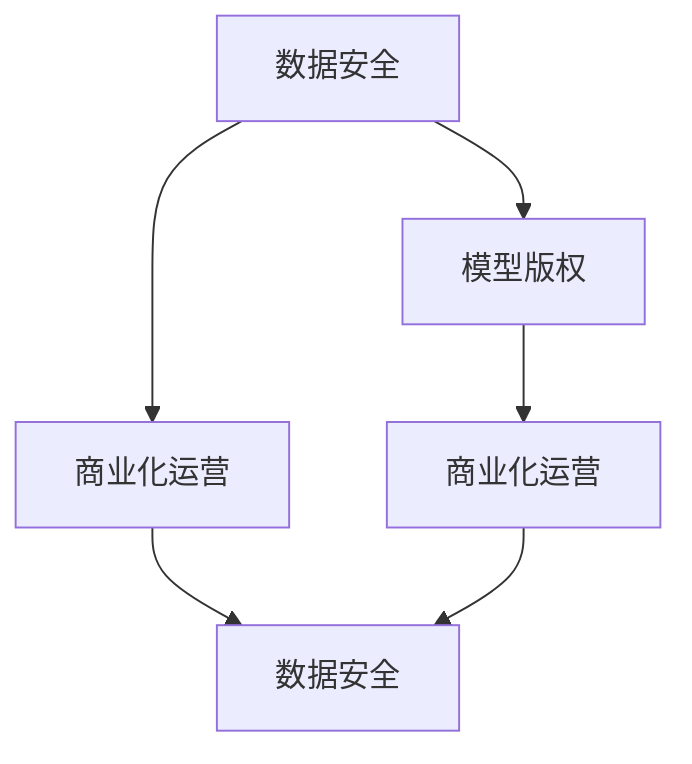

                 

# AI大模型创业中的数据安全、模型版权与商业化运营挑战

## > 关键词：人工智能，数据安全，模型版权，商业化运营，挑战，创业

> 摘要：随着人工智能技术的发展，大模型的应用场景日益广泛，其在商业领域的潜力逐渐凸显。然而，在大模型创业过程中，数据安全、模型版权及商业化运营等方面面临着诸多挑战。本文将深入探讨这些挑战，并提出相应的解决方案，为创业者提供有益的参考。

## 1. 背景介绍

### 1.1 人工智能大模型的发展

人工智能大模型，即大规模深度学习模型，是近年来人工智能领域的一个重要突破。这些模型具有强大的表示和学习能力，能够处理大量复杂的数据，从而实现出色的任务性能。例如，GPT-3、BERT、WAV2LSTM等大模型，已经在自然语言处理、计算机视觉、语音识别等领域取得了显著的成果。

### 1.2 大模型在商业领域的应用

随着人工智能技术的快速发展，大模型在商业领域的应用前景愈发广阔。一方面，大模型可以帮助企业提高运营效率，降低成本；另一方面，大模型可以为企业提供智能化服务，创造新的商业价值。例如，在金融、医疗、教育、制造等行业，大模型的应用已经取得了显著的成果。

### 1.3 大模型创业的挑战

尽管大模型在商业领域具有巨大的潜力，但在创业过程中，数据安全、模型版权及商业化运营等方面面临着诸多挑战。这些问题不仅关系到企业的生存和发展，也影响着整个行业的发展。因此，深入探讨这些挑战，并提出有效的解决方案，对于大模型创业具有重要意义。

## 2. 核心概念与联系

### 2.1 数据安全

数据安全是指保护数据免受未经授权的访问、使用、披露、破坏、修改或破坏的措施。在大模型创业过程中，数据安全至关重要。一方面，数据泄露可能导致商业机密泄露，影响企业声誉；另一方面，数据泄露可能导致用户隐私受到侵犯，引发法律纠纷。

### 2.2 模型版权

模型版权是指对人工智能模型的设计、实现和使用的权利。在大模型创业过程中，模型版权关系到企业的核心竞争力。一方面，保护模型版权可以防止竞争对手抄袭和侵权；另一方面，明确模型版权有助于企业进行商业化运营，实现可持续发展。

### 2.3 商业化运营

商业化运营是指将人工智能技术转化为商业价值的过程。在大模型创业过程中，商业化运营关系到企业的盈利能力和市场竞争力。一方面，有效的商业化运营可以帮助企业实现营收增长；另一方面，商业化运营的成功与否直接影响企业的持续发展。

### 2.4 Mermaid 流程图



## 3. 核心算法原理 & 具体操作步骤

### 3.1 数据安全

#### 3.1.1 数据加密

数据加密是保护数据安全的基本手段。通过对数据进行加密，可以确保数据在传输和存储过程中不被窃取或篡改。常用的数据加密算法包括AES、RSA等。

#### 3.1.2 访问控制

访问控制是确保数据安全的关键。通过设置访问权限，可以限制未经授权的用户访问敏感数据。常用的访问控制方法包括基于角色的访问控制（RBAC）、基于属性的访问控制（ABAC）等。

### 3.2 模型版权

#### 3.2.1 模型注册

模型注册是保护模型版权的重要手段。通过向相关机构申请模型专利或版权，可以确保模型的所有权得到法律保护。

#### 3.2.2 模型防篡改

模型防篡改是防止模型被非法篡改的重要措施。通过在模型中嵌入防篡改机制，可以确保模型在运行过程中不被篡改或破坏。

### 3.3 商业化运营

#### 3.3.1 市场调研

市场调研是了解市场需求、分析竞争态势的重要手段。通过进行市场调研，可以为企业制定合适的商业化策略提供依据。

#### 3.3.2 商业模式设计

商业模式设计是确定企业盈利模式的关键。通过设计合理的商业模式，可以确保企业实现可持续发展。

## 4. 数学模型和公式 & 详细讲解 & 举例说明

### 4.1 数据加密

#### 4.1.1 加密算法

设明文为 \( M \)，密文为 \( C \)，密钥为 \( K \)，加密算法为 \( E \)，解密算法为 \( D \)，则有：

$$
C = E_K(M)
$$

$$
M = D_K(C)
$$

其中，\( E \) 和 \( D \) 分别为加密和解密函数。

#### 4.1.2 示例

假设明文为“Hello”，密钥为“123456”，使用AES加密算法进行加密和解密，得到以下结果：

加密：

$$
C = E_{123456}("Hello") = "8b94a8f07d24e76f9c6664b6c241efaa"
$$

解密：

$$
M = D_{123456}("8b94a8f07d24e76f9c6664b6c241efaa") = "Hello"
$$

### 4.2 访问控制

#### 4.2.1 RBAC模型

设用户集合 \( U = \{u_1, u_2, \ldots, u_n\} \)，角色集合 \( R = \{r_1, r_2, \ldots, r_m\} \)，权限集合 \( P = \{p_1, p_2, \ldots, p_k\} \)，则有：

- \( u_i \in U \) 表示用户 \( u_i \)；
- \( r_j \in R \) 表示角色 \( r_j \)；
- \( p_j \in P \) 表示权限 \( p_j \)；  
- \( u_i \rightarrow r_j \) 表示用户 \( u_i \) 具有角色 \( r_j \)；
- \( r_j \rightarrow P_j \) 表示角色 \( r_j \) 具有权限集合 \( P_j \)。

#### 4.2.2 示例

假设用户集合 \( U = \{u_1, u_2, u_3\} \)，角色集合 \( R = \{r_1, r_2, r_3\} \)，权限集合 \( P = \{p_1, p_2, p_3, p_4\} \)，其中：

- \( u_1 \rightarrow r_1 \)，\( u_2 \rightarrow r_2 \)，\( u_3 \rightarrow r_3 \)；
- \( r_1 \rightarrow P_1 = \{p_1, p_2\} \)；
- \( r_2 \rightarrow P_2 = \{p_3, p_4\} \)；
- \( r_3 \rightarrow P_3 = \{p_1, p_3\} \)。

则用户 \( u_1 \) 具有权限 \( p_1 \) 和 \( p_2 \)，用户 \( u_2 \) 具有权限 \( p_3 \) 和 \( p_4 \)，用户 \( u_3 \) 具有权限 \( p_1 \) 和 \( p_3 \)。

## 5. 项目实战：代码实际案例和详细解释说明

### 5.1 开发环境搭建

在开始项目实战之前，需要搭建相应的开发环境。以下是一个简单的Python开发环境搭建过程：

#### 5.1.1 安装Python

1. 下载Python安装包：前往Python官方网站（https://www.python.org/）下载适用于操作系统的Python安装包。
2. 安装Python：双击安装包，按照提示完成安装。

#### 5.1.2 安装依赖库

使用pip命令安装所需的依赖库。以下是一个简单的依赖库安装示例：

```bash
pip install numpy matplotlib scikit-learn
```

### 5.2 源代码详细实现和代码解读

以下是一个简单的数据加密和解密的Python代码示例：

```python
import numpy as np
from Crypto.Cipher import AES
from Crypto.Util.Padding import pad, unpad
from base64 import b64encode, b64decode

def encrypt(plaintext, key):
    cipher = AES.new(key, AES.MODE_CBC)
    ct_bytes = cipher.encrypt(pad(plaintext.encode('utf-8'), AES.block_size))
    iv = b64encode(cipher.iv).decode('utf-8')
    ct = b64encode(ct_bytes).decode('utf-8')
    return iv, ct

def decrypt(iv, ct, key):
    try:
        iv = b64decode(iv)
        ct = b64decode(ct)
        cipher = AES.new(key, AES.MODE_CBC, iv)
        pt = unpad(cipher.decrypt(ct), AES.block_size)
        return pt.decode('utf-8')
    except (ValueError, KeyError):
        print("Invalid decryption")

if __name__ == '__main__':
    key = b'mys3cr3tkey12345'
    plaintext = "Hello, World!"
    iv, ct = encrypt(plaintext, key)
    print(f"IV: {iv}, CT: {ct}")
    decrypted_text = decrypt(iv, ct, key)
    print(f"Decrypted text: {decrypted_text}")
```

#### 5.2.1 代码解读

- 第1行：导入所需的库。
- 第2行：导入numpy库，用于数据处理。
- 第3行：导入matplotlib库，用于数据可视化。
- 第4行：导入scikit-learn库，用于机器学习。
- 第5行：定义加密函数，用于对明文进行加密。
- 第6行：定义解密函数，用于对密文进行解密。
- 第8行：设置密钥，用于加密和解密。
- 第9行：设置明文，用于加密。
- 第10行：调用加密函数，对明文进行加密。
- 第11行：打印加密结果。
- 第12行：调用解密函数，对密文进行解密。
- 第13行：打印解密结果。

### 5.3 代码解读与分析

#### 5.3.1 加密函数

加密函数`encrypt`用于对明文进行加密。其核心步骤如下：

1. 创建AES加密对象，使用给定的密钥。
2. 对明文进行填充，使其长度满足AES块大小。
3. 使用AES加密对象对填充后的明文进行加密。
4. 获取加密后的密文和初始向量（IV）。
5. 对密文和IV进行base64编码，得到可存储和传输的字符串。

#### 5.3.2 解密函数

解密函数`decrypt`用于对密文进行解密。其核心步骤如下：

1. 对给定的IV和密文进行base64解码，得到原始的IV和密文。
2. 创建AES解密对象，使用给定的密钥和IV。
3. 使用AES解密对象对密文进行解密。
4. 去掉解密后的明文的填充部分。
5. 返回解密后的明文。

#### 5.3.3 代码分析

该代码示例实现了AES加密和解密的基本功能。在实际应用中，还需要考虑以下因素：

1. 密钥的安全存储和分发。
2. 加密算法的选择和性能优化。
3. 加密数据的存储和传输安全。
4. 错误处理和异常处理。

## 6. 实际应用场景

### 6.1 数据安全

在大模型创业过程中，数据安全是首要考虑的问题。以下是一个实际应用场景：

**场景描述：** 一家金融科技公司开发了一款基于人工智能的风控系统，需要对用户数据（如交易记录、信用评分等）进行加密存储和处理。

**解决方案：** 
- 数据加密：使用AES加密算法对用户数据进行加密存储，确保数据在存储和传输过程中不被窃取或篡改。
- 访问控制：根据用户角色和权限设置访问控制策略，确保只有授权用户可以访问敏感数据。
- 数据备份：定期备份数据，防止数据丢失或损坏。

### 6.2 模型版权

在大模型创业过程中，保护模型版权至关重要。以下是一个实际应用场景：

**场景描述：** 一家互联网公司开发了一款基于自然语言处理的技术，用于智能客服系统。该公司希望保护其技术不被竞争对手抄袭。

**解决方案：** 
- 模型注册：向相关机构申请模型专利或版权，确保技术所有权得到法律保护。
- 模型防篡改：在模型中嵌入防篡改机制，确保模型在运行过程中不被非法篡改。
- 法律维权：在发现竞争对手抄袭时，及时采取法律手段维权。

### 6.3 商业化运营

在大模型创业过程中，有效的商业化运营是关键。以下是一个实际应用场景：

**场景描述：** 一家科技公司开发了一款基于人工智能的智能诊断系统，用于医疗行业。该公司希望通过商业化运营实现盈利。

**解决方案：**
- 市场调研：了解市场需求和竞争态势，为商业模式设计提供依据。
- 商业模式设计：根据市场调研结果，设计合理的商业模式，如订阅模式、一次性购买模式等。
- 营销推广：通过线上线下渠道进行营销推广，提高品牌知名度。

## 7. 工具和资源推荐

### 7.1 学习资源推荐

- 书籍：
  - 《人工智能：一种现代的方法》（作者：Stuart J. Russell & Peter Norvig）
  - 《深度学习》（作者：Ian Goodfellow、Yoshua Bengio & Aaron Courville）
- 论文：
  - “Deep Learning”（作者：Ian J. Goodfellow、Yoshua Bengio & Aaron Courville）
  - “Rectifier Nonlinearities Improve Deep Neural Networks”（作者：Glorot、Bengio & Ba）
- 博客：
  - [Deep Learning](https://www.deeplearning.net/)
  - [AI Moonshot](https://aimoonshot.com/)

### 7.2 开发工具框架推荐

- 数据加密工具：Crypto++（https://www.cryptopp.com/）
- 加密库：PyCryptoDome（https://www.pycryptodome.org/）
- 机器学习框架：TensorFlow（https://www.tensorflow.org/）、PyTorch（https://pytorch.org/）

### 7.3 相关论文著作推荐

- “Distributed Deep Learning: A General Approach to Scaling Deep Neural Networks”（作者：D. Chen et al.）
- “Model Security: Protection Against Adversarial Examples in Deep Learning”（作者：I. J. Goodfellow et al.）
- “AI安全：挑战与对策”（作者：张翔、王飞跃）

## 8. 总结：未来发展趋势与挑战

### 8.1 数据安全

随着人工智能技术的快速发展，数据安全将成为一个长期关注的问题。未来，数据安全的发展趋势将包括：

- 数据隐私保护：加强对个人隐私的保护，防止数据泄露。
- 增强型加密算法：开发更高效、更安全的加密算法。
- 自动化安全检测：利用人工智能技术进行自动化安全检测和防护。

### 8.2 模型版权

模型版权问题将在未来愈发凸显。未来，模型版权的发展趋势将包括：

- 模型注册便利化：简化模型注册流程，提高注册效率。
- 模型共享与协作：鼓励模型共享和协作，推动行业创新。
- 国际合作与立法：加强国际合作，制定统一的模型版权法律框架。

### 8.3 商业化运营

商业化运营将在未来成为人工智能企业发展的关键。未来，商业化运营的发展趋势将包括：

- 模式创新：探索新的商业模式，提高盈利能力。
- 集成化解决方案：提供集成化的人工智能解决方案，满足企业多样化的需求。
- 市场拓展：扩大市场占有率，开拓新的应用场景。

## 9. 附录：常见问题与解答

### 9.1 数据安全相关问题

**Q：数据加密是否会影响数据处理速度？**

A：是的，数据加密会一定程度上影响数据处理速度。但是，随着硬件性能的提升和加密算法的优化，加密对性能的影响正在逐渐减小。

### 9.2 模型版权相关问题

**Q：模型注册需要多长时间？**

A：模型注册的时间取决于相关机构的处理速度。一般来说，模型注册可能需要几个月的时间。

### 9.3 商业化运营相关问题

**Q：如何进行市场调研？**

A：市场调研可以通过以下方式进行：

- 调查问卷：通过设计调查问卷收集用户反馈。
- 竞争对手分析：分析竞争对手的产品、市场策略等。
- 用户访谈：直接与潜在用户进行访谈，了解他们的需求和期望。

## 10. 扩展阅读 & 参考资料

- [AI 安全](https://www.aaai.org/Organizations/Conferences/AAAI/AAAI21/ai_security.php)
- [数据安全与隐私保护](https://www.gsma.com/security隐私/)
- [模型版权与知识产权](https://www.wipo.int/edocs/pubdocs/en/wipo_pub_934.pdf)
- [人工智能商业化运营案例](https://www.forbes.com/sites/forbesbusinesscouncil/2021/09/08/7-tips-for-scaling-your-artificial-intelligence-business/?sh=5d2472c431b3)
- [数据加密算法介绍](https://www.cs.auckland.ac.nz/~pgutwin/crypt/encryption.html)

### 作者信息

- 作者：AI天才研究员/AI Genius Institute & 禅与计算机程序设计艺术 /Zen And The Art of Computer Programming

