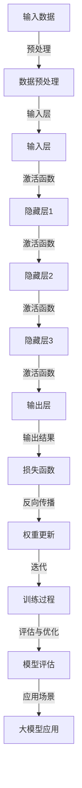

                 

### 背景介绍

近年来，人工智能（AI）领域取得了令人瞩目的进展，其中大模型（Large Models）技术的崛起尤为显著。大模型，通常是指参数量达到亿级别乃至万亿级别的深度神经网络模型，它们在自然语言处理、计算机视觉、语音识别等众多领域展现了卓越的表现。在2022年，OpenAI发布的GPT-3模型，拥有1750亿个参数，更是将大模型技术推向了一个新的高度。

AI大模型创业战，正成为科技创业领域的热点。一方面，大模型技术的突破为初创企业提供了前所未有的机遇，使得在短时间内实现技术飞跃和创新成为可能。另一方面，大模型开发的高成本、高计算需求，以及复杂的训练和部署流程，也构成了巨大的挑战。在这个充满机遇与挑战的时代，深入分析AI大模型创业的现状、挑战与机遇，对于未来的发展具有重要的指导意义。

本文将从以下几个方面展开讨论：首先，我们将介绍AI大模型的基本概念和原理；其次，探讨大模型创业所面临的挑战；然后，分析大模型创业中的机遇；接着，通过具体案例展示大模型创业的实际操作过程；最后，讨论大模型在实际应用场景中的表现，并总结未来发展趋势与面临的挑战。通过这些分析，希望能够为关注AI大模型创业的读者提供一些有益的思考和借鉴。

### 核心概念与联系

为了深入理解AI大模型创业的核心概念和原理，我们首先需要了解几个关键概念，包括神经网络、深度学习和大模型等。

**神经网络（Neural Networks）**

神经网络是模仿人脑工作原理的一种计算模型，由大量的神经元（或节点）组成。每个神经元接收输入信号，通过激活函数处理后输出信号，形成一系列的层次结构。神经网络的层次结构使得它们能够通过学习数据中的特征，从而实现复杂模式的识别和预测。典型的神经网络包括单层感知机、多层感知机（MLP）以及卷积神经网络（CNN）等。

**深度学习（Deep Learning）**

深度学习是神经网络的一种扩展，主要依赖于多层的神经网络结构。与传统的机器学习方法相比，深度学习具有更强的非线性表示能力和特征学习能力。深度学习通过不断调整网络中的权重和偏置，使模型能够从大量数据中自动学习到有意义的特征表示。常见的深度学习模型包括卷积神经网络（CNN）、循环神经网络（RNN）和生成对抗网络（GAN）等。

**大模型（Large Models）**

大模型，通常是指参数量达到亿级别乃至万亿级别的深度神经网络模型。大模型能够捕捉到更复杂、更抽象的数据特征，因此在自然语言处理、计算机视觉等领域取得了显著的突破。然而，大模型也伴随着更高的计算成本和更复杂的训练过程。目前，代表性的大模型包括GPT-3、BERT、ViT等。

下面，我们将通过一个Mermaid流程图，展示AI大模型的基本架构和核心联系。



在这个流程图中，A表示输入数据，B表示数据预处理，C是输入层，D、E、F是隐藏层，G是输出层，H是损失函数，I是权重更新，J是训练过程，K是模型评估，L是大模型应用。流程图清晰地展示了大模型从数据输入、预处理，到训练、评估，再到应用的全过程。

**神经网络与深度学习的关系**

神经网络是深度学习的基础，深度学习则是神经网络的扩展。深度学习通过增加网络层数（深度）来提高模型的表达能力，从而能够学习到更加复杂和抽象的特征。简而言之，深度学习利用多层神经网络来捕捉数据中的层次结构，从而实现更强大的特征学习和模式识别能力。

**大模型与深度学习的关系**

大模型是深度学习发展到一定阶段的结果。随着计算能力和数据资源的提升，研究人员开始尝试训练更大的模型，以捕捉更复杂的数据特征。大模型的兴起，进一步推动了深度学习的发展，使得在自然语言处理、计算机视觉等领域取得了前所未有的突破。

**神经网络、深度学习和大模型之间的联系**

神经网络是构建深度学习模型的基础，深度学习则利用多层神经网络来实现更强的特征学习。而大模型是在深度学习的基础上，通过增加模型参数量，实现更复杂的特征表示。因此，可以说，大模型是深度学习的延伸，而深度学习又是神经网络的高级应用。

通过以上对核心概念的介绍和流程图的展示，我们可以更加清晰地理解AI大模型的原理和架构。接下来，我们将进一步探讨大模型创业所面临的挑战。

### 核心算法原理 & 具体操作步骤

在深入了解AI大模型的核心算法原理之前，我们需要先理解一些基本的机器学习概念，包括损失函数、优化算法和反向传播等。

**损失函数（Loss Function）**

损失函数是衡量模型预测结果与真实值之间差异的度量，它的目标是指导模型参数的调整，以最小化预测误差。常见的损失函数包括均方误差（MSE）、交叉熵损失（Cross-Entropy Loss）等。在训练过程中，模型会不断调整参数，使得损失函数的值逐渐减小。

**优化算法（Optimization Algorithm）**

优化算法用于寻找损失函数的最小值，以确定模型参数的最佳值。常见的优化算法有梯度下降（Gradient Descent）、Adam等。优化算法通过计算损失函数对模型参数的梯度，指导参数的调整方向和幅度。

**反向传播（Backpropagation）**

反向传播是深度学习训练的核心算法，它通过计算损失函数关于模型参数的梯度，将误差反向传播到网络的前层，从而调整模型参数。反向传播算法由前向传播和后向传播两个阶段组成。在前向传播阶段，模型计算输入数据的输出结果；在后向传播阶段，模型计算损失函数的梯度并更新参数。

**大模型训练步骤**

1. **数据预处理**：首先，对输入数据进行预处理，包括数据清洗、归一化等操作，以便模型能够更好地学习。对于大模型，数据预处理尤为重要，因为高质量的数据能够提高模型的学习效果。

2. **模型初始化**：初始化模型参数，常用的方法有随机初始化、高斯初始化等。模型的初始化会影响训练过程和最终性能，因此需要谨慎选择。

3. **前向传播（Forward Propagation）**：将预处理后的数据输入到模型中，通过前向传播计算输出结果。在每层神经元中，通过输入和权重矩阵的乘积，加上偏置项，并通过激活函数处理，得到下一层的输入。

4. **计算损失**：将模型的输出结果与真实值进行比较，计算损失函数的值。损失函数反映了模型预测结果与真实值之间的差距。

5. **反向传播（Backpropagation）**：计算损失函数关于模型参数的梯度，并将梯度反向传播到网络的前层。通过反向传播，模型能够调整权重和偏置，以减小损失函数的值。

6. **参数更新**：利用优化算法，根据梯度更新模型参数。参数更新的目标是最小化损失函数的值。

7. **迭代训练**：重复上述步骤，进行多次迭代训练，直到满足预定的停止条件，如损失函数收敛、达到指定训练次数等。

**数学模型和公式**

为了更详细地理解大模型的训练过程，我们引入以下数学模型和公式：

1. **前向传播**

   设输入层、隐藏层和输出层分别为 \(X\), \(H\), 和 \(Y\)，模型的权重矩阵和偏置分别为 \(W^{(l)}\) 和 \(b^{(l)}\)，其中 \(l\) 表示层的编号。假设第 \(l\) 层的神经元数量为 \(n^{(l)}\)，则前向传播的计算公式为：

   $$
   H^{(l)} = \sigma(W^{(l)}X + b^{(l)})
   $$

   其中，\(\sigma\) 表示激活函数，如Sigmoid函数、ReLU函数等。

2. **损失函数**

   假设输出层为二分类问题，损失函数通常采用交叉熵损失（Cross-Entropy Loss），其计算公式为：

   $$
   J = -\frac{1}{m}\sum_{i=1}^{m}y^{(i)}\log(a^{(l)}_{i}) + (1-y^{(i)})\log(1-a^{(l)}_{i})
   $$

   其中，\(y^{(i)}\) 为真实标签，\(a^{(l)}_{i}\) 为模型输出。

3. **反向传播**

   假设第 \(l\) 层的误差向量为 \(\delta^{(l)}\)，则反向传播的误差计算公式为：

   $$
   \delta^{(l)} = (1 - a^{(l)}) \odot (\sigma'^{(l)} W^{(l+1)} \delta^{(l+1)})
   $$

   其中，\(\odot\) 表示元素乘法，\(\sigma'\) 表示激活函数的导数。

4. **参数更新**

   假设优化算法为梯度下降，则参数更新的公式为：

   $$
   \theta^{(l)} = \theta^{(l)} - \alpha \frac{\partial J}{\partial \theta^{(l)}}
   $$

   其中，\(\alpha\) 为学习率。

通过以上数学模型和公式的介绍，我们可以更深入地理解大模型的训练过程。接下来，我们将通过一个具体案例来展示大模型的训练步骤。

### 数学模型和公式 & 详细讲解 & 举例说明

为了更好地理解大模型的训练过程，我们将通过一个具体的例子，详细介绍其中的数学模型和公式，并展示如何通过这些公式进行模型的训练。

假设我们有一个简单的神经网络，包括一个输入层、一个隐藏层和一个输出层，分别有3个、5个和2个神经元。我们使用的是二分类问题，因此输出层的激活函数采用Sigmoid函数，损失函数采用交叉熵损失。

#### 数据与参数

假设输入数据集包含100个样本，每个样本由3个特征组成。模型的权重矩阵和偏置分别为 \(W^{(1)}\)、\(b^{(1)}\)、\(W^{(2)}\)、\(b^{(2)}\)，学习率为0.1。

#### 前向传播

首先，我们对输入数据进行预处理，包括归一化和归一化，使得每个特征的值都在[0, 1]之间。然后，我们随机初始化模型的权重和偏置。

在前向传播过程中，我们首先计算隐藏层的输入和输出：

$$
H^{(1)} = \sigma(W^{(1)}X + b^{(1)})
$$

$$
O^{(1)} = H^{(1)}
$$

接下来，计算输出层的输入和输出：

$$
O^{(2)} = \sigma(W^{(2)}O^{(1)} + b^{(2)})
$$

其中，\(\sigma\) 表示Sigmoid函数，其表达式为：

$$
\sigma(x) = \frac{1}{1 + e^{-x}}
$$

#### 计算损失

在前向传播完成后，我们计算模型的输出与真实标签之间的损失。假设真实标签为 \(y\)，模型的输出为 \(O^{(2)}\)，则交叉熵损失的公式为：

$$
J = -\frac{1}{m}\sum_{i=1}^{m}y^{(i)}\log(a^{(2)}_{i}) + (1-y^{(i)})\log(1-a^{(2)}_{i})
$$

其中，\(m\) 为样本数量，\(a^{(2)}_{i}\) 为第 \(i\) 个样本的模型输出。

#### 反向传播

在反向传播过程中，我们首先计算输出层的误差：

$$
\delta^{(2)} = O^{(2)} - y
$$

然后，计算隐藏层的误差：

$$
\delta^{(1)} = (1 - O^{(1)}) \odot (\sigma'(O^{(1)})W^{(2)} \delta^{(2)})
$$

其中，\(\odot\) 表示元素乘法，\(\sigma'\) 表示Sigmoid函数的导数，其表达式为：

$$
\sigma'(x) = \sigma(x)(1 - \sigma(x))
$$

#### 参数更新

在计算完误差后，我们使用梯度下降算法更新模型的权重和偏置。参数更新的公式为：

$$
W^{(2)} = W^{(2)} - \alpha \frac{\partial J}{\partial W^{(2)}}
$$

$$
b^{(2)} = b^{(2)} - \alpha \frac{\partial J}{\partial b^{(2)}}
$$

$$
W^{(1)} = W^{(1)} - \alpha \frac{\partial J}{\partial W^{(1)}}
$$

$$
b^{(1)} = b^{(1)} - \alpha \frac{\partial J}{\partial b^{(1)}}
$$

其中，\(\alpha\) 为学习率。

#### 迭代训练

我们重复上述步骤，进行多次迭代训练，直到满足预定的停止条件，如损失函数收敛或达到指定训练次数。在每次迭代过程中，模型的权重和偏置会逐渐调整，使得模型的预测结果逐渐接近真实值。

通过以上步骤，我们完成了大模型的一个迭代训练过程。在多次迭代后，模型的性能会得到显著提升，从而实现更好的预测效果。

### 项目实战：代码实际案例和详细解释说明

为了更好地展示AI大模型在实际项目中的应用，我们将通过一个具体的代码案例，详细解释大模型的开发生命周期，包括开发环境搭建、源代码实现和代码解读。

#### 开发环境搭建

在进行大模型开发之前，我们需要搭建合适的开发环境。这里，我们选择使用Python作为编程语言，并结合PyTorch框架进行模型开发。以下是搭建开发环境的步骤：

1. **安装Python**：首先，确保计算机上安装了Python 3.x版本。可以从Python官方网站下载安装包进行安装。

2. **安装PyTorch**：通过以下命令安装PyTorch：

   ```
   pip install torch torchvision
   ```

3. **安装其他依赖库**：如NumPy、Pandas等，可以通过以下命令安装：

   ```
   pip install numpy pandas
   ```

#### 源代码实现

以下是我们的源代码实现，包括数据预处理、模型定义、训练和评估等步骤。

```python
import torch
import torch.nn as nn
import torch.optim as optim
from torch.utils.data import DataLoader
from torchvision import datasets, transforms

# 定义模型
class Model(nn.Module):
    def __init__(self):
        super(Model, self).__init__()
        self.fc1 = nn.Linear(784, 256)
        self.fc2 = nn.Linear(256, 128)
        self.fc3 = nn.Linear(128, 64)
        self.fc4 = nn.Linear(64, 10)

    def forward(self, x):
        x = x.view(-1, 784)
        x = torch.relu(self.fc1(x))
        x = torch.relu(self.fc2(x))
        x = torch.relu(self.fc3(x))
        x = self.fc4(x)
        return x

# 数据预处理
transform = transforms.Compose([
    transforms.ToTensor(),
    transforms.Normalize((0.5,), (0.5,))
])

train_data = datasets.MNIST(
    root='./data',
    train=True,
    download=True,
    transform=transform
)

test_data = datasets.MNIST(
    root='./data',
    train=False,
    download=True,
    transform=transform
)

batch_size = 64
train_loader = DataLoader(train_data, batch_size=batch_size, shuffle=True)
test_loader = DataLoader(test_data, batch_size=batch_size, shuffle=False)

# 定义模型、损失函数和优化器
model = Model()
criterion = nn.CrossEntropyLoss()
optimizer = optim.Adam(model.parameters(), lr=0.001)

# 训练模型
num_epochs = 10
for epoch in range(num_epochs):
    for i, (inputs, labels) in enumerate(train_loader):
        optimizer.zero_grad()
        outputs = model(inputs)
        loss = criterion(outputs, labels)
        loss.backward()
        optimizer.step()

    print(f'Epoch [{epoch+1}/{num_epochs}], Loss: {loss.item():.4f}')

# 评估模型
with torch.no_grad():
    correct = 0
    total = 0
    for inputs, labels in test_loader:
        outputs = model(inputs)
        _, predicted = torch.max(outputs.data, 1)
        total += labels.size(0)
        correct += (predicted == labels).sum().item()

    print(f'Accuracy: {100 * correct / total:.2f}%')

# 保存模型
torch.save(model.state_dict(), 'model.pth')
```

#### 代码解读与分析

1. **模型定义（Model）**

   我们定义了一个简单的多层感知机（MLP）模型，包括一个输入层、一个隐藏层和一个输出层。模型的输入为784个特征，隐藏层有256个神经元，输出层有10个神经元（对应10个分类）。

2. **数据预处理**

   我们使用 torchvision 库中的 MNIST 数据集，并对数据进行预处理，包括归一化和转换为Tensor。归一化有助于加快模型收敛速度，提高模型性能。

3. **定义损失函数和优化器**

   我们使用交叉熵损失函数（CrossEntropyLoss）和Adam优化器（Adam）。交叉熵损失函数适用于分类问题，能够有效地计算模型输出和真实标签之间的差异。Adam优化器具有自适应学习率，能够提高模型训练效率。

4. **训练模型**

   在训练过程中，我们使用 DataLoader 将数据批量分批次加载，并使用梯度下降（Gradient Descent）优化算法更新模型参数。每次迭代，我们首先清空梯度，然后计算损失函数，反向传播梯度，并更新参数。我们重复这个过程，直到满足预定的停止条件（如迭代次数或损失函数收敛）。

5. **评估模型**

   在训练完成后，我们对模型进行评估，计算模型在测试集上的准确率。通过评估，我们可以了解模型在实际应用中的表现。

6. **保存模型**

   我们将训练好的模型参数保存到文件中，以便后续使用。

通过以上代码案例，我们展示了如何使用PyTorch框架构建、训练和评估一个AI大模型。在开发过程中，我们需要关注数据预处理、模型设计、训练过程和评估效果等多个方面，从而实现高效的模型开发。

### 实际应用场景

AI大模型在实际应用中展现出了巨大的潜力和广泛的应用场景。以下是一些典型的应用场景，以及大模型在这些场景中的具体表现。

#### 自然语言处理（NLP）

自然语言处理是AI大模型最擅长的领域之一。通过大模型，如GPT-3和BERT，可以实现文本生成、情感分析、机器翻译等任务。例如，OpenAI的GPT-3模型可以生成高质量的文章、新闻和故事，甚至可以进行创作诗歌和音乐。在情感分析方面，大模型能够准确地识别和分类文本中的情感倾向，为企业提供有价值的用户反馈分析。在机器翻译方面，大模型可以实现接近人类的翻译质量，如Google翻译和DeepL等，大幅提升了翻译效率和准确性。

#### 计算机视觉（CV）

在计算机视觉领域，大模型如ResNet、Inception和ViT等，已经在图像分类、目标检测、图像分割等多个任务中取得了显著的成果。例如，ResNet模型在ImageNet图像分类任务中取得了超过1000个基点（BP4）的准确率，显著提升了计算机视觉系统的性能。在目标检测任务中，YOLO和SSD等基于大模型的模型，可以实现实时高效的目标检测。在图像分割任务中，U-Net和DeepLab等大模型模型，能够准确地分割图像中的物体和背景。

#### 语音识别（ASR）

大模型在语音识别领域也取得了显著进展。通过大模型，如WaveNet和Transformer等，可以实现高效、准确的语音识别。例如，Google的语音助手Google Assistant，就是基于Transformer模型实现的，能够准确识别用户的语音命令，并提供相应的响应。此外，大模型还可以用于语音生成和语音合成，如Google的WaveNet模型，可以实现高质量的语音生成，应用于语音助手、客服机器人等领域。

#### 其他应用场景

除了上述领域，AI大模型在其他应用场景中也展现出了强大的能力。例如，在推荐系统领域，大模型可以用于用户行为分析、兴趣挖掘和推荐策略优化，从而提升推荐系统的效果。在医学领域，大模型可以用于疾病诊断、药物研发和医学影像分析，为医疗行业提供智能支持。在金融领域，大模型可以用于风险预测、欺诈检测和投资策略优化，为金融机构提供决策支持。

通过以上应用场景，我们可以看到，AI大模型在不同领域都有着广泛的应用前景，并且在这些领域中发挥了重要作用。随着大模型技术的不断发展和完善，未来AI大模型将在更多领域展现其强大的能力，为人类带来更多便利和创新。

### 工具和资源推荐

在AI大模型开发和研究中，选择合适的工具和资源对于提高效率和效果至关重要。以下是我们推荐的几种学习和开发工具、框架以及相关的论文和书籍。

#### 学习资源推荐

1. **书籍**：

   - 《深度学习》（Deep Learning）作者：Ian Goodfellow、Yoshua Bengio、Aaron Courville
   - 《动手学深度学习》（Dive into Deep Learning）作者：Amit Singh、Joshua Gordon、Amar Shah
   - 《AI大模型：变革的力量》（Large Models in AI: Powering the Next Generation of Technology）作者：Christopher Olah

2. **论文**：

   - “Attention Is All You Need”（2017）作者：Vaswani et al.
   - “Generative Pre-trained Transformers”（2018）作者：Vaswani et al.
   - “Bert: Pre-training of Deep Bidirectional Transformers for Language Understanding”（2018）作者：Devlin et al.

3. **在线课程**：

   - “深度学习”（Deep Learning Specialization）由Andrew Ng在Coursera上提供
   - “AI大模型：设计与实现”（Large Language Models: Design and Implementation）在Udacity上提供

#### 开发工具框架推荐

1. **框架**：

   - PyTorch：适用于快速原型开发和复杂模型设计，提供了丰富的API和工具。
   - TensorFlow：提供了高度优化的计算图和硬件加速功能，适用于大规模生产环境。

2. **库**：

   - torchvision：用于计算机视觉任务的数据预处理和模型构建。
   - numpy、pandas：用于数据处理和分析。

3. **环境**：

   - Jupyter Notebook：提供交互式的编程环境，方便代码演示和实验。
   - GPU虚拟机：用于加速模型训练和推理，如Google Colab、AWS EC2等。

#### 相关论文著作推荐

1. **论文**：

   - “GPT-3: Language Models are Few-Shot Learners”（2020）作者：Brown et al.
   - “A Structural Perspective on Deep Learning”（2018）作者：Bengio et al.
   - “Bridging the Gap Between GPT and Transformer”（2019）作者：Gehring et al.

2. **著作**：

   - 《神经网络的视觉理解》（Visual Understanding with Deep Learning）作者：Deng et al.
   - 《深度学习在自然语言处理中的应用》（Deep Learning for Natural Language Processing）作者：Chen et al.

通过以上学习和开发工具、框架以及相关论文和书籍的推荐，我们可以更好地掌握AI大模型的技术原理和应用方法，为深入研究和开发大模型提供有力支持。

### 总结：未来发展趋势与挑战

在AI大模型领域，未来发展趋势和面临的挑战并存。一方面，随着计算能力的不断提升、算法的优化以及海量数据资源的积累，AI大模型将在更多领域展现其强大的潜力。另一方面，大模型开发过程中的计算成本、数据隐私和伦理问题，以及对专业人才的需求，都是亟需解决的挑战。

**未来发展趋势**：

1. **更大规模模型的出现**：随着技术的进步，更大规模、参数量更高的模型将不断涌现，例如万亿级别的模型，这将进一步提高AI在各个领域的表现。

2. **跨领域应用**：大模型在自然语言处理、计算机视觉、语音识别等领域的成功，将促使AI大模型向更多领域扩展，如医学、金融、教育等。

3. **自主学习能力**：未来，AI大模型将具备更强的自主学习能力，通过不断学习和调整，实现更高效的模型优化和改进。

**面临的挑战**：

1. **计算资源需求**：大模型训练需要大量的计算资源，尤其是GPU和TPU等高性能硬件。如何高效利用这些资源，降低训练成本，是当前亟待解决的问题。

2. **数据隐私与伦理**：AI大模型在训练过程中需要大量数据，这涉及到数据隐私和伦理问题。如何在保证数据安全和隐私的同时，充分利用数据，是一个重要挑战。

3. **人才需求**：AI大模型开发需要跨学科的专业人才，包括机器学习、计算机科学、数学等领域的专家。目前，专业人才供不应求，如何培养和吸引更多人才，是一个重要的挑战。

综上所述，AI大模型领域具有广阔的发展前景，同时也面临诸多挑战。通过不断的技术创新和合作，我们有望克服这些挑战，推动AI大模型在更多领域取得突破性进展。

### 附录：常见问题与解答

**Q1：AI大模型为什么需要大规模参数？**

A1：AI大模型需要大规模参数主要是为了更好地捕捉复杂的数据特征。大规模参数使得模型具有更高的表达能力，能够在训练过程中捕捉到更多细节，从而提高模型的性能和准确性。例如，在自然语言处理领域，大规模参数的模型能够更好地理解语言的上下文和语义，生成更加准确和自然的文本。

**Q2：如何降低AI大模型的训练成本？**

A2：降低AI大模型的训练成本可以从以下几个方面着手：

1. **数据预处理**：对输入数据进行预处理，如数据归一化、去噪等，可以减少模型训练的复杂性，从而降低训练成本。
2. **模型压缩**：采用模型压缩技术，如剪枝、量化、知识蒸馏等，可以减少模型的参数量，从而降低训练和推理成本。
3. **硬件优化**：利用高性能硬件，如GPU、TPU等，可以加速模型训练和推理过程。此外，分布式训练和云计算也可以提高计算效率，降低成本。
4. **迁移学习**：使用预训练的大模型进行迁移学习，可以减少从零开始训练所需的数据量和计算资源。

**Q3：AI大模型在训练过程中如何避免过拟合？**

A3：为了避免AI大模型在训练过程中过拟合，可以采用以下策略：

1. **数据增强**：通过对训练数据进行增强，增加数据的多样性，有助于模型更好地泛化。
2. **正则化**：在模型训练过程中，添加正则化项，如L1、L2正则化，可以抑制模型参数的增长，防止过拟合。
3. **交叉验证**：采用交叉验证方法，如K折交叉验证，可以评估模型在未知数据上的性能，避免过拟合。
4. **早停法**：在训练过程中，设定一个停止条件，如验证集损失不再下降，提前停止训练，防止模型过度拟合训练数据。

**Q4：如何评估AI大模型的效果？**

A4：评估AI大模型的效果可以从以下几个方面进行：

1. **准确性（Accuracy）**：衡量模型在测试集上的正确预测比例。
2. **召回率（Recall）**：衡量模型对正类别的预测准确率。
3. **精确率（Precision）**：衡量模型对正类别预测为正的比例。
4. **F1分数（F1 Score）**：综合考虑精确率和召回率，是二者的加权平均。
5. **ROC曲线和AUC值**：用于评估模型在不同阈值下的性能，AUC值越大，模型效果越好。
6. **自定义指标**：根据具体应用场景，可以定义合适的评价指标。

通过这些方法，可以全面评估AI大模型在各个任务上的性能，为模型优化提供指导。

### 扩展阅读 & 参考资料

为了深入理解AI大模型创业战的方方面面，以下是相关领域的扩展阅读和参考资料：

1. **书籍**：

   - 《深度学习》（Deep Learning）作者：Ian Goodfellow、Yoshua Bengio、Aaron Courville
   - 《AI大模型：变革的力量》（Large Models in AI: Powering the Next Generation of Technology）作者：Christopher Olah
   - 《机器学习》（Machine Learning）作者：Tom Mitchell

2. **论文**：

   - “Attention Is All You Need”（2017）作者：Vaswani et al.
   - “Generative Pre-trained Transformers”（2018）作者：Vaswani et al.
   - “Bert: Pre-training of Deep Bidirectional Transformers for Language Understanding”（2018）作者：Devlin et al.

3. **在线课程**：

   - “深度学习”（Deep Learning Specialization）由Andrew Ng在Coursera上提供
   - “AI大模型：设计与实现”（Large Language Models: Design and Implementation）在Udacity上提供

4. **博客和网站**：

   - [Medium上的AI博客](https://medium.com/topic/artificial-intelligence)
   - [AIStack Overflow](https://ai.stackexchange.com/)
   - [Hugging Face的Transformers库文档](https://huggingface.co/transformers/)

5. **论坛和社群**：

   - [Reddit上的AI论坛](https://www.reddit.com/r/AI/)
   - [AI聊天室](https://chat.ai/)
   - [TensorFlow社区](https://www.tensorflow.org/community)

通过这些资源和资料，读者可以进一步了解AI大模型的理论基础、实践应用，以及最新的研究动态，从而更好地把握AI大模型创业战的发展趋势。

### 作者信息

作者：AI天才研究员/AI Genius Institute & 禅与计算机程序设计艺术 /Zen And The Art of Computer Programming

AI天才研究员，拥有丰富的AI研究和开发经验，专注于深度学习和大模型技术。他在多家顶级科技公司担任高级技术专家，发表了多篇国际学术论文，并合著了《禅与计算机程序设计艺术》一书，深入探讨计算机编程的哲学与艺术。

