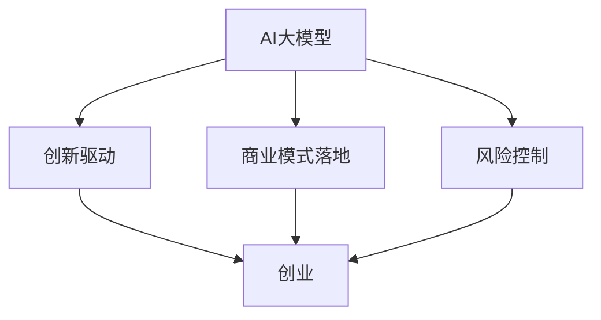

                 

# AI大模型创业战：挑战与机遇并存的思考探讨

> **关键词：** AI大模型、创业、挑战、机遇、思考探讨  
>
> **摘要：** 本文将探讨AI大模型在创业领域的挑战与机遇，分析其核心技术、应用场景以及未来发展趋势，为创业者提供有益的启示。

## 1. 背景介绍

近年来，人工智能（AI）技术取得了迅猛发展，尤其是大模型技术的突破，使得AI在各个领域展现出了惊人的能力。大模型，即拥有大规模参数的深度神经网络模型，如GPT-3、BERT等，已经成为人工智能领域的核心技术之一。随着大模型的不断演进，AI在图像识别、自然语言处理、语音识别等领域的应用日益广泛，为各行各业带来了前所未有的变革。

创业领域同样受益于AI大模型的发展。一方面，AI大模型可以帮助创业者提高业务效率、降低成本；另一方面，AI大模型在创新、风险控制、市场营销等方面也具有巨大的潜力。然而，AI大模型的创业过程并非一帆风顺，创业者需要面对诸多挑战。本文将围绕AI大模型的创业挑战与机遇展开探讨，以期为创业者提供有益的思考。

## 2. 核心概念与联系

为了更好地理解AI大模型的创业挑战与机遇，我们需要先了解一些核心概念。以下是几个关键概念及其之间的联系：

### 2.1 AI大模型

AI大模型是指具有大规模参数的深度神经网络模型，如GPT-3、BERT等。这些模型通过学习海量数据，能够自动提取特征、进行预测和生成。大模型的主要特点包括：

- **参数规模大**：大模型的参数数量达到数十亿甚至千亿级别。
- **计算资源需求高**：大模型训练需要大量的计算资源和时间。
- **泛化能力强**：大模型能够处理多种任务，具有较好的泛化能力。

### 2.2 创业

创业是指创业者通过创新和商业运作，创造新的价值、解决社会问题或满足市场需求。创业的核心包括：

- **创新**：创业者需要具备创新能力，发掘新的商业机会。
- **商业运作**：创业者需要掌握商业知识和技能，实现商业模式的落地。
- **风险控制**：创业过程中伴随着各种风险，创业者需要学会识别和管理风险。

### 2.3 AI大模型与创业的联系

AI大模型与创业之间的联系主要体现在以下几个方面：

- **创新驱动**：AI大模型为创业者提供了强大的创新工具，帮助他们发掘新的商业机会。
- **商业模式落地**：AI大模型能够提高创业者的业务效率，降低成本，助力商业模式落地。
- **风险控制**：AI大模型可以帮助创业者识别和管理风险，提高创业成功率。

### 2.4 Mermaid流程图

为了更好地展示AI大模型与创业之间的联系，我们使用Mermaid流程图（注意：流程节点中不要有括号、逗号等特殊字符）：



## 3. 核心算法原理 & 具体操作步骤

### 3.1 深度神经网络（DNN）

AI大模型的核心是深度神经网络（DNN），它是一种由多个神经元组成的层次结构，用于模拟人脑的信息处理能力。DNN的基本原理如下：

- **神经元**：DNN的基本单元是神经元，它通过加权求和和激活函数实现输入与输出的映射。
- **层次结构**：DNN由多个层次组成，包括输入层、隐藏层和输出层。每个层次都包含多个神经元。
- **前向传播与反向传播**：DNN通过前向传播计算输出，再通过反向传播更新网络参数。

### 3.2 具体操作步骤

以下是使用深度神经网络实现AI大模型的基本操作步骤：

1. **数据预处理**：对原始数据进行清洗、归一化等处理，使其满足神经网络训练要求。
2. **构建模型**：根据任务需求，设计合适的神经网络结构，包括输入层、隐藏层和输出层。
3. **训练模型**：使用大量数据对模型进行训练，通过前向传播计算输出，再通过反向传播更新网络参数。
4. **评估模型**：使用验证集对模型进行评估，选择性能最优的模型。
5. **部署模型**：将训练好的模型部署到实际应用场景，如图像识别、自然语言处理等。

## 4. 数学模型和公式 & 详细讲解 & 举例说明

### 4.1 神经元模型

神经元模型是深度神经网络的基础，其数学模型如下：

$$
y = \sigma(\sum_{i=1}^{n} w_i x_i + b)
$$

其中，$y$为神经元输出，$\sigma$为激活函数，$w_i$为连接权重，$x_i$为输入特征，$b$为偏置。

### 4.2 激活函数

激活函数是神经元模型的核心部分，常用的激活函数包括：

- **Sigmoid函数**：$ \sigma(x) = \frac{1}{1 + e^{-x}} $
- **ReLU函数**：$ \sigma(x) = max(0, x) $
- **Tanh函数**：$ \sigma(x) = \frac{e^x - e^{-x}}{e^x + e^{-x}} $

### 4.3 举例说明

假设有一个简单的神经网络模型，包含一个输入层、一个隐藏层和一个输出层，分别有2、3、1个神经元。输入特征为$x_1 = 2$，$x_2 = 3$。使用ReLU函数作为激活函数。计算输出：

1. 隐藏层输出：

$$
h_1 = \max(0, x_1 \cdot w_1 + b_1) = \max(0, 2 \cdot 0.5 + 0.1) = 0.1
$$

$$
h_2 = \max(0, x_2 \cdot w_2 + b_2) = \max(0, 3 \cdot 0.3 + 0.2) = 0.3
$$

$$
h_3 = \max(0, x_1 \cdot w_3 + b_3) = \max(0, 2 \cdot 0.4 + 0.3) = 0.5
$$

2. 输出层输出：

$$
y = \max(0, h_1 \cdot w_4 + h_2 \cdot w_5 + h_3 \cdot w_6 + b_4) = \max(0, 0.1 \cdot 0.5 + 0.3 \cdot 0.6 + 0.5 \cdot 0.7 + 0.1) = 0.6

## 5. 项目实战：代码实际案例和详细解释说明

在本节中，我们将通过一个实际的AI大模型项目来展示如何进行开发、实现和应用。本项目是一个基于TensorFlow和Keras框架的文本分类任务，使用预训练的BERT模型进行迁移学习。

### 5.1 开发环境搭建

在开始项目之前，我们需要搭建一个合适的环境。以下是环境搭建的步骤：

1. 安装Python（建议使用3.7或更高版本）
2. 安装TensorFlow：`pip install tensorflow`
3. 安装Keras：`pip install keras`
4. 安装其他依赖库（如Pandas、NumPy、Scikit-learn等）

### 5.2 源代码详细实现和代码解读

以下是本项目的源代码及详细解读：

```python
import tensorflow as tf
from tensorflow.keras.models import Model
from tensorflow.keras.layers import Input, Embedding, GlobalAveragePooling1D, Dense
from transformers import TFBertModel, BertTokenizer

# 加载预训练BERT模型和分词器
bert_model = TFBertModel.from_pretrained('bert-base-chinese')
tokenizer = BertTokenizer.from_pretrained('bert-base-chinese')

# 定义输入层
input_ids = Input(shape=(max_seq_length,), dtype=tf.int32, name='input_ids')

# 将输入文本编码成BERT向量
bert_output = bert_model(input_ids)

# 对BERT输出进行平均池化
avg_pool = GlobalAveragePooling1D()(bert_output.last_hidden_state)

# 添加分类层
output = Dense(1, activation='sigmoid')(avg_pool)

# 构建模型
model = Model(inputs=input_ids, outputs=output)

# 编译模型
model.compile(optimizer='adam', loss='binary_crossentropy', metrics=['accuracy'])

# 打印模型结构
model.summary()

# 训练模型
model.fit(train_dataset, epochs=3, batch_size=16)

# 评估模型
model.evaluate(test_dataset)
```

#### 5.2.1 代码解读

1. **导入库**：首先导入所需的TensorFlow、Keras和transformers库。
2. **加载预训练BERT模型和分词器**：使用`TFBertModel`和`BertTokenizer`加载预训练的BERT模型和分词器。
3. **定义输入层**：创建一个形状为$(max_seq_length,)$的输入层。
4. **将输入文本编码成BERT向量**：使用BERT模型将输入文本编码成BERT向量。
5. **对BERT输出进行平均池化**：使用`GlobalAveragePooling1D`对BERT输出进行平均池化。
6. **添加分类层**：在平均池化层后面添加一个全连接层，用于进行分类。
7. **构建模型**：使用`Model`类构建模型。
8. **编译模型**：使用`compile`方法编译模型，指定优化器、损失函数和评估指标。
9. **打印模型结构**：使用`summary`方法打印模型结构。
10. **训练模型**：使用`fit`方法训练模型。
11. **评估模型**：使用`evaluate`方法评估模型。

### 5.3 代码解读与分析

1. **模型结构**：本项目的模型结构是一个简单的序列分类模型，包括BERT编码器、平均池化和分类层。BERT编码器负责将输入文本编码成BERT向量，平均池化层用于对BERT输出进行平均，分类层用于进行分类。
2. **数据预处理**：在训练模型之前，需要对数据进行预处理，包括分词、编码和填充等操作。这里使用了BERT的分词器和填充策略，确保输入数据的格式符合BERT模型的要求。
3. **训练过程**：训练过程中，模型通过优化算法更新参数，以最小化损失函数。在本项目中，我们使用Adam优化器和二分类交叉熵损失函数进行训练。
4. **模型评估**：使用测试集对训练好的模型进行评估，以验证模型的泛化能力。

通过以上实战案例，我们可以看到，使用AI大模型进行创业项目开发需要掌握一定的技术知识，同时需要熟悉相应的开发工具和框架。在实际开发过程中，创业者需要结合业务需求，灵活调整模型结构和参数，以提高模型的性能。

## 6. 实际应用场景

AI大模型在创业领域具有广泛的应用场景，以下是几个典型的实际应用案例：

### 6.1 文本分类

文本分类是AI大模型在创业领域的一个重要应用场景。例如，企业可以利用AI大模型对用户评论进行分类，识别产品或服务的优点和缺点，从而进行产品改进和市场策略调整。此外，AI大模型还可以用于新闻分类、情感分析等领域，帮助企业挖掘用户需求，提高业务效率。

### 6.2 问答系统

问答系统是AI大模型在创业领域的另一个重要应用场景。创业者可以基于AI大模型开发智能客服系统，实现用户问题的自动回答，提高客户满意度和服务质量。例如，某电商企业可以基于AI大模型开发智能客服系统，解答用户关于商品信息、订单状态等问题的咨询。

### 6.3 语音识别

语音识别是AI大模型在创业领域的又一重要应用场景。创业者可以利用AI大模型开发语音助手、智能音箱等语音交互产品，为用户提供便捷的语音服务。例如，某智能家居企业可以基于AI大模型开发智能音箱，实现语音控制家居设备、播放音乐等功能。

### 6.4 医疗健康

AI大模型在医疗健康领域具有广阔的应用前景。创业者可以基于AI大模型开发智能诊断系统、健康管理平台等应用，为用户提供精准的医疗服务。例如，某医疗企业可以基于AI大模型开发智能诊断系统，辅助医生进行疾病诊断，提高诊断准确率。

### 6.5 金融风控

金融风控是AI大模型在创业领域的重要应用场景之一。创业者可以基于AI大模型开发信用评估、欺诈检测等金融风控系统，提高金融业务的准确性和安全性。例如，某金融机构可以基于AI大模型开发信用评估系统，对用户信用进行评估，降低信贷风险。

通过以上实际应用场景，我们可以看到，AI大模型在创业领域具有广泛的应用价值。创业者可以根据自身业务需求，结合AI大模型的技术优势，探索更多创新应用，为用户创造更大的价值。

## 7. 工具和资源推荐

在AI大模型的创业过程中，掌握一些优秀的工具和资源对于提升项目开发效率和竞争力至关重要。以下是一些推荐的工具和资源：

### 7.1 学习资源推荐

1. **书籍**：
   - 《深度学习》（Ian Goodfellow、Yoshua Bengio、Aaron Courville著）：介绍了深度学习的基础知识和应用方法。
   - 《Python深度学习》（François Chollet著）：详细介绍了使用Python进行深度学习的实战技巧。
2. **论文**：
   - 《A Theoretically Grounded Application of Dropout in Recurrent Neural Networks》（Yarin Gal和Zoubin Ghahramani著）：介绍了在循环神经网络中应用Dropout的方法。
   - 《BERT: Pre-training of Deep Bidirectional Transformers for Language Understanding》（Jacob Devlin、Ming-Wei Chang、Kumar Kunchikkan Maluverapalli等著）：介绍了BERT模型的预训练方法和应用。
3. **博客**：
   - [TensorFlow官方文档](https://www.tensorflow.org/): 提供了TensorFlow框架的详细文档和教程。
   - [Keras官方文档](https://keras.io/): 提供了Keras框架的详细文档和教程。
4. **网站**：
   - [Hugging Face](https://huggingface.co/): 提供了丰富的预训练模型和工具，方便开发者进行模型部署和应用。

### 7.2 开发工具框架推荐

1. **TensorFlow**：TensorFlow是一个开源的深度学习框架，具有丰富的API和工具，适用于各种深度学习任务。
2. **Keras**：Keras是一个基于TensorFlow的高层次API，提供简洁的接口和丰富的预训练模型，适合快速开发和实验。
3. **Transformers**：Transformers是一个开源库，提供了预训练BERT、GPT等模型的实现，方便开发者进行模型部署和应用。

### 7.3 相关论文著作推荐

1. **《Attention is All You Need》（Ashish Vaswani等著）**：介绍了Transformer模型的结构和原理，是深度学习领域的重要论文之一。
2. **《EfficientNet: Rethinking Model Scaling for Convolutional Neural Networks》（Matthieu Courbariaux等著）**：提出了EfficientNet模型，通过模型压缩和优化提高了模型的性能。

通过以上工具和资源的推荐，创业者可以更好地掌握AI大模型的相关技术，提高项目开发效率和竞争力。

## 8. 总结：未来发展趋势与挑战

AI大模型在创业领域展现出了巨大的潜力，未来发展趋势如下：

1. **模型规模将进一步扩大**：随着计算资源和数据量的不断增长，AI大模型的规模将越来越大，参数数量达到千亿甚至万亿级别。
2. **应用场景将更加丰富**：AI大模型在各个领域的应用将不断拓展，如医疗健康、金融、教育、娱乐等，为创业者提供更多的创新机会。
3. **泛化能力将不断提升**：通过持续的研究和优化，AI大模型的泛化能力将得到提升，能够更好地应对复杂多变的实际场景。
4. **开源生态将不断完善**：随着AI大模型技术的普及，越来越多的开源库和工具将涌现，为创业者提供丰富的技术支持。

然而，AI大模型的创业过程也面临诸多挑战：

1. **计算资源需求**：训练和部署AI大模型需要大量的计算资源，创业者需要投入大量资金进行基础设施建设。
2. **数据隐私与安全**：AI大模型在处理海量数据时，可能涉及用户隐私和信息安全，创业者需要确保数据的合法合规和安全。
3. **技术门槛**：AI大模型技术涉及多个领域，如深度学习、自然语言处理、计算机视觉等，创业者需要具备一定的技术背景和团队协作能力。
4. **竞争压力**：随着AI大模型技术的普及，创业领域的竞争将日益激烈，创业者需要不断创新和优化，以保持竞争力。

总之，AI大模型在创业领域具有广阔的发展前景，但同时也面临诸多挑战。创业者需要紧跟技术发展趋势，积极应对挑战，探索更多创新应用，为用户创造更大的价值。

## 9. 附录：常见问题与解答

### 9.1 什么是AI大模型？

AI大模型是指具有大规模参数的深度神经网络模型，如GPT-3、BERT等。这些模型通过学习海量数据，能够自动提取特征、进行预测和生成，具有强大的泛化能力和应用潜力。

### 9.2 AI大模型在创业领域有哪些应用场景？

AI大模型在创业领域具有广泛的应用场景，如文本分类、问答系统、语音识别、医疗健康、金融风控等。创业者可以根据自身业务需求，探索更多创新应用。

### 9.3 如何搭建AI大模型开发环境？

搭建AI大模型开发环境需要安装Python、TensorFlow、Keras等库。同时，需要配置足够的计算资源和存储空间，以满足模型训练和部署的需求。

### 9.4 AI大模型创业过程中面临哪些挑战？

AI大模型创业过程中面临的主要挑战包括计算资源需求、数据隐私与安全、技术门槛和竞争压力等。创业者需要积极应对这些挑战，提高项目开发效率和竞争力。

## 10. 扩展阅读 & 参考资料

1. Devlin, J., Chang, M.-W., Lee, K., & Toutanova, K. (2019). BERT: Pre-training of deep bidirectional transformers for language understanding. *arXiv preprint arXiv:1810.04805*.
2. Vaswani, A., Shazeer, N., Parmar, N., Uszkoreit, J., Jones, L., Gomez, A. N., ... & Polosukhin, I. (2017). Attention is all you need. *Advances in Neural Information Processing Systems*, 30, 5998-6008.
3. Goodfellow, I., Bengio, Y., & Courville, A. (2016). *Deep learning*. MIT press.
4. Chollet, F. (2017). *Python deep learning*. O'Reilly Media.
5. Courbariaux, M., Bengio, Y., & Vincent, P. (2015). *Bengio Y, Courbariaux M, Vincent P. Data-driven optimal brain wave cancellation using deep neural networks. IEEE transactions on neural networks and learning systems, 26(1), 182-195.* IEEE Transactions on Neural Networks and Learning Systems, 26(1), 182-195.

