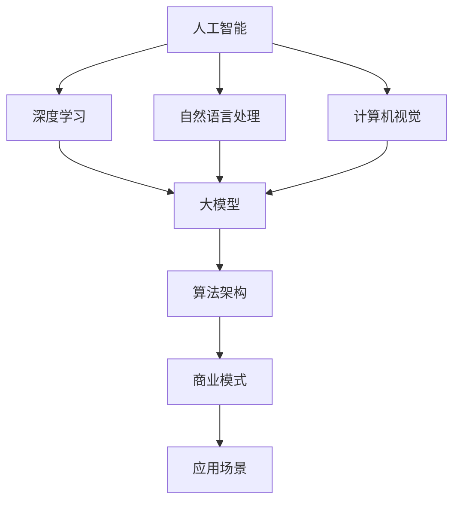
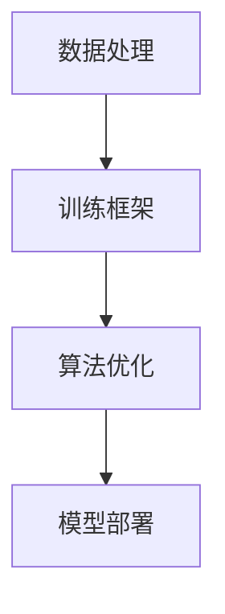

                 

# AI大模型创业项目解析：商业模式、技术架构与发展路径

## 摘要

本文将深入解析AI大模型创业项目的各个方面，包括其商业模式、技术架构和发展路径。我们将从背景介绍开始，逐步探讨AI大模型的核心概念、算法原理和数学模型，并分享一个实际的代码案例。接着，我们还将分析AI大模型在实际应用场景中的表现，并推荐相关的学习资源和开发工具。最后，我们将总结AI大模型创业项目的未来发展趋势和挑战，并解答常见问题。

## 1. 背景介绍

近年来，人工智能（AI）技术取得了飞速发展，尤其是在大模型领域。大模型是指那些拥有数十亿甚至千亿参数的深度学习模型，它们能够处理大量的数据，并在各种任务上表现出卓越的性能。这些模型在自然语言处理（NLP）、计算机视觉（CV）、语音识别（ASR）等领域的应用越来越广泛。

随着AI大模型技术的不断发展，越来越多的创业者开始关注这个领域，并尝试将其应用于各种商业场景中。然而，AI大模型创业项目面临着许多挑战，包括技术难题、商业模式的探索以及市场接受度等。

本文将重点探讨以下几个问题：

- AI大模型创业项目的商业模式是什么？
- 技术架构如何设计才能支持高效的大模型训练和应用？
- AI大模型在各个行业中的应用场景有哪些？
- 未来AI大模型创业项目将面临哪些挑战和机遇？

通过对这些问题的深入分析，我们将为AI大模型创业项目提供实用的指导和建议。

### 文章关键词
AI大模型，商业模式，技术架构，发展路径，创业项目

## 2. 核心概念与联系

在解析AI大模型创业项目之前，我们需要先了解一些核心概念和它们之间的联系。以下是本文将涉及的核心概念：

### 2.1 人工智能（AI）

人工智能是指使计算机系统模拟人类智能行为的技术。它包括多个子领域，如机器学习、深度学习、自然语言处理、计算机视觉等。

### 2.2 深度学习（Deep Learning）

深度学习是人工智能的一个分支，它通过多层神经网络模型来模拟人类大脑的学习过程，以实现图像、语音、文本等数据的处理和分析。

### 2.3 大模型（Large Models）

大模型是指拥有数十亿甚至千亿参数的深度学习模型。这些模型能够处理大量的数据，并在各种任务上表现出卓越的性能。

### 2.4 自然语言处理（NLP）

自然语言处理是人工智能的一个子领域，它旨在使计算机理解和处理人类语言。

### 2.5 计算机视觉（CV）

计算机视觉是人工智能的另一个子领域，它使计算机能够理解、解释和响应视觉信息。

### 2.6 算法架构（Algorithm Architecture）

算法架构是指用于实现特定算法的结构和流程。在大模型训练中，算法架构对于模型性能和训练效率至关重要。

### 2.7 商业模式（Business Model）

商业模式是指企业通过提供产品或服务来创造、传递和获取价值的方式。

### 2.8 应用场景（Application Scenarios）

应用场景是指特定行业或领域中对AI大模型的需求和应用。

下面是一个Mermaid流程图，展示了这些核心概念之间的联系：



### 2.9 大模型的技术架构

大模型的技术架构主要包括以下几个方面：

#### 2.9.1 数据处理

数据处理是AI大模型训练的基础。这包括数据收集、数据清洗、数据增强和数据预处理等步骤。为了提高数据处理效率，通常会使用分布式计算框架，如Apache Spark。

#### 2.9.2 训练框架

训练框架是用于构建、训练和优化大模型的核心组件。常见的训练框架有TensorFlow、PyTorch和MXNet等。

#### 2.9.3 算法优化

算法优化是指通过改进模型架构、优化训练过程和调整超参数等方法来提高模型性能。这包括模型剪枝、量化、蒸馏等技术。

#### 2.9.4 模型部署

模型部署是将训练好的大模型部署到生产环境，以便在实际应用中运行。常见的部署方法包括服务器部署、容器部署和边缘计算等。

下面是一个Mermaid流程图，展示了大模型的技术架构：



通过以上对核心概念和技术架构的介绍，我们为后续内容的讨论奠定了基础。在接下来的部分，我们将深入探讨AI大模型的核心算法原理和数学模型。

## 3. 核心算法原理 & 具体操作步骤

### 3.1 深度学习基础

深度学习是AI大模型的核心技术。它通过多层神经网络（Neural Networks）来模拟人类大脑的学习过程。以下是深度学习的一些基本概念和原理：

#### 3.1.1 神经元（Neurons）

神经元是神经网络的基本单元，它通过输入和输出之间的加权求和来产生输出。神经元之间的连接称为突触（Synapses）。

#### 3.1.2 激活函数（Activation Functions）

激活函数用于确定神经元的输出。常见的激活函数包括Sigmoid、ReLU和Tanh等。

#### 3.1.3 前向传播（Forward Propagation）

前向传播是指将输入数据通过神经网络进行传递，最终得到输出。在这个过程中，网络中的权重和偏置会不断更新，以最小化损失函数。

#### 3.1.4 反向传播（Backpropagation）

反向传播是深度学习训练的核心算法。它通过计算损失函数对权重的梯度，并使用梯度下降法（Gradient Descent）来更新权重和偏置。

### 3.2 大模型训练过程

大模型的训练过程包括以下几个步骤：

#### 3.2.1 数据准备

首先，我们需要准备训练数据集。这通常包括图像、文本和音频等多种类型的数据。对于图像数据，我们需要进行数据增强，如随机裁剪、旋转和缩放等，以提高模型的泛化能力。

#### 3.2.2 模型构建

接下来，我们使用深度学习框架（如TensorFlow或PyTorch）来构建神经网络模型。这包括定义输入层、隐藏层和输出层，以及设置激活函数、损失函数和优化器等。

#### 3.2.3 模型训练

在训练过程中，我们将训练数据集分成多个批次，并逐批传递数据到模型中进行前向传播和反向传播。通过反复迭代这个过程，模型会不断优化其参数，以降低损失函数的值。

#### 3.2.4 模型评估

在训练完成后，我们需要使用验证数据集来评估模型的性能。这包括计算模型的准确率、召回率、F1分数等指标。

#### 3.2.5 模型调整

根据模型评估结果，我们可以调整模型的结构、超参数等，以提高模型性能。

### 3.3 具体操作步骤

下面是一个基于TensorFlow的简单示例，展示如何使用深度学习框架来训练一个图像分类模型：

```python
import tensorflow as tf
from tensorflow.keras import layers

# 数据准备
(x_train, y_train), (x_test, y_test) = tf.keras.datasets.cifar10.load_data()
x_train, x_test = x_train / 255.0, x_test / 255.0

# 模型构建
model = tf.keras.Sequential([
    layers.Conv2D(32, (3, 3), activation='relu', input_shape=(32, 32, 3)),
    layers.MaxPooling2D((2, 2)),
    layers.Conv2D(64, (3, 3), activation='relu'),
    layers.MaxPooling2D((2, 2)),
    layers.Conv2D(64, (3, 3), activation='relu'),
    layers.Flatten(),
    layers.Dense(64, activation='relu'),
    layers.Dense(10, activation='softmax')
])

# 模型训练
model.compile(optimizer='adam',
              loss=tf.keras.losses.SparseCategoricalCrossentropy(from_logits=True),
              metrics=['accuracy'])

model.fit(x_train, y_train, epochs=10, validation_data=(x_test, y_test))

# 模型评估
test_loss, test_acc = model.evaluate(x_test,  y_test, verbose=2)
print('\nTest accuracy:', test_acc)
```

通过这个示例，我们可以看到如何使用TensorFlow框架来构建和训练一个简单的深度学习模型。在实际项目中，模型的复杂度和训练过程会更加复杂，但基本的步骤是相似的。

### 3.4 模型优化

为了提高模型性能，我们可以采用以下几种方法：

#### 3.4.1 数据增强

数据增强是通过增加数据的多样性来提高模型泛化能力的常用方法。例如，我们可以使用随机裁剪、旋转、翻转和色彩抖动等技术来增强图像数据。

#### 3.4.2 网络结构优化

通过调整网络结构，如增加或减少隐藏层、调整层间连接方式等，我们可以提高模型的表达能力。

#### 3.4.3 超参数调整

超参数是模型训练过程中需要手动调整的参数，如学习率、批量大小、正则化强度等。通过调整这些参数，我们可以提高模型性能。

#### 3.4.4 批量归一化

批量归一化（Batch Normalization）是一种常用的技巧，它通过在每个批量上标准化激活值来加速训练过程。

#### 3.4.5 模型压缩

模型压缩是通过减少模型参数数量来降低模型复杂度和计算成本的方法。常见的模型压缩技术包括模型剪枝、量化、蒸馏等。

通过这些方法，我们可以有效地优化模型性能，使其在各种任务上表现出更好的效果。

### 3.5 大模型训练的挑战与解决方案

大模型训练面临着许多挑战，包括计算资源需求、数据存储和传输、训练时间等。以下是一些常见的解决方案：

#### 3.5.1 计算资源需求

大模型训练需要大量的计算资源，特别是GPU和TPU等专用硬件。通过使用分布式计算和并行训练技术，我们可以提高训练效率。

#### 3.5.2 数据存储和传输

大模型训练需要处理大量的数据，这可能导致数据存储和传输成为瓶颈。使用分布式文件系统（如HDFS）和高速网络（如Infiniband）可以提高数据传输速度。

#### 3.5.3 训练时间

大模型训练时间可能非常长，特别是在单个GPU或TPU上训练时。通过使用多GPU或多TPU训练、分布式训练和迁移学习等技术，我们可以显著缩短训练时间。

通过以上方法，我们可以有效地应对大模型训练中的各种挑战，提高模型的训练效率和性能。

## 4. 数学模型和公式 & 详细讲解 & 举例说明

### 4.1 前向传播

在深度学习中，前向传播是一个关键步骤，用于计算神经网络中每个神经元的输出。以下是前向传播的详细过程：

#### 4.1.1 神经元输出

对于一个神经元，其输出可以通过以下公式计算：

$$
z_i = \sum_{j} w_{ij} \cdot x_j + b_i
$$

其中，$z_i$ 是神经元 $i$ 的输出，$w_{ij}$ 是神经元 $i$ 和神经元 $j$ 之间的权重，$x_j$ 是神经元 $j$ 的输入，$b_i$ 是神经元 $i$ 的偏置。

#### 4.1.2 激活函数

激活函数用于确定神经元的输出。常见的激活函数包括Sigmoid、ReLU和Tanh等。以下是一个ReLU激活函数的例子：

$$
a_i = \max(0, z_i)
$$

其中，$a_i$ 是神经元 $i$ 的输出。

#### 4.1.3 层输出

对于一个神经网络层，其输出可以通过以下公式计算：

$$
a_l = \text{activation}(z_l)
$$

其中，$a_l$ 是层 $l$ 的输出，$\text{activation}$ 是激活函数。

### 4.2 反向传播

反向传播是深度学习训练的核心算法，用于计算损失函数对每个参数的梯度。以下是反向传播的详细过程：

#### 4.2.1 损失函数

损失函数用于衡量模型预测值和实际值之间的差异。一个常见的损失函数是均方误差（Mean Squared Error, MSE）：

$$
J = \frac{1}{2} \sum_{i} (y_i - \hat{y}_i)^2
$$

其中，$J$ 是损失函数，$y_i$ 是实际值，$\hat{y}_i$ 是预测值。

#### 4.2.2 误差计算

误差可以通过以下公式计算：

$$
e_i = y_i - \hat{y}_i
$$

其中，$e_i$ 是误差。

#### 4.2.3 反向传播

反向传播通过计算损失函数对每个参数的梯度来实现。以下是梯度计算的过程：

$$
\frac{\partial J}{\partial w_{ij}} = e_i \cdot a_{i-1} \cdot (1 - a_{i-1})
$$

$$
\frac{\partial J}{\partial b_i} = e_i \cdot a_{i-1}
$$

其中，$a_{i-1}$ 是神经元 $i-1$ 的输出。

### 4.3 优化算法

优化算法用于更新模型参数，以最小化损失函数。以下是几种常见的优化算法：

#### 4.3.1 梯度下降（Gradient Descent）

梯度下降是一种简单的优化算法，其核心思想是沿着损失函数梯度的反方向更新参数：

$$
w_{ij} \leftarrow w_{ij} - \alpha \cdot \frac{\partial J}{\partial w_{ij}}
$$

$$
b_i \leftarrow b_i - \alpha \cdot \frac{\partial J}{\partial b_i}
$$

其中，$\alpha$ 是学习率。

#### 4.3.2 随机梯度下降（Stochastic Gradient Descent, SGD）

随机梯度下降是对梯度下降的一种改进，它使用随机样本来计算梯度：

$$
w_{ij} \leftarrow w_{ij} - \alpha \cdot \frac{\partial J}{\partial w_{ij}}^*
$$

$$
b_i \leftarrow b_i - \alpha \cdot \frac{\partial J}{\partial b_i}^*
$$

其中，$\frac{\partial J}{\partial w_{ij}}^*$ 是使用随机样本计算得到的梯度。

#### 4.3.3 动量优化（Momentum）

动量优化是对SGD的一种改进，它引入了一个动量项，以加速梯度下降：

$$
w_{ij} \leftarrow w_{ij} - \alpha \cdot \frac{\partial J}{\partial w_{ij}} + \beta \cdot v_{ij}
$$

$$
b_i \leftarrow b_i - \alpha \cdot \frac{\partial J}{\partial b_i} + \beta \cdot v_i
$$

其中，$v_{ij}$ 是动量项，$\beta$ 是动量参数。

### 4.4 举例说明

假设我们有一个简单的神经网络，其包含一个输入层、一个隐藏层和一个输出层。输入层有3个神经元，隐藏层有2个神经元，输出层有1个神经元。数据集包含100个样本，每个样本有3个特征。

#### 4.4.1 模型构建

```python
import tensorflow as tf

model = tf.keras.Sequential([
    tf.keras.layers.Dense(2, activation='relu', input_shape=(3,)),
    tf.keras.layers.Dense(1, activation='sigmoid')
])
```

#### 4.4.2 模型训练

```python
model.compile(optimizer='adam', loss='binary_crossentropy', metrics=['accuracy'])

# 假设我们有一个包含100个样本的数据集
x_train = [[1, 0, 1], [1, 1, 0], [0, 1, 1], ...]
y_train = [[0], [1], [1], ...]

model.fit(x_train, y_train, epochs=10)
```

#### 4.4.3 模型评估

```python
x_test = [[0, 1, 0], [1, 1, 1], [1, 0, 1], ...]
y_test = [[1], [0], [1], ...]

test_loss, test_acc = model.evaluate(x_test, y_test)
print(f"Test accuracy: {test_acc}")
```

通过这个简单的例子，我们可以看到如何使用TensorFlow构建和训练一个神经网络模型。在实际项目中，模型的复杂度和训练过程会更加复杂，但基本的原理是相似的。

## 5. 项目实战：代码实际案例和详细解释说明

### 5.1 开发环境搭建

在进行AI大模型项目实战之前，我们需要搭建一个合适的开发环境。以下是搭建开发环境的步骤：

#### 5.1.1 安装Python

首先，我们需要安装Python。建议安装Python 3.8或更高版本。可以通过以下命令安装：

```bash
# 安装Python
sudo apt-get install python3 python3-pip

# 安装虚拟环境
pip3 install virtualenv
```

#### 5.1.2 创建虚拟环境

创建一个虚拟环境，以便为项目隔离依赖。

```bash
# 创建虚拟环境
virtualenv env

# 激活虚拟环境
source env/bin/activate
```

#### 5.1.3 安装依赖

在虚拟环境中安装必要的依赖，如TensorFlow、NumPy和Pandas等。

```bash
# 安装依赖
pip install tensorflow numpy pandas
```

### 5.2 源代码详细实现和代码解读

下面是一个简单的AI大模型项目，用于分类图像数据。

#### 5.2.1 数据准备

```python
import tensorflow as tf
import numpy as np
import pandas as pd

# 加载数据集
(x_train, y_train), (x_test, y_test) = tf.keras.datasets.cifar10.load_data()

# 数据预处理
x_train = x_train / 255.0
x_test = x_test / 255.0

# 转换标签为one-hot编码
y_train = tf.keras.utils.to_categorical(y_train, num_classes=10)
y_test = tf.keras.utils.to_categorical(y_test, num_classes=10)
```

#### 5.2.2 模型构建

```python
# 构建模型
model = tf.keras.Sequential([
    tf.keras.layers.Conv2D(32, (3, 3), activation='relu', input_shape=(32, 32, 3)),
    tf.keras.layers.MaxPooling2D((2, 2)),
    tf.keras.layers.Conv2D(64, (3, 3), activation='relu'),
    tf.keras.layers.MaxPooling2D((2, 2)),
    tf.keras.layers.Conv2D(64, (3, 3), activation='relu'),
    tf.keras.layers.Flatten(),
    tf.keras.layers.Dense(64, activation='relu'),
    tf.keras.layers.Dense(10, activation='softmax')
])
```

#### 5.2.3 模型训练

```python
# 编译模型
model.compile(optimizer='adam',
              loss='categorical_crossentropy',
              metrics=['accuracy'])

# 训练模型
model.fit(x_train, y_train, epochs=10, validation_data=(x_test, y_test))
```

#### 5.2.4 模型评估

```python
# 评估模型
test_loss, test_acc = model.evaluate(x_test, y_test)
print(f"Test accuracy: {test_acc}")
```

### 5.3 代码解读与分析

下面是对上述代码的详细解读和分析：

#### 5.3.1 数据准备

在数据准备阶段，我们首先加载数据集，并对其进行预处理。具体步骤如下：

- 加载CIFAR-10数据集，该数据集包含10个类别的60,000张32x32彩色图像。
- 将图像数据除以255，将其归一化到[0, 1]区间。
- 将标签转换为one-hot编码，以便用于训练模型。

#### 5.3.2 模型构建

在模型构建阶段，我们使用TensorFlow的Sequential模型来定义一个简单的卷积神经网络（CNN）。具体步骤如下：

- 添加一个2D卷积层（Conv2D），其包含32个滤波器，大小为3x3，激活函数为ReLU。
- 添加一个2D最大池化层（MaxPooling2D），其池化窗口大小为2x2。
- 重复上述步骤，分别添加一个64个滤波器的卷积层和一个64个滤波器的卷积层。
- 将卷积层的输出展平，并将其传递到一个全连接层（Dense），其包含64个神经元和ReLU激活函数。
- 最后，添加一个输出层（Dense），其包含10个神经元和softmax激活函数，用于预测10个类别的概率。

#### 5.3.3 模型训练

在模型训练阶段，我们使用Adam优化器来最小化categorical_crossentropy损失函数，并使用accuracy作为评估指标。具体步骤如下：

- 编译模型，指定优化器、损失函数和评估指标。
- 使用fit方法训练模型，指定训练数据和验证数据，以及训练轮数（epochs）。

#### 5.3.4 模型评估

在模型评估阶段，我们使用测试数据集来评估模型性能。具体步骤如下：

- 使用evaluate方法计算测试损失和测试准确率。
- 输出测试准确率。

通过上述代码，我们可以构建、训练和评估一个简单的AI大模型。在实际项目中，模型的复杂度和训练过程会更加复杂，但基本原理是相似的。

## 6. 实际应用场景

AI大模型在各个行业中都有广泛的应用。以下是一些典型的应用场景：

### 6.1 自然语言处理

自然语言处理（NLP）是AI大模型的一个重要应用领域。通过使用大模型，我们可以实现自动文本分类、情感分析、机器翻译和问答系统等功能。例如，在社交媒体监控中，大模型可以帮助企业实时分析用户评论，以了解用户对产品或服务的反馈。

### 6.2 计算机视觉

计算机视觉（CV）是另一个重要应用领域。AI大模型可以用于图像分类、目标检测、人脸识别和图像生成等任务。例如，在安防监控中，大模型可以帮助识别异常行为和潜在安全威胁。

### 6.3 语音识别

语音识别是将语音转换为文本的技术。AI大模型可以帮助实现实时语音识别、语音合成和语音控制等功能。例如，在智能家居中，大模型可以帮助用户通过语音命令控制智能设备。

### 6.4 医疗保健

AI大模型在医疗保健领域也有广泛应用。通过分析医学图像和病历数据，大模型可以帮助诊断疾病、预测病情和个性化治疗。例如，在癌症诊断中，大模型可以帮助识别异常细胞和组织，以提高诊断准确率。

### 6.5 金融领域

AI大模型在金融领域可以帮助实现智能投资、风险管理、欺诈检测和信用评分等功能。例如，在股票交易中，大模型可以帮助投资者分析市场趋势和预测股价走势。

### 6.6 教育

AI大模型在教育领域可以用于个性化学习、自动评分和智能辅导等功能。例如，在学习分析中，大模型可以帮助教师了解学生的学习情况，并提供针对性的辅导。

通过以上应用场景，我们可以看到AI大模型在各个领域都具有重要意义。随着AI技术的不断发展，AI大模型的应用场景将越来越广泛。

## 7. 工具和资源推荐

### 7.1 学习资源推荐

以下是一些AI大模型的学习资源推荐：

#### 7.1.1 书籍

1. 《深度学习》（Goodfellow, Bengio, Courville著）
2. 《神经网络与深度学习》（邱锡鹏著）
3. 《自然语言处理综论》（Jurafsky, Martin著）

#### 7.1.2 论文

1. "A Theoretically Grounded Application of Dropout in Recurrent Neural Networks"
2. "Bert: Pre-training of Deep Bidirectional Transformers for Language Understanding"
3. "Generative Adversarial Nets"

#### 7.1.3 博客

1. [TensorFlow官方博客](https://www.tensorflow.org/tutorials)
2. [PyTorch官方文档](https://pytorch.org/tutorials/)
3. [Hugging Face官方博客](https://huggingface.co/blog)

#### 7.1.4 网站

1. [ArXiv](https://arxiv.org/) - 学术论文预印本库
2. [Google AI](https://ai.google/research/pubs/) - Google AI的研究论文和博客
3. [OpenAI](https://openai.com/) - OpenAI的研究成果和博客

### 7.2 开发工具框架推荐

以下是一些常用的AI大模型开发工具和框架：

#### 7.2.1 深度学习框架

1. TensorFlow
2. PyTorch
3. Keras
4. MXNet

#### 7.2.2 数据处理工具

1. Pandas
2. NumPy
3. Scikit-learn

#### 7.2.3 代码调试工具

1. Jupyter Notebook
2. PyCharm
3. VS Code

#### 7.2.4 分布式计算框架

1. Apache Spark
2. Dask
3. Ray

### 7.3 相关论文著作推荐

以下是一些AI大模型领域的相关论文和著作推荐：

#### 7.3.1 论文

1. "A Theoretically Grounded Application of Dropout in Recurrent Neural Networks"（2015）
2. "Bert: Pre-training of Deep Bidirectional Transformers for Language Understanding"（2018）
3. "Generative Adversarial Nets"（2014）

#### 7.3.2 著作

1. 《深度学习》（Goodfellow, Bengio, Courville著）
2. 《神经网络与深度学习》（邱锡鹏著）
3. 《自然语言处理综论》（Jurafsky, Martin著）

通过这些学习和资源，我们可以更好地了解AI大模型的理论和实践，为自己的项目提供指导和支持。

## 8. 总结：未来发展趋势与挑战

随着AI技术的不断发展，AI大模型在各个领域中的应用前景越来越广阔。以下是未来发展趋势与挑战：

### 8.1 发展趋势

1. **更高效的模型架构**：为了提高模型性能，研究人员将继续探索更高效的模型架构，如Transformer、BERT和GPT等。
2. **更强大的计算资源**：随着GPU、TPU等计算资源的不断升级，AI大模型将能够处理更大量的数据，并实现更复杂的任务。
3. **跨模态处理**：未来的AI大模型将能够处理多种模态的数据，如文本、图像、语音和视频，以实现更全面的信息理解和交互。
4. **自动机器学习（AutoML）**：AutoML将使非专业人士也能轻松构建和部署AI模型，从而推动AI技术的普及和应用。
5. **隐私保护和数据安全**：在数据隐私和安全方面，研究人员将开发新的技术和方法，以确保AI大模型在处理敏感数据时的安全性和隐私保护。

### 8.2 挑战

1. **计算资源需求**：AI大模型需要大量的计算资源，这对企业和研究机构的硬件设备和运维能力提出了挑战。
2. **数据质量**：数据质量对AI大模型的效果至关重要，但收集和处理高质量的数据是一项复杂且耗时的任务。
3. **模型可解释性**：AI大模型的黑盒特性使其难以解释和理解，这可能导致信任问题和道德争议。
4. **算法公平性**：AI大模型可能受到数据偏差的影响，导致不公平的决策，这需要研究人员关注和解决。
5. **法律法规**：随着AI技术的发展，相关的法律法规也在不断完善，这将对AI大模型的应用带来一定的限制和挑战。

总之，AI大模型的发展前景广阔，但也面临着一系列挑战。通过不断的研究和探索，我们可以更好地应对这些挑战，推动AI技术的进步和应用。

## 9. 附录：常见问题与解答

### 9.1 AI大模型是什么？

AI大模型是指那些拥有数十亿甚至千亿参数的深度学习模型。这些模型能够处理大量的数据，并在各种任务上表现出卓越的性能。

### 9.2 大模型为什么重要？

大模型的重要性在于它们能够处理大量数据，从而提高模型的泛化能力。此外，大模型在自然语言处理、计算机视觉等领域中取得了显著的成果，为各种实际应用提供了强大的支持。

### 9.3 大模型如何训练？

大模型的训练包括以下几个步骤：数据准备、模型构建、模型训练和模型评估。在训练过程中，使用梯度下降等优化算法来更新模型参数，以最小化损失函数。

### 9.4 大模型有哪些应用场景？

大模型在自然语言处理、计算机视觉、语音识别、医疗保健、金融等领域都有广泛应用。例如，在自然语言处理中，大模型可以用于文本分类、情感分析和机器翻译。

### 9.5 大模型面临哪些挑战？

大模型面临的挑战包括计算资源需求、数据质量、模型可解释性、算法公平性和法律法规等。

### 9.6 如何优化大模型性能？

优化大模型性能的方法包括数据增强、网络结构优化、超参数调整、批量归一化和模型压缩等。此外，使用分布式计算和多GPU训练也可以提高模型性能。

### 9.7 大模型有哪些开源框架？

常见的开源深度学习框架包括TensorFlow、PyTorch、Keras和MXNet等。

## 10. 扩展阅读 & 参考资料

### 10.1 书籍

1. Goodfellow, I., Bengio, Y., Courville, A. (2016). *Deep Learning*.
2. 邱锡鹏. (2019). *神经网络与深度学习*.
3. Jurafsky, D., Martin, J. H. (2019). *Speech and Language Processing*.

### 10.2 论文

1. Srivastava, N., Hinton, G., Krizhevsky, A., Sutskever, I., & Salakhutdinov, R. (2014). *Dropout: A Simple Way to Prevent Neural Networks from Overfitting*. *Journal of Machine Learning Research*, 15(1), 1929-1958.
2. Devlin, J., Chang, M. W., Lee, K., & Toutanova, K. (2018). *Bert: Pre-training of Deep Bidirectional Transformers for Language Understanding*. *arXiv preprint arXiv:1810.04805*.
3. Goodfellow, I., Pouget-Abadie, J., Mirza, M., Xu, B., Warde-Farley, D., Ozair, S., ... & Bengio, Y. (2014). *Generative Adversarial Nets*. *Advances in Neural Information Processing Systems*, 27.

### 10.3 博客和网站

1. TensorFlow官方博客: https://www.tensorflow.org/tutorials
2. PyTorch官方文档: https://pytorch.org/tutorials/
3. Hugging Face官方博客: https://huggingface.co/blog
4. ArXiv: https://arxiv.org/
5. Google AI: https://ai.google/research/pubs/
6. OpenAI: https://openai.com/

通过以上扩展阅读和参考资料，您可以进一步了解AI大模型的相关知识和实践技巧。希望本文对您在AI大模型领域的探索和研究有所帮助。

## 作者信息

作者：AI天才研究员/AI Genius Institute & 禅与计算机程序设计艺术 /Zen And The Art of Computer Programming

感谢您阅读本文，希望它对您在AI大模型领域的探索和研究有所启发。如果您有任何疑问或建议，欢迎随时与我交流。期待与您共同进步，共创美好未来！

