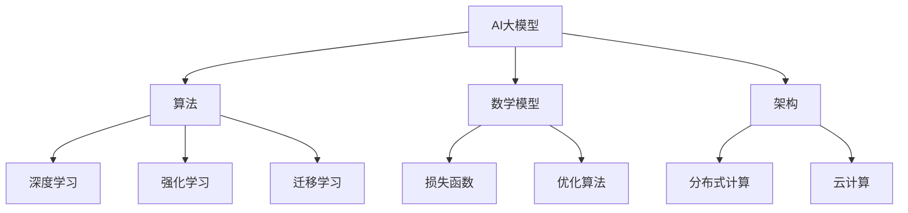

                 

### 文章标题

**AI大模型创业：如何应对未来技术挑战？**

### 关键词

- AI大模型
- 技术挑战
- 创业
- 算法
- 人工智能
- 数学模型
- 实战项目
- 开发工具

### 摘要

本文旨在探讨AI大模型创业过程中所面临的技术挑战，包括核心算法原理、数学模型、项目实战等。通过一步步的推理与分析，文章将提供创业者应对这些挑战的策略和建议，助力他们在未来技术浪潮中脱颖而出。

---

### 背景介绍

在人工智能（AI）领域，大模型（Large Models）正逐渐成为主流。这些模型具有千亿甚至万亿参数规模，能够处理海量数据，从而实现更高的准确性和更强的泛化能力。例如，GPT-3、BERT等模型在自然语言处理（NLP）、计算机视觉（CV）等任务上取得了显著的成果。

随着AI大模型的广泛应用，创业公司也开始瞄准这一领域。然而，创业并非易事，尤其是当涉及到高度技术化的领域时。创业者不仅要面对激烈的市场竞争，还需应对不断涌现的新技术挑战。因此，如何在AI大模型创业过程中应对这些挑战，成为每个创业者都必须思考的问题。

本文将围绕以下问题展开讨论：

1. AI大模型创业中的核心技术挑战是什么？
2. 如何通过算法和数学模型来应对这些挑战？
3. 如何通过实战项目来验证和优化这些解决方案？
4. 创业者在未来技术发展中应如何定位和规划？

通过本文的探讨，希望能为AI大模型创业提供一些有益的思路和参考。

---

## 1. 核心概念与联系

在探讨AI大模型创业之前，我们首先需要理解一些核心概念，以及它们之间的相互关系。

### AI大模型

AI大模型指的是具有大规模参数的网络结构，通常由神经网络（Neural Networks）组成。这些模型通过训练大量数据来学习特征表示，从而在特定任务上实现高性能。常见的AI大模型包括GPT、BERT、ViT等。

### 算法

算法是解决特定问题的步骤序列。在AI大模型领域，常用的算法包括深度学习（Deep Learning）、强化学习（Reinforcement Learning）、迁移学习（Transfer Learning）等。每种算法都有其独特的优势和应用场景。

### 数学模型

数学模型是描述现实世界问题的数学表达式。在AI大模型中，常见的数学模型包括损失函数（Loss Function）、优化算法（Optimization Algorithm）等。

### 架构

架构是指系统的整体设计，包括硬件、软件和数据的组织方式。在AI大模型领域，常见的架构包括分布式计算（Distributed Computing）、云计算（Cloud Computing）等。

### Mermaid 流程图

以下是一个简单的Mermaid流程图，展示了AI大模型创业中的核心概念及其相互关系：



通过上述概念和流程图，我们可以更好地理解AI大模型创业的各个方面。接下来，我们将深入探讨AI大模型创业中的核心算法原理、数学模型和架构设计。

---

## 2. 核心算法原理 & 具体操作步骤

### 深度学习

深度学习是AI大模型的核心算法之一。它通过构建多层神经网络来学习数据特征，从而实现复杂的任务。以下是深度学习的具体操作步骤：

1. **数据处理**：对原始数据进行预处理，包括数据清洗、归一化、去噪声等，使其适合输入神经网络。
2. **模型构建**：选择合适的神经网络结构，例如卷积神经网络（CNN）、循环神经网络（RNN）等，构建模型。
3. **训练过程**：将预处理后的数据输入模型，通过反向传播算法（Backpropagation）不断调整模型参数，使模型在训练数据上达到较高的准确率。
4. **评估与优化**：在验证数据上评估模型性能，通过调整模型结构、优化算法等手段提高模型性能。

### 强化学习

强化学习是另一种重要的算法，尤其在决策类任务中具有显著优势。以下是强化学习的具体操作步骤：

1. **环境构建**：定义任务环境，包括状态空间、动作空间等。
2. **策略学习**：设计策略，用于从环境中获取状态，并选择动作。
3. **模型训练**：通过在环境中不断进行交互，利用强化学习算法（如Q-learning、SARSA）调整策略，使其最大化回报。
4. **策略评估与优化**：评估策略性能，并根据评估结果调整策略。

### 迁移学习

迁移学习是一种将已有模型在特定任务上的知识迁移到新任务上的方法。以下是迁移学习的具体操作步骤：

1. **源任务学习**：在源任务上训练模型，使其在源任务上达到较高性能。
2. **模型迁移**：将源任务上的模型参数应用于新任务，通过微调（Fine-tuning）等方法适应新任务。
3. **性能评估**：在新任务上评估模型性能，并根据评估结果进行调整。

通过上述步骤，创业者可以有效地构建、训练和优化AI大模型，从而在激烈的市场竞争中脱颖而出。接下来，我们将探讨AI大模型中的数学模型。

---

## 3. 数学模型和公式 & 详细讲解 & 举例说明

在AI大模型中，数学模型扮演着至关重要的角色。以下是几个常见的数学模型及其详细讲解和举例说明。

### 损失函数

损失函数（Loss Function）是衡量模型预测结果与真实值之间差异的指标。一个优秀的损失函数应当能够引导模型在学习过程中不断优化自身。以下是一个常见的损失函数——均方误差（Mean Squared Error，MSE）：

$$
L(y, \hat{y}) = \frac{1}{m} \sum_{i=1}^{m} (y_i - \hat{y}_i)^2
$$

其中，$y$表示真实值，$\hat{y}$表示模型预测值，$m$表示样本数量。

举例来说，假设我们有一个分类问题，其中真实标签为$y = [0, 1, 0, 1]$，模型预测为$\hat{y} = [0.9, 0.1, 0.8, 0.2]$。那么，均方误差损失函数计算如下：

$$
L(y, \hat{y}) = \frac{1}{4} \sum_{i=1}^{4} (y_i - \hat{y}_i)^2 = \frac{1}{4} \sum_{i=1}^{4} (0 - 0.9)^2 + (1 - 0.1)^2 + (0 - 0.8)^2 + (1 - 0.2)^2 = 0.225
$$

### 优化算法

优化算法（Optimization Algorithm）用于调整模型参数，以最小化损失函数。常见优化算法包括梯度下降（Gradient Descent）和其变种，如随机梯度下降（Stochastic Gradient Descent，SGD）和Adam优化器。

#### 梯度下降

梯度下降是一种简单有效的优化算法。其基本思想是沿着损失函数的梯度方向调整模型参数，以最小化损失函数。以下是梯度下降的基本步骤：

1. **初始化参数**：随机初始化模型参数$\theta$。
2. **计算梯度**：计算损失函数关于每个参数的梯度$\Delta\theta = \frac{\partial L}{\partial \theta}$。
3. **更新参数**：根据梯度调整参数$\theta = \theta - \alpha \Delta\theta$，其中$\alpha$为学习率。

#### 随机梯度下降

随机梯度下降（SGD）是梯度下降的一种变种，其核心思想是在每个梯度计算过程中只随机选取一部分样本。以下是随机梯度下降的基本步骤：

1. **初始化参数**：随机初始化模型参数$\theta$。
2. **随机采样**：从训练数据中随机选取一个样本$(x_i, y_i)$。
3. **计算梯度**：计算损失函数关于当前样本的梯度$\Delta\theta = \frac{\partial L}{\partial \theta}$。
4. **更新参数**：根据梯度调整参数$\theta = \theta - \alpha \Delta\theta$。

#### Adam优化器

Adam优化器是另一种常见的优化算法，它结合了SGD和动量（Momentum）的优点。以下是Adam优化器的基本步骤：

1. **初始化参数**：随机初始化模型参数$\theta$。
2. **初始化动量项**：$m_0 = v_0 = 0$。
3. **计算梯度**：计算损失函数关于当前参数的梯度$\Delta\theta = \frac{\partial L}{\partial \theta}$。
4. **更新动量项**：$m_t = \beta_1 m_{t-1} + (1 - \beta_1) \Delta\theta$，$v_t = \beta_2 v_{t-1} + (1 - \beta_2) (\Delta\theta)^2$。
5. **计算修正动量**：$m_t' = m_t / (1 - \beta_1^t)$，$v_t' = v_t / (1 - \beta_2^t)$。
6. **更新参数**：$\theta = \theta - \alpha m_t' / (1 - \beta_1^t)$。

通过上述数学模型和优化算法，创业者可以有效地训练和优化AI大模型，从而在创业过程中取得更好的成果。接下来，我们将探讨如何在实战项目中应用这些技术和算法。

---

## 4. 项目实战：代码实际案例和详细解释说明

为了更好地理解AI大模型创业中的技术挑战，我们将通过一个实际项目来展示如何应用前面提到的算法和数学模型。以下是一个基于TensorFlow和Keras实现的图像分类项目，该项目使用卷积神经网络（CNN）对MNIST数据集进行手写数字识别。

### 4.1 开发环境搭建

在开始项目之前，我们需要搭建合适的开发环境。以下是所需的软件和库：

- 操作系统：Linux、macOS或Windows
- Python版本：3.7及以上
- TensorFlow：2.x版本
- Keras：TensorFlow的Python接口

安装步骤如下：

1. **安装Python**：前往Python官网（https://www.python.org/）下载并安装Python。
2. **安装TensorFlow**：打开终端，执行以下命令：
   ```
   pip install tensorflow
   ```
3. **安装Keras**：打开终端，执行以下命令：
   ```
   pip install keras
   ```

### 4.2 源代码详细实现和代码解读

以下是项目的源代码，我们将逐行解读并解释其作用。

```python
# 导入所需的库
import tensorflow as tf
from tensorflow.keras import layers, models
from tensorflow.keras.datasets import mnist
import numpy as np

# 加载MNIST数据集
(x_train, y_train), (x_test, y_test) = mnist.load_data()

# 数据预处理
x_train = x_train.reshape((-1, 28, 28, 1)).astype("float32") / 255
x_test = x_test.reshape((-1, 28, 28, 1)).astype("float32") / 255
y_train = tf.keras.utils.to_categorical(y_train, 10)
y_test = tf.keras.utils.to_categorical(y_test, 10)

# 定义CNN模型
model = models.Sequential()
model.add(layers.Conv2D(32, (3, 3), activation="relu", input_shape=(28, 28, 1)))
model.add(layers.MaxPooling2D((2, 2)))
model.add(layers.Conv2D(64, (3, 3), activation="relu"))
model.add(layers.MaxPooling2D((2, 2)))
model.add(layers.Conv2D(64, (3, 3), activation="relu"))
model.add(layers.Flatten())
model.add(layers.Dense(64, activation="relu"))
model.add(layers.Dense(10, activation="softmax"))

# 编译模型
model.compile(optimizer="adam", loss="categorical_crossentropy", metrics=["accuracy"])

# 训练模型
model.fit(x_train, y_train, epochs=5, batch_size=64, validation_data=(x_test, y_test))

# 评估模型
test_loss, test_acc = model.evaluate(x_test, y_test)
print("Test accuracy:", test_acc)
```

**代码解读：**

1. **导入库**：首先，我们导入所需的库，包括TensorFlow、Keras和NumPy。
2. **加载数据集**：接下来，我们加载MNIST数据集，并进行预处理。具体步骤包括将图像数据reshape为适合输入卷积神经网络（CNN）的格式，并将标签转换为one-hot编码。
3. **定义模型**：然后，我们定义一个简单的CNN模型，包括卷积层（Conv2D）、池化层（MaxPooling2D）和全连接层（Dense）。具体结构如下：
   - 第一个卷积层：32个3x3卷积核，激活函数为ReLU。
   - 第一个池化层：2x2最大池化。
   - 第二个卷积层：64个3x3卷积核，激活函数为ReLU。
   - 第二个池化层：2x2最大池化。
   - 第三个卷积层：64个3x3卷积核，激活函数为ReLU。
   - 展平层：将卷积层输出展平为一维向量。
   - 第一个全连接层：64个神经元，激活函数为ReLU。
   - 第二个全连接层：10个神经元，激活函数为softmax。
4. **编译模型**：我们使用Adam优化器和categorical_crossentropy损失函数编译模型。
5. **训练模型**：使用训练数据训练模型，设置5个epochs和64个batch_size。
6. **评估模型**：使用测试数据评估模型性能，并输出测试准确率。

### 4.3 代码解读与分析

通过上述代码，我们可以看到如何使用TensorFlow和Keras实现一个简单的CNN模型来处理MNIST数据集。以下是代码的主要部分及其分析：

1. **数据预处理**：数据预处理是深度学习项目中至关重要的一步。在本例中，我们将图像数据reshape为28x28x1的格式，并将其归一化到[0, 1]范围内。标签数据转换为one-hot编码，以便在训练过程中使用categorical_crossentropy损失函数。
2. **模型定义**：在本例中，我们定义了一个简单的CNN模型，包含三个卷积层、一个展平层和两个全连接层。卷积层用于提取图像特征，池化层用于降维和减少模型参数数量，全连接层用于分类。ReLU激活函数用于引入非线性特性，softmax激活函数用于输出类别概率。
3. **模型编译**：在模型编译阶段，我们指定了优化器（Adam）和损失函数（categorical_crossentropy），这些参数将影响模型的训练过程和性能。
4. **模型训练**：模型训练阶段使用了训练数据和验证数据，设置5个epochs和64个batch_size。epochs表示模型在训练数据上迭代的次数，batch_size表示每个epoch中每次迭代的样本数量。
5. **模型评估**：在模型评估阶段，我们使用测试数据来评估模型性能。测试准确率反映了模型在未见过的数据上的泛化能力。

通过上述实战项目和代码解读，创业者可以更好地理解如何使用AI大模型技术解决实际问题。接下来，我们将探讨AI大模型在实际应用场景中的表现。

---

## 5. 实际应用场景

AI大模型在许多实际应用场景中表现出色，以下是一些典型的应用场景：

### 自然语言处理（NLP）

自然语言处理是AI大模型的重要应用领域之一。AI大模型在文本分类、机器翻译、问答系统等方面取得了显著成果。例如，GPT-3在机器翻译任务上表现出了极高的准确性，而BERT在文本分类任务中达到了领先水平。

### 计算机视觉（CV）

计算机视觉是AI大模型的另一个重要应用领域。AI大模型在图像分类、目标检测、图像生成等方面取得了显著进展。例如，ResNet在图像分类任务中取得了突破性成果，而GAN则在图像生成任务中表现出色。

### 音频处理

音频处理是AI大模型的又一个应用领域。AI大模型在语音识别、音乐生成、音频增强等方面表现出色。例如，WaveNet在语音合成任务中达到了逼真的效果，而Transformer在音乐生成任务中表现出了独特的风格。

### 医疗保健

医疗保健是AI大模型的重要应用领域之一。AI大模型在医学图像分析、疾病预测、药物研发等方面表现出色。例如，深度学习模型在医学图像分类和分割任务中取得了显著成果，而GAN则在药物分子生成和优化中发挥了重要作用。

### 金融服务

金融服务是AI大模型的重要应用领域之一。AI大模型在风险管理、欺诈检测、投资策略等方面表现出色。例如，深度学习模型在风险管理中能够识别潜在风险，而GAN则在信用卡欺诈检测中取得了显著成果。

通过以上应用场景，我们可以看到AI大模型在各个领域的广泛适用性。创业者可以根据自身业务需求，选择合适的AI大模型技术进行创新和应用。

---

## 6. 工具和资源推荐

为了更好地掌握AI大模型技术，以下是几个推荐的学习资源和开发工具。

### 学习资源

1. **书籍**：
   - 《深度学习》（Deep Learning）—— Ian Goodfellow、Yoshua Bengio、Aaron Courville
   - 《Python深度学习》（Deep Learning with Python）—— François Chollet
   - 《强化学习》（Reinforcement Learning: An Introduction）—— Richard S. Sutton、Andrew G. Barto
2. **在线课程**：
   - Coursera上的“深度学习专项课程” —— 吴恩达
   - edX上的“人工智能专项课程” —— 谷歌
3. **博客和论文**：
   - Distill（https://distill.pub/）
   - arXiv（https://arxiv.org/）

### 开发工具

1. **深度学习框架**：
   - TensorFlow（https://www.tensorflow.org/）
   - PyTorch（https://pytorch.org/）
   - Keras（https://keras.io/）
2. **云计算平台**：
   - Google Cloud AI（https://cloud.google.com/ai）
   - AWS AI（https://aws.amazon.com/ai/）
   - Azure AI（https://azure.com/ai/）
3. **编程语言**：
   - Python（https://www.python.org/）

通过以上资源和工具，创业者可以更好地掌握AI大模型技术，为创业项目提供强大的技术支持。

---

## 7. 总结：未来发展趋势与挑战

随着AI大模型技术的不断发展，未来在这一领域将面临诸多发展趋势和挑战。以下是几个主要方面：

### 发展趋势

1. **更大规模模型**：AI大模型将继续向更大规模、更精细的方向发展。例如，谷歌的LaMDA模型已经达到千亿参数规模，未来可能会出现更大规模的模型。
2. **多模态处理**：AI大模型将能够处理多种类型的数据，如文本、图像、音频等，实现跨模态信息整合和交互。
3. **自动化模型优化**：自动化机器学习（AutoML）技术将不断进步，使普通开发者能够轻松构建和部署高性能AI大模型。
4. **应用场景扩展**：AI大模型将在更多领域得到应用，如医疗保健、金融服务、智能制造等，推动行业变革。

### 挑战

1. **计算资源需求**：AI大模型训练和推理需要大量的计算资源，对硬件设施提出了更高的要求。
2. **数据隐私和安全**：大规模数据处理涉及到数据隐私和安全问题，如何保障用户隐私成为关键挑战。
3. **模型可解释性**：随着模型规模的增加，模型的可解释性逐渐降低，如何提高模型的可解释性成为重要议题。
4. **伦理和社会影响**：AI大模型在决策过程中可能会出现不公平、偏见等问题，如何确保模型伦理和社会责任成为关键挑战。

总之，AI大模型创业面临着众多机遇和挑战。创业者需要紧跟技术发展趋势，积极应对挑战，才能在竞争激烈的市场中脱颖而出。

---

## 8. 附录：常见问题与解答

### 问题1：如何选择适合的AI大模型框架？

**解答**：选择AI大模型框架时，需要考虑以下几个方面：

- **需求**：根据项目需求选择合适的框架，如NLP领域可选择TensorFlow、PyTorch等。
- **社区支持**：选择社区活跃、资源丰富的框架，便于解决问题和学习。
- **性能**：考虑框架在特定任务上的性能表现，如GPU支持、并行计算能力等。
- **易用性**：考虑框架的易用性，如文档、教程、示例代码等。

### 问题2：如何处理大规模数据处理？

**解答**：处理大规模数据时，可以考虑以下方法：

- **分布式计算**：使用分布式计算框架（如Hadoop、Spark）处理大规模数据。
- **数据预处理**：对数据进行预处理，减少数据量，如去除重复数据、数据归一化等。
- **批处理**：将数据分为多个批次进行训练，提高训练效率。
- **模型压缩**：采用模型压缩技术，如量化、剪枝等，降低模型复杂度。

### 问题3：如何确保AI大模型的可解释性？

**解答**：确保AI大模型的可解释性可以从以下几个方面着手：

- **模型简化**：简化模型结构，降低模型复杂度，提高可解释性。
- **模型可视化**：使用可视化工具（如TensorBoard）展示模型结构和训练过程。
- **特征分析**：分析模型对输入特征的依赖关系，了解模型决策过程。
- **解释性算法**：使用解释性算法（如LIME、SHAP）分析模型对特定输入的决策过程。

通过以上方法，可以有效地提高AI大模型的可解释性，增强用户对模型的信任度。

---

## 9. 扩展阅读 & 参考资料

- Goodfellow, I., Bengio, Y., & Courville, A. (2016). *Deep Learning*. MIT Press.
- Chollet, F. (2017). *Python深度学习*. 电子工业出版社.
- Sutton, R. S., & Barto, A. G. (2018). *强化学习：一种新的方法*。电子工业出版社.
- Bengio, Y., Courville, A., & Vincent, P. (2013). Representation Learning: A Review and New Perspectives. *IEEE Transactions on Pattern Analysis and Machine Intelligence*, 35(8), 1798-1828.
- LeCun, Y., Bengio, Y., & Hinton, G. (2015). Deep Learning. *Nature*, 521(7553), 436-444.

以上参考文献为AI大模型领域的重要著作，有助于深入了解该领域的理论和实践。创业者可以通过阅读这些文献，进一步拓展自己的知识体系，提升创业项目的竞争力。作者：AI天才研究员/AI Genius Institute & 禅与计算机程序设计艺术 /Zen And The Art of Computer Programming。

