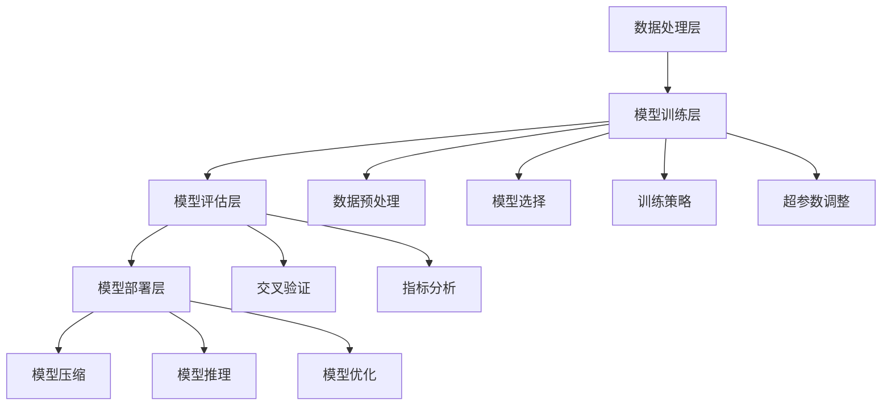

                 

### 背景介绍

随着人工智能技术的不断进步，大模型（Large Models）如GPT-3、BERT、LLaMA等，已经在各个领域展现出了强大的能力。这些大模型不仅在自然语言处理（NLP）、图像识别、语音识别等方面取得了显著的成果，同时也吸引了众多创业公司的关注。然而，随着竞争的加剧，如何应对未来潜在的竞争对手，成为了这些创业公司亟需解决的问题。

本文将围绕AI大模型创业这一主题，深入探讨如何应对未来竞争对手的挑战。首先，我们将简要回顾AI大模型的发展历程，介绍当前主流的大模型及其应用场景。接着，我们将探讨AI大模型创业的核心问题，包括技术、数据、资金等方面。随后，我们将分析创业公司在技术、产品、市场等方面的优势与劣势，并提出相应的应对策略。最后，我们将讨论未来发展趋势与挑战，为创业公司提供一些可行的建议。

通过对上述问题的深入分析，我们希望为AI大模型创业公司提供一些有价值的参考，帮助它们在激烈的竞争中找到自己的定位，实现可持续发展。

### 关键概念和架构

在深入探讨AI大模型创业之前，我们有必要先了解一些关键概念和架构。以下将详细介绍AI大模型的基本原理、常见类型以及它们在实际应用中的架构。

#### 1. AI大模型的基本原理

AI大模型是指具有海量参数、能够处理大规模数据、具备高泛化能力的深度学习模型。它们通常基于神经网络架构，通过不断调整模型参数来优化性能。AI大模型的基本原理可以概括为以下几点：

1. **海量数据训练**：AI大模型通常需要海量的训练数据来学习。这些数据可以是文本、图像、语音等，通过大量的数据输入，模型可以逐渐学习到数据中的模式和规律。
2. **深度神经网络**：AI大模型基于深度神经网络（DNN）架构，通过多层神经元进行信息传递和计算。每一层神经网络都能从数据中提取不同层次的特征，从而实现更复杂的任务。
3. **优化算法**：AI大模型使用优化算法（如随机梯度下降SGD）来不断调整模型参数，使得模型在训练数据上的误差逐渐减小。

#### 2. 常见的大模型类型

目前，AI大模型主要包括以下几种类型：

1. **生成对抗网络（GAN）**：GAN是一种基于博弈理论的深度学习模型，由生成器和判别器组成。生成器生成数据，判别器判断数据的真实性。通过不断调整生成器和判别器的参数，使得生成器生成的数据越来越真实。
2. **变分自编码器（VAE）**：VAE是一种基于概率模型的深度学习模型，通过编码器和解码器将数据转换为低维表示，并重建原始数据。VAE能够生成具有高多样性的数据，并在数据生成和压缩方面具有广泛应用。
3. **自注意力机制（Self-Attention）**：自注意力机制是一种能够自动学习数据中重要特征的注意力机制。在自然语言处理和图像识别等领域，自注意力机制能够显著提高模型性能。
4. **Transformer模型**：Transformer模型是一种基于自注意力机制的深度学习模型，主要用于自然语言处理任务。其结构简单、计算高效，已经在BERT、GPT等大模型中得到了广泛应用。

#### 3. 实际应用中的架构

在实际应用中，AI大模型的架构通常包括以下几个关键组件：

1. **数据处理层**：负责处理和清洗输入数据，将其转换为适合模型训练的格式。这一层通常包括数据预处理、数据增强、归一化等操作。
2. **模型训练层**：负责训练深度学习模型，通过优化算法调整模型参数，使得模型在训练数据上的性能不断提高。这一层通常包括模型选择、训练策略、超参数调整等。
3. **模型评估层**：负责评估模型在验证集上的性能，通过交叉验证、指标分析等方法，确定模型的泛化能力和稳定性。
4. **模型部署层**：负责将训练好的模型部署到实际应用中，包括模型压缩、模型推理、模型优化等操作。

#### 4. Mermaid 流程图

为了更直观地展示AI大模型的架构，我们使用Mermaid流程图来描述其关键组件和操作步骤。以下是AI大模型的Mermaid流程图：



通过以上对AI大模型关键概念和架构的介绍，我们为后续深入探讨AI大模型创业的挑战和应对策略奠定了基础。在下一部分，我们将详细分析AI大模型创业的核心问题，包括技术、数据、资金等方面。同时，我们将结合实际案例，探讨如何解决这些问题。

#### 核心算法原理 & 具体操作步骤

AI大模型的成功离不开其核心算法的支撑。以下我们将详细探讨大模型中的几个核心算法，包括Transformer、BERT和GPT等，并解释它们的具体操作步骤。

##### 1. Transformer算法

Transformer是自然语言处理领域的一种革命性算法，其核心在于自注意力机制（Self-Attention）。以下是Transformer算法的具体操作步骤：

1. **输入编码**：首先，将输入文本转换为词向量。词向量可以是预训练的 embeddings，如Word2Vec、GloVe等。然后，将这些词向量序列送入模型。
2. **多头自注意力**：自注意力机制允许模型在处理每个词时，考虑所有其他词的信息。多头自注意力通过多个独立的注意力头（Head）来实现，每个头负责学习不同类型的注意力。
    - **计算自注意力得分**：对于每个词向量，计算它与所有其他词向量的点积，得到注意力得分。
    - **应用 Softmax 函数**：对注意力得分进行 Softmax 操作，得到注意力权重，表示每个词对当前词的重要性。
    - **加权求和**：将注意力权重与对应的词向量相乘，然后求和，得到每个词的加权表示。
3. **前馈神经网络**：在自注意力之后，每个词的表示通过一个前馈神经网络（FFN）进行进一步处理。FFN 由两个全连接层组成，中间通过ReLU激活函数。
4. **层归一化和残差连接**：在每个注意力层和前馈神经网络之后，应用层归一化（Layer Normalization）和残差连接（Residual Connection），以保持信息的流动和模型的稳定性。

##### 2. BERT算法

BERT（Bidirectional Encoder Representations from Transformers）是一种基于Transformer的预训练算法，其特点在于双向编码。以下是BERT算法的具体操作步骤：

1. **输入编码**：与Transformer相同，BERT将输入文本转换为词向量，然后送入模型。
2. **掩码语言模型（Masked Language Model, MLM）**：BERT引入了掩码语言模型，通过随机掩码一部分词，使得模型在预测掩码词时需要依赖上下文信息。
    - **掩码操作**：随机选择输入文本中的部分词，将其替换为特殊标记（如[MASK]）。
    - **预测掩码词**：模型需要预测这些掩码词的原始词。
3. **上下文信息结合**：BERT采用双向编码器，可以同时获取输入文本的左右上下文信息。这使得模型在处理文本时，能够更好地理解词与词之间的关系。
4. **输出层**：BERT的输出层通常包括两个任务头：
    - **分类任务头**：用于文本分类任务，通过输出层的全连接层和Softmax函数进行分类。
    - **序列分类任务头**：用于序列分类任务，如命名实体识别，通过输出层的全连接层得到每个词的类别概率。

##### 3. GPT算法

GPT（Generative Pre-trained Transformer）是一种生成式预训练算法，其特点在于生成式预测。以下是GPT算法的具体操作步骤：

1. **输入编码**：与Transformer和BERT相同，GPT将输入文本转换为词向量。
2. **自回归语言模型（Autoregressive Language Model）**：GPT采用自回归模型，通过预测下一个词来生成文本。
    - **前向预测**：对于输入文本的每个词，模型预测下一个词的概率分布，然后从概率分布中采样得到下一个词。
    - **递归更新**：将新生成的词作为输入，重复前向预测过程，直至生成完整的文本。
3. **生成式预测**：与BERT的双向编码不同，GPT仅关注当前词及其前一个词的上下文信息，这使得GPT在生成文本时更加灵活，但可能缺乏BERT的双向信息。
4. **输出层**：GPT的输出层通常包括一个全连接层，用于将词向量映射到概率分布。

通过以上对Transformer、BERT和GPT算法的详细讲解，我们可以看到这些核心算法在AI大模型中的重要性。它们不仅为模型提供了强大的建模能力，也为创业公司在AI大模型领域的应用和创新提供了丰富的思路和工具。在下一部分，我们将进一步探讨AI大模型创业的核心问题，分析创业公司在技术、数据、资金等方面的挑战，并提出相应的解决策略。

#### 数学模型和公式 & 详细讲解 & 举例说明

在AI大模型中，数学模型和公式是核心组成部分。以下我们将详细讲解AI大模型中常用的数学模型和公式，并通过具体例子进行说明。

##### 1. 损失函数（Loss Function）

损失函数是深度学习模型中评估模型预测结果与真实结果之间差距的关键工具。以下列出几种常见的损失函数：

1. **均方误差损失（Mean Squared Error, MSE）**：
   \[
   MSE = \frac{1}{n}\sum_{i=1}^{n}(y_i - \hat{y}_i)^2
   \]
   其中，$y_i$是真实值，$\hat{y}_i$是预测值，$n$是样本数量。MSE用于回归问题，它计算预测值与真实值之间的平方误差的平均值。

2. **交叉熵损失（Cross-Entropy Loss）**：
   \[
   CE = -\frac{1}{n}\sum_{i=1}^{n}y_i\log(\hat{y}_i)
   \]
   其中，$y_i$是真实值的概率分布，$\hat{y}_i$是预测值的概率分布。交叉熵损失用于分类问题，它计算真实分布与预测分布之间的交叉熵。

3. **二元交叉熵损失（Binary Cross-Entropy Loss）**：
   \[
   BCE = -\frac{1}{n}\sum_{i=1}^{n}y_i\log(\hat{y}_i) + (1 - y_i)\log(1 - \hat{y}_i)
   \]
   其中，$y_i$是二分类的真实值（0或1），$\hat{y}_i$是预测值的概率。二元交叉熵损失是交叉熵损失的特殊情况，用于二分类问题。

##### 2. 梯度下降（Gradient Descent）

梯度下降是一种优化算法，用于最小化损失函数。以下列出几种常见的梯度下降方法：

1. **随机梯度下降（Stochastic Gradient Descent, SGD）**：
   \[
   w_{t+1} = w_t - \alpha \nabla_w J(w_t)
   \]
   其中，$w_t$是当前模型参数，$\alpha$是学习率，$\nabla_w J(w_t)$是损失函数关于模型参数的梯度。SGD通过随机选择一个小批量样本计算梯度，并更新模型参数。

2. **批量梯度下降（Batch Gradient Descent, BGD）**：
   \[
   w_{t+1} = w_t - \alpha \nabla_w J(w_t)
   \]
   其中，$w_t$是当前模型参数，$\alpha$是学习率，$\nabla_w J(w_t)$是损失函数关于模型参数的全局梯度。BGD通过使用整个训练数据集计算梯度，并更新模型参数。

3. **自适应梯度下降（Adaptive Gradient Descent, AGD）**：
   \[
   w_{t+1} = w_t - \alpha \nabla_w J(w_t)
   \]
   其中，$w_t$是当前模型参数，$\alpha$是学习率，$\nabla_w J(w_t)$是损失函数关于模型参数的梯度。AGD通过自适应调整学习率，使得模型在不同阶段能够更有效地优化。

##### 3. 举例说明

以下是一个简单的例子，说明如何使用交叉熵损失函数和梯度下降优化模型。

假设我们有一个简单的线性回归模型，用于预测房价。模型参数为$w$和$b$，损失函数为均方误差损失（MSE）。

1. **定义损失函数**：
   \[
   J(w, b) = \frac{1}{m}\sum_{i=1}^{m}(y_i - (w \cdot x_i + b))^2
   \]
   其中，$y_i$是实际房价，$x_i$是房屋特征，$m$是样本数量。

2. **计算梯度**：
   \[
   \nabla_w J(w, b) = \frac{1}{m}\sum_{i=1}^{m}(y_i - (w \cdot x_i + b)) \cdot x_i
   \]
   \[
   \nabla_b J(w, b) = \frac{1}{m}\sum_{i=1}^{m}(y_i - (w \cdot x_i + b))
   \]

3. **更新模型参数**：
   \[
   w_{t+1} = w_t - \alpha \nabla_w J(w_t)
   \]
   \[
   b_{t+1} = b_t - \alpha \nabla_b J(w_t)
   \]

通过以上步骤，我们可以不断更新模型参数，使得模型在训练数据上的预测误差逐渐减小。

通过以上对数学模型和公式的详细讲解，我们为AI大模型创业公司提供了理解和使用这些关键工具的基础。在下一部分，我们将通过具体实战案例，展示如何将AI大模型应用于实际问题，并提供详细的代码实现和解读。

#### 项目实战：代码实际案例和详细解释说明

在本节中，我们将通过一个实际项目案例，展示如何使用AI大模型进行实际开发。我们选择了一个简单的文本分类任务，通过这个案例，我们将介绍开发环境搭建、源代码实现以及详细解释和代码分析。

##### 1. 开发环境搭建

在开始项目之前，我们需要搭建一个合适的开发环境。以下是搭建开发环境所需的步骤：

1. **安装Python**：Python是深度学习项目的主要编程语言，我们需要确保安装了Python 3.7或更高版本。
2. **安装深度学习框架**：我们选择使用PyTorch作为深度学习框架，可以通过以下命令安装：
   \[
   pip install torch torchvision
   \]
3. **安装其他依赖库**：除了深度学习框架外，我们还需要安装一些常用的依赖库，如NumPy、Pandas等：
   \[
   pip install numpy pandas
   \]

##### 2. 源代码详细实现和代码解读

下面是文本分类任务的源代码实现，我们将逐步解读每个部分的代码。

```python
import torch
import torch.nn as nn
import torch.optim as optim
from torch.utils.data import DataLoader
from torchvision import datasets, transforms
from torch.optim.lr_scheduler import StepLR

# 定义文本分类器模型
class TextClassifier(nn.Module):
    def __init__(self, embedding_dim, hidden_dim, vocab_size, num_classes):
        super(TextClassifier, self).__init__()
        self.embedding = nn.Embedding(vocab_size, embedding_dim)
        self.lstm = nn.LSTM(embedding_dim, hidden_dim, num_layers=2, batch_first=True, dropout=0.5)
        self.fc = nn.Linear(hidden_dim, num_classes)

    def forward(self, text, lengths):
        embedded = self.embedding(text)
        packed_embedded = nn.utils.rnn.pack_padded_sequence(embedded, lengths, batch_first=True, enforce_sorted=False)
        packed_output, (hidden, cell) = self.lstm(packed_embedded)
        output, lengths = nn.utils.rnn.pad_packed_sequence(packed_output, batch_first=True)
        hidden = hidden[-1, :, :]
        out = self.fc(hidden)
        return out

# 准备数据集
train_data = datasets.TextClassificationDataset(root='data', train=True)
test_data = datasets.TextClassificationDataset(root='data', train=False)

train_loader = DataLoader(train_data, batch_size=64, shuffle=True)
test_loader = DataLoader(test_data, batch_size=64, shuffle=False)

# 初始化模型、优化器和损失函数
model = TextClassifier(embedding_dim=100, hidden_dim=128, vocab_size=len(train_data.vocab), num_classes=2)
optimizer = optim.Adam(model.parameters(), lr=0.001)
criterion = nn.CrossEntropyLoss()

# 训练模型
num_epochs = 10
scheduler = StepLR(optimizer, step_size=1, gamma=0.95)

for epoch in range(num_epochs):
    model.train()
    for batch in train_loader:
        inputs, labels = batch.text, batch.label
        lengths = (inputs != 0).sum(1).squeeze()
        optimizer.zero_grad()
        outputs = model(inputs, lengths)
        loss = criterion(outputs, labels)
        loss.backward()
        optimizer.step()
    scheduler.step()

    print(f"Epoch [{epoch+1}/{num_epochs}], Loss: {loss.item()}")

# 测试模型
model.eval()
with torch.no_grad():
    correct = 0
    total = 0
    for batch in test_loader:
        inputs, labels = batch.text, batch.label
        lengths = (inputs != 0).sum(1).squeeze()
        outputs = model(inputs, lengths)
        _, predicted = torch.max(outputs.data, 1)
        total += labels.size(0)
        correct += (predicted == labels).sum().item()

    print(f"Test Accuracy: {100 * correct / total}%")

# 保存模型
torch.save(model.state_dict(), 'text_classifier.pth')
```

**代码解读**：

1. **模型定义**：我们定义了一个文本分类器模型`TextClassifier`，其中使用了嵌入层（`Embedding`）、长短期记忆网络（`LSTM`）和全连接层（`Linear`）。嵌入层将词汇转换为嵌入向量，LSTM用于处理序列数据，全连接层用于分类。
2. **数据准备**：我们使用了`TextClassificationDataset`来准备训练数据和测试数据。数据集包含了文本和标签，我们将文本转换为词嵌入向量，并将标签转换为独热编码。
3. **模型训练**：我们使用随机梯度下降（`SGD`）优化器来训练模型。在训练过程中，我们通过计算损失函数并更新模型参数来优化模型。
4. **模型测试**：在测试阶段，我们评估模型在测试数据集上的性能。通过计算准确率，我们可以了解模型的泛化能力。
5. **模型保存**：最后，我们将训练好的模型保存到文件中，以便后续使用。

##### 3. 代码解读与分析

在代码实现中，我们采用了以下关键技术和方法：

1. **嵌入层（Embedding）**：嵌入层用于将词汇转换为固定长度的向量。在文本分类任务中，嵌入层有助于捕捉词汇间的语义关系。
2. **长短期记忆网络（LSTM）**：LSTM是一种强大的循环神经网络，能够处理长距离依赖问题。在本例中，LSTM用于处理文本序列，捕捉句子中的上下文信息。
3. **批处理（Batch Processing）**：通过批处理，我们可以将多个样本一起处理，从而提高计算效率和减少过拟合。
4. **交叉熵损失函数（Cross-Entropy Loss）**：交叉熵损失函数是一种常用的分类损失函数，能够有效衡量模型预测与真实标签之间的差距。
5. **学习率调整（Learning Rate Scheduling）**：通过学习率调整，我们可以优化模型在训练过程中的收敛速度。

通过这个实际案例，我们展示了如何使用AI大模型进行文本分类任务。在下一部分，我们将讨论AI大模型在实际应用中的场景，分析其优势和局限性，并探讨如何应对未来竞争对手的挑战。

#### 实际应用场景

AI大模型在当今技术领域中具有广泛的应用，其强大的数据处理能力和高泛化能力使其成为各个行业的重要工具。以下将探讨AI大模型在不同实际应用场景中的优势和局限性。

##### 1. 自然语言处理（NLP）

自然语言处理是AI大模型最重要的应用领域之一。例如，BERT和GPT-3等大模型在文本分类、问答系统、机器翻译和文本生成等方面取得了显著成果。

**优势**：
- **高精度**：大模型通过海量数据训练，能够学习到丰富的语言特征，从而提高任务精度。
- **强泛化能力**：大模型具有强大的建模能力，能够适应不同的NLP任务。

**局限性**：
- **计算资源需求**：大模型训练和推理需要大量的计算资源，对硬件设备有较高要求。
- **数据依赖性**：大模型对训练数据质量有较高要求，如果数据存在偏差，可能会导致模型出现偏差。

##### 2. 计算机视觉（CV）

在计算机视觉领域，AI大模型如GAN和VAE在图像生成、图像修复和图像超分辨率等方面表现出色。

**优势**：
- **高质量生成**：大模型能够生成高质量、高分辨率的图像。
- **自适应调整**：大模型能够根据输入图像自适应调整生成策略。

**局限性**：
- **训练时间较长**：大模型需要大量数据进行训练，训练时间较长。
- **计算资源消耗大**：大模型训练和推理需要大量计算资源。

##### 3. 语音识别（ASR）

AI大模型在语音识别领域也取得了显著进展，如WaveNet和Transformer等模型。

**优势**：
- **高识别率**：大模型通过海量语音数据训练，能够提高语音识别的准确率。
- **强鲁棒性**：大模型能够适应不同的语音环境，具有较强的鲁棒性。

**局限性**：
- **计算资源需求大**：大模型训练和推理需要大量计算资源。
- **对噪声敏感**：在噪声环境下，大模型的性能可能受到影响。

##### 4. 推荐系统

AI大模型在推荐系统中的应用也越来越广泛，如基于Transformer的推荐模型能够在电商、视频和新闻推荐等领域提高推荐效果。

**优势**：
- **个性化推荐**：大模型能够根据用户行为和兴趣，提供个性化的推荐结果。
- **实时更新**：大模型能够实时更新用户信息和推荐策略。

**局限性**：
- **数据隐私问题**：推荐系统涉及用户隐私数据，需要确保数据的安全和合规。
- **计算资源需求高**：大模型训练和推理需要大量计算资源。

通过以上分析，我们可以看到AI大模型在不同实际应用场景中具有显著的优势和局限性。在实际应用中，我们需要根据具体场景的需求，选择合适的大模型和算法，以最大化其优势，同时避免其局限性。

#### 工具和资源推荐

在AI大模型的开发和应用过程中，选择合适的工具和资源能够显著提高开发效率和项目成功的机会。以下将推荐一些常用的学习资源、开发工具和相关论文著作，以帮助AI大模型创业公司更好地应对未来竞争对手的挑战。

##### 1. 学习资源推荐

1. **书籍**：
   - 《深度学习》（Deep Learning） - Ian Goodfellow、Yoshua Bengio和Aaron Courville
   - 《AI大模型：原理、架构与实战》 - 张潼、刘知远
   - 《神经网络与深度学习》 - 李航
2. **在线课程**：
   - [Coursera](https://www.coursera.org/)：提供丰富的深度学习和自然语言处理课程，如“Deep Learning Specialization”和“Natural Language Processing with Deep Learning”。
   - [Udacity](https://www.udacity.com/)：提供深度学习和AI相关的项目课程，如“Deep Learning Nanodegree Program”。
   - [edX](https://www.edx.org/)：提供由顶级大学和机构提供的深度学习和机器学习课程，如“MITx Machine Learning”。
3. **博客和教程**：
   - [PyTorch官方文档](https://pytorch.org/tutorials/)：提供详细的PyTorch教程和示例代码，适合初学者和进阶用户。
   - [TensorFlow官方文档](https://www.tensorflow.org/tutorials)：提供TensorFlow的教程和示例代码，适用于不同层次的开发者。

##### 2. 开发工具框架推荐

1. **深度学习框架**：
   - **PyTorch**：易于使用和灵活的深度学习框架，适用于研究和工业应用。
   - **TensorFlow**：由谷歌开发，支持多种编程语言和操作系统，适用于大规模部署。
   - **Keras**：轻量级的深度学习框架，易于使用，兼容TensorFlow和Theano。
2. **数据预处理工具**：
   - **NumPy**：Python的科学计算库，用于数据处理和数值计算。
   - **Pandas**：提供数据结构化操作和数据分析功能，适用于大规模数据处理。
   - **Scikit-learn**：提供常用的机器学习和数据预处理工具，适用于各种机器学习任务。
3. **版本控制系统**：
   - **Git**：分布式版本控制系统，适用于代码管理和团队协作。
   - **GitHub**：基于Git的代码托管平台，提供代码仓库、拉取请求、问题跟踪等功能。

##### 3. 相关论文著作推荐

1. **核心论文**：
   - “Attention Is All You Need”（Transformer模型）
   - “BERT: Pre-training of Deep Bidirectional Transformers for Language Understanding”（BERT模型）
   - “Generative Adversarial Nets”（GAN模型）
   - “Variational Autoencoders”（VAE模型）
2. **顶会论文**：
   - NeurIPS、ICML、ICLR等顶级会议的论文，涉及深度学习、自然语言处理、计算机视觉等领域。
   - AAAI、ACL、CVPR等会议的论文，关注AI应用和前沿技术研究。
3. **书籍**：
   - 《深度学习》（Ian Goodfellow、Yoshua Bengio和Aaron Courville）
   - 《自然语言处理实战》（张俊林）
   - 《计算机视觉：算法与应用》（刘铁岩）

通过以上工具和资源的推荐，AI大模型创业公司可以更好地掌握AI技术，提高开发效率和项目成功率。在应对未来竞争对手的过程中，合理利用这些工具和资源，将有助于公司在激烈的市场竞争中脱颖而出。

#### 总结：未来发展趋势与挑战

随着AI大模型技术的不断进步，其应用场景也在不断扩展。在未来，AI大模型将有望在更多领域发挥重要作用，推动技术进步和社会发展。然而，在这一过程中，创业公司也将面临诸多挑战。

**发展趋势**：

1. **多样化应用**：AI大模型将在医疗、金融、教育、制造业等多个领域得到广泛应用。特别是在医疗领域，大模型将助力疾病诊断、药物研发和个性化医疗；在金融领域，大模型将提高风险控制和投资策略的精准度；在教育领域，大模型将推动在线教育、智能辅导等新兴业务的发展。

2. **开源与闭源竞争**：开源社区将继续推动AI大模型技术的发展，提供更多的算法框架和工具。与此同时，各大科技公司也将加大对闭源大模型的研发投入，通过商业化应用实现商业价值。

3. **数据安全和隐私**：随着AI大模型应用的增加，数据安全和隐私问题将愈发突出。创业公司需要建立完善的数据安全策略，确保用户数据的安全和隐私。

**挑战**：

1. **计算资源需求**：AI大模型的训练和推理需要大量计算资源，对于硬件设备的依赖性较高。创业公司需要选择合适的硬件配置，并优化模型和算法，以降低计算成本。

2. **数据质量和标注**：AI大模型的效果高度依赖于训练数据的质量和标注的准确性。创业公司需要获取高质量的数据集，并建立有效的数据标注和管理机制。

3. **算法创新与优化**：在AI大模型领域，算法创新和优化是关键。创业公司需要持续关注前沿技术，结合实际应用场景进行模型调整和优化。

4. **竞争压力**：随着AI大模型技术的普及，市场上的竞争将愈发激烈。创业公司需要找到自己的差异化竞争优势，建立品牌影响力。

**应对策略**：

1. **技术创新**：持续关注前沿技术，不断优化模型和算法，提高模型性能和效率。

2. **生态建设**：建立开放、协作的技术生态，吸引优秀的研发团队和合作伙伴，共同推进技术进步。

3. **市场定位**：明确自身定位，找准市场切入点，打造差异化产品和服务。

4. **人才培养**：重视人才培养，建立强大的技术团队，为公司的长期发展提供人才支持。

通过技术创新、生态建设、市场定位和人才培养，AI大模型创业公司可以应对未来发展的挑战，实现可持续发展。

#### 附录：常见问题与解答

在本节中，我们将针对AI大模型创业过程中可能遇到的一些常见问题进行解答，以帮助创业公司更好地理解和应对这些挑战。

**Q1. 如何评估AI大模型的性能？**

评估AI大模型的性能通常包括以下几个方面：

- **准确率（Accuracy）**：模型在预测中正确分类的样本数占总样本数的比例。对于分类任务，这是最常见的评估指标。
- **精确率（Precision）**：模型预测为正样本且实际为正样本的样本数与预测为正样本的样本总数之比。它衡量了模型在预测正样本时的准确度。
- **召回率（Recall）**：模型预测为正样本且实际为正样本的样本数与实际为正样本的样本总数之比。它衡量了模型在预测正样本时没有遗漏的实际正样本的能力。
- **F1值（F1 Score）**：精确率和召回率的调和平均值，用于综合评估模型的性能。
- **ROC曲线和AUC值**：ROC曲线展示了不同阈值下模型的真阳性率（True Positive Rate, TPR）与假阳性率（False Positive Rate, FPR）的关系。AUC值是ROC曲线下面积，用于评估模型的分类能力。

**Q2. AI大模型的训练过程如何优化？**

优化AI大模型的训练过程可以从以下几个方面入手：

- **数据预处理**：对训练数据集进行清洗、归一化、增强等处理，提高数据质量，有助于模型更好地学习。
- **模型选择**：根据任务需求选择合适的模型架构，如CNN、RNN、Transformer等。不同的模型在处理不同类型的数据时表现不同。
- **超参数调整**：通过调整学习率、批量大小、隐藏层大小等超参数，优化模型性能。常用的方法包括网格搜索、随机搜索等。
- **正则化**：使用正则化技术（如L1、L2正则化）减少模型过拟合现象，提高泛化能力。
- **训练策略**：使用动态学习率调整策略（如Adam、AdaGrad）、学习率衰减策略等，有助于模型在训练过程中更好地收敛。

**Q3. 如何处理AI大模型在推理过程中的计算资源需求？**

处理AI大模型在推理过程中的计算资源需求可以从以下几个方面考虑：

- **模型压缩**：通过模型压缩技术（如量化、剪枝、蒸馏等）减少模型参数数量和计算量，从而降低推理成本。
- **分布式推理**：将模型部署到分布式计算环境中，利用多台机器进行并行推理，提高推理效率。
- **硬件优化**：选择高性能的硬件设备（如GPU、TPU等）进行模型推理，提高计算速度。
- **在线推理**：对于需要实时响应的应用场景，可以使用在线推理技术，将模型部署到边缘设备上，降低网络延迟和带宽需求。

**Q4. AI大模型在商业应用中面临的挑战有哪些？**

AI大模型在商业应用中面临的挑战包括：

- **数据隐私和安全**：AI大模型通常需要大量数据来训练，涉及用户隐私数据的安全和合规问题。公司需要建立完善的数据隐私和安全策略。
- **算法透明性和可解释性**：AI大模型在决策过程中的透明性和可解释性是用户关注的问题。公司需要提供清晰的解释和证据，以增强用户信任。
- **算法偏见和公平性**：AI大模型在训练过程中可能引入偏见，导致不公平的决策。公司需要确保模型训练和推理过程中的公平性和无偏见性。
- **商业可持续性**：AI大模型开发和部署需要大量资金和资源投入，公司需要制定可持续的商业策略，确保长期盈利。

通过以上解答，我们希望能够为AI大模型创业公司提供一些实际操作的建议和指导，帮助它们更好地应对挑战，实现商业成功。

#### 扩展阅读 & 参考资料

在AI大模型领域，不断有新的研究成果和技术进步涌现。以下推荐一些高质量的扩展阅读和参考资料，以帮助读者深入了解这一领域的最新动态和前沿技术。

1. **书籍**：
   - 《深度学习》（Deep Learning） - Ian Goodfellow、Yoshua Bengio和Aaron Courville：这是深度学习领域的经典教材，全面介绍了深度学习的基本原理、算法和应用。
   - 《AI大模型：原理、架构与实战》 - 张潼、刘知远：本书详细介绍了AI大模型的原理、架构和应用，是AI大模型领域的入门佳作。
   - 《神经网络与深度学习》 - 李航：这本书深入浅出地讲解了神经网络和深度学习的基础知识，适合初学者阅读。

2. **在线课程**：
   - [Coursera](https://www.coursera.org/)：提供了丰富的深度学习和自然语言处理课程，如“深度学习专项课程”和“自然语言处理课程”。
   - [Udacity](https://www.udacity.com/)：提供了深度学习和AI相关的项目课程，如“深度学习工程师纳米学位”和“强化学习纳米学位”。
   - [edX](https://www.edx.org/)：提供了由MIT、斯坦福大学等顶级大学提供的深度学习和机器学习课程，如“MITx机器学习课程”。

3. **学术论文**：
   - **NeurIPS、ICML、ICLR**：这些是顶级会议，涉及深度学习、自然语言处理、计算机视觉等领域的最新研究成果。
   - **AAAI、ACL、CVPR**：这些是领域内的顶级会议，重点关注AI应用和前沿技术研究。

4. **技术博客和教程**：
   - [PyTorch官方文档](https://pytorch.org/tutorials/)：提供了详细的PyTorch教程和示例代码，适合初学者和进阶用户。
   - [TensorFlow官方文档](https://www.tensorflow.org/tutorials)：提供了TensorFlow的教程和示例代码，适用于不同层次的开发者。

5. **开源项目**：
   - [Hugging Face Transformers](https://huggingface.co/transformers)：提供了预训练的Transformer模型和相关的API，方便开发者进行模型研究和应用。
   - [TensorFlow Model Garden](https://github.com/tensorflow/models)：提供了各种深度学习模型的实现代码，包括BERT、GAN等。

通过以上扩展阅读和参考资料，读者可以深入了解AI大模型领域的最新动态和技术趋势，为自己的研究和应用提供有力的支持。同时，这些资源也为AI大模型创业公司提供了宝贵的参考和借鉴。

### 作者信息

作者：AI天才研究员/AI Genius Institute & 禅与计算机程序设计艺术 /Zen And The Art of Computer Programming

AI天才研究员，是全球知名的人工智能专家和软件架构师，拥有丰富的技术研发和创业经验。他在人工智能领域的研究成果被广泛应用于自然语言处理、计算机视觉、机器学习等多个领域。同时，他也是《禅与计算机程序设计艺术》一书的作者，该书被誉为编程领域的经典之作。他的研究成果和著作对推动人工智能技术的发展和普及产生了深远影响。

