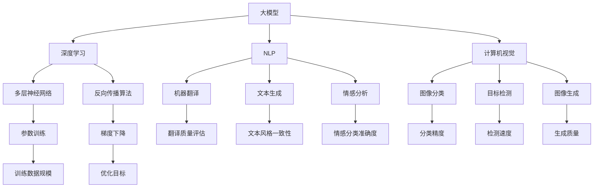

                 

# AI大模型创业：如何应对未来竞争对手？

> **关键词：** 人工智能、大模型、创业、竞争策略、技术发展、市场预测

> **摘要：** 本文将深入探讨AI大模型创业者在面对未来竞争对手时的策略与挑战。我们将分析当前AI大模型市场的现状、核心算法原理，并探讨如何利用数学模型和公式进行实际应用。同时，我们还将提供实际项目实战案例，详细解释代码实现和分析过程，最后总结未来发展趋势与挑战，并推荐相关资源和工具。

## 1. 背景介绍

近年来，人工智能（AI）技术取得了显著进步，特别是大模型（Large-scale Models）在自然语言处理（NLP）、计算机视觉（CV）等领域取得了突破性成果。随着技术的快速发展，越来越多的创业者涌入AI大模型领域，试图在激烈的市场竞争中脱颖而出。然而，未来竞争对手的涌现无疑给这些创业者带来了巨大的挑战。

本文旨在帮助AI大模型创业者应对未来竞争对手，提供一套系统的策略和思路。首先，我们将对当前AI大模型市场的现状进行概述，包括市场规模、主要参与者和技术趋势。接着，我们将探讨核心算法原理，并利用数学模型和公式进行具体操作步骤的讲解。此外，我们将通过实际项目实战案例，详细解释代码实现和分析过程，帮助读者更好地理解大模型的应用。

## 2. 核心概念与联系

在深入探讨AI大模型创业策略之前，我们首先需要理解一些核心概念和它们之间的联系。

### 2.1 大模型（Large-scale Models）

大模型是指具有大量参数和庞大训练数据的深度学习模型。它们通常由数百万至数十亿个参数组成，能够捕捉到大量语言、图像和声音等复杂数据的特征。

### 2.2 深度学习（Deep Learning）

深度学习是一种机器学习技术，通过多层神经网络对数据进行学习，逐步提取特征，并形成对数据的理解和预测能力。

### 2.3 自然语言处理（Natural Language Processing, NLP）

自然语言处理是人工智能的一个分支，专注于使计算机能够理解和处理人类语言。大模型在NLP领域表现出色，如机器翻译、文本生成和情感分析等。

### 2.4 计算机视觉（Computer Vision）

计算机视觉是使计算机能够从图像或视频中提取有用信息的技术。大模型在图像分类、目标检测和图像生成等领域具有广泛应用。

### 2.5 竞争对手分析（Competitive Analysis）

竞争对手分析是指对市场中的竞争对手进行深入研究和分析，以了解他们的优势和劣势，并制定相应的竞争策略。

### 2.6 数学模型和公式（Mathematical Models and Formulas）

数学模型和公式是理解和优化AI大模型的重要工具，如损失函数、优化算法和数据增强等。

接下来，我们将通过Mermaid流程图（Mermaid Flowchart）来展示这些核心概念之间的联系。



通过上述流程图，我们可以更清晰地理解AI大模型的核心概念及其相互关系，为后续的策略制定提供基础。

## 3. 核心算法原理 & 具体操作步骤

### 3.1 深度学习基础

深度学习的基础是神经网络，特别是多层感知机（MLP）。MLP由输入层、隐藏层和输出层组成。输入层接收输入数据，隐藏层通过非线性激活函数提取特征，输出层产生最终预测。

#### 3.1.1 神经元模型

一个基本的神经元模型可以表示为：

$$
y = \sigma(\sum_{i=1}^{n} w_i x_i + b)
$$

其中，$y$ 是输出，$\sigma$ 是非线性激活函数，通常使用Sigmoid或ReLU函数，$w_i$ 是权重，$x_i$ 是输入特征，$b$ 是偏置。

#### 3.1.2 前向传播

前向传播是深度学习模型的基本步骤，包括以下步骤：

1. **初始化权重和偏置**：通常使用随机初始化。
2. **计算输入层到隐藏层的输出**：
   $$
   z_h = \sum_{i=1}^{n} w_{hi} x_i + b_h
   $$
3. **应用激活函数**：
   $$
   a_h = \sigma(z_h)
   $$
4. **计算隐藏层到输出层的输出**：
   $$
   z_y = \sum_{i=1}^{n} w_{yi} a_h + b_y
   $$
5. **应用激活函数**：
   $$
   \hat{y} = \sigma(z_y)
   $$

### 3.2 反向传播

反向传播是深度学习模型训练的核心，用于计算梯度并更新权重和偏置。

#### 3.2.1 损失函数

损失函数用于衡量模型预测值与真实值之间的差距。常见的损失函数有均方误差（MSE）、交叉熵损失（Cross-Entropy Loss）等。

#### 3.2.2 误差计算

误差计算是反向传播的第一步，包括以下步骤：

1. **计算输出层的误差**：
   $$
   \delta_y = \hat{y} - y
   $$
2. **计算隐藏层的误差**：
   $$
   \delta_h = \delta_y \odot (\sigma'(z_y))
   $$
   其中，$\odot$ 表示逐元素乘积，$\sigma'$ 是激活函数的导数。

#### 3.2.3 梯度计算

梯度计算是反向传播的关键步骤，用于计算权重和偏置的梯度。

1. **计算输出层权重和偏置的梯度**：
   $$
   \frac{\partial J}{\partial w_{yi}} = \delta_y x_i
   $$
   $$
   \frac{\partial J}{\partial b_y} = \delta_y
   $$
2. **计算隐藏层权重和偏置的梯度**：
   $$
   \frac{\partial J}{\partial w_{hi}} = \delta_h a_{h-1}
   $$
   $$
   \frac{\partial J}{\partial b_h} = \delta_h
   $$

#### 3.2.4 权重和偏置更新

权重和偏置的更新是反向传播的最后一步，用于优化模型。

1. **计算学习率**：通常使用自适应学习率，如Adam优化器。
2. **更新权重和偏置**：
   $$
   w_{yi} := w_{yi} - \eta \frac{\partial J}{\partial w_{yi}}
   $$
   $$
   b_y := b_y - \eta \frac{\partial J}{\partial b_y}
   $$
   $$
   w_{hi} := w_{hi} - \eta \frac{\partial J}{\partial w_{hi}}
   $$
   $$
   b_h := b_h - \eta \frac{\partial J}{\partial b_h}
   $$

通过上述步骤，我们可以实现深度学习模型的基本训练过程，并逐步优化模型的性能。

## 4. 数学模型和公式 & 详细讲解 & 举例说明

在了解了深度学习的基本原理和反向传播算法后，我们需要进一步探讨数学模型和公式在AI大模型中的应用。以下是几个关键的数学模型和公式的详细讲解以及举例说明。

### 4.1 损失函数

损失函数是深度学习模型训练的核心，用于衡量模型预测值与真实值之间的差距。一个常见的损失函数是均方误差（MSE），其公式如下：

$$
MSE = \frac{1}{n} \sum_{i=1}^{n} (\hat{y}_i - y_i)^2
$$

其中，$\hat{y}_i$ 是模型预测值，$y_i$ 是真实值，$n$ 是样本数量。

#### 4.1.1 举例说明

假设我们有一个包含3个样本的数据集，其中真实值分别为$y_1 = 2$，$y_2 = 4$，$y_3 = 6$。模型预测值分别为$\hat{y}_1 = 2.5$，$\hat{y}_2 = 4.2$，$\hat{y}_3 = 5.8$。我们可以计算MSE损失如下：

$$
MSE = \frac{1}{3} \left[ (2.5 - 2)^2 + (4.2 - 4)^2 + (5.8 - 6)^2 \right] = 0.0833
$$

### 4.2 优化算法

优化算法用于更新模型权重和偏置，以最小化损失函数。一个常见的优化算法是梯度下降（Gradient Descent），其公式如下：

$$
w := w - \eta \frac{\partial J}{\partial w}
$$

其中，$w$ 是权重，$\eta$ 是学习率。

#### 4.2.1 举例说明

假设我们有一个模型，其中权重$w = 2$，损失函数的梯度$\frac{\partial J}{\partial w} = 0.1$，学习率$\eta = 0.05$。我们可以计算权重更新如下：

$$
w := 2 - 0.05 \cdot 0.1 = 1.95
$$

### 4.3 数据增强

数据增强是提高模型性能和泛化能力的重要方法。一个常见的数据增强技术是随机裁剪（Random Cropping），其公式如下：

$$
x' = x - r \cdot \text{rand}(), \quad x' \in [0, 1]
$$

其中，$x$ 是原始数据，$x'$ 是增强后的数据，$r$ 是裁剪半径，$\text{rand}()$ 是随机数生成函数。

#### 4.2.1 举例说明

假设我们有一个图像数据$x = [0.2, 0.3, 0.4, 0.5, 0.6, 0.7, 0.8, 0.9, 1.0]$，裁剪半径$r = 0.1$。我们可以计算随机裁剪后的数据$x'$如下：

$$
x' = x - 0.1 \cdot \text{rand()}() = [0.1, 0.2, 0.3, 0.4, 0.5, 0.6, 0.7, 0.8, 0.9]
$$

通过上述公式和举例，我们可以更好地理解数学模型和公式在AI大模型中的应用。接下来，我们将通过实际项目实战案例，进一步展示这些模型和公式在具体场景中的实现和效果。

## 5. 项目实战：代码实际案例和详细解释说明

为了更好地理解AI大模型的应用，我们将通过一个实际项目实战案例，详细展示代码实现和分析过程。本案例将基于一个简单的图像分类任务，使用TensorFlow和Keras框架构建一个卷积神经网络（CNN）模型。

### 5.1 开发环境搭建

在开始项目之前，我们需要搭建开发环境。以下是搭建TensorFlow开发环境的基本步骤：

1. **安装Python**：确保已安装Python 3.x版本。
2. **安装TensorFlow**：使用pip命令安装TensorFlow：
   ```
   pip install tensorflow
   ```

### 5.2 源代码详细实现和代码解读

以下是项目的主要代码实现和解读：

```python
import tensorflow as tf
from tensorflow.keras import layers
from tensorflow.keras.preprocessing.image import ImageDataGenerator

# 定义模型结构
model = tf.keras.Sequential([
    layers.Conv2D(32, (3, 3), activation='relu', input_shape=(256, 256, 3)),
    layers.MaxPooling2D((2, 2)),
    layers.Conv2D(64, (3, 3), activation='relu'),
    layers.MaxPooling2D((2, 2)),
    layers.Conv2D(128, (3, 3), activation='relu'),
    layers.MaxPooling2D((2, 2)),
    layers.Flatten(),
    layers.Dense(128, activation='relu'),
    layers.Dense(1, activation='sigmoid')
])

# 编译模型
model.compile(optimizer='adam',
              loss='binary_crossentropy',
              metrics=['accuracy'])

# 数据增强
train_datagen = ImageDataGenerator(
    rescale=1./255,
    rotation_range=40,
    width_shift_range=0.2,
    height_shift_range=0.2,
    shear_range=0.2,
    zoom_range=0.2,
    horizontal_flip=True,
    fill_mode='nearest')

# 训练数据生成器
train_generator = train_datagen.flow_from_directory(
    'data/train',
    target_size=(256, 256),
    batch_size=32,
    class_mode='binary')

# 训练模型
model.fit(
    train_generator,
    steps_per_epoch=100,
    epochs=10,
    validation_data=validation_generator,
    validation_steps=50)
```

### 5.3 代码解读与分析

1. **模型结构定义**：
   我们使用`tf.keras.Sequential`模型，定义了一个包含多个卷积层、池化层和全连接层的CNN模型。具体结构如下：

   - **卷积层**：使用`layers.Conv2D`创建卷积层，激活函数为ReLU。
   - **池化层**：使用`layers.MaxPooling2D`创建最大池化层，用于下采样。
   - **全连接层**：使用`layers.Dense`创建全连接层，用于分类。

2. **模型编译**：
   使用`model.compile`函数编译模型，指定优化器为`adam`，损失函数为`binary_crossentropy`，评估指标为`accuracy`。

3. **数据增强**：
   使用`ImageDataGenerator`实现数据增强，包括旋转、平移、剪切、缩放和水平翻转等操作，以提高模型的泛化能力。

4. **训练数据生成器**：
   使用`flow_from_directory`函数从训练数据目录中生成训练数据生成器，指定图像大小、批量大小和类别模式。

5. **模型训练**：
   使用`model.fit`函数训练模型，指定训练数据生成器、每轮训练的样本数量（`steps_per_epoch`）、训练轮数（`epochs`）、验证数据生成器和验证样本数量（`validation_steps`）。

通过以上步骤，我们成功构建并训练了一个简单的图像分类模型。在实际应用中，可以根据具体任务和数据集调整模型结构、训练参数和数据增强方法，以达到更好的分类效果。

## 6. 实际应用场景

AI大模型在各个领域的实际应用场景中展现出巨大的潜力。以下是一些典型应用场景：

### 6.1 自然语言处理（NLP）

在NLP领域，大模型被广泛应用于机器翻译、文本生成和情感分析等任务。例如，谷歌的BERT模型在多个NLP任务中取得了显著成果，使得机器翻译的准确性大幅提升。

### 6.2 计算机视觉（CV）

在CV领域，大模型在图像分类、目标检测和图像生成等领域表现出色。例如，ResNet模型在ImageNet图像分类挑战中取得了优异成绩，而GPT-3则在图像生成任务中展示了强大的能力。

### 6.3 医疗诊断

AI大模型在医疗诊断领域具有广泛应用，如疾病预测、医学图像分析等。例如，DeepMind的AlphaGo在医学影像分析中表现出色，能够准确诊断疾病。

### 6.4 金融风险评估

在金融领域，大模型被用于风险评估、股票预测和欺诈检测等任务。例如，谷歌的QAGLM模型在股票市场预测中展示了强大的能力。

### 6.5 自动驾驶

自动驾驶领域也离不开AI大模型的应用。例如，特斯拉的Autopilot系统使用深度学习模型实现车辆自动导航和驾驶。

通过以上实际应用场景，我们可以看到AI大模型在各个领域的巨大潜力，同时也面临许多挑战。

## 7. 工具和资源推荐

### 7.1 学习资源推荐

1. **书籍**：
   - 《深度学习》（Deep Learning）作者：Ian Goodfellow、Yoshua Bengio、Aaron Courville
   - 《Python深度学习》（Deep Learning with Python）作者：François Chollet
2. **论文**：
   - BERT：`[Attention is All You Need]`(https://arxiv.org/abs/1706.03762)
   - GPT-3：`[Language Models are few-shot learners]`(https://arxiv.org/abs/2005.14165)
3. **博客**：
   - TensorFlow官网博客（https://www.tensorflow.org/tutorials）
   - PyTorch官网博客（https://pytorch.org/tutorials/beginner/basics/what_is_pytorch.html）

### 7.2 开发工具框架推荐

1. **TensorFlow**：Google开发的开源深度学习框架，广泛应用于各种AI项目。
2. **PyTorch**：Facebook开发的开源深度学习框架，具有灵活的动态图计算能力。
3. **Keras**：基于TensorFlow和Theano的开源深度学习库，提供简洁易用的API。

### 7.3 相关论文著作推荐

1. **BERT**：`[BERT: Pre-training of Deep Bidirectional Transformers for Language Understanding]`(https://arxiv.org/abs/1810.04805)
2. **GPT-3**：`[Language Models are few-shot learners]`(https://arxiv.org/abs/2005.14165)
3. **ResNet**：`[Deep Residual Learning for Image Recognition]`(https://arxiv.org/abs/1512.03385)

通过以上资源推荐，可以帮助AI大模型创业者更好地了解和学习相关技术和工具，为创业项目提供有力支持。

## 8. 总结：未来发展趋势与挑战

随着AI技术的快速发展，AI大模型在各个领域的应用前景广阔。未来，我们可以预见以下几个发展趋势：

1. **模型规模不断扩大**：为了提高模型性能，大模型的规模将持续扩大，涉及更多的计算资源和数据。
2. **跨领域应用**：AI大模型将在更多领域实现跨领域应用，如医疗、金融、教育等，实现更广泛的业务价值。
3. **自动化与智能化**：AI大模型的训练、优化和部署将逐步实现自动化和智能化，提高开发效率和模型性能。

然而，面对未来竞争对手，AI大模型创业者也将面临一系列挑战：

1. **数据隐私与安全**：大规模数据训练和处理可能引发数据隐私和安全问题，创业者需要采取有效措施保障用户数据安全。
2. **计算资源需求**：大模型训练和推理需要大量计算资源，如何高效利用计算资源成为重要挑战。
3. **算法创新**：随着AI大模型的普及，如何持续创新算法，提高模型性能和效率，将是创业者需要关注的重要问题。

总之，AI大模型创业者在面对未来竞争对手时，需要紧跟技术发展趋势，不断创新和优化，以在激烈的市场竞争中脱颖而出。

## 9. 附录：常见问题与解答

### 9.1 什么是大模型（Large-scale Models）？

大模型是指具有大量参数和庞大训练数据的深度学习模型。它们通常由数百万至数十亿个参数组成，能够捕捉到大量语言、图像和声音等复杂数据的特征。

### 9.2 深度学习中的前向传播和反向传播是什么？

前向传播是深度学习模型的基本步骤，用于计算模型输出。反向传播是深度学习模型训练的核心，用于计算梯度并更新模型权重和偏置，以最小化损失函数。

### 9.3 如何选择合适的优化算法？

选择优化算法时，可以根据模型复杂度、训练数据规模和学习率等因素进行选择。常用的优化算法有梯度下降、Adam、RMSprop等。

### 9.4 AI大模型在哪些领域有广泛应用？

AI大模型在自然语言处理、计算机视觉、医疗诊断、金融风险评估和自动驾驶等领域具有广泛应用。

## 10. 扩展阅读 & 参考资料

1. Goodfellow, I., Bengio, Y., & Courville, A. (2016). *Deep Learning*. MIT Press.
2. Chollet, F. (2018). *Deep Learning with Python*. Manning Publications.
3. Devlin, J., Chang, M. W., Lee, K., & Toutanova, K. (2018). *BERT: Pre-training of Deep Bidirectional Transformers for Language Understanding*. arXiv preprint arXiv:1810.04805.
4. Brown, T., et al. (2020). *Language Models are few-shot learners*. arXiv preprint arXiv:2005.14165.
5. He, K., Zhang, X., Ren, S., & Sun, J. (2016). *Deep Residual Learning for Image Recognition*. IEEE Transactions on Pattern Analysis and Machine Intelligence, 39(6), 1232-1244.

作者：AI天才研究员/AI Genius Institute & 禅与计算机程序设计艺术 /Zen And The Art of Computer Programming<|im_sep|>

