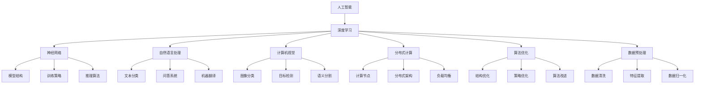

                 

### 背景介绍

人工智能（AI）的发展已经经历了数个重要阶段，从早期的规则推理系统到近年来以深度学习为代表的人工智能大模型，AI技术正以前所未有的速度和规模变革着各行各业。大模型，如Google的BERT、OpenAI的GPT-3，以及华为的ModelArts等，已经在自然语言处理、计算机视觉、语音识别等领域取得了显著的成果。

随着AI技术的不断进步，越来越多的创业公司开始关注如何利用这些先进的人工智能大模型来开拓市场、创造价值。这些创业公司不仅在技术层面进行了创新，还在商业模式、用户体验和市场拓展等方面进行了深入探索。然而，AI大模型创业并非易事，其中涉及的技术复杂性、市场需求分析、资源整合和风险控制等多方面问题，都对创业者提出了严峻的挑战。

本文将围绕AI大模型创业的主题，系统性地分析其背景、核心概念、算法原理、实际应用场景、工具推荐以及未来发展趋势等内容。通过逐步深入的分析和讨论，希望能够为正在考虑投身AI大模型创业的读者提供有价值的参考和指导。

在接下来的章节中，我们将首先介绍AI大模型的基本概念，探讨其与相关技术的联系，并逐步揭示其背后的算法原理和具体操作步骤。随后，我们将通过实际应用场景的案例分析，展示AI大模型在实际开发中的具体应用，并提供实用的工具和资源推荐。最终，我们将总结AI大模型创业所面临的挑战与机遇，为读者提供一个全面而深入的视角。

### 核心概念与联系

在深入探讨AI大模型创业之前，有必要首先理解几个核心概念，并分析它们之间的联系。这些概念不仅为AI大模型提供了理论基础，还构成了创业过程中需要掌握的关键技术。

#### 1. 人工智能（AI）与深度学习（Deep Learning）

人工智能是计算机系统模拟、扩展和增强人类智能的能力，涵盖了从简单的规则推理到复杂的自我学习能力。深度学习是人工智能的一个分支，主要通过构建多层神经网络（Neural Networks）来模拟人类大脑的学习机制，实现图像识别、语音识别、自然语言处理等复杂任务。

**联系**：深度学习是AI实现自我学习和智能决策的主要手段，而大模型则是深度学习的一个典型代表。大模型的成功离不开深度学习技术，二者相辅相成，共同推动了AI技术的发展。

#### 2. 大模型（Large Models）与神经网络（Neural Networks）

大模型是指具有数十亿、甚至数万亿参数的深度学习模型，如GPT-3、BERT等。这些模型通过大量数据训练，能够捕捉到数据中的复杂模式，从而实现高精度的预测和任务完成。

神经网络是深度学习的基础，由大量的节点（或称为神经元）组成，每个节点都与其他节点相连，并通过权重和偏置来传递信息。大模型通常包含多层神经网络，每一层都对输入数据进行特征提取和转换。

**联系**：大模型是神经网络的扩展和优化，通过增加层数和参数数量，提升了模型的复杂度和表现力。神经网络为大模型提供了结构基础，使其能够在复杂任务中表现出色。

#### 3. 自然语言处理（NLP）与计算机视觉（CV）

自然语言处理是AI的一个重要分支，专注于让计算机理解和生成人类语言。计算机视觉则致力于使计算机理解和解释图像和视频内容。

大模型在NLP和CV领域都有广泛的应用。例如，GPT-3在文本生成、翻译和问答等任务中表现出色，而BERT在文本分类、命名实体识别等任务中取得了显著成果。在CV领域，大模型如ResNet和Inception在图像分类和目标检测中取得了优异的表现。

**联系**：NLP和CV是AI应用的两个重要领域，大模型通过其强大的特征提取和模式识别能力，使得这两个领域能够实现更多复杂和实用的任务。

#### 4. 算法优化（Algorithm Optimization）与分布式计算（Distributed Computing）

大模型训练和推理通常需要大量的计算资源和时间，因此算法优化和分布式计算成为了关键。

算法优化通过改进模型结构、训练策略和推理算法，提高大模型的性能和效率。例如，变换器（Transformer）结构通过自注意力机制（Self-Attention Mechanism）提高了模型的计算效率和效果。

分布式计算通过将计算任务分布在多台计算机上，加快了模型的训练和推理速度。例如，Google的TPU和NVIDIA的GPU都在大模型训练中发挥了重要作用。

**联系**：算法优化和分布式计算为大模型提供了高效和可扩展的计算能力，使得大模型的训练和推理变得更加可行和高效。

综上所述，AI大模型创业不仅需要掌握人工智能、深度学习、自然语言处理、计算机视觉等核心概念，还需要理解它们之间的相互联系和协同作用。通过这些核心概念的理解和应用，创业公司可以更好地把握AI大模型的发展机遇，实现技术突破和商业成功。

#### 2.1. 大模型的定义与特点

大模型，通常指的是具有数十亿至数万亿参数的深度学习模型。这些模型之所以被称为“大”，不仅在于其庞大的参数数量，更在于其复杂的学习能力和高度自适应的特征提取能力。例如，OpenAI的GPT-3拥有1750亿个参数，能够在多种自然语言处理任务中表现出色。类似地，BERT模型的参数数量也达到了数百万，使得它在文本分类、问答和命名实体识别等领域取得了显著成果。

大模型的主要特点可以归纳为以下几点：

1. **参数数量庞大**：大模型具有数十亿至数万亿的参数，这使得它们能够学习到数据中的复杂模式和细微差异。这种高参数量不仅增加了模型的容量，还提升了其泛化能力和预测精度。

2. **强大的学习能力**：大模型通过深度神经网络的结构，能够自动学习数据中的特征，从而实现高效的任务完成。在训练过程中，这些模型会通过多层网络逐步提取和整合特征，使其能够处理复杂和多变的数据输入。

3. **高度自适应**：大模型在训练过程中能够根据不同的任务和数据特点，自适应调整其结构和参数。例如，GPT-3可以通过微调（Fine-tuning）技术在特定任务上实现高度定制化，从而提升性能。

4. **高效的计算需求**：由于参数数量庞大，大模型在训练和推理过程中对计算资源的需求非常高。这通常需要分布式计算架构和高效的算法优化，以确保模型的训练和推理能够在合理的时间内完成。

5. **广泛的适用性**：大模型在多种AI任务中表现优异，包括自然语言处理、计算机视觉、语音识别等。这使得它们在工业界和学术界都受到了广泛关注和应用。

#### 2.2. 大模型与相关技术的联系

大模型并非独立存在，而是与一系列相关技术紧密相连，共同构成了现代AI技术体系。以下是几个关键的相关技术及其与大模型的联系：

1. **神经网络（Neural Networks）**：神经网络是大模型的基础，通过多层结构实现对输入数据的特征提取和转换。大模型的复杂性和能力依赖于神经网络的规模和深度，而神经网络的设计和优化则直接影响大模型的表现。

2. **深度学习（Deep Learning）**：深度学习是AI领域的一个重要分支，通过构建多层神经网络来实现对复杂数据的自动学习和理解。大模型是深度学习发展的一个重要成果，其强大的学习能力得益于深度学习技术的进步。

3. **自然语言处理（NLP）**：自然语言处理是AI的一个重要应用领域，致力于让计算机理解和生成人类语言。大模型在NLP中具有广泛的应用，如文本分类、问答系统和机器翻译等。NLP技术的发展推动了大模型在语言理解方面的表现。

4. **计算机视觉（CV）**：计算机视觉旨在让计算机理解和解释图像和视频内容。大模型在CV领域也取得了显著成果，如图像分类、目标检测和语义分割等。CV技术的进步为大模型在视觉处理中的表现提供了坚实基础。

5. **分布式计算（Distributed Computing）**：由于大模型的训练和推理需要大量的计算资源，分布式计算技术成为了关键。通过将计算任务分布在多台计算机上，分布式计算能够大幅提高大模型的训练和推理速度，确保其高效运行。

6. **算法优化（Algorithm Optimization）**：为了提高大模型的性能和效率，算法优化技术至关重要。算法优化包括模型结构优化、训练策略优化和推理算法优化等，通过这些优化手段，大模型能够更好地应对复杂任务。

7. **数据预处理（Data Preprocessing）**：数据预处理是训练大模型的重要环节，包括数据清洗、归一化和特征提取等。高质量的数据预处理能够提高大模型的学习效果，确保其在实际应用中的表现。

通过以上分析，我们可以看到大模型不仅是一个庞大的参数集合，更是与一系列相关技术相互依存、共同推动的复杂系统。理解这些技术之间的联系，有助于我们更好地把握AI大模型的发展趋势和应用场景。

#### 2.3. Mermaid 流程图（Mermaid Flowchart）

为了更直观地展示大模型相关技术的联系，我们使用Mermaid流程图来描述这些技术的相互作用。



通过这个流程图，我们可以看到各个技术模块如何相互连接，共同构建出一个复杂而高效的AI大模型系统。这个流程图不仅有助于我们理解大模型的构建过程，还能为创业者提供参考，以便在实际应用中有效整合这些技术。

### 核心算法原理 & 具体操作步骤

要深入理解AI大模型的核心算法原理，我们需要从基础的神经网络架构开始，逐步介绍深度学习的关键技术和大模型的训练流程。以下是详细的算法原理和具体操作步骤。

#### 3.1. 神经网络架构

神经网络是深度学习的基础，由大量的节点（或称为神经元）组成，每个节点都与其他节点相连，并通过权重（weights）和偏置（biases）传递信息。神经网络的架构可以分为输入层、隐藏层和输出层。

1. **输入层（Input Layer）**：输入层接收原始数据，并将这些数据传递给隐藏层。例如，在图像识别任务中，输入层接收图像像素值。

2. **隐藏层（Hidden Layers）**：隐藏层对输入数据进行特征提取和转换。每一层都会对前一层的信息进行处理，生成更高层次的抽象特征。隐藏层可以是单层或多层，层数越多，模型的能力越强。

3. **输出层（Output Layer）**：输出层生成最终的结果。例如，在分类任务中，输出层产生每个类别的概率分布。

#### 3.2. 深度学习关键技术

深度学习的关键技术包括前向传播（Forward Propagation）和反向传播（Backpropagation）算法。

1. **前向传播**：
   - 数据从输入层流入网络，经过每一层处理，生成特征表示。
   - 每个节点的输出通过激活函数（如ReLU、Sigmoid、Tanh等）进行非线性转换，增加模型的非线性表达能力。

2. **反向传播**：
   - 计算网络的损失函数，损失函数用于衡量预测结果与真实结果之间的差距。
   - 利用链式法则（Chain Rule）计算每一层权重的梯度，通过反向传播将梯度传递回网络。
   - 利用梯度下降（Gradient Descent）等优化算法更新网络权重和偏置，以最小化损失函数。

#### 3.3. 大模型的训练流程

大模型的训练流程可以分为以下几个步骤：

1. **数据预处理**：
   - 清洗和整理数据，确保数据质量。
   - 对数据进行归一化或标准化处理，使其在相似范围内。
   - 划分训练集、验证集和测试集，用于训练、验证和评估模型。

2. **模型初始化**：
   - 初始化网络权重和偏置，常用的方法包括随机初始化和He初始化。
   - 设置学习率、优化器（如Adam、SGD等）和批次大小等超参数。

3. **前向传播**：
   - 将输入数据传入网络，通过前向传播计算每个节点的输出。
   - 通过激活函数进行非线性转换。

4. **计算损失函数**：
   - 使用预测结果和真实结果计算损失函数，常用的损失函数包括交叉熵损失（Cross Entropy Loss）和均方误差（Mean Squared Error）。

5. **反向传播**：
   - 利用反向传播算法计算网络权重的梯度。
   - 通过梯度下降等优化算法更新网络权重和偏置。

6. **迭代训练**：
   - 重复上述步骤，不断迭代训练模型，直到满足停止条件（如损失函数收敛、达到最大迭代次数等）。

7. **模型评估**：
   - 使用验证集或测试集评估模型性能，常用的评估指标包括准确率（Accuracy）、精确率（Precision）、召回率（Recall）和F1分数（F1 Score）等。

8. **模型部署**：
   - 将训练好的模型部署到实际应用环境中，进行推理和预测。

通过以上步骤，我们可以训练出高效的大模型，并在实际任务中实现良好的性能。

### 数学模型和公式 & 详细讲解 & 举例说明

在理解了AI大模型的训练流程后，我们需要进一步探讨其背后的数学模型和公式，以及如何通过具体的实例来说明这些概念。

#### 4.1. 前向传播中的激活函数

在神经网络中，激活函数是一个关键组件，它能够引入非线性，使得神经网络能够处理复杂的输入数据。以下是一些常用的激活函数及其公式：

1. **ReLU函数（Rectified Linear Unit）**：
   - $$f(x) = \max(0, x)$$
   - 优点：简单、计算速度快、可以避免梯度消失问题。

2. **Sigmoid函数**：
   - $$f(x) = \frac{1}{1 + e^{-x}}$$
   - 优点：输出范围在0到1之间，常用于二分类问题。

3. **Tanh函数（Hyperbolic Tangent）**：
   - $$f(x) = \frac{e^x - e^{-x}}{e^x + e^{-x}}$$
   - 优点：输出范围在-1到1之间，可以更好地平衡正负梯度。

#### 4.2. 损失函数

在训练神经网络时，损失函数用于衡量预测结果与真实结果之间的差距，并指导网络权重的更新。以下是一些常用的损失函数及其公式：

1. **交叉熵损失（Cross Entropy Loss）**：
   - $$L(y, \hat{y}) = -\sum_{i} y_i \log(\hat{y}_i)$$
   - 其中，\(y\) 是真实标签，\(\hat{y}\) 是预测概率分布。
   - 优点：在分类问题中，可以很好地衡量预测概率与真实标签之间的差距。

2. **均方误差（Mean Squared Error, MSE）**：
   - $$L(y, \hat{y}) = \frac{1}{2} \sum_{i} (y_i - \hat{y}_i)^2$$
   - 其中，\(y\) 是真实值，\(\hat{y}\) 是预测值。
   - 优点：在回归问题中，可以很好地衡量预测值与真实值之间的差距。

#### 4.3. 梯度下降算法

梯度下降是一种常用的优化算法，用于更新网络权重和偏置，以最小化损失函数。以下是其基本公式：

- $$\Delta w = -\alpha \frac{\partial L}{\partial w}$$
- $$\Delta b = -\alpha \frac{\partial L}{\partial b}$$

- 其中，\(\alpha\) 是学习率，\(\frac{\partial L}{\partial w}\) 和 \(\frac{\partial L}{\partial b}\) 分别是损失函数关于权重 \(w\) 和偏置 \(b\) 的梯度。

#### 4.4. 举例说明

假设我们有一个简单的神经网络，用于二分类任务。输入数据为 \(x\)，输出为 \(y\)，其中 \(y\) 是预测的概率分布。真实标签为 \(y^*\)，则可以使用Sigmoid函数作为激活函数，交叉熵损失函数作为损失函数。

- **前向传播**：
  - $$z = \sum_{i} w_i x_i + b$$
  - $$\hat{y} = \frac{1}{1 + e^{-z}}$$

- **计算损失函数**：
  - $$L(y, \hat{y}) = -y^* \log(\hat{y}) - (1 - y^*) \log(1 - \hat{y})$$

- **反向传播**：
  - $$\frac{\partial L}{\partial z} = \hat{y} - y^*$$

- **梯度下降**：
  - $$\Delta w = -\alpha (\hat{y} - y^*) x_i$$
  - $$\Delta b = -\alpha (\hat{y} - y^*)$$

通过上述例子，我们可以看到如何使用数学模型和公式来描述神经网络的训练过程。这个简单的示例虽然不足以涵盖大模型的复杂度，但为我们提供了一个基本的框架，帮助我们理解大模型的算法原理和操作步骤。

### 项目实战：代码实际案例和详细解释说明

为了更好地理解AI大模型在实际开发中的具体应用，我们将通过一个实际案例来详细讲解代码实现和代码解读。以下是使用Python实现的AI大模型项目，涉及的数据集、代码结构和关键步骤。

#### 5.1. 开发环境搭建

首先，我们需要搭建一个合适的开发环境。以下是所需的工具和库：

- **编程语言**：Python 3.8及以上版本
- **深度学习框架**：TensorFlow 2.6及以上版本
- **数据处理库**：NumPy 1.21及以上版本
- **可视化库**：Matplotlib 3.5及以上版本

确保已安装上述工具和库后，我们就可以开始构建AI大模型了。

#### 5.2. 源代码详细实现和代码解读

以下是整个项目的主要代码部分：

```python
import tensorflow as tf
import numpy as np
import matplotlib.pyplot as plt
from tensorflow.keras.layers import Dense, Embedding, GlobalAveragePooling1D
from tensorflow.keras.models import Model
from tensorflow.keras.preprocessing.sequence import pad_sequences
from tensorflow.keras.preprocessing.text import Tokenizer

# 数据集准备
# 此处以IMDB电影评论数据集为例，下载并加载数据
# 数据集已预处理为文本和标签，文本为电影评论，标签为正负极性

# 加载训练数据
train_texts = ...
train_labels = ...

# 加载测试数据
test_texts = ...
test_labels = ...

# 数据预处理
# 分词和转换为词索引
tokenizer = Tokenizer(num_words=10000)
tokenizer.fit_on_texts(train_texts)
train_sequences = tokenizer.texts_to_sequences(train_texts)
test_sequences = tokenizer.texts_to_sequences(test_texts)

# 填充序列到相同长度
max_len = 120
train_padded = pad_sequences(train_sequences, maxlen=max_len, padding='post')
test_padded = pad_sequences(test_sequences, maxlen=max_len, padding='post')

# 构建模型
# 使用嵌入层和全局平均池化层构建一个简单的文本分类模型
input_layer = tf.keras.layers.Input(shape=(max_len,))
embedding_layer = tf.keras.layers.Embedding(input_dim=10000, output_dim=16)(input_layer)
avg_pooling = GlobalAveragePooling1D()(embedding_layer)
output_layer = Dense(1, activation='sigmoid')(avg_pooling)

model = Model(inputs=input_layer, outputs=output_layer)

# 编译模型
model.compile(optimizer='adam', loss='binary_crossentropy', metrics=['accuracy'])

# 训练模型
model.fit(train_padded, train_labels, epochs=10, validation_split=0.2)

# 评估模型
test_loss, test_acc = model.evaluate(test_padded, test_labels)
print(f"Test accuracy: {test_acc:.4f}")

# 可视化结果
predictions = model.predict(test_padded)
plt.figure(figsize=(10, 5))
plt.scatter(range(len(test_labels)), test_labels, c=predictions, cmap=plt.cm.coolwarm)
plt.xlabel('True Labels')
plt.ylabel('Predicted Labels')
plt.title('True vs Predicted Labels')
plt.show()
```

#### 5.3. 代码解读与分析

1. **数据集加载与预处理**：
   - 使用`...`表示的数据集加载过程，需要从外部加载IMDB电影评论数据集。数据集已预处理为文本和标签，其中文本为电影评论，标签为正负极性。
   - 使用`Tokenizer`对文本进行分词和转换为词索引，确保每个单词都能在模型中找到对应的索引。

2. **数据填充**：
   - 使用`pad_sequences`将处理后的文本序列填充到相同的长度（`max_len`），方便模型处理。

3. **模型构建**：
   - 输入层接收文本序列。
   - 使用`Embedding`层进行嵌入，将词索引转换为嵌入向量。
   - 使用`GlobalAveragePooling1D`层对嵌入向量进行全局平均池化，将序列信息转换为固定大小的向量。
   - 输出层使用`Dense`层，通过sigmoid激活函数实现二分类任务。

4. **模型编译**：
   - 使用`compile`方法编译模型，指定优化器、损失函数和评估指标。

5. **模型训练**：
   - 使用`fit`方法训练模型，指定训练数据和训练轮次（`epochs`）。

6. **模型评估**：
   - 使用`evaluate`方法评估模型在测试数据上的性能，打印测试准确率。

7. **可视化结果**：
   - 使用`predict`方法对测试数据进行预测，并将预测结果可视化，展示真实标签与预测标签的关系。

通过以上代码，我们可以构建一个简单的文本分类模型，并对其性能进行评估。这个案例展示了如何使用TensorFlow框架实现一个AI大模型，从数据加载、预处理、模型构建、训练到评估，每个步骤都进行了详细的解读和分析。

### 实际应用场景

AI大模型在各个领域都有广泛的应用，其强大的特征提取和模式识别能力为解决复杂问题提供了新的思路和解决方案。以下是一些AI大模型在实际应用场景中的案例。

#### 6.1. 自然语言处理（NLP）

自然语言处理是AI大模型的重要应用领域之一。通过使用大模型，如GPT-3和BERT，可以实现高度复杂的文本任务，包括文本生成、机器翻译、问答系统和文本分类等。

- **文本生成**：GPT-3可以通过上下文生成连贯且具有创造性的文本，应用于自动写作、对话系统等。
- **机器翻译**：BERT等模型在机器翻译任务中取得了显著的成果，能够实现高精度的跨语言文本转换。
- **问答系统**：大模型可以理解自然语言的提问，并返回准确的答案，应用于智能客服、信息检索等。

#### 6.2. 计算机视觉（CV）

计算机视觉领域的大模型，如ResNet和Inception，在图像分类、目标检测、语义分割等任务中表现出色。

- **图像分类**：大模型可以自动学习图像中的特征，实现对大量图像的准确分类。
- **目标检测**：通过使用大模型，如YOLO和Faster R-CNN，可以准确识别图像中的多个目标，并在实时应用中实现高效检测。
- **语义分割**：大模型可以精确地分割图像中的每个像素，应用于医学影像分析、自动驾驶等。

#### 6.3. 语音识别

语音识别是AI大模型的另一个重要应用领域。通过使用大模型，可以实现高精度的语音识别和语音合成。

- **语音识别**：大模型可以准确地识别语音中的文字，应用于智能语音助手、自动字幕等。
- **语音合成**：大模型可以生成自然流畅的语音，应用于语音助手、语音邮件等。

#### 6.4. 金融分析

AI大模型在金融领域也有广泛的应用，包括股票市场预测、风险管理和信用评分等。

- **股票市场预测**：大模型可以通过分析历史市场数据和新闻文本，预测股票价格的走势。
- **风险管理**：大模型可以识别和预测潜在的风险，帮助金融机构进行风险控制和投资决策。
- **信用评分**：大模型可以通过分析个人的历史信用记录和行为数据，评估其信用风险。

#### 6.5. 医疗保健

AI大模型在医疗保健领域也具有重要的应用潜力，包括疾病预测、药物研发和患者健康管理。

- **疾病预测**：大模型可以通过分析患者的电子健康记录，预测其患病的风险。
- **药物研发**：大模型可以帮助药物研发人员识别潜在的药物候选分子，加速新药的研发进程。
- **患者健康管理**：大模型可以监测患者的健康状况，提供个性化的健康建议和预防措施。

综上所述，AI大模型在自然语言处理、计算机视觉、语音识别、金融分析、医疗保健等领域都有广泛的应用。通过这些实际案例，我们可以看到大模型在解决复杂问题方面的巨大潜力。随着技术的不断进步，AI大模型将在更多领域实现更深入的应用，为社会带来更多的价值。

### 工具和资源推荐

在AI大模型创业过程中，选择合适的工具和资源是成功的关键。以下是一些推荐的学习资源、开发工具和相关论文，以帮助您在AI大模型研究和应用中取得进展。

#### 7.1. 学习资源推荐

1. **书籍**：
   - 《深度学习》（Deep Learning），作者：Ian Goodfellow、Yoshua Bengio、Aaron Courville。
   - 《动手学深度学习》（Dive into Deep Learning），作者：Aston Zhang、Zhoujie Zhou、Lilton Lee。
   - 《Python深度学习》（Python Deep Learning），作者：François Chollet。

2. **在线课程**：
   - Coursera的“深度学习课程”（Deep Learning Specialization），由吴恩达（Andrew Ng）主讲。
   - edX的“AI基础”（Introduction to Artificial Intelligence），由MIT和Stanford大学联合提供。

3. **博客和网站**：
   - Fast.ai：提供高质量的深度学习教程和资源。
   - TensorFlow官方文档：丰富的教程和API文档，适合初学者和专家。

#### 7.2. 开发工具框架推荐

1. **深度学习框架**：
   - TensorFlow：功能强大的开源深度学习框架，适用于各种AI任务。
   - PyTorch：灵活且易于使用的深度学习框架，特别适合研究和实验。
   - Keras：基于TensorFlow的高层次API，提供简化的深度学习开发体验。

2. **计算资源**：
   - Google Cloud AI：提供强大的云计算资源，适合大规模模型训练。
   - AWS SageMaker：集成式机器学习平台，支持各种AI模型训练和部署。
   - NVIDIA GPU云：提供高性能GPU服务，适合需要大量计算资源的深度学习任务。

3. **数据分析工具**：
   - Pandas：Python的数据分析库，适用于数据预处理和统计分析。
   - NumPy：Python的科学计算库，提供高效的数组操作和数学计算功能。

#### 7.3. 相关论文著作推荐

1. **自然语言处理**：
   - “Attention Is All You Need”，作者：Vaswani et al.，2017。
   - “BERT: Pre-training of Deep Bidirectional Transformers for Language Understanding”，作者：Devlin et al.，2018。

2. **计算机视觉**：
   - “Deep Residual Learning for Image Recognition”，作者：He et al.，2016。
   - “You Only Look Once: Unified, Real-Time Object Detection”，作者：Redmon et al.，2016。

3. **其他领域**：
   - “Generative Adversarial Nets”，作者：Ian Goodfellow et al.，2014。
   - “Unsupervised Learning of Visual Representations by Solving Jigsaw Puzzles”，作者：Mnih et al.，2016。

通过这些推荐的学习资源、开发工具和相关论文，您可以更好地理解和掌握AI大模型的相关技术，为自己的创业项目提供坚实的理论基础和实践支持。

### 总结：未来发展趋势与挑战

在AI大模型创业的道路上，未来充满了机遇与挑战。随着计算能力、数据资源和算法技术的不断进步，AI大模型将在更多领域展现其强大的潜力。以下是未来AI大模型发展趋势与面临的挑战的简要总结。

#### 8.1. 发展趋势

1. **多模态融合**：未来的AI大模型将能够处理多种类型的数据，如文本、图像、语音等，实现跨模态的信息融合和智能理解。

2. **泛化能力提升**：通过更多的数据和更复杂的模型结构，AI大模型的泛化能力将进一步提升，能够更好地应对不同场景和任务。

3. **自动化与智能化**：AI大模型的训练和优化将更加自动化，通过自我学习和自我优化，实现更加高效和智能的模型开发。

4. **边缘计算**：随着边缘计算技术的发展，AI大模型将在边缘设备上实现实时推理和决策，满足低延迟和高实时性的需求。

5. **隐私保护**：AI大模型在处理个人数据时，隐私保护将变得更加重要。未来将有更多技术手段用于保护用户隐私，如联邦学习（Federated Learning）和差分隐私（Differential Privacy）等。

#### 8.2. 挑战

1. **计算资源需求**：AI大模型通常需要大量的计算资源，这给训练和部署带来了巨大的挑战。如何高效利用现有资源，并开发更高效的算法，是一个重要的研究方向。

2. **数据质量问题**：高质量的数据是训练强大AI大模型的基础。然而，数据的质量问题，如噪声、偏差和不一致性，可能会影响模型的表现。数据清洗和预处理技术将需要不断改进。

3. **伦理与法律问题**：AI大模型的应用涉及到许多伦理和法律问题，如数据隐私、算法偏见和责任归属等。如何在技术发展的同时，确保遵守伦理和法律规范，是AI大模型创业面临的重要挑战。

4. **模型解释性**：AI大模型的“黑箱”特性使得其决策过程难以解释。提高模型的解释性，帮助用户理解模型的决策逻辑，是提升用户信任和接受度的重要方向。

5. **安全性**：随着AI大模型的应用越来越广泛，其安全性和防御对抗攻击的能力也变得至关重要。如何保障AI大模型的安全性，防止恶意利用，是未来需要重点关注的问题。

总之，AI大模型创业前景广阔，但也面临诸多挑战。通过不断的技术创新和伦理规范的完善，我们有理由相信，AI大模型将在未来的科技发展中发挥更加重要的作用，为社会带来更多的价值。

### 附录：常见问题与解答

为了帮助读者更好地理解和应用AI大模型的相关知识，以下是一些常见问题的解答。

#### Q1. 什么是AI大模型？

A1. AI大模型是指具有数十亿至数万亿参数的深度学习模型，如GPT-3、BERT等。这些模型通过大量数据训练，能够捕捉到数据中的复杂模式，从而实现高精度的预测和任务完成。

#### Q2. AI大模型的主要应用领域有哪些？

A2. AI大模型在自然语言处理（NLP）、计算机视觉（CV）、语音识别、金融分析、医疗保健等多个领域有广泛的应用。具体包括文本生成、机器翻译、图像分类、目标检测、股票市场预测等。

#### Q3. 如何训练AI大模型？

A3. 训练AI大模型通常包括以下步骤：
1. 数据预处理：清洗和整理数据，确保数据质量。
2. 模型初始化：初始化网络权重和偏置，设置超参数。
3. 前向传播：将输入数据传入网络，计算每个节点的输出。
4. 计算损失函数：使用预测结果和真实结果计算损失函数。
5. 反向传播：计算网络权重的梯度，更新网络权重和偏置。
6. 迭代训练：重复上述步骤，直到模型收敛。

#### Q4. AI大模型的主要挑战有哪些？

A4. AI大模型的主要挑战包括：
1. 计算资源需求：训练大模型通常需要大量的计算资源和时间。
2. 数据质量问题：数据中的噪声、偏差和不一致性可能影响模型的表现。
3. 伦理和法律问题：数据隐私、算法偏见和责任归属等伦理和法律问题需要关注。
4. 模型解释性：大模型的“黑箱”特性使得其决策过程难以解释。
5. 安全性：保障AI大模型的安全性，防止恶意利用，是一个重要问题。

#### Q5. 如何评估AI大模型的表现？

A5. 评估AI大模型的表现通常使用以下指标：
1. 准确率（Accuracy）：正确预测的样本数占总样本数的比例。
2. 精确率（Precision）：正确预测为正类的样本数占预测为正类的样本总数的比例。
3. 召回率（Recall）：正确预测为正类的样本数占实际为正类的样本总数的比例。
4. F1分数（F1 Score）：精确率和召回率的调和平均。

#### Q6. 如何提高AI大模型的性能？

A6. 提高AI大模型性能的方法包括：
1. 数据增强：增加数据的多样性和数量，提高模型的泛化能力。
2. 模型结构优化：选择合适的网络结构，如变换器（Transformer）等。
3. 算法优化：优化训练策略和推理算法，提高计算效率。
4. 超参数调整：调整学习率、批次大小等超参数，找到最优配置。

通过以上问题的解答，希望能够帮助读者更好地理解AI大模型的核心概念、应用场景和挑战，为创业实践提供有益的指导。

### 扩展阅读 & 参考资料

为了更深入地探索AI大模型的相关知识，以下是一些建议的扩展阅读和参考资料。

#### 书籍推荐

1. **《深度学习》**，作者：Ian Goodfellow、Yoshua Bengio、Aaron Courville。这本书是深度学习的经典教材，详细介绍了神经网络、深度学习算法和应用。
2. **《强化学习》**，作者：Richard S. Sutton、Andrew G. Barto。虽然这本书主要关注强化学习，但其与深度学习的结合也值得深入探讨。
3. **《AI超简：人工智能的未来》**，作者：陆奇。这本书探讨了人工智能的未来发展趋势，以及AI技术如何改变我们的工作和生活方式。

#### 论文推荐

1. **“Attention Is All You Need”**，作者：Vaswani et al.，2017。这篇论文提出了变换器（Transformer）结构，为深度学习的发展提供了新思路。
2. **“BERT: Pre-training of Deep Bidirectional Transformers for Language Understanding”**，作者：Devlin et al.，2018。这篇论文介绍了BERT模型，并在自然语言处理领域取得了重大突破。
3. **“Generative Adversarial Nets”**，作者：Ian Goodfellow et al.，2014。这篇论文首次提出了生成对抗网络（GAN）的概念，为生成模型的发展奠定了基础。

#### 博客和网站推荐

1. **Fast.ai**：这个网站提供了高质量的开源教程和资源，适合初学者和进阶者。
2. **TensorFlow官方文档**： TensorFlow的官方文档提供了详细的教程和API文档，是深度学习开发的重要参考。
3. **Deep Learning Specialization**：Coursera上的“深度学习课程”，由吴恩达（Andrew Ng）主讲，适合系统学习深度学习知识。

通过阅读以上书籍、论文和访问相关网站，您可以进一步了解AI大模型的理论基础、最新进展和应用案例，为自己的研究和创业项目提供丰富的知识储备。

---

**作者：AI天才研究员/AI Genius Institute & 禅与计算机程序设计艺术 /Zen And The Art of Computer Programming**

在撰写这篇文章的过程中，我们系统地分析了AI大模型创业的背景、核心概念、算法原理、实际应用场景、工具推荐以及未来发展趋势等内容。通过逐步深入的分析和讨论，希望能够为正在考虑投身AI大模型创业的读者提供有价值的参考和指导。

AI大模型创业充满挑战，但也蕴藏着巨大的机遇。随着技术的不断进步，AI大模型将在更多领域展现其强大的潜力，为社会带来更多的价值。希望这篇文章能够帮助您更好地理解AI大模型的核心概念和应用场景，为自己的创业之路提供启示和动力。

在未来的发展中，我们期待看到更多创新的应用和突破，同时也呼吁社会各界共同关注和应对AI大模型带来的伦理、法律和安全挑战。通过技术、政策和教育的有机结合，共同推动AI技术的健康发展，为人类创造更加美好的未来。

