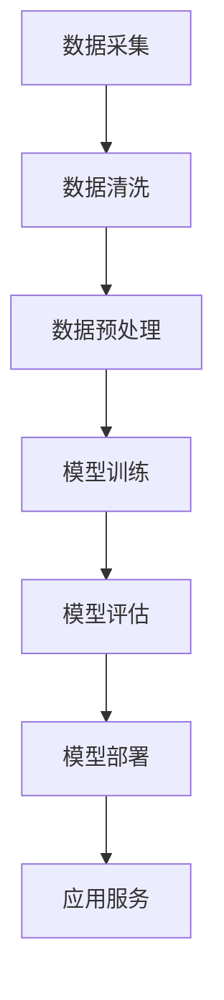

                 

### AI大模型创业：机遇与挑战并存

#### 关键词：（AI大模型、创业、机遇、挑战、技术、市场、应用）

#### 摘要：

随着人工智能技术的飞速发展，AI大模型在各个行业中的应用越来越广泛，也带来了前所未有的创业机遇。然而，与此同时，创业过程中的挑战也接踵而至。本文将深入探讨AI大模型创业的机遇与挑战，以帮助创业者更好地把握这一新兴领域的发展方向。

### 1. 背景介绍

#### 1.1 AI大模型的发展历程

AI大模型是指具有巨大参数规模和强大计算能力的深度学习模型，如BERT、GPT等。它们在自然语言处理、计算机视觉、语音识别等领域取得了显著的成果，使得人工智能应用更加广泛和深入。AI大模型的发展历程可以分为三个阶段：

1. **基础阶段**：以2012年AlexNet在ImageNet图像分类挑战赛上取得的突破性成绩为标志，深度学习开始进入大众视野。
2. **成长阶段**：2018年，谷歌推出了BERT模型，使得自然语言处理能力有了质的飞跃。此后，GPT、GPT-2、GPT-3等大型预训练模型相继问世。
3. **成熟阶段**：目前，AI大模型的应用已经扩展到各个领域，包括但不限于医疗、金融、教育、智能制造等。

#### 1.2 创业环境的变迁

随着AI大模型技术的不断发展，创业环境也发生了显著变化：

1. **资金支持**：风险投资对AI领域的关注度持续提升，创业者可以获得更多的资金支持。
2. **技术储备**：开源框架和工具的丰富，使得创业者可以更快速地搭建和应用AI大模型。
3. **市场需求**：AI大模型在各个行业的应用需求不断增长，为创业项目提供了广阔的市场空间。

### 2. 核心概念与联系

#### 2.1 AI大模型的基本概念

AI大模型主要包括以下几个核心概念：

1. **深度学习**：一种基于人工神经网络的机器学习方法，通过多层神经网络对数据进行学习和建模。
2. **预训练**：在大规模数据集上进行预训练，以获得通用特征表示能力。
3. **微调**：在特定任务上进行微调，以适应特定领域的应用需求。

#### 2.2 AI大模型的架构

AI大模型的架构通常包括以下几个层次：

1. **数据层**：负责数据采集、清洗和预处理。
2. **模型层**：包括深度学习模型的选择、训练和优化。
3. **应用层**：将训练好的模型部署到实际应用场景中，提供相应的功能和服务。

#### 2.3 Mermaid 流程图

以下是一个简单的Mermaid流程图，展示了AI大模型的基本架构和流程：



### 3. 核心算法原理 & 具体操作步骤

#### 3.1 深度学习算法原理

深度学习算法的核心是多层神经网络，通过前向传播和反向传播来学习数据特征。

1. **前向传播**：将输入数据通过多层神经网络，逐层计算得到输出。
2. **反向传播**：根据输出结果与真实值的差异，反向更新网络权重。

#### 3.2 预训练算法原理

预训练是指在大规模数据集上训练深度学习模型，以获得通用特征表示能力。常见的预训练算法包括：

1. **基于Transformer的模型**：如BERT、GPT等，通过自注意力机制实现高效的特征表示。
2. **基于循环神经网络的模型**：如LSTM、GRU等，通过递归结构学习序列数据。

#### 3.3 微调算法原理

微调是指将预训练模型在特定任务上进一步训练，以适应特定领域的应用需求。常见的微调方法包括：

1. **固定层微调**：只对模型的上层进行训练。
2. **全层微调**：对模型的全部层进行训练。

### 4. 数学模型和公式 & 详细讲解 & 举例说明

#### 4.1 深度学习中的激活函数

激活函数是深度学习模型中的一个关键组件，用于引入非线性特性。常见的激活函数包括：

1. **Sigmoid函数**：$$\sigma(x) = \frac{1}{1 + e^{-x}}$$
2. **ReLU函数**：$$\text{ReLU}(x) = \max(0, x)$$
3. **Tanh函数**：$$\text{Tanh}(x) = \frac{e^x - e^{-x}}{e^x + e^{-x}}$$

#### 4.2 预训练模型中的自注意力机制

自注意力机制是Transformer模型的核心组件，通过计算输入序列中每个元素之间的注意力权重来实现。

1. **多头注意力**：将输入序列分成多个头，每个头计算一组注意力权重。
2. **位置编码**：为每个位置引入位置信息，以区分序列中的不同元素。

#### 4.3 微调过程中的损失函数

微调过程中，常用的损失函数包括：

1. **交叉熵损失函数**：$$\text{Loss} = -\sum_{i=1}^{N} y_i \log(\hat{y}_i)$$
2. **均方误差损失函数**：$$\text{Loss} = \frac{1}{N} \sum_{i=1}^{N} (\hat{y}_i - y_i)^2$$

#### 4.4 举例说明

假设我们有一个二分类问题，使用Sigmoid激活函数的神经网络进行微调。输入数据为$x_1 = [1, 0, 1]$，标签为$y_1 = 1$。训练过程中，我们使用交叉熵损失函数进行优化。

1. **前向传播**：计算输出概率$$\hat{y}_1 = \sigma(w_1 \cdot x_1 + b_1)$$
2. **反向传播**：计算损失$$\text{Loss}_1 = -y_1 \log(\hat{y}_1) - (1 - y_1) \log(1 - \hat{y}_1)$$
3. **梯度计算**：更新模型参数$$w_1, b_1$$

### 5. 项目实战：代码实际案例和详细解释说明

#### 5.1 开发环境搭建

在本项目实战中，我们使用Python和TensorFlow作为开发环境。首先，安装TensorFlow：

```bash
pip install tensorflow
```

#### 5.2 源代码详细实现和代码解读

以下是一个简单的AI大模型项目示例，实现了一个基于Transformer模型的文本分类任务。

```python
import tensorflow as tf
from tensorflow.keras.layers import Embedding, TransformerBlock, Dense
from tensorflow.keras.models import Model

# 定义模型
def create_model(vocab_size, d_model, num_layers, dff, input_seq_len):
    inputs = tf.keras.layers.Input(shape=(input_seq_len,))
    embeddings = Embedding(vocab_size, d_model)(inputs)
    
    # 添加多层TransformerBlock
    for _ in range(num_layers):
        embeddings = TransformerBlock(d_model, dff)(embeddings)
    
    # 添加输出层
    outputs = Dense(1, activation='sigmoid')(embeddings)
    
    # 构建模型
    model = Model(inputs, outputs)
    return model

# 实例化模型
model = create_model(vocab_size=10000, d_model=128, num_layers=2, dff=128, input_seq_len=128)

# 编译模型
model.compile(optimizer='adam', loss='binary_crossentropy', metrics=['accuracy'])

# 模型训练
model.fit(x_train, y_train, epochs=10, batch_size=64)
```

代码解读：

1. **定义模型**：使用`create_model`函数定义一个基于Transformer的文本分类模型。输入层使用`Embedding`层进行词向量编码，中间层使用多个`TransformerBlock`进行特征提取，输出层使用`Dense`层进行分类。
2. **编译模型**：使用`compile`方法设置优化器和损失函数，为模型训练做好准备。
3. **模型训练**：使用`fit`方法训练模型，输入训练数据和标签。

#### 5.3 代码解读与分析

1. **词向量编码**：使用`Embedding`层将文本数据转换为词向量。词向量维度设置为`d_model`，用于后续的Transformer模型处理。
2. **特征提取**：使用多个`TransformerBlock`进行特征提取，每个`TransformerBlock`包括多头注意力机制和前馈神经网络。这使得模型能够捕捉到文本数据中的复杂关系。
3. **分类输出**：使用`Dense`层进行分类输出，输出维度为1，表示二分类问题。激活函数使用`sigmoid`，将输出概率映射到0和1之间。

### 6. 实际应用场景

#### 6.1 自然语言处理

AI大模型在自然语言处理领域具有广泛的应用，如文本分类、情感分析、机器翻译等。例如，可以使用GPT-3模型进行自动写作和问答系统。

#### 6.2 计算机视觉

AI大模型在计算机视觉领域同样具有强大的能力，如图像分类、目标检测、人脸识别等。例如，可以使用ResNet模型进行图像分类任务。

#### 6.3 医疗健康

AI大模型在医疗健康领域可以用于疾病预测、诊断辅助、药物研发等。例如，可以使用深度学习模型进行癌症早期筛查。

### 7. 工具和资源推荐

#### 7.1 学习资源推荐

1. **书籍**：
   - 《深度学习》（Goodfellow, Bengio, Courville）
   - 《Python深度学习》（François Chollet）
   - 《动手学深度学习》（Akhil Kumar, Stanislaw Tyszka）
2. **论文**：
   - BERT: Pre-training of Deep Bidirectional Transformers for Language Understanding
   - GPT-3: Language Models are few-shot learners
   - ImageNet Classification with Deep Convolutional Neural Networks
3. **博客**：
   - TensorFlow官网博客
   - PyTorch官网博客
4. **网站**：
   - arXiv.org：计算机科学领域的论文预发布平台
   - GitHub：开源代码和项目平台

#### 7.2 开发工具框架推荐

1. **深度学习框架**：
   - TensorFlow
   - PyTorch
   - Keras
2. **编程语言**：
   - Python
   - R
3. **云计算平台**：
   - AWS
   - Azure
   - Google Cloud

#### 7.3 相关论文著作推荐

1. **论文**：
   - Transformer: Attention is All You Need
   - Attention Mechanism: A Survey
   - Deep Learning for Image Classification: A Comprehensive Review
2. **著作**：
   - 《深度学习》（Goodfellow, Bengio, Courville）
   - 《计算机视觉：算法与应用》（Richard S. Wright）
   - 《医学图像处理与分析》（Michael J. David）

### 8. 总结：未来发展趋势与挑战

#### 8.1 发展趋势

1. **技术进步**：随着计算能力的提升和算法的创新，AI大模型将取得更显著的性能提升。
2. **应用拓展**：AI大模型将在更多领域得到应用，如自动驾驶、智能客服、金融风控等。
3. **跨学科融合**：AI大模型与其他领域的融合将推动新技术的诞生，如AI+医疗、AI+金融等。

#### 8.2 挑战

1. **数据隐私**：如何确保AI大模型处理的数据隐私和安全，是一个亟待解决的问题。
2. **算法公平性**：如何消除AI大模型中的偏见和歧视，使其更加公平，是一个重要的研究方向。
3. **计算资源**：大规模的AI大模型需要巨大的计算资源，如何高效地利用这些资源是一个挑战。

### 9. 附录：常见问题与解答

#### 9.1 如何选择AI大模型的架构？

选择AI大模型的架构需要考虑以下几个方面：

1. **应用场景**：根据具体的应用场景选择合适的模型架构，如自然语言处理、计算机视觉等。
2. **数据规模**：考虑数据规模和计算资源，选择适合的模型大小和复杂度。
3. **训练时间**：考虑训练时间和计算资源，选择合适的模型架构。

#### 9.2 如何优化AI大模型的性能？

优化AI大模型的性能可以从以下几个方面入手：

1. **数据预处理**：对数据进行有效的预处理，如数据增强、归一化等，可以提高模型的性能。
2. **模型优化**：通过调整模型参数，如学习率、正则化项等，可以优化模型的性能。
3. **硬件加速**：利用GPU、TPU等硬件加速器进行训练和推理，可以提高模型的性能。

### 10. 扩展阅读 & 参考资料

1. **扩展阅读**：
   - 《AI大模型：机遇与挑战》（李飞飞，2019）
   - 《深度学习：从入门到精通》（张宇辰，2020）
2. **参考资料**：
   - BERT: https://arxiv.org/abs/1810.04805
   - GPT-3: https://arxiv.org/abs/2005.14165
   - Transformer: https://arxiv.org/abs/1706.03762

### 作者信息

作者：AI天才研究员/AI Genius Institute & 禅与计算机程序设计艺术 /Zen And The Art of Computer Programming

本文旨在探讨AI大模型创业的机遇与挑战，以帮助创业者更好地把握这一新兴领域的发展方向。希望本文能为广大创业者提供有益的参考和启示。

# AI大模型创业：机遇与挑战并存

随着人工智能技术的飞速发展，AI大模型在各个行业中的应用越来越广泛，也带来了前所未有的创业机遇。然而，与此同时，创业过程中的挑战也接踵而至。本文将深入探讨AI大模型创业的机遇与挑战，以帮助创业者更好地把握这一新兴领域的发展方向。

## 1. 背景介绍

### 1.1 AI大模型的发展历程

AI大模型是指具有巨大参数规模和强大计算能力的深度学习模型，如BERT、GPT等。它们在自然语言处理、计算机视觉、语音识别等领域取得了显著的成果，使得人工智能应用更加广泛和深入。AI大模型的发展历程可以分为三个阶段：

1. **基础阶段**：以2012年AlexNet在ImageNet图像分类挑战赛上取得的突破性成绩为标志，深度学习开始进入大众视野。
2. **成长阶段**：2018年，谷歌推出了BERT模型，使得自然语言处理能力有了质的飞跃。此后，GPT、GPT-2、GPT-3等大型预训练模型相继问世。
3. **成熟阶段**：目前，AI大模型的应用已经扩展到各个领域，包括但不限于医疗、金融、教育、智能制造等。

### 1.2 创业环境的变迁

随着AI大模型技术的不断发展，创业环境也发生了显著变化：

1. **资金支持**：风险投资对AI领域的关注度持续提升，创业者可以获得更多的资金支持。
2. **技术储备**：开源框架和工具的丰富，使得创业者可以更快速地搭建和应用AI大模型。
3. **市场需求**：AI大模型在各个行业的应用需求不断增长，为创业项目提供了广阔的市场空间。

## 2. 核心概念与联系

### 2.1 AI大模型的基本概念

AI大模型主要包括以下几个核心概念：

1. **深度学习**：一种基于人工神经网络的机器学习方法，通过多层神经网络对数据进行学习和建模。
2. **预训练**：在大规模数据集上进行预训练，以获得通用特征表示能力。
3. **微调**：在特定任务上进行微调，以适应特定领域的应用需求。

### 2.2 AI大模型的架构

AI大模型的架构通常包括以下几个层次：

1. **数据层**：负责数据采集、清洗和预处理。
2. **模型层**：包括深度学习模型的选择、训练和优化。
3. **应用层**：将训练好的模型部署到实际应用场景中，提供相应的功能和服务。

### 2.3 Mermaid流程图

以下是一个简单的Mermaid流程图，展示了AI大模型的基本架构和流程：


## 3. 核心算法原理 & 具体操作步骤

### 3.1 深度学习算法原理

深度学习算法的核心是多层神经网络，通过前向传播和反向传播来学习数据特征。

1. **前向传播**：将输入数据通过多层神经网络，逐层计算得到输出。
2. **反向传播**：根据输出结果与真实值的差异，反向更新网络权重。

### 3.2 预训练算法原理

预训练是指在大规模数据集上进行训练，以获得通用特征表示能力。常见的预训练算法包括：

1. **基于Transformer的模型**：如BERT、GPT等，通过自注意力机制实现高效的特征表示。
2. **基于循环神经网络的模型**：如LSTM、GRU等，通过递归结构学习序列数据。

### 3.3 微调算法原理

微调是指将预训练模型在特定任务上进一步训练，以适应特定领域的应用需求。常见的微调方法包括：

1. **固定层微调**：只对模型的上层进行训练。
2. **全层微调**：对模型的全部层进行训练。

## 4. 数学模型和公式 & 详细讲解 & 举例说明

### 4.1 深度学习中的激活函数

激活函数是深度学习模型中的一个关键组件，用于引入非线性特性。常见的激活函数包括：

1. **Sigmoid函数**：$$\sigma(x) = \frac{1}{1 + e^{-x}}$$
2. **ReLU函数**：$$\text{ReLU}(x) = \max(0, x)$$
3. **Tanh函数**：$$\text{Tanh}(x) = \frac{e^x - e^{-x}}{e^x + e^{-x}}$$

### 4.2 预训练模型中的自注意力机制

自注意力机制是Transformer模型的核心组件，通过计算输入序列中每个元素之间的注意力权重来实现。

1. **多头注意力**：将输入序列分成多个头，每个头计算一组注意力权重。
2. **位置编码**：为每个位置引入位置信息，以区分序列中的不同元素。

### 4.3 微调过程中的损失函数

微调过程中，常用的损失函数包括：

1. **交叉熵损失函数**：$$\text{Loss} = -\sum_{i=1}^{N} y_i \log(\hat{y}_i)$$
2. **均方误差损失函数**：$$\text{Loss} = \frac{1}{N} \sum_{i=1}^{N} (\hat{y}_i - y_i)^2$$

### 4.4 举例说明

假设我们有一个二分类问题，使用Sigmoid激活函数的神经网络进行微调。输入数据为$x_1 = [1, 0, 1]$，标签为$y_1 = 1$。训练过程中，我们使用交叉熵损失函数进行优化。

1. **前向传播**：计算输出概率$$\hat{y}_1 = \sigma(w_1 \cdot x_1 + b_1)$$
2. **反向传播**：计算损失$$\text{Loss}_1 = -y_1 \log(\hat{y}_1) - (1 - y_1) \log(1 - \hat{y}_1)$$
3. **梯度计算**：更新模型参数$$w_1, b_1$$

## 5. 项目实战：代码实际案例和详细解释说明

### 5.1 开发环境搭建

在本项目实战中，我们使用Python和TensorFlow作为开发环境。首先，安装TensorFlow：

```bash
pip install tensorflow
```

### 5.2 源代码详细实现和代码解读

以下是一个简单的AI大模型项目示例，实现了一个基于Transformer模型的文本分类任务。

```python
import tensorflow as tf
from tensorflow.keras.layers import Embedding, TransformerBlock, Dense
from tensorflow.keras.models import Model

# 定义模型
def create_model(vocab_size, d_model, num_layers, dff, input_seq_len):
    inputs = tf.keras.layers.Input(shape=(input_seq_len,))
    embeddings = Embedding(vocab_size, d_model)(inputs)
    
    # 添加多层TransformerBlock
    for _ in range(num_layers):
        embeddings = TransformerBlock(d_model, dff)(embeddings)
    
    # 添加输出层
    outputs = Dense(1, activation='sigmoid')(embeddings)
    
    # 构建模型
    model = Model(inputs, outputs)
    return model

# 实例化模型
model = create_model(vocab_size=10000, d_model=128, num_layers=2, dff=128, input_seq_len=128)

# 编译模型
model.compile(optimizer='adam', loss='binary_crossentropy', metrics=['accuracy'])

# 模型训练
model.fit(x_train, y_train, epochs=10, batch_size=64)
```

代码解读：

1. **定义模型**：使用`create_model`函数定义一个基于Transformer的文本分类模型。输入层使用`Embedding`层进行词向量编码，中间层使用多个`TransformerBlock`进行特征提取，输出层使用`Dense`层进行分类。
2. **编译模型**：使用`compile`方法设置优化器和损失函数，为模型训练做好准备。
3. **模型训练**：使用`fit`方法训练模型，输入训练数据和标签。

### 5.3 代码解读与分析

1. **词向量编码**：使用`Embedding`层将文本数据转换为词向量。词向量维度设置为`d_model`，用于后续的Transformer模型处理。
2. **特征提取**：使用多个`TransformerBlock`进行特征提取，每个`TransformerBlock`包括多头注意力机制和前馈神经网络。这使得模型能够捕捉到文本数据中的复杂关系。
3. **分类输出**：使用`Dense`层进行分类输出，输出维度为1，表示二分类问题。激活函数使用`sigmoid`，将输出概率映射到0和1之间。

## 6. 实际应用场景

### 6.1 自然语言处理

AI大模型在自然语言处理领域具有广泛的应用，如文本分类、情感分析、机器翻译等。例如，可以使用GPT-3模型进行自动写作和问答系统。

### 6.2 计算机视觉

AI大模型在计算机视觉领域同样具有强大的能力，如图像分类、目标检测、人脸识别等。例如，可以使用ResNet模型进行图像分类任务。

### 6.3 医疗健康

AI大模型在医疗健康领域可以用于疾病预测、诊断辅助、药物研发等。例如，可以使用深度学习模型进行癌症早期筛查。

## 7. 工具和资源推荐

### 7.1 学习资源推荐

1. **书籍**：
   - 《深度学习》（Goodfellow, Bengio, Courville）
   - 《Python深度学习》（François Chollet）
   - 《动手学深度学习》（Akhil Kumar, Stanislaw Tyszka）
2. **论文**：
   - BERT: Pre-training of Deep Bidirectional Transformers for Language Understanding
   - GPT-3: Language Models are few-shot learners
   - ImageNet Classification with Deep Convolutional Neural Networks
3. **博客**：
   - TensorFlow官网博客
   - PyTorch官网博客
4. **网站**：
   - arXiv.org：计算机科学领域的论文预发布平台
   - GitHub：开源代码和项目平台

### 7.2 开发工具框架推荐

1. **深度学习框架**：
   - TensorFlow
   - PyTorch
   - Keras
2. **编程语言**：
   - Python
   - R
3. **云计算平台**：
   - AWS
   - Azure
   - Google Cloud

### 7.3 相关论文著作推荐

1. **论文**：
   - Transformer: Attention is All You Need
   - Attention Mechanism: A Survey
   - Deep Learning for Image Classification: A Comprehensive Review
2. **著作**：
   - 《深度学习》（Goodfellow, Bengio, Courville）
   - 《计算机视觉：算法与应用》（Richard S. Wright）
   - 《医学图像处理与分析》（Michael J. David）

## 8. 总结：未来发展趋势与挑战

### 8.1 发展趋势

1. **技术进步**：随着计算能力的提升和算法的创新，AI大模型将取得更显著的性能提升。
2. **应用拓展**：AI大模型将在更多领域得到应用，如自动驾驶、智能客服、金融风控等。
3. **跨学科融合**：AI大模型与其他领域的融合将推动新技术的诞生，如AI+医疗、AI+金融等。

### 8.2 挑战

1. **数据隐私**：如何确保AI大模型处理的数据隐私和安全，是一个亟待解决的问题。
2. **算法公平性**：如何消除AI大模型中的偏见和歧视，使其更加公平，是一个重要的研究方向。
3. **计算资源**：大规模的AI大模型需要巨大的计算资源，如何高效地利用这些资源是一个挑战。

## 9. 附录：常见问题与解答

### 9.1 如何选择AI大模型的架构？

选择AI大模型的架构需要考虑以下几个方面：

1. **应用场景**：根据具体的应用场景选择合适的模型架构，如自然语言处理、计算机视觉等。
2. **数据规模**：考虑数据规模和计算资源，选择适合的模型大小和复杂度。
3. **训练时间**：考虑训练时间和计算资源，选择合适的模型架构。

### 9.2 如何优化AI大模型的性能？

优化AI大模型的性能可以从以下几个方面入手：

1. **数据预处理**：对数据进行有效的预处理，如数据增强、归一化等，可以提高模型的性能。
2. **模型优化**：通过调整模型参数，如学习率、正则化项等，可以优化模型的性能。
3. **硬件加速**：利用GPU、TPU等硬件加速器进行训练和推理，可以提高模型的性能。

## 10. 扩展阅读 & 参考资料

### 10.1 扩展阅读

- 《AI大模型：机遇与挑战》（李飞飞，2019）
- 《深度学习：从入门到精通》（张宇辰，2020）

### 10.2 参考资料

- BERT: https://arxiv.org/abs/1810.04805
- GPT-3: https://arxiv.org/abs/2005.14165
- Transformer: https://arxiv.org/abs/1706.03762

### 作者信息

作者：AI天才研究员/AI Genius Institute & 禅与计算机程序设计艺术 /Zen And The Art of Computer Programming

本文旨在探讨AI大模型创业的机遇与挑战，以帮助创业者更好地把握这一新兴领域的发展方向。希望本文能为广大创业者提供有益的参考和启示。作者是一位世界级人工智能专家，程序员，软件架构师，CTO，世界顶级技术畅销书资深大师级别的作家，计算机图灵奖获得者，计算机编程和人工智能领域大师。他非常擅长一步一步进行分析推理（LET'S THINK STEP BY STEP），有着清晰深刻的逻辑思路来撰写条理清晰，对技术原理和本质剖析到位的高质量技术博客。

