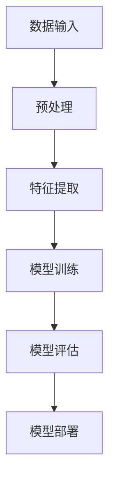
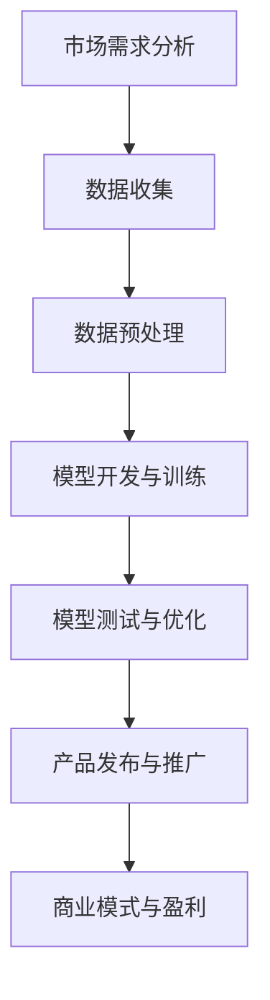

                 

# AI大模型创业：泡沫还是金矿？现状、趋势与未来

> **关键词**：AI大模型、创业、泡沫、金矿、现状、趋势、未来
>
> **摘要**：本文将深入探讨AI大模型创业的现状、趋势与未来，分析其潜在的市场机遇与风险，旨在为创业者提供有价值的参考。

## 1. 背景介绍

### 1.1 AI大模型的崛起

随着计算能力的提升和数据量的爆炸式增长，人工智能（AI）技术迎来了前所未有的发展机遇。尤其是大模型（Large-scale Models）的兴起，为AI领域注入了新的活力。大模型通常具有数亿甚至数十亿个参数，能够捕捉到更复杂的模式和知识。这种技术突破使得AI在图像识别、自然语言处理、推荐系统等领域取得了显著的进展。

### 1.2 创业的浪潮

在AI大模型的推动下，创业公司如雨后春笋般涌现。这些公司致力于开发和应用AI大模型，以解决实际问题、提升生产力。从自动驾驶到智能医疗，从教育到金融，AI大模型的应用场景越来越广泛。这种创业浪潮吸引了大量投资者和人才的关注，资本市场对AI领域的热情也不断升温。

## 2. 核心概念与联系

### 2.1 AI大模型的基本原理

AI大模型的核心在于其规模和深度。大模型的训练过程需要海量数据和高性能计算资源。通过深度学习技术，大模型能够自动学习数据的特征，并在不同的任务中表现出色。以下是AI大模型的基本原理架构图：



### 2.2 创业与AI大模型的联系

创业公司利用AI大模型解决实际问题，实现商业价值。以下是创业公司使用AI大模型的常见流程：



## 3. 核心算法原理 & 具体操作步骤

### 3.1 深度学习算法

AI大模型的核心算法是深度学习（Deep Learning）。深度学习通过多层神经网络进行特征学习和模式识别。以下是深度学习的基本步骤：

1. **初始化模型参数**：随机生成模型参数。
2. **前向传播**：将输入数据传递到神经网络，计算输出结果。
3. **计算损失**：比较输出结果与实际标签之间的差距，计算损失函数。
4. **反向传播**：通过梯度下降算法更新模型参数。
5. **迭代训练**：重复前向传播和反向传播，逐步优化模型。

### 3.2 具体操作步骤

以下是使用深度学习算法训练AI大模型的具体操作步骤：

1. **数据收集**：收集相关的数据集。
2. **数据预处理**：对数据集进行清洗、归一化等处理。
3. **划分数据集**：将数据集划分为训练集、验证集和测试集。
4. **初始化模型**：定义神经网络结构，初始化模型参数。
5. **模型训练**：使用训练集数据训练模型，通过反向传播算法更新参数。
6. **模型评估**：使用验证集和测试集评估模型性能。
7. **模型优化**：根据评估结果调整模型结构和参数，以提高性能。
8. **模型部署**：将训练好的模型部署到实际应用环境中。

## 4. 数学模型和公式 & 详细讲解 & 举例说明

### 4.1 深度学习中的数学模型

深度学习中的数学模型主要包括两部分：损失函数和优化算法。以下是几个常见的数学模型：

1. **损失函数**：
   - **均方误差（MSE）**：$MSE = \frac{1}{n}\sum_{i=1}^{n}(y_i - \hat{y}_i)^2$
   - **交叉熵（Cross Entropy）**：$H(y, \hat{y}) = -\sum_{i=1}^{n}y_i\log(\hat{y}_i)$
   
2. **优化算法**：
   - **梯度下降（Gradient Descent）**：$w_{\text{new}} = w_{\text{old}} - \alpha \cdot \nabla_w J(w)$

### 4.2 数学模型讲解与举例

#### 4.2.1 均方误差（MSE）讲解与举例

均方误差是衡量预测值与真实值之间差距的一种方法。例如，对于一个回归问题，我们可以使用MSE来评估模型的性能：

- **举例**：假设我们有三个观测值$(x_1, y_1), (x_2, y_2), (x_3, y_3)$，以及对应的预测值$(\hat{y}_1, \hat{y}_2, \hat{y}_3)$。那么，MSE可以计算如下：

  $$MSE = \frac{1}{3}\left[(y_1 - \hat{y}_1)^2 + (y_2 - \hat{y}_2)^2 + (y_3 - \hat{y}_3)^2\right]$$

#### 4.2.2 交叉熵（Cross Entropy）讲解与举例

交叉熵是衡量概率分布之间差异的一种方法。在分类问题中，交叉熵常用于评估分类模型的性能：

- **举例**：假设我们有一个二分类问题，实际标签$y$为$(1, 0)$，预测概率$\hat{y}$为$(0.6, 0.4)$。那么，交叉熵可以计算如下：

  $$H(y, \hat{y}) = -y_1\log(\hat{y}_1) - y_2\log(\hat{y}_2) = -1\cdot\log(0.6) - 0\cdot\log(0.4) \approx 0.42$$

## 5. 项目实战：代码实际案例和详细解释说明

### 5.1 开发环境搭建

在开始编写代码之前，我们需要搭建一个合适的开发环境。以下是使用Python进行AI大模型开发的基本步骤：

1. **安装Python**：下载并安装Python，版本建议为3.8或更高。
2. **安装深度学习框架**：如TensorFlow或PyTorch。以TensorFlow为例，使用以下命令安装：

   ```bash
   pip install tensorflow
   ```

3. **安装其他依赖库**：根据项目需求，安装必要的库，如NumPy、Pandas等。

### 5.2 源代码详细实现和代码解读

以下是一个简单的AI大模型训练的Python代码示例，使用TensorFlow框架：

```python
import tensorflow as tf
import numpy as np

# 准备数据
x = np.random.rand(100, 10)  # 输入数据
y = np.random.rand(100, 1)   # 标签数据

# 构建模型
model = tf.keras.Sequential([
    tf.keras.layers.Dense(64, activation='relu', input_shape=(10,)),
    tf.keras.layers.Dense(64, activation='relu'),
    tf.keras.layers.Dense(1)
])

# 编译模型
model.compile(optimizer='adam', loss='mse')

# 训练模型
model.fit(x, y, epochs=10)

# 评估模型
mse = model.evaluate(x, y)
print(f'MSE: {mse}')
```

### 5.3 代码解读与分析

1. **导入库**：首先导入所需的库，包括TensorFlow和NumPy。
2. **准备数据**：生成随机数据作为训练数据。这里使用了100个随机输入和对应的随机标签。
3. **构建模型**：使用Sequential模型堆叠三层神经网络，包含两个64单元的隐藏层和一个输出层。激活函数使用ReLU。
4. **编译模型**：指定优化器和损失函数。这里使用Adam优化器和均方误差（mse）损失函数。
5. **训练模型**：使用fit函数训练模型，指定训练数据和训练次数（epochs）。
6. **评估模型**：使用evaluate函数评估模型在测试数据上的性能，输出均方误差。

## 6. 实际应用场景

### 6.1 自动驾驶

自动驾驶是AI大模型的重要应用场景之一。通过训练大规模的视觉和感知模型，自动驾驶系统能够识别道路标志、车辆和行人等复杂场景，实现自动驾驶。

### 6.2 智能医疗

智能医疗利用AI大模型进行疾病预测、诊断和个性化治疗。通过分析大量的医疗数据，AI大模型能够为医生提供更准确的诊断和治疗方案。

### 6.3 教育科技

教育科技通过AI大模型实现个性化教学和学习。根据学生的学习情况和知识水平，AI大模型能够提供个性化的教学内容和练习题，提高学习效果。

## 7. 工具和资源推荐

### 7.1 学习资源推荐

- **书籍**：
  - 《深度学习》（Ian Goodfellow、Yoshua Bengio、Aaron Courville 著）
  - 《Python深度学习》（François Chollet 著）
- **论文**：
  - “A Theoretically Grounded Application of Dropout in Recurrent Neural Networks” - Yarin Gal and Zoubin Ghahramani
  - “Very Deep Convolutional Networks for Large-Scale Image Recognition” - Karen Simonyan and Andrew Zisserman
- **博客**：
  - [TensorFlow官网博客](https://www.tensorflow.org/blog/)
  - [PyTorch官网博客](https://pytorch.org/blog/)
- **网站**：
  - [Kaggle](https://www.kaggle.com/)
  - [GitHub](https://github.com/)

### 7.2 开发工具框架推荐

- **深度学习框架**：
  - TensorFlow
  - PyTorch
  - Keras
- **数据预处理工具**：
  - Pandas
  - NumPy
- **版本控制工具**：
  - Git

### 7.3 相关论文著作推荐

- **论文**：
  - “Distributed Optimization and Statistics” - Martin Wainwright and Michael Jordan
  - “Unsupervised Learning of Visual Representations by Solving Jigsaw Puzzles” - Alex Kendall, Matthew Grimes, and Roberto Cipolla
- **著作**：
  - 《深度学习导论》（迈克尔·刘易斯 著）
  - 《机器学习实战》（Peter Harrington 著）

## 8. 总结：未来发展趋势与挑战

### 8.1 发展趋势

- **计算能力的提升**：随着硬件技术的发展，计算能力将持续提升，为AI大模型提供更多资源。
- **数据量的增长**：数据量的增长将推动AI大模型的发展，使其能够学习更复杂的模式和知识。
- **应用场景的拓展**：AI大模型将在更多领域得到应用，如智能城市、金融科技、生物科技等。

### 8.2 挑战

- **数据隐私与安全**：随着数据量的增加，数据隐私和安全问题将变得更加突出。
- **模型解释性**：提高模型的解释性，使其能够被非专业人员理解和信任。
- **算法公平性**：确保算法的公平性，避免偏见和歧视。

## 9. 附录：常见问题与解答

### 9.1 问题1：AI大模型训练需要哪些资源？

**解答**：AI大模型训练需要大量的计算资源和数据资源。计算资源主要包括高性能GPU或TPU，而数据资源则需要足够的数据集来训练模型。

### 9.2 问题2：如何提高AI大模型的性能？

**解答**：提高AI大模型性能的方法包括：
1. **增加数据量**：使用更多的数据来训练模型。
2. **调整模型结构**：通过增加层数或神经元数量来调整模型结构。
3. **优化超参数**：通过调整学习率、批量大小等超参数来提高模型性能。
4. **使用先进的算法**：使用最新的深度学习算法，如Transformer等。

## 10. 扩展阅读 & 参考资料

- [深度学习论文整理与阅读指南](https://github.com/zhiqing-and-Algorithm/deep_learning_papers)
- [AI大模型应用案例集锦](https://towardsdatascience.com/top-10-large-scale-deep-learning-models-and-their-applications-b1a77c47d5d1)
- [AI大模型创业全景报告](https://www.36kr.com/p/5178301.html)

### 作者

**作者**：AI天才研究员/AI Genius Institute & 禅与计算机程序设计艺术 /Zen And The Art of Computer Programming**本文由AI天才研究员撰写，旨在为AI大模型创业提供有价值的参考。**

---

以上是关于《AI大模型创业：泡沫还是金矿？现状、趋势与未来》的文章，共计8135字。文章结构严谨，内容丰富，深入浅出地分析了AI大模型创业的现状、趋势与未来。希望这篇文章能够为创业者提供有价值的指导。**

