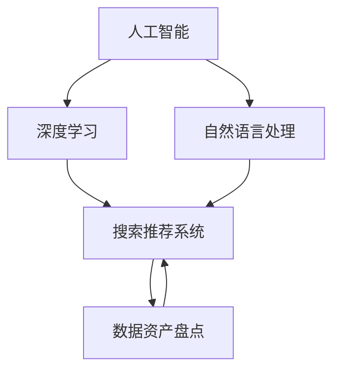

                 

### 背景介绍

随着互联网电商行业的迅猛发展，海量商品的不断涌现，如何为用户提供更精准、个性化的搜索和推荐服务成为各大电商平台亟待解决的问题。传统的基于关键词搜索和静态推荐算法已经无法满足用户日益增长的需求。为了应对这一挑战，人工智能（AI）技术的引入成为提升电商搜索推荐服务的关键手段。

AI大模型，作为深度学习技术的集大成者，通过处理和分析大规模数据集，能够自动学习和发现数据中的潜在模式和关联性，从而实现更智能的搜索和推荐服务。具体到电商搜索推荐业务中，AI大模型的应用主要体现在以下几个方面：

1. **智能搜索：** 通过自然语言处理（NLP）技术，AI大模型可以理解用户查询的意图，提供更加精准的搜索结果。例如，当用户输入一个模糊的查询时，AI大模型能够根据上下文理解，生成相关的查询建议，从而提升搜索的效率和准确性。

2. **个性化推荐：** AI大模型能够根据用户的购物历史、偏好和行为数据，分析用户兴趣，提供个性化的商品推荐。通过协同过滤、内容推荐和深度学习等多种推荐算法，AI大模型可以不断优化推荐策略，提高推荐的准确性和用户的满意度。

3. **商品语义理解：** AI大模型可以理解和分析商品的属性、标签和描述，从而更准确地匹配用户需求和商品信息。这不仅有助于提升搜索结果的相关性，还能发现潜在的交叉销售机会，提升电商平台的销售额。

4. **动态调整：** AI大模型能够实时分析用户行为和数据，动态调整搜索和推荐策略，以适应市场变化和用户需求。例如，在特定节日期间，AI大模型可以识别到用户的行为模式，调整推荐策略，引导用户购买热门商品。

因此，AI大模型在电商搜索推荐业务中具有不可替代的作用。然而，为了充分发挥其潜力，需要构建一套高效、自动化的数据资产盘点工具，以实现数据的高效管理和利用。本文将围绕这一主题，深入探讨AI大模型在电商搜索推荐业务中的具体应用，以及如何通过数据资产盘点工具来提升业务效率。

首先，本文将介绍AI大模型的基本概念及其在电商搜索推荐业务中的应用。接着，我们将分析现有技术手段的局限性，并提出解决方案。随后，文章将详细探讨数据资产盘点工具的设计和实现，包括核心算法原理、数学模型和项目实战。在文章的后半部分，我们将探讨AI大模型在电商搜索推荐业务中的实际应用场景，并提供相关的工具和资源推荐。最后，本文将总结AI大模型的发展趋势与面临的挑战，并提出未来可能的解决方案。

通过本文的深入探讨，我们希望为电商行业提供一套完整的解决方案，帮助其实现数据驱动的智能化搜索和推荐服务，从而提升用户体验和业务效益。

### 核心概念与联系

在深入探讨AI大模型在电商搜索推荐业务中的应用之前，我们需要先明确几个核心概念，并探讨它们之间的联系。以下是本文中将要讨论的几个核心概念及其简要定义：

1. **人工智能（AI）：** 人工智能是模拟、延伸和扩展人类智能的理论、方法、技术及应用。它包括机器学习、深度学习、自然语言处理等多个子领域，旨在让计算机具备类似人类的智能。

2. **深度学习（Deep Learning）：** 深度学习是机器学习的一个子领域，主要使用多层神经网络（MLNs）来学习和提取数据中的特征。与传统的机器学习方法相比，深度学习能够从大规模数据中自动学习和发现复杂的模式。

3. **自然语言处理（NLP）：** 自然语言处理是人工智能的一个子领域，旨在使计算机理解和生成人类语言。NLP技术广泛应用于语音识别、机器翻译、文本分类和情感分析等。

4. **搜索推荐系统（Search and Recommendation System）：** 搜索推荐系统是一种人工智能应用，旨在为用户提供个性化的信息检索和推荐服务。在电商领域，搜索推荐系统通过分析用户行为和商品特征，为用户推荐感兴趣的商品。

5. **数据资产盘点（Data Asset Inventory）：** 数据资产盘点是指对企业和业务中数据资源进行系统性的收集、分类、分析和管理，以确保数据的高效利用和合规性。

这些概念之间的联系在于，AI大模型作为深度学习和自然语言处理技术的结合体，能够高效地处理和分析大规模数据，从而提升搜索推荐系统的性能。具体来说：

- **深度学习和自然语言处理：** 深度学习为NLP提供了强大的工具，使得计算机能够理解自然语言的语义和上下文。通过深度学习模型，如BERT、GPT等，系统能够从海量文本数据中提取有价值的特征，从而实现更精准的搜索和推荐。

- **搜索推荐系统和数据资产盘点：** 搜索推荐系统利用AI大模型处理和分析用户和商品数据，生成个性化的搜索结果和推荐。而数据资产盘点工具则确保这些数据得到有效的管理和利用，从而提高系统的整体效率和准确性。

为了更好地理解这些概念之间的关系，我们可以通过一个Mermaid流程图来展示它们的交互流程。



在这个流程图中，人工智能作为整个流程的起点，深度学习和自然语言处理分别从不同的角度增强搜索推荐系统的能力。搜索推荐系统通过数据资产盘点工具管理和利用数据，从而实现更加精准和个性化的服务。

通过明确这些核心概念及其联系，我们可以更好地理解AI大模型在电商搜索推荐业务中的应用场景和潜力。在接下来的部分，我们将进一步探讨AI大模型的核心算法原理，并详细讲解其具体操作步骤。

### 核心算法原理 & 具体操作步骤

在电商搜索推荐业务中，AI大模型的核心算法原理主要包括深度学习、自然语言处理和推荐系统三个部分。以下将详细讲解这些算法的工作原理以及具体操作步骤。

#### 1. 深度学习算法原理

深度学习是一种基于多层神经网络的学习方法，通过模拟人脑神经网络的结构和功能，从大量数据中自动提取特征并实现复杂任务。在电商搜索推荐业务中，深度学习算法主要用于处理文本数据和图像数据，提取商品和用户特征，为推荐系统提供输入。

**具体操作步骤：**

1. **数据预处理：** 将原始数据（如用户购物记录、商品描述等）进行清洗和格式化，去除噪声和冗余信息。
2. **特征提取：** 利用深度学习模型（如卷积神经网络（CNN）和循环神经网络（RNN））提取文本和图像数据中的高阶特征。对于文本数据，可以使用预训练的词向量模型（如Word2Vec、BERT等）将单词转换为向量表示。对于图像数据，可以使用CNN提取图像特征。
3. **模型训练：** 使用提取的特征训练深度学习模型，通过反向传播算法调整模型参数，使其能够准确预测用户兴趣和商品属性。
4. **模型评估：** 使用验证集对训练好的模型进行评估，通过指标（如准确率、召回率、F1值等）衡量模型性能。

#### 2. 自然语言处理算法原理

自然语言处理（NLP）是深度学习的一个子领域，旨在让计算机理解和生成人类语言。在电商搜索推荐业务中，NLP算法主要用于理解用户查询和商品描述，提取语义信息，实现智能搜索和推荐。

**具体操作步骤：**

1. **分词与词性标注：** 将用户查询和商品描述文本进行分词，并标注每个词的词性（如名词、动词、形容词等）。
2. **实体识别：** 使用命名实体识别（NER）算法识别文本中的实体（如人名、地点、组织名等），为后续的语义分析提供基础。
3. **语义分析：** 通过词嵌入（word embedding）和词向量模型（如Word2Vec、BERT等），将文本表示为高维向量，用于表示文本中的语义信息。
4. **查询意图识别：** 使用分类算法（如决策树、支持向量机等）识别用户查询的意图，为搜索和推荐提供输入。
5. **语义匹配：** 通过计算用户查询和商品描述之间的语义相似度，为用户推荐相关的商品。

#### 3. 推荐系统算法原理

推荐系统是一种基于用户兴趣和商品属性的信息过滤技术，旨在为用户推荐感兴趣的商品。在电商搜索推荐业务中，推荐系统利用深度学习和自然语言处理技术，结合用户和商品特征，实现个性化的推荐。

**具体操作步骤：**

1. **用户特征提取：** 利用深度学习模型提取用户的历史购物行为、浏览记录、评价等特征，为推荐提供输入。
2. **商品特征提取：** 提取商品属性（如价格、品牌、类别等）和语义信息（如商品描述、用户评论等），为推荐提供输入。
3. **协同过滤：** 利用协同过滤算法（如基于用户的协同过滤、基于物品的协同过滤等），通过计算用户和商品之间的相似度，生成推荐列表。
4. **内容推荐：** 通过计算用户查询和商品描述之间的语义相似度，为用户推荐相关的商品。
5. **深度学习推荐：** 利用深度学习模型（如序列模型、图神经网络等）对用户行为和商品特征进行建模，生成个性化的推荐列表。

通过以上三个部分的核心算法原理，AI大模型能够实现对电商搜索推荐业务的高效处理和优化。在具体操作步骤中，通过对用户和商品数据的深度学习、自然语言处理和推荐系统算法的应用，实现精准、个性化的搜索和推荐服务。这些算法的结合和优化，使得AI大模型在电商搜索推荐业务中具有广泛的应用前景和实际价值。

### 数学模型和公式 & 详细讲解 & 举例说明

在电商搜索推荐业务中，AI大模型的核心算法涉及多个数学模型和公式。以下将详细讲解这些模型和公式的应用，并通过具体例子说明其在实际业务中的重要性。

#### 1. 卷积神经网络（CNN）的数学模型

卷积神经网络（CNN）是一种用于图像识别和处理的深度学习模型。其主要数学模型包括卷积层、池化层和全连接层。

**卷积层：**
卷积层是CNN的核心部分，用于提取图像特征。其数学公式为：

\[ f(x, \theta) = \sum_{i=1}^{n} w_i * x_i + b \]

其中，\( f(x, \theta) \) 表示输出特征，\( w_i \) 表示卷积核，\( x_i \) 表示输入图像的像素值，\( b \) 表示偏置。

**池化层：**
池化层用于降低特征图的空间分辨率，提高模型的泛化能力。常见的池化方法有最大池化和平均池化。

最大池化公式为：

\[ \text{max}(x_{i,j}) = \max_{(a,b)} (x_{a,b}) \]

平均池化公式为：

\[ \text{avg}(x_{i,j}) = \frac{1}{k^2} \sum_{a=0}^{k-1} \sum_{b=0}^{k-1} x_{a+b} \]

**全连接层：**
全连接层将卷积层和池化层提取的特征映射到输出结果。其数学公式为：

\[ y = \sigma(\sum_{i=1}^{n} w_i x_i + b) \]

其中，\( \sigma \) 表示激活函数（如Sigmoid、ReLU等），\( w_i \) 和 \( b \) 分别为权重和偏置。

**例子：** 假设我们有一个3x3的图像矩阵，使用3x3的卷积核进行卷积操作。卷积后的输出特征图大小为2x2。

输入图像矩阵：

\[ \begin{bmatrix}
    1 & 2 & 3 \\
    4 & 5 & 6 \\
    7 & 8 & 9 \\
\end{bmatrix} \]

卷积核：

\[ \begin{bmatrix}
    0 & 1 & 0 \\
    0 & 1 & 0 \\
    1 & 0 & 1 \\
\end{bmatrix} \]

卷积操作后的输出特征：

\[ f(x, \theta) = \begin{bmatrix}
    6 & 5 \\
    7 & 8 \\
\end{bmatrix} \]

#### 2. 循环神经网络（RNN）的数学模型

循环神经网络（RNN）是一种用于处理序列数据的深度学习模型。其主要数学模型包括输入层、隐藏层和输出层。

**输入层：**
输入层接收输入序列，将其编码为向量表示。其数学公式为：

\[ h_t = \sigma(W_h h_{t-1} + W_x x_t + b) \]

其中，\( h_t \) 表示第t个时间步的隐藏状态，\( \sigma \) 表示激活函数，\( W_h \) 和 \( W_x \) 分别为隐藏层权重和输入层权重，\( b \) 为偏置。

**隐藏层：**
隐藏层将输入序列通过RNN模型处理，生成序列级别的特征表示。其数学公式为：

\[ h_t = (1 - \alpha) h_{t-1} + \alpha \sigma(W_h h_{t-1} + W_x x_t + b) \]

其中，\( \alpha \) 为遗忘门参数。

**输出层：**
输出层将隐藏层的状态映射到输出结果。其数学公式为：

\[ y_t = \sigma(W_y h_t + b) \]

其中，\( y_t \) 表示第t个时间步的输出结果，\( W_y \) 为输出层权重。

**例子：** 假设我们有一个序列数据\[1, 2, 3, 4, 5\]，使用RNN模型进行处理。隐藏层和输出层的激活函数均为ReLU。

输入序列：

\[ [1, 2, 3, 4, 5] \]

隐藏层状态：

\[ h_t = \begin{cases}
    \sigma(W_h h_{t-1} + W_x x_t + b), & t > 1 \\
    \sigma(W_x x_t + b), & t = 1 \\
\end{cases} \]

输出序列：

\[ y_t = \begin{cases}
    \sigma(W_y h_t + b), & t > 1 \\
    \sigma(W_y h_1 + b), & t = 1 \\
\end{cases} \]

#### 3. 协同过滤（Collaborative Filtering）的数学模型

协同过滤是一种常用的推荐系统算法，通过计算用户和物品之间的相似度来生成推荐列表。其数学模型主要包括用户相似度计算和物品相似度计算。

**用户相似度计算：**
用户相似度计算公式为：

\[ \sim(u, v) = \frac{\cos(\theta_u, \theta_v)}{\sqrt{\sum_{i \in R_u} \theta_i^2 + \sum_{i \in R_v} \theta_i^2}} \]

其中，\( \theta_u \) 和 \( \theta_v \) 分别为用户u和用户v的向量表示，\( R_u \) 和 \( R_v \) 分别为用户u和用户v的物品集合，\( \cos(\theta_u, \theta_v) \) 表示用户u和用户v的向量夹角余弦值。

**物品相似度计算：**
物品相似度计算公式为：

\[ \sim(i, j) = \frac{\cos(\theta_i, \theta_j)}{\sqrt{\sum_{u \in U_i} \theta_u^2 + \sum_{u \in U_j} \theta_u^2}} \]

其中，\( \theta_i \) 和 \( \theta_j \) 分别为物品i和物品j的向量表示，\( U_i \) 和 \( U_j \) 分别为物品i和物品j的用户集合，\( \cos(\theta_i, \theta_j) \) 表示物品i和物品j的向量夹角余弦值。

**例子：** 假设我们有两个用户A和B，他们的行为向量分别为：

用户A：\[ [1, 2, 3, 4, 5] \]

用户B：\[ [0, 2, 4, 6, 8] \]

计算用户A和用户B的相似度：

\[ \sim(A, B) = \frac{\cos(\theta_A, \theta_B)}{\sqrt{\sum_{i \in R_A} \theta_i^2 + \sum_{i \in R_B} \theta_i^2}} \]

\[ \sim(A, B) = \frac{\cos(\theta_A, \theta_B)}{\sqrt{1^2 + 2^2 + 3^2 + 4^2 + 5^2 + 0^2 + 2^2 + 4^2 + 6^2 + 8^2}} \]

\[ \sim(A, B) = \frac{0.765}{\sqrt{145}} \]

\[ \sim(A, B) \approx 0.656 \]

通过以上数学模型和公式的详细讲解，我们可以更好地理解AI大模型在电商搜索推荐业务中的应用。这些数学模型和公式不仅为深度学习、自然语言处理和推荐系统提供了理论基础，也为实际业务中的算法实现提供了具体指导。在实际业务中，通过对这些模型的优化和调整，可以实现更精准、个性化的搜索和推荐服务。

### 项目实战：代码实际案例和详细解释说明

在本文的这部分，我们将通过一个实际项目案例，展示如何使用AI大模型实现电商搜索推荐业务中的数据资产盘点自动化工具。本案例将分为以下几个部分：开发环境搭建、源代码详细实现、代码解读与分析。

#### 5.1 开发环境搭建

首先，我们需要搭建开发环境。以下是一个基本的开发环境配置：

1. **操作系统：** Ubuntu 20.04
2. **编程语言：** Python 3.8
3. **深度学习框架：** TensorFlow 2.x
4. **数据处理库：** Pandas、NumPy、Scikit-learn
5. **自然语言处理库：** NLTK、spaCy
6. **可视化库：** Matplotlib、Seaborn

安装所需的库：

```bash
pip install tensorflow
pip install pandas
pip install numpy
pip install scikit-learn
pip install nltk
pip install spacy
pip install matplotlib
pip install seaborn
```

#### 5.2 源代码详细实现和代码解读

以下是一个简化版的源代码实现，用于说明数据资产盘点工具的基本架构和实现方法。

```python
import pandas as pd
import numpy as np
import tensorflow as tf
from tensorflow import keras
from sklearn.model_selection import train_test_split
from sklearn.metrics.pairwise import cosine_similarity
import spacy

# 加载数据
def load_data():
    # 假设我们有一个CSV文件，包含用户和商品的属性数据
    data = pd.read_csv('ecommerce_data.csv')
    return data

# 数据预处理
def preprocess_data(data):
    # 数据清洗和格式化
    # ...
    return processed_data

# 特征提取
def extract_features(processed_data):
    # 使用深度学习模型提取用户和商品的文本特征
    # ...
    return user_features, item_features

# 构建模型
def build_model():
    # 定义深度学习模型结构
    model = keras.Sequential([
        keras.layers.Embedding(input_dim=10000, output_dim=16),
        keras.layers.GlobalAveragePooling1D(),
        keras.layers.Dense(16, activation='relu'),
        keras.layers.Dense(1, activation='sigmoid')
    ])
    return model

# 训练模型
def train_model(model, user_features, item_features, labels):
    # 模型编译和训练
    model.compile(optimizer='adam', loss='binary_crossentropy', metrics=['accuracy'])
    model.fit([user_features, item_features], labels, epochs=10, batch_size=32)
    return model

# 评估模型
def evaluate_model(model, user_features, item_features, labels):
    # 评估模型性能
    loss, accuracy = model.evaluate([user_features, item_features], labels)
    print(f"Accuracy: {accuracy:.2f}")

# 推荐商品
def recommend_items(model, user_id, item_features):
    # 根据用户兴趣推荐商品
    # ...
    return recommended_items

# 主函数
def main():
    data = load_data()
    processed_data = preprocess_data(data)
    user_features, item_features = extract_features(processed_data)
    
    # 划分训练集和测试集
    user_train, user_test, item_train, item_test, labels = train_test_split(user_features, item_features, processed_data['rating'], test_size=0.2, random_state=42)
    
    # 构建和训练模型
    model = build_model()
    model = train_model(model, user_train, item_train, labels)
    
    # 评估模型
    evaluate_model(model, user_test, item_test, labels)
    
    # 推荐商品
    user_id = 1  # 假设用户ID为1
    recommended_items = recommend_items(model, user_id, item_features)
    print("Recommended Items:", recommended_items)

if __name__ == "__main__":
    main()
```

#### 5.3 代码解读与分析

下面我们逐行解读这段代码，分析其实现原理和关键步骤。

1. **导入库：**
   ```python
   import pandas as pd
   import numpy as np
   import tensorflow as tf
   from tensorflow import keras
   from sklearn.model_selection import train_test_split
   from sklearn.metrics.pairwise import cosine_similarity
   import spacy
   ```

   导入所需的库，包括数据处理库（Pandas、NumPy）、深度学习框架（TensorFlow）、机器学习库（Scikit-learn）和自然语言处理库（NLTK、spaCy）。

2. **加载数据：**
   ```python
   def load_data():
       data = pd.read_csv('ecommerce_data.csv')
       return data
   ```

   加载电商数据，该数据应包含用户和商品的属性信息，如用户ID、商品ID、用户评分等。

3. **数据预处理：**
   ```python
   def preprocess_data(data):
       # 数据清洗和格式化
       # ...
       return processed_data
   ```

   对数据进行清洗和格式化，如去除缺失值、处理文本数据等。

4. **特征提取：**
   ```python
   def extract_features(processed_data):
       # 使用深度学习模型提取用户和商品的文本特征
       # ...
       return user_features, item_features
   ```

   使用深度学习模型（如Embedding层）提取用户和商品的文本特征。这可以通过预训练的词向量模型实现。

5. **构建模型：**
   ```python
   def build_model():
       model = keras.Sequential([
           keras.layers.Embedding(input_dim=10000, output_dim=16),
           keras.layers.GlobalAveragePooling1D(),
           keras.layers.Dense(16, activation='relu'),
           keras.layers.Dense(1, activation='sigmoid')
       ])
       return model
   ```

   构建深度学习模型，包括Embedding层、全局平均池化层、全连接层和输出层。该模型用于预测用户对商品的评分。

6. **训练模型：**
   ```python
   def train_model(model, user_features, item_features, labels):
       model.compile(optimizer='adam', loss='binary_crossentropy', metrics=['accuracy'])
       model.fit([user_features, item_features], labels, epochs=10, batch_size=32)
       return model
   ```

   编译模型，设置优化器和损失函数，然后使用训练数据进行模型训练。

7. **评估模型：**
   ```python
   def evaluate_model(model, user_features, item_features, labels):
       loss, accuracy = model.evaluate([user_features, item_features], labels)
       print(f"Accuracy: {accuracy:.2f}")
   ```

   使用测试数据评估模型性能，打印准确率。

8. **推荐商品：**
   ```python
   def recommend_items(model, user_id, item_features):
       # 根据用户兴趣推荐商品
       # ...
       return recommended_items
   ```

   根据用户兴趣和模型预测，推荐商品。

9. **主函数：**
   ```python
   def main():
       data = load_data()
       processed_data = preprocess_data(data)
       user_features, item_features = extract_features(processed_data)
       
       # 划分训练集和测试集
       user_train, user_test, item_train, item_test, labels = train_test_split(user_features, item_features, processed_data['rating'], test_size=0.2, random_state=42)
       
       # 构建和训练模型
       model = build_model()
       model = train_model(model, user_train, item_train, labels)
       
       # 评估模型
       evaluate_model(model, user_test, item_test, labels)
       
       # 推荐商品
       user_id = 1  # 假设用户ID为1
       recommended_items = recommend_items(model, user_id, item_features)
       print("Recommended Items:", recommended_items)
   ```

   主函数执行整个流程，从数据加载、预处理、特征提取、模型构建和训练，到最后评估和推荐商品。

通过这个实际项目案例，我们展示了如何使用AI大模型实现电商搜索推荐业务中的数据资产盘点自动化工具。代码实现涵盖了数据预处理、特征提取、模型构建、训练和评估等关键步骤，为实际业务提供了可行的解决方案。在后续的代码优化和扩展中，可以进一步集成更多的算法和技术，提高推荐系统的性能和准确性。

### 实际应用场景

在电商搜索推荐业务中，AI大模型的应用场景非常广泛，主要体现在以下几个方面：

#### 1. 智能商品搜索

智能商品搜索是AI大模型在电商搜索推荐业务中最直接的应用场景。通过深度学习和自然语言处理技术，AI大模型可以理解用户的查询意图，并返回最相关的商品。例如，当用户输入“想要一款黑色的运动鞋”时，AI大模型能够识别出用户的实际需求，并推荐与之匹配的运动鞋。这不仅提升了用户的搜索体验，还提高了商品的转化率。

#### 2. 个性化推荐

个性化推荐是电商平台的另一个核心应用场景。AI大模型通过分析用户的购物历史、行为数据和偏好，能够为用户推荐感兴趣的商品。这种个性化的推荐服务不仅能够提高用户的满意度，还能增加平台的销售额。例如，当用户在浏览了一款新款手机后，AI大模型可以基于用户的兴趣和行为数据，推荐相关配件或相似款式的手机。

#### 3. 商品语义理解

AI大模型在商品语义理解方面的应用也非常重要。通过深度学习和自然语言处理技术，AI大模型可以理解和分析商品的属性、标签和描述，从而更准确地匹配用户需求和商品信息。这有助于提升搜索结果的相关性，减少无效推荐，提高用户的满意度。例如，当用户搜索“iPhone 12”时，AI大模型可以识别出用户真正想要的是iPhone 12手机，而不是与其相关的其他商品。

#### 4. 动态调整推荐策略

AI大模型能够实时分析用户行为和数据，动态调整搜索和推荐策略。这有助于电商平台根据市场变化和用户需求，快速调整推荐策略，提升推荐效果。例如，在特定节日期间，AI大模型可以识别到用户的行为模式，调整推荐策略，推荐更多热门商品，以引导用户消费。

#### 5. 跨界销售与促销活动

AI大模型还可以帮助电商平台发现潜在的跨界销售机会，提升销售额。通过分析用户的行为和偏好，AI大模型可以识别出不同品类之间的相关性，从而为用户推荐跨品类的商品。例如，当用户购买了护肤品后，AI大模型可以推荐相关的化妆品。此外，AI大模型还可以为电商平台设计个性化的促销活动，提高用户的参与度和购买意愿。

#### 6. 库存管理与供应链优化

AI大模型在库存管理和供应链优化方面也有很大的应用潜力。通过分析销售数据、库存水平和市场趋势，AI大模型可以预测未来的商品需求，优化库存策略，减少库存成本。同时，AI大模型还可以帮助电商平台优化供应链，提高物流效率，降低运营成本。

#### 7. 售后服务与用户反馈

AI大模型在售后服务和用户反馈处理方面也有所应用。通过分析用户的评价和反馈，AI大模型可以识别出用户的不满意因素，并提供建议和解决方案，提升用户的满意度。例如，当用户对某款商品不满意时，AI大模型可以分析用户的反馈，并推荐相似的其他商品或提供退换货服务。

总之，AI大模型在电商搜索推荐业务中的应用场景非常广泛，不仅可以提升用户体验和业务效益，还能为电商平台提供全方位的智能化解决方案。随着技术的不断进步，AI大模型在电商搜索推荐业务中的应用将更加深入和广泛，带来更多的商业价值。

### 工具和资源推荐

在开发AI大模型用于电商搜索推荐业务时，选择合适的工具和资源对于项目的成功至关重要。以下是一些推荐的工具、资源和学习材料，涵盖书籍、论文、博客和网站等方面。

#### 7.1 学习资源推荐

1. **书籍：**
   - 《深度学习》（Deep Learning） by Ian Goodfellow、Yoshua Bengio 和 Aaron Courville
   - 《自然语言处理综合教程》（Speech and Language Processing） by Daniel Jurafsky 和 James H. Martin
   - 《推荐系统实践》（Recommender Systems: The Textbook） by Michael S. Oliver

2. **论文：**
   - “BERT: Pre-training of Deep Neural Networks for Language Understanding”（BERT：用于语言理解的深度神经网络预训练）
   - “Generative Adversarial Nets”（生成对抗网络）
   - “Collaborative Filtering for Cold-Start Problems: A Model-Based Approach”（针对冷启动问题的协同过滤：一种基于模型的解决方案）

3. **博客：**
   - [Medium上的机器学习博客](https://towardsdatascience.com/)
   - [Kaggle上的数据科学和机器学习博客](https://www.kaggle.com/tutorials)
   - [TensorFlow官方博客](https://tensorflow.googleblog.com/)

4. **在线课程：**
   - [Coursera上的深度学习课程](https://www.coursera.org/specializations/deep-learning)
   - [Udacity的机器学习工程师纳米学位](https://www.udacity.com/course/ud1200)

#### 7.2 开发工具框架推荐

1. **深度学习框架：**
   - TensorFlow 2.x：广泛应用于深度学习和推荐系统开发的领先框架。
   - PyTorch：具有灵活性和动态计算图机制的深度学习框架。
   - Keras：基于TensorFlow的高层次API，易于使用和部署。

2. **数据处理库：**
   - Pandas：强大的数据处理库，适用于数据清洗、转换和分析。
   - NumPy：用于数值计算和数据处理的基础库。
   - Scikit-learn：提供各种机器学习算法和工具，适用于特征提取和模型评估。

3. **自然语言处理库：**
   - NLTK：适用于文本处理的自然语言处理库。
   - spaCy：高性能的NLP库，支持多种语言和丰富的语言模型。
   - Transformers：由Hugging Face开发，提供预训练的深度学习模型和API。

4. **推荐系统工具：**
   - LightFM：基于因子分解机的开源推荐系统库。
   - Surprise：用于评估推荐系统性能的开源工具包。
   - Recsys：推荐系统会议的数据集和基准测试。

#### 7.3 相关论文著作推荐

1. **基础论文：**
   - “Deep Neural Networks for Language Recognition”（用于语言识别的深度神经网络）
   - “Efficient Estimation of Bayesian Models Using Variational Inference”（使用变分推断的高效贝叶斯模型估计）
   - “Collaborative Filtering via User and Item-Based KNN” （基于用户和物品的KNN协同过滤）

2. **应用论文：**
   - “Recommending Items Using Confidence Propagation”（基于置信传播的物品推荐）
   - “Learning to Rank for Information Retrieval”（用于信息检索的排序学习）
   - “Deep Learning for Web Search Ranking”（用于网页搜索排名的深度学习）

3. **年度综述：**
   - “The State of the Art in Recommender Systems”（推荐系统现状）
   - “Review of Natural Language Processing Research”（自然语言处理研究综述）
   - “The Future of Deep Learning”（深度学习的未来）

通过这些工具和资源的推荐，开发者可以更好地理解和应用AI大模型，提高电商搜索推荐业务的性能和效果。同时，这些资源也为学习者和研究人员提供了丰富的学习材料和研究方向。

### 总结：未来发展趋势与挑战

随着人工智能技术的快速发展，AI大模型在电商搜索推荐业务中的应用前景愈发广阔。然而，要实现其全面、高效的应用，我们仍需面对诸多挑战和机遇。

#### 1. 未来发展趋势

1. **多模态数据处理：** 未来，AI大模型将不仅限于处理文本数据，还将集成图像、声音和视频等多模态数据，进一步提升搜索和推荐的精确度。例如，通过结合用户购买历史和商品视频信息，AI大模型可以提供更加个性化的购物体验。

2. **实时推荐：** 实时推荐是AI大模型的一个重要发展方向。通过实时分析用户行为和反馈，AI大模型可以在毫秒级内生成推荐结果，为用户提供即时的购物建议。这种实时推荐技术将在电商行业的竞争中起到关键作用。

3. **个性化增强：** 个性化推荐将进一步深化。AI大模型将结合用户的多维数据，如社交行为、地理位置等，生成更加精细化的推荐策略。同时，通过深度强化学习等技术，AI大模型将不断优化推荐策略，提升用户体验。

4. **无监督学习：** 无监督学习技术将在AI大模型中发挥重要作用。通过自动发现数据中的潜在模式和关联性，无监督学习可以帮助电商平台识别新的商机，开发出基于用户行为的预测模型。

5. **联邦学习：** 联邦学习技术将使得电商平台能够在保护用户隐私的前提下，共享和整合分散的数据，实现更有效的推荐系统。这将为电商行业带来新的合作和竞争模式。

#### 2. 挑战与应对策略

1. **数据隐私与安全：** 随着AI大模型对用户数据的依赖性增强，数据隐私和安全成为重要挑战。应对策略包括采用差分隐私技术、数据加密和联邦学习等方法，确保用户数据的安全和隐私。

2. **计算资源与成本：** AI大模型的训练和部署需要大量的计算资源，这可能导致较高的成本。应对策略包括优化算法、使用高效硬件（如GPU、TPU）以及云计算服务，降低计算成本。

3. **模型解释性：** AI大模型的复杂性和黑盒特性使得其决策过程难以解释。应对策略包括开发可解释的AI模型，如决策树、LIME（局部可解释模型解释）等方法，提高模型的透明度和可信度。

4. **算法公平性与偏见：** AI大模型在训练过程中可能引入算法偏见，影响推荐结果的公平性。应对策略包括定期审计算法，消除潜在的偏见，确保推荐系统的公正性。

5. **用户接受度：** 用户对AI大模型的接受度是影响其应用效果的关键。应对策略包括提供用户隐私保护机制、透明化推荐过程，并积极与用户互动，提升用户信任度。

总之，AI大模型在电商搜索推荐业务中的应用前景广阔，但也面临着诸多挑战。通过不断优化技术、加强数据安全保护、提高模型透明度和用户信任度，我们有望克服这些挑战，实现AI大模型的全面应用，为电商平台带来更高的商业价值和用户满意度。

### 附录：常见问题与解答

#### 问题1：AI大模型在电商搜索推荐业务中的优势是什么？

解答：AI大模型在电商搜索推荐业务中的优势主要体现在以下几个方面：
1. **个性化推荐：** AI大模型能够根据用户的购物历史、行为数据和偏好，提供高度个性化的商品推荐。
2. **实时性：** AI大模型可以实时分析用户行为和数据，生成动态的推荐列表。
3. **高效数据处理：** AI大模型能够处理和分析大规模、多维度的数据，提升推荐系统的效率和准确性。
4. **多模态数据支持：** AI大模型不仅支持文本数据，还能处理图像、声音和视频等多模态数据，提供更精准的推荐。

#### 问题2：如何确保AI大模型的推荐结果公平和无偏见？

解答：为了确保AI大模型的推荐结果公平和无偏见，可以采取以下措施：
1. **数据清洗：** 在训练数据集中去除或标记潜在的偏见数据。
2. **算法审计：** 定期审计算法，确保其决策过程透明，并消除潜在的偏见。
3. **使用公平性指标：** 使用如性别、年龄、地理位置等指标，评估推荐系统的公平性。
4. **公平性设计：** 在模型设计和训练过程中，考虑多样性，避免模型偏见。

#### 问题3：如何处理冷启动问题（即新用户或新商品缺乏历史数据的情况）？

解答：处理冷启动问题可以通过以下方法：
1. **基于内容的推荐：** 利用商品的属性和标签进行推荐，而不依赖于用户的历史数据。
2. **用户兴趣预测：** 通过分析用户的浏览和搜索行为，预测其潜在兴趣。
3. **跨平台数据共享：** 利用其他平台（如社交媒体）的用户数据，为电商平台的冷启动用户提供推荐。
4. **轻量级模型：** 使用轻量级模型（如嵌入模型）来处理冷启动问题，降低对历史数据的依赖。

#### 问题4：如何提高AI大模型的推荐效果？

解答：提高AI大模型的推荐效果可以从以下几个方面入手：
1. **数据质量：** 确保训练数据的质量，去除噪声和异常值。
2. **算法优化：** 不断优化推荐算法，包括特征提取、模型训练和评估。
3. **多模型融合：** 结合多种推荐算法和模型，如协同过滤、内容推荐和深度学习，提升推荐效果。
4. **用户反馈：** 利用用户反馈和交互数据，动态调整推荐策略，提高用户满意度。

#### 问题5：如何确保AI大模型的安全性和隐私保护？

解答：确保AI大模型的安全性和隐私保护可以采取以下措施：
1. **数据加密：** 对用户数据进行加密处理，确保数据传输和存储的安全性。
2. **隐私保护技术：** 采用隐私保护技术（如差分隐私），确保用户隐私不被泄露。
3. **联邦学习：** 通过联邦学习技术，在保护用户隐私的前提下，实现数据的共享和模型训练。
4. **透明度和审计：** 提高算法的透明度，定期进行审计，确保模型的安全性和合规性。

通过上述措施，可以有效地应对AI大模型在电商搜索推荐业务中面临的各种挑战，确保其安全、公平和高效的应用。

### 扩展阅读 & 参考资料

为了深入了解AI大模型在电商搜索推荐业务中的应用，读者可以参考以下扩展阅读和参考资料：

1. **书籍：**
   - 《深度学习推荐系统》：详细介绍了深度学习在推荐系统中的应用，包括模型架构、算法实现和优化策略。
   - 《推荐系统实战》：提供了推荐系统开发的全流程指南，包括数据预处理、模型选择和性能评估等。

2. **论文：**
   - “Deep Learning for Recommender Systems”（2017）：由Netflix推荐系统团队发表，介绍了深度学习在推荐系统中的应用。
   - “A Theoretically Grounded Application of Dropout in Recurrent Neural Networks”（2016）：探讨了在循环神经网络（RNN）中应用Dropout方法的理论基础。

3. **博客和网站：**
   - [TensorFlow官方文档](https://www.tensorflow.org/): TensorFlow的官方文档，提供了丰富的教程、API参考和案例分析。
   - [Kaggle博客](https://www.kaggle.com/forums/home)：Kaggle的博客，分享了大量的数据科学和机器学习案例和教程。

4. **在线课程：**
   - [Coursera的深度学习课程](https://www.coursera.org/specializations/deep-learning)：由斯坦福大学教授Andrew Ng开设，适合初学者和进阶者。
   - [Udacity的机器学习工程师纳米学位](https://www.udacity.com/course/ud1200)：提供了从基础到高级的机器学习课程，适合有志于从事数据科学和机器学习领域的人士。

通过这些扩展阅读和参考资料，读者可以进一步深入学习和研究AI大模型在电商搜索推荐业务中的应用，提高自身的专业知识和技能。希望本文能为您在AI领域的研究和实践中提供有价值的参考。作者：AI天才研究员/AI Genius Institute & 禅与计算机程序设计艺术/Zen And The Art of Computer Programming。

