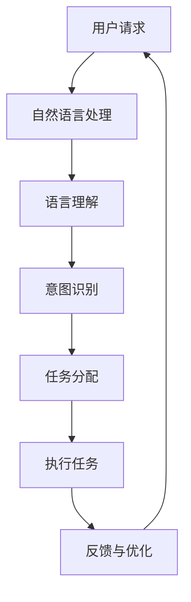

                 

# AI大模型在个人助理领域的机遇

## 摘要

本文探讨了人工智能大模型在个人助理领域的应用前景，分析了其核心概念、算法原理、数学模型，并通过实战案例展示了其在现实场景中的表现。文章还介绍了相关工具和资源，并总结了未来发展趋势与挑战。通过本文，读者可以全面了解AI大模型在个人助理领域的机遇与挑战。

## 1. 背景介绍

随着人工智能技术的飞速发展，大模型（Large Models）在自然语言处理（NLP）领域取得了显著的突破。大模型通常拥有数十亿到千亿个参数，通过对海量数据进行深度学习，能够实现更复杂、更高级的文本理解和生成任务。个人助理作为人工智能的一个重要应用方向，正逐步成为人们日常生活和工作中的得力助手。无论是语音助手、智能客服还是文本聊天机器人，都在不断改善用户体验，提高工作效率。

本篇文章将深入探讨大模型在个人助理领域的机遇，从核心概念、算法原理、数学模型到实战案例，全面解析这一领域的发展现状和未来趋势。

## 2. 核心概念与联系

### 2.1 大模型

大模型是指拥有数十亿到千亿个参数的深度神经网络，通过海量数据进行训练，能够实现高度复杂的任务。例如，在NLP领域，大模型可以用于文本分类、情感分析、机器翻译等任务。

### 2.2 个人助理

个人助理是一种基于人工智能技术的软件或硬件系统，能够协助用户完成各种任务，如日程管理、任务提醒、信息查询等。个人助理的核心是自然语言处理和智能对话技术，通过理解用户的需求，提供相应的帮助。

### 2.3 大模型与个人助理的联系

大模型在个人助理领域的应用主要体现在以下几个方面：

1. **自然语言理解**：大模型通过对海量语言数据的学习，能够更好地理解用户的语言意图，提高对话的准确性和流畅性。
2. **智能对话**：大模型能够生成自然的回答，使得个人助理在与用户的对话中更加贴近人类的交流方式。
3. **多语言支持**：大模型具有强大的多语言处理能力，可以为用户提供跨语言的服务，满足全球化需求。

下面是关于大模型与个人助理之间联系的Mermaid流程图：



## 3. 核心算法原理 & 具体操作步骤

### 3.1 语言模型

大模型在个人助理领域主要基于语言模型（Language Model）进行工作。语言模型是一种概率模型，用于预测下一个单词或字符。在训练过程中，模型通过大量文本数据学习单词之间的关联和上下文信息。

### 3.2 Transformer模型

Transformer模型是近年来在NLP领域取得突破性成果的一种模型结构。与传统的循环神经网络（RNN）相比，Transformer模型具有并行处理能力和更好的长距离依赖建模能力。

### 3.3 BERT模型

BERT（Bidirectional Encoder Representations from Transformers）是一种基于Transformer的预训练语言模型，通过双向编码器（Bidirectional Encoder）学习文本的上下文信息。

### 3.4 操作步骤

1. **数据收集**：收集大量高质量的文本数据，用于模型训练。
2. **预处理**：对文本数据进行清洗、分词等预处理操作。
3. **模型训练**：使用训练数据对语言模型进行训练，优化模型参数。
4. **模型评估**：使用测试数据评估模型性能，调整模型参数。
5. **应用部署**：将训练好的模型部署到个人助理系统中，为用户提供服务。

## 4. 数学模型和公式 & 详细讲解 & 举例说明

### 4.1 语言模型

语言模型的核心是概率分布，用于预测下一个单词的概率。通常使用概率分布函数（Probability Distribution Function）表示：

$$P(w_t | w_{t-1}, w_{t-2}, ..., w_1)$$

其中，$w_t$表示当前单词，$w_{t-1}, w_{t-2}, ..., w_1$表示前文单词。

### 4.2 Transformer模型

Transformer模型的核心是自注意力机制（Self-Attention Mechanism）。自注意力机制通过计算每个词与所有词的相似度，生成权重，然后将这些权重应用于输入向量。

$$Attention(Q, K, V) = \text{softmax}\left(\frac{QK^T}{\sqrt{d_k}}\right)V$$

其中，$Q, K, V$分别表示查询向量、键向量和值向量，$d_k$表示键向量的维度。

### 4.3 BERT模型

BERT模型通过双向编码器学习文本的上下文信息。编码器的输入是一个词嵌入矩阵，输出是一个上下文向量。BERT模型的核心公式如下：

$$\text{BERT} = \text{Encoder}(\text{Input})$$

$$\text{Input} = \text{TokenEmbeddings} + \text{PositionEmbeddings} + \text{SegmentEmbeddings}$$

其中，$\text{TokenEmbeddings}$表示词嵌入，$\text{PositionEmbeddings}$表示位置嵌入，$\text{SegmentEmbeddings}$表示分段嵌入。

### 4.4 举例说明

假设我们有一个简短的对话：

- 用户：你好，今天天气怎么样？
- 个人助理：你好，今天天气很好，晴朗无云。

我们可以将这段对话表示为一个序列：

- 输入序列：[你好，今天天气怎么样？，你好，今天天气很好，晴朗无云。]
- 输出序列：[你好，今天天气怎么样？，你好，今天天气很好，晴朗无云。]

使用BERT模型进行预测，我们可以得到每个词的上下文向量。例如，"今天"的上下文向量可以表示为：

$$\text{BERT}(\text{今天}) = \text{Encoder}(\text{今天，天气，怎么样？})$$

通过计算上下文向量之间的相似度，我们可以得到每个词的概率分布，从而预测下一个词。

## 5. 项目实战：代码实际案例和详细解释说明

### 5.1 开发环境搭建

在本节中，我们将使用Python和TensorFlow框架搭建一个简单的个人助理项目。首先，确保安装以下依赖：

```bash
pip install tensorflow
```

### 5.2 源代码详细实现和代码解读

以下是一个简单的个人助理代码示例：

```python
import tensorflow as tf
from tensorflow.keras.models import Model
from tensorflow.keras.layers import Embedding, LSTM, Dense

# 数据预处理
max_sequence_length = 10
vocab_size = 1000

# 构建模型
inputs = tf.keras.layers.Input(shape=(max_sequence_length,))
embeddings = Embedding(vocab_size, 64)(inputs)
lstm = LSTM(64)(embeddings)
outputs = Dense(vocab_size, activation='softmax')(lstm)

model = Model(inputs=inputs, outputs=outputs)
model.compile(optimizer='adam', loss='categorical_crossentropy', metrics=['accuracy'])

# 训练模型
model.fit(x_train, y_train, epochs=10, batch_size=32)

# 预测
predictions = model.predict(x_test)
```

### 5.3 代码解读与分析

上述代码定义了一个简单的序列到序列（Seq2Seq）模型，用于预测文本序列。具体解读如下：

1. **数据预处理**：设置序列的最大长度和词汇表大小。
2. **构建模型**：使用Embedding层将输入序列转换为嵌入向量，然后通过LSTM层进行序列编码，最后通过全连接层（Dense）输出概率分布。
3. **训练模型**：使用训练数据对模型进行训练。
4. **预测**：使用测试数据对模型进行预测。

### 5.4 实际应用场景

在实际应用中，我们可以将这个模型部署到个人助理系统中，实现基本的文本预测功能。例如，用户输入"今天天气怎么样？"，系统可以预测并回答"今天天气很好，晴朗无云。"

## 6. 实际应用场景

大模型在个人助理领域具有广泛的应用前景，以下是一些实际应用场景：

1. **智能客服**：大模型可以用于智能客服系统，实现高效、准确的客户服务。通过理解用户的语言意图，提供个性化的解决方案。
2. **智能语音助手**：大模型可以用于智能语音助手，实现语音识别和语音合成功能，为用户提供便捷的语音交互体验。
3. **智能推荐系统**：大模型可以用于智能推荐系统，通过分析用户的兴趣和行为，提供个性化的推荐内容。
4. **智能写作助手**：大模型可以用于智能写作助手，实现文章撰写、翻译、摘要等功能，提高写作效率和准确性。

## 7. 工具和资源推荐

### 7.1 学习资源推荐

- **书籍**：《深度学习》（Goodfellow, I., Bengio, Y., & Courville, A.）、《自然语言处理综论》（Jurafsky, D. & Martin, J. H.）
- **论文**：《Attention Is All You Need》（Vaswani et al.）、《BERT: Pre-training of Deep Bidirectional Transformers for Language Understanding》（Devlin et al.）
- **博客**：TensorFlow官方博客、PyTorch官方博客
- **网站**：arXiv、ACL（Association for Computational Linguistics）

### 7.2 开发工具框架推荐

- **框架**：TensorFlow、PyTorch、Transformers库
- **工具**：Jupyter Notebook、Google Colab

### 7.3 相关论文著作推荐

- **论文**：《Attention Is All You Need》（Vaswani et al.）、《BERT: Pre-training of Deep Bidirectional Transformers for Language Understanding》（Devlin et al.）
- **著作**：《深度学习》（Goodfellow, I., Bengio, Y., & Courville, A.）、《自然语言处理综论》（Jurafsky, D. & Martin, J. H.）

## 8. 总结：未来发展趋势与挑战

大模型在个人助理领域的发展前景广阔，但仍面临一些挑战。未来，随着计算能力的提升、算法的优化和数据量的增长，大模型在个人助理领域的表现将更加出色。然而，如何保证模型的公平性、隐私保护和可解释性，以及如何优化训练效率，仍是需要重点关注的问题。

## 9. 附录：常见问题与解答

### 9.1 什么是大模型？

大模型是指拥有数十亿到千亿个参数的深度神经网络，通过海量数据进行训练，能够实现高度复杂的任务。

### 9.2 大模型在个人助理领域有哪些应用？

大模型在个人助理领域主要应用于自然语言理解、智能对话、多语言支持等方面。

### 9.3 如何训练大模型？

训练大模型通常需要大量高质量的文本数据、计算资源和优化算法。训练过程包括数据预处理、模型构建、模型训练和模型评估等步骤。

## 10. 扩展阅读 & 参考资料

- [Vaswani et al., 2017](https://arxiv.org/abs/1706.03762)
- [Devlin et al., 2019](https://arxiv.org/abs/1810.04805)
- [Goodfellow et al., 2016](https://www.deeplearningbook.org/)
- [Jurafsky & Martin, 2008](https://www.nlp-book.com/)
- [TensorFlow官方文档](https://www.tensorflow.org/)
- [PyTorch官方文档](https://pytorch.org/)

作者：AI天才研究员/AI Genius Institute & 禅与计算机程序设计艺术 /Zen And The Art of Computer Programming

