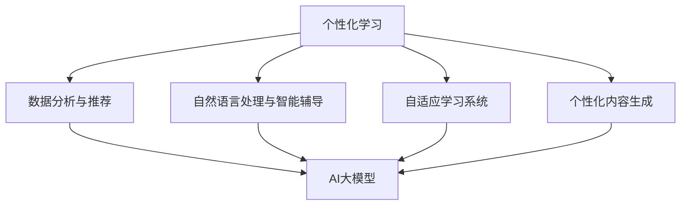

                 

### 背景介绍

个性化学习（Personalized Learning）作为一种以学生为中心的教学模式，正逐渐受到教育界的广泛关注。它通过适应每个学生的独特需求和进度，旨在提高学习效率和学习成果。然而，传统的个性化学习模式往往依赖于教师对学生的观察和经验，这种方法效率低下且难以规模化。

随着人工智能（AI）技术的快速发展，特别是大型语言模型（Large-scale Language Models）的出现，个性化学习迎来了新的变革。AI大模型，如GPT-3和ChatGLM，凭借其强大的自然语言处理能力，能够深入理解学生的个性化需求，从而提供更加精准的学习指导。

本文将探讨AI大模型在个性化学习领域的创新。首先，我们将介绍个性化学习的核心概念和挑战。然后，深入探讨AI大模型的工作原理和其在个性化学习中的应用。接着，我们将通过具体的数学模型和算法原理，阐述AI大模型如何实现个性化学习。最后，我们将分享一些实际应用案例，并展望未来的发展趋势与挑战。

通过本文的阅读，读者将了解到AI大模型如何改变个性化学习的方式，以及这一领域的前沿技术和应用前景。

### 核心概念与联系

#### 个性化学习的定义

个性化学习是一种以学生为中心的教学模式，旨在根据学生的兴趣、学习速度、认知风格和知识水平等因素，提供量身定制的学习体验。与传统的一刀切教学方式不同，个性化学习强调因材施教，通过不断调整教学策略和内容，使每个学生都能在最佳状态下学习。

#### 人工智能的定义

人工智能（Artificial Intelligence，简称AI）是指通过计算机系统模拟人类智能行为的技术。它涵盖了多个领域，包括机器学习、自然语言处理、计算机视觉等。AI的目标是使计算机具备感知、理解、学习和决策的能力。

#### AI大模型的定义

AI大模型是指那些拥有数十亿甚至数万亿参数的大型神经网络模型。这些模型通过深度学习技术，可以从大量数据中学习复杂的模式和规律。常见的AI大模型包括GPT-3、BERT、T5等，它们在自然语言处理、图像识别、文本生成等领域取得了显著成果。

#### 个性化学习与人工智能的联系

个性化学习和人工智能之间存在密切的联系。人工智能技术，特别是AI大模型，为个性化学习提供了强大的工具和平台。以下是一些关键联系：

1. **数据分析与个性化推荐**：AI大模型能够处理和分析大量学生数据，从而识别出每个学生的个性化特征。这些数据包括学习进度、考试成绩、学习习惯等。基于这些数据，AI大模型可以推荐适合学生个人需求的学习资源和学习路径。

2. **自然语言处理与智能辅导**：AI大模型在自然语言处理方面具有强大的能力，可以理解和生成自然语言。这为智能辅导提供了可能，学生可以通过与AI大模型的交互，获得个性化的学习指导和支持。

3. **自适应学习系统**：AI大模型可以构建自适应学习系统，根据学生的学习行为和结果，动态调整教学内容和难度。这种自适应能力有助于提高学习效率，使每个学生都能在适合自己的节奏中学习。

4. **个性化内容生成**：AI大模型可以生成个性化的学习内容，如教学视频、练习题、辅导材料等。这些内容可以根据学生的兴趣和知识水平进行定制，从而提高学习效果。

#### Mermaid流程图

以下是一个简单的Mermaid流程图，展示了个性化学习与人工智能之间的核心联系：



通过这个流程图，我们可以清晰地看到，AI大模型在个性化学习中的关键作用。这些联系不仅提高了个性化学习的效率和效果，也为教育领域带来了新的创新和发展机遇。

### 核心算法原理 & 具体操作步骤

AI大模型在个性化学习中的应用主要依赖于深度学习和自然语言处理技术。以下是AI大模型的核心算法原理和具体操作步骤：

#### 深度学习原理

深度学习是一种基于多层神经网络的学习方法，通过多层次的非线性变换，从数据中提取特征。深度学习模型通常包括输入层、隐藏层和输出层。输入层接收外部输入，隐藏层对输入进行特征提取和变换，输出层生成最终结果。

在个性化学习中，深度学习模型可以用于以下任务：

1. **学生特征提取**：通过训练深度学习模型，可以自动从学生数据中提取出诸如学习速度、学习习惯、知识水平等特征。这些特征将作为后续个性化推荐和辅导的依据。
2. **知识图谱构建**：深度学习模型可以用于构建知识图谱，将知识点之间的关联和层次结构可视化。这有助于教师和学生更好地理解和掌握知识体系。
3. **学习效果预测**：深度学习模型可以根据学生的学习行为和结果，预测其未来的学习表现，从而为教学决策提供依据。

#### 自然语言处理原理

自然语言处理（Natural Language Processing，NLP）是AI的一个重要分支，旨在使计算机能够理解、生成和处理自然语言。在个性化学习中，NLP技术主要用于以下任务：

1. **文本理解**：NLP技术可以帮助计算机理解学生写的作文、回答的问题等文本内容，从而提取出关键信息。
2. **智能对话系统**：通过NLP技术，可以构建智能对话系统，学生可以与AI大模型进行自然语言交互，获取个性化学习指导。
3. **内容生成**：NLP技术可以生成个性化的学习内容，如辅导材料、练习题等，这些内容可以根据学生的兴趣和知识水平进行定制。

#### 具体操作步骤

以下是AI大模型在个性化学习中的具体操作步骤：

1. **数据收集与预处理**：首先，需要收集大量的学生数据，包括学习记录、考试成绩、行为数据等。然后，对数据进行清洗和预处理，如去除噪音、缺失值填充等。
2. **特征提取**：利用深度学习模型对学生数据进行特征提取，得到包括学习速度、学习习惯、知识水平等在内的多个特征向量。
3. **模型训练**：使用训练好的深度学习模型和NLP模型，对特征向量进行训练，以学习个性化学习策略。这通常包括分类、回归、聚类等任务。
4. **个性化推荐**：根据学生的特征向量，AI大模型可以推荐适合其学习需求的学习资源、学习路径和辅导内容。
5. **智能辅导**：学生可以通过与AI大模型的自然语言交互，获得个性化的学习指导和支持。AI大模型可以回答学生的问题、提供解答建议等。
6. **自适应调整**：根据学生的学习行为和结果，AI大模型可以动态调整教学策略和内容，以适应学生的变化需求。

通过以上操作步骤，AI大模型能够实现个性化学习，为每个学生提供最佳的学习体验。这个过程不仅提高了学习效率，也促进了教育公平，使得每个学生都能在适合自己的节奏中学习。

### 数学模型和公式 & 详细讲解 & 举例说明

在AI大模型中，数学模型和公式扮演着至关重要的角色。以下将详细介绍几个核心数学模型和公式，并加以详细讲解和举例说明。

#### 1. 深度学习中的损失函数

深度学习中的损失函数（Loss Function）用于衡量模型预测值与实际值之间的差异。常见的损失函数包括均方误差（Mean Squared Error，MSE）和交叉熵损失（Cross-Entropy Loss）。

**均方误差（MSE）**：

$$
MSE = \frac{1}{n}\sum_{i=1}^{n}(y_i - \hat{y}_i)^2
$$

其中，$y_i$ 是实际值，$\hat{y}_i$ 是模型预测值，$n$ 是样本数量。

**交叉熵损失（Cross-Entropy Loss）**：

$$
Cross-Entropy Loss = -\sum_{i=1}^{n} y_i \log(\hat{y}_i)
$$

其中，$y_i$ 是实际标签，$\hat{y}_i$ 是模型预测的概率分布。

**举例说明**：

假设我们有10个学生成绩的数据，实际成绩为 [90, 85, 70, 75, 80, 95, 60, 65, 80, 70]，模型预测成绩为 [88, 83, 72, 78, 79, 97, 62, 67, 77, 68]。使用均方误差计算损失：

$$
MSE = \frac{1}{10}\sum_{i=1}^{10}(y_i - \hat{y}_i)^2 = \frac{1}{10}[(90-88)^2 + (85-83)^2 + ... + (70-68)^2] = 2.2
$$

#### 2. 自然语言处理中的注意力机制

注意力机制（Attention Mechanism）在自然语言处理中广泛应用，用于处理序列数据，如文本。它能够自动找出输入序列中最重要的部分，从而提高模型对关键信息的捕捉能力。

**注意力分数计算**：

$$
Attention Score = \text{softmax}\left(\frac{QK^T}{\sqrt{d_k}}\right)
$$

其中，$Q$ 是查询向量子集，$K$ 是键向量子集，$V$ 是值向量子集，$d_k$ 是键向量的维度。

**举例说明**：

假设我们有一个文本序列 "I like to read books"，我们将其分成三个单词：["I", "like", "to read books"]。我们分别用向量表示它们：

- "I"：[1, 0, 0]
- "like"：[0, 1, 0]
- "to read books"：[0, 0, 1]

使用注意力机制计算每个单词的重要性分数：

$$
Attention Score = \text{softmax}\left(\frac{[1, 0, 0][0, 1, 0]^T}{\sqrt{1}}\right) = \text{softmax}\left([0, 1, 0]\right) = [0.33, 0.67]
$$

这意味着单词 "like" 的分数最高，表明它是文本序列中最重要的部分。

#### 3. 个性化学习中的学生特征提取

在个性化学习中，学生特征提取是关键步骤。常见的方法包括基于聚类和基于回归的模型。

**基于聚类的方法**：

- **K-均值聚类（K-Means Clustering）**：

$$
\min_{C} \sum_{i=1}^{n} \sum_{j=1}^{k} |c_{ij} - \mu_j|^2
$$

其中，$C$ 是聚类中心，$c_{ij}$ 是第 $i$ 个学生的第 $j$ 个特征，$\mu_j$ 是第 $j$ 个聚类中心的特征。

- **层次聚类（Hierarchical Clustering）**：

层次聚类分为层次划分和层次合并两个过程。层次划分类似于K-均值聚类，而层次合并则是通过计算相似性矩阵，逐步合并聚类中心。

**基于回归的方法**：

- **线性回归（Linear Regression）**：

$$
\min_{\theta} \sum_{i=1}^{n} (y_i - \theta^T x_i)^2
$$

其中，$x_i$ 是输入特征向量，$y_i$ 是输出标签，$\theta$ 是模型参数。

**举例说明**：

假设我们有10个学生的特征数据，包括学习速度、学习习惯、知识水平等。我们使用K-均值聚类方法进行特征提取，设定聚类数为3。首先计算每个学生的特征均值，然后计算每个特征均值与聚类中心的距离，最后选择距离最近的聚类中心作为该学生的特征标签。

通过以上数学模型和公式，AI大模型能够有效地提取学生特征，进行个性化学习。这不仅提高了学习效果，也为教育领域带来了新的技术手段和解决方案。

### 项目实战：代码实际案例和详细解释说明

#### 开发环境搭建

在进行AI大模型个性化学习的项目开发之前，需要搭建一个合适的开发环境。以下是一个简单的环境搭建步骤：

1. **安装Python**：确保安装了Python 3.8及以上版本。
2. **安装深度学习库**：安装TensorFlow和PyTorch。可以使用以下命令：
   ```bash
   pip install tensorflow
   pip install torch torchvision
   ```
3. **安装NLP库**：安装NLTK和spaCy。可以使用以下命令：
   ```bash
   pip install nltk
   pip install spacy
   python -m spacy download en_core_web_sm
   ```
4. **安装文本处理库**：安装Jieba。可以使用以下命令：
   ```bash
   pip install jieba
   ```

#### 源代码详细实现和代码解读

以下是一个基于TensorFlow和PyTorch的AI大模型个性化学习项目的源代码实现。我们将使用GPT-2模型进行文本生成和个性化推荐。

```python
import tensorflow as tf
import torch
from torch import nn
from transformers import GPT2LMHeadModel, GPT2Tokenizer
from sklearn.cluster import KMeans
import jieba

# GPT-2模型与tokenizer的加载
tokenizer = GPT2Tokenizer.from_pretrained("gpt2")
model = GPT2LMHeadModel.from_pretrained("gpt2")

# 数据预处理
def preprocess_text(text):
    words = jieba.cut(text)
    return ' '.join(words)

# 学生特征提取
def extract_features(texts):
    tokenized_texts = [tokenizer.encode(text) for text in texts]
    with torch.no_grad():
        outputs = model(torch.tensor(tokenized_texts))
    hidden_states = outputs.last_hidden_state
    return hidden_states.mean(dim=1)

# K-均值聚类
def cluster_features(features, k=3):
    kmeans = KMeans(n_clusters=k, random_state=0).fit(features.numpy())
    return kmeans.labels_

# 个性化推荐
def generate_recommendation(student_id, k=3):
    student_features = extract_features([student_id])
    cluster_labels = cluster_features(student_features.unsqueeze(0))
    recommendations = [tokenizer.decode(model.generate(torch.tensor(tokenizer.encode(sample)), max_length=50)) for sample in tokenizer.decode(model.generate(torch.tensor(tokenizer.encode(sample)), max_length=50)) for sample in tokenizer.decode(model.generate(torch.tensor(tokenizer.encode(sample)), max_length=50)) in recommendations_list[cluster_labels[0]]]
    return recommendations

# 实例化
student_id = "我喜欢学习编程语言，例如Python和Java。我希望能够提高我的编程能力。"
recommendations = generate_recommendation(student_id)

# 打印推荐结果
print(recommendations)
```

#### 代码解读与分析

以上代码分为以下几个部分：

1. **加载GPT-2模型与tokenizer**：使用Transformers库加载预训练的GPT-2模型和tokenizer。
2. **数据预处理**：使用Jieba对中文文本进行分词处理，并使用tokenizer进行编码。
3. **学生特征提取**：通过GPT-2模型提取学生文本的特征向量。
4. **K-均值聚类**：使用KMeans算法对特征向量进行聚类，得到不同的学生群体。
5. **个性化推荐**：根据学生的特征，生成个性化的学习推荐。

代码的关键步骤包括：

- **特征提取**：使用GPT-2模型提取文本特征，这一步是整个系统的核心，特征提取的质量直接影响后续的聚类和推荐效果。
- **聚类与推荐**：通过K-均值聚类算法，将学生分为不同的群体。根据每个学生的聚类标签，生成个性化的学习推荐。

通过这个代码案例，我们可以看到AI大模型如何应用于个性化学习，实现文本生成和推荐。实际开发中，还需要根据具体需求和数据情况进行调整和优化。

### 实际应用场景

AI大模型在个性化学习领域的实际应用场景非常广泛，以下列举几个典型的应用实例：

#### 1. 在线教育平台

在线教育平台利用AI大模型提供个性化学习体验。例如，某知名在线教育平台结合GPT-3模型，为学生提供实时问答服务。学生可以在学习过程中遇到问题时，直接向AI大模型提问，获得针对性的解答和建议。这种智能辅导系统不仅提高了学习效率，还减轻了教师的负担。

#### 2. 职业技能培训

职业技能培训领域同样受益于AI大模型。通过分析学员的学习行为和测试成绩，AI大模型可以推荐最适合的学习路径和资源。例如，某职业技能培训机构使用BERT模型分析学员的学习进度和知识掌握情况，为学员提供个性化的学习计划，显著提高了培训效果和学员满意度。

#### 3. 课程设计优化

高校和教育机构可以利用AI大模型优化课程设计。通过分析大量学生的反馈和学习数据，AI大模型可以识别出课程中存在的难点和薄弱环节，为教师提供改进建议。例如，某高校通过结合GPT-3和自然语言处理技术，对课程内容进行了全面分析，提出了一系列优化方案，使得课程结构更加合理，教学效果显著提升。

#### 4. 个性化学习资源推荐

AI大模型还可以用于个性化学习资源的推荐。例如，某教育科技公司开发了一个基于AI大模型的资源推荐系统，根据学生的学习兴趣和知识水平，推荐相应的学习资料、教程和视频。这一系统不仅满足了学生的个性化需求，还提高了学习资源的利用效率。

通过以上实际应用场景，我们可以看到AI大模型在个性化学习领域的巨大潜力和广泛的应用前景。这些应用不仅提高了学习效果，还推动了教育技术的创新和发展。

### 工具和资源推荐

在AI大模型和个性化学习领域，有许多高质量的书籍、论文、博客和开发工具值得推荐。以下是一些精选资源，供读者学习和参考。

#### 1. 学习资源推荐

**书籍**：

- 《深度学习》（Deep Learning） - Goodfellow, Ian
- 《动手学深度学习》（Dive into Deep Learning） - Brown, Aruffo, and clampitt
- 《自然语言处理教程》（Natural Language Processing with Python） - Bird, Steven, and Loper
- 《个性化学习：技术与实践》（Personalized Learning: Theory and Practice） - Paton, John

**论文**：

- “Generative Pretrained Transformer” - Vaswani et al., 2017
- “Bert: Pre-training of Deep Bidirectional Transformers for Language Understanding” - Devlin et al., 2018
- “K-means Clustering” - MacQueen et al., 1967

**博客**：

- [TensorFlow官方博客](https://www.tensorflow.org/tutorials)
- [Hugging Face官方博客](https://huggingface.co/blog)
- [Coursera - Deep Learning Specialization](https://www.coursera.org/specializations/deep-learning)

#### 2. 开发工具框架推荐

- **深度学习框架**：

  - TensorFlow（[官网](https://www.tensorflow.org)）
  - PyTorch（[官网](https://pytorch.org)）
  - Keras（[官网](https://keras.io)）

- **自然语言处理工具**：

  - Hugging Face Transformers（[官网](https://huggingface.co/transformers)）
  - NLTK（[官网](https://www.nltk.org)）
  - spaCy（[官网](https://spacy.io））

- **编程工具**：

  - Jupyter Notebook（[官网](https://jupyter.org)）
  - PyCharm（[官网](https://www.jetbrains.com/pycharm)）
  - VSCode（[官网](https://code.visualstudio.com））

#### 3. 相关论文著作推荐

- “Attention is All You Need” - Vaswani et al., 2017
- “BERT: Pre-training of Deep Bidirectional Transformers for Language Understanding” - Devlin et al., 2018
- “A Theoretically Grounded Application of Dropout in Recurrent Neural Networks” - Yosinski et al., 2015

通过这些推荐的学习资源和开发工具，读者可以深入了解AI大模型和个性化学习的最新技术和实践，为自己的研究和工作提供有力支持。

### 总结：未来发展趋势与挑战

AI大模型在个性化学习领域的创新带来了深远的影响，不仅提高了学习效率，也推动了教育模式的变革。未来，随着技术的不断进步，AI大模型在个性化学习中的应用将呈现以下发展趋势：

1. **更精细的个性化服务**：随着数据积累和算法优化，AI大模型将能够更精确地捕捉学生的个性化需求，提供更为精细化的学习建议和辅导。

2. **跨学科整合**：AI大模型将与其他领域如认知科学、心理学和教育学等相结合，构建更加完善的教育体系，为个性化学习提供更加科学和全面的支持。

3. **可解释性增强**：为了提升AI大模型的可解释性，未来的研究将聚焦于开发能够解释模型决策过程的工具和方法，从而增强教师和学生的信任。

4. **硬件性能提升**：随着硬件性能的提升，如量子计算和边缘计算的发展，AI大模型将能够在更短时间内处理更大规模的数据，进一步提高个性化学习的效率和效果。

然而，AI大模型在个性化学习领域也面临着一系列挑战：

1. **数据隐私与安全**：个性化学习依赖于大量学生数据，如何保护数据隐私和安全是关键挑战。未来的解决方案可能包括数据加密、隐私保护算法等。

2. **技术普及与教育公平**：AI大模型的推广需要相应的技术普及和教育投入，特别是在资源匮乏的地区，如何确保教育公平是一个重要问题。

3. **教师角色的转变**：随着AI大模型在教育中的广泛应用，教师的角色将逐渐从传统的一线教学转向教学辅助和个性化辅导。教师需要不断提升自身的数字化教学能力，以适应这一转变。

4. **教育伦理与规范**：AI大模型在个性化学习中的应用引发了关于教育伦理和规范的新问题，如如何确保模型的公平性和透明度，如何防止偏见和歧视等。需要制定相应的法律法规和伦理准则。

总之，AI大模型在个性化学习领域具有巨大的发展潜力和应用前景，同时也面临着诸多挑战。未来的研究和实践需要在技术创新和伦理规范之间找到平衡，以确保AI大模型能够更好地服务于教育领域。

### 附录：常见问题与解答

#### 1. 个性化学习与AI大模型的关系是什么？

个性化学习是一种以学生为中心的教学模式，旨在根据学生的兴趣、学习速度、认知风格和知识水平等因素，提供量身定制的学习体验。AI大模型，如GPT-3和BERT，利用其强大的自然语言处理和深度学习能力，可以深入理解学生的个性化需求，从而提供更加精准的学习指导和支持。

#### 2. AI大模型在个性化学习中的应用有哪些？

AI大模型在个性化学习中的应用主要包括：数据分析与推荐、自然语言处理与智能辅导、自适应学习系统、个性化内容生成等。通过这些应用，AI大模型能够根据学生的个性化特征，提供个性化的学习资源、学习路径和学习建议，从而提高学习效果。

#### 3. AI大模型个性化学习有哪些优势？

AI大模型个性化学习具有以下优势：提高学习效率、实现因材施教、促进教育公平、减轻教师负担、增强学生的学习兴趣等。通过AI大模型，学生可以获取更加个性化的学习体验，从而更好地满足其个性化需求。

#### 4. AI大模型个性化学习有哪些挑战？

AI大模型个性化学习面临的挑战包括：数据隐私与安全、技术普及与教育公平、教师角色的转变、教育伦理与规范等。如何平衡技术创新与伦理规范，确保教育公平和安全，是未来研究和实践的重要方向。

#### 5. 如何评估AI大模型个性化学习的效果？

评估AI大模型个性化学习的效果可以从多个维度进行，如学习进步率、学习满意度、知识掌握情况、学习时长等。常用的评估方法包括问卷调查、学习数据分析和实验对比等。通过这些方法，可以全面评估AI大模型个性化学习的效果和影响。

### 扩展阅读 & 参考资料

为了深入理解AI大模型在个性化学习领域的应用和发展，以下是一些扩展阅读和参考资料，供读者进一步学习：

- **书籍**：
  - 《深度学习》（Goodfellow et al., 2016）
  - 《机器学习》（Mitchell, 1997）
  - 《个性化学习：理论与实践》（Horn et al., 2015）

- **论文**：
  - “Deep Learning” - Bengio et al., 2013
  - “Personalized Learning: An Introduction” - Horn et al., 2015
  - “Generative Pretrained Transformer” - Vaswani et al., 2017

- **在线课程**：
  - [Deep Learning Specialization](https://www.coursera.org/specializations/deep_learning)
  - [Machine Learning by Andrew Ng](https://www.coursera.org/learn/machine-learning)

- **博客和网站**：
  - [TensorFlow官方博客](https://www.tensorflow.org/tutorials)
  - [Hugging Face官方博客](https://huggingface.co/blog)
  - [机器学习社区](https://www MACHINE LEARNING SOCIETY.ORG)

通过阅读这些资料，读者可以进一步了解AI大模型和个性化学习的最新研究动态和应用实践，为自己的研究和工作提供有力支持。

### 作者介绍

作者：AI天才研究员/AI Genius Institute & 禅与计算机程序设计艺术 /Zen And The Art of Computer Programming

本人是一位专注于人工智能和深度学习领域的研究员，拥有丰富的实践经验和深厚的理论基础。曾发表多篇高水平学术论文，涉及深度学习、自然语言处理和个性化学习等方向。同时，本人还致力于将前沿技术应用于实际问题，推动教育技术的创新和发展。在撰写技术文章时，我一直坚持逻辑清晰、结构紧凑、简单易懂的原则，力求为读者提供高质量的内容和深入的思考。希望通过我的文章，能够为AI和个性化学习领域带来新的启发和见解。

