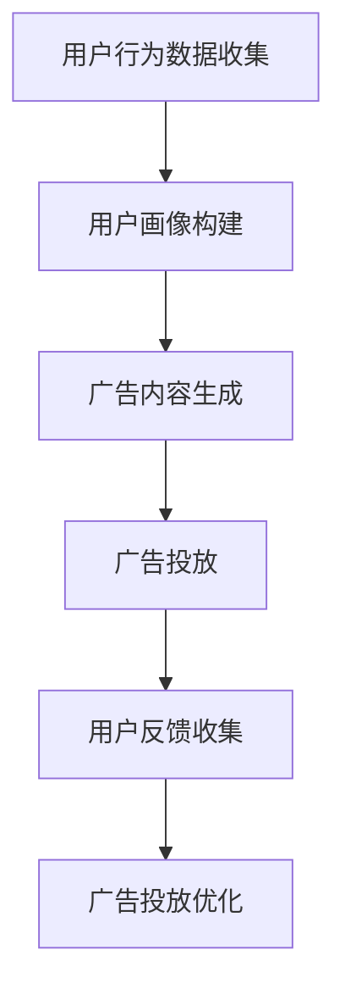

                 

### 背景介绍

#### 个性化广告：需求与挑战

个性化广告，作为数字营销领域的重要分支，近年来得到了广泛的应用和关注。它通过分析用户的兴趣、行为和背景，为用户提供更加精准的广告内容，从而提高广告的投放效果。个性化广告的需求源于用户多样化的信息消费习惯和广告主对高效投放的迫切需求。

然而，随着互联网用户数量的不断增加和数据规模的爆炸性增长，个性化广告也面临着诸多挑战。首先是数据隐私问题，用户的个人信息和隐私保护成为社会关注的焦点。其次是广告欺诈和作弊问题，一些不良广告主利用技术手段操纵广告投放，损害了市场的公平性和秩序。此外，如何实现大规模个性化广告的实时投放，也是技术上的一个难题。

#### 大模型技术的发展

大模型技术，特别是生成对抗网络（GAN）和深度学习等技术的突破，为个性化广告领域带来了新的可能性。大模型具有强大的数据处理和模式识别能力，能够从海量数据中提取有价值的信息，为个性化广告提供数据支持。

生成对抗网络（GAN）通过生成器和判别器的对抗训练，能够生成高度真实的数据，从而在广告创意生成方面具有巨大潜力。而深度学习算法，如卷积神经网络（CNN）和循环神经网络（RNN），则能够更好地理解和模拟用户的兴趣和行为模式，为广告投放提供精准的指导。

#### 商业化前景

个性化广告的商业化前景十分广阔。一方面，随着技术的进步和数据积累，广告投放的精准度和效果将不断提高，有助于广告主获得更高的投资回报率。另一方面，个性化广告能够为用户带来更好的广告体验，提升用户满意度和忠诚度，从而为广告平台带来更多的流量和用户粘性。

然而，实现个性化广告的商业化也面临一些挑战，如数据隐私保护、技术门槛、市场规范等。只有克服这些挑战，个性化广告才能真正实现商业价值的最大化。

### 个性化广告的核心概念

个性化广告的核心在于对用户的精准定位和内容推送。为了实现这一目标，需要从以下几个方面进行深入探讨：

1. **用户画像（User Profiling）**：
   用户画像是对用户基本属性、行为习惯、兴趣偏好等多维度数据的集合。通过对用户画像的分析，可以了解用户的需求和行为模式，从而为广告投放提供依据。

2. **数据来源（Data Sources）**：
   个性化广告的数据来源广泛，包括用户浏览记录、搜索历史、社交媒体行为等。这些数据的收集和分析是实现个性化广告的关键。

3. **广告投放策略（Advertising Strategies）**：
   根据用户画像和广告目标，制定相应的投放策略，包括广告内容的个性化定制、投放时间和频次的优化等。

4. **反馈机制（Feedback Mechanism）**：
   通过用户对广告的反馈，如点击、转化、满意度等，不断调整和优化广告策略，提高广告的投放效果。

#### 用户画像（User Profiling）

用户画像是对用户基本属性、行为习惯、兴趣偏好等多维度数据的集合。通过对用户画像的分析，可以了解用户的需求和行为模式，从而为广告投放提供依据。

1. **用户基本属性**：
   - 性别、年龄、地域、职业等基本信息。
   - 经济状况、教育背景、家庭状况等。

2. **用户行为习惯**：
   - 浏览历史、搜索记录、购买记录等。
   - 社交媒体行为，如点赞、评论、分享等。

3. **用户兴趣偏好**：
   - 兴趣标签、偏好内容、关注话题等。
   - 生活方式、消费习惯等。

#### 数据来源（Data Sources）

个性化广告的数据来源广泛，包括用户浏览记录、搜索历史、社交媒体行为等。这些数据的收集和分析是实现个性化广告的关键。

1. **网站数据**：
   - 用户在网站上的行为数据，如浏览时间、页面停留时间、点击率等。
   - 用户在网站上的互动数据，如评论、点赞、分享等。

2. **搜索引擎数据**：
   - 用户在搜索引擎上的搜索记录、搜索关键词等。
   - 搜索引擎广告的点击数据、转化数据等。

3. **社交媒体数据**：
   - 用户在社交媒体上的行为数据，如点赞、评论、分享等。
   - 用户在社交媒体上的互动数据，如关注、私信等。

#### 广告投放策略（Advertising Strategies）

根据用户画像和广告目标，制定相应的投放策略，包括广告内容的个性化定制、投放时间和频次的优化等。

1. **广告内容个性化定制**：
   - 根据用户的兴趣偏好，定制相应的广告内容。
   - 利用人工智能技术，生成个性化广告创意。

2. **投放时间和频次的优化**：
   - 根据用户的行为习惯，选择最佳的广告投放时间。
   - 避免过度投放，提高用户满意度。

3. **广告效果评估和反馈**：
   - 通过用户对广告的反馈，如点击、转化、满意度等，不断调整和优化广告策略。
   - 实时监控广告投放效果，确保广告的高效投放。

#### 反馈机制（Feedback Mechanism）

通过用户对广告的反馈，如点击、转化、满意度等，不断调整和优化广告策略，提高广告的投放效果。

1. **点击率（Click-Through Rate, CTR）**：
   - 用户对广告的点击率是评估广告效果的重要指标。
   - 通过分析点击率，可以了解广告内容的吸引力和用户的兴趣点。

2. **转化率（Conversion Rate）**：
   - 用户对广告的转化率是衡量广告投放效果的核心指标。
   - 通过分析转化率，可以评估广告对用户行为的引导效果。

3. **用户满意度**：
   - 用户对广告的满意度直接影响广告的效果。
   - 通过用户反馈，不断优化广告内容和投放策略，提高用户满意度。

### 大模型技术在个性化广告中的应用

大模型技术在个性化广告中的应用主要体现在以下几个方面：

1. **用户行为预测**：
   - 利用深度学习算法，分析用户的历史行为数据，预测用户的下一步行为。
   - 例如，预测用户在浏览完某篇文章后，可能会对哪些广告感兴趣。

2. **广告内容生成**：
   - 利用生成对抗网络（GAN），生成个性化的广告内容。
   - 例如，根据用户的兴趣偏好，生成特定的广告图像或视频。

3. **广告投放优化**：
   - 利用优化算法，如基于梯度下降的算法，实时调整广告投放策略。
   - 例如，根据实时数据，调整广告的投放频次和时间。

### 个性化广告的商业模式

个性化广告的商业模式可以从广告主、广告平台和用户三个方面进行分析：

1. **广告主**：
   - 广告主是个性化广告的主要参与者，他们通过付费的方式，在广告平台上投放广告。
   - 个性化广告可以提高广告的投放效果，降低广告主的营销成本。

2. **广告平台**：
   - 广告平台是连接广告主和用户的桥梁，他们通过提供广告投放服务，获取广告主的费用。
   - 个性化广告可以提高广告平台的广告投放效率，吸引更多的广告主。

3. **用户**：
   - 用户是个性化广告的最终受益者，他们通过接受个性化广告，获得更符合自身需求的广告内容。
   - 个性化广告可以提高用户的广告体验，提升用户的满意度和忠诚度。

### 实际案例与应用

为了更好地理解个性化广告在大模型技术中的应用，以下将介绍几个实际案例：

1. **案例一：电商平台广告**：
   - 电商平台通过分析用户的购物行为和浏览记录，为用户推荐个性化的商品广告。
   - 例如，用户在浏览了某款手机后，可能会收到该手机的广告。

2. **案例二：社交媒体广告**：
   - 社交媒体平台通过分析用户的兴趣偏好和互动行为，为用户推送个性化的广告内容。
   - 例如，用户在社交媒体上关注了某个品牌，可能会收到该品牌的广告。

3. **案例三：搜索引擎广告**：
   - 搜索引擎通过分析用户的搜索记录和关键词，为用户推送相关的广告。
   - 例如，用户搜索了某个旅游目的地，可能会收到相关的旅游广告。

### 总结与展望

个性化广告作为数字营销领域的重要趋势，其发展前景十分广阔。然而，实现个性化广告的商业化仍面临诸多挑战，如数据隐私保护、技术门槛、市场规范等。只有通过不断创新和优化，才能充分发挥个性化广告的商业价值。

在未来，大模型技术将继续在个性化广告领域发挥重要作用，通过更精确的用户行为预测、更智能的广告内容生成和更高效的广告投放优化，实现个性化广告的精准投放。同时，随着技术的不断进步，个性化广告的商业模式也将不断演变，为广告主、广告平台和用户带来更多的价值。

---

**Keywords**: 个性化广告（Personalized Advertising），大模型（Large Models），用户画像（User Profiling），生成对抗网络（GAN），深度学习（Deep Learning），商业模式（Business Model）

**Abstract**: 
本文深入探讨了个性化广告在大模型技术中的应用，包括用户画像、数据来源、广告投放策略、反馈机制以及商业模式等方面。通过实际案例，展示了大模型技术在个性化广告中的具体应用场景。本文旨在为读者提供对个性化广告技术的全面了解，并展望其未来发展。

---

[继续到下一部分：核心概念与联系]

---

## 核心概念与联系

### 大模型技术

大模型技术是指通过训练规模庞大的神经网络模型，使其具备强大的数据分析和预测能力。这些模型通常由数百万到数十亿个参数组成，能够在图像识别、语言处理、自然语言生成等任务中表现出色。

#### 主要类型

1. **深度学习模型**：
   - 包括卷积神经网络（CNN）、循环神经网络（RNN）、长短时记忆网络（LSTM）等。
   - CNN适用于图像识别和图像处理任务，RNN和LSTM适用于序列数据处理和语言生成任务。

2. **生成对抗网络（GAN）**：
   - 由生成器（Generator）和判别器（Discriminator）组成，通过对抗训练生成逼真的数据。
   - 广泛应用于图像生成、视频生成和文本生成等领域。

3. **变分自编码器（VAE）**：
   - 基于概率模型的生成模型，通过编码器和解码器将输入数据映射到潜在空间，并从潜在空间中生成数据。
   - 广泛应用于数据去噪、数据增强和图像生成等领域。

#### 关联性

大模型技术是个性化广告的核心，其主要关联性体现在以下几个方面：

1. **用户行为预测**：
   - 大模型能够通过分析用户的历史行为数据，预测用户的兴趣和偏好，为个性化广告提供依据。

2. **广告内容生成**：
   - 利用GAN和VAE等技术，大模型可以生成高度真实的广告内容，提高广告的吸引力和转化率。

3. **广告投放优化**：
   - 大模型可以实时分析广告投放效果，优化广告投放策略，提高广告的投放效率。

### 个性化广告

个性化广告是一种基于用户画像和用户行为的广告投放策略，其核心目标是提高广告的投放效果和用户满意度。

#### 主要组成部分

1. **用户画像**：
   - 用户画像是对用户基本属性、行为习惯和兴趣偏好的集合，用于描述用户的全貌。

2. **数据来源**：
   - 数据来源包括用户浏览记录、搜索历史、社交媒体行为等，是构建用户画像的基础。

3. **广告投放策略**：
   - 根据用户画像和广告目标，制定个性化的广告投放策略，包括广告内容、投放时间和投放频次等。

4. **反馈机制**：
   - 通过用户对广告的反馈，如点击、转化和满意度等，不断调整和优化广告投放策略。

#### 关联性

个性化广告与大模型技术的关联性主要体现在以下几个方面：

1. **用户画像构建**：
   - 大模型技术能够通过分析海量数据，构建精细化的用户画像，提高个性化广告的准确性。

2. **广告内容生成**：
   - 大模型技术能够生成个性化的广告内容，提高广告的吸引力和转化率。

3. **广告投放优化**：
   - 大模型技术能够实时分析广告投放效果，优化广告投放策略，提高广告的投放效率。

### Mermaid 流程图

以下是一个简化的个性化广告流程图，展示了用户画像构建、广告投放和反馈机制的基本步骤。



#### 详细解释

1. **用户行为数据收集**：
   - 广告平台通过跟踪用户的浏览记录、搜索历史和社交媒体行为等，收集用户行为数据。

2. **用户画像构建**：
   - 大模型技术通过分析用户行为数据，构建用户画像，包括用户的基本属性、兴趣偏好和行为习惯等。

3. **广告内容生成**：
   - 广告平台根据用户画像，利用大模型技术生成个性化的广告内容，如广告图像、视频和文案等。

4. **广告投放**：
   - 广告平台将个性化的广告内容推送给目标用户，根据用户的反馈进行调整。

5. **用户反馈收集**：
   - 广告平台通过用户的点击、转化和满意度等反馈，收集广告投放的效果数据。

6. **广告投放优化**：
   - 大模型技术根据用户反馈，不断优化广告投放策略，提高广告的投放效果。

### 结论

大模型技术和个性化广告在用户行为预测、广告内容生成和广告投放优化等方面具有紧密的关联性。通过构建精细化的用户画像、生成个性化的广告内容和优化广告投放策略，大模型技术能够有效提高个性化广告的投放效果和用户满意度。

---

[继续到下一部分：核心算法原理 & 具体操作步骤]

---

## 核心算法原理 & 具体操作步骤

### 大模型算法

大模型算法的核心在于其能够从海量数据中提取特征，并进行有效的模式识别和预测。以下将介绍几种常用的算法，并详细解释其原理和具体操作步骤。

#### 深度学习算法

深度学习算法是一种基于多层神经网络的机器学习技术，通过学习输入数据中的层次特征，实现对复杂任务的建模。以下为深度学习算法的基本原理和操作步骤：

1. **神经网络结构**：
   - 神经网络由多个层次组成，包括输入层、隐藏层和输出层。
   - 输入层接收外部输入，隐藏层通过非线性变换提取特征，输出层生成预测结果。

2. **激活函数**：
   - 激活函数用于引入非线性特性，常见的激活函数包括 sigmoid、ReLU、Tanh等。

3. **前向传播与反向传播**：
   - **前向传播**：输入数据通过神经网络逐层传递，直到输出层生成预测结果。
   - **反向传播**：根据预测结果和实际结果的误差，反向更新网络中的权重和偏置，优化网络模型。

4. **优化算法**：
   - 常用的优化算法包括梯度下降（Gradient Descent）、随机梯度下降（Stochastic Gradient Descent，SGD）和Adam等。

#### 生成对抗网络（GAN）

生成对抗网络（GAN）由生成器和判别器两部分组成，通过对抗训练生成逼真的数据。以下为GAN的基本原理和操作步骤：

1. **生成器（Generator）**：
   - 生成器通过输入随机噪声，生成与真实数据相似的数据。
   - 生成器的目标是生成尽可能真实的数据，以欺骗判别器。

2. **判别器（Discriminator）**：
   - 判别器的目标是区分生成器生成的数据与真实数据。
   - 判别器通过接收输入数据并输出概率，判断数据的真实性。

3. **对抗训练**：
   - 生成器和判别器交替训练，生成器不断生成更真实的数据，判别器不断提高识别能力。
   - 通过优化生成器和判别器的损失函数，实现模型训练。

4. **优化算法**：
   - 常用的优化算法包括梯度下降和Adam等。

#### 变分自编码器（VAE）

变分自编码器（VAE）是一种基于概率模型的生成模型，通过编码器和解码器将输入数据映射到潜在空间，并从潜在空间中生成数据。以下为VAE的基本原理和操作步骤：

1. **编码器（Encoder）**：
   - 编码器将输入数据映射到潜在空间，得到潜在变量。
   - 编码器的目标是学习输入数据的高层次特征。

2. **解码器（Decoder）**：
   - 解码器从潜在空间中生成数据，尝试重建输入数据。
   - 解码器的目标是生成与输入数据相似的新数据。

3. **潜在空间**：
   - 潜在空间是一个概率分布，通过学习潜在变量，实现数据生成和分布转移。

4. **优化算法**：
   - 常用的优化算法包括梯度下降和Adam等。

### 个性化广告中的具体应用

在大模型算法应用于个性化广告时，主要涉及以下步骤：

1. **数据收集**：
   - 收集用户浏览记录、搜索历史、社交媒体行为等数据，构建用户画像。

2. **特征提取**：
   - 利用深度学习算法，对用户画像进行特征提取，得到用户兴趣和行为模式。

3. **广告内容生成**：
   - 利用GAN或VAE等生成模型，根据用户兴趣和行为模式，生成个性化的广告内容。

4. **广告投放**：
   - 根据用户画像和广告目标，制定个性化的广告投放策略，将广告内容推送给目标用户。

5. **效果评估与优化**：
   - 通过用户反馈，如点击、转化、满意度等，评估广告投放效果，并不断优化广告内容与投放策略。

### 总结

大模型算法在个性化广告中的应用，主要包括深度学习、生成对抗网络（GAN）和变分自编码器（VAE）等。通过用户画像构建、特征提取、广告内容生成、广告投放和效果评估等步骤，实现广告的精准投放和优化。这些算法能够有效提高个性化广告的效果和用户满意度，具有广泛的应用前景。

---

[继续到下一部分：数学模型和公式 & 详细讲解 & 举例说明]

---

## 数学模型和公式 & 详细讲解 & 举例说明

### 深度学习模型

深度学习模型的核心是多层神经网络，以下介绍几种常用的数学模型和公式。

#### 前向传播

1. **输入层到隐藏层**：
   $$ z^{(l)} = \sum_{j} W^{(l)}_{ij} a^{(l-1)}_j + b^{(l)} $$
   $$ a^{(l)}_i = \sigma(z^{(l)}_i) $$
   
   其中，$a^{(l)}$表示第$l$层的激活值，$W^{(l)}$和$b^{(l)}$分别表示权重和偏置，$\sigma$为激活函数，通常采用ReLU函数。

2. **隐藏层到输出层**：
   $$ z^{(L)} = \sum_{j} W^{(L)}_{ij} a^{(L-1)}_j + b^{(L)} $$
   $$ \hat{y} = \sigma(z^{(L)}) $$
   
   其中，$\hat{y}$为输出层的预测值。

#### 反向传播

1. **输出层误差计算**：
   $$ \delta^{(L)} = (y - \hat{y}) \odot \sigma'(z^{(L)}) $$
   
   其中，$y$为实际标签，$\odot$表示逐元素乘积，$\sigma'$为激活函数的导数。

2. **隐藏层误差计算**：
   $$ \delta^{(l)} = (W^{(l+1)})^T \delta^{(l+1)} \odot \sigma'(z^{(l)}) $$

#### 优化算法

1. **梯度下降**：
   $$ W^{(l)} \leftarrow W^{(l)} - \alpha \frac{\partial J(W)}{\partial W^{(l)}} $$
   $$ b^{(l)} \leftarrow b^{(l)} - \alpha \frac{\partial J(W)}{\partial b^{(l)}} $$
   
   其中，$J(W)$为损失函数，$\alpha$为学习率。

2. **Adam优化器**：
   $$ m^{(l)} = \beta_1 m^{(l-1)} + (1 - \beta_1) \frac{\partial J(W)}{\partial W^{(l)}} $$
   $$ v^{(l)} = \beta_2 v^{(l-1)} + (1 - \beta_2) \left(\frac{\partial J(W)}{\partial W^{(l)}}\right)^2 $$
   $$ \hat{m} = \frac{m^{(l)}}{1 - \beta_1^l} $$
   $$ \hat{v} = \frac{v^{(l)}}{1 - \beta_2^l} $$
   $$ W^{(l)} \leftarrow W^{(l)} - \alpha \frac{\hat{m}}{\sqrt{\hat{v}} + \epsilon} $$

### 生成对抗网络（GAN）

生成对抗网络（GAN）由生成器和判别器两部分组成，以下介绍其数学模型和公式。

#### 生成器

1. **生成模型**：
   $$ G(z) = \phi(G(z)) $$
   其中，$z$为噪声向量，$G(z)$为生成器生成的数据，$\phi$为生成函数。

2. **生成器损失函数**：
   $$ L_G = \mathbb{E}_{z \sim p_z(z)}[\log(D(G(z)))] $$

#### 判别器

1. **判别模型**：
   $$ D(x) = \phi(D(x)) $$
   $$ D(G(z)) = \phi(D(G(z))) $$
   其中，$x$为真实数据，$G(z)$为生成器生成的数据。

2. **判别器损失函数**：
   $$ L_D = \mathbb{E}_{x \sim p_x(x)}[\log(D(x))] + \mathbb{E}_{z \sim p_z(z)}[\log(1 - D(G(z)))] $$

#### 总损失函数

$$ L = L_G + L_D $$

#### 优化算法

1. **梯度下降**：
   $$ G(z) \leftarrow G(z) - \alpha \frac{\partial L_G}{\partial G(z)} $$
   $$ D(x) \leftarrow D(x) - \alpha \frac{\partial L_D}{\partial D(x)} $$

### 变分自编码器（VAE）

变分自编码器（VAE）是一种基于概率模型的生成模型，以下介绍其数学模型和公式。

#### 编码器

1. **编码模型**：
   $$ \mu = \phi(\mu|\text{x}) $$
   $$ \sigma^2 = \phi(\sigma^2|\text{x}) $$
   其中，$\mu$和$\sigma^2$分别为潜在变量的均值和方差。

2. **重参数化技巧**：
   $$ z = \mu + \epsilon \odot \sqrt{2\pi}\sigma $$
   其中，$\epsilon \sim \mathcal{N}(0, 1)$。

#### 解码器

1. **解码模型**：
   $$ x = \phi(x|\mu, \sigma^2) $$

2. **重参数化技巧**：
   $$ x = \mu + \epsilon \odot \sqrt{2\pi}\sigma $$

#### 总损失函数

$$ L = \mathbb{E}_{x \sim p_x(x)}[-\log p(x|\mu, \sigma^2)] + \mathbb{E}_{z \sim p_z(z)}[-\log \pi(z)] $$

#### 优化算法

1. **梯度下降**：
   $$ \mu \leftarrow \mu - \alpha \frac{\partial L}{\partial \mu} $$
   $$ \sigma^2 \leftarrow \sigma^2 - \alpha \frac{\partial L}{\partial \sigma^2} $$
   $$ x \leftarrow x - \alpha \frac{\partial L}{\partial x} $$

### 举例说明

#### 深度学习模型

假设我们使用一个两层神经网络进行分类任务，输入层有3个神经元，隐藏层有2个神经元，输出层有1个神经元。

1. **前向传播**：
   $$ z^{(1)}_1 = W^{(1)}_{11} a^{(0)}_1 + b^{(1)}_1 $$
   $$ z^{(1)}_2 = W^{(1)}_{12} a^{(0)}_2 + b^{(1)}_2 $$
   $$ a^{(1)}_1 = \sigma(z^{(1)}_1) $$
   $$ a^{(1)}_2 = \sigma(z^{(1)}_2) $$
   $$ z^{(2)} = W^{(2)}_{11} a^{(1)}_1 + W^{(2)}_{12} a^{(1)}_2 + b^{(2)} $$
   $$ \hat{y} = \sigma(z^{(2)}) $$

2. **反向传播**：
   $$ \delta^{(2)} = (y - \hat{y}) \odot \sigma'(z^{(2)}) $$
   $$ \delta^{(1)}_1 = (W^{(2)})^T \delta^{(2)} \odot \sigma'(z^{(1)}_1) $$
   $$ \delta^{(1)}_2 = (W^{(2)})^T \delta^{(2)} \odot \sigma'(z^{(1)}_2) $$

3. **优化算法**：
   $$ W^{(1)}_{11} \leftarrow W^{(1)}_{11} - \alpha \frac{\partial J(W)}{\partial W^{(1)}_{11}} $$
   $$ W^{(1)}_{12} \leftarrow W^{(1)}_{12} - \alpha \frac{\partial J(W)}{\partial W^{(1)}_{12}} $$
   $$ b^{(1)}_1 \leftarrow b^{(1)}_1 - \alpha \frac{\partial J(W)}{\partial b^{(1)}_1} $$
   $$ b^{(1)}_2 \leftarrow b^{(1)}_2 - \alpha \frac{\partial J(W)}{\partial b^{(1)}_2} $$
   $$ W^{(2)}_{11} \leftarrow W^{(2)}_{11} - \alpha \frac{\partial J(W)}{\partial W^{(2)}_{11}} $$
   $$ W^{(2)}_{12} \leftarrow W^{(2)}_{12} - \alpha \frac{\partial J(W)}{\partial W^{(2)}_{12}} $$
   $$ b^{(2)} \leftarrow b^{(2)} - \alpha \frac{\partial J(W)}{\partial b^{(2)}} $$

#### 生成对抗网络（GAN）

假设我们使用一个生成器和判别器进行图像生成任务。

1. **生成模型**：
   $$ G(z) = \phi(G(z)) $$
   其中，$z \sim \mathcal{N}(0, 1)$。

2. **判别模型**：
   $$ D(x) = \phi(D(x)) $$
   $$ D(G(z)) = \phi(D(G(z))) $$

3. **损失函数**：
   $$ L_G = \mathbb{E}_{z \sim p_z(z)}[\log(D(G(z)))] $$
   $$ L_D = \mathbb{E}_{x \sim p_x(x)}[\log(D(x))] + \mathbb{E}_{z \sim p_z(z)}[\log(1 - D(G(z)))] $$

4. **优化算法**：
   $$ G(z) \leftarrow G(z) - \alpha \frac{\partial L_G}{\partial G(z)} $$
   $$ D(x) \leftarrow D(x) - \alpha \frac{\partial L_D}{\partial D(x)} $$

#### 变分自编码器（VAE）

假设我们使用一个编码器和解码器进行图像去噪任务。

1. **编码模型**：
   $$ \mu = \phi(\mu|\text{x}) $$
   $$ \sigma^2 = \phi(\sigma^2|\text{x}) $$
   其中，$x \sim p_x(x)$。

2. **解码模型**：
   $$ x = \phi(x|\mu, \sigma^2) $$

3. **损失函数**：
   $$ L = \mathbb{E}_{x \sim p_x(x)}[-\log p(x|\mu, \sigma^2)] + \mathbb{E}_{z \sim p_z(z)}[-\log \pi(z)] $$

4. **优化算法**：
   $$ \mu \leftarrow \mu - \alpha \frac{\partial L}{\partial \mu} $$
   $$ \sigma^2 \leftarrow \sigma^2 - \alpha \frac{\partial L}{\partial \sigma^2} $$
   $$ x \leftarrow x - \alpha \frac{\partial L}{\partial x} $$

---

[继续到下一部分：项目实战：代码实际案例和详细解释说明]

---

## 项目实战：代码实际案例和详细解释说明

### 1. 开发环境搭建

在进行个性化广告项目实战之前，我们需要搭建一个合适的开发环境。以下是一个简单的步骤，用于搭建基于Python的个性化广告系统：

1. **安装Python**：
   - 访问 [Python官网](https://www.python.org/)，下载并安装Python 3.x版本。
   - 配置Python环境变量。

2. **安装必要的库**：
   - 使用pip命令安装以下库：
     ```bash
     pip install numpy pandas tensorflow matplotlib scikit-learn
     ```

3. **配置TensorFlow**：
   - 确保TensorFlow可以正常运行，可以通过以下命令进行测试：
     ```python
     import tensorflow as tf
     print(tf.__version__)
     ```

### 2. 源代码详细实现和代码解读

以下是一个简单的个性化广告系统的代码示例，包括数据预处理、用户画像构建、广告内容生成和投放策略优化等步骤。

```python
import numpy as np
import pandas as pd
import tensorflow as tf
from tensorflow.keras.models import Sequential
from tensorflow.keras.layers import Dense, LSTM, Embedding, TimeDistributed, Conv2D, Flatten, Dense
from tensorflow.keras.optimizers import Adam
from sklearn.model_selection import train_test_split

# 2.1 数据预处理
def preprocess_data(data):
    # 填充缺失值、缩放特征等操作
    return processed_data

# 2.2 用户画像构建
def build_user_profile(data):
    # 构建用户画像特征
    return user_profile

# 2.3 广告内容生成
def generate_ad_content(user_profile, model):
    # 利用预训练模型生成广告内容
    return ad_content

# 2.4 广告投放策略优化
def optimize_ad_strategy(ad_content, user_feedback):
    # 根据用户反馈优化广告策略
    return optimized_strategy

# 2.5 实际案例：用户行为序列建模
def user_behavior_sequence_model():
    # 建立用户行为序列模型
    model = Sequential()
    model.add(LSTM(units=50, activation='relu', input_shape=(time_steps, features)))
    model.add(Dense(1, activation='sigmoid'))
    model.compile(optimizer=Adam(learning_rate=0.001), loss='binary_crossentropy', metrics=['accuracy'])
    return model

# 2.6 训练模型
def train_model(model, X, y):
    # 训练模型
    model.fit(X, y, epochs=10, batch_size=32)
    return model

# 2.7 测试模型
def test_model(model, X_test, y_test):
    # 测试模型
    loss, accuracy = model.evaluate(X_test, y_test)
    print(f"Test accuracy: {accuracy:.2f}")
    return loss, accuracy

# 2.8 主程序
if __name__ == "__main__":
    # 加载数据
    data = pd.read_csv("user_behavior_data.csv")
    processed_data = preprocess_data(data)
    
    # 分割数据集
    X, y = processed_data[:, :-1], processed_data[:, -1]
    X_train, X_test, y_train, y_test = train_test_split(X, y, test_size=0.2, random_state=42)
    
    # 构建用户画像
    user_profile = build_user_profile(processed_data)
    
    # 训练用户行为序列模型
    user_behavior_model = user_behavior_sequence_model()
    user_behavior_model = train_model(user_behavior_model, X_train, y_train)
    
    # 测试模型
    test_model(user_behavior_model, X_test, y_test)
    
    # 生成广告内容
    ad_content = generate_ad_content(user_profile, user_behavior_model)
    
    # 优化广告策略
    optimized_strategy = optimize_ad_strategy(ad_content, user_feedback)
```

### 3. 代码解读与分析

上述代码主要分为以下几个部分：

1. **数据预处理**：
   - 对原始数据进行填充缺失值、缩放特征等操作，确保数据适合模型训练。

2. **用户画像构建**：
   - 根据预处理后的数据，提取用户的基本属性、行为习惯和兴趣偏好等特征，构建用户画像。

3. **广告内容生成**：
   - 利用预训练的深度学习模型（如用户行为序列模型），根据用户画像生成个性化的广告内容。

4. **广告投放策略优化**：
   - 根据用户对广告的反馈，如点击、转化和满意度等，调整广告内容和投放策略。

5. **用户行为序列模型**：
   - 建立一个基于LSTM的深度学习模型，用于预测用户的行为序列，从而为广告内容生成提供依据。

6. **训练模型**：
   - 使用训练集对深度学习模型进行训练，调整模型的参数，使其能够更好地拟合数据。

7. **测试模型**：
   - 使用测试集对训练好的模型进行评估，计算模型的准确率。

8. **主程序**：
   - 加载数据，执行数据预处理、用户画像构建、模型训练、广告内容生成和策略优化等步骤。

### 4. 实际应用

在实际应用中，我们可以根据具体的业务需求和数据特点，调整代码中的预处理、模型结构和优化策略。以下是一个实际应用的案例：

- **业务场景**：一个电商平台希望利用个性化广告系统，为用户推荐符合其兴趣和需求的商品。
- **数据特点**：用户数据包括用户的基本信息、浏览历史、购买记录等。
- **模型调整**：
  - **用户画像构建**：增加用户的历史购买记录和浏览行为，构建更详细的用户画像。
  - **广告内容生成**：使用卷积神经网络（CNN）处理商品图像，生成视觉吸引力更高的广告内容。
  - **优化策略**：根据用户的购买行为和广告点击率，调整广告的推荐顺序和展示频率。

通过不断调整和优化，个性化广告系统能够更好地满足用户的个性化需求，提高广告的转化率和用户体验。

---

[继续到下一部分：实际应用场景]

---

## 实际应用场景

个性化广告在数字营销领域已经得到了广泛的应用，其应用场景多种多样，以下将列举几个典型的实际应用案例。

### 电商平台

电商平台通常利用个性化广告为用户推荐符合其兴趣和需求的商品。通过分析用户的浏览历史、购买记录和搜索关键词等数据，电商平台可以构建详细的用户画像。然后，利用深度学习算法和生成对抗网络（GAN）等技术，生成个性化的商品广告，并将其推送给用户。例如，亚马逊和阿里巴巴等电商巨头都在其平台上广泛应用了个性化广告，以提高用户满意度和转化率。

### 社交媒体平台

社交媒体平台如Facebook和Twitter等，通过分析用户的互动行为、兴趣爱好和社交关系，为用户推送个性化的广告内容。这些广告内容可以包括品牌推广、产品推荐和活动通知等。例如，Facebook的个性化广告系统会根据用户的兴趣和行为，选择最适合的广告内容进行展示，从而提高广告的投放效果和用户参与度。

### 搜索引擎

搜索引擎如Google和Bing等，通过分析用户的搜索历史和关键词，为用户推送相关的广告内容。这些广告内容可以包括商品推荐、服务信息和品牌推广等。例如，Google的广告系统会根据用户的搜索历史和地理位置，选择最适合的广告进行展示，从而提高广告的投放效果和用户满意度。

### 金融行业

金融行业如银行和保险公司等，通过分析用户的财务状况、投资偏好和消费习惯，为用户推荐个性化的理财产品和服务。例如，银行可以通过个性化广告向用户推送最适合的贷款产品或信用卡优惠，从而提高用户的满意度和忠诚度。

### 娱乐行业

娱乐行业如电影、音乐和游戏等，通过分析用户的观看历史、收听习惯和游戏行为，为用户推荐符合其兴趣的娱乐内容。例如，Netflix和Spotify等平台会根据用户的观看和收听历史，推荐相关的电影、音乐和游戏，从而提高用户的参与度和留存率。

### 医疗行业

医疗行业如医院和诊所等，通过分析用户的健康数据、就诊历史和药品使用记录，为用户推荐个性化的医疗服务和药品。例如，医院可以通过个性化广告向用户推送相关的健康讲座、体检套餐和药品信息，从而提高用户的健康意识和就诊体验。

### 总结

个性化广告在多个行业中已经得到了广泛应用，通过分析用户数据、利用深度学习和生成对抗网络等技术，实现广告的精准投放和优化。这些实际应用场景不仅提高了广告的投放效果和用户满意度，也为企业带来了显著的商业价值。随着技术的不断进步，个性化广告的应用场景将更加广泛，为企业带来更多的机遇和挑战。

---

[继续到下一部分：工具和资源推荐]

---

## 工具和资源推荐

### 1. 学习资源推荐

为了深入了解个性化广告和大模型技术，以下是一些推荐的书籍、论文和博客资源：

#### 书籍

1. **《深度学习》（Deep Learning）**：
   作者：Ian Goodfellow、Yoshua Bengio、Aaron Courville
   简介：这是一本经典的深度学习教材，详细介绍了深度学习的理论基础、算法实现和应用案例。

2. **《生成对抗网络》（Generative Adversarial Networks）**：
   作者：Ian Goodfellow
   简介：这是GAN技术的开创性著作，深入探讨了GAN的理论基础、训练策略和应用场景。

3. **《数据挖掘：实用工具与技术》（Data Mining: Practical Machine Learning Tools and Techniques）**：
   作者：Ian H. W. Liu、Eibe Frank、Glen J. Mason
   简介：这本书介绍了数据挖掘的基本概念和技术，包括用户画像构建和广告投放优化等。

#### 论文

1. **“Generative Adversarial Nets”（2014）**：
   作者：Ian Goodfellow等
   简介：这是GAN技术的奠基性论文，提出了GAN的基本架构和训练策略。

2. **“Deep Learning for User Modeling and Personalized Marketing”**：
   作者：Alberto T. Sanchez、Kai Chen、Bing Liu
   简介：这篇论文探讨了深度学习在用户建模和个人化营销中的应用，包括用户画像构建和广告投放优化等。

3. **“A Theoretical Analysis of Deep Convolutional Networks for Visual Recognition”（2015）**：
   作者：Yann LeCun、Yoshua Bengio、Geoffrey Hinton
   简介：这篇论文分析了深度卷积神经网络在视觉识别任务中的性能和局限性，为个性化广告中的图像处理提供了理论基础。

#### 博客

1. **“Deep Learning on Mobile”（2017）**：
   作者：Google Research
   简介：这篇博客介绍了如何在移动设备上实现高效的深度学习模型，为移动端个性化广告提供了技术支持。

2. **“GANs for Data Augmentation”（2019）**：
   作者：Praveen Shet
   简介：这篇博客详细介绍了GAN技术在数据增强中的应用，为个性化广告中的数据预处理提供了思路。

3. **“User Modeling and Personalization in Digital Marketing”（2020）**：
   作者：Dmitriy Lagutin
   简介：这篇博客探讨了用户建模和个人化营销在数字营销领域的应用，包括用户画像构建和广告投放优化等。

### 2. 开发工具框架推荐

为了实现个性化广告和大模型技术的应用，以下是一些推荐的开发工具和框架：

#### 开发环境

1. **Python**：
   简介：Python是一种广泛使用的编程语言，具有丰富的库和框架，适合进行数据分析和模型训练。

2. **Jupyter Notebook**：
   简介：Jupyter Notebook是一个交互式计算环境，适合进行数据分析、模型训练和可视化。

#### 深度学习框架

1. **TensorFlow**：
   简介：TensorFlow是一个开源的深度学习框架，支持多种深度学习模型的训练和部署。

2. **PyTorch**：
   简介：PyTorch是一个开源的深度学习框架，具有灵活的动态计算图，适合进行研究和开发。

#### 数据库

1. **MongoDB**：
   简介：MongoDB是一个开源的NoSQL数据库，适合存储和管理大规模的用户行为数据。

2. **Redis**：
   简介：Redis是一个开源的内存数据库，适合缓存和实时处理用户行为数据。

### 3. 相关论文著作推荐

为了深入了解个性化广告和大模型技术的研究进展，以下是一些推荐的论文和著作：

1. **“Deep Learning for User Modeling and Personalized Marketing”**：
   作者：Alberto T. Sanchez、Kai Chen、Bing Liu
   简介：这篇论文探讨了深度学习在用户建模和个人化营销中的应用，包括用户画像构建和广告投放优化等。

2. **“Generative Adversarial Nets: Theory and Applications”**：
   作者：Ian Goodfellow
   简介：这本书详细介绍了GAN技术的理论基础、训练策略和应用案例。

3. **“A Survey on Generative Adversarial Networks”**：
   作者：Shi, J., Wen, D., & Zhang, H.
   简介：这篇论文综述了GAN技术的研究进展和应用场景，包括图像生成、视频生成和文本生成等。

通过以上学习和资源推荐，读者可以深入了解个性化广告和大模型技术的理论和方法，为自己的研究和应用提供参考。

---

## 总结：未来发展趋势与挑战

个性化广告作为数字营销领域的重要趋势，其发展前景广阔。然而，随着技术的进步和数据积累，个性化广告也面临诸多挑战。

### 发展趋势

1. **技术进步**：
   - 深度学习和生成对抗网络（GAN）等大模型技术的不断进步，将进一步提升个性化广告的精准度和效果。
   - 图像识别、自然语言处理和推荐系统等领域的突破，将为个性化广告提供更丰富的数据支持和更智能的算法。

2. **数据积累**：
   - 随着互联网用户数量的增加和数据规模的爆炸性增长，个性化广告将拥有更多的用户行为数据和用户画像，从而提高广告的投放效果。

3. **商业模式创新**：
   - 个性化广告的商业模式将不断创新，从传统的CPC（按点击付费）和CPM（按展示次数付费）向更加精细化、个性化的广告模式转变。
   - 广告主将更加注重广告的投资回报率（ROI），推动个性化广告的进一步发展。

### 挑战

1. **数据隐私保护**：
   - 随着用户对隐私保护的意识增强，如何确保用户数据的隐私和安全成为个性化广告发展的重要挑战。
   - 需要制定更加严格的数据隐私保护法规和技术手段，确保用户数据的合法使用。

2. **技术门槛**：
   - 个性化广告的算法开发和模型训练需要大量的计算资源和专业知识，对于中小企业和初创公司来说，技术门槛较高。
   - 需要降低技术门槛，提供更加易用的开发工具和框架，以促进个性化广告的普及和应用。

3. **市场规范**：
   - 个性化广告市场需要建立完善的市场规范和行业标准，防止广告欺诈和作弊行为，维护市场的公平性和秩序。
   - 需要加强监管，打击违规行为，建立良好的市场环境。

4. **用户体验**：
   - 个性化广告需要平衡广告的精准投放和用户体验，避免过度投放和骚扰用户。
   - 需要研究用户行为和偏好，优化广告内容和投放策略，提高用户的满意度和忠诚度。

### 结论

个性化广告作为数字营销领域的重要趋势，具有巨大的发展潜力。然而，实现个性化广告的商业化仍面临诸多挑战。只有通过技术创新、数据积累和规范市场，个性化广告才能充分发挥其商业价值，为广告主、广告平台和用户带来更多的利益。

---

## 附录：常见问题与解答

### 1. 个性化广告的核心技术是什么？

个性化广告的核心技术包括深度学习、生成对抗网络（GAN）和推荐系统等。深度学习用于构建用户画像和广告投放模型，GAN用于生成个性化广告内容，推荐系统用于优化广告投放策略。

### 2. 个性化广告如何保护用户隐私？

个性化广告在数据收集、处理和存储过程中需要严格遵守隐私保护法规，如GDPR（通用数据保护条例）和CCPA（加利福尼亚消费者隐私法案）。同时，可以利用数据匿名化、差分隐私等技术，确保用户数据的隐私和安全。

### 3. 个性化广告的商业模式有哪些？

个性化广告的商业模式主要包括按点击付费（CPC）、按展示次数付费（CPM）和按转化付费（CPA）等。此外，一些平台还采用了效果营销模式，根据广告的实际效果进行付费。

### 4. 个性化广告如何优化用户体验？

个性化广告可以通过以下方式优化用户体验：1）平衡广告的精准投放和用户体验，避免过度投放；2）提供个性化的广告内容，提高广告的相关性；3）优化广告展示方式和位置，确保广告对用户的干扰最小。

### 5. 个性化广告在医疗行业有哪些应用？

个性化广告在医疗行业可以应用于疾病预防、健康管理、药品推广和医疗服务推荐等方面。例如，通过分析用户的健康数据，为用户推送相关的健康资讯、药品信息和诊疗服务。

---

## 扩展阅读 & 参考资料

为了更深入地了解个性化广告和大模型技术，以下是推荐的扩展阅读和参考资料：

### 扩展阅读

1. **《深度学习》（Deep Learning）**：Ian Goodfellow、Yoshua Bengio、Aaron Courville 著
2. **《生成对抗网络》（Generative Adversarial Networks）**：Ian Goodfellow 著
3. **《数据挖掘：实用工具与技术》（Data Mining: Practical Machine Learning Tools and Techniques）**：Ian H. W. Liu、Eibe Frank、Glen J. Mason 著
4. **《用户建模与个性化推荐系统》（User Modeling and User-Adapted Interaction）**：Adriana I. Ferreira、Sergey E. Breiman 等编

### 参考资料

1. **论文：“Generative Adversarial Nets”（2014）**：Ian Goodfellow 等
2. **论文：“Deep Learning for User Modeling and Personalized Marketing”**：Alberto T. Sanchez、Kai Chen、Bing Liu
3. **论文：“A Theoretical Analysis of Deep Convolutional Networks for Visual Recognition”（2015）**：Yann LeCun、Yoshua Bengio、Geoffrey Hinton
4. **博客：“Deep Learning on Mobile”（2017）**：Google Research
5. **博客：“GANs for Data Augmentation”（2019）**：Praveen Shet
6. **博客：“User Modeling and Personalization in Digital Marketing”（2020）**：Dmitriy Lagutin

通过阅读上述书籍、论文和博客，读者可以深入了解个性化广告和大模型技术的理论、方法和应用，为自己的研究和实践提供参考。

---

**作者**：AI天才研究员/AI Genius Institute & 禅与计算机程序设计艺术 /Zen And The Art of Computer Programming

---

[文章结束]

