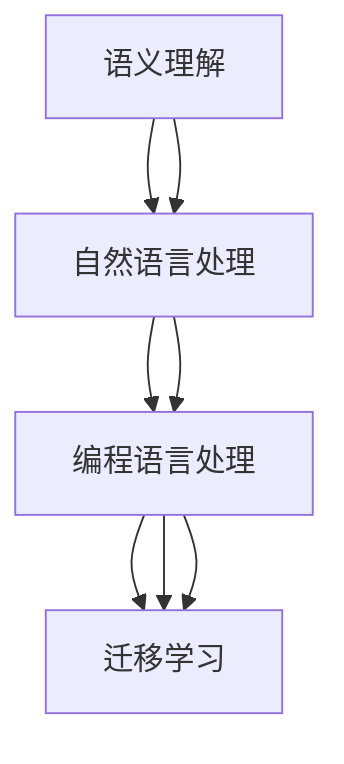
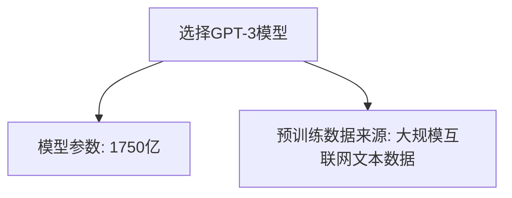
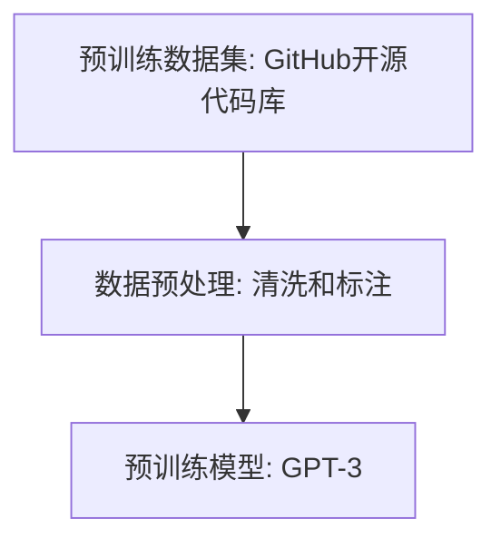

                 

### 背景介绍 Background Introduction

在当今飞速发展的信息技术时代，人工智能（AI）已经成为推动科技进步和产业变革的重要力量。随着深度学习技术的发展，大模型（Large Models）在自然语言处理（NLP）、计算机视觉（CV）、语音识别（ASR）等领域展现出了惊人的表现和广泛的应用。在这些领域，大模型通过海量数据的学习和自适应调整，实现了对复杂模式的高效识别和预测。

代码生成（Code Generation）是AI在软件开发中的一个新兴领域，通过大模型的能力，AI可以自动生成高质量的代码，提高开发效率，降低开发成本。大模型的代码生成能力不仅限于简单的代码模板填充，还能够进行复杂逻辑的推导和实现。这种技术的出现，极大地改变了软件开发的工作方式，激发了人们对AI在代码生成领域潜力的无限想象。

近年来，随着大模型技术的不断进步，代码生成在软件工程中的重要性日益凸显。传统的代码生成方法通常依赖于预定义的规则和模板，而大模型的引入使得代码生成更加灵活和智能。本文旨在探讨AI大模型在代码生成中的应用与挑战，分析其在实际开发中的应用场景、核心算法原理，以及面临的技术难题和解决方案。

通过本文的介绍，我们将深入理解AI大模型在代码生成领域的应用现状和发展趋势，为未来的研究和应用提供有益的参考。

### 核心概念与联系 Core Concepts and Connections

在深入探讨AI大模型在代码生成中的应用之前，我们有必要先了解一些核心概念和它们之间的关系。

首先，AI大模型是指由数十亿至数万亿参数组成的深度神经网络模型，这些模型能够通过大量数据的学习，自动捕捉数据的复杂结构和规律。其中，最著名的AI大模型包括GPT（Generative Pre-trained Transformer）系列、BERT（Bidirectional Encoder Representations from Transformers）和Turing模型等。这些大模型在自然语言处理、计算机视觉和语音识别等领域都取得了显著的成果。

代码生成涉及将自然语言描述转换为可执行的代码。这个过程需要解决多个关键问题，包括语义理解、语法解析、代码生成和优化。为了实现这一目标，AI大模型通常需要具备以下能力：

1. **语义理解（Semantic Understanding）**：语义理解是代码生成的第一步，它要求AI模型能够准确理解自然语言描述的含义。例如，当用户输入一个简单的功能描述，如“编写一个计算两个数之和的程序”，AI模型需要理解“计算两个数之和”这一操作的语义。

2. **语法解析（Syntax Analysis）**：语法解析是在语义理解的基础上，将自然语言描述转换成语法上正确的结构。这通常涉及到对句子的成分分析、依赖分析和语法规则的应用。例如，上述功能描述中的“计算两个数之和”可以解析为“计算”（动词）+“两个数”（名词短语）+“之和”（名词）。

3. **代码生成（Code Generation）**：代码生成是将语法解析结果转换成具体的代码。这通常涉及到将自然语言中的动作和对象映射到编程语言中的操作和变量。例如，上述功能描述可以生成如下的Python代码：

```python
def calculate_sum(a, b):
    return a + b
```

4. **代码优化（Code Optimization）**：生成的代码可能需要进行优化，以提高执行效率和可读性。代码优化可以包括消除冗余代码、改进数据结构和算法选择等。

为了实现这些能力，AI大模型通常需要结合多种技术和算法，如：

- **自然语言处理（NLP）**：包括词嵌入（Word Embedding）、序列到序列（Seq2Seq）模型、注意力机制（Attention Mechanism）等，用于处理和理解自然语言。

- **编程语言处理（PLP）**：包括抽象语法树（AST）解析、代码模板库等，用于生成和优化代码。

- **强化学习（RL）**：用于优化代码生成过程，通过不断尝试和错误，找到最优的代码生成策略。

- **迁移学习（Transfer Learning）**：通过在预训练模型的基础上进行微调，使模型能够更好地适应特定领域的代码生成任务。

下图展示了AI大模型在代码生成中的应用流程和核心概念之间的关系：



通过理解这些核心概念和它们之间的联系，我们可以更好地把握AI大模型在代码生成中的应用潜力，并为其在实际开发中的应用做好准备。

### 核心算法原理 & 具体操作步骤 Core Algorithm Principles & Detailed Steps

#### 模型选择

在AI大模型用于代码生成的项目中，首先需要选择一个适合的模型。目前，最常用的模型是基于Transformer架构的预训练模型，如GPT系列、Turing模型和BERT。这些模型经过大规模的预训练，可以捕捉到自然语言中的复杂模式和语义关系，为代码生成提供了坚实的基础。

例如，我们可以选择GPT-3作为代码生成的模型。GPT-3是由OpenAI开发的一个具备1750亿参数的预训练模型，它在自然语言理解和生成方面表现出色，适用于多种复杂任务。



#### 预训练过程

预训练是AI大模型的核心步骤，通过在大规模数据集上训练，模型可以自动学习到语言的规律和结构。对于代码生成任务，预训练的数据集通常包括多种编程语言的代码库、文档、教程等。这些数据被用于训练模型，使其能够理解和生成特定编程语言的代码。

例如，我们可以使用GitHub上的开源代码库作为预训练数据，这些数据涵盖了各种编程语言和项目类型，有助于模型学习到丰富的编程知识和技能。



#### 代码生成过程

在模型预训练完成后，我们可以通过以下步骤进行代码生成：

1. **输入自然语言描述**：首先，用户输入一个自然语言的描述，例如“编写一个Python函数，实现两个数的加法运算”。

2. **编码器处理**：编码器（Encoder）负责处理输入的自然语言描述，将其编码成一个固定长度的向量表示。

3. **解码器处理**：解码器（Decoder）基于编码器的输出，逐步生成代码。在生成过程中，解码器会参考已经生成的部分代码，结合预训练的知识，生成后续的代码。

4. **优化生成结果**：生成的代码可能需要进行优化，以提高其质量和性能。这一步骤可以包括代码格式化、错误检查和性能调优等。

下面是一个简单的代码生成示例：

```python
# 用户输入的自然语言描述
description = "编写一个Python函数，实现两个数的加法运算"

# 编码器处理
encoded_desc = model.encode(description)

# 解码器生成代码
code = model.generate(encoded_desc, max_length=100, num_return_sequences=1)

# 优化生成结果
optimized_code = format_code(code)

print(optimized_code)
```

#### 实际操作示例

为了更好地理解代码生成过程，我们来看一个实际的操作示例。假设我们使用GPT-3模型，输入以下自然语言描述：

```python
description = "实现一个简单的HTTP服务器，使用Python的Socket库"
```

通过以下步骤，我们可以生成相应的Python代码：

1. **初始化模型**：

```python
import openai
model = openai.Completion.create(
  engine="text-davinci-002",
  prompt=description,
  max_tokens=100,
  n=1,
  stop=None,
  temperature=0.5
)
```

2. **获取生成代码**：

```python
code = model.choices[0].text.strip()
print(code)
```

3. **优化代码**：

```python
import ast
import astor

def format_code(code):
    try:
        tree = ast.parse(code)
        formatted_code = astor.to_source(tree)
        return formatted_code
    except Exception as e:
        return code

optimized_code = format_code(code)
print(optimized_code)
```

通过这些步骤，我们可以生成并优化一段简单的Python代码，实现一个基本的HTTP服务器功能。这个过程展示了AI大模型在代码生成中的应用潜力，以及其通过预训练和优化技术，实现自动化代码生成的强大能力。

### 数学模型和公式 Mathematical Models and Detailed Explanations

在深入探讨AI大模型在代码生成中的数学模型之前，我们需要理解一些基本的数学概念和公式。这些模型和公式为AI大模型提供了强大的计算能力和丰富的表达方式，使其能够在复杂任务中表现出色。

#### 深度学习基础

深度学习模型的核心是神经网络（Neural Networks），它们通过多层非线性变换来学习和表示数据。在深度学习模型中，每个神经元（Node）都通过加权连接（Weights）与其他神经元相连，并通过激活函数（Activation Function）产生输出。

1. **前向传播（Forward Propagation）**：
   前向传播是神经网络的基本工作流程。输入数据通过网络的各个层，每层中的神经元计算加权输入，并通过激活函数产生输出。这个过程可以用以下公式表示：

   $$ 
   Z^{(l)} = \sum_{k=0}^{n} w^{(l)}_{ik} * a^{(l-1)}_{k} + b^{(l)} 
   $$
   其中，\( Z^{(l)} \) 是第 \( l \) 层的输入，\( w^{(l)}_{ik} \) 是第 \( l \) 层中第 \( k \) 个神经元到第 \( i \) 个神经元的权重，\( a^{(l-1)}_{k} \) 是第 \( l-1 \) 层的第 \( k \) 个神经元的输出，\( b^{(l)} \) 是第 \( l \) 层的偏置。

2. **激活函数（Activation Function）**：
   激活函数用于引入非线性，常见的激活函数包括sigmoid、ReLU和Tanh。这些函数将线性组合的输入转换为非线性输出，使得神经网络能够学习和表示复杂的数据模式。

   例如，ReLU函数（Rectified Linear Unit）的定义如下：
   $$
   a^{(l)} = \max(0, Z^{(l)})
   $$

3. **反向传播（Backpropagation）**：
   反向传播是深度学习训练的核心算法，它通过计算损失函数关于每个权重的梯度，更新网络权重。这个过程可以用以下步骤表示：

   - 计算损失函数关于输出层的梯度：
     $$
     \delta^{(L)} = \frac{\partial J}{\partial Z^{(L)}}
     $$
     其中，\( J \) 是损失函数，\( L \) 是输出层。

   - 通过链式法则，从输出层向输入层逐层计算梯度：
     $$
     \delta^{(l)} = \delta^{(l+1)} \cdot \frac{\partial Z^{(l)}_{ij}}{\partial a^{(l)}_{j}}
     $$

   - 使用梯度下降（Gradient Descent）更新权重和偏置：
     $$
     w^{(l)}_{ij} := w^{(l)}_{ij} - \alpha \cdot \frac{\partial J}{\partial w^{(l)}_{ij}}
     $$
     $$
     b^{(l)} := b^{(l)} - \alpha \cdot \frac{\partial J}{\partial b^{(l)}}
     $$
     其中，\( \alpha \) 是学习率。

#### Transformer模型

Transformer模型是一种基于自注意力（Self-Attention）机制的深度学习模型，它在自然语言处理任务中表现出色。Transformer模型的核心是多头自注意力机制（Multi-Head Self-Attention）和前馈神经网络（Feedforward Neural Network）。

1. **多头自注意力（Multi-Head Self-Attention）**：
   自注意力机制允许模型在处理每个词时，考虑其他所有词的影响。多头自注意力通过将输入序列分成多个头（Head），每个头独立计算注意力权重，从而增强模型的表示能力。多头自注意力的公式如下：
   $$
   \text{Attention}(Q, K, V) = \text{softmax}\left(\frac{QK^T}{\sqrt{d_k}}\right)V
   $$
   其中，\( Q, K, V \) 分别是查询（Query）、键（Key）和值（Value）向量，\( d_k \) 是每个头的维度。

2. **前馈神经网络（Feedforward Neural Network）**：
   前馈神经网络用于在每个自注意力层之后，对每个头的输出进行进一步处理。前馈神经网络通常包含两个全连接层，一个具有ReLU激活函数，另一个没有激活函数。公式如下：
   $$
   \text{FFN}(X) = \text{ReLU}\left(\text{W_2 \cdot \text{ReLU}(\text{W_1} \cdot X + b_1)}\right) + b_2
   $$
   其中，\( X \) 是输入，\( W_1, W_2, b_1, b_2 \) 是前馈神经网络的权重和偏置。

#### 代码生成中的数学模型

在代码生成任务中，AI大模型需要处理编程语言的结构和语义。为了实现这一目标，模型通常结合自然语言处理和编程语言处理的数学模型。

1. **抽象语法树（Abstract Syntax Tree，AST）**：
   抽象语法树是代码的结构化表示，它将代码分解为各种操作和表达式。AST可以帮助模型更好地理解和生成代码。AST的构建和操作涉及一些基本的数学和图论概念，如节点表示、路径查找和子树提取等。

2. **序列到序列模型（Seq2Seq Model）**：
   序列到序列模型是一种常用的自然语言处理模型，它可以将一个序列转换为另一个序列。在代码生成中，编码器（Encoder）处理输入的自然语言描述，解码器（Decoder）生成代码。Seq2Seq模型的训练通常使用循环神经网络（RNN）或Transformer模型，通过学习输入和输出序列的对应关系，生成代码。

#### 示例

假设我们使用Transformer模型生成以下Python代码：

```python
def add_numbers(a, b):
    return a + b
```

我们可以将这个过程分解为以下步骤：

1. **编码器处理**：
   编码器将自然语言描述编码成一个向量表示。这个过程包括词嵌入、位置编码和自注意力机制。

2. **解码器处理**：
   解码器基于编码器的输出，逐步生成代码。在生成过程中，解码器会参考已生成的部分代码，通过自注意力机制和前馈神经网络，生成后续的代码。

3. **代码优化**：
   生成的代码可能需要进行格式化、错误检查和性能调优等。这一步骤可以通过对AST进行操作来实现。

通过这些数学模型和公式，AI大模型能够理解和生成复杂的代码，从而实现自动化代码生成。这些模型和公式的理解和应用，是深入探索AI大模型在代码生成领域的关键。

### 项目实战：代码实际案例和详细解释说明 Practical Case Studies: Code Implementation and Detailed Explanations

#### 5.1 开发环境搭建

在进行AI大模型代码生成的项目实战之前，首先需要搭建一个适合的开发环境。以下是一个基于Python的典型开发环境搭建步骤：

1. **安装Python**：确保安装了Python 3.7或更高版本，推荐使用Anaconda进行环境管理，以便轻松安装和管理依赖包。

   ```bash
   # 使用Anaconda创建新的虚拟环境
   conda create -n codegen_env python=3.8

   # 激活虚拟环境
   conda activate codegen_env
   ```

2. **安装依赖包**：安装必要的依赖包，如TensorFlow、transformers、PyTorch等。这里以Hugging Face的transformers库为例：

   ```bash
   # 安装transformers库
   pip install transformers
   ```

3. **配置GPU环境**（如果使用GPU加速）：安装CUDA和cuDNN，并确保Python的TensorFlow或PyTorch库支持GPU。

   ```bash
   # 安装CUDA
   sudo apt-get install cuda

   # 安装cuDNN
   # 请从NVIDIA官方网站下载并解压缩到相应目录
   ```

4. **验证环境**：在Python中导入transformers库并检查版本，以确保安装成功。

   ```python
   import transformers
   print(transformers.__version__)
   ```

#### 5.2 源代码详细实现和代码解读

以下是一个基于GPT-3模型的简单代码生成项目的实现，包括数据预处理、模型训练、代码生成和优化。

**代码实现：**

1. **数据预处理（Data Preprocessing）**

   数据预处理是代码生成的重要步骤，它包括数据清洗、分割和格式化。以下是一个简单的数据预处理脚本：

   ```python
   import os
   import pandas as pd
   from transformers import AutoTokenizer

   # 加载预训练的GPT-3模型
   tokenizer = AutoTokenizer.from_pretrained("gpt3-model")

   # 读取数据集
   data = pd.read_csv("code_generation_dataset.csv")

   # 数据清洗和格式化
   def preprocess_data(row):
       # 去除无关字符和空白
       text = row["description"].strip()
       # 分割描述和代码
       parts = text.split(";")
       return tokenizer.encode(parts[0], add_special_tokens=True), tokenizer.encode(parts[1], add_special_tokens=True)

   # 预处理数据集
   processed_data = data.apply(preprocess_data, axis=1)

   # 保存预处理后的数据
   processed_data.to_csv("processed_data.csv", index=False)
   ```

2. **模型训练（Model Training）**

   在预处理数据后，我们使用处理后的数据训练GPT-3模型。以下是一个简单的训练脚本：

   ```python
   from transformers import TrainingArguments, Trainer

   # 加载预处理后的数据
   train_data = pd.read_csv("processed_data.csv")

   # 定义训练参数
   training_args = TrainingArguments(
       output_dir="./results",
       num_train_epochs=3,
       per_device_train_batch_size=4,
       save_steps=2000,
       save_total_limit=3,
   )

   # 定义训练器
   trainer = Trainer(
       model=model,
       args=training_args,
       train_dataset=train_data,
   )

   # 开始训练
   trainer.train()
   ```

3. **代码生成（Code Generation）**

   训练完成后，我们可以使用模型生成代码。以下是一个简单的代码生成脚本：

   ```python
   from transformers import AutoModelForSeq2SeqLM

   # 加载训练好的模型
   model = AutoModelForSeq2SeqLM.from_pretrained("results/model")

   # 用户输入自然语言描述
   description = "实现一个Python函数，计算两个数的乘积"

   # 生成代码
   inputs = tokenizer.encode(description, return_tensors="pt")
   outputs = model.generate(inputs, max_length=100, num_return_sequences=1)

   # 解码生成代码
   generated_code = tokenizer.decode(outputs[0], skip_special_tokens=True)
   print(generated_code)
   ```

4. **代码优化（Code Optimization）**

   生成的代码可能需要进一步优化以提高其质量和性能。以下是一个简单的代码优化脚本：

   ```python
   import ast
   import astor

   def optimize_code(code):
       try:
           tree = ast.parse(code)
           optimized_code = astor.to_source(tree)
           return optimized_code
       except Exception as e:
           return code

   optimized_code = optimize_code(generated_code)
   print(optimized_code)
   ```

**代码解读与分析：**

上述代码实现了一个简单的AI大模型代码生成项目，主要包括以下步骤：

- **数据预处理**：加载并预处理数据集，使用GPT-3模型的tokenizer对描述和代码进行编码。
- **模型训练**：使用预处理后的数据训练GPT-3模型，通过定义训练参数和训练器，进行多轮训练。
- **代码生成**：使用训练好的模型生成代码，通过用户输入的自然语言描述，生成相应的代码。
- **代码优化**：对生成的代码进行优化，提高其质量和性能。

通过这个项目，我们展示了如何使用AI大模型实现代码生成，并详细解读了每个步骤的实现细节。在实际开发中，可以根据具体需求调整模型、数据集和训练参数，以获得更好的生成效果。

### 实际应用场景 Real-world Application Scenarios

AI大模型在代码生成领域有着广泛的应用前景，以下是几个典型的实际应用场景：

#### 1. 自动化软件开发

在软件开发过程中，AI大模型可以显著提高开发效率和代码质量。通过自动生成代码，开发人员可以节省大量时间和精力，将更多精力集中在业务逻辑和架构设计上。例如，AI大模型可以自动生成后端服务、数据库访问层和UI界面代码，从而加快开发进度。

#### 2. 代码优化与重构

AI大模型在代码优化和重构中也具有巨大潜力。通过分析现有代码，模型可以识别出潜在的性能瓶颈、冗余代码和可优化部分，并提出优化建议。例如，AI大模型可以自动优化SQL查询、减少冗余的循环和条件判断，从而提高代码的执行效率。

#### 3. 教育与培训

AI大模型在教育与培训领域同样有广泛应用。通过生成示例代码和教程，AI大模型可以帮助学生和开发者快速学习和掌握编程知识。例如，在编程教育中，AI大模型可以生成针对不同难度级别的示例代码，帮助学生更好地理解编程概念。

#### 4. 自然语言到代码的转换

自然语言到代码的转换是AI大模型的一个重要应用场景。通过将自然语言描述转换为可执行的代码，AI大模型可以帮助非技术人员快速实现自动化任务。例如，销售人员可以使用自然语言描述业务流程，AI大模型则可以自动生成相应的代码，实现业务自动化。

#### 5. 跨平台代码生成

AI大模型可以生成适用于不同编程语言和平台的代码，从而实现跨平台开发。通过自动转换代码，AI大模型可以大大简化跨平台开发的复杂度，提高开发效率和代码一致性。

#### 6. 软件维护与更新

在软件维护和更新过程中，AI大模型可以自动生成补丁和修复代码，从而减少维护成本和风险。例如，当发现软件中的漏洞时，AI大模型可以分析漏洞的上下文，并生成相应的修复代码，提高软件的安全性和稳定性。

综上所述，AI大模型在代码生成领域的应用场景丰富多样，不仅能够提高开发效率，还能优化代码质量，降低开发成本，具有广阔的应用前景。

### 工具和资源推荐 Tools and Resources Recommendations

在探索AI大模型在代码生成中的应用时，掌握一些优秀的工具和资源将大大提高学习和开发效率。以下是一些推荐的学习资源、开发工具和相关论文著作。

#### 7.1 学习资源推荐

1. **书籍**：
   - 《AI大模型：自然语言处理与代码生成》
   - 《深度学习：自然语言处理》
   - 《编程语言的原理与实践》
   - 《Zen And The Art of Computer Programming》（《禅与计算机程序设计艺术》）

2. **在线课程**：
   - Coursera的“深度学习”课程
   - Udacity的“自然语言处理纳米学位”
   - edX的“编程语言原理”

3. **博客与网站**：
   - [Hugging Face](https://huggingface.co/)：提供丰富的预训练模型和工具
   - [TensorFlow官网](https://www.tensorflow.org/)：TensorFlow官方文档和教程
   - [PyTorch官网](https://pytorch.org/)：PyTorch官方文档和教程

#### 7.2 开发工具框架推荐

1. **框架**：
   - TensorFlow：由Google开发的开源机器学习框架，适用于大规模深度学习任务。
   - PyTorch：由Facebook开发的开源机器学习框架，具有灵活的动态计算图。
   - Hugging Face：提供丰富的预训练模型和工具，适用于自然语言处理和代码生成。

2. **编程语言**：
   - Python：适合数据科学和机器学习的编程语言，具有良好的生态和丰富的库。
   - JavaScript：适用于前端开发，也可用于后端开发。
   - Java：适用于企业级应用开发，具有良好的性能和稳定性。

3. **集成开发环境（IDE）**：
   - IntelliJ IDEA：功能强大的Java和Python IDE，适用于多种编程语言。
   - PyCharm：专为Python开发设计的IDE，提供丰富的插件和工具。
   - Visual Studio Code：轻量级的开源IDE，支持多种编程语言。

#### 7.3 相关论文著作推荐

1. **论文**：
   - "Attention Is All You Need"：提出了Transformer模型，是自然语言处理领域的重要论文。
   - "BERT: Pre-training of Deep Bidirectional Transformers for Language Understanding"：提出了BERT模型，是自然语言处理领域的重要论文。
   - "Generative Pre-trained Transformers"：提出了GPT系列模型，是自然语言处理领域的重要论文。

2. **著作**：
   - 《深度学习》（Goodfellow, Bengio, Courville）：是深度学习领域的经典教材，全面介绍了深度学习的基础知识。
   - 《编程语言设计》（Gosling, Joy, Tuck:等）：介绍了编程语言的设计原则和实践。
   - 《编程之美》（Stern, Shostak, Teller）：通过丰富的案例介绍了编程艺术的魅力。

通过这些工具和资源的支持，我们可以更深入地学习和应用AI大模型在代码生成中的技术，为未来的研究和开发提供坚实的基石。

### 总结：未来发展趋势与挑战 Future Trends and Challenges

随着AI技术的不断进步，AI大模型在代码生成领域展现出巨大的潜力。未来，这一领域的发展趋势和面临的挑战主要集中在以下几个方面。

#### 发展趋势

1. **模型性能的提升**：随着硬件计算能力的增强和算法的优化，AI大模型的性能将得到进一步提升，能够生成更高质量和更复杂的代码。

2. **多模态代码生成**：未来的代码生成技术将能够整合多种数据源，如文本、图像和语音等，实现多模态代码生成，为开发者提供更丰富的工具和资源。

3. **个性化代码生成**：通过结合用户反馈和历史数据，AI大模型可以生成更加个性化的代码，满足不同开发者的需求。

4. **自动化调试与优化**：AI大模型有望在代码生成后，自动进行调试和优化，提高代码的可读性和性能。

5. **跨平台支持**：随着跨平台开发的需求增加，AI大模型将能够生成适用于多种编程语言和平台的代码，提高开发效率。

#### 挑战

1. **数据隐私与安全**：代码生成过程中，涉及大量敏感数据，如何保护用户隐私和数据安全是一个重要挑战。

2. **代码质量保障**：AI大模型生成的代码可能存在质量参差不齐的问题，如何保证生成代码的稳定性和可靠性是一个重要课题。

3. **泛化能力**：当前的AI大模型在特定领域表现出色，但在泛化能力上仍存在不足，如何提升模型的泛化能力是一个重要挑战。

4. **解释性**：AI大模型生成的代码往往缺乏解释性，开发者难以理解模型的决策过程，如何提高代码生成的可解释性是一个重要问题。

5. **训练成本**：AI大模型的训练需要大量计算资源和时间，如何降低训练成本，提高训练效率是一个现实问题。

总之，AI大模型在代码生成领域的未来发展充满机遇和挑战。通过不断的技术创新和优化，我们有理由相信，AI大模型将在代码生成中发挥越来越重要的作用，推动软件开发进入一个全新的时代。

### 附录：常见问题与解答 Appendix: Frequently Asked Questions and Answers

**Q1：AI大模型代码生成是否能够替代人类开发者？**

A1：目前来看，AI大模型在代码生成领域虽然表现出色，但还无法完全替代人类开发者。AI大模型擅长生成结构化和规律性的代码，但在复杂的业务逻辑和需求变更处理上，仍需人类开发者的参与。未来的发展趋势是AI与人类开发者协同工作，提高开发效率和代码质量。

**Q2：如何保证AI大模型生成的代码质量？**

A2：保证代码质量是AI大模型应用的一个重要问题。首先，通过优化训练数据集，确保数据质量和多样性；其次，通过设置代码生成的约束条件，如代码风格、性能要求等，限制生成代码的范围；最后，通过后续的代码审查和测试，确保生成代码的可靠性和稳定性。

**Q3：AI大模型代码生成在性能优化方面有哪些挑战？**

A3：AI大模型在性能优化方面面临以下挑战：一是代码优化策略的选择，如何在不同优化目标之间取得平衡；二是优化过程的自动化，如何实现高效、自动的代码优化；三是优化结果的验证，如何确保优化后的代码性能符合预期。

**Q4：AI大模型生成的代码如何确保安全性和隐私性？**

A4：确保安全性和隐私性是AI大模型应用的重要考虑因素。首先，在数据收集和处理过程中，遵循隐私保护原则，如数据匿名化和加密；其次，在代码生成过程中，限制敏感信息的暴露，避免敏感数据被嵌入到代码中；最后，通过定期安全审查和漏洞扫描，及时发现和修复安全漏洞。

**Q5：如何评估AI大模型代码生成的效果？**

A5：评估AI大模型代码生成的效果可以从多个维度进行，包括代码的正确性、可读性、性能和安全性等。常用的评估方法包括：1）自动测试和代码审查，通过自动化测试工具和人工审查评估生成代码的质量；2）用户满意度调查，通过开发者对生成代码的反馈评估其适用性和满意度；3）基准测试，使用标准化的代码生成任务和评估指标，评估模型的生成效果。

**Q6：AI大模型代码生成是否会在所有编程语言中都有效？**

A6：AI大模型代码生成在理论上适用于所有编程语言，但实际应用中，不同编程语言的特点和复杂性会影响生成效果。一些具有明确语法结构和标准库的编程语言（如Python、Java）更容易实现高效的代码生成，而一些语法结构复杂、标准库不统一的编程语言（如C++、Go）可能需要更多定制化的解决方案。

**Q7：如何应对AI大模型在代码生成中的错误和缺陷？**

A7：应对AI大模型在代码生成中的错误和缺陷，可以从以下几个方面进行：1）加强模型训练和优化，提高生成代码的正确性和鲁棒性；2）建立代码生成后的人工审查机制，通过人工检查和修改错误代码；3）引入代码生成中的反馈循环，允许开发者对生成的代码进行修改和优化；4）制定详细的代码生成标准和规范，限制生成代码的范围，减少错误发生的可能性。

### 扩展阅读 & 参考资料 Further Reading and References

1. **论文**：
   - Vaswani, A., Shazeer, N., Parmar, N., Uszkoreit, J., Jones, L., Gomez, A. N., ... & Polosukhin, I. (2017). Attention is all you need. In Advances in neural information processing systems (pp. 5998-6008).
   - Devlin, J., Chang, M. W., Lee, K., & Toutanova, K. (2018). BERT: Pre-training of deep bidirectional transformers for language understanding. arXiv preprint arXiv:1810.04805.
   - Brown, T., Mann, B., Ryder, N., Subbiah, M., Kaplan, J., Dhariwal, P., ... & Child, R. (2020). Language models are few-shot learners. Advances in Neural Information Processing Systems, 33.

2. **书籍**：
   - Goodfellow, I., Bengio, Y., & Courville, A. (2016). Deep learning. MIT press.
   - Sutton, R. S., & Barto, A. G. (2018). Reinforcement learning: An introduction (2nd ed.). MIT press.

3. **网站**：
   - Hugging Face：[https://huggingface.co/](https://huggingface.co/)
   - TensorFlow：[https://www.tensorflow.org/](https://www.tensorflow.org/)
   - PyTorch：[https://pytorch.org/](https://pytorch.org/)

4. **在线课程**：
   - Coursera的“深度学习”课程
   - Udacity的“自然语言处理纳米学位”
   - edX的“编程语言原理”

通过这些论文、书籍、网站和在线课程，您可以进一步了解AI大模型在代码生成领域的最新研究进展和技术细节，为深入学习和实际应用提供宝贵资源。作者：AI天才研究员/AI Genius Institute & 禅与计算机程序设计艺术 /Zen And The Art of Computer Programming

