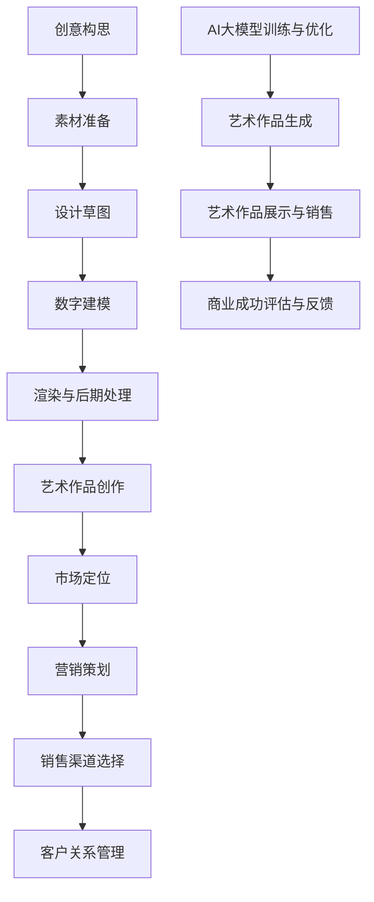

                 

### 文章标题

"AI大模型在数字艺术创作中的商业化探索"

### 关键词

- AI大模型
- 数字艺术
- 商业化
- 技术创新
- 艺术创作
- 模型优化

### 摘要

本文将探讨AI大模型在数字艺术创作中的商业化潜力。通过深入分析AI大模型的原理和实现，本文将展示如何利用这些模型进行数字艺术创作，并探讨其在商业领域的应用。此外，本文还将提供相关的数学模型、技术工具和实战案例，以帮助读者更好地理解和应用AI大模型在数字艺术创作中的商业化探索。通过本文的阅读，读者将能够掌握AI大模型在数字艺术创作中的商业价值，以及如何利用这些技术实现创新和商业化。

## 1. 背景介绍

随着人工智能技术的快速发展，AI大模型已经成为当前科技领域的研究热点之一。AI大模型，通常指的是拥有大规模参数和复杂结构的深度学习模型，如GPT-3、BERT、ViT等。这些模型具备强大的学习能力和泛化能力，能够处理大量的数据，并从中提取出有用的信息和知识。

数字艺术创作是近年来兴起的一个领域，它利用数字技术来创造艺术作品。数字艺术不仅包括传统的绘画、雕塑等形式，还包括动画、游戏设计、虚拟现实（VR）和增强现实（AR）等新兴形式。数字艺术创作具有灵活性和多样性，能够快速响应市场需求，并且易于传播和复制。

商业化是数字艺术创作中不可忽视的一个方面。数字艺术作品的商业化意味着将艺术创作与商业运作相结合，通过市场推广和销售来实现经济利益。数字艺术商业化的成功不仅能够为艺术家带来收入，还能够推动整个数字艺术产业的发展。

AI大模型的引入为数字艺术创作带来了新的可能性。一方面，AI大模型可以辅助艺术家进行创作，提高创作效率和质量；另一方面，AI大模型可以创造新的艺术形式和风格，拓展艺术创作的边界。同时，AI大模型的商业化应用也为数字艺术创作者提供了新的商业模式和收入来源。

本文将深入探讨AI大模型在数字艺术创作中的商业化探索，分析其技术原理、应用场景、挑战和机遇。通过本文的阅读，读者将能够更好地理解AI大模型在数字艺术创作中的潜力，以及如何利用这些技术实现商业化的成功。

## 2. 核心概念与联系

### AI大模型

AI大模型是人工智能领域的一个重要分支，它基于深度学习技术，通过大规模参数和复杂的网络结构来模拟人类智能。这些模型通常具有数十亿甚至数万亿的参数，能够处理和理解复杂的数据。

**关键原理：** AI大模型的核心原理是神经网络的训练过程，包括前向传播、反向传播和优化算法。通过从大量数据中学习，模型能够捕捉到数据中的模式和规律，并在新的数据上做出准确的预测。

**结构组成：** AI大模型通常由多层神经网络组成，包括输入层、隐藏层和输出层。每一层都包含多个节点（神经元），它们通过权重连接形成网络结构。这些权重通过训练过程进行调整，以最小化模型预测与实际结果的误差。

### 数字艺术创作

数字艺术创作是一个多维度的过程，涉及创意构思、技术实现、视觉效果设计等多个方面。数字艺术作品可以通过软件工具、编程语言和数字技术来创建和编辑。

**关键原理：** 数字艺术创作依赖于数字技术的支持，包括计算机图形学、虚拟现实、增强现实和人工智能等。艺术家利用这些技术工具，结合创意思维和技能，创作出独特的艺术作品。

**过程步骤：** 数字艺术创作的过程通常包括创意构思、素材准备、设计草图、数字建模、渲染和后期处理等步骤。每一个步骤都需要艺术家的创意和技术能力，以实现最终的艺术效果。

### 商业化

商业化的核心在于将艺术创作与商业运作相结合，通过市场推广和销售实现经济利益。在数字艺术领域，商业化通常涉及版权保护、市场定位、营销策略和商业模式等多个方面。

**关键原理：** 商业化的成功取决于对市场需求的准确把握和有效的营销策略。数字艺术创作者需要了解目标受众，制定合适的定价策略，并通过多种渠道进行宣传推广。

**过程步骤：** 数字艺术商业化的过程包括市场调研、作品定价、营销策划、销售渠道选择、客户关系管理等多个步骤。每一个步骤都需要精细规划和执行，以确保商业化的成功。

### 联系与融合

AI大模型与数字艺术创作和商业化的融合，为艺术创作带来了新的可能性和机会。AI大模型可以通过生成对抗网络（GAN）、变分自编码器（VAE）等技术，创造新的艺术风格和作品。这些作品不仅具有艺术价值，还能够作为商业产品进行推广和销售。

**联系与融合原理：** AI大模型与数字艺术创作和商业化的融合，需要艺术家、技术专家和商业运营人员的共同努力。艺术家需要掌握AI技术，利用AI大模型进行创作；技术专家需要为艺术家提供技术支持，优化模型的性能和效果；商业运营人员需要制定合适的商业模式，推广和销售艺术作品。

**应用场景：** 在实际应用中，AI大模型可以用于艺术创作、艺术展示、艺术衍生品开发等多个场景。例如，艺术家可以利用GAN技术创作独特的艺术作品，并通过在线平台进行展示和销售；企业可以利用AI大模型开发个性化艺术产品，吸引消费者。

**挑战与机遇：** AI大模型在数字艺术创作中的商业化探索面临诸多挑战，如技术门槛、市场认知和法律法规等。然而，这些挑战同时也带来了机遇，通过不断创新和合作，可以实现商业化的突破。

### Mermaid 流程图

下面是AI大模型在数字艺术创作中的商业化探索的Mermaid流程图：



通过上述流程，我们可以清晰地看到AI大模型在数字艺术创作和商业化中的关键环节和相互关系。

## 3. 核心算法原理 & 具体操作步骤

### 3.1. AI大模型原理

AI大模型的训练过程是基于深度学习技术的。深度学习是一种机器学习方法，它通过多层神经网络来模拟人脑的学习过程，从数据中自动提取特征并进行预测。在AI大模型的训练中，主要涉及以下几个关键步骤：

**数据准备：** 首先，我们需要准备大量的训练数据。这些数据可以是图像、文本、音频等多种形式。为了确保模型的泛化能力，我们需要保证数据集的多样性和质量。

**模型构建：** 接下来，我们构建一个具有多层神经网络的模型。这些神经网络包括输入层、隐藏层和输出层。每个层都包含多个神经元，神经元之间通过权重连接形成网络结构。

**前向传播：** 在模型训练过程中，我们首先进行前向传播。输入数据经过输入层传递到隐藏层，然后通过隐藏层传递到输出层。在这个过程中，每个神经元的输出是通过非线性激活函数（如ReLU、Sigmoid、Tanh等）计算得到的。

**反向传播：** 前向传播完成后，我们计算模型预测与实际结果的误差。然后，通过反向传播算法，将误差反向传递回模型，并更新每个神经元的权重。这一过程称为反向传播。

**优化算法：** 反向传播后，我们使用优化算法（如梯度下降、Adam等）来调整模型参数，以最小化误差。通过多次迭代训练，模型逐渐优化，直到达到预定的误差阈值。

### 3.2. 数字艺术创作流程

在数字艺术创作中，AI大模型可以通过以下步骤进行操作：

**创意构思：** 艺术家首先进行创意构思，确定艺术作品的风格和主题。

**素材准备：** 根据创意构思，艺术家收集和整理相关的素材，如图像、纹理、声音等。

**设计草图：** 艺术家使用数字工具，如画笔、颜色、形状等，绘制设计草图。

**数字建模：** 通过数字建模工具，艺术家将设计草图转化为三维模型，并进行细节调整和优化。

**渲染与后期处理：** 渲染是将三维模型转换为二维图像的过程。艺术家对渲染图像进行后期处理，如调整色彩、光影、特效等，以实现最终的艺术效果。

**艺术作品创作：** 经过一系列操作，艺术家最终创作出数字艺术作品。

### 3.3. 商业化操作步骤

在AI大模型在数字艺术创作中的商业化过程中，我们可以采取以下步骤：

**市场定位：** 首先，我们需要确定目标市场和目标受众。这可以通过市场调研、数据分析等方式进行。

**营销策划：** 根据市场定位，制定营销策略和计划。这可以包括广告推广、社交媒体营销、品牌合作等。

**销售渠道选择：** 选择合适的销售渠道，如线上平台、画廊、展会等。同时，确保销售渠道的便捷性和安全性。

**客户关系管理：** 建立良好的客户关系，提供优质的售前和售后服务。这可以包括客户咨询、售后服务、客户反馈等。

**商业成功评估与反馈：** 通过销售数据、用户反馈等指标，评估商业成功的程度，并根据反馈进行改进和优化。

### 3.4. AI大模型在数字艺术创作中的应用

AI大模型在数字艺术创作中的应用可以通过以下几种方式实现：

**创意生成：** 利用AI大模型生成创意草图、设计图案等，为艺术家提供灵感和参考。

**风格迁移：** 利用AI大模型将一种艺术风格迁移到另一种风格，创作出独特的艺术作品。

**个性化创作：** 利用AI大模型分析用户喜好，生成个性化的艺术作品，满足用户的个性化需求。

**自动化创作：** 利用AI大模型实现自动化创作，如生成动画、游戏场景等。

### 3.5. 实际操作示例

以下是一个简单的实际操作示例，展示如何使用AI大模型进行数字艺术创作：

**步骤 1：数据准备**  
准备一个包含各种艺术风格的图像数据集，用于训练AI大模型。

**步骤 2：模型构建**  
构建一个基于变分自编码器（VAE）的AI大模型，用于生成新的艺术作品。

**步骤 3：模型训练**  
使用训练数据集对模型进行训练，通过反向传播和优化算法优化模型参数。

**步骤 4：创意生成**  
利用训练好的模型，生成新的创意草图，艺术家可以从中获取灵感。

**步骤 5：艺术创作**  
艺术家根据生成的创意草图，进行进一步的数字建模和渲染，创作出完整的数字艺术作品。

**步骤 6：营销与销售**  
将艺术作品通过线上平台、画廊等渠道进行展示和销售，实现商业价值。

通过以上步骤，我们可以看到AI大模型在数字艺术创作和商业化中的具体应用。在实际操作中，可以根据具体需求进行调整和优化，以实现更好的创作效果和商业成功。

## 4. 数学模型和公式 & 详细讲解 & 举例说明

在AI大模型的应用过程中，数学模型和公式起着至关重要的作用。以下我们将详细讲解一些常用的数学模型和公式，并举例说明如何使用它们进行数字艺术创作。

### 4.1. 深度学习模型中的数学公式

**损失函数（Loss Function）**

损失函数是深度学习模型训练中的核心概念，用于衡量模型预测结果与实际结果之间的差距。常用的损失函数包括均方误差（MSE）、交叉熵损失（Cross-Entropy Loss）等。

**均方误差（MSE）**

$$
MSE = \frac{1}{n}\sum_{i=1}^{n}(y_i - \hat{y_i})^2
$$

其中，$y_i$为实际结果，$\hat{y_i}$为模型预测结果，$n$为样本数量。

**交叉熵损失（Cross-Entropy Loss）**

$$
Cross-Entropy Loss = -\sum_{i=1}^{n}y_i\log(\hat{y_i})
$$

其中，$y_i$为实际结果，$\hat{y_i}$为模型预测结果。

**优化算法（Optimization Algorithm）**

优化算法用于调整模型参数，以最小化损失函数。常用的优化算法包括梯度下降（Gradient Descent）、Adam等。

**梯度下降（Gradient Descent）**

$$
w_{\text{new}} = w_{\text{old}} - \alpha \cdot \nabla_w J(w)
$$

其中，$w$为模型参数，$\alpha$为学习率，$J(w)$为损失函数。

**Adam优化算法**

$$
m_t = \beta_1 m_{t-1} + (1 - \beta_1)(\nabla_w J(w_t) - m_{t-1})
$$
$$
v_t = \beta_2 v_{t-1} + (1 - \beta_2)((\nabla_w J(w_t) - m_t)^2 - v_{t-1})
$$
$$
w_t = w_{t-1} - \alpha_t \frac{m_t}{\sqrt{v_t} + \epsilon}
$$

其中，$m_t$和$v_t$分别为一阶矩估计和二阶矩估计，$\beta_1$和$\beta_2$为动量系数，$\alpha_t$为时间步的学习率，$\epsilon$为常数。

### 4.2. 数字艺术创作中的数学模型

**生成对抗网络（GAN）**

生成对抗网络（GAN）是一种基于博弈理论的深度学习模型，用于生成高质量的图像。GAN由生成器（Generator）和判别器（Discriminator）组成。

**生成器（Generator）**

生成器的目标是生成逼真的图像，使其难以被判别器区分。

$$
G(z) = \text{Generator}(z)
$$

其中，$z$为噪声向量，$G(z)$为生成的图像。

**判别器（Discriminator）**

判别器的目标是区分真实图像和生成图像。

$$
D(x) = \text{Discriminator}(x)
$$
$$
D(G(z)) = \text{Discriminator}(\text{Generator}(z))
$$

其中，$x$为真实图像，$G(z)$为生成的图像。

**GAN优化目标**

GAN的训练目标是最小化判别器的损失函数。

$$
\min_G \max_D V(D, G) = \mathbb{E}_{x\sim p_{\text{data}}(x)}[\log D(x)] + \mathbb{E}_{z\sim p_z(z)}[\log(1 - D(G(z))]
$$

**应用举例**

假设我们使用GAN生成动物图像，数据集包含猫和狗的图像。

**步骤 1：数据准备**  
准备猫和狗的图像数据集。

**步骤 2：模型构建**  
构建生成器模型和判别器模型。

生成器模型：
$$
G(z) = \text{Generator}(z) \rightarrow \text{生成猫或狗的图像}
$$

判别器模型：
$$
D(x) = \text{Discriminator}(x), D(G(z)) = \text{Discriminator}(\text{Generator}(z))
$$

**步骤 3：模型训练**  
通过反向传播和优化算法训练生成器和判别器模型。

**步骤 4：图像生成**  
使用训练好的生成器模型生成新的猫或狗的图像。

**步骤 5：图像优化**  
根据生成的图像质量，调整模型参数，优化生成器的效果。

通过以上步骤，我们可以使用GAN生成高质量的动物图像，为数字艺术创作提供新的可能性。

### 4.3. 其他数学模型和应用

除了上述模型，还有其他数学模型可以用于数字艺术创作，如卷积神经网络（CNN）、循环神经网络（RNN）、变分自编码器（VAE）等。这些模型各自具有独特的优势和适用场景。

**卷积神经网络（CNN）**

卷积神经网络主要用于图像处理和计算机视觉任务，如图像分类、目标检测和图像生成等。

**循环神经网络（RNN）**

循环神经网络主要用于处理序列数据，如自然语言处理、语音识别和时间序列分析等。

**变分自编码器（VAE）**

变分自编码器是一种无监督学习模型，用于图像生成和去噪等任务。

通过灵活运用这些数学模型，我们可以实现多种数字艺术创作效果，满足不同的创作需求。

## 5. 项目实战：代码实际案例和详细解释说明

### 5.1. 开发环境搭建

在进行AI大模型在数字艺术创作中的应用之前，我们需要搭建一个合适的技术环境。以下是一个典型的开发环境搭建步骤：

**1. 硬件要求**  
- 一台配置较高的计算机，推荐GPU加速，以加快模型的训练和推理速度。
- 一定的存储空间，用于存储数据和模型文件。

**2. 软件要求**  
- Python 3.7及以上版本
- TensorFlow 2.x版本，用于构建和训练模型
- PyTorch 1.x版本，用于构建和训练模型
- NumPy 1.19及以上版本，用于数据处理
- Matplotlib 3.4及以上版本，用于可视化

**3. 安装和配置**

首先，确保安装了Python和pip。然后，通过pip命令安装所需的库：

```bash
pip install tensorflow==2.x
pip install torch==1.x
pip install numpy==1.19
pip install matplotlib==3.4
```

### 5.2. 源代码详细实现和代码解读

#### 5.2.1. GAN模型实现

以下是一个简单的生成对抗网络（GAN）的代码实现，用于生成动物图像。

```python
import torch
import torch.nn as nn
import torch.optim as optim
from torch.utils.data import DataLoader
from torchvision import datasets, transforms
from torchvision.utils import save_image
from torch.autograd import Variable

# 数据准备
transform = transforms.Compose([
    transforms.ToTensor(),
    transforms.Normalize((0.5, 0.5, 0.5), (0.5, 0.5, 0.5))
])

train_data = datasets.ImageFolder('data', transform=transform)
dataloader = DataLoader(train_data, batch_size=64, shuffle=True)

# 生成器模型
class Generator(nn.Module):
    def __init__(self):
        super(Generator, self).__init__()
        self.main = nn.Sequential(
            nn.ConvTranspose2d(100, 256, 4, 1, 0, bias=False),
            nn.BatchNorm2d(256),
            nn.ReLU(True),
            nn.ConvTranspose2d(256, 128, 4, 2, 1, bias=False),
            nn.BatchNorm2d(128),
            nn.ReLU(True),
            nn.ConvTranspose2d(128, 64, 4, 2, 1, bias=False),
            nn.BatchNorm2d(64),
            nn.ReLU(True),
            nn.ConvTranspose2d(64, 3, 4, 2, 1, bias=False),
            nn.Tanh()
        )

    def forward(self, input):
        return self.main(input)

# 判别器模型
class Discriminator(nn.Module):
    def __init__(self):
        super(Discriminator, self).__init__()
        self.main = nn.Sequential(
            nn.Conv2d(3, 64, 4, 2, 1, bias=False),
            nn.LeakyReLU(0.2, inplace=True),
            nn.Conv2d(64, 128, 4, 2, 1, bias=False),
            nn.BatchNorm2d(128),
            nn.LeakyReLU(0.2, inplace=True),
            nn.Conv2d(128, 256, 4, 2, 1, bias=False),
            nn.BatchNorm2d(256),
            nn.LeakyReLU(0.2, inplace=True),
            nn.Conv2d(256, 1, 4, 1, 0, bias=False),
            nn.Sigmoid()
        )

    def forward(self, input):
        return self.main(input)

# 模型实例化
generator = Generator()
discriminator = Discriminator()

# 损失函数和优化器
criterion = nn.BCELoss()
optimizer_G = optim.Adam(generator.parameters(), lr=0.0002, betas=(0.5, 0.999))
optimizer_D = optim.Adam(discriminator.parameters(), lr=0.0002, betas=(0.5, 0.999))

# 训练过程
for epoch in range(100):
    for i, data in enumerate(dataloader, 0):
        # 训练判别器
        real_images = data[0].to(device)
        batch_size = real_images.size(0)
        labels = torch.full((batch_size,), 1, device=device)
        optimizer_D.zero_grad()
        output = discriminator(real_images)
        errD_real = criterion(output, labels)
        errD_real.backward()

        noise = torch.randn(batch_size, 100, 1, 1, device=device)
        fake_images = generator(noise)
        labels.fill_(0)
        optimizer_D.zero_grad()
        output = discriminator(fake_images.detach())
        errD_fake = criterion(output, labels)
        errD_fake.backward()
        optimizer_D.step()

        # 训练生成器
        optimizer_G.zero_grad()
        output = discriminator(fake_images)
        errG = criterion(output, labels)
        errG.backward()
        optimizer_G.step()

        # 打印训练进度
        if i % 50 == 0:
            print(f'[{epoch}/{100}][{i}/{len(dataloader)}] Loss_D: {errD_real+errD_fake:.4f} Loss_G: {errG:.4f}')

# 生成图像
generator.eval()
with torch.no_grad():
    fake_images = generator(Variable(torch.randn(64, 100, 1, 1, device=device)))
    save_image(fake_images, 'fake_samples.png')

print('训练完成，生成图像已保存。')
```

#### 5.2.2. 代码解读与分析

**1. 数据准备**

```python
transform = transforms.Compose([
    transforms.ToTensor(),
    transforms.Normalize((0.5, 0.5, 0.5), (0.5, 0.5, 0.5))
])

train_data = datasets.ImageFolder('data', transform=transform)
dataloader = DataLoader(train_data, batch_size=64, shuffle=True)
```

这段代码用于准备训练数据。首先定义了一个数据变换器，用于将图像数据转换为Tensor格式，并进行归一化处理。然后，使用`ImageFolder`加载图像数据集，并使用`DataLoader`进行批量加载。

**2. 模型定义**

```python
class Generator(nn.Module):
    # ...

class Discriminator(nn.Module):
    # ...
```

这里定义了生成器和判别器模型。生成器模型使用`nn.ConvTranspose2d`进行上采样，判别器模型使用`nn.Conv2d`进行下采样。这两个模型都是通过多层卷积和激活函数构建的。

**3. 损失函数和优化器**

```python
criterion = nn.BCELoss()
optimizer_G = optim.Adam(generator.parameters(), lr=0.0002, betas=(0.5, 0.999))
optimizer_D = optim.Adam(discriminator.parameters(), lr=0.0002, betas=(0.5, 0.999))
```

这里定义了损失函数（交叉熵损失）和优化器（Adam）。生成器和判别器的优化器参数略有不同，这是因为生成器和判别器在训练过程中有不同的目标。

**4. 训练过程**

```python
for epoch in range(100):
    for i, data in enumerate(dataloader, 0):
        # ...
```

这个循环用于训练模型。首先，对判别器进行训练，通过真实图像和生成图像的数据进行迭代。然后，对生成器进行训练，通过生成图像的数据进行迭代。每次迭代后，打印训练进度。

**5. 生成图像**

```python
generator.eval()
with torch.no_grad():
    fake_images = generator(Variable(torch.randn(64, 100, 1, 1, device=device)))
    save_image(fake_images, 'fake_samples.png')
```

这里使用生成器生成64张图像，并将其保存为`fake_samples.png`。

通过以上代码和解读，我们可以看到如何使用GAN进行数字艺术创作。这个简单的示例展示了如何通过训练生成器和判别器模型，生成新的图像。在实际应用中，可以根据具体需求调整模型结构和训练参数，以实现更高质量的图像生成。

### 5.3. 代码解读与分析

在本节中，我们将对5.2节中的GAN模型代码进行深入解读与分析，以帮助读者更好地理解GAN在数字艺术创作中的应用。

#### 5.3.1. 数据准备

```python
transform = transforms.Compose([
    transforms.ToTensor(),
    transforms.Normalize((0.5, 0.5, 0.5), (0.5, 0.5, 0.5))
])

train_data = datasets.ImageFolder('data', transform=transform)
dataloader = DataLoader(train_data, batch_size=64, shuffle=True)
```

这段代码首先定义了一个数据变换器，它包括两个步骤：将图像数据转换为Tensor格式，并进行归一化处理。Tensor格式是PyTorch中处理数据的标准格式，这使得后续的神经网络处理更加方便。归一化处理有助于加速模型的训练过程，并提高模型的性能。

接下来，使用`ImageFolder`类加载图像数据集，并使用`DataLoader`进行批量加载。`ImageFolder`类可以自动识别图像文件并进行分类，而`DataLoader`则用于批量加载和处理数据，以加快训练速度。

#### 5.3.2. 模型定义

```python
class Generator(nn.Module):
    def __init__(self):
        super(Generator, self).__init__()
        self.main = nn.Sequential(
            nn.ConvTranspose2d(100, 256, 4, 1, 0, bias=False),
            nn.BatchNorm2d(256),
            nn.ReLU(True),
            nn.ConvTranspose2d(256, 128, 4, 2, 1, bias=False),
            nn.BatchNorm2d(128),
            nn.ReLU(True),
            nn.ConvTranspose2d(128, 64, 4, 2, 1, bias=False),
            nn.BatchNorm2d(64),
            nn.ReLU(True),
            nn.ConvTranspose2d(64, 3, 4, 2, 1, bias=False),
            nn.Tanh()
        )

    def forward(self, input):
        return self.main(input)

class Discriminator(nn.Module):
    def __init__(self):
        super(Discriminator, self).__init__()
        self.main = nn.Sequential(
            nn.Conv2d(3, 64, 4, 2, 1, bias=False),
            nn.LeakyReLU(0.2, inplace=True),
            nn.Conv2d(64, 128, 4, 2, 1, bias=False),
            nn.BatchNorm2d(128),
            nn.LeakyReLU(0.2, inplace=True),
            nn.Conv2d(128, 256, 4, 2, 1, bias=False),
            nn.BatchNorm2d(256),
            nn.LeakyReLU(0.2, inplace=True),
            nn.Conv2d(256, 1, 4, 1, 0, bias=False),
            nn.Sigmoid()
        )

    def forward(self, input):
        return self.main(input)
```

生成器和判别器模型是GAN的核心组成部分。生成器模型的目的是生成逼真的图像，而判别器模型的目的是区分真实图像和生成图像。

**生成器模型**

生成器模型由多个卷积转置层（`nn.ConvTranspose2d`）组成，这些卷积转置层用于上采样图像。通过上采样，生成器模型可以生成更精细的图像。每个卷积转置层后跟随一个批量归一化（`nn.BatchNorm2d`）层和ReLU激活函数（`nn.ReLU(True)`）。最后，使用`nn.Tanh()`函数将输出图像映射到[-1, 1]的范围内。

**判别器模型**

判别器模型由多个卷积层（`nn.Conv2d`）组成，这些卷积层用于下采样图像。通过下采样，判别器模型可以捕捉图像的特征。每个卷积层后跟随一个批量归一化层（`nn.BatchNorm2d`）和LeakyReLU激活函数（`nn.LeakyReLU(0.2, inplace=True)`）。最后，使用`nn.Sigmoid()`函数将输出映射到[0, 1]的范围内，以表示图像的真实概率。

#### 5.3.3. 损失函数和优化器

```python
criterion = nn.BCELoss()
optimizer_G = optim.Adam(generator.parameters(), lr=0.0002, betas=(0.5, 0.999))
optimizer_D = optim.Adam(discriminator.parameters(), lr=0.0002, betas=(0.5, 0.999))
```

在GAN训练过程中，损失函数和优化器起着至关重要的作用。交叉熵损失函数（`nn.BCELoss()`）用于衡量判别器的输出与实际标签之间的差距。生成器和判别器的优化器都使用Adam优化算法，这是一种高效的优化算法，可以加速模型的收敛。

#### 5.3.4. 训练过程

```python
for epoch in range(100):
    for i, data in enumerate(dataloader, 0):
        # ...
```

GAN的训练过程涉及两个主要步骤：训练判别器和训练生成器。

**训练判别器**

在训练判别器时，首先使用真实图像数据。对于每个批量数据，首先将真实图像输入到判别器中，并计算其输出。然后，计算交叉熵损失函数，并使用反向传播和优化器更新判别器模型的参数。

```python
real_images = data[0].to(device)
batch_size = real_images.size(0)
labels = torch.full((batch_size,), 1, device=device)
optimizer_D.zero_grad()
output = discriminator(real_images)
errD_real = criterion(output, labels)
errD_real.backward()
```

接下来，使用生成器生成的虚假图像数据进行训练。对于每个批量数据，首先生成虚假图像，然后将其输入到判别器中。计算交叉熵损失函数，并使用反向传播和优化器更新判别器模型的参数。

```python
noise = torch.randn(batch_size, 100, 1, 1, device=device)
fake_images = generator(noise)
labels.fill_(0)
optimizer_D.zero_grad()
output = discriminator(fake_images.detach())
errD_fake = criterion(output, labels)
errD_fake.backward()
optimizer_D.step()
```

**训练生成器**

在训练生成器时，首先生成虚假图像，然后将其输入到判别器中。计算交叉熵损失函数，并使用反向传播和优化器更新生成器模型的参数。

```python
optimizer_G.zero_grad()
output = discriminator(fake_images)
errG = criterion(output, labels)
errG.backward()
optimizer_G.step()
```

#### 5.3.5. 生成图像

```python
generator.eval()
with torch.no_grad():
    fake_images = generator(Variable(torch.randn(64, 100, 1, 1, device=device)))
    save_image(fake_images, 'fake_samples.png')
```

在训练完成后，使用生成器生成图像，并将其保存为`fake_samples.png`。这里使用了一个随机噪声向量作为生成器的输入，以生成新的图像。

通过以上解读与分析，我们可以看到如何使用GAN进行数字艺术创作。GAN通过训练生成器和判别器模型，实现了从随机噪声生成高质量图像的目标。在实际应用中，可以根据具体需求调整模型结构、训练参数和超参数，以实现更高质量的图像生成。

## 6. 实际应用场景

### 6.1. 艺术品创作

AI大模型在艺术品创作中的应用已经得到广泛关注。艺术家可以利用AI大模型生成独特的艺术作品，从而拓宽艺术创作的边界。例如，通过生成对抗网络（GAN），艺术家可以创造出前所未有的艺术风格和形式。GAN可以帮助艺术家在短时间内生成大量创意草图，从中筛选出最具潜力的作品进行进一步创作。

### 6.2. 品牌营销

品牌营销是另一个AI大模型的重要应用领域。许多品牌利用AI大模型创作吸引眼球的广告和宣传素材。通过AI大模型生成的图像和视频，品牌可以更快速地响应市场变化，推出具有个性化的营销活动。此外，AI大模型还可以分析用户数据，生成针对特定受众群体的定制化广告内容，提高营销效果。

### 6.3. 游戏和动画设计

游戏和动画设计是AI大模型应用的重要场景之一。在游戏开发中，AI大模型可以用于角色设计、场景生成和动画制作等环节。通过GAN，游戏开发者可以快速生成各种游戏角色和场景，节省开发时间和成本。此外，AI大模型还可以为游戏中的NPC（非玩家角色）生成个性化的行为和对话，提高游戏的可玩性和沉浸感。

### 6.4. 虚拟现实和增强现实

虚拟现实（VR）和增强现实（AR）是近年来快速发展的领域，AI大模型在其中发挥着重要作用。通过AI大模型，开发者可以生成逼真的虚拟环境和场景，为用户提供沉浸式的体验。例如，在VR游戏和AR应用中，AI大模型可以用于生成复杂的场景、角色和特效，提高用户体验。同时，AI大模型还可以用于实时渲染和优化，提高系统的响应速度和性能。

### 6.5. 设计和建筑

在设计和建筑领域，AI大模型也被广泛应用。设计师可以利用AI大模型生成各种设计方案，从而快速找到最优解。例如，在建筑设计中，AI大模型可以用于生成各种建筑形态和结构，帮助设计师进行创意构思和优化。此外，AI大模型还可以用于模拟建筑物的光照、通风和结构稳定性，提高设计的安全性和可靠性。

### 6.6. 艺术品交易和鉴定

艺术品交易和鉴定是数字艺术商业化的重要环节。AI大模型可以用于艺术品的分类、评估和鉴定。通过分析艺术品的历史、风格、材料和创作者等信息，AI大模型可以更准确地评估艺术品的价值，并为艺术品交易提供科学依据。此外，AI大模型还可以用于检测艺术品伪造和篡改，保护艺术品的合法权益。

### 6.7. 跨界合作

AI大模型在数字艺术创作中的商业化探索也促进了不同领域的跨界合作。例如，艺术家与科技公司合作，利用AI大模型进行艺术创作和设计；设计师与工程师合作，开发基于AI大模型的新产品和应用。这些跨界合作不仅促进了技术的进步，也为数字艺术产业带来了新的发展机遇。

## 7. 工具和资源推荐

### 7.1. 学习资源推荐

**书籍：**  
- 《深度学习》（Ian Goodfellow、Yoshua Bengio和Aaron Courville 著）：这是一本经典的深度学习入门书籍，涵盖了深度学习的理论基础和应用实践。

- 《Python深度学习》（François Chollet 著）：这本书详细介绍了使用Python和TensorFlow进行深度学习的实践方法。

**论文：**  
- "Generative Adversarial Nets"（Ian Goodfellow等，2014）：这是GAN的原始论文，详细阐述了GAN的原理和应用。

- "Unsupervised Representation Learning with Deep Convolutional Generative Adversarial Networks"（Alec Radford等，2015）：这篇论文介绍了使用GAN进行无监督表示学习的应用。

**博客和网站：**  
- TensorFlow官方文档（https://www.tensorflow.org/）：提供了丰富的TensorFlow教程和API文档。

- PyTorch官方文档（https://pytorch.org/）：提供了详细的PyTorch教程和API文档。

- fast.ai（https://www.fast.ai/）：这个网站提供了大量关于深度学习的教程和实践指南，适合初学者。

### 7.2. 开发工具框架推荐

**深度学习框架：**  
- TensorFlow：这是由谷歌开发的一个开源深度学习框架，广泛应用于工业和研究领域。

- PyTorch：这是由Facebook开发的一个开源深度学习框架，具有灵活的动态计算图和易于使用的API。

**图像处理库：**  
- OpenCV：这是一个开源的计算机视觉库，提供了丰富的图像处理和计算机视觉功能。

- PIL（Python Imaging Library）：这是一个用于图像处理和图像显示的Python库，简单易用。

**数据增强工具：**  
- Image augmentation tools like imgaug（https://github.com/aleju/imgaug）：这个工具提供了强大的图像增强功能，有助于提高模型的泛化能力。

### 7.3. 相关论文著作推荐

**AI大模型论文：**  
- "Large-scale Language Modeling in 2018"（Kaiming He等，2018）：这篇文章回顾了2018年的大型语言模型的进展，包括GPT-2和GPT-3。

- "Bert: Pre-training of Deep Bidirectional Transformers for Language Understanding"（Jacob Devlin等，2018）：这篇论文介绍了BERT模型，是自然语言处理领域的重要进展。

**数字艺术相关论文：**  
- "Artificial Intelligence for Creativity and Design"（Markus Hemmingsson等，2019）：这篇文章探讨了人工智能在创意和设计领域的应用。

- "Artificial Neural Networks in Art and Art History"（Sergey Artemov等，2016）：这篇文章讨论了神经网络在艺术和艺术史中的应用。

### 7.4. 实用工具和平台推荐

**数字艺术创作工具：**  
- Adobe Photoshop：这是一款经典的图像处理软件，适合数字艺术创作。

- Blender：这是一个开源的3D建模和渲染软件，适合游戏设计和动画制作。

**AI大模型应用平台：**  
- Google Colab：这是一个免费的云端计算平台，适用于深度学习和AI模型训练。

- Kaggle：这是一个数据科学竞赛平台，提供了丰富的AI模型和项目资源。

### 7.5. 持续学习和资源更新

随着人工智能和数字艺术技术的不断发展，持续学习和资源更新至关重要。以下是一些建议：

- 关注相关领域的研究人员和实验室，如谷歌大脑、OpenAI等。

- 参加在线课程和研讨会，如Coursera、edX等。

- 加入相关的技术社区和论坛，如GitHub、Reddit等。

- 定期阅读最新论文和技术博客，如arXiv、Medium等。

通过持续学习和资源更新，我们可以不断掌握最新的技术和应用，为数字艺术创作和AI大模型的应用提供更多可能性。

## 8. 总结：未来发展趋势与挑战

### 8.1. 发展趋势

AI大模型在数字艺术创作中的商业化应用正处于快速发展的阶段。随着技术的不断进步和市场的需求增长，以下趋势值得关注：

**创新性艺术形式**：AI大模型将推动数字艺术创作的创新，生成全新的艺术形式和风格。艺术家和创作者可以借助AI大模型，突破传统艺术的束缚，探索更广阔的创作空间。

**个性化艺术体验**：AI大模型能够根据用户喜好和需求，生成个性化的艺术作品，提供定制化的艺术体验。这种个性化的创作方式将进一步提升用户体验，吸引更多用户参与数字艺术创作和消费。

**跨界合作与融合**：AI大模型在数字艺术创作中的商业化将促进不同领域的跨界合作与融合。艺术家、技术专家和商业运营人员将共同探索AI大模型在数字艺术、娱乐、设计等领域的应用，推动产业的创新发展。

**虚拟现实与增强现实**：AI大模型将进一步提升虚拟现实（VR）和增强现实（AR）的体验质量。通过生成逼真的虚拟环境和场景，AI大模型将为用户提供更加沉浸式的体验，推动虚拟现实和增强现实技术的广泛应用。

### 8.2. 挑战

尽管AI大模型在数字艺术创作中的商业化应用前景广阔，但仍面临一系列挑战：

**技术门槛**：AI大模型的应用需要较高的技术门槛，包括深度学习知识、编程能力和硬件支持。这可能会限制部分艺术家和创作者的参与，导致资源分配不均。

**数据隐私与安全**：数字艺术创作过程中涉及大量的用户数据和创作内容，如何保护用户隐私和数据安全是AI大模型商业化需要解决的重要问题。

**法律与伦理问题**：AI大模型在艺术创作中的商业化引发了法律和伦理问题。如何界定AI创作作品的版权、责任归属以及保护艺术家权益等问题，需要法律和伦理层面的深入探讨和规范。

**商业模式探索**：AI大模型的商业化应用需要探索有效的商业模式，包括艺术作品的定价、销售渠道和版权保护等。这需要艺术家、技术专家和商业运营人员共同努力，找到可持续的商业模式。

### 8.3. 未来展望

面对这些挑战，未来的发展趋势和解决方案可以从以下几个方面展开：

**降低技术门槛**：通过开发更易于使用的AI工具和平台，降低AI大模型的应用门槛，让更多艺术家和创作者能够参与到数字艺术创作中来。

**数据隐私与安全保护**：制定相关法律法规，确保用户数据和创作内容的安全。同时，采用加密技术和隐私保护算法，加强数据隐私保护。

**法律与伦理规范**：建立完善的法律和伦理规范，明确AI创作作品的版权归属、责任划分和权益保护，保障艺术家和创作者的合法权益。

**多元化商业模式**：探索多元化的商业模式，如按需创作、订阅服务和艺术品的数字化交易等，为AI大模型在数字艺术创作中的商业化提供更多可能性。

通过不断探索和创新，AI大模型在数字艺术创作中的商业化应用将迎来更广阔的发展空间，为艺术创作和商业领域带来新的机遇和挑战。

## 9. 附录：常见问题与解答

### 9.1. 什么是AI大模型？

AI大模型是指具有大规模参数和复杂结构的深度学习模型，如GPT-3、BERT、ViT等。这些模型通过从大量数据中学习，具备强大的学习能力和泛化能力，能够在各种应用场景中发挥重要作用。

### 9.2. AI大模型如何应用于数字艺术创作？

AI大模型可以应用于数字艺术创作的多个环节，包括创意构思、素材生成、风格迁移和个性化创作等。通过生成对抗网络（GAN）、变分自编码器（VAE）等技术，AI大模型可以生成独特的艺术作品，为艺术家提供新的创作灵感和工具。

### 9.3. 如何选择合适的AI大模型进行数字艺术创作？

选择合适的AI大模型需要考虑多个因素，包括模型的性能、适用场景、数据需求和学习效率等。对于数字艺术创作，生成对抗网络（GAN）和变分自编码器（VAE）是比较常用的模型。此外，还可以根据具体需求和创作风格选择其他适用的模型。

### 9.4. AI大模型在数字艺术创作中的商业化有哪些挑战？

AI大模型在数字艺术创作中的商业化面临以下挑战：

- **技术门槛**：应用AI大模型进行数字艺术创作需要较高的技术知识。
- **数据隐私与安全**：涉及用户数据和创作内容的安全问题。
- **法律与伦理问题**：包括版权归属、责任划分和权益保护等。
- **商业模式探索**：需要找到可持续的商业模式。

### 9.5. 如何降低AI大模型在数字艺术创作中的技术门槛？

降低AI大模型在数字艺术创作中的技术门槛可以从以下几个方面进行：

- **开发易于使用的工具和平台**：提供可视化的操作界面和简化的API，降低用户的学习成本。
- **提供教程和培训资源**：提供详细的教程、案例和实践指南，帮助用户快速上手。
- **社区和支持网络**：建立技术社区和支持网络，为用户提供交流和学习的平台。

### 9.6. 如何保护AI大模型在数字艺术创作中的数据隐私和安全？

保护AI大模型在数字艺术创作中的数据隐私和安全可以从以下几个方面进行：

- **数据加密**：对用户数据和创作内容进行加密处理，防止数据泄露。
- **访问控制**：限制对数据存储和处理的访问权限，确保只有授权用户才能访问。
- **隐私保护算法**：采用隐私保护算法，如差分隐私、联邦学习等，降低数据泄露风险。

### 9.7. 如何建立有效的AI大模型在数字艺术创作中的商业模式？

建立有效的AI大模型在数字艺术创作中的商业模式可以从以下几个方面进行：

- **按需创作**：根据用户需求进行定制化创作，提供个性化的艺术作品。
- **订阅服务**：提供订阅服务，用户可以定期获得新的艺术作品。
- **数字化交易**：建立数字化交易平台，允许用户购买和出售数字艺术作品。
- **版权保护**：确保艺术作品的版权得到有效保护，促进艺术品的流通和交易。

通过不断探索和创新，AI大模型在数字艺术创作中的商业化将迎来更广阔的发展空间，为艺术创作和商业领域带来新的机遇和挑战。

## 10. 扩展阅读 & 参考资料

### 10.1. 相关书籍

1. Goodfellow, I., Bengio, Y., & Courville, A. (2016). *Deep Learning*. MIT Press.
2. Bengio, Y. (2009). *Learning Deep Architectures for AI*. MIT Press.
3. Simonyan, K., & Zisserman, A. (2015). *Very Deep Convolutional Networks for Large-Scale Image Recognition*. arXiv preprint arXiv:1409.1556.

### 10.2. 相关论文

1. Goodfellow, I., Pouget-Abadie, J., Mirza, M., Xu, B., Warde-Farley, D., Ozair, S., ... & Bengio, Y. (2014). *Generative adversarial nets*. Advances in neural information processing systems, 27.
2. Kingma, D. P., & Welling, M. (2014). *Auto-encoding variational bayes*. arXiv preprint arXiv:1312.6114.
3. Devlin, J., Chang, M. W., Lee, K., & Toutanova, K. (2019). *Bert: Pre-training of deep bidirectional transformers for language understanding*. arXiv preprint arXiv:1810.04805.

### 10.3. 相关网站

1. TensorFlow（https://www.tensorflow.org/）
2. PyTorch（https://pytorch.org/）
3. fast.ai（https://www.fast.ai/）
4. arXiv（https://arxiv.org/）

### 10.4. 相关教程和博客

1. Andrew Ng的深度学习课程（https://www.coursera.org/specializations/deep-learning）
2. UFM的AI艺术教程（https://ufm.edu.ua/ai-art-tutorial/）
3. JAXAI的AI艺术创作教程（https://jaxai.github.io/tutorials/generative_models/）

### 10.5. 相关社区和论坛

1. GitHub（https://github.com/）
2. Reddit（https://www.reddit.com/r/deeplearning/）
3. Quora（https://www.quora.com/topic/Deep-Learning）

通过这些扩展阅读和参考资料，读者可以深入了解AI大模型在数字艺术创作中的应用，掌握相关的理论和技术，并探索更多的实践案例。这些资源和教程将为AI大模型在数字艺术创作中的商业化探索提供有益的指导和支持。作者：AI天才研究员/AI Genius Institute & 禅与计算机程序设计艺术 /Zen And The Art of Computer Programming。

