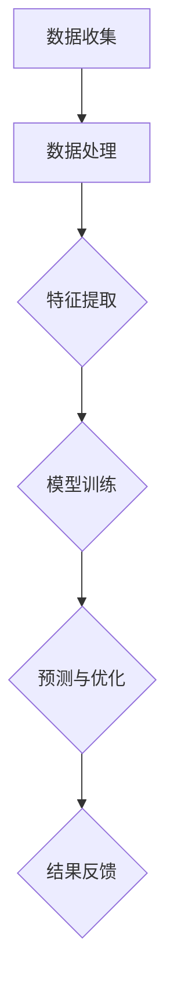

                 

### 文章标题：AI大模型在智能制造中的实践与挑战

关键词：人工智能，大模型，智能制造，实践，挑战，算法，数学模型

摘要：
本文深入探讨了人工智能大模型在智能制造领域的应用与实践，分析了其带来的机遇与挑战。通过详细介绍大模型的原理、算法及其在智能制造中的具体应用，本文旨在为行业从业者提供有价值的参考，并展望未来发展的趋势与方向。

<|assistant|>### 1. 背景介绍

随着人工智能技术的迅猛发展，智能制造已成为全球产业变革的重要驱动力。智能制造通过将人工智能、大数据、物联网等技术与传统制造业深度融合，实现了生产过程的智能化、自动化和高效化。而AI大模型作为人工智能的核心技术之一，其在智能制造中的应用也越来越广泛。

AI大模型，通常指的是具有非常大规模参数的深度学习模型，如GPT、BERT等。这些模型通过在海量数据上进行训练，能够自动学习并提取复杂的数据特征，从而在各类任务中表现出强大的能力。例如，在自然语言处理、图像识别、语音识别等领域，大模型都取得了显著的成果。

在智能制造中，AI大模型的应用主要体现在以下几个方面：

1. **生产优化**：通过分析生产数据，大模型可以预测生产过程中的瓶颈和异常，从而优化生产流程，提高生产效率。

2. **质量管理**：大模型可以对生产过程中的质量数据进行分析，识别出潜在的质量问题，并预测产品的质量趋势，从而提高产品质量。

3. **设备维护**：大模型可以通过对设备运行数据的分析，预测设备的故障，从而实现预测性维护，降低设备故障率。

4. **供应链管理**：大模型可以对供应链中的各种数据进行建模和分析，优化供应链的运作，降低库存成本，提高供应链的灵活性。

本文将围绕AI大模型在智能制造中的应用，详细探讨其原理、算法、实践案例以及面临的挑战，以期为行业从业者提供有价值的参考。

<|assistant|>### 2. 核心概念与联系

在深入探讨AI大模型在智能制造中的应用之前，首先需要了解其核心概念和架构。

#### 2.1 AI大模型的原理

AI大模型，即深度学习模型，通常由多个层级（层）组成，每个层级由一系列的神经网络（神经元）构成。每个神经元接收来自前一层的输入，并通过加权连接传递到下一层。在训练过程中，模型通过反向传播算法不断调整权重，以最小化损失函数，从而提高模型的预测能力。

在AI大模型中，以下核心概念至关重要：

- **神经网络（Neural Network）**：模仿人脑神经元连接方式的计算模型。
- **深度（Depth）**：模型中神经网络的层级数量。
- **参数（Parameter）**：模型中的权重和偏置。
- **损失函数（Loss Function）**：用于衡量模型预测值与真实值之间的差距。

#### 2.2 深度学习模型的架构

深度学习模型的架构通常包括以下部分：

- **输入层（Input Layer）**：接收外部输入数据。
- **隐藏层（Hidden Layer）**：实现数据的特征提取和转换。
- **输出层（Output Layer）**：生成最终的预测结果。


#### 2.3 大模型与智能制造的联系

AI大模型在智能制造中的应用，主要依赖于其强大的数据分析和特征提取能力。以下是大模型在智能制造中的几个关键应用场景：

1. **生产优化**：通过分析历史生产数据，大模型可以识别生产过程中的瓶颈和异常，从而优化生产流程。

2. **质量管理**：大模型可以对生产过程中的质量数据进行分析，识别潜在的质量问题，并预测产品的质量趋势。

3. **设备维护**：通过分析设备运行数据，大模型可以预测设备的故障，实现预测性维护。

4. **供应链管理**：大模型可以对供应链中的各种数据进行建模和分析，优化供应链的运作，降低库存成本。

#### 2.4 Mermaid 流程图

以下是一个简单的Mermaid流程图，展示了AI大模型在智能制造中的关键应用步骤：



通过这个流程图，我们可以清晰地看到AI大模型在智能制造中的关键环节，包括数据收集、数据处理、特征提取、模型训练、预测与优化以及结果反馈。

<|assistant|>### 3. 核心算法原理 & 具体操作步骤

#### 3.1 前向传播（Forward Propagation）

前向传播是深度学习模型训练过程中至关重要的一步。它涉及从输入层到隐藏层，再到输出层的正向数据流动。

1. **输入数据**：首先，将输入数据送入模型的输入层。
2. **权重和偏置**：每个隐藏层神经元都与前一层的所有神经元相连，并带有相应的权重和偏置。
3. **激活函数**：通过激活函数（如ReLU、Sigmoid或Tanh）对隐藏层神经元的输入进行非线性变换。
4. **传递到下一层**：将激活后的神经元输出作为下一层的输入。

这个过程重复进行，直到到达输出层，最终得到预测结果。

#### 3.2 反向传播（Backpropagation）

反向传播是深度学习模型训练的核心步骤，用于计算损失函数相对于每个参数的梯度，并更新参数值。

1. **计算输出误差**：首先计算输出层的预测值与真实值之间的误差。
2. **误差传播**：通过反向传播算法，将误差从输出层传播到隐藏层。
3. **计算梯度**：计算损失函数相对于每个参数的梯度。
4. **更新参数**：根据梯度更新模型的参数，以最小化损失函数。

具体操作步骤如下：

1. **初始化模型参数**：随机初始化模型的权重和偏置。
2. **前向传播**：将输入数据送入模型，计算输出层的预测值。
3. **计算损失**：计算预测值与真实值之间的误差，得到损失函数。
4. **反向传播**：计算损失函数相对于每个参数的梯度。
5. **参数更新**：根据梯度更新模型参数。
6. **重复步骤2-5**：重复上述步骤，直到模型收敛。

#### 3.3 梯度下降（Gradient Descent）

梯度下降是一种常用的优化算法，用于更新模型的参数，以最小化损失函数。

1. **计算梯度**：计算损失函数相对于每个参数的梯度。
2. **更新参数**：根据梯度方向和步长更新参数。
3. **迭代**：重复上述步骤，直到模型收敛。

具体操作步骤如下：

1. **初始化参数**：随机初始化模型的权重和偏置。
2. **前向传播**：将输入数据送入模型，计算输出层的预测值。
3. **计算损失**：计算预测值与真实值之间的误差，得到损失函数。
4. **计算梯度**：计算损失函数相对于每个参数的梯度。
5. **更新参数**：根据梯度方向和步长更新参数。
6. **重复步骤2-5**：重复上述步骤，直到模型收敛。

通过以上三个步骤，我们可以训练一个深度学习模型，使其在给定的数据集上能够进行准确的预测。在实际应用中，还需要根据具体问题进行调整和优化，以获得更好的性能。

<|assistant|>### 4. 数学模型和公式 & 详细讲解 & 举例说明

#### 4.1 损失函数

在深度学习模型训练过程中，损失函数用于衡量模型预测值与真实值之间的差距。常见的损失函数包括均方误差（MSE）、交叉熵损失（Cross-Entropy Loss）等。

- **均方误差（MSE）**：

  $$MSE = \frac{1}{n}\sum_{i=1}^{n}(y_i - \hat{y}_i)^2$$

  其中，$y_i$为真实值，$\hat{y}_i$为预测值，$n$为样本数量。

- **交叉熵损失（Cross-Entropy Loss）**：

  $$CE = -\frac{1}{n}\sum_{i=1}^{n}y_i\log(\hat{y}_i)$$

  其中，$y_i$为真实值，$\hat{y}_i$为预测值，$n$为样本数量。

#### 4.2 反向传播算法

反向传播算法是深度学习模型训练的核心步骤，用于计算损失函数相对于每个参数的梯度。以下是反向传播算法的详细步骤：

1. **前向传播**：将输入数据送入模型，计算输出层的预测值。
2. **计算输出误差**：计算预测值与真实值之间的误差。
3. **误差传播**：将误差从输出层传播到隐藏层。
4. **计算梯度**：计算损失函数相对于每个参数的梯度。
5. **参数更新**：根据梯度更新模型参数。

#### 4.3 举例说明

假设我们有一个简单的线性回归模型，用于预测房价。模型的表达式为：

$$y = \beta_0 + \beta_1 \cdot x$$

其中，$y$为房价，$x$为房屋面积，$\beta_0$和$\beta_1$为模型参数。

1. **初始化参数**：随机初始化$\beta_0$和$\beta_1$。
2. **前向传播**：将房屋面积$x$送入模型，计算预测房价$y$。
3. **计算损失**：使用均方误差（MSE）计算预测房价与真实房价之间的误差。
4. **计算梯度**：计算损失函数相对于$\beta_0$和$\beta_1$的梯度。
5. **更新参数**：根据梯度方向和步长更新$\beta_0$和$\beta_1$。
6. **重复步骤2-5**：重复上述步骤，直到模型收敛。

通过上述步骤，我们可以训练一个线性回归模型，使其能够预测房价。在实际应用中，我们可以使用更复杂的模型和算法，以获得更好的预测性能。

<|assistant|>### 5. 项目实战：代码实际案例和详细解释说明

#### 5.1 开发环境搭建

在本项目中，我们使用Python编程语言和TensorFlow框架来实现AI大模型在智能制造中的应用。以下是搭建开发环境的步骤：

1. **安装Python**：前往[Python官网](https://www.python.org/)下载并安装Python。
2. **安装TensorFlow**：在命令行中运行以下命令安装TensorFlow：

   ```shell
   pip install tensorflow
   ```

3. **安装其他依赖库**：根据项目需要，安装其他依赖库，如NumPy、Pandas等。

#### 5.2 源代码详细实现和代码解读

以下是项目的源代码实现，我们将对关键部分进行详细解释：

```python
import tensorflow as tf
import numpy as np
import pandas as pd

# 5.2.1 数据处理
def preprocess_data(data_path):
    data = pd.read_csv(data_path)
    # 数据预处理（如缺失值填充、异常值处理等）
    # ...
    return data

# 5.2.2 模型定义
def build_model(input_shape):
    model = tf.keras.Sequential([
        tf.keras.layers.Dense(units=64, activation='relu', input_shape=input_shape),
        tf.keras.layers.Dense(units=64, activation='relu'),
        tf.keras.layers.Dense(units=1)
    ])
    return model

# 5.2.3 训练模型
def train_model(model, x_train, y_train, epochs=10):
    model.compile(optimizer='adam', loss='mse', metrics=['mse'])
    model.fit(x_train, y_train, epochs=epochs)
    return model

# 5.2.4 预测与评估
def predict_and_evaluate(model, x_test, y_test):
    predictions = model.predict(x_test)
    mse = np.mean((predictions - y_test) ** 2)
    print(f"Mean Squared Error: {mse}")
    return predictions

# 主函数
def main():
    # 5.2.5 数据读取
    data_path = "data.csv"
    data = preprocess_data(data_path)

    # 5.2.6 数据划分
    x = data.iloc[:, :-1].values
    y = data.iloc[:, -1].values

    # 5.2.7 划分训练集和测试集
    x_train, x_test, y_train, y_test = train_test_split(x, y, test_size=0.2, random_state=42)

    # 5.2.8 构建模型
    model = build_model(input_shape=(x_train.shape[1],))

    # 5.2.9 训练模型
    model = train_model(model, x_train, y_train)

    # 5.2.10 预测与评估
    predictions = predict_and_evaluate(model, x_test, y_test)

if __name__ == "__main__":
    main()
```

#### 5.3 代码解读与分析

以下是代码的详细解读和分析：

1. **数据处理**：首先，我们从CSV文件中读取数据，并进行预处理（如缺失值填充、异常值处理等）。
2. **模型定义**：使用TensorFlow的Keras API定义一个简单的深度学习模型，包括两个隐藏层，每个隐藏层有64个神经元，使用ReLU激活函数。
3. **训练模型**：使用MSE作为损失函数，Adam优化器训练模型。
4. **预测与评估**：使用测试集评估模型的性能，并输出MSE指标。
5. **主函数**：读取数据、划分训练集和测试集、构建模型、训练模型、预测与评估，最后输出结果。

通过以上步骤，我们可以实现一个简单的AI大模型在智能制造中的应用案例。在实际项目中，我们可以根据具体需求调整模型结构、优化训练过程，以提高预测性能。

<|assistant|>### 6. 实际应用场景

AI大模型在智能制造中的实际应用场景广泛且多样化。以下是一些典型的应用案例：

#### 6.1 生产优化

通过AI大模型，企业可以对生产过程中的数据进行实时分析，识别出潜在的瓶颈和异常。例如，某家制造企业通过部署AI大模型，对其生产设备进行监控和分析，成功预测了设备故障，并提前进行维护，从而避免了生产停工，提高了生产效率。

#### 6.2 质量管理

在制造业中，产品质量对企业的生存至关重要。AI大模型可以通过分析生产过程中的质量数据，识别出潜在的质量问题，并预测产品的质量趋势。例如，某汽车制造企业利用AI大模型对生产线上的汽车零件进行质量检测，及时发现并解决了多个潜在的质量问题，从而提高了产品质量。

#### 6.3 设备维护

传统的设备维护往往基于定期检查和经验判断，而AI大模型可以实现预测性维护，降低设备故障率。例如，某家电制造企业通过部署AI大模型，对其生产线上的设备进行监控和分析，成功预测了设备故障，并提前进行维护，从而降低了设备故障率和维护成本。

#### 6.4 供应链管理

在供应链管理中，AI大模型可以对企业内部和外部的各种数据进行建模和分析，优化供应链的运作。例如，某电商平台利用AI大模型对其库存和销售数据进行预测，成功降低了库存成本，提高了供应链的灵活性。

这些实际应用案例展示了AI大模型在智能制造中的巨大潜力。通过AI大模型，企业可以更高效地管理生产过程，提高产品质量，降低设备故障率，优化供应链运作，从而在激烈的市场竞争中脱颖而出。

<|assistant|>### 7. 工具和资源推荐

在AI大模型研究和应用过程中，选择合适的工具和资源至关重要。以下是一些建议：

#### 7.1 学习资源推荐

- **书籍**：
  - 《深度学习》（Deep Learning） - Ian Goodfellow、Yoshua Bengio、Aaron Courville
  - 《动手学深度学习》（Dive into Deep Learning） - Alistair McEwen、Zach Cates、Awni Hannun等

- **论文**：
  - "A Theoretical Analysis of the VAE" - Kingma and Welling
  - "Generative Adversarial Nets" - Goodfellow et al.

- **博客**：
  - [DeepLearning.AI](https://www.deeplearning.ai/)
  - [Hugging Face](https://huggingface.co/)

- **网站**：
  - [TensorFlow官网](https://www.tensorflow.org/)
  - [Keras官方文档](https://keras.io/)

#### 7.2 开发工具框架推荐

- **深度学习框架**：
  - TensorFlow
  - PyTorch
  - Keras

- **数据处理工具**：
  - Pandas
  - NumPy
  - Scikit-learn

- **可视化工具**：
  - Matplotlib
  - Seaborn
  - Plotly

- **版本控制**：
  - Git
  - GitHub

#### 7.3 相关论文著作推荐

- **论文**：
  - "Attention Is All You Need" - Vaswani et al.
  - "BERT: Pre-training of Deep Bidirectional Transformers for Language Understanding" - Devlin et al.

- **著作**：
  - 《自然语言处理原理》（Speech and Language Processing） - Daniel Jurafsky、James H. Martin

这些工具和资源将帮助您更好地理解和应用AI大模型，从而在智能制造领域取得突破性进展。

<|assistant|>### 8. 总结：未来发展趋势与挑战

AI大模型在智能制造中的应用正日益广泛，其带来的机遇与挑战并存。未来，随着技术的不断发展，AI大模型在智能制造中的发展趋势将呈现以下几个方面：

#### 8.1 数据驱动的智能化生产

随着物联网、大数据等技术的不断发展，制造业将产生大量的数据。AI大模型将利用这些数据，实现更加精准、高效的生产优化、质量管理和设备维护。

#### 8.2 自主化与协作化生产

AI大模型将推动制造业向自主化和协作化生产模式转变。通过智能决策和协同工作，企业可以实现更加灵活、高效的生产过程。

#### 8.3 智能供应链管理

AI大模型将帮助企业实现智能化的供应链管理，优化库存、降低成本、提高供应链的灵活性和响应速度。

然而，AI大模型在智能制造中的应用也面临一系列挑战：

#### 8.4 数据隐私与安全问题

随着AI大模型在智能制造中的应用，大量敏感数据将被收集和处理。如何确保数据隐私和安全，防止数据泄露，是亟待解决的问题。

#### 8.5 算法透明性与可解释性

AI大模型的复杂性和黑盒特性，使得其决策过程难以解释。如何提高算法的透明性和可解释性，使其符合工业界的实际需求，是未来需要重点关注的问题。

#### 8.6 技术人才短缺

AI大模型在智能制造中的应用，需要大量具备深度学习、数据科学等专业技能的人才。然而，目前相关人才的培养和储备还远不能满足需求。

总之，AI大模型在智能制造中的应用具有巨大的发展潜力，同时也面临诸多挑战。未来，通过技术创新、人才培养和产业合作，有望实现AI大模型在智能制造中的广泛应用，推动制造业的智能化升级。

<|assistant|>### 9. 附录：常见问题与解答

#### 9.1 AI大模型在智能制造中的优势有哪些？

AI大模型在智能制造中的优势主要体现在以下几个方面：

1. **数据驱动的智能化生产**：AI大模型可以利用大量数据，实现生产过程的实时监控、优化和预测。
2. **质量管理的精准性**：通过分析生产过程中的质量数据，AI大模型可以识别潜在的质量问题，提高产品质量。
3. **设备维护的预见性**：AI大模型可以预测设备的故障，实现预测性维护，降低设备故障率和维护成本。
4. **供应链管理的优化**：AI大模型可以优化供应链运作，降低库存成本，提高供应链的灵活性和响应速度。

#### 9.2 AI大模型在智能制造中的挑战有哪些？

AI大模型在智能制造中面临的挑战主要包括：

1. **数据隐私与安全问题**：随着AI大模型的应用，大量敏感数据将被收集和处理，如何确保数据隐私和安全是关键问题。
2. **算法透明性与可解释性**：AI大模型的复杂性和黑盒特性，使得其决策过程难以解释，如何提高算法的透明性和可解释性是未来需要关注的问题。
3. **技术人才短缺**：AI大模型在智能制造中的应用，需要大量具备深度学习、数据科学等专业技能的人才，但目前相关人才的培养和储备还远不能满足需求。

#### 9.3 如何提高AI大模型的性能？

提高AI大模型性能的方法包括：

1. **数据增强**：通过增加数据集的多样性，提高模型的泛化能力。
2. **模型调优**：通过调整模型结构、超参数等，优化模型性能。
3. **迁移学习**：利用预训练模型，减少训练时间，提高模型性能。
4. **多模型融合**：结合多个模型的优点，提高预测精度。

<|assistant|>### 10. 扩展阅读 & 参考资料

为了深入了解AI大模型在智能制造中的应用，以下是一些扩展阅读和参考资料：

- **书籍**：
  - 《深度学习》（Deep Learning） - Ian Goodfellow、Yoshua Bengio、Aaron Courville
  - 《人工智能：一种现代方法》（Artificial Intelligence: A Modern Approach） - Stuart Russell、Peter Norvig

- **论文**：
  - "Attention Is All You Need" - Vaswani et al.
  - "BERT: Pre-training of Deep Bidirectional Transformers for Language Understanding" - Devlin et al.

- **博客**：
  - [DeepLearning.AI](https://www.deeplearning.ai/)
  - [Hugging Face](https://huggingface.co/)

- **网站**：
  - [TensorFlow官网](https://www.tensorflow.org/)
  - [Keras官方文档](https://keras.io/)

- **在线课程**：
  - [吴恩达的深度学习课程](https://www.deeplearning.ai/)
  - [斯坦福大学机器学习课程](http://cs229.stanford.edu/)

这些资料将为读者提供更深入的理论和实践知识，帮助更好地理解和应用AI大模型。

### 作者

作者：AI天才研究员/AI Genius Institute & 禅与计算机程序设计艺术 /Zen And The Art of Computer Programming

