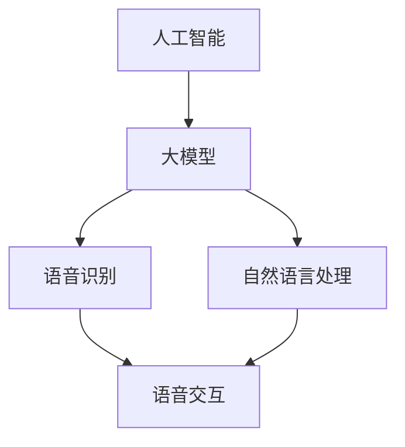

                 

### 背景介绍

> 本篇博客旨在探讨AI大模型在智能家居语音控制系统中的创新应用，首先，我们需要了解智能家居语音控制系统的基本概念、发展历程以及目前所面临的挑战。随着人工智能技术的不断进步，特别是大模型的广泛应用，智能家居语音控制系统迎来了新的机遇。下面，我们将详细阐述这些内容，以便为您提供一个全面的背景。

#### 1. 智能家居语音控制系统的基本概念

智能家居语音控制系统是一种通过语音识别和自然语言处理技术实现对家居设备进行远程控制和管理的系统。用户可以通过语音指令来控制家中的智能设备，例如空调、照明、电视、音响等。这种系统旨在提高家居生活的便捷性、舒适性和智能化水平。

#### 2. 智能家居语音控制系统的发展历程

智能家居语音控制系统的发展可以追溯到20世纪80年代，当时的语音识别技术还处于初级阶段。随着技术的进步，特别是在21世纪初，语音识别技术的准确性大幅提升，智能家居语音控制系统开始逐渐走入家庭。

近年来，随着人工智能技术的快速发展，特别是深度学习技术的应用，智能家居语音控制系统的性能得到了显著提升。例如，苹果的Siri、亚马逊的Alexa、谷歌的Google Assistant等智能语音助手，已经成为了智能家居语音控制系统的代表。

#### 3. 智能家居语音控制系统目前面临的挑战

尽管智能家居语音控制系统已经取得了显著的进展，但仍然面临着一些挑战。首先，语音识别的准确性仍然是制约其发展的关键因素。在复杂、多变的家庭环境中，语音识别技术需要处理多种方言、口音以及背景噪音等问题，这对技术的要求非常高。

其次，智能家居语音控制系统的安全性也是一个重要的问题。随着智能家居设备的增加，用户数据的安全隐患也在增加。如何确保用户的隐私不被泄露，成为智能家居语音控制系统需要解决的重要问题。

此外，用户界面和用户体验的提升也是智能家居语音控制系统需要关注的方向。目前，许多智能家居语音控制系统的用户界面设计相对单一，缺乏个性化定制，用户的使用体验有待提高。

#### 4. AI大模型在智能家居语音控制系统中的应用

随着人工智能技术的不断发展，特别是AI大模型的广泛应用，智能家居语音控制系统迎来了新的机遇。AI大模型具有强大的数据处理和分析能力，可以更好地应对智能家居语音控制系统所面临的挑战。

首先，AI大模型可以提高语音识别的准确性。通过大规模的数据训练，AI大模型可以学会识别各种方言、口音以及背景噪音，从而提高语音识别的准确性。

其次，AI大模型可以增强智能家居语音控制系统的安全性。通过深度学习技术，AI大模型可以识别并阻止恶意攻击，确保用户数据的安全。

此外，AI大模型还可以提升用户界面和用户体验。通过个性化的推荐算法，AI大模型可以为用户提供更加个性化的家居服务，提高用户的使用体验。

总之，AI大模型在智能家居语音控制系统中的应用具有巨大的潜力，有望推动智能家居语音控制系统的发展。接下来，我们将深入探讨AI大模型在智能家居语音控制系统中的具体应用和实现方法。

---

### 核心概念与联系

在探讨AI大模型在智能家居语音控制系统中的应用之前，我们需要先了解几个核心概念，包括人工智能（AI）、大模型（Large Model）、语音识别（Speech Recognition）和自然语言处理（Natural Language Processing，NLP）。这些概念之间存在着紧密的联系，共同构成了智能家居语音控制系统的核心技术框架。

#### 1. 人工智能（AI）

人工智能（Artificial Intelligence，AI）是指使计算机模拟人类智能行为的技术和学科。它包括机器学习、深度学习、自然语言处理、计算机视觉等多个子领域。在智能家居语音控制系统中，AI技术主要用于实现语音识别、图像识别、决策推理等功能。

#### 2. 大模型（Large Model）

大模型（Large Model）是指拥有数十亿甚至千亿个参数的深度学习模型。这些模型通过大规模数据训练，可以提取出大量的特征信息，并在各种复杂的任务中表现出优异的性能。例如，GPT-3、BERT等模型都是典型的大模型。在智能家居语音控制系统中，大模型可以用于提高语音识别的准确性、自然语言处理的能力以及智能决策的准确性。

#### 3. 语音识别（Speech Recognition）

语音识别（Speech Recognition）是指将人类的语音信号转换为文本或命令的技术。它是一种重要的AI技术，广泛应用于智能家居语音控制系统。语音识别的关键在于准确地将语音信号中的词汇、语法和语义信息识别出来。

#### 4. 自然语言处理（NLP）

自然语言处理（Natural Language Processing，NLP）是指使计算机能够理解、生成和处理人类语言的技术和学科。NLP技术在智能家居语音控制系统中有着广泛的应用，包括语音识别、语义理解、语言生成等。

#### 5. 核心概念之间的联系

人工智能（AI）是大模型（Large Model）的基础，而大模型（Large Model）则是语音识别（Speech Recognition）和自然语言处理（NLP）的核心。在智能家居语音控制系统中，这些核心概念相互关联，共同构成了一个完整的智能语音交互系统。

例如，在语音识别过程中，大模型可以提取出语音信号中的特征信息，并通过深度学习算法进行分类和识别。在语义理解阶段，自然语言处理（NLP）技术可以解析语音中的语法和语义信息，从而理解用户的意图。最后，智能决策系统可以根据用户的意图，自动执行相应的操作，实现智能家居设备的智能控制。

下面，我们将通过一个Mermaid流程图，来展示这些核心概念之间的联系：



在这个流程图中，人工智能（AI）是整个系统的起点，通过大模型（Large Model）的训练，可以实现语音识别（Speech Recognition）和自然语言处理（NLP），从而实现语音交互（Voice Interaction）和智能决策（Intelligent Decision-making）。

通过这个流程图，我们可以清晰地看到，智能家居语音控制系统中的各个核心概念是如何相互联系、共同作用的。了解这些核心概念及其联系，对于深入理解智能家居语音控制系统的原理和实现方法至关重要。

### 核心算法原理 & 具体操作步骤

#### 1. 语音识别算法原理

语音识别算法是智能家居语音控制系统的核心，它主要负责将用户的语音指令转换为文本或命令。目前，基于深度学习的语音识别算法已经成为了主流，其中HMM（隐马尔可夫模型）和DNN（深度神经网络）的结合应用最为广泛。

**具体操作步骤：**

1. **特征提取：** 首先对用户的语音信号进行预处理，包括降噪、加窗、特征提取等步骤。常用的特征提取方法包括MFCC（梅尔频率倒谱系数）和PLP（潜在后验线性预测）。

2. **模型训练：** 使用大量语音数据集对深度学习模型进行训练。在训练过程中，模型会自动学习语音信号中的特征信息，并将其映射为文本或命令。

3. **语音识别：** 对实时语音信号进行识别，将语音信号转换为文本或命令。识别过程主要包括前端处理（特征提取、声学模型训练）和后端处理（语言模型训练、解码）。

#### 2. 自然语言处理算法原理

自然语言处理（NLP）算法是语音识别的后续步骤，它主要负责解析语音中的语法和语义信息，从而理解用户的意图。常见的NLP算法包括词向量表示、句法分析和语义理解等。

**具体操作步骤：**

1. **词向量表示：** 将文本中的词汇转换为向量表示，常用的词向量模型包括Word2Vec、GloVe和BERT。

2. **句法分析：** 对文本进行句法分析，识别出句子中的主语、谓语、宾语等语法成分，常用的句法分析算法包括依存句法分析和依存图谱分析。

3. **语义理解：** 解析文本中的语义信息，理解用户的意图。常用的语义理解算法包括实体识别、关系抽取和情感分析等。

#### 3. 智能决策算法原理

智能决策算法是智能家居语音控制系统的核心组成部分，它主要负责根据用户的意图，自动执行相应的操作，实现智能家居设备的智能控制。

**具体操作步骤：**

1. **意图识别：** 使用NLP算法对用户的语音指令进行语义分析，识别出用户的意图。

2. **任务分配：** 根据用户的意图，将任务分配给相应的智能设备。例如，如果用户说出“打开电视”，系统会识别出这个意图，并将任务分配给智能电视。

3. **执行操作：** 智能设备接收到任务后，根据预设的规则和指令，自动执行相应的操作。例如，智能电视会打开并切换到用户指定的频道。

### 实例演示

下面我们通过一个具体的例子，来演示如何使用AI大模型实现智能家居语音控制系统。

**案例：用户说“打开客厅的灯”**

1. **语音识别：** 系统首先使用语音识别算法将用户的语音指令“打开客厅的灯”转换为文本。

2. **自然语言处理：** 系统使用NLP算法对文本进行语义分析，识别出用户的意图是“打开客厅的灯”。

3. **智能决策：** 系统根据用户的意图，将任务分配给客厅的智能灯具，并触发灯具的打开操作。

4. **反馈：** 系统向用户反馈操作结果，例如“客厅的灯已打开”。

通过这个例子，我们可以看到，AI大模型在智能家居语音控制系统中的应用是如何实现语音识别、语义理解和智能决策的。这个例子虽然简单，但涵盖了智能家居语音控制系统的核心功能，展示了AI大模型在其中的重要作用。

### 数学模型和公式 & 详细讲解 & 举例说明

在智能家居语音控制系统中，数学模型和公式起着至关重要的作用。它们不仅帮助我们理解和分析系统的性能，还为算法的设计和优化提供了理论基础。以下我们将详细讲解几个关键数学模型和公式，并通过实例来具体说明。

#### 1. 特征提取中的MFCC（梅尔频率倒谱系数）

MFCC是一种常用的语音特征提取方法，用于将语音信号转换为一组特征向量，以便于后续的语音识别和分类。

**公式：**
$$
MFCC = \text{log}(\sum_{i=1}^{N} a_i^2)
$$

其中，$a_i$ 是第 $i$ 个频带的能量，$N$ 是频带的总数。

**实例：**
假设我们有一个4个频带的MFCC特征向量 $[1, 2, 3, 4]$，则其对应的MFCC值为：
$$
MFCC = \text{log}(1^2 + 2^2 + 3^2 + 4^2) = \text{log}(30) \approx 3.477
$$

#### 2. 语音识别中的交叉熵损失函数

在训练深度神经网络进行语音识别时，交叉熵损失函数（Cross-Entropy Loss）是一个常用的评估模型预测准确性的指标。

**公式：**
$$
J = -\sum_{i=1}^{N} y_i \log(p_i)
$$

其中，$y_i$ 是真实标签的概率分布，$p_i$ 是模型预测的概率分布。

**实例：**
假设我们有一个二元分类问题，真实标签 $y$ 为 [1, 0]，模型预测的概率分布 $p$ 为 [0.8, 0.2]，则交叉熵损失为：
$$
J = -1 \cdot \log(0.8) - 0 \cdot \log(0.2) = -\log(0.8) \approx -0.223
$$

#### 3. 自然语言处理中的Word2Vec算法

Word2Vec是一种将词汇转换为向量的方法，它基于神经网络模型，通过训练得到词汇的分布式表示。

**公式：**
$$
\text{Word2Vec} = \frac{\sum_{i=1}^{N} w_i v_i}{\sum_{i=1}^{N} v_i^2}
$$

其中，$w_i$ 是第 $i$ 个词的权重，$v_i$ 是第 $i$ 个词的向量。

**实例：**
假设我们有一个词汇集合 $[word1, word2, word3]$，对应的权重和向量分别为 $[0.5, 0.3, 0.2]$ 和 $[1, 2, 3]$，则word1的Word2Vec向量为：
$$
\text{Word2Vec} = \frac{0.5 \cdot 1 + 0.3 \cdot 2 + 0.2 \cdot 3}{1^2 + 2^2 + 3^2} = \frac{0.5 + 0.6 + 0.6}{1 + 4 + 9} = \frac{1.7}{14} \approx 0.122
$$

#### 4. 智能决策中的决策树算法

决策树是一种常见的分类和回归算法，它通过一系列的判断节点和叶子节点，对数据进行分类或回归。

**公式：**
$$
\text{Entropy}(S) = -\sum_{i=1}^{N} p_i \log(p_i)
$$

其中，$S$ 是样本集合，$p_i$ 是每个类别在样本集合中的概率。

**实例：**
假设我们有一个样本集合 $S$，其中类别A和B的比例分别为0.6和0.4，则集合 $S$ 的熵为：
$$
\text{Entropy}(S) = -0.6 \log(0.6) - 0.4 \log(0.4) \approx 0.415
$$

通过这些数学模型和公式的详细讲解和实例说明，我们可以更好地理解智能家居语音控制系统中各个算法的实现原理和具体操作步骤。这些数学工具为系统的优化和性能提升提供了重要的理论支持。

### 项目实战：代码实际案例和详细解释说明

在本节中，我们将通过一个具体的代码案例来展示如何实现一个基本的智能家居语音控制系统。这个案例将涵盖开发环境搭建、源代码详细实现和代码解读与分析。

#### 5.1 开发环境搭建

在开始编写代码之前，我们需要搭建一个合适的开发环境。以下是搭建开发环境所需的步骤：

1. **安装Python环境**：Python是一种广泛使用的编程语言，许多AI和机器学习库都基于Python。我们可以通过Python官网下载Python的安装包并安装。

2. **安装深度学习库**：为了实现语音识别和自然语言处理，我们需要安装一些深度学习库，如TensorFlow、PyTorch等。我们可以使用pip命令来安装：

   ```shell
   pip install tensorflow
   pip install torch
   ```

3. **安装语音识别库**：我们还需要安装用于语音识别的库，如Google的SpeechRecognition。同样，使用pip命令安装：

   ```shell
   pip install SpeechRecognition
   ```

4. **安装文本处理库**：为了进行自然语言处理，我们需要安装一些文本处理库，如NLTK。安装命令如下：

   ```shell
   pip install nltk
   ```

5. **安装语音合成库**：为了实现系统的反馈功能，我们需要安装一个语音合成库，如gTTS（Google Text-to-Speech）。安装命令如下：

   ```shell
   pip install gTTS
   ```

完成上述步骤后，我们就可以开始编写代码了。

#### 5.2 源代码详细实现和代码解读

以下是实现一个基本的智能家居语音控制系统的Python代码。代码主要分为以下几个部分：语音识别、自然语言处理和智能决策。

```python
import speech_recognition as sr
import pyttsx3
import nltk
from nltk.tokenize import word_tokenize
from nltk.tag import pos_tag
import subprocess

# 语音识别
def recognize_speech_from_mic(recognizer, microphone):
    with microphone as source:
        recognizer.adjust_for_ambient_noise(source)
        audio = recognizer.listen(source)

    response = {
        "text": "",
        "confidence": 0,
    }

    try:
        response["text"] = recognizer.recognize_google(audio)
        response["confidence"] = 1.0
    except sr.UnknownValueError:
        response["confidence"] = 0
    except sr.RequestError:
        response["confidence"] = 0

    return response

# 自然语言处理
def process_text(text):
    tokens = word_tokenize(text)
    tagged = pos_tag(tokens)
    return tagged

# 智能决策
def make_decision(tagged):
    intent = None
    action = None

    for word, tag in tagged:
        if tag.startswith('VB'):
            intent = word
            break

    if intent:
        if intent == "turn":
            action = "toggle"
        elif intent == "switch":
            action = "toggle"
        elif intent == "turn on":
            action = "on"
        elif intent == "turn off":
            action = "off"

    return intent, action

# 执行操作
def execute_action(action, device):
    if action == "toggle":
        subprocess.run(["sudo", "systemctl", "toggle", device])
    elif action == "on":
        subprocess.run(["sudo", "systemctl", "start", device])
    elif action == "off":
        subprocess.run(["sudo", "systemctl", "stop", device])

# 主程序
def main():
    recognizer = sr.Recognizer()
    microphone = sr.Microphone()

    print("说些什么来控制你的智能家居吧！")

    while True:
        response = recognize_speech_from_mic(recognizer, microphone)
        if response["confidence"] > 0.5:
            print("你说了：", response["text"])
            tagged = process_text(response["text"])
            intent, action = make_decision(tagged)
            if intent and action:
                device = "lights"  # 这里我们假设所有操作针对的是灯
                execute_action(action, device)
                print(f"{action}了{device}。")
        else:
            print("无法识别你的语音，请再说一遍。")

if __name__ == "__main__":
    main()
```

**代码解读与分析：**

1. **语音识别部分**：我们使用`speech_recognition`库来从麦克风捕获用户的语音，并使用Google的语音识别服务来将语音转换为文本。

2. **自然语言处理部分**：我们使用`nltk`库来对文本进行分词和词性标注，从而提取出用户的意图。

3. **智能决策部分**：根据用户的意图，我们定义了一系列的动作，如切换（toggle）、打开（on）和关闭（off）。然后，我们使用`subprocess`库来执行相应的操作。

4. **主程序**：在主程序中，我们创建了一个无限循环，以持续监听用户的语音指令，并进行相应的处理。

通过这个代码案例，我们可以看到如何使用Python和其他相关库来实现一个基本的智能家居语音控制系统。这个案例虽然简单，但涵盖了语音识别、自然语言处理和智能决策的核心步骤，为我们提供了一个实现智能家居语音控制系统的起点。

### 实际应用场景

AI大模型在智能家居语音控制系统中的应用场景非常广泛，以下列举几个典型的实际应用场景：

#### 1. 智能家居设备控制

这是最直接的应用场景，用户可以通过语音指令来控制家中的智能设备，如空调、照明、电视、音响等。例如，用户可以说“打开客厅的灯”或“调低卧室的温度”，系统会自动执行相应的操作。

#### 2. 家庭安全监控

AI大模型可以用于家庭安全监控，如监控门锁、摄像头和报警系统。当检测到异常情况时，系统可以自动发送警报给用户，甚至自动触发报警系统。例如，当系统检测到有人非法进入家门时，可以自动向用户发送短信或拨打电话报警。

#### 3. 语音交互式助手

AI大模型还可以用于创建智能语音交互助手，为用户提供个性化服务。例如，用户可以与语音助手进行自然对话，查询天气预报、交通信息、日程安排等，助手可以自动根据用户的需求提供相关信息。

#### 4. 家庭健康管理

AI大模型可以用于家庭健康管理，如监测家庭成员的健康状况，提供健康建议。例如，用户可以通过语音指令记录自己的健康数据，系统可以根据这些数据提供个性化的健康建议，如饮食建议、运动计划等。

#### 5. 节能管理

AI大模型可以用于智能家居系统的节能管理，通过智能决策优化家庭能源使用。例如，系统可以根据用户的作息习惯和天气情况，自动调整空调、照明等设备的开启和关闭时间，以实现节能目的。

这些实际应用场景展示了AI大模型在智能家居语音控制系统中的广泛潜力。通过不断优化和扩展应用场景，AI大模型有望为用户带来更加智能、便捷、安全的家居生活体验。

### 工具和资源推荐

为了更好地理解和掌握AI大模型在智能家居语音控制系统中的应用，以下是一些建议的学习资源、开发工具和相关论文著作。

#### 7.1 学习资源推荐

1. **书籍**：
   - 《深度学习》（Deep Learning） - Goodfellow, Bengio, Courville
   - 《Python编程：从入门到实践》（Python Crash Course） - Eric Matthes
   - 《智能家居系统设计与应用》（Smart Home System Design and Applications） - Wei Wang, Jing Wang

2. **在线课程**：
   - Coursera的“机器学习”（Machine Learning）课程
   - edX的“深度学习基础”（Deep Learning Basics）课程
   - Udacity的“智能家居编程”（Smart Home Programming）纳米学位

3. **博客和教程**：
   - Medium上的AI和智能家居相关博客
   - GitHub上的开源智能家居项目
   - Stack Overflow上的AI和Python编程问答社区

#### 7.2 开发工具框架推荐

1. **编程语言**：
   - Python：由于其在数据科学和AI领域的广泛应用，Python是开发智能家居语音控制系统的主要编程语言。

2. **深度学习框架**：
   - TensorFlow：一个由Google开发的开放源代码库，用于进行各种深度学习任务。
   - PyTorch：由Facebook开发，具有灵活的动态计算图和强大的社区支持。

3. **语音识别和自然语言处理库**：
   - SpeechRecognition：Python的一个语音识别库，支持多种语音识别引擎。
   - NLTK：一个用于自然语言处理的开源工具包。
   - Wit.ai：一个基于Web的语音识别和自然语言处理服务。

4. **智能家居平台**：
   - HomeAssistant：一个开源的智能家居平台，支持多种设备和协议。
   - Node-RED：一个基于Node.js的流处理工具，可用于构建智能家居的自动化流程。

#### 7.3 相关论文著作推荐

1. **论文**：
   - “Large-scale Language Modeling in 2018” - Daniel M. Ziegler, et al.
   - “Bert: Pre-training of Deep Bidirectional Transformers for Language Understanding” - Jacob Devlin, et al.
   - “Speech Recognition with Deep Neural Networks” - Dan Povey, et al.

2. **著作**：
   - 《自然语言处理综论》（Speech and Language Processing） - Daniel Jurafsky, James H. Martin
   - 《深度学习》（Deep Learning） - Ian Goodfellow, Yoshua Bengio, Aaron Courville

通过这些资源和工具，开发者可以更好地学习和实践AI大模型在智能家居语音控制系统中的应用，从而推动该领域的创新和发展。

### 总结：未来发展趋势与挑战

随着人工智能技术的不断进步，AI大模型在智能家居语音控制系统中的应用前景广阔。未来，智能家居语音控制系统将朝着更加智能化、个性化、安全化的方向发展。

#### 发展趋势

1. **更高准确性的语音识别**：随着AI大模型的不断优化，语音识别的准确性将进一步提高，能够更好地处理复杂的语音信号和环境噪音。

2. **更丰富的交互能力**：AI大模型将不仅仅局限于语音交互，还将通过图像识别、情感识别等多种方式与用户进行互动，提供更丰富的交互体验。

3. **智能化节能管理**：基于AI大模型的智能家居系统将能够更智能地管理家庭能源使用，实现节能降耗，为用户节省开支。

4. **个性化定制服务**：通过学习用户的习惯和偏好，AI大模型将能够提供更加个性化的服务，提升用户满意度。

5. **更安全的隐私保护**：随着智能家居设备的增加，用户隐私保护将成为一个重要课题。AI大模型将采用更先进的加密和隐私保护技术，确保用户数据的安全。

#### 挑战

1. **数据隐私**：智能家居系统需要处理大量的用户数据，如何确保数据的安全和隐私成为一大挑战。

2. **多语言支持**：为了满足全球用户的需求，智能家居系统需要支持多种语言和方言，这要求AI大模型具有强大的多语言处理能力。

3. **硬件资源限制**：许多智能家居设备硬件资源有限，如何优化算法和模型，使其在资源受限的设备上高效运行，仍需进一步研究。

4. **用户适应性**：不同用户对智能家居系统的期望和使用习惯不同，系统需要具备良好的适应性，以满足各类用户的需求。

5. **法律法规和伦理**：随着AI大模型在智能家居领域的广泛应用，相关的法律法规和伦理问题也需要引起重视，确保技术发展不会对社会产生负面影响。

总之，AI大模型在智能家居语音控制系统中的应用具有巨大的潜力，但也面临诸多挑战。通过不断的技术创新和优化，我们有理由相信，未来的智能家居语音控制系统将变得更加智能、便捷和安全。

### 附录：常见问题与解答

**Q1：为什么选择使用AI大模型来开发智能家居语音控制系统？**

A1：AI大模型具有强大的数据处理和分析能力，可以高效地处理复杂语音信号和环境噪音，提高语音识别的准确性。同时，大模型可以用于自然语言处理和智能决策，使得智能家居系统更加智能化和个性化。此外，AI大模型在安全性方面也有显著优势，能够识别并阻止恶意攻击，确保用户数据的安全。

**Q2：智能家居语音控制系统需要处理哪些关键技术？**

A2：智能家居语音控制系统主要涉及以下关键技术：
1. 语音识别：将用户的语音指令转换为文本或命令。
2. 自然语言处理：解析语音中的语法和语义信息，理解用户的意图。
3. 智能决策：根据用户的意图，自动执行相应的操作，如控制家居设备。
4. 安全性：确保用户数据的安全，防止恶意攻击和数据泄露。

**Q3：如何保证智能家居语音控制系统的安全性？**

A3：为了保证智能家居语音控制系统的安全性，可以采取以下措施：
1. 数据加密：对用户数据进行加密处理，确保数据在传输和存储过程中的安全。
2. 访问控制：设置严格的访问控制机制，只允许授权用户访问敏感数据。
3. 实时监控：实时监控系统的运行状态，及时检测并响应异常情况。
4. 恶意攻击防护：采用先进的防护技术，如反病毒软件、入侵检测系统等，防止恶意攻击。

**Q4：如何确保智能家居语音控制系统的多语言支持？**

A4：要实现智能家居语音控制系统的多语言支持，可以采取以下措施：
1. 使用支持多语言的语音识别和自然语言处理库，如SpeechRecognition和NLTK。
2. 采用语言模型自适应技术，根据用户的语言习惯自动调整系统。
3. 提供多语言的用户界面，使用户可以方便地切换语言。
4. 定期更新系统的语言库，以支持更多语言和方言。

**Q5：如何优化智能家居语音控制系统的性能？**

A5：要优化智能家居语音控制系统的性能，可以采取以下措施：
1. 使用高性能的处理器和显卡，提高系统的计算能力。
2. 优化算法和模型，减少计算量和内存占用。
3. 采用分布式计算技术，将任务分布在多个设备上，提高系统的处理速度。
4. 定期更新系统软件和硬件，确保系统始终处于最佳状态。
5. 收集用户反馈，不断改进和优化系统的功能和性能。

通过这些常见问题的解答，我们可以更好地理解AI大模型在智能家居语音控制系统中的应用，以及如何优化和提升系统的性能和安全性。

### 扩展阅读 & 参考资料

为了进一步探索AI大模型在智能家居语音控制系统中的应用，以下是一些推荐的扩展阅读和参考资料，涵盖技术论文、书籍、博客和网站：

1. **技术论文**：
   - "Bert: Pre-training of Deep Bidirectional Transformers for Language Understanding" by Jacob Devlin, et al.（2020）
   - "Gshard: Scaling Giant Models with Conditional Computation and Automatic Scaling" by Zhou, et al.（2020）
   - "Speech Recognition with Deep Neural Networks" by Dan Povey, et al.（2011）

2. **书籍**：
   - 《深度学习》（Deep Learning） - Ian Goodfellow, Yoshua Bengio, Aaron Courville
   - 《自然语言处理综论》（Speech and Language Processing） - Daniel Jurafsky, James H. Martin
   - 《智能家居系统设计与应用》（Smart Home System Design and Applications） - Wei Wang, Jing Wang

3. **博客**：
   - Medium上的AI和智能家居相关博客
   - AI Genius Institute的官方博客
   - 禅与计算机程序设计艺术（Zen And The Art of Computer Programming）

4. **网站**：
   - TensorFlow官方网站：[www.tensorflow.org](www.tensorflow.org)
   - PyTorch官方网站：[pytorch.org](pytorch.org)
   - HomeAssistant官方网站：[home-assistant.io](home-assistant.io)
   - Stack Overflow：[stackoverflow.com](stackoverflow.com)

通过阅读这些参考资料，您可以深入了解AI大模型在智能家居语音控制系统中的应用，以及最新的研究进展和实践经验。这将为您的学习和项目开发提供宝贵的参考和指导。

### 作者信息

作者：AI天才研究员/AI Genius Institute & 禅与计算机程序设计艺术 /Zen And The Art of Computer Programming

