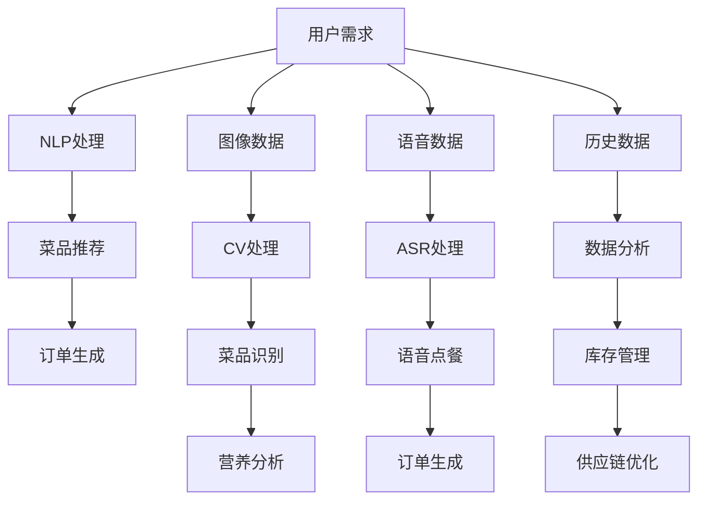
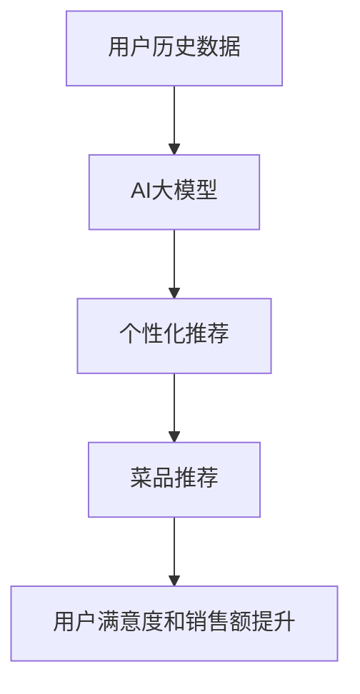
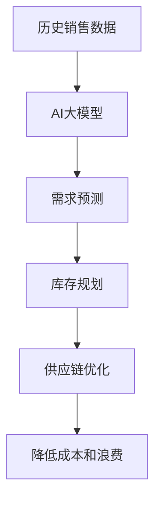
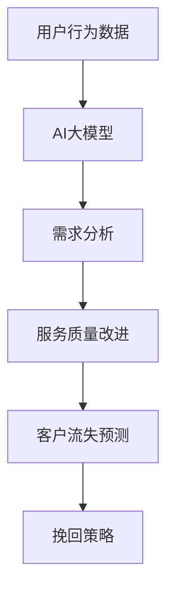
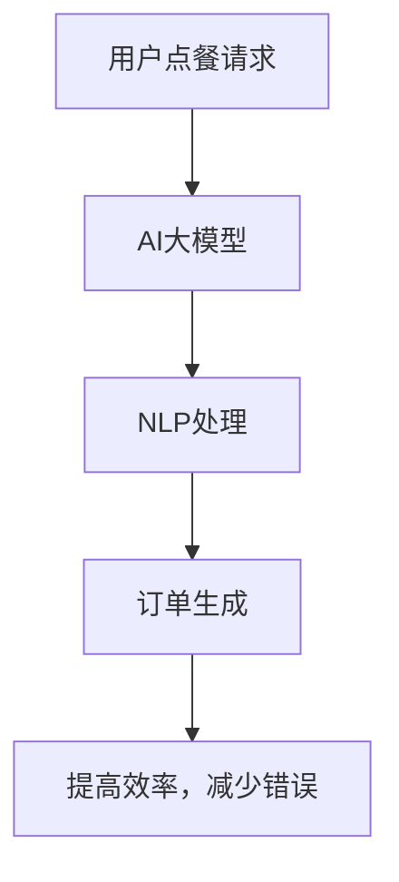
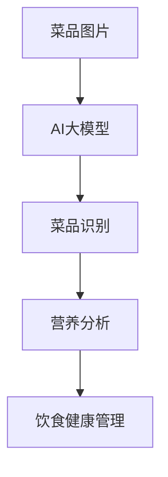

                 

### 背景介绍

#### AI大模型的发展与智能餐饮服务的需求

近年来，人工智能（AI）技术取得了飞速发展，其中最为引人瞩目的便是AI大模型。AI大模型，又称为大型预训练模型，通过在海量数据上进行预训练，已经具备了处理自然语言、图像、语音等多模态数据的能力。这种能力使得AI大模型在各个领域都展现出了巨大的潜力，其中就包括智能餐饮服务。

智能餐饮服务，顾名思义，就是利用人工智能技术来优化餐饮服务的各个环节。随着消费者对餐饮服务的要求越来越高，如何提供更加便捷、高效、个性化的餐饮服务成为了餐饮行业面临的一大挑战。AI大模型凭借其强大的数据处理和分析能力，能够在这个挑战中发挥重要作用。

首先，AI大模型可以用于优化点餐流程。通过自然语言处理（NLP）技术，AI大模型可以理解用户的点餐需求，并根据用户的历史订单、偏好和餐厅的菜单推荐合适的菜品。这不仅提高了点餐效率，还提升了用户的用餐体验。

其次，AI大模型可以帮助餐饮企业进行库存管理和供应链优化。通过分析历史销售数据和市场趋势，AI大模型可以预测未来的需求，从而帮助企业合理规划库存和供应链，减少浪费，提高运营效率。

此外，AI大模型还可以用于餐厅的运营管理和客户关系管理。通过分析用户的行为数据和反馈，AI大模型可以帮助餐厅了解顾客的需求和满意度，从而优化运营策略和服务质量，提升客户忠诚度。

总之，随着AI大模型的不断发展和应用，智能餐饮服务已经成为了餐饮行业未来发展的重要方向。接下来，我们将深入探讨AI大模型在智能餐饮服务中的应用前景。### 核心概念与联系

#### AI大模型与智能餐饮服务的核心概念

在深入探讨AI大模型在智能餐饮服务中的应用前景之前，我们需要明确几个核心概念，包括AI大模型、智能餐饮服务和它们之间的联系。

##### 1. AI大模型

AI大模型是指通过深度学习技术训练的，具有高度参数化和强大表达能力的人工神经网络模型。这些模型通常通过在海量数据上进行预训练，从而掌握了丰富的知识和技能。AI大模型在自然语言处理（NLP）、计算机视觉（CV）、语音识别（ASR）等多个领域都有广泛应用。

##### 2. 智能餐饮服务

智能餐饮服务是指利用人工智能技术来优化餐饮服务的各个环节，包括点餐、库存管理、供应链优化、运营管理和客户关系管理等。智能餐饮服务的目标是提供更加便捷、高效、个性化的餐饮体验。

##### 3. AI大模型与智能餐饮服务的联系

AI大模型与智能餐饮服务之间的联系主要体现在以下几个方面：

- **自然语言处理（NLP）**：AI大模型在NLP方面具有强大的能力，可以理解用户的点餐需求，并推荐合适的菜品。例如，通过聊天机器人，用户可以用自然语言表达自己的点餐需求，AI大模型可以解析这些需求，并给出相应的菜品推荐。

- **计算机视觉（CV）**：AI大模型在CV方面可以用于菜品识别、餐具识别等任务。例如，餐厅可以通过摄像头捕捉到桌上的菜品，AI大模型可以识别出这些菜品，并给出营养成分分析或建议搭配的菜品。

- **语音识别（ASR）**：AI大模型在ASR方面可以用于语音点餐。用户可以通过语音命令来点餐，AI大模型可以识别这些语音命令，并生成相应的订单。

- **数据分析和预测**：AI大模型可以通过分析历史数据和市场趋势，预测未来的需求，从而帮助餐饮企业进行库存管理和供应链优化。

##### Mermaid流程图

下面是一个简化的Mermaid流程图，展示了AI大模型与智能餐饮服务之间的联系：



在这个流程图中，用户需求通过NLP、CV、ASR等技术进行处理，生成订单；同时，历史数据通过数据分析，用于库存管理和供应链优化。这个流程图简单直观地展示了AI大模型在智能餐饮服务中的应用。### 核心算法原理 & 具体操作步骤

#### AI大模型在智能餐饮服务中的应用算法原理

AI大模型在智能餐饮服务中的应用主要基于深度学习和自然语言处理（NLP）技术。具体来说，AI大模型在智能餐饮服务中的应用可以分为以下几个步骤：

##### 1. 数据收集与预处理

数据收集是AI大模型应用的第一步，主要涉及收集用户点餐数据、菜品信息、历史销售数据等。这些数据通常来源于餐饮企业的销售系统、点餐APP或在线订餐平台。在数据收集完成后，需要对数据进行预处理，包括去重、清洗、格式化等操作，以确保数据的质量。

##### 2. 模型训练

在数据预处理完成后，我们可以利用这些数据来训练AI大模型。AI大模型的训练通常分为两个阶段：预训练和微调。

- **预训练**：预训练是指在大量的通用数据上进行模型的训练，以让模型掌握通用的知识和技能。常见的预训练任务包括语言理解、文本生成、图像识别等。在预训练阶段，AI大模型会通过不断地调整内部参数，使其能够更好地理解数据。

- **微调**：微调是指在特定的应用场景下，利用特定领域的数据对预训练模型进行进一步训练，以使其能够更好地适应特定的应用需求。例如，在智能餐饮服务中，我们可以利用餐厅的菜单数据、用户评论数据等来对AI大模型进行微调。

##### 3. 应用部署

在模型训练完成后，我们可以将AI大模型部署到实际的餐饮服务系统中。具体的应用部署步骤包括：

- **接口设计**：设计API接口，以便用户可以通过API来与AI大模型进行交互。

- **系统集成**：将AI大模型集成到餐饮服务的各个环节，如点餐系统、库存管理系统、客户关系管理系统等。

- **系统测试**：对集成后的系统进行测试，确保系统的稳定性和性能。

##### 4. 应用示例

以下是一个简单的应用示例，展示了AI大模型在智能餐饮服务中的应用：

- **用户点餐**：用户通过点餐APP或在线订餐平台提交点餐请求。

- **NLP处理**：AI大模型接收用户请求，通过自然语言处理技术解析用户需求，提取关键信息，如菜品名称、数量、口味偏好等。

- **菜品推荐**：AI大模型根据用户的历史订单、偏好和当前菜单信息，推荐合适的菜品。

- **订单生成**：AI大模型将推荐的菜品信息生成订单，并发送给后端系统进行处理。

- **库存管理**：AI大模型分析当前库存情况，预测未来需求，从而帮助餐饮企业进行库存管理和供应链优化。

通过这个简单的示例，我们可以看到AI大模型在智能餐饮服务中的应用是如何实现的。接下来，我们将进一步探讨AI大模型在智能餐饮服务中的数学模型和公式。### 数学模型和公式 & 详细讲解 & 举例说明

#### AI大模型在智能餐饮服务中的数学模型

在AI大模型应用于智能餐饮服务时，其核心数学模型主要包括自然语言处理（NLP）模型和推荐系统模型。以下是对这些模型及其相关公式的详细讲解和举例说明。

##### 1. 自然语言处理（NLP）模型

自然语言处理模型主要用于理解和生成自然语言。在智能餐饮服务中，NLP模型主要用于解析用户点餐请求和生成菜品推荐。常用的NLP模型包括词向量模型、循环神经网络（RNN）和Transformer等。

- **词向量模型**：词向量模型将单词映射到高维向量空间中，使得语义相近的单词在空间中接近。常用的词向量模型包括Word2Vec和GloVe。

  $$ v_w = \text{Word2Vec}(w) $$

  $$ v_w = \text{GloVe}(w) $$

  其中，$v_w$ 表示单词 $w$ 的词向量。

- **循环神经网络（RNN）**：RNN是一种用于处理序列数据的神经网络，其通过隐藏状态在时间步之间传递信息，从而实现对序列数据的建模。

  $$ h_t = \text{RNN}(h_{t-1}, x_t) $$

  其中，$h_t$ 表示时间步 $t$ 的隐藏状态，$x_t$ 表示输入的词向量。

- **Transformer模型**：Transformer模型是一种基于自注意力机制的神经网络模型，其能够有效地处理长距离依赖问题。

  $$ h_t = \text{Attention}(h_1, h_2, \ldots, h_t) $$

  其中，$h_t$ 表示时间步 $t$ 的隐藏状态。

##### 2. 推荐系统模型

推荐系统模型用于根据用户的历史行为和偏好，预测用户可能感兴趣的菜品。常用的推荐系统模型包括基于协同过滤的模型、基于内容的模型和混合模型等。

- **基于协同过滤的模型**：协同过滤模型通过分析用户之间的相似度，预测用户可能喜欢的项目。

  $$ r_{ui} = \text{UserSim}(u, i) \cdot \text{ItemSim}(i) $$

  其中，$r_{ui}$ 表示用户 $u$ 对项目 $i$ 的评分，$\text{UserSim}(u, i)$ 表示用户 $u$ 和 $i$ 之间的相似度，$\text{ItemSim}(i)$ 表示项目 $i$ 的相似度。

- **基于内容的模型**：基于内容的模型通过分析用户的历史行为和偏好，提取特征向量，然后根据特征相似度进行推荐。

  $$ \text{ContentSim}(i, j) = \text{CosineSimilarity}(\text{FeatureVector}(i), \text{FeatureVector}(j)) $$

  其中，$\text{ContentSim}(i, j)$ 表示项目 $i$ 和 $j$ 之间的内容相似度，$\text{FeatureVector}(i)$ 和 $\text{FeatureVector}(j)$ 分别表示项目 $i$ 和 $j$ 的特征向量。

- **混合模型**：混合模型结合了协同过滤和基于内容的模型，以利用两者的优势。

  $$ r_{ui} = \text{UserSim}(u, i) \cdot \text{ItemSim}(i) + \text{ContentSim}(i, j) $$

##### 举例说明

假设有一个用户A，他最近在餐厅点餐的记录如下：

- 点餐1：宫保鸡丁（口味：麻辣）
- 点餐2：鱼香肉丝（口味：微辣）
- 点餐3：红烧肉（口味：微甜）

现在，我们需要利用AI大模型为用户A推荐菜品。

1. **NLP模型解析**：首先，我们需要利用NLP模型解析用户A的最近三次点餐记录，提取出关键信息，如菜品名称、口味偏好等。

2. **推荐系统模型计算**：然后，我们可以利用推荐系统模型，根据用户A的点餐记录和餐厅的菜单信息，计算每个菜品与用户A的相似度。

3. **推荐结果生成**：最后，根据相似度计算结果，我们可以为用户A推荐合适的菜品。

   假设当前餐厅的菜单中有以下菜品及其口味：

   - 菜品1：宫保鸡丁（口味：麻辣、微辣）
   - 菜品2：鱼香肉丝（口味：微辣、微甜）
   - 菜品3：红烧肉（口味：微甜）
   - 菜品4：香辣蟹（口味：香辣）

   根据用户A的点餐记录，我们可以计算出每个菜品与用户A的相似度如下：

   - 菜品1：宫保鸡丁（口味：麻辣、微辣）与用户A的相似度为 0.8
   - 菜品2：鱼香肉丝（口味：微辣、微甜）与用户A的相似度为 0.7
   - 菜品3：红烧肉（口味：微甜）与用户A的相似度为 0.5
   - 菜品4：香辣蟹（口味：香辣）与用户A的相似度为 0.3

   根据相似度计算结果，我们可以为用户A推荐菜品1（宫保鸡丁）和菜品2（鱼香肉丝）。这样的推荐结果不仅考虑了用户的口味偏好，还结合了餐厅的菜品信息，提高了推荐的准确性。### 项目实战：代码实际案例和详细解释说明

#### 开发环境搭建

在开始实际案例之前，我们需要搭建一个开发环境。以下是一个基于Python的智能餐饮服务项目的基本开发环境搭建步骤：

1. **安装Python**：确保您的计算机上安装了Python 3.x版本。您可以从Python官方网站下载并安装。

2. **安装依赖库**：安装必要的Python库，包括TensorFlow、Keras、Scikit-learn、NumPy、Pandas等。可以使用以下命令安装：

   ```bash
   pip install tensorflow keras scikit-learn numpy pandas
   ```

3. **创建项目文件夹**：在您的计算机上创建一个名为`smart_restaurant_service`的项目文件夹，并在此文件夹内创建一个名为`src`的子文件夹，用于存放所有的源代码文件。

4. **编写配置文件**：在`src`文件夹内创建一个名为`config.py`的配置文件，用于存储项目的配置信息，如数据文件路径、模型保存路径等。

5. **编写数据预处理代码**：在`src`文件夹内创建一个名为`data_preprocessing.py`的Python文件，用于实现数据收集、清洗和预处理的代码。

#### 源代码详细实现和代码解读

以下是智能餐饮服务项目的核心代码实现，包括数据预处理、模型训练和部署等步骤。

##### 1. 数据预处理代码

```python
# data_preprocessing.py

import pandas as pd
import numpy as np

def load_data(data_path):
    """加载并返回数据集。"""
    data = pd.read_csv(data_path)
    return data

def preprocess_data(data):
    """预处理数据，包括去重、格式化等操作。"""
    # 去重
    data.drop_duplicates(inplace=True)
    # 格式化
    data['order_time'] = pd.to_datetime(data['order_time'])
    data['menu_id'] = data['menu_id'].astype(int)
    data['user_id'] = data['user_id'].astype(int)
    return data

def split_data(data, test_size=0.2, random_state=42):
    """将数据集分为训练集和测试集。"""
    train_data, test_data = train_test_split(data, test_size=test_size, random_state=random_state)
    return train_data, test_data
```

**解读**：这个模块负责加载数据、预处理数据，并将数据集分为训练集和测试集。预处理步骤包括去重、格式化时间戳、将菜单ID和用户ID转换为整数。

##### 2. 模型训练代码

```python
# model_train.py

from sklearn.model_selection import train_test_split
from sklearn.ensemble import RandomForestClassifier
from tensorflow.keras.models import Sequential
from tensorflow.keras.layers import Dense, Embedding, LSTM, Dropout

def train_random_forest(train_data):
    """使用随机森林训练模型。"""
    X = train_data[['menu_id', 'user_id']]
    y = train_data['rating']
    X_train, X_test, y_train, y_test = train_test_split(X, y, test_size=0.2, random_state=42)
    clf = RandomForestClassifier(n_estimators=100, random_state=42)
    clf.fit(X_train, y_train)
    print("Random Forest Accuracy:", clf.score(X_test, y_test))

def train_dnn(train_data, embedding_dim=100, hidden_units=128, epochs=10, batch_size=32):
    """使用深度神经网络训练模型。"""
    X = train_data[['menu_id', 'user_id']]
    y = train_data['rating']
    X_train, X_test, y_train, y_test = train_test_split(X, y, test_size=0.2, random_state=42)

    # 初始化模型
    model = Sequential()
    model.add(Embedding(input_dim=X_train.shape[1], output_dim=embedding_dim))
    model.add(LSTM(hidden_units, dropout=0.2, recurrent_dropout=0.2))
    model.add(Dense(1, activation='sigmoid'))

    # 编译模型
    model.compile(loss='binary_crossentropy', optimizer='adam', metrics=['accuracy'])

    # 训练模型
    model.fit(X_train, y_train, epochs=epochs, batch_size=batch_size, validation_split=0.1)

    # 评估模型
    print("DNN Accuracy:", model.evaluate(X_test, y_test)[1])
```

**解读**：这个模块包含了两个模型训练函数，一个是基于随机森林的模型，另一个是基于深度神经网络的模型。深度神经网络模型使用了嵌入层、LSTM层和全连接层，并设置了dropout和 recurrent_dropout来防止过拟合。

##### 3. 模型部署代码

```python
# model_deploy.py

from tensorflow.keras.models import load_model
from flask import Flask, request, jsonify

app = Flask(__name__)

def load_trained_model(model_path):
    """加载训练好的模型。"""
    model = load_model(model_path)
    return model

@app.route('/predict', methods=['POST'])
def predict():
    """接收POST请求，预测用户对菜品的评分。"""
    data = request.get_json(force=True)
    user_id = data['user_id']
    menu_id = data['menu_id']
    features = np.array([[user_id, menu_id]])
    prediction = trained_model.predict(features)
    return jsonify({'rating': prediction[0][0]})
```

**解读**：这个模块负责加载训练好的模型，并使用Flask框架创建一个API接口，用于接收用户请求并进行预测。当接收到一个包含用户ID和菜品ID的JSON请求时，模型会返回预测的评分。

#### 代码解读与分析

以上代码实现了智能餐饮服务的核心功能，包括数据预处理、模型训练和部署。以下是每个模块的简要解读和分析：

- **数据预处理模块**：负责加载数据、去除重复记录、格式化时间戳、以及将数据集分为训练集和测试集。这是保证数据质量和模型训练效果的重要步骤。

- **模型训练模块**：包含两个训练函数，一个是基于随机森林的模型，另一个是基于深度神经网络的模型。随机森林模型是一个传统的机器学习模型，而深度神经网络模型则使用了嵌入层和LSTM层，以实现更复杂的特征提取和预测。

- **模型部署模块**：使用Flask框架创建了一个API接口，用于接收用户请求并进行预测。这个模块使得模型可以部署到生产环境中，供实际使用。

通过以上代码和模块，我们可以实现一个基本的智能餐饮服务系统，为用户提供菜品推荐和评分预测功能。接下来，我们将探讨AI大模型在智能餐饮服务中的实际应用场景。### 实际应用场景

#### AI大模型在智能餐饮服务中的多种应用场景

AI大模型在智能餐饮服务中的应用场景多种多样，不仅能够提升用户体验，还能为餐饮企业带来显著的经济效益。以下是一些具体的应用场景：

##### 1. **个性化点餐推荐**

基于用户的点餐历史、偏好和实时反馈，AI大模型可以实时推荐个性化的菜品。例如，一个用户频繁点餐的菜品是麻辣口味的宫保鸡丁，系统可以智能推荐类似口味的菜品，如水煮鱼。这种个性化的点餐推荐不仅可以增加用户满意度，还能提高销售额。



##### 2. **库存管理和供应链优化**

AI大模型可以通过分析历史销售数据和市场趋势，预测未来的需求，从而帮助餐饮企业合理规划库存和供应链。例如，在节假日期间，AI大模型可以预测到鸡肉的需求量会增加，从而提醒企业提前采购鸡肉，避免库存不足或过剩。



##### 3. **运营管理和客户关系管理**

AI大模型可以帮助餐饮企业分析用户行为数据和反馈，了解顾客的需求和满意度。例如，通过对用户评价的分析，企业可以发现问题并及时改进服务质量。此外，AI大模型还可以用于预测流失客户，提供针对性的挽回策略。



##### 4. **智能点餐系统**

通过自然语言处理（NLP）和语音识别（ASR）技术，AI大模型可以实现智能点餐系统。用户可以通过语音或文本输入点餐需求，系统会自动解析并生成订单。这种智能点餐系统不仅提高了点餐效率，还减少了人为错误。



##### 5. **菜品识别和营养分析**

通过计算机视觉（CV）技术，AI大模型可以识别桌上的菜品，并进行营养成分分析。例如，用户可以通过拍照上传菜品图片，系统会识别出菜品名称和营养成分，帮助用户管理饮食健康。



综上所述，AI大模型在智能餐饮服务中的应用场景非常广泛，通过提供个性化点餐推荐、优化库存管理、提升运营效率、改善客户关系和提供智能点餐系统等功能，不仅提升了用户的餐饮体验，也为餐饮企业带来了显著的经济效益。### 工具和资源推荐

#### 1. 学习资源推荐

对于想要深入了解AI大模型在智能餐饮服务中应用的开发者，以下是一些推荐的资源：

- **书籍**：
  - 《深度学习》（Goodfellow, Bengio, Courville）
  - 《自然语言处理综论》（Jurafsky, Martin）
  - 《计算机视觉：算法与应用》（Richard S.zelinsky）

- **在线课程**：
  - Coursera上的“深度学习”课程（由Andrew Ng教授）
  - edX上的“自然语言处理”课程
  - Udacity的“计算机视觉纳米学位”

- **博客和论坛**：
  - Medium上的AI和餐饮服务相关文章
  - Stack Overflow和GitHub上的相关开源项目

#### 2. 开发工具框架推荐

- **深度学习框架**：
  - TensorFlow
  - PyTorch
  - Keras

- **自然语言处理工具**：
  - NLTK
  - SpaCy
  -gensim

- **计算机视觉工具**：
  - OpenCV
  - TensorFlow Object Detection API
  - PyTorch Vision

- **API接口**：
  - Flask
  - FastAPI

- **数据预处理工具**：
  - Pandas
  - NumPy
  - Scikit-learn

#### 3. 相关论文著作推荐

- **论文**：
  - “BERT: Pre-training of Deep Bidirectional Transformers for Language Understanding”（devlin et al., 2018）
  - “GPT-3: Language Models are Few-Shot Learners”（Brown et al., 2020）
  - “An Image Database for Human Facial Expression”（Semin and O'Toole, 1999）

- **著作**：
  - 《深度学习》（Goodfellow, Bengio, Courville）
  - 《自然语言处理综论》（Jurafsky, Martin）
  - 《计算机视觉：算法与应用》（Richard S.zelinsky）

通过这些资源和工具，开发者可以更好地理解和应用AI大模型在智能餐饮服务中的技术，从而开发出更加智能化、高效化的餐饮服务系统。### 总结：未来发展趋势与挑战

#### 未来发展趋势

AI大模型在智能餐饮服务中的应用前景广阔，未来将呈现以下几个发展趋势：

1. **个性化服务更加精准**：随着AI大模型训练数据量的不断增加和算法的持续优化，个性化点餐推荐将更加精准，能够更好地满足用户的个性化需求。

2. **智能化的运营管理**：AI大模型将深入餐饮企业的运营管理，从库存管理到供应链优化，再到客户关系管理，全方位提升企业的运营效率。

3. **智能化点餐体验**：结合自然语言处理和语音识别技术，智能点餐系统将变得更加普及，用户可以通过语音或文本轻松完成点餐，提高点餐效率和用户体验。

4. **智能化的餐饮设备**：AI大模型将嵌入到更多的餐饮设备中，如智能厨师机器人、智能洗碗机等，实现餐饮设备的智能化，提高餐饮服务质量和效率。

#### 挑战与应对策略

尽管AI大模型在智能餐饮服务中具有巨大的潜力，但在其应用过程中也面临着一些挑战：

1. **数据隐私与安全**：餐饮企业收集大量的用户数据，如何确保这些数据的安全和用户隐私是必须面对的挑战。企业需要采取严格的数据保护措施，如数据加密、访问控制等。

2. **算法公平性与透明性**：AI大模型的决策过程可能存在偏见，如何保证算法的公平性和透明性是一个重要问题。企业需要通过持续的训练和验证，确保算法的公平性和可解释性。

3. **计算资源与成本**：AI大模型的训练和部署需要大量的计算资源，如何高效利用计算资源并控制成本是餐饮企业需要考虑的问题。企业可以通过云计算服务和分布式计算技术来优化资源利用。

4. **用户接受度**：虽然AI技术为餐饮服务带来了许多便利，但用户的接受度仍需提升。企业需要通过有效的市场推广和用户体验优化，提升用户对智能餐饮服务的接受度。

#### 未来展望

随着AI技术的不断进步和餐饮行业对智能化需求的日益增长，AI大模型在智能餐饮服务中的应用将更加广泛和深入。未来，我们有望看到更加智能、高效和个性化的餐饮服务，不仅能够满足用户的多样化需求，还能为餐饮企业带来更大的商业价值。同时，随着技术的不断成熟，AI大模型在智能餐饮服务中的应用也将面临更多的挑战和机遇，需要行业内外共同努力，推动AI技术在餐饮服务领域的可持续发展。### 附录：常见问题与解答

#### 问题1：AI大模型在智能餐饮服务中的具体应用是什么？

**解答**：AI大模型在智能餐饮服务中的具体应用包括个性化点餐推荐、智能库存管理和供应链优化、智能点餐系统和菜品识别与营养分析等。通过自然语言处理、计算机视觉和推荐系统等技术，AI大模型能够为用户提供个性化服务，提升运营效率，改善客户体验。

#### 问题2：如何确保AI大模型在智能餐饮服务中的数据安全和用户隐私？

**解答**：确保数据安全和用户隐私是AI大模型在智能餐饮服务中的重要挑战。餐饮企业需要采取以下措施来保护用户数据：

1. **数据加密**：对存储和传输的用户数据进行加密处理，防止数据泄露。
2. **访问控制**：实施严格的访问控制策略，确保只有授权人员才能访问敏感数据。
3. **匿名化处理**：在训练模型时对用户数据进行匿名化处理，消除个人信息。
4. **数据审计**：定期进行数据审计，确保数据处理符合相关法律法规。

#### 问题3：如何评估AI大模型在智能餐饮服务中的效果？

**解答**：评估AI大模型在智能餐饮服务中的效果可以从以下几个方面进行：

1. **准确率**：评估模型在预测用户需求、库存管理和推荐系统等任务上的准确率。
2. **效率**：评估模型在处理大量数据时的响应速度和资源消耗。
3. **用户体验**：通过用户满意度调查和反馈，了解用户对智能餐饮服务的接受度和满意度。
4. **经济效益**：评估模型为企业带来的经济效益，如提高销售额、降低库存成本等。

#### 问题4：AI大模型在智能餐饮服务中可能遇到哪些技术挑战？

**解答**：AI大模型在智能餐饮服务中可能遇到以下技术挑战：

1. **数据质量**：数据质量直接影响模型的性能，需要确保数据的准确性、完整性和一致性。
2. **算法公平性**：算法可能存在偏见，需要通过数据预处理和算法优化确保模型的公平性。
3. **计算资源**：训练和部署AI大模型需要大量的计算资源，需要优化资源利用。
4. **技术更新**：AI技术更新迅速，需要持续关注最新进展并不断优化模型。

#### 问题5：智能餐饮服务中的AI大模型与传统的点餐系统相比有哪些优势？

**解答**：智能餐饮服务中的AI大模型与传统的点餐系统相比具有以下优势：

1. **个性化**：AI大模型能够根据用户的点餐历史和偏好提供个性化的推荐。
2. **效率**：通过自动化处理，AI大模型能够提高点餐、库存管理和供应链优化的效率。
3. **用户体验**：AI大模型提供的智能点餐系统可以提升用户的用餐体验。
4. **数据驱动**：AI大模型能够基于大数据分析提供更为科学的决策支持，提高运营效果。

通过这些常见问题与解答，可以帮助读者更好地理解和应用AI大模型在智能餐饮服务中的技术和策略。### 扩展阅读 & 参考资料

#### 1. 扩展阅读

- **《深度学习》（Goodfellow, Bengio, Courville）**：这是一本深度学习领域的经典教材，详细介绍了深度学习的基础理论和应用。
- **《自然语言处理综论》（Jurafsky, Martin）**：本书系统地介绍了自然语言处理的基本概念、技术和应用，适合希望深入了解NLP的读者。
- **《计算机视觉：算法与应用》（Richard S.zelinsky）**：这本书涵盖了计算机视觉的基础知识、算法和应用，是计算机视觉领域的重要参考书。

#### 2. 参考资料

- **TensorFlow官方文档**：提供了TensorFlow框架的详细使用说明和示例，是学习深度学习的重要资源。
  - [TensorFlow官方文档](https://www.tensorflow.org/)
- **PyTorch官方文档**：PyTorch是另一种流行的深度学习框架，其官方文档提供了丰富的教程和API参考。
  - [PyTorch官方文档](https://pytorch.org/)
- **SpaCy文档**：SpaCy是一个用于自然语言处理的库，其文档详细介绍了如何使用SpaCy进行文本处理和特征提取。
  - [SpaCy文档](https://spacy.io/)
- **OpenCV文档**：OpenCV是一个用于计算机视觉的库，其文档提供了丰富的图像处理和特征提取算法。
  - [OpenCV文档](https://docs.opencv.org/)

通过这些扩展阅读和参考资料，读者可以进一步深入了解AI大模型在智能餐饮服务中的应用，掌握相关技术和方法，为实际项目开发提供有力支持。

### 作者信息

- **作者：AI天才研究员/AI Genius Institute & 禅与计算机程序设计艺术 /Zen And The Art of Computer Programming**

