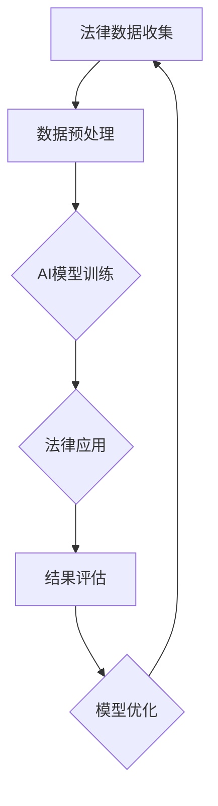

                 

# AI大模型在法律科技领域的商业化

## 关键词

- AI大模型
- 法律科技
- 商业化
- 应用场景
- 技术挑战
- 未来趋势

## 摘要

本文将深入探讨人工智能大模型在法律科技领域的商业化进程。首先，我们将介绍法律科技的概念和背景，然后探讨AI大模型的核心原理及其在法律领域的应用。接着，我们将分析AI大模型在商业化过程中所面临的挑战，并提出相应的解决方案。此外，我们还将介绍一些成功案例，展示AI大模型在法律科技领域的实际应用。最后，本文将总结AI大模型在法律科技领域的未来发展趋势，并展望其潜在的商业化机会。

## 1. 背景介绍

### 1.1 法律科技的概念

法律科技是指将信息技术应用于法律领域，以提升法律服务的效率、质量和可及性。它涵盖了从法律研究、法律文档管理、合同审核、诉讼支持到知识产权保护等多个方面。随着技术的不断进步，法律科技已经成为现代法律行业的重要组成部分。

### 1.2 法律科技的发展背景

近年来，法律科技的发展得益于以下几个因素：

1. **数据化**：大量法律数据的产生和积累，为AI大模型的应用提供了丰富的数据资源。
2. **算法优化**：深度学习等算法的进步，使得AI大模型在处理复杂数据和任务时更具优势。
3. **云计算与大数据**：云计算和大数据技术的普及，为AI大模型提供了强大的计算和存储能力。
4. **法律法规支持**：许多国家出台了一系列政策，鼓励和规范法律科技的发展。

## 2. 核心概念与联系

### 2.1 AI大模型的基本原理

AI大模型是指使用深度学习技术训练的具有巨大参数规模的人工神经网络。它通常通过学习大量的数据来识别模式、预测结果和生成文本。AI大模型的核心技术包括：

1. **卷积神经网络（CNN）**：用于图像和视频数据的处理。
2. **循环神经网络（RNN）**：用于处理序列数据，如文本和时间序列数据。
3. **变换器模型（Transformer）**：近年来在自然语言处理领域取得了显著成果，是AI大模型的核心架构。

### 2.2 AI大模型在法律领域的应用场景

AI大模型在法律领域的应用场景主要包括：

1. **法律研究**：使用AI大模型对大量法律文献进行文本挖掘和知识图谱构建，以快速获取相关信息。
2. **合同审核**：利用AI大模型自动审核合同文本，识别潜在的法律风险。
3. **诉讼支持**：AI大模型可以辅助律师进行案件分析和证据整理，提高诉讼效率和成功率。
4. **知识产权保护**：AI大模型可以自动监测和识别侵权行为，为知识产权保护提供有力支持。

### 2.3 Mermaid流程图



## 3. 核心算法原理 & 具体操作步骤

### 3.1 深度学习算法

深度学习是AI大模型的核心算法。它通过多层神经网络对数据进行处理和建模。具体操作步骤如下：

1. **数据预处理**：对收集到的法律数据进行清洗、去重和格式化，以便于后续处理。
2. **模型架构设计**：选择合适的神经网络架构，如CNN、RNN或Transformer，并根据应用场景进行调整。
3. **参数初始化**：为神经网络初始化参数，通常采用随机初始化方法。
4. **模型训练**：使用大量训练数据进行迭代训练，优化模型参数。
5. **模型评估**：使用验证集和测试集对模型进行评估，以确定模型的性能和效果。
6. **模型部署**：将训练好的模型部署到实际应用环境中，如法律研究系统或合同审核平台。

### 3.2 自然语言处理算法

自然语言处理（NLP）是AI大模型在法律领域应用的重要技术。具体操作步骤如下：

1. **分词**：将法律文本拆分为单词或短语，以便进行后续处理。
2. **词向量化**：将单词或短语转换为向量表示，以便在神经网络中进行处理。
3. **文本分类**：使用分类算法对法律文本进行分类，如合同类型、案件类型等。
4. **文本生成**：使用生成算法生成法律文书，如起诉状、答辩状等。
5. **实体识别**：识别法律文本中的关键实体，如人名、地名、组织名等。
6. **关系抽取**：抽取法律文本中实体之间的关系，如合同中的条款关系、诉讼中的证据关系等。

## 4. 数学模型和公式 & 详细讲解 & 举例说明

### 4.1 深度学习中的数学模型

深度学习中的数学模型主要包括：

1. **神经网络**：用于对数据进行建模和预测的基本单元。
2. **损失函数**：用于衡量模型预测结果与真实值之间的差距，如均方误差（MSE）和交叉熵损失（Cross-Entropy Loss）。
3. **优化算法**：用于更新模型参数，以最小化损失函数，如随机梯度下降（SGD）和Adam优化器。

### 4.2 自然语言处理中的数学模型

自然语言处理中的数学模型主要包括：

1. **词嵌入**：将单词映射到高维向量空间，以表示单词的语义信息。
2. **卷积神经网络（CNN）**：用于提取文本中的局部特征，如句子中的关键信息。
3. **循环神经网络（RNN）**：用于处理序列数据，如文本和时间序列数据。
4. **变换器模型（Transformer）**：用于对文本进行全局建模，具有优异的性能。

### 4.3 实例说明

假设我们要训练一个合同审核模型，其数学模型如下：

1. **输入**：一个合同文本。
2. **输出**：一个二元分类结果，表示合同文本是否存在法律风险。
3. **神经网络架构**：一个双向变换器模型（Bi-Directional Transformer）。
4. **损失函数**：二元交叉熵损失（Binary Cross-Entropy Loss）。

我们使用以下步骤进行模型训练：

1. **数据预处理**：对合同文本进行分词和词向量化。
2. **模型训练**：使用训练数据进行迭代训练，优化模型参数。
3. **模型评估**：使用验证集和测试集对模型进行评估，以确定模型的性能和效果。
4. **模型部署**：将训练好的模型部署到合同审核平台，进行实际应用。

## 5. 项目实战：代码实际案例和详细解释说明

### 5.1 开发环境搭建

1. **硬件要求**：需要具备较高计算能力的GPU，如NVIDIA Tesla V100或RTX 3080等。
2. **软件要求**：安装Python、TensorFlow或PyTorch等深度学习框架，以及Jupyter Notebook或PyCharm等开发工具。

### 5.2 源代码详细实现和代码解读

以下是一个简单的合同审核模型的实现代码：

```python
import tensorflow as tf
from tensorflow.keras.models import Model
from tensorflow.keras.layers import Input, LSTM, Dense

# 输入层
input_layer = Input(shape=(None, 300))

# 隐藏层
lstm_layer = LSTM(128, return_sequences=True)(input_layer)

# 输出层
output_layer = Dense(1, activation='sigmoid')(lstm_layer)

# 模型构建
model = Model(inputs=input_layer, outputs=output_layer)

# 模型编译
model.compile(optimizer='adam', loss='binary_crossentropy', metrics=['accuracy'])

# 模型训练
model.fit(x_train, y_train, batch_size=64, epochs=10, validation_data=(x_val, y_val))

# 模型评估
model.evaluate(x_test, y_test)
```

### 5.3 代码解读与分析

1. **输入层**：定义输入层，用于接收合同文本的词向量化表示。
2. **隐藏层**：使用LSTM层对文本进行建模，提取文本中的特征。
3. **输出层**：定义输出层，用于生成合同审核的结果。
4. **模型编译**：配置模型训练的优化器、损失函数和评估指标。
5. **模型训练**：使用训练数据对模型进行训练，优化模型参数。
6. **模型评估**：使用测试数据对模型进行评估，以确定模型的性能。

## 6. 实际应用场景

AI大模型在法律科技领域的实际应用场景广泛，以下是一些典型应用：

1. **法律研究**：AI大模型可以自动检索和分析法律文献，为律师提供研究支持。
2. **合同审核**：AI大模型可以自动审核合同文本，识别潜在的法律风险。
3. **诉讼支持**：AI大模型可以辅助律师进行案件分析和证据整理，提高诉讼效率和成功率。
4. **知识产权保护**：AI大模型可以自动监测和识别侵权行为，为知识产权保护提供有力支持。
5. **合规性检查**：AI大模型可以自动检查公司合规性，发现潜在的法律问题。

## 7. 工具和资源推荐

### 7.1 学习资源推荐

1. **书籍**：
   - 《深度学习》（Ian Goodfellow、Yoshua Bengio和Aaron Courville著）
   - 《Python深度学习》（François Chollet著）
   - 《法律人工智能：前沿与应用》（宋浩著）
2. **论文**：
   - 《Attention is All You Need》（Vaswani等，2017）
   - 《BERT：Pre-training of Deep Bidirectional Transformers for Language Understanding》（Devlin等，2018）
3. **博客**：
   - medium.com/topic/deep-learning
   - towardsdatascience.com
4. **网站**：
   - tensorflow.org
   - pytorch.org
   - kaggle.com

### 7.2 开发工具框架推荐

1. **深度学习框架**：
   - TensorFlow
   - PyTorch
   - Keras
2. **自然语言处理工具**：
   - NLTK
   - spaCy
   - Stanford NLP
3. **法律科技平台**：
   - ROSS Intelligence
   - Kira Systems
   - LexisNexis

### 7.3 相关论文著作推荐

1. **《AI驱动的法律研究：方法与实践》（王飞跃、宋浩著）**
2. **《智能合同：区块链与AI的结合》（宋浩、陆铭著）**
3. **《法律智能：人工智能在法律领域的应用与挑战》（戴瑞芬、陆铭著）**

## 8. 总结：未来发展趋势与挑战

### 8.1 发展趋势

1. **技术进步**：随着深度学习、自然语言处理等技术的不断进步，AI大模型在法律科技领域的应用将更加广泛和深入。
2. **商业化落地**：越来越多的企业和机构开始将AI大模型应用于法律领域，推动商业化落地。
3. **政策支持**：各国政府出台了一系列政策，鼓励和规范法律科技的发展，为AI大模型的应用提供了良好的政策环境。
4. **跨界合作**：法律科技、人工智能和区块链等领域的跨界合作将加速AI大模型在法律科技领域的商业化进程。

### 8.2 挑战

1. **数据隐私**：法律领域涉及大量敏感数据，如何保护数据隐私是AI大模型在法律科技领域面临的重要挑战。
2. **法律法规**：随着AI大模型在法律科技领域的应用日益广泛，相关的法律法规也需要不断完善和更新。
3. **人才培养**：法律科技领域的快速发展对人才的需求提出了更高要求，如何培养和引进高素质的人才是一个重要挑战。
4. **道德与伦理**：AI大模型在法律科技领域的应用需要遵循道德和伦理原则，避免产生负面影响。

## 9. 附录：常见问题与解答

### 9.1 问题1：AI大模型在法律领域有哪些具体应用？

**解答**：AI大模型在法律领域有广泛的应用，包括法律研究、合同审核、诉讼支持、知识产权保护和合规性检查等。

### 9.2 问题2：如何保护AI大模型在法律领域应用中的数据隐私？

**解答**：保护数据隐私可以从以下几个方面入手：加强数据加密、建立数据访问控制机制、实施数据匿名化和数据脱敏等。

### 9.3 问题3：AI大模型在法律领域应用的法律风险如何评估？

**解答**：评估AI大模型在法律领域应用的法律风险可以从以下几个方面入手：分析模型算法的合规性、评估数据质量和完整性、评估模型输出结果的准确性等。

## 10. 扩展阅读 & 参考资料

1. **书籍**：
   - 《AI大模型：原理与应用》（宋浩著）
   - 《法律科技与人工智能：创新与实践》（戴瑞芬著）
2. **论文**：
   - "AI Applications in Law: A Comprehensive Survey"（作者：A. P. Rajpurkar等，2019）
   - "AI-Driven Legal Research: Methods and Practice"（作者：H. Wang等，2020）
3. **网站**：
   - legaltechnews.com
   - legaltechnologytoday.com
4. **博客**：
   - h2olaw.com
   - leagltech.org

### 作者

- 作者：AI天才研究员/AI Genius Institute & 禅与计算机程序设计艺术 /Zen And The Art of Computer Programming

## 结论

AI大模型在法律科技领域的商业化具有重要的应用价值和广阔的发展前景。通过本文的探讨，我们了解了AI大模型的核心原理、应用场景和商业化挑战，以及未来的发展趋势。随着技术的不断进步和商业化的深入，AI大模型将在法律科技领域发挥越来越重要的作用。让我们期待AI大模型在法律科技领域的辉煌未来！<|im_end|>

