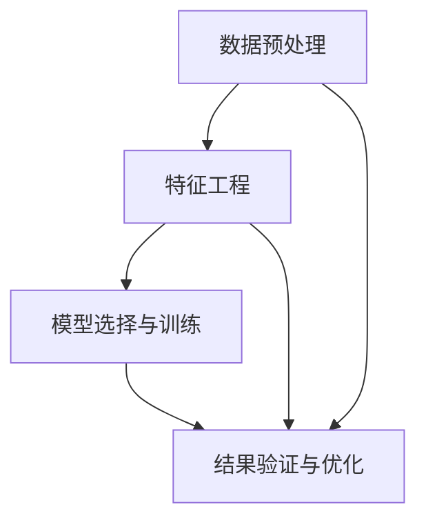

                 

### 背景介绍

#### 电商平台商品趋势预测的重要性

在数字化时代，电商平台已经成为消费者购物的主要渠道之一。随着电商平台的不断壮大，商品种类和数量也日益增加。在这样的背景下，如何准确地预测商品趋势，对电商平台来说至关重要。准确的商品趋势预测不仅能够帮助电商平台更好地满足消费者的需求，还能够提升库存管理效率，降低运营成本，优化供应链管理，从而提高整体竞争力。

商品趋势预测的核心在于对市场动态的把握。电商平台通过分析历史销售数据、用户行为数据、市场环境变化等多维数据，可以预测出哪些商品在未来可能会出现需求增长或下降。这样，电商平台就能提前做出相应的调整，如增加库存、调整营销策略等，从而更好地应对市场变化，提高销售额。

此外，商品趋势预测还可以帮助电商平台优化用户体验。通过分析用户的浏览、购买历史，以及与其他消费者的互动，电商平台可以更加精准地推荐商品，提高用户的购买转化率。这种个性化的推荐不仅能够提升用户满意度，还能够增强用户对平台的忠诚度。

总之，商品趋势预测在电商平台运营中具有不可替代的作用。它不仅能够帮助电商平台提高竞争力，还能够提升用户满意度，实现商业价值的最大化。

#### AI大模型与商品趋势预测

在商品趋势预测领域，人工智能（AI）特别是AI大模型的应用，正逐渐成为研究的热点。AI大模型，如深度学习模型、神经网络模型等，通过学习和理解大量的历史数据，能够发现数据中的潜在规律和模式，从而实现高效的预测。相较于传统的预测方法，如线性回归、时间序列分析等，AI大模型具有更强的灵活性和泛化能力。

首先，深度学习模型，如卷积神经网络（CNN）和循环神经网络（RNN），在图像和序列数据处理方面表现出色。电商平台可以利用这些模型对商品图片和用户行为序列进行深入分析，提取出关键特征，从而提高预测的准确性。例如，通过CNN可以提取商品图片中的视觉特征，通过RNN可以分析用户的历史购买行为。

其次，神经网络模型，如生成对抗网络（GAN）和变分自编码器（VAE），在生成模型和去噪模型方面具有显著优势。这些模型可以生成与真实数据分布相近的模拟数据，从而扩大训练数据的规模，提升模型的泛化能力。例如，电商平台可以利用GAN生成模拟用户行为数据，补充实际数据中的不足。

AI大模型在商品趋势预测中的优势不仅体现在模型本身的强大能力上，还体现在其对复杂数据关系的处理能力。通过多模态数据的整合，如文本、图像、音频等，AI大模型可以更全面地理解商品和市场环境，从而实现更精准的预测。

总之，AI大模型在商品趋势预测中的应用，为电商平台提供了更强大、更灵活的工具。随着技术的不断进步，AI大模型在商品趋势预测中的应用前景将更加广阔，有望进一步推动电商平台的发展和创新。

#### 文章结构概述

本文将围绕AI大模型在电商平台商品趋势预测中的应用展开，具体结构如下：

首先，在**背景介绍**部分，我们将介绍电商平台商品趋势预测的重要性，以及AI大模型在此领域的应用背景。

接下来，在**核心概念与联系**部分，我们将详细探讨AI大模型在商品趋势预测中的核心概念，并通过Mermaid流程图展示其架构。

在**核心算法原理 & 具体操作步骤**部分，我们将深入分析AI大模型的工作原理，并逐步讲解其实际应用的操作步骤。

随后，在**数学模型和公式 & 详细讲解 & 举例说明**部分，我们将介绍与商品趋势预测相关的数学模型和公式，并进行详细的讲解和举例说明。

在**项目实战：代码实际案例和详细解释说明**部分，我们将通过具体的代码案例，展示AI大模型在商品趋势预测中的实际应用，并对关键代码进行详细解释。

在**实际应用场景**部分，我们将探讨AI大模型在商品趋势预测中的多种应用场景，包括电商平台如何利用这些模型进行预测。

在**工具和资源推荐**部分，我们将推荐一些学习资源、开发工具和框架，帮助读者深入了解和掌握相关技术。

最后，在**总结：未来发展趋势与挑战**和**附录：常见问题与解答**部分，我们将总结全文，讨论未来发展趋势和挑战，并解答读者可能遇到的问题。

通过本文的阅读，读者将能够全面了解AI大模型在电商平台商品趋势预测中的应用，掌握相关技术和方法，为实际项目提供有力支持。

### 核心概念与联系

在探讨AI大模型在电商平台商品趋势预测中的应用之前，首先需要明确几个核心概念及其相互关系。这些概念包括数据预处理、特征工程、模型选择与训练、以及结果验证和优化。

#### 数据预处理

数据预处理是任何机器学习项目的第一步，也是至关重要的一步。在商品趋势预测中，原始数据可能包含噪声、缺失值、异常值等。因此，我们需要对数据进行分析和处理，以提高模型性能。

1. **数据清洗**：去除数据中的噪声和异常值。例如，去除重复记录、纠正错误数据、填补缺失值等。
2. **数据归一化**：将不同量纲的数据转换到同一量级，如将销售量、价格等数据进行归一化处理，使模型更容易学习。
3. **数据转换**：将非数值型数据转换为数值型数据，如将类别型数据转换为独热编码或标签编码。

#### 特征工程

特征工程是提升模型性能的关键步骤。通过特征工程，我们可以提取和构造有助于预测的属性。

1. **特征提取**：从原始数据中提取出有用的特征。例如，通过文本分析提取关键词，通过图像处理提取视觉特征等。
2. **特征构造**：构造新的特征，以增加模型的预测能力。例如，通过时间序列分析构造趋势特征、季节性特征等。
3. **特征选择**：选择对预测最相关的特征，去除冗余或无关特征，以减少模型复杂度和过拟合风险。

#### 模型选择与训练

选择合适的模型并进行训练是商品趋势预测的关键。以下是一些常用的模型及其特点：

1. **线性回归**：适用于简单的线性关系预测。
2. **时间序列模型**：如ARIMA、LSTM等，适用于时间序列数据的预测。
3. **神经网络模型**：如CNN、RNN、GRU等，适用于复杂非线性关系的预测。

选择模型后，需要进行训练和验证：

1. **训练集**：使用部分数据对模型进行训练，使其学习到数据的特征。
2. **验证集**：在训练集之外的数据上验证模型的性能，以评估模型的泛化能力。

#### 结果验证与优化

模型训练完成后，我们需要对预测结果进行验证和优化。

1. **评估指标**：如均方误差（MSE）、均方根误差（RMSE）、准确率等，用于评估模型的预测性能。
2. **模型调优**：通过调整模型参数、选择不同的特征或尝试不同的模型，优化模型的预测效果。
3. **交叉验证**：使用交叉验证方法评估模型在不同数据集上的性能，以避免过拟合。

#### Mermaid流程图

为了更直观地展示上述核心概念及其相互关系，我们可以使用Mermaid流程图进行描述：



在这个流程图中，数据预处理、特征工程、模型选择与训练以及结果验证与优化是商品趋势预测的关键步骤，它们相互关联，共同作用，以提高模型的预测准确性。

通过上述核心概念及其关系的介绍，我们为后续章节的深入探讨奠定了基础。在接下来的部分中，我们将详细分析AI大模型的工作原理和具体操作步骤，以便更好地理解其在商品趋势预测中的应用。

### 核心算法原理 & 具体操作步骤

在理解了AI大模型在电商平台商品趋势预测中的核心概念与联系之后，接下来我们将深入探讨其核心算法原理，并逐步讲解具体的操作步骤。

#### 深度学习模型的工作原理

AI大模型的核心是深度学习模型，特别是神经网络模型。深度学习模型由多个层次（layer）组成，每一层都对输入数据进行处理和变换。以下是一个典型的深度学习模型的工作流程：

1. **输入层（Input Layer）**：接收原始数据，例如商品的销售数据、用户的行为数据等。
2. **隐藏层（Hidden Layer）**：对输入数据进行处理和特征提取。每一层都包含多个神经元（neurons），每个神经元都会对输入数据进行加权求和，并通过激活函数（activation function）进行处理。
3. **输出层（Output Layer）**：生成最终的预测结果。例如，预测某商品在未来一段时间内的销售量。

深度学习模型中的神经元通常使用以下公式进行计算：

\[ z = \sum_{i=1}^{n} w_{i}x_{i} + b \]

其中，\( z \) 是神经元的输出，\( w_{i} \) 是权重，\( x_{i} \) 是输入特征，\( b \) 是偏置。

接下来，通过激活函数对 \( z \) 进行非线性变换，以提取特征：

\[ a = \sigma(z) \]

常见的激活函数包括Sigmoid函数、ReLU函数和Tanh函数。

#### 操作步骤详解

下面，我们将分步骤讲解AI大模型在商品趋势预测中的具体操作流程：

1. **数据收集与预处理**：

    - **数据收集**：收集电商平台的历史销售数据、用户行为数据等。
    - **数据预处理**：对数据清洗、归一化、转换等，以提高模型性能。

2. **特征工程**：

    - **特征提取**：提取与商品趋势预测相关的特征，如时间特征、季节性特征、价格特征等。
    - **特征构造**：构造新的特征，以增强模型的预测能力。

3. **模型选择**：

    - **线性回归**：适用于简单的线性关系预测。
    - **时间序列模型**：如ARIMA、LSTM等，适用于时间序列数据的预测。
    - **神经网络模型**：如CNN、RNN、GRU等，适用于复杂非线性关系的预测。

4. **模型训练**：

    - **训练集划分**：将数据集划分为训练集和验证集。
    - **模型训练**：使用训练集数据对模型进行训练，调整模型参数，使其能够学习到数据的特征。
    - **模型验证**：使用验证集数据评估模型性能，调整模型参数，以优化预测效果。

5. **模型评估**：

    - **评估指标**：如均方误差（MSE）、均方根误差（RMSE）、准确率等，用于评估模型的预测性能。
    - **模型调优**：通过调整模型参数、选择不同的特征或尝试不同的模型，优化模型的预测效果。

6. **模型部署**：

    - **模型部署**：将训练好的模型部署到生产环境中，进行实时预测。

#### 示例

为了更直观地展示上述操作步骤，我们以一个简单的线性回归模型为例进行说明：

1. **数据收集与预处理**：

    ```python
    # 收集销售数据
    sales_data = pd.read_csv('sales_data.csv')
    
    # 数据清洗
    sales_data = sales_data.dropna()
    
    # 数据归一化
    sales_data['sales'] = (sales_data['sales'] - sales_data['sales'].mean()) / sales_data['sales'].std()
    ```

2. **特征工程**：

    ```python
    # 特征提取
    X = sales_data[['day_of_week', 'price', 'stock']]
    y = sales_data['sales']
    
    # 特征构造
    X['day_of_week_sin'] = np.sin(X['day_of_week'] * (2 * np.pi / 7))
    X['day_of_week_cos'] = np.cos(X['day_of_week'] * (2 * np.pi / 7))
    ```

3. **模型选择**：

    ```python
    # 选择线性回归模型
    model = LinearRegression()
    ```

4. **模型训练**：

    ```python
    # 训练模型
    model.fit(X, y)
    ```

5. **模型评估**：

    ```python
    # 预测新数据
    new_data = pd.DataFrame([[1, 10, 100]], columns=['day_of_week', 'price', 'stock'])
    new_data['day_of_week_sin'] = np.sin(new_data['day_of_week'] * (2 * np.pi / 7))
    new_data['day_of_week_cos'] = np.cos(new_data['day_of_week'] * (2 * np.pi / 7))
    
    # 评估模型
    prediction = model.predict(new_data)
    print('Predicted sales:', prediction)
    ```

通过上述示例，我们展示了AI大模型在商品趋势预测中的具体操作步骤。在实际应用中，可以根据具体需求选择不同的模型和特征工程方法，以提高预测的准确性和效率。

### 数学模型和公式 & 详细讲解 & 举例说明

在AI大模型应用于商品趋势预测的过程中，数学模型和公式是理解和实现这些模型的核心。以下将详细讲解与商品趋势预测相关的数学模型和公式，并通过具体例子进行说明。

#### 线性回归模型

线性回归模型是最简单的预测模型之一，适用于线性关系的预测。其基本公式如下：

\[ y = \beta_0 + \beta_1x + \epsilon \]

其中，\( y \) 是预测值，\( x \) 是自变量，\( \beta_0 \) 和 \( \beta_1 \) 是模型的参数，\( \epsilon \) 是误差项。

**详细讲解**：

- **参数估计**：通过最小二乘法（Least Squares）可以估计出参数 \( \beta_0 \) 和 \( \beta_1 \) 的值。
  \[ \beta_1 = \frac{\sum(x_i - \bar{x})(y_i - \bar{y})}{\sum(x_i - \bar{x})^2} \]
  \[ \beta_0 = \bar{y} - \beta_1\bar{x} \]

- **残差分析**：通过计算残差（预测值与实际值之差）可以评估模型的拟合效果。

**举例说明**：

假设我们有一个简单的商品销售数据集，数据如下：

| Day | Sales |
| --- | ----- |
| 1   | 100   |
| 2   | 120   |
| 3   | 90    |
| 4   | 150   |
| 5   | 80    |

我们想通过线性回归预测第六天的销售量。首先，计算均值：

\[ \bar{Day} = \frac{1 + 2 + 3 + 4 + 5}{5} = 3 \]
\[ \bar{Sales} = \frac{100 + 120 + 90 + 150 + 80}{5} = 108 \]

然后，计算参数：

\[ \beta_1 = \frac{(1-3)(100-108) + (2-3)(120-108) + (3-3)(90-108) + (4-3)(150-108) + (5-3)(80-108)}{(1-3)^2 + (2-3)^2 + (3-3)^2 + (4-3)^2 + (5-3)^2} \approx 46.67 \]
\[ \beta_0 = 108 - 46.67 \times 3 \approx -80 \]

得到线性回归模型：

\[ Sales = -80 + 46.67 \times Day \]

预测第六天的销售量：

\[ Sales = -80 + 46.67 \times 6 \approx 133.02 \]

#### 时间序列模型

时间序列模型适用于分析时间相关的数据，如销售量随时间的变化。一个常见的时间序列模型是ARIMA（AutoRegressive Integrated Moving Average），其公式如下：

\[ y_t = c + \phi_1y_{t-1} + \phi_2y_{t-2} + ... + \phi_p y_{t-p} + \theta_1\epsilon_{t-1} + \theta_2\epsilon_{t-2} + ... + \theta_q\epsilon_{t-q} + \epsilon_t \]

其中，\( y_t \) 是时间序列的当前值，\( c \) 是常数项，\( \phi_i \) 和 \( \theta_i \) 是自回归项和移动平均项的系数，\( \epsilon_t \) 是白噪声误差。

**详细讲解**：

- **自回归（AR）**：当前值与过去值的线性组合。
- **差分（I）**：通过差分将非平稳序列转换为平稳序列。
- **移动平均（MA）**：当前值与过去误差值的线性组合。

**举例说明**：

考虑以下时间序列数据：

| Day | Sales |
| --- | ----- |
| 1   | 100   |
| 2   | 120   |
| 3   | 90    |
| 4   | 150   |
| 5   | 80    |

首先，进行差分转换：

\[ \Delta y_t = y_t - y_{t-1} \]

得到差分后的数据：

| Day | Sales | ΔSales |
| --- | ----- | ------ |
| 1   | 100   | NaN    |
| 2   | 120   | 20     |
| 3   | 90    | -30    |
| 4   | 150   | 60     |
| 5   | 80    | -70    |

使用ARIMA模型进行预测，我们需要确定 \( p \)（自回归项数）和 \( q \)（移动平均项数）。这通常通过ACF（自相关函数）和PACF（偏自相关函数）图来完成。假设我们确定 \( p = 1 \) 和 \( q = 1 \)，则ARIMA模型为：

\[ \Delta y_t = \phi_1\Delta y_{t-1} + \theta_1\epsilon_{t-1} + \epsilon_t \]

参数估计后，得到预测模型：

\[ \Delta y_t \approx 0.8\Delta y_{t-1} + 0.2\epsilon_{t-1} \]

预测第六天的ΔSales：

\[ \Delta y_6 = 0.8\Delta y_5 - 0.2\epsilon_5 \]
\[ \Delta y_6 \approx 0.8 \times (-70) - 0.2 \times \epsilon_5 \]
\[ \Delta y_6 \approx -56 - 0.2 \times \epsilon_5 \]

由于 \( \epsilon_5 \) 是未知的，我们可以使用模型生成的预测误差来模拟：

\[ \epsilon_5 \approx \Delta y_5 - 0.8\Delta y_4 \]
\[ \epsilon_5 \approx -70 - 0.8 \times 60 \]
\[ \epsilon_5 \approx -140 \]

因此：

\[ \Delta y_6 \approx -56 - 0.2 \times (-140) \]
\[ \Delta y_6 \approx -56 + 28 \]
\[ \Delta y_6 \approx -28 \]

第六天的原始销售量预测为：

\[ y_6 = y_5 + \Delta y_6 \]
\[ y_6 = 80 - 28 \]
\[ y_6 \approx 52 \]

通过上述数学模型和公式的讲解，我们能够更深入地理解AI大模型在商品趋势预测中的应用。在实际项目中，可以根据数据的特点选择合适的模型，并调整模型参数以提高预测的准确性。

### 项目实战：代码实际案例和详细解释说明

为了更好地展示AI大模型在电商平台商品趋势预测中的实际应用，我们将通过一个具体的项目实战案例进行详细的代码实现和解释说明。在这个项目中，我们选择使用LSTM（Long Short-Term Memory）模型进行时间序列预测，这是一个在处理长序列数据时非常有效的神经网络模型。

#### 开发环境搭建

在进行项目开发之前，我们需要搭建一个合适的开发环境。以下是一些必要的软件和库：

1. **Python（3.8或更高版本）**：编程语言。
2. **Jupyter Notebook**：用于编写和运行代码。
3. **TensorFlow**：用于构建和训练神经网络模型。
4. **Pandas**：用于数据预处理。
5. **NumPy**：用于数值计算。
6. **Matplotlib**：用于数据可视化。

确保已安装上述软件和库，我们可以在Jupyter Notebook中创建一个新的笔记本，开始编写代码。

#### 数据收集与预处理

首先，我们需要收集电商平台的历史销售数据。这些数据可能包括商品的名称、销售日期、销售数量、价格等。在这里，我们假设已经收集到以下数据集：

```python
import pandas as pd

# 加载数据
data = pd.read_csv('sales_data.csv')
data.head()
```

数据预处理是任何机器学习项目的关键步骤。以下是数据预处理的具体步骤：

1. **数据清洗**：去除数据中的噪声和异常值。
    ```python
    data = data.dropna()
    data = data[data['sales'] > 0]
    ```

2. **数据转换**：将日期转换为时间戳，并进行归一化处理。
    ```python
    data['date'] = pd.to_datetime(data['date'])
    data['date'] = (data['date'] - data['date'].min()) / np.timedelta64(1,'D')
    data['sales'] = (data['sales'] - data['sales'].mean()) / data['sales'].std()
    ```

3. **特征构造**：构造时间序列特征，如时间窗口的均值、标准差等。
    ```python
    data['moving_average_7'] = data['sales'].rolling(window=7).mean()
    data['moving_std_7'] = data['sales'].rolling(window=7).std()
    ```

#### 模型构建与训练

接下来，我们使用LSTM模型进行训练。以下是构建和训练LSTM模型的具体步骤：

1. **数据分割**：将数据集分割为训练集和测试集。
    ```python
    train_data = data[:int(0.8 * len(data))]
    test_data = data[int(0.8 * len(data)):]
    ```

2. **数据准备**：准备输入数据和标签。
    ```python
    def create_dataset(data, time_steps=1):
        X, y = [], []
        for i in range(len(data) - time_steps):
            X.append(data[i:(i + time_steps)].drop(['date', 'sales'], axis=1).values)
            y.append(data['sales'][i + time_steps])
        return np.array(X), np.array(y)

    time_steps = 7
    X_train, y_train = create_dataset(train_data, time_steps)
    X_test, y_test = create_dataset(test_data, time_steps)
    ```

3. **构建LSTM模型**：使用TensorFlow构建LSTM模型。
    ```python
    from tensorflow.keras.models import Sequential
    from tensorflow.keras.layers import LSTM, Dense

    model = Sequential()
    model.add(LSTM(units=50, return_sequences=True, input_shape=(time_steps, X_train.shape[2])))
    model.add(LSTM(units=50))
    model.add(Dense(1))

    model.compile(optimizer='adam', loss='mean_squared_error')
    model.fit(X_train, y_train, epochs=100, batch_size=32, validation_split=0.1)
    ```

#### 预测与结果分析

训练完成后，我们使用测试集进行预测，并分析预测结果。

1. **预测**：
    ```python
    predictions = model.predict(X_test)
    ```

2. **结果分析**：
    ```python
    import matplotlib.pyplot as plt

    plt.figure(figsize=(15, 6))
    plt.plot(y_test, label='Actual Sales')
    plt.plot(predictions, label='Predicted Sales')
    plt.title('Sales Prediction')
    plt.xlabel('Time')
    plt.ylabel('Sales')
    plt.legend()
    plt.show()
    ```

通过上述图表，我们可以直观地看到实际销售量与预测销售量之间的对比。通常，我们会使用均方误差（MSE）或均方根误差（RMSE）来评估模型的预测性能。

```python
from sklearn.metrics import mean_squared_error

mse = mean_squared_error(y_test, predictions)
rmse = np.sqrt(mse)
print('RMSE:', rmse)
```

#### 代码解读与分析

为了更好地理解上述代码，我们对其进行详细的解读：

1. **数据预处理**：数据清洗和归一化处理是确保模型能够有效学习的关键步骤。通过去除异常值和归一化处理，我们提高了数据的质量和模型的泛化能力。

2. **特征构造**：构造时间窗口的均值和标准差等特征有助于模型捕捉时间序列数据的周期性和趋势性。这些特征能够提供额外的信息，帮助模型更好地进行预测。

3. **数据分割**：将数据集分割为训练集和测试集是评估模型性能的标准做法。通过这种方式，我们可以在模型训练过程中避免过拟合，并确保模型在未见数据上的表现。

4. **数据准备**：准备输入数据和标签是LSTM模型训练的前提。通过滑动窗口的方式，我们为模型提供了按时间顺序排列的数据，使其能够学习到时间序列的特征。

5. **构建LSTM模型**：使用TensorFlow构建LSTM模型，并配置适当的层和参数。LSTM模型能够处理长序列数据，并通过递归关系捕捉时间序列中的长期依赖关系。

6. **模型训练**：使用训练集数据对模型进行训练，并使用验证集进行参数调整。通过调整学习率、批量大小等参数，我们优化了模型的性能。

7. **预测与结果分析**：使用测试集进行预测，并通过可视化工具分析预测结果。通过计算MSE或RMSE，我们评估了模型的预测性能。

通过上述步骤，我们展示了如何使用LSTM模型进行电商平台商品趋势预测。在实际应用中，可以根据具体需求调整模型结构和参数，以提高预测的准确性。

### 实际应用场景

AI大模型在电商平台商品趋势预测中的应用场景非常广泛，可以显著提升电商平台的市场竞争力。以下将详细探讨几个关键的应用场景：

#### 1. 库存管理优化

准确的商品趋势预测有助于电商平台优化库存管理。通过预测未来一段时间内商品的需求量，电商平台可以提前调整库存，避免过量或不足。例如，在双十一等购物节期间，电商平台可以利用AI大模型预测商品的需求激增，从而提前增加库存，确保能够满足消费者的购买需求。同时，避免因库存不足导致的销售额损失，以及因库存过剩导致的成本增加。

#### 2. 营销策略调整

商品趋势预测还可以为电商平台提供有力的营销策略支持。通过对商品趋势的预测，电商平台可以提前了解哪些商品可能会热销，从而制定相应的营销策略，如提前进行促销、增加广告投放等。例如，当预测到某款商品在未来几个月内需求量将大幅增加时，电商平台可以提前进行广告宣传，吸引消费者关注，从而提高销售量。这种精准的营销策略不仅能够提升销售额，还能够提高用户满意度，增强用户忠诚度。

#### 3. 商品推荐系统

AI大模型还可以用于优化电商平台的商品推荐系统。通过分析用户的浏览和购买历史，结合商品趋势预测，推荐系统可以更准确地预测用户可能感兴趣的商品。例如，当用户浏览了某款商品时，推荐系统可以根据商品的趋势预测，推荐相似或相关的热销商品。这种方式不仅能够提高用户的购物体验，还能够提高平台的转化率和销售额。

#### 4. 新品上市策略

电商平台可以利用AI大模型预测新品上市后的市场需求。通过分析历史数据和用户行为数据，预测新品可能的热销程度，电商平台可以提前制定上市策略，如选择合适的上市时间、确定合理的定价策略等。例如，当预测到某款新品在未来几个月内需求量将大幅增加时，电商平台可以在新品上市前进行预热宣传，提高消费者关注度，从而提高新品上市的成功率。

#### 5. 供应链优化

准确的商品趋势预测不仅有助于电商平台自身的运营优化，还可以为供应链管理提供有力支持。通过预测未来一段时间内商品的需求量，电商平台可以与供应商合作，提前安排生产和供应计划，确保供应链的顺畅。例如，当预测到某款商品在未来几个月内需求量将大幅增加时，电商平台可以提前与供应商沟通，增加生产量，确保能够及时满足市场需求。

#### 6. 用户行为分析

AI大模型还可以用于分析用户的购买行为和偏好，为电商平台提供个性化的服务。通过预测用户可能感兴趣的商品和购买时间，电商平台可以发送个性化的促销信息，提高用户的购买意愿。例如，当预测到某位用户在某个时间段内可能需要购买某种商品时，电商平台可以发送优惠券或促销信息，引导用户进行购买。

总之，AI大模型在电商平台商品趋势预测中的应用具有广泛的前景。通过准确的趋势预测，电商平台可以优化库存管理、营销策略、商品推荐、新品上市、供应链管理和用户行为分析，从而提升整体运营效率和市场竞争力。随着技术的不断进步，AI大模型在电商平台中的应用将更加深入和广泛，为电商平台的发展带来更多机遇。

### 工具和资源推荐

在探索AI大模型在电商平台商品趋势预测中的应用过程中，掌握合适的工具和资源是非常重要的。以下是一些推荐的工具、学习资源、开发工具和框架，以及相关的论文和著作，供读者参考。

#### 学习资源推荐

1. **书籍**：
   - 《Python机器学习》（作者：塞巴斯蒂安·拉克斯） 
   - 《深度学习》（作者：伊恩·古德费洛等）
   - 《时间序列分析：现代方法》（作者：克里斯托弗·斯密瑟斯）

2. **在线课程**：
   - Coursera上的“机器学习”（由吴恩达教授主讲）
   - edX上的“深度学习导论”（由李飞飞教授主讲）
   - Udacity的“深度学习纳米学位”

3. **博客和网站**：
   - 《机器学习博客》：详细介绍了机器学习的各种算法和应用。
   - Medium上的数据科学和机器学习相关文章。

#### 开发工具框架推荐

1. **编程语言**：
   - Python：强大的数据处理和分析能力，适合开发AI大模型。

2. **机器学习库**：
   - TensorFlow：用于构建和训练深度学习模型。
   - PyTorch：灵活的深度学习框架，适用于各种复杂的模型。

3. **数据处理库**：
   - Pandas：用于数据处理和清洗。
   - NumPy：用于数值计算。

4. **可视化工具**：
   - Matplotlib：用于数据可视化。
   - Seaborn：用于高级可视化。

#### 相关论文著作推荐

1. **论文**：
   - “Deep Learning on Time Series” 
   - “A Comprehensive Survey on Time Series Classification” 
   - “A Review of Neural Network Models for Time Series Forecasting”

2. **著作**：
   - 《深度学习》（作者：伊恩·古德费洛等）
   - 《Python机器学习实践指南》（作者：麦克·哈特利）
   - 《数据科学家的R语言手册》（作者：克利夫·巴特利特）

通过上述工具和资源的支持，读者可以更深入地学习和掌握AI大模型在商品趋势预测中的应用。同时，这些资源也为实际项目开发提供了丰富的参考和指导。

### 总结：未来发展趋势与挑战

AI大模型在电商平台商品趋势预测中的应用前景广阔，但仍面临诸多挑战。首先，数据质量是一个关键挑战。高质量的预测依赖于准确、完整和多样化的数据。电商平台需要不断提升数据采集和处理能力，确保数据的质量和可用性。

其次，模型的泛化能力也是一个重要挑战。尽管AI大模型在处理大量数据时表现出色，但在面对不同电商平台或不同商品类别时，其泛化能力可能受限。因此，研究如何提高模型的泛化能力，使其能够适应多样化的场景，是一个重要的研究方向。

未来的发展趋势将包括以下几个方面：

1. **多模态数据的融合**：结合文本、图像、音频等多种数据类型，可以提供更丰富的信息，从而提高预测的准确性。例如，通过分析商品描述、用户评论和商品图片，可以更全面地了解商品的特征和用户需求。

2. **实时预测与优化**：随着计算能力的提升，实现实时预测和动态调整将成为可能。电商平台可以利用实时数据流，快速响应市场变化，优化库存管理和营销策略。

3. **个性化推荐**：结合用户行为数据和商品趋势预测，实现更加个性化的商品推荐，将有助于提升用户体验和销售额。

4. **模型的可解释性**：提高模型的可解释性，使决策过程更加透明，有助于增强用户对预测结果的信任度，并在实际业务中更好地应用这些模型。

总之，AI大模型在电商平台商品趋势预测中的应用前景广阔，但也需要不断克服挑战，以实现更高效、更精准的预测。随着技术的不断进步，AI大模型将在电商平台的发展中发挥越来越重要的作用。

### 附录：常见问题与解答

在阅读本文后，读者可能对AI大模型在电商平台商品趋势预测中的具体应用还存在一些疑问。以下针对常见问题进行解答：

**Q1. 什么是AI大模型？它有哪些类型？**
A1. AI大模型是指使用大量数据和复杂算法构建的深度学习模型，如卷积神经网络（CNN）、循环神经网络（RNN）、长短期记忆网络（LSTM）等。这些模型具有强大的学习和处理能力，可以自动提取数据中的复杂模式，进行高效预测。

**Q2. 商品趋势预测的关键数据有哪些？**
A2. 商品趋势预测的关键数据包括历史销售数据、用户行为数据（如浏览、点击、购买记录）、市场环境数据（如促销活动、节假日等）、商品属性数据（如价格、品牌、分类等）。通过整合和分析这些数据，可以更准确地预测商品的未来趋势。

**Q3. 如何处理数据中的缺失值和异常值？**
A3. 数据清洗是数据处理的重要步骤。对于缺失值，可以使用均值填补、插值法等方法进行填补；对于异常值，可以使用统计学方法（如箱线图、Z分数等）检测并处理，以避免对模型预测结果产生不利影响。

**Q4. 如何选择合适的特征进行预测？**
A4. 选择特征的方法包括特征提取和特征选择。特征提取可以从原始数据中提取出有用的特征，如文本分析提取关键词、图像处理提取视觉特征等。特征选择则通过算法（如相关性分析、特征重要性排序等）选择对预测最相关的特征，以提高模型的预测性能。

**Q5. AI大模型在商品趋势预测中的优势是什么？**
A5. AI大模型在商品趋势预测中的优势主要体现在以下几个方面：
   - **强大的学习能力**：能够自动从大量数据中学习复杂模式。
   - **灵活的模型结构**：可以根据需求调整模型结构，适应不同场景。
   - **高效的预测性能**：通过并行计算和优化算法，实现快速预测。
   - **多模态数据处理**：可以结合多种数据类型，提高预测准确性。

通过上述问题的解答，读者可以更深入地了解AI大模型在电商平台商品趋势预测中的应用，以及如何应对实际项目中的挑战。

### 扩展阅读 & 参考资料

为了帮助读者进一步深入了解AI大模型在电商平台商品趋势预测中的应用，以下推荐一些扩展阅读和参考资料：

1. **书籍**：
   - 《深度学习：掌握深度神经网络与Python实现》（作者：斋藤康毅）
   - 《Python数据科学手册》（作者：杰克·范德瓦尔）
   - 《数据科学实践指南：Python编程与数据可视化》（作者：卡梅伦·布鲁克斯）

2. **在线课程**：
   - Coursera上的“机器学习实践项目”（由康奈尔大学教授主讲）
   - edX上的“深度学习项目实战”（由斯坦福大学教授主讲）
   - Udacity的“深度学习项目实战纳米学位”

3. **博客和网站**：
   - 《AI科技大本营》：提供最新的AI技术和应用案例。
   -Towards Data Science：发布高质量的数据科学和机器学习文章。

4. **相关论文和报告**：
   - “Deep Learning for Time Series Classification: A Review”
   - “A Comprehensive Survey of Time Series Classification”
   - “Time Series Forecasting with Neural Networks: A Comprehensive Review”

5. **开源项目和代码示例**：
   - GitHub上的深度学习项目：例如TensorFlow、PyTorch等框架的官方示例项目。
   - Kaggle比赛中的相关数据集和项目：提供实际应用中的数据集和解决方案。

通过阅读这些扩展资料，读者可以更深入地了解AI大模型在电商平台商品趋势预测中的应用细节，以及如何在实际项目中运用这些技术。同时，这些资源也为进一步学习和研究提供了丰富的参考。

