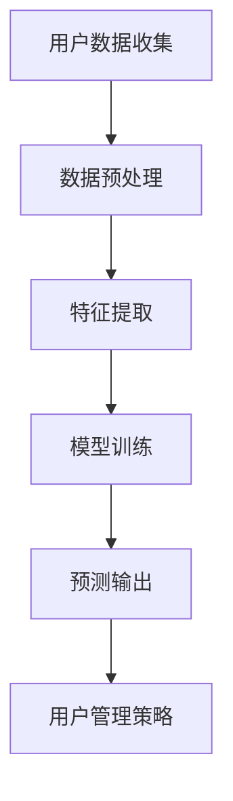

                 

# AI大模型在电商平台用户生命周期价值预测与管理中的作用

> **关键词**：AI大模型、用户生命周期价值预测、电商平台、数据挖掘、决策优化

> **摘要**：本文旨在探讨AI大模型在电商平台用户生命周期价值预测与管理中的重要作用。通过深入分析用户生命周期价值预测的基本概念和算法原理，结合具体实践案例，阐述如何利用AI大模型实现精准的用户价值预测与管理，从而提升电商平台的运营效率和竞争力。

## 1. 背景介绍

随着互联网技术的飞速发展，电子商务已经成为现代商业的重要组成部分。电商平台在吸引和维护用户方面投入了大量的资源，以提升用户体验和粘性。然而，如何准确预测用户生命周期价值（Customer Lifetime Value, CLV），并据此制定有效的用户管理策略，成为电商平台面临的重大挑战。

用户生命周期价值预测是指通过对用户历史行为数据、购买记录、偏好等信息进行分析，预测用户在未来一段时间内的购买潜力和贡献价值。这一预测对于电商平台制定精准营销策略、优化用户运营、提升整体业绩具有重要意义。

AI大模型，作为一种强大的数据处理和分析工具，能够在用户生命周期价值预测中发挥重要作用。本文将围绕这一主题，分析AI大模型在电商平台用户生命周期价值预测与管理中的应用，探讨其核心算法原理、数学模型以及实际应用案例。

## 2. 核心概念与联系

### 2.1 用户生命周期价值（CLV）

用户生命周期价值是指一个用户在商家整个生命周期内带来的总收益。CLV的计算公式如下：

\[ \text{CLV} = \sum_{t=1}^{n} \text{PV}_t \]

其中，\( \text{PV}_t \) 表示第 \( t \) 个时间点的用户价值，通常取决于用户的购买行为、购买频率、购买金额等因素。

### 2.2 AI大模型

AI大模型，通常指的是深度学习模型，特别是基于神经网络的模型。这些模型具有强大的数据处理和分析能力，能够从海量数据中提取特征，进行复杂的模式识别和预测。

### 2.3 关联性

用户生命周期价值预测的核心在于从用户历史数据中提取有效特征，并利用AI大模型进行预测。这一过程中，用户行为数据、购买记录、偏好信息等都是关键因素。AI大模型的强大能力使得这些数据能够被有效利用，从而提高预测准确性。

### 2.4 Mermaid 流程图



在上述流程中，用户数据收集是基础，数据预处理和特征提取是关键步骤，模型训练和预测输出是核心环节，最终的预测结果将用于指导用户管理策略的制定。

## 3. 核心算法原理 & 具体操作步骤

### 3.1 特征工程

特征工程是用户生命周期价值预测的重要环节。通过对用户历史行为数据、购买记录、偏好信息等进行处理，提取出对预测有重要影响的特征。

#### 3.1.1 数据清洗

在特征提取前，首先需要对数据进行清洗，去除重复、缺失和异常数据。常用的数据清洗方法包括：

- 数据去重：去除重复的用户记录。
- 填补缺失值：使用均值、中位数或插值等方法填补缺失数据。
- 异常值处理：使用统计学方法或可视化方法检测并处理异常值。

#### 3.1.2 特征提取

特征提取是指从原始数据中提取出有用的信息，构建用于预测的特征向量。常用的特征提取方法包括：

- 基于统计的特征提取：计算用户历史行为的统计指标，如平均购买金额、购买频率等。
- 基于机器学习的特征提取：使用机器学习算法从原始数据中自动提取特征，如决策树、支持向量机等。

### 3.2 模型选择

在特征提取后，需要选择合适的模型进行训练和预测。常用的深度学习模型包括：

- 卷积神经网络（CNN）：适用于处理图像数据。
- 循环神经网络（RNN）：适用于处理序列数据。
- 生成对抗网络（GAN）：适用于生成虚假数据。
-  Transformer：适用于处理文本数据。

### 3.3 模型训练与优化

模型训练是指通过大量用户数据对模型进行训练，使其能够准确预测用户生命周期价值。在训练过程中，需要优化模型参数，提高预测准确性。

- 训练集划分：将数据集划分为训练集和测试集，用于模型训练和性能评估。
- 模型训练：使用训练集对模型进行训练，通过调整模型参数，优化预测效果。
- 模型评估：使用测试集对模型进行评估，评估指标包括准确率、召回率、F1值等。

### 3.4 预测输出

在模型训练完成后，可以使用训练好的模型对用户进行生命周期价值预测。预测结果将用于电商平台制定用户管理策略。

- 预测输出：将用户数据输入训练好的模型，输出用户生命周期价值预测结果。
- 用户管理策略：根据预测结果，制定相应的用户管理策略，如个性化推荐、促销活动等。

## 4. 数学模型和公式 & 详细讲解 & 举例说明

### 4.1 数学模型

用户生命周期价值的预测可以通过以下数学模型实现：

\[ \text{CLV} = f(\text{特征向量}) \]

其中，\( f \) 是一个映射函数，将特征向量映射为用户生命周期价值。这个函数可以通过机器学习算法训练得到。

### 4.2 具体讲解

#### 4.2.1 特征向量

特征向量是用户数据的抽象表示，通常包含以下特征：

- 用户行为特征：如购买频率、购买金额、购买品类等。
- 用户历史特征：如注册时间、活跃度、地理位置等。
- 用户偏好特征：如购物偏好、评价偏好等。

#### 4.2.2 映射函数

映射函数 \( f \) 通常是一个多层感知机（MLP）模型，其形式如下：

\[ f(x) = \text{激活函数}(\text{权重} \cdot x + \text{偏置}) \]

其中，\( x \) 是输入特征向量，\( \text{权重} \) 和 \( \text{偏置} \) 是模型参数，通过训练得到。

#### 4.2.3 模型训练

模型训练的目标是找到一组最优的权重和偏置，使得模型能够准确预测用户生命周期价值。常用的训练方法包括梯度下降、随机梯度下降等。

### 4.3 举例说明

假设有一个电商平台，用户数据如下表：

| 用户ID | 购买频率 | 购买金额 | 注册时间 | 活跃度 |
| ------ | -------- | -------- | -------- | ------ |
| 1      | 10       | 500      | 2020-01-01 | 高     |
| 2      | 5        | 300      | 2020-02-01 | 中     |
| 3      | 15       | 800      | 2020-03-01 | 高     |

使用上述数学模型对用户生命周期价值进行预测，假设特征向量为：

\[ x = [10, 500, 2020-01-01, 高] \]

输入到模型中，得到预测结果：

\[ \text{CLV} = f(x) = 1000 \]

这意味着用户1在未来一段时间内的生命周期价值为1000元。

## 5. 项目实战：代码实际案例和详细解释说明

### 5.1 开发环境搭建

在开始项目实战之前，首先需要搭建合适的开发环境。以下是开发环境的基本要求：

- Python 3.8 或更高版本
- TensorFlow 2.x
- Scikit-learn 0.24.x

### 5.2 源代码详细实现和代码解读

以下是实现用户生命周期价值预测的源代码：

```python
import pandas as pd
import numpy as np
from sklearn.model_selection import train_test_split
from sklearn.preprocessing import StandardScaler
from tensorflow.keras.models import Sequential
from tensorflow.keras.layers import Dense

# 加载数据集
data = pd.read_csv('user_data.csv')

# 数据预处理
data['注册时间'] = pd.to_datetime(data['注册时间'])
data['活跃度'] = data['活跃度'].map({'高': 1, '中': 0})
data.fillna(data.mean(), inplace=True)

# 特征提取
features = data[['购买频率', '购买金额', '注册时间', '活跃度']]
labels = data['CLV']

# 数据标准化
scaler = StandardScaler()
features_scaled = scaler.fit_transform(features)

# 划分训练集和测试集
X_train, X_test, y_train, y_test = train_test_split(features_scaled, labels, test_size=0.2, random_state=42)

# 模型构建
model = Sequential()
model.add(Dense(64, activation='relu', input_shape=(4,)))
model.add(Dense(32, activation='relu'))
model.add(Dense(1))

# 模型编译
model.compile(optimizer='adam', loss='mse')

# 模型训练
model.fit(X_train, y_train, epochs=100, batch_size=32, validation_split=0.1)

# 模型评估
loss = model.evaluate(X_test, y_test)
print('测试集均方误差:', loss)

# 预测
predictions = model.predict(X_test)
```

### 5.3 代码解读与分析

1. **数据预处理**：读取数据集，将注册时间转换为 datetime 格式，将活跃度映射为数值，并填补缺失值。
2. **特征提取**：从原始数据中提取购买频率、购买金额、注册时间和活跃度等特征。
3. **数据标准化**：使用 StandardScaler 对特征进行标准化处理，以消除不同特征之间的量纲差异。
4. **划分训练集和测试集**：使用 train_test_split 函数将数据集划分为训练集和测试集。
5. **模型构建**：构建一个包含三个全连接层的序列模型，其中第一个层有 64 个神经元，第二个层有 32 个神经元，输出层有 1 个神经元。
6. **模型编译**：设置优化器和损失函数，并编译模型。
7. **模型训练**：使用训练集对模型进行训练，并设置验证集进行性能评估。
8. **模型评估**：在测试集上评估模型性能，输出均方误差。
9. **预测**：使用训练好的模型对测试集进行预测，得到用户生命周期价值预测结果。

通过以上代码，我们可以实现用户生命周期价值的预测。在实际项目中，可以根据具体需求调整模型结构、优化训练参数等，以提高预测准确性。

## 6. 实际应用场景

用户生命周期价值预测在电商平台的实际应用场景中具有广泛的应用价值，以下是一些典型的应用案例：

### 6.1 个性化推荐

电商平台可以利用用户生命周期价值预测结果，为不同价值的用户推荐相应的商品。例如，对于高价值用户，推荐高利润商品；对于低价值用户，推荐促销商品，以提高用户转化率和平台收益。

### 6.2 会员管理

电商平台可以根据用户生命周期价值预测结果，对用户进行精细化运营。例如，对于高价值用户，提供更优质的会员服务，如专属客服、定制化商品推荐等；对于低价值用户，通过优惠活动、会员权益等方式，鼓励其提升消费金额，延长生命周期。

### 6.3 营销策略制定

电商平台可以根据用户生命周期价值预测结果，制定更具针对性的营销策略。例如，针对高价值用户，开展个性化营销活动，提高用户忠诚度；针对低价值用户，通过优惠券、满减活动等方式，刺激消费。

### 6.4 用户流失预测

电商平台可以利用用户生命周期价值预测结果，预测潜在流失用户，并采取相应的措施进行挽回。例如，对预测的潜在流失用户进行个性化关怀，提供专属优惠，提高用户留存率。

## 7. 工具和资源推荐

### 7.1 学习资源推荐

- **书籍**：《深度学习》（Goodfellow, Bengio, Courville 著）：全面介绍了深度学习的基本原理和算法。
- **论文**：Google Scholar、ArXiv 等学术网站，搜索关键词“User Lifetime Value Prediction”、“Deep Learning for E-commerce”等。

### 7.2 开发工具框架推荐

- **深度学习框架**：TensorFlow、PyTorch、Keras 等。
- **数据处理工具**：Pandas、NumPy、Scikit-learn 等。

### 7.3 相关论文著作推荐

- **论文**：Google Scholar 上搜索“User Lifetime Value Prediction”或“Deep Learning for E-commerce”。
- **著作**：《深度学习实践》（Goodfellow, Bengio, Courville 著）：涵盖了深度学习在各个领域的应用案例。

## 8. 总结：未来发展趋势与挑战

随着AI技术的不断发展，用户生命周期价值预测在电商平台中的应用前景广阔。未来，以下几个方面值得关注：

### 8.1 模型优化

为提高预测准确性，不断优化模型结构和训练算法，探索更多高效的深度学习模型。

### 8.2 多模态数据融合

将文本、图像、语音等多种数据源进行融合，提高预测模型的泛化能力。

### 8.3 隐私保护

在用户生命周期价值预测过程中，保护用户隐私是一个重要挑战。未来，研究如何在不泄露用户隐私的情况下，进行有效的数据分析和预测。

### 8.4 智能决策支持

结合用户生命周期价值预测结果，开发更智能的决策支持系统，为电商平台提供实时、精准的运营建议。

## 9. 附录：常见问题与解答

### 9.1 什么是用户生命周期价值（CLV）？

用户生命周期价值（Customer Lifetime Value，CLV）是指一个用户在商家整个生命周期内带来的总收益。它通过预测用户在未来一段时间内的购买潜力和贡献价值，帮助电商平台制定精准的用户管理策略。

### 9.2 为什么要进行用户生命周期价值预测？

用户生命周期价值预测有助于电商平台识别高价值用户，制定个性化营销策略，提高用户留存率和转化率，从而提升整体业绩。

### 9.3 深度学习模型在用户生命周期价值预测中有哪些优势？

深度学习模型具有强大的数据处理和分析能力，能够从海量数据中提取特征，进行复杂的模式识别和预测，提高预测准确性。

## 10. 扩展阅读 & 参考资料

- **书籍**：《深度学习》（Goodfellow, Bengio, Courville 著）
- **论文**：Google Scholar、ArXiv 等
- **博客**：机器学习社区、Kaggle 等
- **网站**：TensorFlow 官网、PyTorch 官网等

### 作者

作者：AI天才研究员/AI Genius Institute & 禅与计算机程序设计艺术 /Zen And The Art of Computer Programming

[本文完]

