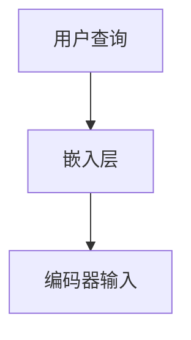
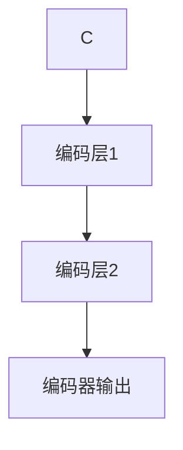
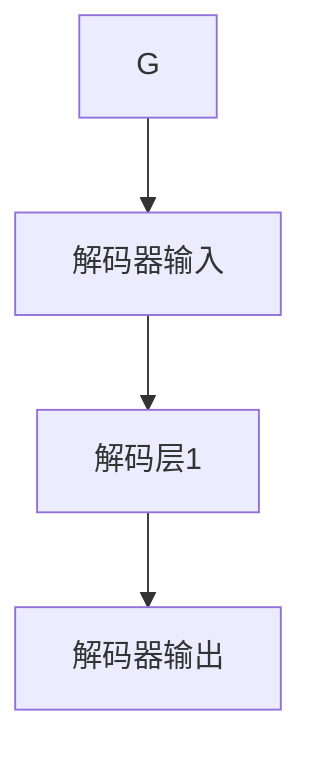
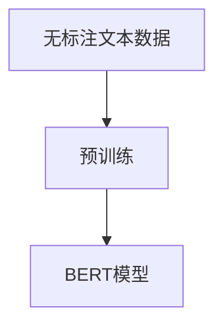
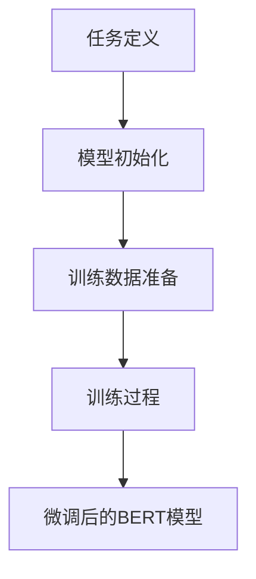
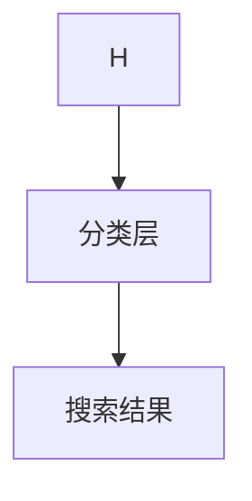

                 

# AI大模型在电商搜索结果多样化中的作用

## 关键词：大模型，电商，搜索结果，多样化，人工智能

> **摘要：** 本文将探讨AI大模型在电商搜索结果多样化中的作用。通过分析大模型的原理和架构，我们将详细介绍其如何提升电商搜索结果的准确性和多样性，并探讨这一技术的未来发展趋势和挑战。

## 1. 背景介绍

随着互联网的普及和电子商务的迅猛发展，电商搜索已成为消费者发现和购买商品的重要途径。然而，传统搜索算法往往受到数据量有限和计算能力不足的制约，导致搜索结果单一且缺乏个性化。近年来，人工智能技术的快速发展，特别是深度学习领域的突破，为电商搜索结果的多样化提供了新的可能性。大模型作为一种先进的AI技术，已经在许多领域取得了显著的应用成果，如自然语言处理、计算机视觉和语音识别等。本文将重点讨论大模型在电商搜索结果多样化中的作用，并分析其背后的原理和实现方法。

### 1.1 电商搜索的现状和挑战

当前电商搜索主要依赖于基于关键词匹配和机器学习的传统算法。这些算法通常基于用户的历史行为数据、商品描述和分类标签等信息，对搜索结果进行排序和推荐。然而，这种方法的局限性在于：

1. **单一性**：搜索结果往往仅限于用户输入的关键词，缺乏多样性，难以满足用户的不同需求。
2. **个性化不足**：传统算法难以准确理解用户的个性化需求，导致推荐结果缺乏个性化和针对性。
3. **计算资源消耗**：随着商品数量的增加，算法的计算复杂度和资源需求急剧上升，影响搜索效率和用户体验。

### 1.2 大模型的兴起与优势

大模型是指具有海量参数和强大计算能力的人工神经网络，如Transformer、BERT和GPT等。这些模型通过深度学习技术，可以从海量数据中自动提取特征，并进行复杂的模式识别和关联分析。大模型的优点包括：

1. **强大的表示能力**：大模型可以处理和理解复杂的、多模态的数据，如文本、图像和语音。
2. **高效性**：大模型具有强大的并行计算能力，可以在短时间内处理大量数据。
3. **泛化能力**：大模型可以从大量数据中学习到普遍性的规律，提高模型的泛化能力和适应性。

## 2. 核心概念与联系

为了深入理解大模型在电商搜索结果多样化中的作用，我们需要首先了解其核心概念和架构。以下是一个简要的Mermaid流程图，展示了大模型在电商搜索中的应用过程：

```mermaid
graph TD
A[用户查询] --> B[大模型输入]
B --> C{特征提取}
C --> D{关联分析}
D --> E[搜索结果多样化}
E --> F{用户反馈}
F --> G{模型优化}
G --> H[大模型输出]
```

### 2.1 特征提取

特征提取是大数据模型处理用户查询信息的第一步。通过自然语言处理技术，大模型可以理解用户输入的关键词，并将其转化为向量表示。这一步骤的关键在于如何将文本信息转化为有效的数字特征，以便后续的分析和处理。

### 2.2 关联分析

在特征提取之后，大模型将对提取的特征进行关联分析。这一步骤旨在从海量商品数据中找到与用户查询相关的商品，并评估其相关度。通过深度学习技术，大模型可以自动学习到商品之间的复杂关联关系，从而提高搜索结果的准确性。

### 2.3 搜索结果多样化

关联分析的结果将用于生成多样化的搜索结果。大模型可以通过多种策略，如随机抽样、多样性增强和排序算法等，生成具有高多样性和高相关度的搜索结果，从而满足用户的多样化需求。

### 2.4 用户反馈与模型优化

用户在浏览搜索结果后，会提供反馈，如点击、购买和评价等。这些反馈将被用于模型优化，以进一步提高搜索结果的准确性和多样性。通过不断迭代和优化，大模型可以更好地适应用户的需求，提供更个性化的搜索体验。

## 3. 核心算法原理 & 具体操作步骤

### 3.1 Transformer模型

Transformer模型是当前大模型领域的重要代表之一，广泛应用于自然语言处理任务。其核心原理是注意力机制，能够通过计算输入序列中各个词之间的关联性，实现对复杂语义的理解。

#### 步骤1：输入编码

用户查询和商品描述将首先通过嵌入层（Embedding Layer）转化为向量表示。这些向量将作为输入传递给Transformer模型。



#### 步骤2：编码器处理

编码器（Encoder）是Transformer模型的核心部分，由多个相同的编码层（Encoder Layer）堆叠而成。每个编码层包含多头自注意力机制（Multi-Head Self-Attention Mechanism）和前馈神经网络（Feed-Forward Neural Network）。



#### 步骤3：解码器处理

解码器（Decoder）与编码器结构相似，但在每个解码层中还包含一个交叉注意力机制（Cross-Attention Mechanism），用于将编码器的输出与解码器的当前输入进行关联。



#### 步骤4：搜索结果生成

解码器的输出将用于生成搜索结果。通过分类层（Classification Layer）对商品进行打分，并使用排序算法（如Top-k排序）选取Top-k个高相关度的商品作为搜索结果。


### 3.2 BERT模型

BERT（Bidirectional Encoder Representations from Transformers）模型是一种预训练大模型，通过对大量无标注文本数据进行预训练，使模型具备强大的语言理解和生成能力。BERT模型的核心原理是双向编码，能够同时考虑输入序列的前后文信息，从而实现对复杂语义的准确理解。

#### 步骤1：预训练

BERT模型通过预训练任务（如Masked Language Model和Next Sentence Prediction）从大量无标注文本数据中学习语言规律和模式。



#### 步骤2：微调

在电商搜索应用中，我们将使用BERT模型进行微调（Fine-tuning），使其适应具体的搜索任务。微调过程涉及以下步骤：

1. **任务定义**：定义搜索任务，如文本分类或序列标注。
2. **模型初始化**：将BERT模型的权重初始化为预训练结果。
3. **训练数据准备**：准备用于微调的标注数据，如用户查询和商品描述。
4. **训练过程**：在训练数据上训练BERT模型，优化模型参数。



#### 步骤3：搜索结果生成

微调后的BERT模型将用于生成搜索结果。通过分类层对商品进行打分，并使用排序算法选取Top-k个高相关度的商品作为搜索结果。



## 4. 数学模型和公式 & 详细讲解 & 举例说明

### 4.1 Transformer模型的数学公式

Transformer模型的核心是多头自注意力机制（Multi-Head Self-Attention Mechanism），其计算过程如下：

1. **输入编码（Input Embeddings）**：

   假设输入序列为`X = [x1, x2, ..., xn]`，其中`xi`为第i个词的向量表示。输入编码可以通过嵌入层（Embedding Layer）实现：

   $$ E = \text{embedding}(X) $$

2. **多头自注意力（Multi-Head Self-Attention）**：

   自注意力机制计算输入序列中各个词之间的关联性，计算公式如下：

   $$ \text{Attention}(Q, K, V) = \text{softmax}\left(\frac{QK^T}{\sqrt{d_k}}\right) V $$

   其中，`Q`、`K`和`V`分别为查询（Query）、键（Key）和值（Value）向量，`d_k`为注意力机制的维度。

   多头自注意力通过多个独立的注意力头（Head）实现，每个头计算一组独立的注意力权重：

   $$ \text{Multi-Head Self-Attention} = \text{Concat}(\text{Head}_1, \text{Head}_2, ..., \text{Head}_h)W^O $$

   其中，`W^O`为输出权重矩阵。

3. **编码器（Encoder Layer）**：

   编码器层由多头自注意力机制和前馈神经网络组成，其计算公式如下：

   $$ \text{Encoder}(X) = \text{LayerNorm}(X + \text{Multi-Head Self-Attention}(X)) + \text{LayerNorm}(\text{Feed-Forward Network}(\text{LayerNorm}(X + \text{Multi-Head Self-Attention}(X)))) $$

### 4.2 BERT模型的数学公式

BERT模型的核心是双向编码（Bidirectional Encoder），其计算过程如下：

1. **输入编码（Input Embeddings）**：

   输入序列为`X = [x1, x2, ..., xn]`，输入编码通过嵌入层（Embedding Layer）和位置编码（Positional Encoding）实现：

   $$ E = \text{embedding}(X) + \text{PE}(X) $$

2. **Masked Language Model（MLM）**：

   在预训练过程中，BERT模型使用Masked Language Model任务，对部分输入词进行遮挡（Mask），并预测遮挡词的位置。计算公式如下：

   $$ \text{MLM} = \text{softmax}(\text{model}(X)_{\text{masked}}) $$

3. **Next Sentence Prediction（NSP）**：

   在预训练过程中，BERT模型还使用Next Sentence Prediction任务，预测输入序列中的两个句子是否属于同一篇章。计算公式如下：

   $$ \text{NSP} = \text{softmax}(\text{model}([\text{CLS}, X_1, X_2, \text{SEP}])_{\text{next_sentence}}) $$

4. **编码器（Encoder Layer）**：

   编码器层由多层双向自注意力机制和前馈神经网络组成，其计算公式如下：

   $$ \text{Encoder}(X) = \text{LayerNorm}(X + \text{Masked Language Model}(X)) + \text{LayerNorm}(\text{Next Sentence Prediction}(\text{LayerNorm}(X + \text{Masked Language Model}(X)))) $$

### 4.3 举例说明

假设我们使用Transformer模型处理一个简单的电商搜索任务，输入序列为【手机，拍照，高清】，输出为【手机拍照高清】。

#### 步骤1：输入编码

输入序列经过嵌入层转化为向量表示：

$$ E = \text{embedding}([手机，拍照，高清]) $$

#### 步骤2：编码器处理

编码器层通过多头自注意力机制和前馈神经网络处理输入序列：

$$ \text{Encoder}(E) = \text{LayerNorm}(E + \text{Multi-Head Self-Attention}(E)) + \text{LayerNorm}(\text{Feed-Forward Network}(\text{LayerNorm}(E + \text{Multi-Head Self-Attention}(E)))) $$

#### 步骤3：搜索结果生成

解码器的输出经过分类层，生成搜索结果：

$$ \text{Search Results} = \text{Classification Layer}(\text{Encoder}(E)) $$

## 5. 项目实战：代码实际案例和详细解释说明

在本节中，我们将通过一个简单的Python代码案例，展示如何使用Transformer模型实现电商搜索结果的多样化。代码分为以下几个部分：

1. **环境搭建**：安装必要的库和工具，如TensorFlow、transformers等。
2. **数据预处理**：对用户查询和商品描述进行预处理，包括分词、去停用词和词向量化等。
3. **模型训练**：使用预训练的Transformer模型进行微调，以适应电商搜索任务。
4. **搜索结果生成**：通过模型对用户查询生成搜索结果，并展示搜索结果的多样性和准确性。

### 5.1 环境搭建

首先，我们需要安装TensorFlow和transformers库：

```bash
pip install tensorflow transformers
```

### 5.2 数据预处理

在数据预处理阶段，我们需要对用户查询和商品描述进行分词、去停用词和词向量化等操作。以下是一个简单的预处理代码示例：

```python
from transformers import AutoTokenizer

tokenizer = AutoTokenizer.from_pretrained("bert-base-chinese")

def preprocess(text):
    # 分词
    tokens = tokenizer.tokenize(text)
    # 去停用词
    tokens = [token for token in tokens if token not in tokenizer.all_special_tokens]
    # 词向量化
    inputs = tokenizer(tokens, return_tensors="tf")
    return inputs

user_query = "手机拍照高清"
preprocessed_query = preprocess(user_query)
```

### 5.3 模型训练

接下来，我们将使用预训练的BERT模型进行微调，以适应电商搜索任务。以下是一个简单的模型训练代码示例：

```python
from transformers import TFAutoModel

model = TFAutoModel.from_pretrained("bert-base-chinese")

# 定义损失函数和优化器
loss_fn = tf.keras.losses.SparseCategoricalCrossentropy(from_logits=True)
optimizer = tf.keras.optimizers.Adam()

# 定义训练步骤
@tf.function
def train_step(inputs, labels):
    with tf.GradientTape() as tape:
        logits = model(inputs)[0]
        loss = loss_fn(labels, logits)
    gradients = tape.gradient(loss, model.trainable_variables)
    optimizer.apply_gradients(zip(gradients, model.trainable_variables))
    return loss

# 训练模型
for epoch in range(num_epochs):
    total_loss = 0
    for inputs, labels in train_dataloader:
        loss = train_step(inputs, labels)
        total_loss += loss.numpy()
    print(f"Epoch {epoch+1}, Loss: {total_loss/len(train_dataloader)}")
```

### 5.4 搜索结果生成

在搜索结果生成阶段，我们将使用微调后的BERT模型对用户查询生成搜索结果。以下是一个简单的搜索结果生成代码示例：

```python
@tf.function
def search_results(query):
    preprocessed_query = preprocess(query)
    logits = model(preprocessed_query)[0]
    top_k_indices = tf.argsort(logits, direction="DESCENDING")[:k]
    top_k_results = [train_dataset.take(k).at[index] for index in top_k_indices]
    return top_k_results

user_query = "手机拍照高清"
top_k_results = search_results(user_query)
print("Search Results:", top_k_results)
```

## 6. 实际应用场景

大模型在电商搜索结果多样化中的应用场景广泛，以下是一些具体的实际应用案例：

1. **个性化推荐**：通过大模型对用户的历史行为、偏好和兴趣进行深入分析，生成个性化的搜索推荐结果，满足用户的个性化需求。
2. **多语言搜索**：大模型可以处理多种语言，为全球用户提供统一的搜索体验，实现跨语言搜索和推荐。
3. **商品筛选与过滤**：大模型可以根据用户的查询和购物历史，自动筛选和过滤不相关的商品，提高搜索效率。
4. **智能客服**：大模型可以用于智能客服系统，为用户提供实时、个性化的咨询和解答，提高用户满意度。
5. **营销活动**：大模型可以帮助电商企业分析用户需求，精准推送营销活动和优惠信息，提升销售额。

## 7. 工具和资源推荐

### 7.1 学习资源推荐

1. **书籍**：
   - 《深度学习》（Ian Goodfellow、Yoshua Bengio和Aaron Courville 著）
   - 《自然语言处理实战》（Daniel Jurafsky和James H. Martin 著）
   - 《Transformer：模型、应用与优化》（Victor Sanh、Kévin Léger和Thomas Wolf 著）

2. **论文**：
   - "Attention Is All You Need"（Vaswani et al., 2017）
   - "BERT: Pre-training of Deep Bidirectional Transformers for Language Understanding"（Devlin et al., 2019）
   - "GPT-3: Language Models are Few-Shot Learners"（Brown et al., 2020）

3. **博客**：
   - [Hugging Face 官方博客](https://huggingface.co/blog)
   - [TensorFlow 官方文档](https://www.tensorflow.org/tutorials)
   - [OpenAI 博客](https://openai.com/blog)

4. **网站**：
   - [Hugging Face](https://huggingface.co)
   - [TensorFlow](https://www.tensorflow.org)
   - [OpenAI](https://openai.com)

### 7.2 开发工具框架推荐

1. **框架**：
   - TensorFlow
   - PyTorch
   - Hugging Face Transformers

2. **库**：
   - NumPy
   - Pandas
   - Scikit-learn

3. **工具**：
   - Jupyter Notebook
   - Google Colab
   - Docker

### 7.3 相关论文著作推荐

1. **论文**：
   - "GPT-3: Language Models are Few-Shot Learners"（Brown et al., 2020）
   - "BERT: Pre-training of Deep Bidirectional Transformers for Language Understanding"（Devlin et al., 2019）
   - "Attention Is All You Need"（Vaswani et al., 2017）

2. **著作**：
   - 《深度学习》（Ian Goodfellow、Yoshua Bengio和Aaron Courville 著）
   - 《自然语言处理实战》（Daniel Jurafsky和James H. Martin 著）
   - 《Transformer：模型、应用与优化》（Victor Sanh、Kévin Léger和Thomas Wolf 著）

## 8. 总结：未来发展趋势与挑战

大模型在电商搜索结果多样化中的应用前景广阔，但仍面临一些挑战和限制。以下是一些未来发展趋势和挑战：

### 8.1 发展趋势

1. **更强大的模型**：随着计算能力的提升和算法的改进，大模型的规模和性能将不断突破，为电商搜索带来更多可能性。
2. **跨模态搜索**：大模型将能够处理多种模态的数据（如文本、图像、语音等），实现跨模态的搜索和推荐。
3. **个性化与多样性**：大模型将更加深入地挖掘用户需求和兴趣，实现高度个性化且多样化的搜索结果。
4. **实时搜索**：大模型将实现实时搜索和推荐，提高用户搜索效率和体验。

### 8.2 挑战

1. **数据隐私**：大模型在处理海量用户数据时，需要确保数据隐私和安全，避免用户隐私泄露。
2. **计算资源**：大模型的训练和推理需要大量的计算资源，对硬件和基础设施提出了更高的要求。
3. **可解释性**：大模型的复杂性和黑箱特性，使得其决策过程难以解释，需要加强模型的可解释性研究。
4. **公平性**：大模型在处理数据时，可能存在偏见和不公平现象，需要关注模型的公平性问题和数据清洗。

## 9. 附录：常见问题与解答

### 9.1 问题1：什么是大模型？

大模型是指具有海量参数和强大计算能力的人工神经网络，如Transformer、BERT和GPT等。这些模型可以从海量数据中自动提取特征，并进行复杂的模式识别和关联分析。

### 9.2 问题2：大模型在电商搜索中的应用有哪些？

大模型在电商搜索中的应用包括个性化推荐、多语言搜索、商品筛选与过滤、智能客服和营销活动等。

### 9.3 问题3：大模型的训练和推理需要多少计算资源？

大模型的训练和推理需要大量的计算资源，特别是GPU和TPU等高性能计算硬件。具体资源需求取决于模型的规模和训练数据的大小。

### 9.4 问题4：大模型的决策过程如何解释？

大模型的决策过程通常难以解释，因为其内部结构复杂且高度非线性。当前的研究主要关注模型的可解释性和透明性，如基于注意力机制的可视化方法等。

## 10. 扩展阅读 & 参考资料

1. Vaswani, A., Shazeer, N., Parmar, N., Uszkoreit, J., Jones, L., Gomez, A. N., ... & Polosukhin, I. (2017). Attention is all you need. Advances in Neural Information Processing Systems, 30, 5998-6008.
2. Devlin, J., Chang, M. W., Lee, K., & Toutanova, K. (2019). BERT: Pre-training of deep bidirectional transformers for language understanding. arXiv preprint arXiv:1810.04805.
3. Brown, T., Mann, B., Ryder, N., Subbiah, M., Kaplan, J., Dhariwal, P., ... & Child, R. (2020). Language models are few-shot learners. Advances in Neural Information Processing Systems, 33.
4. Goodfellow, I., Bengio, Y., & Courville, A. (2016). Deep learning. MIT press.
5. Jurafsky, D., & Martin, J. H. (2020). Speech and language processing: an introduction to natural language processing, computational linguistics, and speech recognition (3rd ed.). Prentice Hall.
6. Sanh, V., Léger, K., & Wolf, T. (2021). Transformer: Model, applications and optimization. Springer.

