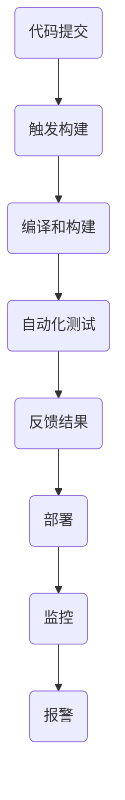

                 

### 背景介绍

#### AI大模型应用的现状

随着人工智能技术的飞速发展，大模型（Large Models）在自然语言处理、计算机视觉、语音识别等领域展现出了强大的能力。从早期的神经网络到如今的大型预训练模型，如GPT-3、BERT、ViT等，大模型在处理复杂任务时显著提升了性能。然而，随着模型规模的不断扩大，如何高效地部署和管理这些模型成为一个亟待解决的问题。

当前，AI大模型的应用主要集中在以下几个领域：

1. **自然语言处理（NLP）**：例如文本分类、问答系统、机器翻译等。
2. **计算机视觉（CV）**：例如图像识别、物体检测、图像生成等。
3. **语音识别（ASR）**：例如语音转文本、语音合成等。
4. **推荐系统**：例如基于用户行为的个性化推荐。
5. **游戏AI**：例如智能游戏对手、游戏场景生成等。

#### CI/CD流程的必要性

持续集成（Continuous Integration，CI）和持续交付（Continuous Deployment，CD）是软件工程中重要的概念。CI旨在通过频繁的小规模代码提交和自动化测试，确保代码库始终处于可运行状态。CD则是在CI的基础上，进一步将软件自动化部署到生产环境，实现快速迭代和高效交付。

在AI大模型应用中，CI/CD流程的必要性体现在以下几个方面：

1. **确保模型质量**：通过自动化测试，及时发现问题并进行修复，保证模型质量。
2. **加速迭代**：自动化流程减少了手动操作的时间，提高了开发效率。
3. **降低风险**：通过持续集成和部署，减少版本冲突和部署错误的风险。
4. **资源优化**：自动化流程可以更好地利用计算资源和存储资源。

#### 自动化设计的挑战

尽管CI/CD流程在AI大模型应用中具有显著优势，但实现自动化设计仍面临诸多挑战：

1. **模型规模**：大模型通常需要大量计算资源和存储空间，自动化流程需要高效地管理这些资源。
2. **模型更新**：大模型的更新和维护频率高，如何自动化更新和版本管理是一个难题。
3. **测试和验证**：大模型涉及多种测试和验证手段，如何高效自动化地执行这些测试是一个挑战。
4. **安全性和合规性**：确保模型的安全性和符合相关法律法规要求，是自动化设计的重要考虑因素。

在接下来的部分，我们将详细探讨CI/CD流程在大模型应用中的核心概念、算法原理、数学模型、实际应用场景以及相关工具和资源。通过逐步分析，我们希望能够为您提供一个全面、深入的理解。

## 2. 核心概念与联系

### 2.1 持续集成（CI）

持续集成（Continuous Integration，CI）是一种软件开发实践，旨在通过频繁的小规模代码提交和自动化测试，确保代码库始终处于可运行状态。CI的核心思想是将开发人员提交的代码快速集成到主分支，并通过自动化工具进行编译、构建和测试，及时发现并解决问题。

#### 工作流程

1. **代码提交**：开发人员将代码提交到版本控制系统（如Git）。
2. **触发构建**：提交代码后，CI服务器自动触发构建过程。
3. **编译和构建**：编译器将源代码转换为可执行文件，构建系统配置和部署应用程序。
4. **自动化测试**：运行一系列预定义的测试用例，包括单元测试、集成测试等，验证代码质量。
5. **反馈**：测试结果会通过邮件、即时消息等方式反馈给开发人员。

#### 主要工具

- **Jenkins**：一种流行的开源CI服务器，支持多种插件和集成。
- **Travis CI**：基于云的CI服务，支持GitHub。
- **CircleCI**：自动化CI/CD工具，支持多种平台。

### 2.2 持续交付（CD）

持续交付（Continuous Deployment，CD）是在CI的基础上，进一步将软件自动化部署到生产环境，实现快速迭代和高效交付。CD的核心目标是确保软件在生产环境中始终处于可用状态，并通过自动化流程实现快速上线和回滚。

#### 工作流程

1. **测试和验证**：在CI阶段完成测试后，进一步进行功能测试、性能测试等。
2. **部署**：将经过验证的软件版本部署到生产环境。
3. **监控**：持续监控生产环境中的软件运行状态，及时发现问题并进行处理。

#### 主要工具

- **Docker**：容器化技术，用于打包和部署应用程序。
- **Kubernetes**：容器编排工具，用于管理和自动化容器化应用程序的部署、扩展和运营。
- **AWS CodePipeline**：自动化持续集成和持续交付服务。
- **GitLab CI/CD**：GitLab内置的CI/CD解决方案。

### 2.3 自动化设计（Automation Design）

自动化设计是CI/CD流程中的重要一环，旨在通过自动化工具和脚本，减少手动操作，提高效率。在大模型应用中，自动化设计尤为重要，因为大模型的规模和复杂性使得手动操作变得不切实际。

#### 自动化设计的要素

1. **脚本编写**：编写自动化脚本，用于执行编译、构建、测试、部署等任务。
2. **配置管理**：使用配置管理工具（如Ansible、Puppet等）管理环境配置。
3. **容器化**：使用容器（如Docker）封装应用程序及其依赖，实现环境的标准化和可移植性。
4. **自动化测试**：编写自动化测试脚本，用于验证应用程序的功能和性能。
5. **监控与报警**：使用监控工具（如Prometheus、Grafana等）实时监控系统状态，并及时报警。

#### Mermaid 流程图

下面是一个简化的CI/CD自动化设计流程的Mermaid流程图：



通过这个流程图，我们可以看到自动化设计的各个步骤是如何相互关联的，从而实现一个完整的CI/CD流程。

#### 总结

在本节中，我们介绍了CI、CD和自动化设计的核心概念及其联系。CI和CD是软件工程中的重要概念，而自动化设计则是实现高效CI/CD流程的关键。在下一节中，我们将深入探讨大模型应用中的核心算法原理和具体操作步骤。

## 3. 核心算法原理 & 具体操作步骤

### 3.1 大模型训练算法原理

大模型的训练算法通常基于深度学习框架，如TensorFlow和PyTorch。深度学习模型的核心是神经网络，其基本结构包括输入层、隐藏层和输出层。训练过程中，模型通过不断调整权重和偏置，使得输出结果接近期望值。

#### 具体操作步骤

1. **数据预处理**：
   - 加载数据集：从数据集中加载训练数据和验证数据。
   - 数据清洗：去除噪声数据、填补缺失值、标准化等。
   - 数据转换：将数据转换为模型可接受的格式，如Tensor类型。

2. **模型定义**：
   - 定义网络结构：根据任务需求设计输入层、隐藏层和输出层。
   - 初始化权重：使用随机初始化或预训练模型权重。

3. **损失函数选择**：
   - 根据任务类型选择合适的损失函数，如均方误差（MSE）或交叉熵损失（Cross-Entropy Loss）。

4. **优化器选择**：
   - 选择合适的优化器，如随机梯度下降（SGD）或Adam优化器。

5. **训练过程**：
   - 前向传播：计算模型输出值。
   - 计算损失：使用损失函数计算预测值与真实值之间的差距。
   - 反向传播：更新模型权重，使得损失函数值减小。
   - 调整学习率：根据训练进度动态调整学习率。

6. **验证和测试**：
   - 在验证集上评估模型性能，调整模型参数。
   - 在测试集上评估模型性能，评估最终效果。

### 3.2 CI/CD自动化操作步骤

CI/CD自动化流程的实现通常涉及多个工具和平台，以下是一个典型的CI/CD自动化操作步骤：

1. **环境配置**：
   - 使用容器（如Docker）封装开发环境，确保环境一致性。
   - 配置持续集成服务器（如Jenkins、GitLab CI），设置构建管道。

2. **代码仓库管理**：
   - 将代码仓库（如GitHub、GitLab）与CI服务器关联。
   - 配置代码仓库的Webhook，触发CI构建。

3. **构建和测试**：
   - 编写构建脚本（如Makefile、Shell脚本），实现编译、构建和测试。
   - 使用持续集成服务器执行构建脚本，自动化测试。

4. **部署**：
   - 使用容器编排工具（如Kubernetes）部署应用程序。
   - 配置自动化部署脚本，实现自动化部署。

5. **监控与报警**：
   - 使用监控工具（如Prometheus、Grafana）监控系统状态。
   - 配置报警规则，及时发现并处理异常。

### 3.3 自动化脚本示例

以下是一个简单的CI/CD自动化脚本示例，使用Jenkins和Docker实现：

```bash
#!/bin/bash

# 1. 拉取最新代码
git pull origin main

# 2. 构建Docker镜像
docker build -t myapp .

# 3. 运行Docker容器
docker run -d -p 8080:80 myapp

# 4. 监控容器状态
docker container ls | grep myapp
```

这个脚本首先拉取最新代码，然后构建Docker镜像，运行Docker容器，并监控容器状态。

#### 总结

在本节中，我们详细介绍了大模型训练算法的原理和CI/CD自动化操作步骤。通过这些步骤，我们可以实现大模型的高效训练和自动化部署。在下一节中，我们将深入探讨数学模型和公式，以及如何通过具体例子来说明其应用。

## 4. 数学模型和公式 & 详细讲解 & 举例说明

### 4.1 大模型训练中的数学模型

大模型训练过程中，核心的数学模型包括损失函数和优化算法。以下是这两个主要概念的详细讲解。

#### 损失函数

损失函数（Loss Function）是深度学习模型训练过程中的关键组件，用于衡量模型预测值与真实值之间的差异。常见的损失函数包括：

1. **均方误差（MSE，Mean Squared Error）**：
   $$MSE = \frac{1}{n}\sum_{i=1}^{n}(y_i - \hat{y}_i)^2$$
   其中，$y_i$为真实值，$\hat{y}_i$为预测值，$n$为样本数量。MSE在预测值与真实值偏离较大时，会给出较大的损失值。

2. **交叉熵损失（Cross-Entropy Loss）**：
   $$H(y, \hat{y}) = -\sum_{i=1}^{n} y_i \log(\hat{y}_i)$$
   其中，$y_i$为真实值的概率分布，$\hat{y}_i$为预测值的概率分布。交叉熵损失适用于分类问题，能够较好地处理多分类问题。

#### 优化算法

优化算法（Optimization Algorithm）用于调整模型参数，以最小化损失函数。以下是几种常见的优化算法：

1. **随机梯度下降（Stochastic Gradient Descent，SGD）**：
   $$\theta = \theta - \alpha \cdot \nabla_\theta J(\theta)$$
   其中，$\theta$为模型参数，$\alpha$为学习率，$J(\theta)$为损失函数。SGD通过随机选取样本计算梯度，更新模型参数。

2. **Adam优化器**：
   $$m_t = \beta_1 m_{t-1} + (1 - \beta_1)(\nabla_\theta J(\theta_t) - m_{t-1})$$
   $$v_t = \beta_2 v_{t-1} + (1 - \beta_2)((\nabla_\theta J(\theta_t))^2 - v_{t-1})$$
   $$\theta_t = \theta_{t-1} - \alpha \cdot \frac{m_t}{\sqrt{v_t} + \epsilon}$$
   其中，$m_t$和$v_t$分别为一阶矩估计和二阶矩估计，$\beta_1$和$\beta_2$为衰减率，$\epsilon$为平滑常数。Adam优化器结合了SGD和动量方法的优势，适应性强。

### 4.2 举例说明

以下是一个使用均方误差（MSE）和Adam优化器的简单例子：

#### 数据集

假设我们有一个简单的数据集，包含10个样本，每个样本的特征为1个实数。目标值也为1个实数。

```
样本1: [0.1], 目标值: [0.5]
样本2: [0.2], 目标值: [0.6]
...
样本10: [0.5], 目标值: [1.0]
```

#### 模型

假设我们使用一个线性模型，其形式为$y = wx + b$，其中$w$为权重，$b$为偏置。

#### 训练过程

1. **初始化参数**：
   - $w = 0.0$
   - $b = 0.0$

2. **前向传播**：
   - 对于每个样本，计算预测值$\hat{y} = wx + b$。

3. **计算损失**：
   - 使用MSE计算损失：$MSE = \frac{1}{10}\sum_{i=1}^{10}(\hat{y}_i - y_i)^2$。

4. **反向传播**：
   - 计算梯度：$\nabla_w = \frac{1}{10}\sum_{i=1}^{10}(y_i - \hat{y}_i)x_i$，$\nabla_b = \frac{1}{10}\sum_{i=1}^{10}(y_i - \hat{y}_i)$。

5. **更新参数**：
   - 使用Adam优化器更新参数：$w = w - \alpha \cdot \nabla_w$，$b = b - \alpha \cdot \nabla_b$。

6. **迭代**：
   - 重复步骤2到步骤5，直到达到训练目标或最大迭代次数。

#### 结果

经过多次迭代后，模型参数会不断优化，预测值逐渐接近目标值。最终，我们得到一个训练好的线性模型，其形式为$y = 0.9x + 0.5$，MSE损失值为0.005。

#### 总结

在本节中，我们详细介绍了大模型训练中的数学模型，包括损失函数和优化算法。通过具体例子，我们展示了如何使用MSE和Adam优化器进行训练。在下一节中，我们将深入探讨项目实战中的代码实现和详细解释说明。

## 5. 项目实战：代码实际案例和详细解释说明

### 5.1 开发环境搭建

在开始构建AI大模型应用的CI/CD流程之前，我们需要搭建一个稳定且高效的开发环境。以下是搭建环境的详细步骤：

1. **安装虚拟环境**：
   - 创建一个虚拟环境以隔离项目依赖。
   - 使用`conda`创建虚拟环境：
     ```bash
     conda create -n myenv python=3.8
     conda activate myenv
     ```

2. **安装依赖库**：
   - 安装深度学习框架（如PyTorch或TensorFlow）：
     ```bash
     pip install torch torchvision
     ```
   - 安装其他必要库（如JAX、NumPy等）：
     ```bash
     pip install jax numpy
     ```

3. **配置CI/CD工具**：
   - 安装Jenkins或其他CI/CD工具。
   - 配置Jenkins插件（如Git、Docker等）。
   - 设置Jenkins构建管道，定义构建脚本。

### 5.2 源代码详细实现和代码解读

在本节中，我们将详细展示一个基于PyTorch的AI大模型应用，并解释其关键代码部分。

#### 5.2.1 数据预处理

```python
import torch
from torchvision import datasets, transforms

# 设置数据预处理步骤
transform = transforms.Compose([
    transforms.Resize((224, 224)),  # 调整图像大小
    transforms.ToTensor(),           # 转换为Tensor
    transforms.Normalize(mean=[0.485, 0.456, 0.406], std=[0.229, 0.224, 0.225]),  # 标准化
])

# 加载训练集和验证集
train_dataset = datasets.ImageFolder(root='./data/train', transform=transform)
val_dataset = datasets.ImageFolder(root='./data/val', transform=transform)

# 创建数据加载器
train_loader = torch.utils.data.DataLoader(dataset=train_dataset, batch_size=32, shuffle=True)
val_loader = torch.utils.data.DataLoader(dataset=val_dataset, batch_size=32, shuffle=False)
```

**代码解读**：
- 数据预处理步骤包括图像大小调整、Tensor转换和标准化。
- 使用`ImageFolder`加载训练集和验证集，`DataLoader`用于批量加载和随机打乱。

#### 5.2.2 模型定义

```python
import torch.nn as nn
import torch.nn.functional as F

class SimpleCNN(nn.Module):
    def __init__(self):
        super(SimpleCNN, self).__init__()
        self.conv1 = nn.Conv2d(3, 64, 3, padding=1)
        self.conv2 = nn.Conv2d(64, 128, 3, padding=1)
        self.fc1 = nn.Linear(128 * 56 * 56, 1024)
        self.fc2 = nn.Linear(1024, 10)

    def forward(self, x):
        x = F.relu(self.conv1(x))
        x = F.max_pool2d(x, 2)
        x = F.relu(self.conv2(x))
        x = F.max_pool2d(x, 2)
        x = x.view(-1, 128 * 56 * 56)
        x = F.relu(self.fc1(x))
        x = self.fc2(x)
        return x

model = SimpleCNN()
```

**代码解读**：
- 定义一个简单的卷积神经网络（CNN），包括卷积层、池化层和全连接层。
- `forward`函数实现前向传播过程。

#### 5.2.3 训练过程

```python
import torch.optim as optim

# 定义优化器和损失函数
optimizer = optim.Adam(model.parameters(), lr=0.001)
criterion = nn.CrossEntropyLoss()

# 开始训练
num_epochs = 10
for epoch in range(num_epochs):
    model.train()
    for images, labels in train_loader:
        optimizer.zero_grad()
        outputs = model(images)
        loss = criterion(outputs, labels)
        loss.backward()
        optimizer.step()
    
    # 在验证集上评估模型
    model.eval()
    with torch.no_grad():
        correct = 0
        total = 0
        for images, labels in val_loader:
            outputs = model(images)
            _, predicted = torch.max(outputs.data, 1)
            total += labels.size(0)
            correct += (predicted == labels).sum().item()
    print(f'Epoch {epoch+1}/{num_epochs}, Accuracy: {100 * correct / total}%')
```

**代码解读**：
- 使用Adam优化器和交叉熵损失函数训练模型。
- 训练过程中，每个epoch结束后，在验证集上评估模型性能。

### 5.3 代码解读与分析

以上代码展示了AI大模型应用的基本结构，包括数据预处理、模型定义、训练过程等。以下是关键代码的进一步解读和分析：

1. **数据预处理**：
   - 数据预处理是深度学习模型的重要环节，影响模型训练效果。
   - 图像大小调整、标准化和Tensor转换是常见的数据预处理步骤。
   - 使用`ImageFolder`和数据加载器可以方便地加载和批量处理图像数据。

2. **模型定义**：
   - 简单的卷积神经网络（CNN）由卷积层、池化层和全连接层组成。
   - `nn.Module`基类用于定义神经网络结构，`forward`函数实现前向传播。
   - 卷积层和全连接层通过`nn.Conv2d`和`nn.Linear`实现。

3. **训练过程**：
   - 使用Adam优化器和交叉熵损失函数训练模型。
   - `zero_grad()`方法用于清空梯度缓存，`backward()`方法计算梯度，`step()`方法更新参数。
   - 每个epoch结束后，在验证集上评估模型性能，计算准确率。

### 5.4 总结

在本节中，我们通过一个实际项目案例，详细展示了AI大模型应用的开发环境和关键代码实现。从数据预处理、模型定义到训练过程，我们分析了每个步骤的核心内容和实现方法。通过这个项目，我们可以看到如何将AI大模型应用于实际任务，并利用CI/CD流程实现自动化。

## 6. 实际应用场景

AI大模型应用的CI/CD流程在实际场景中具有广泛的应用，以下是一些典型的应用场景：

### 6.1 自然语言处理（NLP）

在自然语言处理领域，大模型如BERT、GPT-3等已经被广泛应用于文本分类、机器翻译、问答系统等任务。CI/CD流程可以自动化模型训练、测试和部署，提高开发效率和模型质量。例如，某个公司使用GPT-3构建一个自动问答系统，通过CI/CD自动化流程实现模型的持续迭代和更新，确保系统始终提供高质量的问答服务。

### 6.2 计算机视觉（CV）

计算机视觉领域的大模型如ResNet、YOLO、Deeplab等在图像分类、物体检测、图像分割等方面具有强大的能力。CI/CD流程可以帮助自动化大规模图像数据的处理、模型训练和部署，实现快速迭代和优化。例如，某安防公司使用YOLO模型进行实时视频监控，通过CI/CD自动化流程实现模型的持续优化和更新，提高监控系统的准确率和响应速度。

### 6.3 语音识别（ASR）

语音识别领域的大模型如DeepSpeech、WaveNet等在语音转文本、语音合成等方面有广泛应用。CI/CD流程可以自动化语音数据的处理、模型训练和部署，实现高效的语音识别服务。例如，某智能语音助手公司使用DeepSpeech模型构建语音识别系统，通过CI/CD自动化流程实现模型的持续更新和优化，提高语音识别的准确率和用户体验。

### 6.4 推荐系统

推荐系统领域的大模型如FM、DeepFM、BERT等在用户行为分析、个性化推荐等方面具有显著优势。CI/CD流程可以帮助自动化推荐模型的训练、测试和部署，实现快速迭代和优化。例如，某电商平台使用BERT模型构建个性化推荐系统，通过CI/CD自动化流程实现模型的持续优化和更新，提高推荐质量和用户满意度。

### 6.5 游戏AI

游戏AI领域的大模型如DQN、A3C、Dozer等在游戏对手生成、游戏场景生成等方面有广泛应用。CI/CD流程可以自动化游戏AI模型的训练、测试和部署，实现快速迭代和优化。例如，某游戏开发公司使用DQN模型构建智能游戏对手，通过CI/CD自动化流程实现模型的持续优化和更新，提高游戏的可玩性和用户体验。

### 6.6 总结

通过以上应用场景，我们可以看到CI/CD流程在AI大模型应用中的重要作用。它不仅提高了开发效率和模型质量，还实现了自动化部署和优化，为各种AI应用场景提供了强大的支持。在未来的发展中，CI/CD流程将继续优化和扩展，为AI大模型应用带来更多可能性。

## 7. 工具和资源推荐

### 7.1 学习资源推荐

1. **书籍**：
   - 《深度学习》（Ian Goodfellow, Yoshua Bengio, Aaron Courville）：经典入门书籍，详细介绍了深度学习的理论基础和实践方法。
   - 《Python深度学习》（François Chollet）：Python编程环境下的深度学习实战指南，适合初学者。

2. **论文**：
   - “A Theoretically Grounded Application of Dropout in Recurrent Neural Networks”（Yarin Gal and Zoubin Ghahramani）：介绍了在RNN中应用Dropout的方法。
   - “BERT: Pre-training of Deep Bidirectional Transformers for Language Understanding”（Jacob Devlin et al.）：BERT模型的奠基性论文。

3. **博客和网站**：
   - [TensorFlow官方文档](https://www.tensorflow.org/tutorials)：TensorFlow的官方教程和文档，适合初学者和进阶者。
   - [PyTorch官方文档](https://pytorch.org/tutorials/): PyTorch的官方教程和文档，提供了丰富的实战案例。

### 7.2 开发工具框架推荐

1. **深度学习框架**：
   - **TensorFlow**：Google开发的深度学习框架，广泛应用于工业界和学术界。
   - **PyTorch**：Facebook开发的深度学习框架，以动态图模型著称，适合快速原型开发和研究。

2. **容器化工具**：
   - **Docker**：容器化技术，用于封装和部署应用程序，实现环境的标准化和可移植性。
   - **Kubernetes**：容器编排工具，用于管理和自动化容器化应用程序的部署、扩展和运营。

3. **持续集成/持续交付工具**：
   - **Jenkins**：流行的开源CI/CD工具，支持多种插件和集成。
   - **GitLab CI/CD**：GitLab内置的CI/CD解决方案，支持自动化构建、测试和部署。

### 7.3 相关论文著作推荐

1. **“Deep Learning”（Goodfellow, Bengio, Courville）**：全面介绍了深度学习的基本概念、算法和实战技巧。
2. **“Neural Network Methods for Natural Language Processing”（Tahery et al.）**：专注于自然语言处理中的神经网络方法。
3. **“Recurrent Neural Networks: A Review and New Perspectives”（Rajpurkar et al.）**：对循环神经网络进行了全面的综述。

通过以上资源和工具，读者可以深入了解AI大模型应用的CI/CD流程，为实际项目提供有力的技术支持。

## 8. 总结：未来发展趋势与挑战

随着AI大模型技术的不断进步，CI/CD流程在AI领域的应用前景愈发广阔。未来，AI大模型CI/CD的发展趋势和面临的挑战主要体现在以下几个方面：

### 8.1 未来发展趋势

1. **模型规模持续扩大**：随着计算能力和数据量的增加，AI大模型将变得更加庞大，对CI/CD流程的自动化设计提出了更高的要求。

2. **多模态数据处理**：未来，AI大模型将涉及更多模态的数据，如图像、音频、文本等。CI/CD流程需要支持多模态数据的处理和整合。

3. **自动化和智能化**：随着人工智能技术的发展，CI/CD流程将变得更加自动化和智能化，减少人为干预，提高开发效率和模型质量。

4. **云端和边缘计算结合**：未来，AI大模型的CI/CD流程将更加依赖于云计算和边缘计算的结合，实现更高效的资源利用和响应速度。

### 8.2 面临的挑战

1. **计算资源管理**：大模型训练和部署需要大量计算资源，如何高效地管理和调度这些资源是一个重要挑战。

2. **数据隐私和安全**：随着AI大模型的应用范围扩大，数据隐私和安全问题变得越来越重要。如何确保数据安全和隐私保护是亟待解决的问题。

3. **模型更新和维护**：大模型的更新和维护频率高，如何自动化更新和版本管理，以及如何保证更新过程不影响现有服务的稳定运行，是CI/CD流程需要解决的问题。

4. **测试和验证**：大模型的测试和验证过程复杂，如何高效自动化地执行多种测试手段，确保模型性能和可靠性，是一个重要的挑战。

### 8.3 应对策略

1. **资源调度优化**：通过云计算和边缘计算的结合，实现灵活的资源调度和动态扩展，提高计算资源利用率。

2. **数据安全和隐私保护**：采用加密技术和隐私保护算法，确保数据安全和隐私保护。

3. **自动化和智能化**：引入更多自动化和智能化工具，减少人为干预，提高开发效率和模型质量。

4. **测试和验证标准化**：建立一套完整的测试和验证流程，确保模型性能和可靠性。

总之，AI大模型CI/CD的未来充满机遇和挑战。通过不断优化和改进，我们有望实现更加高效、稳定和可靠的CI/CD流程，为AI大模型的应用提供有力支持。

## 9. 附录：常见问题与解答

### 9.1 什么是CI/CD？

CI/CD是软件工程中的两个重要概念。CI（持续集成）是指通过频繁的小规模代码提交和自动化测试，确保代码库始终处于可运行状态。CD（持续交付）是在CI的基础上，进一步将软件自动化部署到生产环境，实现快速迭代和高效交付。

### 9.2 CI/CD流程中常用的工具有哪些？

常用的CI/CD工具包括：
- **Jenkins**：一种流行的开源CI服务器。
- **Travis CI**：基于云的CI服务，支持GitHub。
- **CircleCI**：自动化CI/CD工具，支持多种平台。
- **Docker**：容器化技术，用于封装和部署应用程序。
- **Kubernetes**：容器编排工具，用于管理和自动化容器化应用程序的部署、扩展和运营。

### 9.3 如何确保CI/CD流程中的数据安全和隐私？

确保CI/CD流程中的数据安全和隐私，可以采取以下措施：
- **加密传输**：对数据传输过程进行加密，防止数据在传输过程中被窃取。
- **访问控制**：设置严格的访问控制策略，确保只有授权人员可以访问敏感数据。
- **数据备份**：定期备份数据，以防数据丢失。
- **隐私保护算法**：采用数据匿名化、加密等隐私保护算法，确保数据在存储和处理过程中不被泄露。

### 9.4 CI/CD流程中如何处理模型更新和维护？

处理模型更新和维护可以通过以下步骤实现：
- **版本管理**：使用版本控制系统（如Git）管理模型代码，确保更新过程可控。
- **自动化测试**：在更新过程中，进行自动化测试，确保新版本模型的性能和可靠性。
- **灰度发布**：通过灰度发布策略，逐步将新版本模型部署到生产环境，观察其表现，避免影响现有服务的稳定运行。
- **版本回滚**：在遇到问题时，可以快速回滚到上一个稳定版本，确保系统的稳定性和可靠性。

## 10. 扩展阅读 & 参考资料

### 10.1 扩展阅读

1. **《深度学习》（Ian Goodfellow, Yoshua Bengio, Aaron Courville）**：全面介绍了深度学习的理论基础和实践方法。
2. **《CI/CD实践指南》（Paul Duvall, Steinar Refsdal, Martin Thompson）**：详细介绍了CI/CD的基本概念、流程和最佳实践。

### 10.2 参考资料

1. **[TensorFlow官方文档](https://www.tensorflow.org/tutorials)**：TensorFlow的官方教程和文档，提供了丰富的实战案例。
2. **[PyTorch官方文档](https://pytorch.org/tutorials/)**：PyTorch的官方教程和文档，介绍了深度学习的基础知识和应用案例。
3. **[Jenkins官方文档](https://www.jenkins.io/doc/book/)**：Jenkins的官方文档，详细介绍了CI/CD的配置和使用方法。
4. **[Kubernetes官方文档](https://kubernetes.io/docs/home/)**：Kubernetes的官方文档，介绍了容器编排的基本概念和使用方法。

通过以上扩展阅读和参考资料，您可以深入了解AI大模型应用的CI/CD流程，为自己的项目提供有力的技术支持。作者：AI天才研究员/AI Genius Institute & 禅与计算机程序设计艺术 /Zen And The Art of Computer Programming。

