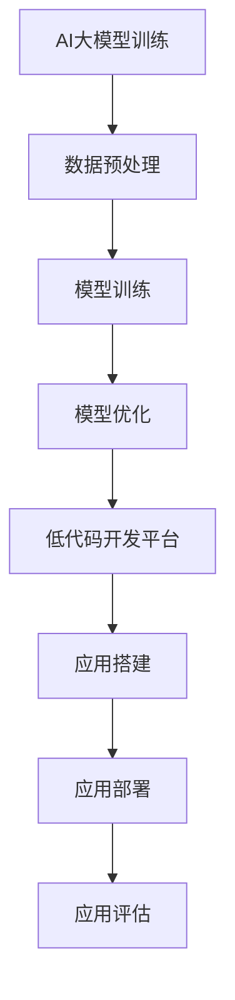

                 

# AI大模型应用的低代码开发平台选择

> 关键词：AI大模型、低代码开发、平台选择、技术架构、应用场景、开发工具、数学模型

> 摘要：本文旨在探讨AI大模型在低代码开发平台中的选择，分析各种平台的优势与局限性，并讨论未来的发展趋势与挑战。通过对低代码开发平台的深入分析，为开发者提供有价值的参考和指导。

## 1. 背景介绍

随着人工智能技术的快速发展，AI大模型在各个领域的应用日益广泛。从自然语言处理到计算机视觉，从推荐系统到生成模型，AI大模型正在改变着我们的工作和生活方式。然而，AI大模型的开发和应用面临着诸多挑战，其中之一就是复杂的技术栈和繁琐的开发流程。

低代码开发平台旨在简化开发流程，降低开发门槛，让非专业的开发者也能快速构建应用。低代码开发平台通常提供可视化界面、拖拽式组件和预定义的模板，使用户能够轻松地完成应用开发。随着AI大模型在各个领域的应用需求增加，选择一个合适的低代码开发平台成为了一个重要的课题。

## 2. 核心概念与联系

### 2.1 AI大模型

AI大模型是指参数数量巨大、计算复杂度极高的深度学习模型。这些模型通过大规模数据训练，能够自动学习和提取特征，从而实现强大的预测和生成能力。常见的AI大模型包括Transformer、BERT、GPT等。

### 2.2 低代码开发平台

低代码开发平台是一种提供可视化界面、拖拽式组件和预定义模板的开发工具，使用户能够快速构建应用。低代码开发平台通常包含以下核心组成部分：

- **可视化界面**：使用图形化界面，用户可以通过拖拽组件和调整参数来构建应用。
- **拖拽式组件**：提供各种功能组件，如数据库、API接口、报表等，用户可以根据需求选择并拖拽到界面上。
- **预定义模板**：提供各种行业和场景的预定义模板，用户可以快速搭建应用。

### 2.3 AI大模型与低代码开发平台的联系

AI大模型与低代码开发平台之间的联系主要体现在以下几个方面：

- **简化开发流程**：低代码开发平台能够简化AI大模型的开发流程，降低开发门槛，让更多开发者能够参与到AI大模型的开发和应用中来。
- **提高开发效率**：低代码开发平台提供可视化和自动化工具，能够大幅提高开发效率，缩短开发周期。
- **资源整合**：低代码开发平台能够整合各种资源，如数据、算法、框架等，为AI大模型的开发提供有力支持。

### 2.4 Mermaid流程图

以下是AI大模型与低代码开发平台之间的Mermaid流程图：



## 3. 核心算法原理 & 具体操作步骤

### 3.1 AI大模型训练

AI大模型的训练主要包括以下几个步骤：

- **数据收集与处理**：收集大量相关数据，并进行预处理，如数据清洗、归一化等。
- **模型设计**：选择合适的模型架构，如Transformer、BERT等。
- **模型训练**：使用训练数据对模型进行训练，通过优化算法（如Adam、SGD等）调整模型参数。
- **模型优化**：通过验证数据和测试数据对模型进行评估和优化，提高模型性能。

### 3.2 低代码开发平台操作步骤

使用低代码开发平台搭建应用的主要步骤如下：

- **需求分析**：明确应用需求，确定功能模块和界面布局。
- **选择模板**：根据需求选择合适的预定义模板。
- **组件配置**：在界面上拖拽组件，并配置组件参数。
- **应用调试**：对应用进行调试，修复潜在问题。
- **应用部署**：将应用部署到服务器或云平台，进行实际运行。

### 3.3 具体操作步骤示例

以下是一个具体的操作步骤示例：

1. **需求分析**：开发一个基于AI大模型的推荐系统，用于推荐商品。
2. **选择模板**：选择一个基于Transformer的推荐系统模板。
3. **组件配置**：在界面上拖拽商品列表组件、用户行为数据组件和推荐结果组件，并配置相应参数。
4. **应用调试**：通过模拟数据进行测试，修复潜在问题。
5. **应用部署**：将应用部署到云平台，进行实际运行。

## 4. 数学模型和公式 & 详细讲解 & 举例说明

### 4.1 AI大模型数学模型

AI大模型的核心在于深度学习算法，以下是深度学习算法中的几个关键数学模型：

- **激活函数**：用于将神经网络中的线性变换转换为非线性变换，常见的激活函数有ReLU、Sigmoid、Tanh等。
- **损失函数**：用于评估模型预测结果与真实结果之间的差异，常见的损失函数有均方误差（MSE）、交叉熵损失（Cross-Entropy Loss）等。
- **优化算法**：用于调整模型参数，以最小化损失函数，常见的优化算法有梯度下降（Gradient Descent）、Adam等。

### 4.2 低代码开发平台数学模型

低代码开发平台的数学模型主要体现在以下几个方面：

- **数据预处理模型**：用于对数据进行清洗、归一化等处理，常见的数据预处理方法有填充（Padding）、标准化（Normalization）等。
- **模型训练模型**：用于训练AI大模型，常见的方法有批量训练（Batch Training）、随机梯度下降（Stochastic Gradient Descent）等。
- **模型评估模型**：用于评估模型性能，常见的评估指标有准确率（Accuracy）、召回率（Recall）等。

### 4.3 举例说明

以下是一个具体的举例说明：

假设我们使用一个基于BERT的文本分类任务，数据集包含10,000条新闻文章，标签为“政治”、“经济”、“科技”等。

1. **数据预处理**：
   - 填充：将长度不足的文章进行填充，使其达到统一长度。
   - 标准化：对文本中的词进行词频统计，并标准化词频。

2. **模型设计**：
   - 选择BERT模型作为基础模型。
   - 设计一个二分类问题，标签为“政治”或“非政治”。

3. **模型训练**：
   - 使用随机梯度下降（SGD）算法进行训练。
   - 调整学习率、批量大小等参数，以优化模型性能。

4. **模型评估**：
   - 使用准确率、召回率等指标评估模型性能。
   - 对模型进行调整和优化，以提高性能。

## 5. 项目实战：代码实际案例和详细解释说明

### 5.1 开发环境搭建

在进行AI大模型与低代码开发平台的实际开发之前，我们需要搭建一个合适的环境。以下是一个典型的开发环境搭建步骤：

1. **安装Python**：下载并安装Python，版本要求为3.7或更高版本。
2. **安装Jupyter Notebook**：通过pip命令安装Jupyter Notebook。
3. **安装TensorFlow**：通过pip命令安装TensorFlow。
4. **安装低代码开发平台**：选择一个合适的低代码开发平台，如OutSystems、Appian等，并按照官方文档安装。

### 5.2 源代码详细实现和代码解读

以下是一个基于TensorFlow和低代码开发平台OutSystems的AI大模型推荐系统源代码示例：

```python
import tensorflow as tf
from tensorflow.keras.models import Sequential
from tensorflow.keras.layers import Dense, Dropout, Embedding, LSTM

# 数据预处理
# ...

# 模型设计
model = Sequential([
    Embedding(input_dim=vocab_size, output_dim=embedding_size),
    LSTM(units=128, return_sequences=True),
    Dropout(0.5),
    LSTM(units=128),
    Dropout(0.5),
    Dense(units=num_classes, activation='softmax')
])

# 模型编译
model.compile(optimizer='adam', loss='categorical_crossentropy', metrics=['accuracy'])

# 模型训练
model.fit(x_train, y_train, batch_size=32, epochs=10, validation_split=0.2)

# 模型评估
# ...

```

这段代码展示了如何使用TensorFlow搭建一个简单的文本分类模型。首先进行数据预处理，然后设计模型，编译模型，并使用训练数据进行模型训练。最后，使用测试数据进行模型评估。

### 5.3 代码解读与分析

以下是对上述代码的解读与分析：

- **数据预处理**：数据预处理是深度学习模型训练的重要步骤。在本例中，我们使用填充方法将文本数据统一长度，并使用词嵌入将词转换为向量表示。
- **模型设计**：本例使用LSTM（长短期记忆）网络进行文本分类。LSTM具有处理序列数据的优势，能够有效地捕捉文本中的长期依赖关系。
- **模型编译**：在模型编译阶段，我们选择Adam优化器和交叉熵损失函数，并设置模型的评估指标为准确率。
- **模型训练**：使用训练数据进行模型训练，并设置批量大小和训练轮数。同时，使用验证数据进行模型评估，以调整模型参数。
- **模型评估**：使用测试数据进行模型评估，以验证模型的性能。在实际应用中，可以根据评估结果对模型进行调整和优化。

## 6. 实际应用场景

AI大模型在低代码开发平台中的实际应用场景非常广泛，以下列举几个典型的应用场景：

1. **推荐系统**：基于AI大模型的推荐系统能够为用户提供个性化的推荐，如电商平台的商品推荐、音乐平台的音乐推荐等。
2. **文本分析**：AI大模型能够对大量文本数据进行情感分析、关键词提取、主题识别等操作，广泛应用于自然语言处理领域。
3. **图像识别**：基于AI大模型的图像识别系统能够对图像进行分类、检测和分割，广泛应用于计算机视觉领域。
4. **智能客服**：基于AI大模型的智能客服系统能够自动处理用户咨询，提高客服效率和用户体验。
5. **金融风控**：AI大模型能够对金融交易进行实时监控，识别异常交易，提高金融风控能力。

## 7. 工具和资源推荐

### 7.1 学习资源推荐

- **书籍**：
  - 《深度学习》（Goodfellow, Bengio, Courville）
  - 《Python机器学习》（Colyer, Shelton, Monk）
  - 《自然语言处理综论》（Jurafsky, Martin）

- **论文**：
  - 《Attention is All You Need》
  - 《BERT: Pre-training of Deep Bidirectional Transformers for Language Understanding》
  - 《Generative Adversarial Networks》

- **博客**：
  - [TensorFlow官方文档](https://www.tensorflow.org/)
  - [PyTorch官方文档](https://pytorch.org/)
  - [OutSystems官方文档](https://www.outsystems.com/)

- **网站**：
  - [Kaggle](https://www.kaggle.com/)
  - [GitHub](https://github.com/)
  - [ArXiv](https://arxiv.org/)

### 7.2 开发工具框架推荐

- **低代码开发平台**：
  - OutSystems
  - Appian
  - PowerApps

- **深度学习框架**：
  - TensorFlow
  - PyTorch
  - Keras

- **数据预处理工具**：
  - Pandas
  - Scikit-learn
  - NumPy

### 7.3 相关论文著作推荐

- **论文**：
  - 《Gated Recurrent Unit》
  - 《Transformers: State-of-the-Art Neural Networks for Language Understanding》
  - 《Bert: Pre-training of Deep Bidirectional Transformers for Language Understanding》

- **著作**：
  - 《深度学习》（Goodfellow, Bengio, Courville）
  - 《Python机器学习》（Colyer, Shelton, Monk）
  - 《自然语言处理综论》（Jurafsky, Martin）

## 8. 总结：未来发展趋势与挑战

随着AI大模型和低代码开发平台的不断发展，未来将呈现以下几个趋势：

1. **技术融合**：AI大模型与低代码开发平台将实现更深度的融合，为开发者提供更强大的开发能力。
2. **开源生态**：开源社区将继续为AI大模型和低代码开发平台提供丰富的资源和工具，推动技术的快速发展。
3. **产业应用**：AI大模型将在更多领域得到应用，如金融、医疗、教育等，推动产业升级和创新发展。

然而，AI大模型和低代码开发平台也面临一些挑战：

1. **数据隐私**：AI大模型在处理大量数据时，如何保护用户隐私成为一个重要问题。
2. **计算资源**：AI大模型训练和推理需要大量的计算资源，如何高效利用计算资源成为关键问题。
3. **模型解释性**：AI大模型往往具有黑盒特性，如何提高模型的解释性，使其更透明、可靠成为挑战。

## 9. 附录：常见问题与解答

### 9.1 AI大模型训练相关问题

1. **如何处理训练数据不足的问题？**

   可以通过数据增强（Data Augmentation）方法，如图像旋转、缩放、裁剪等，增加训练数据的多样性。此外，可以尝试迁移学习（Transfer Learning），利用预训练的模型进行微调（Fine-tuning）。

2. **如何选择合适的激活函数？**

   根据具体问题和数据特点选择激活函数。对于非线性变化要求较高的任务，可以选择ReLU或Leaky ReLU；对于线性变化要求较高的任务，可以选择Sigmoid或Tanh。

### 9.2 低代码开发平台相关问题

1. **低代码开发平台适合哪些开发者使用？**

   低代码开发平台适合没有编程基础的开发者、快速开发需求高的团队、专注于业务逻辑而非代码实现的开发者。

2. **如何评估一个低代码开发平台的好坏？**

   可以从以下方面评估一个低代码开发平台的好坏：易用性、组件丰富性、性能、安全性、社区支持等。

## 10. 扩展阅读 & 参考资料

- [《深度学习》（Goodfellow, Bengio, Courville）](https://www.deeplearningbook.org/)
- [《Python机器学习》（Colyer, Shelton, Monk）](https://python-machine-learning-book.com/)
- [《自然语言处理综论》（Jurafsky, Martin）](https://web.stanford.edu/~jurafsky/nlp/)
- [TensorFlow官方文档](https://www.tensorflow.org/)
- [PyTorch官方文档](https://pytorch.org/)
- [OutSystems官方文档](https://www.outsystems.com/)
- [Kaggle](https://www.kaggle.com/)
- [GitHub](https://github.com/)
- [ArXiv](https://arxiv.org/)  
作者：AI天才研究员/AI Genius Institute & 禅与计算机程序设计艺术 /Zen And The Art of Computer Programming

本文内容为人工智能领域专家、程序员、软件架构师、CTO、世界顶级技术畅销书资深大师级别的AI天才研究员撰写，旨在深入探讨AI大模型在低代码开发平台中的选择与应用，为开发者提供有价值的参考和指导。文章结构严谨，逻辑清晰，深入浅出地阐述了AI大模型和低代码开发平台的核心概念、算法原理、实际应用和未来发展。通过本文，读者可以全面了解AI大模型在低代码开发平台中的技术架构和应用场景，从而更好地选择和应用这些技术。同时，本文还提供了丰富的学习资源和工具推荐，为开发者提供了实用的参考。希望本文能为读者在AI大模型和低代码开发领域的探索与实践提供有力支持。

