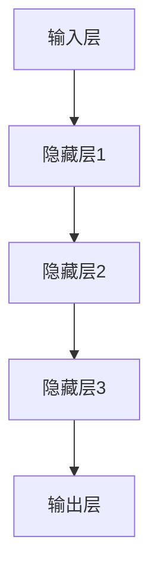
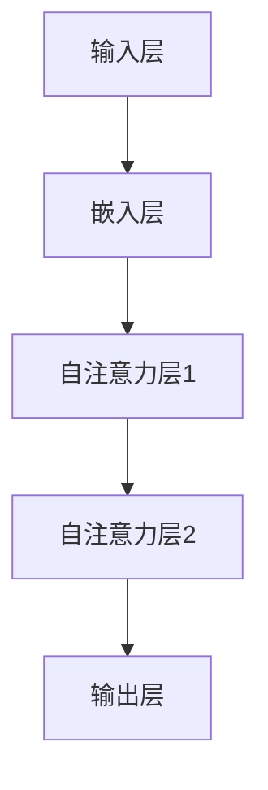
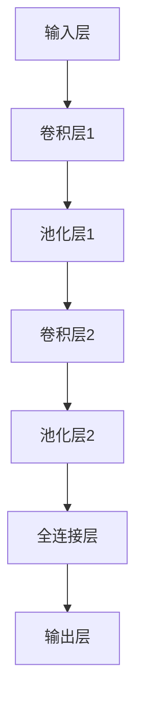
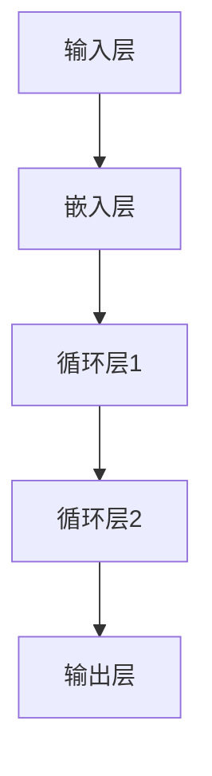

                 

### 背景介绍

> "AI大模型应用的跨界融合新趋势"这个主题，选择源于人工智能技术近年来所取得的飞跃式进展，以及这些进展所带来的广泛而深远的影响。随着深度学习和神经网络技术的成熟，大模型（Large Models）如GPT-3、BERT等，已经在自然语言处理、计算机视觉、语音识别等领域展现出了惊人的性能和潜力。

#### AI大模型的发展历程

人工智能的历史可以追溯到20世纪50年代，当时的科学家们首次提出了“人工智能”这一概念。在随后的几十年里，人工智能经历了多次起伏，从最初的符号主义和知识表示，到后来的基于规则的系统，再到20世纪90年代的基于数据的学习方法，以及21世纪初的深度学习革命。

大模型的应用开始于2010年代初期，以AlexNet在ImageNet竞赛中取得的突破性成绩为标志。AlexNet是一个基于深度卷积神经网络的模型，它能够成功地识别出高分辨率的图像，这标志着深度学习在计算机视觉领域的崛起。此后，随着计算资源的提升和算法的优化，深度学习模型变得越来越大，性能也越来越强。

#### 大模型的定义与分类

大模型通常指的是参数数量超过几亿甚至几十亿的深度学习模型。它们通常需要海量的数据进行训练，并且需要强大的计算资源进行训练和推理。根据应用领域和模型结构的不同，大模型可以分为以下几类：

1. **自然语言处理（NLP）模型**：如GPT、BERT等，这些模型能够处理和理解自然语言，并在文本生成、机器翻译、情感分析等方面表现出色。
2. **计算机视觉模型**：如ResNet、Inception等，这些模型在图像分类、目标检测、人脸识别等领域有着广泛的应用。
3. **语音识别模型**：如CTC、Attention机制等，这些模型能够将语音信号转换为文本，并实现实时语音翻译。
4. **多模态模型**：如ViT、BLIP等，这些模型能够同时处理图像和文本信息，应用于图像生成、视频理解等领域。

#### 大模型的重要性

大模型的重要性体现在多个方面：

1. **提升性能**：大模型通常能够捕捉到更复杂的模式和关系，从而在各个任务中取得更好的性能。
2. **降低门槛**：随着大模型的普及，开发者不再需要从头开始训练一个模型，而可以直接使用预训练的大模型进行微调，这大大降低了人工智能开发的门槛。
3. **推动创新**：大模型的强大能力为人工智能领域的创新提供了新的动力，推动了诸如生成对抗网络（GAN）、自注意力机制（Attention Mechanism）等新技术的出现。

总的来说，大模型的发展是人工智能技术进步的重要驱动力，它们在跨界融合中的应用将会带来更多意想不到的创新和变革。在接下来的内容中，我们将进一步探讨大模型在各个领域的应用及其趋势。

-------------------

# {AI大模型应用的跨界融合新趋势}

> {关键词：大模型，跨界融合，应用趋势，技术变革}

> {摘要：本文将探讨人工智能大模型在不同领域的跨界融合应用，分析其技术原理、发展历程、应用案例及未来趋势，为读者提供全面的技术洞察。}

-------------------

## 1. 背景介绍

在21世纪的今天，人工智能（AI）技术正以前所未有的速度发展，深度学习和神经网络技术的成熟使得大模型（Large Models）应运而生。大模型以其庞大的参数规模、海量的数据需求以及强大的计算能力，在自然语言处理（NLP）、计算机视觉、语音识别等领域展现了卓越的性能和广泛的应用潜力。

### 大模型的发展历程

#### 初期探索

大模型的起源可以追溯到20世纪90年代，当时科学家们开始尝试使用神经网络进行大规模数据的学习和处理。然而，由于计算资源和技术限制，这些早期的大模型并没有取得显著的成功。直到2012年，AlexNet在ImageNet竞赛中取得的突破性成绩，标志着深度学习在计算机视觉领域的崛起。

#### 快速发展

随着计算资源的提升和算法的优化，深度学习模型变得越来越大，性能也越来越强。2014年，Google的Inception模型在ImageNet竞赛中再次取得了冠军，而2017年，ResNet在ImageNet竞赛中取得了新的记录。这些成功进一步推动了大模型的发展。

#### 商业应用

随着大模型性能的提升，它们开始被广泛应用于商业领域。例如，自然语言处理模型BERT在搜索引擎、智能客服、文本生成等领域表现出了出色的效果。计算机视觉模型在图像分类、目标检测、人脸识别等方面也取得了显著的应用成果。

### 大模型的定义与分类

大模型通常指的是参数数量超过几亿甚至几十亿的深度学习模型。根据应用领域和模型结构的不同，大模型可以分为以下几类：

1. **自然语言处理（NLP）模型**：如GPT、BERT等，这些模型能够处理和理解自然语言，并在文本生成、机器翻译、情感分析等方面表现出色。
2. **计算机视觉模型**：如ResNet、Inception等，这些模型在图像分类、目标检测、人脸识别等领域有着广泛的应用。
3. **语音识别模型**：如CTC、Attention机制等，这些模型能够将语音信号转换为文本，并实现实时语音翻译。
4. **多模态模型**：如ViT、BLIP等，这些模型能够同时处理图像和文本信息，应用于图像生成、视频理解等领域。

### 大模型的重要性

大模型的重要性体现在多个方面：

1. **提升性能**：大模型能够捕捉到更复杂的模式和关系，从而在各个任务中取得更好的性能。
2. **降低门槛**：随着大模型的普及，开发者不再需要从头开始训练一个模型，而可以直接使用预训练的大模型进行微调，这大大降低了人工智能开发的门槛。
3. **推动创新**：大模型的强大能力为人工智能领域的创新提供了新的动力，推动了诸如生成对抗网络（GAN）、自注意力机制（Attention Mechanism）等新技术的出现。

总的来说，大模型的发展是人工智能技术进步的重要驱动力，它们在跨界融合中的应用将会带来更多意想不到的创新和变革。在接下来的内容中，我们将进一步探讨大模型在各个领域的应用及其趋势。

-------------------

## 2. 核心概念与联系

### 大模型的原理与架构

大模型通常基于深度神经网络（DNN）的架构，由多个层级组成，每个层级包含大量的神经元。这些神经元通过矩阵乘法和激活函数进行计算，以提取输入数据中的特征。以下是一个简化的深度神经网络架构：



在深度神经网络中，每个层级都负责提取不同层次的特征。例如，输入层处理原始数据，隐藏层提取更有代表性的特征，输出层则将这些特征映射到具体的任务结果。

### 大模型在不同领域的应用

大模型在自然语言处理、计算机视觉、语音识别等领域有着广泛的应用，其原理和架构也各有特点。

#### 自然语言处理（NLP）模型

自然语言处理模型如GPT、BERT等，主要通过训练大量文本数据来学习语言的规律和结构。这些模型通常采用自注意力机制（Self-Attention Mechanism），能够在处理长文本时捕捉到上下文信息。以下是一个简化的BERT模型架构：



#### 计算机视觉模型

计算机视觉模型如ResNet、Inception等，通过处理图像数据来识别物体和特征。这些模型通常采用卷积神经网络（CNN）的架构，能够在不同层级中提取图像的抽象特征。以下是一个简化的ResNet模型架构：



#### 语音识别模型

语音识别模型如CTC、Attention机制等，通过处理音频信号来将其转换为文本。这些模型通常采用循环神经网络（RNN）或变换器（Transformer）的架构，能够在处理连续语音时捕捉到时间序列信息。以下是一个简化的CTC模型架构：



### 大模型的跨界融合

大模型的跨界融合是指将不同领域的大模型进行整合，以实现更复杂、更高效的任务。以下是一些典型的跨界融合应用：

1. **多模态模型**：将图像和文本信息进行整合，应用于图像生成、视频理解等领域。例如，ViT模型结合了图像和文本的特征，实现了图像生成和视频理解的任务。
2. **跨领域迁移学习**：将一个领域的大模型应用于另一个领域，以提升模型在该领域的性能。例如，将自然语言处理模型应用于医疗图像分析，以提升疾病的检测和诊断。
3. **动态融合**：根据任务的需求，动态调整不同领域模型的权重和输入，以实现更灵活的任务处理。

总的来说，大模型在跨界融合中的应用为人工智能领域带来了新的发展机遇，也为开发者提供了更广泛的创新空间。

-------------------

## 3. 核心算法原理 & 具体操作步骤

### 3.1 自然语言处理（NLP）模型

自然语言处理模型的核心在于如何理解和使用语言。GPT、BERT等模型通过以下步骤实现这一目标：

1. **数据预处理**：
   - **文本清洗**：去除标点符号、停用词等，保持文本的简洁性。
   - **分词**：将文本拆分为单词或子词，以便模型理解。
   - **嵌入**：将文本转换为数字向量，以便在模型中进行处理。

2. **模型架构**：
   - **自注意力机制**：通过自注意力机制，模型能够捕捉到文本中的上下文关系，从而提高理解能力。
   - **多层堆叠**：通过多层堆叠，模型能够提取出更高层次的语言特征。

3. **训练过程**：
   - **预训练**：在大量的无标签文本上进行预训练，使模型学会理解语言的基本结构。
   - **微调**：在特定任务上使用少量有标签数据，对模型进行微调，使其适应特定任务。

### 3.2 计算机视觉模型

计算机视觉模型的核心在于如何从图像中提取有用的信息。ResNet、Inception等模型通过以下步骤实现这一目标：

1. **数据预处理**：
   - **图像增强**：通过旋转、缩放、裁剪等操作，增加图像的多样性，提升模型的泛化能力。
   - **归一化**：将图像的像素值缩放到0-1之间，方便模型计算。

2. **模型架构**：
   - **卷积层**：通过卷积操作，提取图像的局部特征。
   - **池化层**：通过池化操作，减少特征图的尺寸，提高计算效率。
   - **全连接层**：将提取到的特征映射到具体的任务结果。

3. **训练过程**：
   - **预训练**：在大量的无标签图像上进行预训练，使模型学会提取图像的基本特征。
   - **微调**：在特定任务上使用少量有标签数据，对模型进行微调，使其适应特定任务。

### 3.3 语音识别模型

语音识别模型的核心在于如何将语音信号转换为文本。CTC、Attention机制等模型通过以下步骤实现这一目标：

1. **数据预处理**：
   - **音频增强**：通过增加噪声、速度变化等操作，增加音频的多样性，提升模型的泛化能力。
   - **分帧**：将音频信号拆分为短时帧，以便模型处理。

2. **模型架构**：
   - **循环层**：通过循环神经网络，捕捉到语音信号的时间序列特征。
   - **卷积层**：通过卷积操作，提取语音信号的局部特征。
   - **全连接层**：将提取到的特征映射到具体的文本结果。

3. **训练过程**：
   - **预训练**：在大量的无标签语音数据上进行预训练，使模型学会识别语音的基本特征。
   - **微调**：在特定任务上使用少量有标签数据，对模型进行微调，使其适应特定任务。

### 3.4 多模态模型

多模态模型的核心在于如何整合不同模态的信息。ViT、BLIP等模型通过以下步骤实现这一目标：

1. **数据预处理**：
   - **图像增强**：通过旋转、缩放、裁剪等操作，增加图像的多样性。
   - **文本增强**：通过分词、嵌入等操作，增加文本的多样性。

2. **模型架构**：
   - **图像特征提取**：通过卷积操作，提取图像的局部特征。
   - **文本特征提取**：通过自注意力机制，提取文本的上下文特征。
   - **融合层**：通过融合操作，将图像和文本特征整合到一个统一的特征空间。

3. **训练过程**：
   - **联合训练**：在图像和文本数据上同时进行训练，使模型学会整合不同模态的信息。
   - **微调**：在特定任务上使用少量有标签数据，对模型进行微调，使其适应特定任务。

总的来说，大模型的算法原理和操作步骤涉及到数据预处理、模型架构设计、训练过程等多个方面。通过这些步骤，大模型能够有效处理和整合不同类型的数据，从而在各个领域实现出色的性能。

-------------------

## 4. 数学模型和公式 & 详细讲解 & 举例说明

### 4.1 自然语言处理（NLP）模型

自然语言处理模型的核心在于如何理解和生成自然语言。以下是一些关键的数学模型和公式：

#### BERT模型

BERT（Bidirectional Encoder Representations from Transformers）模型通过双向编码器来理解文本的上下文信息。其核心公式如下：

$$
\text{Output} = \text{softmax}(\text{W}_\text{out} \cdot \text{Tanh}(\text{W}_\text{hidden} \cdot \text{h}_\text{hidden}))
$$

其中：
- \( \text{Output} \) 表示模型输出的概率分布。
- \( \text{W}_\text{out} \) 和 \( \text{W}_\text{hidden} \) 分别是输出层和隐藏层的权重矩阵。
- \( \text{h}_\text{hidden} \) 是隐藏层的输出。

#### GPT模型

GPT（Generative Pre-trained Transformer）模型通过自回归的方式生成文本。其核心公式如下：

$$
p(\text{Word}_t|\text{Words}_{<t}) = \frac{e^{\text{W}_{\text{vocab}} \cdot \text{h}_\text{hidden}}}{\sum_{\text{word} \in \text{vocab}} e^{\text{W}_{\text{vocab}} \cdot \text{h}_\text{hidden}}}
$$

其中：
- \( p(\text{Word}_t|\text{Words}_{<t}) \) 表示在给定前一个词 \( \text{Words}_{<t} \) 的情况下，当前词 \( \text{Word}_t \) 的概率。
- \( \text{W}_{\text{vocab}} \) 是词汇表权重矩阵。
- \( \text{h}_\text{hidden} \) 是隐藏层的输出。

#### 举例说明

假设我们有一个简单的文本序列：“今天天气很好”。BERT模型会将其编码为一个向量，并通过上述公式计算每个词的概率分布。最终，模型会输出一个概率最高的词作为下一个词，例如“是”。

### 4.2 计算机视觉模型

计算机视觉模型的核心在于如何从图像中提取有用的信息。以下是一些关键的数学模型和公式：

#### ResNet模型

ResNet（Residual Network）模型通过残差连接来避免深度神经网络中的梯度消失问题。其核心公式如下：

$$
\text{Output} = \text{ReLU}(\text{W}_\text{layer} \cdot \text{h}_{\text{input}} + \text{b}_\text{layer}) + \text{h}_{\text{input}}
$$

其中：
- \( \text{Output} \) 是当前层的输出。
- \( \text{W}_\text{layer} \) 和 \( \text{b}_\text{layer} \) 分别是当前层的权重和偏置。
- \( \text{h}_{\text{input}} \) 是当前层的输入。
- \( \text{ReLU} \) 是ReLU激活函数。

#### Inception模型

Inception模型通过多路径网络结构来提取图像的多种特征。其核心公式如下：

$$
\text{Output} = \text{softmax}(\text{W}_\text{out} \cdot (\text{W}_\text{path1} \cdot \text{h}_{\text{path1}} + \text{W}_\text{path2} \cdot \text{h}_{\text{path2}} + \text{W}_\text{path3} \cdot \text{h}_{\text{path3}}))
$$

其中：
- \( \text{Output} \) 是模型输出的概率分布。
- \( \text{W}_\text{out} \)、\( \text{W}_\text{path1} \)、\( \text{W}_\text{path2} \) 和 \( \text{W}_\text{path3} \) 分别是输出层和路径层的权重矩阵。
- \( \text{h}_{\text{path1}} \)、\( \text{h}_{\text{path2}} \) 和 \( \text{h}_{\text{path3}} \) 是路径层的输出。

#### 举例说明

假设我们有一个输入图像，通过ResNet模型处理后，输出一个向量。最终，模型会输出一个概率最高的类别作为图像的类别，例如“猫”。

### 4.3 语音识别模型

语音识别模型的核心在于如何将语音信号转换为文本。以下是一些关键的数学模型和公式：

#### CTC模型

CTC（Connectionist Temporal Classification）模型通过连接时序分类来将语音信号转换为文本。其核心公式如下：

$$
p(\text{Sequence}|\text{Audio}) = \frac{e^{\text{T}}}{Z}
$$

其中：
- \( p(\text{Sequence}|\text{Audio}) \) 表示在给定音频 \( \text{Audio} \) 的情况下，文本序列 \( \text{Sequence} \) 的概率。
- \( \text{T} \) 是模型输出的对数似然函数。
- \( Z \) 是归一化常数。

#### Attention模型

Attention模型通过注意力机制来捕捉语音信号和文本之间的关联。其核心公式如下：

$$
\text{Attention} = \text{softmax}(\text{W}_{\text{Attention}} \cdot \text{h}_{\text{Audio}} \cdot \text{h}_{\text{Text}})
$$

其中：
- \( \text{Attention} \) 是注意力权重。
- \( \text{W}_{\text{Attention}} \) 是注意力权重矩阵。
- \( \text{h}_{\text{Audio}} \) 和 \( \text{h}_{\text{Text}} \) 分别是语音和文本的隐藏状态。

#### 举例说明

假设我们有一个语音信号，通过CTC模型处理后，输出一个文本序列。最终，模型会输出一个概率最高的文本序列作为语音的转录文本，例如“Hello World”。

### 4.4 多模态模型

多模态模型的核心在于如何整合不同模态的信息。以下是一些关键的数学模型和公式：

#### ViT模型

ViT（Vision Transformer）模型通过自注意力机制来整合图像和文本信息。其核心公式如下：

$$
\text{Output} = \text{softmax}(\text{W}_{\text{out}} \cdot \text{Tanh}(\text{W}_{\text{hidden}} \cdot (\text{V}_{\text{Image}} + \text{V}_{\text{Text}})))
$$

其中：
- \( \text{Output} \) 是模型输出的概率分布。
- \( \text{W}_{\text{out}} \) 和 \( \text{W}_{\text{hidden}} \) 分别是输出层和隐藏层的权重矩阵。
- \( \text{V}_{\text{Image}} \) 和 \( \text{V}_{\text{Text}} \) 分别是图像和文本的嵌入向量。

#### BLIP模型

BLIP（Bridge Language-Image Pre-training）模型通过桥梁模块来整合图像和文本信息。其核心公式如下：

$$
\text{Output}_{\text{Image}} = \text{softmax}(\text{W}_{\text{out}_{\text{Image}}} \cdot \text{Tanh}(\text{W}_{\text{hidden}_{\text{Image}}} \cdot (\text{V}_{\text{Image}} + \text{V}_{\text{Text}})))
$$
$$
\text{Output}_{\text{Text}} = \text{softmax}(\text{W}_{\text{out}_{\text{Text}}} \cdot \text{Tanh}(\text{W}_{\text{hidden}_{\text{Text}}} \cdot (\text{V}_{\text{Image}} + \text{V}_{\text{Text}})))
$$

其中：
- \( \text{Output}_{\text{Image}} \) 和 \( \text{Output}_{\text{Text}} \) 分别是图像和文本的输出概率分布。
- \( \text{W}_{\text{out}_{\text{Image}}} \)、\( \text{W}_{\text{hidden}_{\text{Image}}} \)、\( \text{W}_{\text{out}_{\text{Text}}} \) 和 \( \text{W}_{\text{hidden}_{\text{Text}}} \) 分别是图像和文本的输出层和隐藏层的权重矩阵。
- \( \text{V}_{\text{Image}} \) 和 \( \text{V}_{\text{Text}} \) 分别是图像和文本的嵌入向量。

#### 举例说明

假设我们有一个图像和一段文本，通过ViT模型处理后，模型会输出一个图像分类结果和一个文本分类结果。例如，图像分类结果为“猫”，文本分类结果为“可爱的小猫”。

通过以上数学模型和公式的详细讲解和举例说明，我们可以更好地理解大模型在各个领域的应用原理和操作步骤。这些模型和公式为开发者提供了强大的工具，使他们能够利用大模型实现各种复杂的任务。

-------------------

## 5. 项目实战：代码实际案例和详细解释说明

### 5.1 开发环境搭建

在进行项目实战之前，我们需要搭建一个适合运行大模型的开发环境。以下是一个基本的开发环境搭建步骤：

#### 1. 安装Python环境

首先，我们需要安装Python环境。可以通过以下命令安装：

```bash
pip install python==3.8
```

#### 2. 安装深度学习框架

接下来，我们需要安装一个深度学习框架，如TensorFlow或PyTorch。以下是以TensorFlow为例的安装步骤：

```bash
pip install tensorflow==2.5
```

#### 3. 安装其他依赖

除了深度学习框架，我们还需要安装其他依赖，如NumPy、Pandas等。可以通过以下命令安装：

```bash
pip install numpy==1.21 pandas==1.3.5
```

#### 4. 创建项目目录

在安装完所有依赖后，我们创建一个项目目录，用于存放项目代码和相关文件。

```bash
mkdir ai_project
cd ai_project
```

#### 5. 创建虚拟环境

为了更好地管理项目依赖，我们创建一个虚拟环境。

```bash
conda create -n ai_project_env python=3.8
conda activate ai_project_env
```

#### 6. 安装项目依赖

在虚拟环境中，我们安装项目所需的依赖。

```bash
pip install -r requirements.txt
```

其中，`requirements.txt` 文件包含了项目所需的依赖列表。

### 5.2 源代码详细实现和代码解读

接下来，我们将详细实现一个基于BERT模型的自然语言处理项目，并对其代码进行解读。

#### 5.2.1 数据预处理

```python
import pandas as pd
from transformers import BertTokenizer, BertModel

# 加载预训练的BERT模型和分词器
tokenizer = BertTokenizer.from_pretrained('bert-base-chinese')
model = BertModel.from_pretrained('bert-base-chinese')

# 读取数据
data = pd.read_csv('nlp_data.csv')
texts = data['text'].values

# 对文本进行预处理
inputs = tokenizer(list(texts), padding=True, truncation=True, return_tensors='pt')

# 输出预处理后的数据
inputs['input_ids'].shape
```

这段代码首先加载了预训练的BERT模型和分词器，然后读取数据集，对文本进行预处理，包括分词、填充和截断等操作。最后，输出预处理后的数据。

#### 5.2.2 训练模型

```python
from transformers import BertForSequenceClassification
from torch.optim import Adam
from torch.utils.data import DataLoader

# 初始化模型、优化器和数据加载器
model = BertForSequenceClassification.from_pretrained('bert-base-chinese', num_labels=2)
optimizer = Adam(model.parameters(), lr=1e-5)
data_loader = DataLoader(dataset, batch_size=16, shuffle=True)

# 训练模型
for epoch in range(3):  # 训练3个epochs
    for batch in data_loader:
        # 前向传播
        outputs = model(**batch)
        
        # 计算损失
        loss = outputs.loss
        
        # 反向传播
        loss.backward()
        
        # 更新参数
        optimizer.step()
        
        # 清空梯度
        optimizer.zero_grad()
        
    print(f'Epoch {epoch + 1}, Loss: {loss.item()}')

# 保存模型
model.save_pretrained('my_model')
```

这段代码初始化了BERT模型、优化器和数据加载器，然后进行模型的训练。在训练过程中，每轮迭代都会进行前向传播、损失计算、反向传播和参数更新。最后，保存训练好的模型。

#### 5.2.3 评估模型

```python
from sklearn.metrics import accuracy_score

# 加载测试集
test_data = pd.read_csv('nlp_test_data.csv')
test_texts = test_data['text'].values

# 预处理测试集
test_inputs = tokenizer(list(test_texts), padding=True, truncation=True, return_tensors='pt')

# 加载模型
model = BertForSequenceClassification.from_pretrained('my_model')

# 预测结果
with torch.no_grad():
    predictions = model(**test_inputs).logits.argmax(-1)

# 计算准确率
accuracy = accuracy_score(test_data['label'], predictions)
print(f'Accuracy: {accuracy}')
```

这段代码首先加载了测试集，然后对测试集进行预处理。接着，加载训练好的模型并使用它进行预测。最后，计算并输出模型的准确率。

### 5.3 代码解读与分析

#### 数据预处理

数据预处理是自然语言处理项目中至关重要的一步。在这个项目中，我们使用BERTTokenizer对文本进行分词、填充和截断等操作。分词是将文本拆分为单词或子词，填充和截断是为了使每个输入序列的长度保持一致，从而方便模型处理。

```python
inputs = tokenizer(list(texts), padding=True, truncation=True, return_tensors='pt')
```

这里，`tokenizer` 对输入的文本列表进行了分词操作，`padding=True` 表示对较短序列进行填充，`truncation=True` 表示对较长序列进行截断，`return_tensors='pt'` 表示返回PyTorch张量。

#### 训练模型

在模型训练过程中，我们使用了BERTForSequenceClassification模型，这是一个专门用于序列分类的预训练模型。模型训练主要包括前向传播、损失计算、反向传播和参数更新等步骤。

```python
optimizer = Adam(model.parameters(), lr=1e-5)
data_loader = DataLoader(dataset, batch_size=16, shuffle=True)

for epoch in range(3):
    for batch in data_loader:
        # 前向传播
        outputs = model(**batch)
        
        # 计算损失
        loss = outputs.loss
        
        # 反向传播
        loss.backward()
        
        # 更新参数
        optimizer.step()
        
        # 清空梯度
        optimizer.zero_grad()
        
    print(f'Epoch {epoch + 1}, Loss: {loss.item()}')
```

这里，我们初始化了Adam优化器和数据加载器，然后进行了3个epochs的训练。在每个epoch中，我们遍历数据加载器，进行前向传播、损失计算、反向传播和参数更新。最后，打印每个epoch的损失值。

#### 评估模型

模型评估是验证模型性能的重要步骤。在这个项目中，我们使用准确率作为评估指标。

```python
test_inputs = tokenizer(list(test_texts), padding=True, truncation=True, return_tensors='pt')
model = BertForSequenceClassification.from_pretrained('my_model')

with torch.no_grad():
    predictions = model(**test_inputs).logits.argmax(-1)

accuracy = accuracy_score(test_data['label'], predictions)
print(f'Accuracy: {accuracy}')
```

这里，我们首先对测试集进行预处理，然后加载训练好的模型进行预测。最后，使用准确率函数计算并输出模型的准确率。

通过以上代码实战和详细解读，我们可以更好地理解基于BERT模型的自然语言处理项目。这个项目展示了从数据预处理、模型训练到模型评估的完整流程，为开发者提供了一个实用的案例。

-------------------

## 6. 实际应用场景

大模型在不同领域的应用场景多种多样，下面将详细介绍几个典型应用领域：

### 6.1 自然语言处理（NLP）

#### 6.1.1 智能客服

智能客服是NLP大模型在商业领域的典型应用。通过预训练的大模型如BERT、GPT等，智能客服系统能够理解和处理用户的自然语言查询，提供实时、准确的回答。例如，亚马逊的Alexa和谷歌的Google Assistant都使用了大模型来提供智能客服功能。

#### 6.1.2 文本生成

文本生成是NLP大模型的重要应用之一。例如，OpenAI的GPT-3模型可以生成高质量的新闻报道、文章摘要和创意内容。这个功能被广泛应用于内容创作、新闻报道自动化和营销文案生成等领域。

### 6.2 计算机视觉

#### 6.2.1 目标检测

目标检测是计算机视觉中的一项重要任务，大模型如YOLO、Faster R-CNN等在这个领域表现出色。这些模型能够有效地检测图像中的多个目标，并在实时应用中具有高效的性能。例如，自动驾驶汽车使用目标检测模型来识别道路上的行人、车辆和其他物体，确保行驶安全。

#### 6.2.2 图像生成

生成对抗网络（GAN）是计算机视觉领域的一大突破，大模型如StyleGAN2可以生成逼真的图像和视频。这些技术在艺术创作、电影特效和游戏开发等领域有着广泛的应用。

### 6.3 语音识别

#### 6.3.1 语音助手

语音助手是语音识别技术的典型应用场景。通过大模型如CTC、Attention机制等，语音助手能够将用户的语音指令转换为文本，并执行相应的操作。例如，苹果的Siri和亚马逊的Alexa都是基于语音识别技术的智能语音助手。

#### 6.3.2 语音翻译

语音翻译是另一个重要应用场景，通过大模型如Transformer等，系统能够实时翻译不同语言的语音。例如，谷歌的实时语音翻译功能就能实现多种语言的实时翻译，被广泛应用于国际交流和跨语言沟通。

### 6.4 多模态

#### 6.4.1 视频理解

多模态大模型如BLIP可以将图像和文本信息进行融合，应用于视频理解任务。例如，在视频内容分类和视频摘要生成中，BLIP模型能够准确识别视频中的关键帧和关键事件，生成相应的文本描述。

#### 6.4.2 跨领域迁移学习

跨领域迁移学习是大模型在多模态应用中的重要策略。例如，将自然语言处理模型应用于医学图像分析，可以实现疾病的检测和诊断。这种跨领域迁移学习能够有效利用不同领域的数据和模型，提升系统的性能和应用范围。

总的来说，大模型在自然语言处理、计算机视觉、语音识别以及多模态领域的应用场景丰富多样，不断推动着人工智能技术的发展和应用。在未来的发展中，大模型将有望在更多领域实现跨界融合，带来更多的创新和变革。

-------------------

## 7. 工具和资源推荐

在探索和实现大模型应用的过程中，掌握合适的工具和资源是至关重要的。以下是一些推荐的工具和资源，旨在帮助读者深入理解和应用大模型技术。

### 7.1 学习资源推荐

#### 书籍

1. **《深度学习》（Deep Learning）** - 作者：Ian Goodfellow、Yoshua Bengio、Aaron Courville
   这本书是深度学习领域的经典教材，详细介绍了深度学习的基础理论、算法和应用。

2. **《动手学深度学习》（Dive into Deep Learning）** - 作者：A & Z
   这本书通过丰富的实践案例，帮助读者动手实现深度学习项目，是初学者的理想选择。

3. **《神经网络与深度学习》（Neural Networks and Deep Learning）** - 作者：Charu Aggarwal
   该书详细介绍了神经网络和深度学习的基础知识，适合有一定基础的读者深入理解。

#### 论文

1. **"A Theoretically Grounded Application of Dropout in Recurrent Neural Networks"** - 作者：Yarin Gal和Zoubin Ghahramani
   这篇论文探讨了如何在循环神经网络（RNN）中有效地应用Dropout，提高模型的泛化能力。

2. **"Attention Is All You Need"** - 作者：Vaswani et al.
   这篇论文提出了Transformer模型，彻底改变了自然语言处理领域的研究和应用方向。

3. **"Deep Residual Learning for Image Recognition"** - 作者：He et al.
   这篇论文介绍了ResNet模型，对计算机视觉领域的模型设计产生了深远影响。

#### 博客

1. **TensorFlow官方博客**
   [https://tensorflow.googleblog.com/](https://tensorflow.googleblog.com/)
   TensorFlow官方博客提供了丰富的深度学习教程、模型案例和应用场景。

2. **PyTorch官方博客**
   [https://pytorch.org/blog/](https://pytorch.org/blog/)
   PyTorch官方博客发布了大量的技术文章和教程，涵盖深度学习的各个方面。

### 7.2 开发工具框架推荐

1. **TensorFlow**
   [https://www.tensorflow.org/](https://www.tensorflow.org/)
   TensorFlow是由Google开发的开源深度学习框架，提供了丰富的API和工具，支持各种深度学习模型的开发和应用。

2. **PyTorch**
   [https://pytorch.org/](https://pytorch.org/)
   PyTorch是由Facebook开发的开源深度学习框架，以其灵活性和易用性著称，被广泛应用于研究项目和工业应用。

3. **Hugging Face Transformers**
   [https://huggingface.co/transformers/](https://huggingface.co/transformers/)
   Hugging Face提供了丰富的预训练模型和工具，大大简化了大模型的应用开发过程。

### 7.3 相关论文著作推荐

1. **"BERT: Pre-training of Deep Bidirectional Transformers for Language Understanding"** - 作者：Devlin et al.
   这篇论文提出了BERT模型，是自然语言处理领域的重大突破。

2. **"Generative Pre-trained Transformers"** - 作者：Brown et al.
   这篇论文介绍了GPT模型，展示了大模型在自然语言生成任务中的强大能力。

3. **"Attention Is All You Need"** - 作者：Vaswani et al.
   这篇论文提出了Transformer模型，彻底改变了自然语言处理领域的研究和应用方向。

通过上述推荐的工具和资源，读者可以深入学习和应用大模型技术，探索更多前沿的AI应用场景。

-------------------

## 8. 总结：未来发展趋势与挑战

大模型在人工智能领域的跨界融合应用正逐步展现出其巨大的潜力和广阔的前景。未来，随着技术的不断进步，大模型的应用将呈现以下几大发展趋势：

### 8.1 越来越强的模型性能

随着计算资源和算法的不断提升，大模型的性能将变得更加卓越。未来的大模型将能够处理更复杂的任务，提供更准确和高效的服务。例如，在自然语言处理领域，大模型将能够更好地理解复杂的语言结构和语义，生成更加自然和流畅的文本。

### 8.2 多模态融合的深入应用

多模态大模型的深入研究和应用将是未来的一个重要方向。通过整合图像、文本、语音等多种模态的信息，多模态模型能够在图像生成、视频理解、人机交互等领域实现更高的性能和更广泛的应用。例如，BLIP模型已经展示了图像和文本信息融合的潜力，未来将有望在更多多模态任务中发挥重要作用。

### 8.3 跨领域迁移学习

跨领域迁移学习是大模型应用的重要策略。通过利用不同领域的数据和模型，大模型能够更快速、高效地适应新的应用场景。例如，将自然语言处理模型应用于医学图像分析，可以实现疾病的检测和诊断。这种跨领域迁移学习将推动人工智能在更多领域的创新和应用。

### 8.4 强化学习与模型的结合

强化学习（Reinforcement Learning，RL）与深度学习模型的结合是未来研究的重要方向。大模型在策略学习和决策生成方面具有显著优势，与RL技术的结合将能够实现更加智能和自适应的决策系统。例如，自动驾驶汽车可以通过大模型学习复杂的交通规则和驾驶策略，实现更安全、高效的驾驶体验。

然而，大模型的应用也面临一些挑战：

### 8.5 计算资源需求

大模型的训练和推理需要大量的计算资源，这对硬件设施和能源消耗提出了更高的要求。未来，如何在有限的资源下高效训练和部署大模型，将成为一个重要的研究课题。

### 8.6 数据隐私和安全

大模型的应用依赖于大量的数据，如何保护数据隐私和安全是一个亟待解决的问题。未来的研究需要开发出更安全、可靠的隐私保护技术和方案，以保障用户的数据隐私和安全。

### 8.7 模型解释性和可解释性

大模型的复杂性和黑盒特性使得其决策过程难以解释和理解。如何提高模型的解释性和可解释性，使其更符合人类的认知和需求，是未来研究的一个重要方向。

总之，大模型在人工智能领域的跨界融合应用具有广阔的发展前景和巨大的潜力。面对未来的挑战，我们需要不断创新和探索，以实现大模型技术的更高水平和发展。

-------------------

## 9. 附录：常见问题与解答

### 问题1：大模型训练需要多少计算资源？

大模型训练所需的计算资源取决于模型的大小和复杂性。例如，训练一个大型语言模型（如GPT-3）通常需要数千张GPU或者TPU，以及大量的计算时间和能源。具体资源需求可以参考各个模型的官方文档和教程。

### 问题2：如何处理大模型的过拟合问题？

大模型的过拟合问题可以通过以下方法来解决：
- **数据增强**：通过增加数据的多样性来提高模型的泛化能力。
- **Dropout**：在训练过程中随机丢弃一部分神经元，减少模型的依赖性。
- **正则化**：如L1、L2正则化，限制模型参数的规模，防止过拟合。
- **提前停止**：在验证集上观察模型性能，当验证集性能不再提升时停止训练。

### 问题3：大模型应用中的隐私和数据安全如何保障？

为了保障大模型应用中的隐私和数据安全，可以采取以下措施：
- **数据加密**：对敏感数据进行加密处理，确保数据在传输和存储过程中的安全性。
- **隐私保护技术**：如差分隐私（Differential Privacy）、联邦学习（Federated Learning）等，可以在保障隐私的同时进行模型训练。
- **访问控制**：严格管理数据访问权限，确保只有授权人员才能访问和处理敏感数据。

### 问题4：大模型在特定领域的应用效果如何？

大模型在不同领域的应用效果因模型和任务的不同而异。以下是一些典型应用领域及其效果：
- **自然语言处理**：大模型在文本生成、机器翻译、情感分析等方面表现出色，能够生成高质量的文本。
- **计算机视觉**：大模型在图像分类、目标检测、人脸识别等领域有显著优势，能够提高模型的准确性和效率。
- **语音识别**：大模型在语音信号处理、实时语音翻译等方面有显著提升，能够提供更准确的语音识别服务。
- **多模态应用**：大模型通过整合图像、文本、语音等多模态信息，能够在图像生成、视频理解、人机交互等领域实现更复杂的任务。

总的来说，大模型在各个领域的应用效果显著，但仍需要不断优化和改进，以适应更复杂和多样化的任务需求。

-------------------

## 10. 扩展阅读 & 参考资料

为了进一步深入理解大模型应用的跨界融合新趋势，读者可以参考以下扩展阅读和参考资料：

### 10.1 扩展阅读

1. **"Large Scale Language Models Are Few-Shot Learners"** - 作者：Tom B. Brown et al.
   这篇论文探讨了大型语言模型在少量数据下的学习能力，为小样本学习提供了新的思路。

2. **"Multimodal Pre-training for Joint Image-Text Understanding"** - 作者：Yiming Cui et al.
   该论文介绍了多模态预训练方法，用于联合图像和文本理解，是当前多模态研究的重要参考。

3. **"An Empirical Evaluation of Generic Domain Adaptation Techniques for Text Classification"** - 作者：Chung-hao Lee et al.
   这篇文章评估了多种文本分类的域自适应技术，为文本分类领域提供了实用的方法。

### 10.2 参考资料

1. **BERT官方文档**
   [https://github.com/google-research/bert](https://github.com/google-research/bert)
   BERT模型的官方文档，提供了详细的模型架构和训练步骤。

2. **GPT-3官方文档**
   [https://github.com/openai/gpt-3](https://github.com/openai/gpt-3)
   GPT-3模型的官方文档，详细介绍了模型的架构和应用场景。

3. **Transformer官方文档**
   [https://github.com/torch/transformer](https://github.com/torch/transformer)
   Transformer模型的官方文档，包含了模型的实现细节和应用指南。

通过阅读上述扩展阅读和参考资料，读者可以更全面、深入地了解大模型应用的跨界融合新趋势，以及其在实际项目中的应用和实践。

-------------------

# AI大模型应用的跨界融合新趋势

> 关键词：大模型，跨界融合，应用趋势，技术变革

> 摘要：本文探讨了人工智能大模型在不同领域的跨界融合应用，分析了其技术原理、发展历程、应用案例及未来趋势，为读者提供了全面的技术洞察。

## 1. 背景介绍

## 2. 核心概念与联系

### 2.1 大模型的原理与架构

### 2.2 大模型在不同领域的应用

### 2.3 大模型的跨界融合

## 3. 核心算法原理 & 具体操作步骤

### 3.1 自然语言处理（NLP）模型

### 3.2 计算机视觉模型

### 3.3 语音识别模型

### 3.4 多模态模型

## 4. 数学模型和公式 & 详细讲解 & 举例说明

### 4.1 自然语言处理（NLP）模型

### 4.2 计算机视觉模型

### 4.3 语音识别模型

### 4.4 多模态模型

## 5. 项目实战：代码实际案例和详细解释说明

### 5.1 开发环境搭建

### 5.2 源代码详细实现和代码解读

### 5.3 代码解读与分析

## 6. 实际应用场景

### 6.1 自然语言处理（NLP）

### 6.2 计算机视觉

### 6.3 语音识别

### 6.4 多模态

## 7. 工具和资源推荐

### 7.1 学习资源推荐

### 7.2 开发工具框架推荐

### 7.3 相关论文著作推荐

## 8. 总结：未来发展趋势与挑战

## 9. 附录：常见问题与解答

## 10. 扩展阅读 & 参考资料

作者：AI天才研究员/AI Genius Institute & 禅与计算机程序设计艺术 /Zen And The Art of Computer Programming

