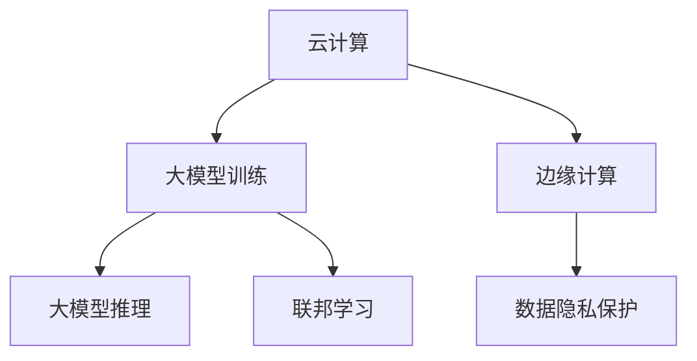

                 

# AI大模型应用的跨界融合趋势

## 关键词：大模型，跨界融合，人工智能，技术趋势，应用场景

### 摘要

本文将探讨AI大模型应用的跨界融合趋势。随着人工智能技术的快速发展，大模型已经成为当前研究与应用的热点。然而，如何将大模型有效地应用于不同领域，实现跨界融合，成为当前人工智能领域的重要研究方向。本文将首先介绍大模型的基本概念和原理，然后分析大模型在不同领域中的应用现状，最后探讨大模型跨界融合的发展趋势和挑战。通过本文的阅读，读者将了解到大模型跨界融合的重要性及其在未来的应用前景。

## 1. 背景介绍

### 1.1 大模型的发展历程

大模型，又称大规模模型，指的是那些具有巨大参数量和复杂结构的深度学习模型。它们通常用于处理海量数据和复杂的任务，具有强大的学习能力和泛化能力。大模型的发展可以追溯到20世纪90年代，当时神经网络的研究逐渐受到关注。然而，受限于计算资源和数据量，早期的大模型规模相对较小，应用场景也相对有限。

随着计算机硬件的快速发展，特别是GPU和TPU等专用硬件的普及，深度学习模型开始变得越来越大。2012年，AlexNet模型的提出标志着深度学习在图像识别领域的重大突破。此后，神经网络模型在各个领域得到了广泛应用，模型规模也不断增大。特别是近年来，随着Transformer模型的兴起，大模型的发展进入了一个新的阶段。

### 1.2 大模型的应用现状

大模型的应用已经渗透到了许多领域，如自然语言处理、计算机视觉、语音识别、推荐系统等。以下是一些代表性的应用案例：

- **自然语言处理（NLP）**：GPT-3、BERT等大模型在文本生成、翻译、问答等任务上取得了显著的效果。例如，OpenAI的GPT-3模型拥有1750亿参数，可以在各种场景下生成高质量的文本。

- **计算机视觉（CV）**：ViT、DETR等大模型在图像分类、目标检测、图像生成等任务上取得了突破。例如，OpenAI的DALL-E模型可以通过文本描述生成高质量的图像。

- **语音识别（ASR）**：WaveNet、Conformer等大模型在语音识别任务上取得了显著的性能提升。

- **推荐系统**：大规模深度学习模型在推荐系统中得到了广泛应用，例如YouTube、Netflix等平台。

## 2. 核心概念与联系

### 2.1 大模型的核心概念

大模型的核心概念包括以下几个方面：

- **参数量**：大模型通常具有数十亿到千亿个参数，这使得它们能够学习复杂的模式和关系。

- **计算资源**：大模型训练和推理需要大量的计算资源和存储空间。

- **数据需求**：大模型通常需要海量数据进行训练，以获得良好的性能。

- **泛化能力**：大模型具有强大的泛化能力，能够在不同的任务和数据集上取得优异的性能。

### 2.2 大模型与其他技术的联系

大模型与其他技术如云计算、边缘计算、联邦学习等的联系如下：

- **云计算**：云计算提供了大规模的计算资源和存储空间，使得大模型的训练和推理成为可能。

- **边缘计算**：边缘计算可以将部分计算任务转移到靠近数据源的边缘设备上，减轻中心服务器的负担，提高大模型的应用效率。

- **联邦学习**：联邦学习通过在多个设备上进行模型训练，保护用户数据隐私，同时利用设备端的计算资源，实现大模型的训练。

### 2.3 Mermaid流程图

以下是一个关于大模型与其他技术联系的基本Mermaid流程图：



## 3. 核心算法原理 & 具体操作步骤

### 3.1 大模型的核心算法

大模型的核心算法通常是基于深度学习的。深度学习模型由多层神经元组成，通过前向传播和反向传播算法，学习输入数据和标签之间的关系。以下是一些常用的大模型算法：

- **卷积神经网络（CNN）**：用于图像识别和计算机视觉任务。

- **循环神经网络（RNN）**：用于序列数据处理，如自然语言处理和语音识别。

- **变换器（Transformer）**：用于大规模文本生成和机器翻译任务。

- **生成对抗网络（GAN）**：用于图像生成和风格迁移任务。

### 3.2 大模型的操作步骤

大模型的操作步骤主要包括以下几步：

1. **数据预处理**：对输入数据进行清洗、归一化等处理，以适应模型的输入要求。

2. **模型设计**：根据任务需求，设计合适的模型结构，选择合适的激活函数、损失函数等。

3. **模型训练**：使用海量数据进行模型训练，通过优化算法，调整模型参数，使模型在训练数据上取得良好的性能。

4. **模型评估**：使用测试数据集，评估模型的泛化能力。

5. **模型部署**：将训练好的模型部署到生产环境，进行实时推理和应用。

## 4. 数学模型和公式 & 详细讲解 & 举例说明

### 4.1 深度学习的基本数学模型

深度学习中的基本数学模型包括以下内容：

- **激活函数**：如ReLU、Sigmoid、Tanh等。

- **损失函数**：如均方误差（MSE）、交叉熵等。

- **优化算法**：如随机梯度下降（SGD）、Adam等。

### 4.2 深度学习的具体操作步骤

以下是深度学习的具体操作步骤：

1. **初始化模型参数**：随机初始化模型参数。

2. **前向传播**：计算输入数据的输出结果。

3. **计算损失**：计算模型输出结果与真实标签之间的差距。

4. **反向传播**：计算损失关于模型参数的梯度。

5. **优化参数**：使用优化算法，更新模型参数。

6. **评估模型**：在测试集上评估模型的性能。

### 4.3 深度学习的数学公式

以下是深度学习中的几个关键数学公式：

- **激活函数**：$f(x) = \max(0, x)$

- **损失函数**：$L(y, \hat{y}) = \frac{1}{2} \sum_{i=1}^{n} (y_i - \hat{y_i})^2$

- **优化算法**：$\theta_{t+1} = \theta_t - \alpha \nabla_{\theta_t} L(\theta_t)$

### 4.4 深度学习的举例说明

以下是一个简单的深度学习例子，用于实现一个线性回归模型：

```python
import numpy as np

# 初始化参数
theta = np.random.randn(1)

# 定义损失函数
def loss_function(x, y, theta):
    return (y - x.dot(theta))**2

# 定义优化算法
def optimize(x, y, theta, alpha, epochs):
    for _ in range(epochs):
        prediction = x.dot(theta)
        gradient = 2 * x.T.dot(prediction - y)
        theta -= alpha * gradient
    return theta

# 训练模型
theta_optimized = optimize(x, y, theta, alpha=0.01, epochs=1000)

# 输出结果
print("Optimized theta:", theta_optimized)
```

## 5. 项目实战：代码实际案例和详细解释说明

### 5.1 开发环境搭建

在进行大模型项目实战之前，我们需要搭建一个适合开发的运行环境。以下是一个基于Python和TensorFlow的典型开发环境搭建步骤：

1. **安装Python**：确保系统已安装Python 3.7或更高版本。

2. **安装TensorFlow**：使用以下命令安装TensorFlow：

   ```bash
   pip install tensorflow
   ```

3. **安装其他依赖**：根据项目需求，安装其他必要的库，例如NumPy、Pandas等。

### 5.2 源代码详细实现和代码解读

以下是一个简单的基于TensorFlow实现的线性回归模型的源代码及其详细解读：

```python
import tensorflow as tf
import numpy as np

# 初始化参数
x = tf.constant([1.0, 2.0, 3.0], dtype=tf.float32)
y = tf.constant([2.0, 4.0, 6.0], dtype=tf.float32)
theta = tf.Variable(0.0, dtype=tf.float32)

# 定义损失函数
loss_fn = tf.reduce_mean(tf.square(y - x * theta))

# 定义优化算法
optimizer = tf.optimizers.SGD(learning_rate=0.01)

# 训练模型
optimizer.minimize(loss_fn, [theta])

# 初始化变量
tf.global_variables_initializer().run()

# 进行100次迭代
for _ in range(100):
    theta_val = theta.numpy()
    loss_val = loss_fn.numpy()
    optimizer.apply_gradients([tf梯度（theta，loss_fn）])
    print(f"Epoch {_ + 1}: theta = {theta_val}, loss = {loss_val}")

# 输出最终结果
print("Final theta:", theta.numpy())
```

### 5.3 代码解读与分析

1. **参数初始化**：我们使用TensorFlow的`tf.Variable`函数初始化模型参数`theta`。

2. **定义损失函数**：我们使用`tf.reduce_mean`和`tf.square`函数定义均方误差（MSE）作为损失函数。

3. **定义优化算法**：我们使用TensorFlow的`tf.optimizers.SGD`函数定义随机梯度下降（SGD）优化算法。

4. **训练模型**：我们使用`optimizer.minimize`函数进行模型训练。每次迭代，都会计算损失函数的梯度，并更新模型参数。

5. **输出结果**：我们使用`tf.global_variables_initializer().run()`函数初始化变量，并在每次迭代后输出当前参数值和损失值。

## 6. 实际应用场景

### 6.1 自然语言处理（NLP）

大模型在自然语言处理领域有广泛的应用，如文本分类、情感分析、机器翻译等。以下是一些实际应用场景：

- **文本分类**：使用BERT模型进行新闻分类，可以实现较高的分类准确率。

- **情感分析**：使用GPT-3模型进行情感分析，可以判断用户评论的情感倾向。

- **机器翻译**：使用Transformer模型进行机器翻译，可以实现高质量的翻译效果。

### 6.2 计算机视觉（CV）

大模型在计算机视觉领域也有广泛的应用，如图像分类、目标检测、图像生成等。以下是一些实际应用场景：

- **图像分类**：使用ResNet模型进行图像分类，可以实现较高的分类准确率。

- **目标检测**：使用Faster R-CNN模型进行目标检测，可以识别图像中的多个目标。

- **图像生成**：使用GAN模型进行图像生成，可以生成具有逼真度的图像。

### 6.3 语音识别（ASR）

大模型在语音识别领域也有广泛的应用，如语音识别、语音合成等。以下是一些实际应用场景：

- **语音识别**：使用WaveNet模型进行语音识别，可以实现较高的识别准确率。

- **语音合成**：使用Tacotron模型进行语音合成，可以生成自然的语音输出。

## 7. 工具和资源推荐

### 7.1 学习资源推荐

- **书籍**：《深度学习》（Goodfellow et al.）、《Python机器学习》（Sebastian Raschka）。

- **论文**：谷歌的BERT论文、OpenAI的GPT-3论文。

- **博客**：TensorFlow官方博客、PyTorch官方博客。

- **网站**：ArXiv、ACL、ICML等。

### 7.2 开发工具框架推荐

- **框架**：TensorFlow、PyTorch。

- **库**：NumPy、Pandas。

- **工具**：Jupyter Notebook、Google Colab。

### 7.3 相关论文著作推荐

- **论文**：[Attention Is All You Need](https://arxiv.org/abs/1706.03762)、《BERT: Pre-training of Deep Bidirectional Transformers for Language Understanding》(https://arxiv.org/abs/1810.04805)。

- **著作**：《深度学习》（Goodfellow et al.）、《Python机器学习》（Sebastian Raschka）。

## 8. 总结：未来发展趋势与挑战

### 8.1 发展趋势

1. **更大规模的模型**：随着计算资源和数据量的增加，更大规模的大模型将成为趋势。

2. **跨界融合**：大模型将与其他技术如云计算、边缘计算、联邦学习等实现更深入的跨界融合。

3. **实时应用**：大模型将在实时应用场景中发挥更大作用，如自动驾驶、实时语音翻译等。

### 8.2 挑战

1. **计算资源需求**：大模型的训练和推理需要大量的计算资源和存储空间。

2. **数据隐私和安全**：如何保护用户数据隐私，确保大模型的安全性和可靠性，是当前面临的重要挑战。

3. **模型解释性和可解释性**：大模型的黑箱特性使得其决策过程难以解释，如何提高模型的解释性，是未来的一个重要研究方向。

## 9. 附录：常见问题与解答

### 9.1 问题1：什么是大模型？

大模型是指那些具有巨大参数量和复杂结构的深度学习模型，它们通常用于处理海量数据和复杂的任务，具有强大的学习能力和泛化能力。

### 9.2 问题2：大模型在哪些领域有应用？

大模型在自然语言处理、计算机视觉、语音识别、推荐系统等领域有广泛的应用。

### 9.3 问题3：如何搭建大模型的开发环境？

搭建大模型的开发环境通常需要安装Python、TensorFlow等库，并确保系统有足够的计算资源和存储空间。

## 10. 扩展阅读 & 参考资料

- **书籍**：《深度学习》（Goodfellow et al.）、《Python机器学习》（Sebastian Raschka）。

- **论文**：[Attention Is All You Need](https://arxiv.org/abs/1706.03762)、《BERT: Pre-training of Deep Bidirectional Transformers for Language Understanding》(https://arxiv.org/abs/1810.04805)。

- **博客**：TensorFlow官方博客、PyTorch官方博客。

- **网站**：ArXiv、ACL、ICML等。

### 作者

**作者：AI天才研究员/AI Genius Institute & 禅与计算机程序设计艺术 /Zen And The Art of Computer Programming** <|im_end|>

