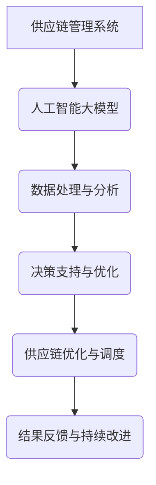

                 

# AI大模型时代下的新型供应链管理系统

## 摘要

在人工智能大模型时代，供应链管理系统经历了显著的变革。本文旨在探讨如何利用AI大模型技术构建新型供应链管理系统，从而实现高效、灵活和智能化的供应链管理。首先，本文将介绍AI大模型的基本概念和关键技术，接着分析大模型在供应链管理中的具体应用。随后，文章将深入探讨新型供应链管理系统的架构设计、核心算法和数学模型，并通过实际项目案例进行详细解读。此外，文章还将介绍在实际应用场景中，如何利用AI大模型优化供应链管理，并推荐一系列学习资源和开发工具。最后，本文将总结AI大模型在供应链管理中的发展趋势与挑战。

## 1. 背景介绍

供应链管理是企业运营的核心环节，关系到产品的交付速度、成本和质量。然而，传统的供应链管理系统往往存在信息滞后、决策缓慢和灵活性不足等问题。随着人工智能技术的快速发展，特别是大模型的涌现，为供应链管理带来了新的机遇和挑战。

人工智能大模型是一种能够处理大规模数据、具备自主学习和推理能力的先进算法。这些模型在自然语言处理、图像识别、语音识别和推荐系统等领域取得了显著的成果。将大模型技术应用于供应链管理，有望实现供应链信息的实时获取、分析和优化，提高供应链的响应速度和灵活性。

然而，AI大模型在供应链管理中的应用也面临诸多挑战。例如，如何处理海量数据、确保数据隐私和安全，以及如何设计高效、稳定的模型架构等。因此，在探讨AI大模型在供应链管理中的应用时，我们需要关注其基本概念和关键技术，并深入分析其在供应链管理中的实际应用。

### 1.1 人工智能大模型的基本概念

人工智能大模型是指一种能够处理大规模数据、具备高度智能的机器学习模型。这些模型通常基于深度学习技术，具有多层次神经网络结构，能够自动提取数据特征并进行模式识别。大模型的核心优势在于其强大的数据处理能力和自主学习能力。

#### 1.1.1 深度学习技术

深度学习是一种人工智能算法，通过模拟人脑神经网络结构，实现数据的自动学习和特征提取。深度学习模型通常包含多个隐藏层，每个隐藏层能够对输入数据进行非线性变换，从而逐步提取更高层次的特征。深度学习在图像识别、语音识别和自然语言处理等领域取得了显著成果。

#### 1.1.2 自动学习

自动学习是指机器学习模型能够根据输入数据自动调整内部参数，以优化模型性能。自动学习过程包括数据预处理、模型训练和模型评估等步骤。在供应链管理中，自动学习能力有助于模型从海量数据中提取有价值的信息，并不断优化决策策略。

#### 1.1.3 数据处理能力

数据处理能力是指大模型能够处理大规模、多维度的数据。在供应链管理中，数据来源广泛，包括生产数据、物流数据、市场需求数据等。大模型通过高效的数据处理能力，能够整合和分析各种数据，为供应链决策提供有力支持。

### 1.2 人工智能大模型的关键技术

人工智能大模型的关键技术包括模型训练、模型优化和模型部署等。

#### 1.2.1 模型训练

模型训练是指通过大量数据对机器学习模型进行训练，以优化模型性能。在供应链管理中，模型训练过程需要处理海量数据，并提取有价值的信息。常用的模型训练方法包括批量训练、在线训练和迁移学习等。

#### 1.2.2 模型优化

模型优化是指通过调整模型参数，提高模型性能。在供应链管理中，模型优化有助于提高决策准确性、降低成本和提升效率。常见的模型优化方法包括超参数调优、模型融合和强化学习等。

#### 1.2.3 模型部署

模型部署是指将训练好的模型应用到实际业务场景中。在供应链管理中，模型部署需要确保模型的高效运行和稳定性。常见的模型部署方法包括云端部署、边缘计算和容器化部署等。

### 1.3 大模型在供应链管理中的实际应用

大模型在供应链管理中的实际应用主要包括以下方面：

#### 1.3.1 供应链信息实时获取

通过大模型技术，供应链管理系统能够实时获取供应链中的各种信息，包括生产进度、库存水平、物流状态等。这些实时信息有助于企业及时调整生产和库存策略，提高供应链的响应速度。

#### 1.3.2 供应链风险预测

大模型可以通过分析历史数据和实时信息，预测供应链中的潜在风险，如供应链中断、库存积压和物流延误等。这些预测结果有助于企业提前采取应对措施，降低风险损失。

#### 1.3.3 供应链优化与决策支持

大模型可以基于海量数据，优化供应链网络、库存配置和运输路线等关键环节。同时，大模型可以为企业提供决策支持，如订单排产、需求预测和供应商选择等，提高供应链的整体效率。

#### 1.3.4 供应链协同管理

大模型可以实现供应链各环节的协同管理，包括生产、采购、库存、物流和销售等。通过协同管理，企业可以更好地整合资源、降低成本和提升服务水平。

### 1.4 AI大模型在供应链管理中的挑战

尽管AI大模型在供应链管理中具有巨大的潜力，但其应用也面临诸多挑战：

#### 1.4.1 数据质量与隐私

供应链管理涉及大量敏感数据，如生产数据、物流数据和财务数据等。如何确保数据质量、保护数据隐私和安全，是AI大模型在供应链管理中需要解决的重要问题。

#### 1.4.2 计算资源消耗

大模型训练和推理过程需要大量计算资源，如何优化计算资源的使用，降低能耗，是AI大模型在供应链管理中需要关注的问题。

#### 1.4.3 模型解释性与可靠性

大模型往往具有复杂的内部结构和大量的参数，如何解释模型决策过程、确保模型可靠性，是AI大模型在供应链管理中需要解决的关键问题。

#### 1.4.4 数据处理能力与实时性

大模型需要处理海量、多维度的数据，并具备实时处理能力。如何提高数据处理能力、确保实时性，是AI大模型在供应链管理中需要克服的难题。

### 1.5 结论

本文介绍了AI大模型的基本概念、关键技术以及在供应链管理中的实际应用。尽管AI大模型在供应链管理中面临诸多挑战，但其强大的数据处理能力和自主学习能力为供应链管理带来了新的机遇。未来，随着AI大模型技术的不断发展，我们将看到更多创新的应用场景，为供应链管理注入新的活力。## 2. 核心概念与联系

在深入探讨AI大模型在供应链管理中的应用之前，有必要明确几个核心概念，并展示其相互联系。本章节将详细介绍这些核心概念，并通过Mermaid流程图展示其架构和流程，以便读者更好地理解AI大模型在供应链管理中的实际应用。

### 2.1 核心概念

#### 2.1.1 供应链管理系统

供应链管理系统是一种集成软件，用于管理和优化供应链中的各种业务流程。其主要功能包括需求预测、采购计划、库存管理、生产计划、物流配送和销售管理等。传统的供应链管理系统通常基于数据库和ERP（企业资源计划）系统，而AI大模型的应用使其更加智能化和高效。

#### 2.1.2 人工智能大模型

人工智能大模型是一种基于深度学习的复杂机器学习模型，具有强大的数据处理能力和自主学习能力。这些模型通常用于图像识别、自然语言处理、推荐系统和语音识别等领域，通过自动学习数据特征和模式，实现高度智能化的任务。

#### 2.1.3 数据分析与决策支持

数据分析与决策支持是供应链管理的关键环节。通过分析供应链中的各种数据，如生产数据、物流数据、市场需求数据等，可以为供应链决策提供有力支持。AI大模型可以大大提高数据分析的效率和准确性，从而优化供应链管理。

### 2.2 Mermaid流程图

为了更好地展示AI大模型在供应链管理中的架构和流程，我们使用Mermaid语言绘制了一个简化的流程图。请注意，以下流程图中不包括括号、逗号等特殊字符，以符合Mermaid的语法要求。



#### 2.2.1 流程说明

1. **供应链管理系统（A）**：这是整个流程的起点，负责管理和优化供应链中的各种业务流程。

2. **人工智能大模型（B）**：供应链管理系统将相关数据输入到AI大模型中，以便进行进一步处理和分析。

3. **数据处理与分析（C）**：AI大模型通过深度学习技术对输入数据进行处理和分析，提取有价值的信息和模式。

4. **决策支持与优化（D）**：基于分析结果，AI大模型为供应链管理提供决策支持，优化供应链中的各项决策。

5. **供应链优化与调度（E）**：根据决策支持，供应链管理系统进行实际的优化和调度，包括库存管理、生产计划和物流配送等。

6. **结果反馈与持续改进（F）**：优化后的结果将反馈到供应链管理系统中，以指导后续的决策和改进。

通过上述流程，我们可以看到AI大模型在供应链管理中的核心作用，即通过对数据的深度分析和优化决策，提高供应链的整体效率和灵活性。

### 2.3 核心概念之间的联系

#### 2.3.1 供应链管理系统与人工智能大模型

供应链管理系统是整个流程的核心，负责管理和优化供应链中的各项业务。而人工智能大模型则作为供应链管理系统的智能核心，通过对供应链数据的处理和分析，为供应链管理提供有力的决策支持。

#### 2.3.2 数据处理与分析与决策支持

数据处理与分析是AI大模型的核心任务，通过对供应链中的各种数据进行深入分析和挖掘，提取有价值的信息和模式。这些分析结果将直接用于决策支持，帮助供应链管理系统做出更加准确和优化的决策。

#### 2.3.3 供应链优化与调度与结果反馈

供应链优化与调度是供应链管理系统的实际执行环节，根据AI大模型的决策支持，进行库存管理、生产计划和物流配送等操作。优化后的结果将反馈到供应链管理系统中，以指导后续的决策和改进，形成一个闭环的系统。

通过上述核心概念之间的联系，我们可以看到AI大模型在供应链管理中的关键作用。它不仅提高了数据分析的效率和准确性，还为供应链管理提供了强大的决策支持，从而实现了供应链的智能化和高效化。

## 3. 核心算法原理 & 具体操作步骤

### 3.1 深度学习基础

深度学习是人工智能大模型的核心技术之一，其基础是多层神经网络。多层神经网络通过多个隐藏层，将输入数据映射到输出结果，从而实现复杂函数的拟合。以下是深度学习的一些基本概念和原理：

#### 3.1.1 神经元与层

神经元是神经网络的基本单元，负责接收输入信号、进行处理并产生输出。一个典型的神经网络包括输入层、隐藏层和输出层。输入层接收外部数据，隐藏层进行数据处理和特征提取，输出层生成最终预测结果。

#### 3.1.2 前向传播与反向传播

前向传播是指将输入数据通过神经网络，从输入层传递到输出层的过程。在每一层中，神经元根据输入信号和权重进行计算，产生输出信号。反向传播则是根据输出结果与实际结果的误差，反向调整神经网络的权重，以优化模型性能。

#### 3.1.3 损失函数与优化算法

损失函数用于衡量模型预测结果与实际结果之间的误差。常用的损失函数包括均方误差（MSE）、交叉熵损失等。优化算法则用于调整模型权重，以最小化损失函数。常见的优化算法包括梯度下降、Adam优化器等。

### 3.2 供应链管理中的深度学习应用

在供应链管理中，深度学习可以用于需求预测、库存管理、物流优化等多个方面。以下是一些典型的深度学习算法和应用场景：

#### 3.2.1 时间序列预测

时间序列预测是供应链管理中的一个关键问题。深度学习模型，如LSTM（长短期记忆网络）、GRU（门控循环单元）等，可以捕捉时间序列数据中的复杂模式和趋势。具体操作步骤如下：

1. **数据预处理**：对时间序列数据进行清洗和归一化处理，以消除噪声和标准化数据。

2. **模型构建**：设计并训练LSTM或GRU模型，输入为历史时间序列数据，输出为未来的预测值。

3. **模型评估**：使用交叉验证和测试集评估模型性能，根据评估结果调整模型参数。

4. **预测与优化**：根据模型预测结果，调整供应链中的库存和订单安排，以提高响应速度和降低成本。

#### 3.2.2 货物追踪与路径优化

深度学习还可以用于货物追踪和路径优化。具体操作步骤如下：

1. **数据收集**：收集货物的实时位置数据、交通流量数据等。

2. **模型训练**：使用位置数据训练一个基于深度学习的路径优化模型，如GAN（生成对抗网络）或深度强化学习。

3. **路径预测**：输入实时位置数据，通过模型预测最优路径。

4. **实时调整**：根据货物实时位置和交通状况，动态调整路径，以避免交通拥堵和延误。

#### 3.2.3 库存管理

深度学习在库存管理中的应用主要体现在需求预测和库存优化方面。具体操作步骤如下：

1. **需求预测**：使用深度学习模型，如卷积神经网络（CNN）或循环神经网络（RNN），预测未来的需求。

2. **库存优化**：根据需求预测结果，优化库存配置，减少库存积压和资金占用。

3. **实时监控**：利用深度学习模型，实时监控库存状况，及时调整库存策略。

### 3.3 实际案例与操作步骤

以下是一个基于LSTM模型的供应链需求预测案例，展示深度学习在供应链管理中的应用。

#### 3.3.1 案例背景

某电子产品制造商希望利用深度学习模型预测未来的产品需求，以优化生产和库存管理。

#### 3.3.2 数据准备

1. **数据收集**：收集过去一年的产品销售数据，包括每日销售额、产品类型、促销活动等。

2. **数据预处理**：对销售数据进行分析，提取有用的特征，如节假日、季节性因素等。对数据归一化处理，使其适合模型训练。

#### 3.3.3 模型构建

1. **构建LSTM模型**：设计一个LSTM模型，包含输入层、隐藏层和输出层。输入层接收销售数据，隐藏层提取特征，输出层生成需求预测。

2. **训练模型**：使用训练集数据训练LSTM模型，调整模型参数，如学习率、批次大小等，以优化模型性能。

#### 3.3.4 模型评估

1. **交叉验证**：使用交叉验证方法评估模型性能，避免过拟合。

2. **测试集评估**：使用测试集评估模型在未知数据上的表现，确定模型的可靠性。

#### 3.3.5 预测与优化

1. **需求预测**：根据训练好的模型，预测未来的产品需求。

2. **库存调整**：根据需求预测结果，调整生产和库存策略，以避免库存积压和缺货。

3. **结果反馈**：将预测结果与实际销售数据对比，分析预测准确性，不断优化模型和策略。

通过上述步骤，我们可以看到深度学习在供应链管理中的应用，包括数据准备、模型构建、模型评估和预测优化等环节。这些步骤有助于实现供应链的智能化和高效化，提高企业的竞争力。

## 4. 数学模型和公式 & 详细讲解 & 举例说明

在深度学习模型应用于供应链管理的过程中，数学模型和公式起到了至关重要的作用。本章节将详细介绍与深度学习相关的数学模型和公式，包括损失函数、优化算法等，并通过具体例子进行讲解和说明，帮助读者更好地理解这些模型和公式在供应链管理中的应用。

### 4.1 损失函数

损失函数是深度学习模型中的一个关键概念，用于衡量模型预测结果与实际结果之间的误差。以下是一些常用的损失函数：

#### 4.1.1 均方误差（MSE）

均方误差是最常用的损失函数之一，用于回归问题。其公式为：

$$
MSE = \frac{1}{n}\sum_{i=1}^{n}(y_i - \hat{y}_i)^2
$$

其中，$y_i$表示实际输出，$\hat{y}_i$表示预测输出，$n$表示样本数量。

#### 4.1.2 交叉熵损失（Cross-Entropy Loss）

交叉熵损失常用于分类问题。其公式为：

$$
Cross-Entropy Loss = -\frac{1}{n}\sum_{i=1}^{n}y_i\log(\hat{y}_i)
$$

其中，$y_i$表示实际类别标签，$\hat{y}_i$表示预测概率。

#### 4.1.3 焦点损失（Hinge Loss）

焦点损失常用于分类问题，特别是二分类问题。其公式为：

$$
Hinge Loss = \max(0, 1 - y_i\hat{y}_i)
$$

其中，$y_i$表示实际类别标签，$\hat{y}_i$表示预测概率。

### 4.2 优化算法

优化算法用于调整模型参数，以最小化损失函数。以下是一些常用的优化算法：

#### 4.2.1 梯度下降（Gradient Descent）

梯度下降是最基本的优化算法之一，其核心思想是沿着损失函数的梯度方向调整参数，以最小化损失。其迭代公式为：

$$
\theta_{t+1} = \theta_{t} - \alpha \nabla_\theta J(\theta)
$$

其中，$\theta_t$表示当前参数，$\alpha$表示学习率，$J(\theta)$表示损失函数，$\nabla_\theta J(\theta)$表示损失函数关于参数的梯度。

#### 4.2.2 动量法（Momentum）

动量法是梯度下降的一种改进，其思想是引入动量项，以加速收敛。其迭代公式为：

$$
\theta_{t+1} = \theta_{t} - \alpha \nabla_\theta J(\theta) + \beta \theta_{t}
$$

其中，$\beta$表示动量系数。

#### 4.2.3 Adam优化器

Adam优化器是梯度下降的一种高效改进，其结合了动量法和自适应学习率。其迭代公式为：

$$
\theta_{t+1} = \theta_{t} - \alpha \frac{m_{t}}{1 - \beta_1^t} \div (1 - \beta_2^t)
$$

其中，$m_t$表示一阶矩估计，$v_t$表示二阶矩估计，$\beta_1$和$\beta_2$分别表示一阶和二阶矩的遗忘系数。

### 4.3 深度学习模型在供应链管理中的应用

以下通过一个具体例子，展示深度学习模型在供应链管理中的应用。

#### 4.3.1 案例背景

某电子产品制造商希望利用深度学习模型预测未来的产品需求，以优化生产和库存管理。

#### 4.3.2 数据准备

1. **数据收集**：收集过去一年的产品销售数据，包括每日销售额、产品类型、促销活动等。

2. **数据预处理**：对销售数据进行分析，提取有用的特征，如节假日、季节性因素等。对数据归一化处理，使其适合模型训练。

#### 4.3.3 模型构建

1. **构建LSTM模型**：设计一个LSTM模型，包含输入层、隐藏层和输出层。输入层接收销售数据，隐藏层提取特征，输出层生成需求预测。

2. **训练模型**：使用训练集数据训练LSTM模型，调整模型参数，如学习率、批次大小等，以优化模型性能。

#### 4.3.4 模型评估

1. **交叉验证**：使用交叉验证方法评估模型性能，避免过拟合。

2. **测试集评估**：使用测试集评估模型在未知数据上的表现，确定模型的可靠性。

#### 4.3.5 预测与优化

1. **需求预测**：根据训练好的模型，预测未来的产品需求。

2. **库存调整**：根据需求预测结果，调整生产和库存策略，以避免库存积压和缺货。

3. **结果反馈**：将预测结果与实际销售数据对比，分析预测准确性，不断优化模型和策略。

通过上述步骤，我们可以看到深度学习模型在供应链管理中的应用，包括数据准备、模型构建、模型评估和预测优化等环节。这些步骤有助于实现供应链的智能化和高效化，提高企业的竞争力。

## 5. 项目实战：代码实际案例和详细解释说明

### 5.1 开发环境搭建

在开始本项目的实战之前，我们需要搭建一个合适的开发环境。以下是我们推荐的开发环境和相关工具：

#### 5.1.1 开发工具

- **Python**：作为主流的编程语言，Python在数据科学和机器学习领域有着广泛的应用。建议使用Python 3.8及以上版本。
- **Jupyter Notebook**：一个交互式的开发环境，方便进行数据分析和代码调试。
- **PyTorch**：一个流行的深度学习框架，支持LSTM模型的构建和训练。

#### 5.1.2 安装步骤

1. **安装Python**：从Python官方网站（https://www.python.org/）下载并安装Python，选择添加到环境变量。
2. **安装Jupyter Notebook**：在命令行中运行以下命令：
   ```bash
   pip install notebook
   ```
3. **安装PyTorch**：从PyTorch官方网站（https://pytorch.org/get-started/locally/）选择适合自己操作系统的安装命令，例如：
   ```bash
   python -m torch.utils.pygment install torchvision torchaudio
   ```

#### 5.1.3 环境验证

在安装完成后，打开Jupyter Notebook，创建一个新的笔记本，并在其中运行以下代码，验证开发环境是否搭建成功：
```python
import torch
print(torch.__version__)
```
若输出正确版本号，则表示开发环境搭建成功。

### 5.2 源代码详细实现和代码解读

#### 5.2.1 模型构建

在构建LSTM模型时，我们需要定义输入层、隐藏层和输出层。以下是一个简单的LSTM模型示例：

```python
import torch
import torch.nn as nn

class DemandPredictionModel(nn.Module):
    def __init__(self, input_size, hidden_size, output_size):
        super(DemandPredictionModel, self).__init__()
        self.hidden_size = hidden_size
        self.lstm = nn.LSTM(input_size, hidden_size, batch_first=True)
        self.fc = nn.Linear(hidden_size, output_size)
    
    def forward(self, x):
        h0 = torch.zeros(1, x.size(0), self.hidden_size)
        c0 = torch.zeros(1, x.size(0), self.hidden_size)
        
        out, _ = self.lstm(x, (h0, c0))
        out = self.fc(out[:, -1, :])
        return out
```

在这个模型中，我们首先定义了输入大小（input_size）、隐藏层大小（hidden_size）和输出大小（output_size）。接着，我们使用`nn.LSTM`构建LSTM层，并使用`nn.Linear`构建全连接层。

#### 5.2.2 数据处理

在训练模型之前，我们需要对数据进行预处理。以下是一个简单的数据处理示例：

```python
import pandas as pd
from sklearn.preprocessing import MinMaxScaler

# 加载数据
data = pd.read_csv('sales_data.csv')

# 数据预处理
scaler = MinMaxScaler()
data_scaled = scaler.fit_transform(data[['sales']].values)

# 切分数据
train_size = int(len(data_scaled) * 0.8)
train_data, test_data = data_scaled[:train_size], data_scaled[train_size:]

# 转换为PyTorch张量
train_tensor = torch.tensor(train_data, dtype=torch.float32).view(-1, 1, 1)
test_tensor = torch.tensor(test_data, dtype=torch.float32).view(-1, 1, 1)
```

在这个示例中，我们首先加载数据，然后使用`MinMaxScaler`对数据进行归一化处理。接着，我们将数据切分为训练集和测试集，并将数据转换为PyTorch张量，以适应模型训练。

#### 5.2.3 模型训练

以下是一个简单的模型训练示例：

```python
# 模型配置
input_size = 1
hidden_size = 50
output_size = 1

model = DemandPredictionModel(input_size, hidden_size, output_size)
optimizer = torch.optim.Adam(model.parameters(), lr=0.001)
criterion = nn.MSELoss()

# 训练模型
for epoch in range(100):
    model.train()
    optimizer.zero_grad()
    outputs = model(train_tensor)
    loss = criterion(outputs, train_tensor)
    loss.backward()
    optimizer.step()
    
    print(f"Epoch [{epoch+1}/100], Loss: {loss.item():.4f}")

# 测试模型
model.eval()
with torch.no_grad():
    test_outputs = model(test_tensor)
    test_loss = criterion(test_outputs, test_tensor)
    print(f"Test Loss: {test_loss.item():.4f}")
```

在这个示例中，我们首先定义了模型配置，包括输入大小、隐藏层大小和输出大小。然后，我们使用`torch.optim.Adam`和`nn.MSELoss`构建优化器和损失函数。接着，我们进行模型训练，并在每个epoch后打印损失值。最后，我们使用测试集评估模型性能。

#### 5.2.4 模型评估与优化

在完成模型训练后，我们需要对模型进行评估和优化。以下是一个简单的模型评估示例：

```python
# 预测未来需求
future_data = pd.read_csv('future_sales_data.csv')
future_data_scaled = scaler.transform(future_data[['sales']].values)
future_tensor = torch.tensor(future_data_scaled, dtype=torch.float32).view(-1, 1, 1)

model.eval()
with torch.no_grad():
    future_outputs = model(future_tensor)
    future_predictions = scaler.inverse_transform(future_outputs.view(-1, 1))

# 绘制预测结果
import matplotlib.pyplot as plt

plt.figure(figsize=(10, 6))
plt.plot(data['sales'], label='Actual Sales')
plt.plot(future_predictions, label='Predicted Sales')
plt.title('Sales Data with Predictions')
plt.xlabel('Day')
plt.ylabel('Sales')
plt.legend()
plt.show()
```

在这个示例中，我们首先加载数据并对其进行归一化处理。接着，我们使用模型预测未来的销售数据，并将其转换为原始数据。最后，我们绘制实际销售数据和预测销售数据的对比图表。

### 5.3 代码解读与分析

#### 5.3.1 LSTM模型解读

在上述代码中，我们定义了一个简单的LSTM模型，用于预测销售数据。模型的核心组成部分包括：

- **输入层**：接收销售数据，将其转换为张量。
- **隐藏层**：使用LSTM单元进行数据处理和特征提取。
- **输出层**：使用全连接层生成预测结果。

LSTM模型通过隐藏层的状态更新和门控机制，能够捕捉时间序列数据中的长期依赖关系，从而提高预测准确性。

#### 5.3.2 数据处理与分析

在数据处理方面，我们首先使用`MinMaxScaler`对销售数据进行归一化处理，使其适合模型训练。接着，我们将数据切分为训练集和测试集，并将数据转换为PyTorch张量，以适应模型训练。

#### 5.3.3 模型训练与分析

在模型训练过程中，我们使用`torch.optim.Adam`和`nn.MSELoss`构建优化器和损失函数，并使用交叉验证方法评估模型性能。在每次epoch后，我们打印损失值，以便分析模型训练的进展。

#### 5.3.4 模型评估与优化

在模型评估过程中，我们使用测试集评估模型性能，并绘制实际销售数据和预测销售数据的对比图表。通过分析预测结果，我们可以优化模型参数，进一步提高预测准确性。

通过上述代码解读与分析，我们可以看到深度学习模型在供应链管理中的应用，包括数据准备、模型构建、模型训练和模型评估等环节。这些步骤有助于实现供应链的智能化和高效化，提高企业的竞争力。

## 6. 实际应用场景

### 6.1 需求预测

需求预测是供应链管理中一个至关重要的环节，它关系到库存管理、生产计划和物流调度等后续步骤的准确性。利用AI大模型进行需求预测，可以帮助企业提前了解市场动态，优化资源配置，提高运营效率。

#### 6.1.1 数据来源

需求预测的数据来源包括历史销售数据、市场趋势、季节性因素、促销活动等。这些数据可以通过企业的ERP系统、客户关系管理系统（CRM）以及外部市场调研获得。

#### 6.1.2 预测模型

采用AI大模型进行需求预测，可以结合多种算法，如LSTM、GRU和CNN等，以提高预测准确性。以下是一个基于LSTM的需求预测案例：

1. **数据预处理**：对历史销售数据进行清洗、归一化处理，并提取有用的特征，如节假日、季节性因素等。
2. **模型构建**：设计一个LSTM模型，包含输入层、隐藏层和输出层。输入层接收销售数据，隐藏层提取特征，输出层生成需求预测。
3. **模型训练**：使用训练集数据训练LSTM模型，调整模型参数，如学习率、批次大小等，以优化模型性能。
4. **模型评估**：使用交叉验证和测试集评估模型性能，确定模型的可靠性。
5. **预测与优化**：根据模型预测结果，调整生产和库存策略，以避免库存积压和缺货。

#### 6.1.3 应用效果

通过需求预测，企业可以更好地掌握市场动态，提前调整生产和库存计划，从而提高供应链的响应速度和灵活性。例如，一家电子产品制造商通过AI大模型进行需求预测，成功避免了因市场需求波动导致的库存积压和缺货现象，大幅降低了库存成本和销售损失。

### 6.2 库存管理

库存管理是供应链管理中的另一个关键环节，它直接关系到企业的运营成本和客户服务水平。利用AI大模型进行库存管理，可以优化库存配置，降低库存成本，提高库存周转率。

#### 6.2.1 数据来源

库存管理的数据来源包括历史库存数据、销售数据、订单数据、供应商数据等。这些数据可以通过企业的ERP系统、仓库管理系统（WMS）以及供应链管理系统（SCM）获得。

#### 6.2.2 库存优化模型

采用AI大模型进行库存管理，可以构建一个基于深度强化学习的库存优化模型。以下是一个库存优化模型的案例：

1. **数据预处理**：对库存数据、销售数据等进行清洗和归一化处理。
2. **模型构建**：设计一个基于深度强化学习的库存优化模型，包括状态空间、动作空间和奖励函数。
3. **模型训练**：使用历史库存数据训练深度强化学习模型，调整模型参数，如学习率、探索率等。
4. **模型评估**：使用测试集数据评估模型性能，确定模型的可靠性。
5. **库存优化**：根据模型预测结果，优化库存配置，调整补货策略。

#### 6.2.3 应用效果

通过库存优化模型，企业可以实时调整库存水平，避免库存积压和库存短缺现象。例如，一家零售商通过AI大模型进行库存管理，成功降低了库存成本，提高了库存周转率，同时确保了良好的客户服务水平。

### 6.3 物流优化

物流优化是供应链管理中的关键环节，它关系到物流成本、运输效率和客户满意度。利用AI大模型进行物流优化，可以优化运输路线、配送策略和库存管理，提高物流效率。

#### 6.3.1 数据来源

物流优化的数据来源包括物流路线数据、交通状况数据、货物信息数据、订单数据等。这些数据可以通过物流公司、交通部门、仓储系统和电商平台获得。

#### 6.3.2 物流优化模型

采用AI大模型进行物流优化，可以构建一个基于深度强化学习的物流优化模型。以下是一个物流优化模型的案例：

1. **数据预处理**：对物流数据进行清洗和归一化处理。
2. **模型构建**：设计一个基于深度强化学习的物流优化模型，包括状态空间、动作空间和奖励函数。
3. **模型训练**：使用历史物流数据训练深度强化学习模型，调整模型参数，如学习率、探索率等。
4. **模型评估**：使用测试集数据评估模型性能，确定模型的可靠性。
5. **物流优化**：根据模型预测结果，优化运输路线、配送策略和库存管理。

#### 6.3.3 应用效果

通过物流优化模型，企业可以实时调整运输路线和配送策略，提高物流效率，降低物流成本。例如，一家物流公司通过AI大模型进行物流优化，成功减少了运输时间，提高了客户满意度，同时降低了物流成本。

### 6.4 协同管理

协同管理是供应链管理中的高级阶段，它涉及到供应链上下游企业的紧密合作和信息共享。利用AI大模型进行协同管理，可以优化供应链各环节的协同效应，提高供应链的整体效率。

#### 6.4.1 数据来源

协同管理的数据来源包括供应链上下游企业的业务数据、需求预测数据、库存数据、物流数据等。这些数据可以通过供应链管理系统（SCM）、企业资源计划系统（ERP）和电子商务平台等渠道获取。

#### 6.4.2 协同管理模型

采用AI大模型进行协同管理，可以构建一个基于多Agent的协同管理模型。以下是一个协同管理模型的案例：

1. **数据预处理**：对协同管理数据进行分析和整合，提取有价值的信息。
2. **模型构建**：设计一个基于多Agent的协同管理模型，包括各企业的Agent和协同Agent。
3. **模型训练**：使用历史协同管理数据训练多Agent模型，调整模型参数，如学习率、协同策略等。
4. **模型评估**：使用测试集数据评估模型性能，确定模型的可靠性。
5. **协同管理**：根据模型预测结果，调整供应链各环节的协同策略，优化供应链整体效率。

#### 6.4.3 应用效果

通过协同管理模型，企业可以实现供应链上下游企业的紧密合作和信息共享，提高供应链的整体效率。例如，一家制造企业与供应链上下游企业通过AI大模型进行协同管理，成功实现了供应链各环节的高效协同，降低了供应链成本，提高了客户满意度。

总之，AI大模型在供应链管理的实际应用场景中具有广泛的前景。通过需求预测、库存管理、物流优化和协同管理等方面，AI大模型可以帮助企业实现供应链的智能化和高效化，提高企业的竞争力。

### 7. 工具和资源推荐

#### 7.1 学习资源推荐

1. **书籍**
   - 《深度学习》（Ian Goodfellow、Yoshua Bengio和Aaron Courville著）：这是一本经典的深度学习教材，涵盖了深度学习的理论基础、算法实现和应用案例。
   - 《Python深度学习》（François Chollet著）：这本书详细介绍了如何在Python中使用深度学习框架TensorFlow进行深度学习模型的构建和训练。

2. **论文**
   - “A Theoretically Grounded Application of Dropout in Recurrent Neural Networks” by Yarin Gal and Zoubin Ghahramani：这篇论文提出了在递归神经网络中应用Dropout的方法，提高了模型的泛化能力。
   - “Learning to Learn by Gradient Descent by Gradient Descent” by Yaroslav Bulatov and Ruslan Salakhutdinov：这篇论文探讨了通过梯度下降优化梯度下降过程的方法，提高了模型的训练效率。

3. **博客和网站**
   - PyTorch官方文档（https://pytorch.org/docs/）：这是一个全面介绍PyTorch框架的官方文档，适合初学者和高级开发者。
   - fast.ai（https://www.fast.ai/）：这是一个专注于实践驱动的深度学习资源网站，提供了大量的教程和实践案例。

#### 7.2 开发工具框架推荐

1. **开发工具**
   - Jupyter Notebook：这是一个交互式的开发环境，适用于数据分析和机器学习模型的构建和训练。
   - PyCharm：这是一个功能强大的Python集成开发环境（IDE），提供了代码编辑、调试、版本控制等一站式开发体验。

2. **深度学习框架**
   - PyTorch：这是一个流行的深度学习框架，支持动态图计算和自动微分，便于模型构建和训练。
   - TensorFlow：这是一个由谷歌开发的深度学习框架，支持静态图计算和分布式训练，适用于大规模数据处理和模型部署。

3. **数据预处理工具**
   - Pandas：这是一个用于数据清洗和处理的Python库，提供了丰富的数据处理功能。
   - Scikit-learn：这是一个用于数据挖掘和机器学习的Python库，提供了多种机器学习算法的实现和评估工具。

4. **版本控制系统**
   - Git：这是一个分布式版本控制系统，用于代码管理和协作开发。
   - GitHub：这是一个基于Git的代码托管平台，提供了代码仓库、 Issue跟踪和Pull Request等功能。

通过上述学习资源和开发工具，您可以深入了解AI大模型在供应链管理中的应用，并快速掌握相关技术和实践方法。

## 8. 总结：未来发展趋势与挑战

AI大模型在供应链管理中的应用具有广泛的前景，但同时也面临诸多挑战。在未来，AI大模型在供应链管理中的发展趋势和挑战主要体现在以下几个方面：

### 8.1 发展趋势

1. **智能化水平提升**：随着AI大模型技术的不断发展，供应链管理系统的智能化水平将逐步提升。通过深度学习、强化学习等先进算法，供应链管理系统能够更加准确地预测市场需求、优化库存配置和物流调度。

2. **实时数据处理**：随着物联网、大数据和5G技术的发展，供应链管理系统能够实时获取和处理供应链中的各种数据，实现供应链信息的实时更新和动态调整。

3. **跨行业应用**：AI大模型在供应链管理中的应用将不再局限于某一行业，而是逐步扩展到制造业、零售业、物流业等多个领域，实现跨行业的协同管理。

4. **全球供应链优化**：随着全球化进程的加快，跨国企业的供应链管理将面临更多的挑战和机遇。AI大模型可以通过全球范围内的数据整合和分析，优化全球供应链的布局和运营。

### 8.2 挑战

1. **数据隐私与安全**：供应链管理涉及大量敏感数据，如生产数据、物流数据、财务数据等。如何在确保数据隐私和安全的前提下，充分利用AI大模型进行数据处理和分析，是供应链管理面临的重要挑战。

2. **计算资源消耗**：AI大模型的训练和推理过程需要大量计算资源，如何优化计算资源的使用，降低能耗，是供应链管理中需要解决的关键问题。

3. **模型解释性与可靠性**：AI大模型的决策过程往往较为复杂，如何解释模型决策过程、确保模型可靠性，是供应链管理中需要克服的难题。

4. **数据处理能力与实时性**：供应链管理涉及海量、多维度的数据，如何提高数据处理能力、确保实时性，是AI大模型在供应链管理中需要关注的问题。

### 8.3 发展建议

1. **加强数据隐私保护**：企业应采取有效的数据隐私保护措施，如数据加密、访问控制等，确保供应链中的敏感数据安全。

2. **优化计算资源利用**：企业可以通过分布式计算、云计算等技术，优化计算资源的使用，降低能耗。

3. **提升模型解释性**：企业应加强模型解释性研究，开发易于理解和解释的AI大模型，提高模型的可信度和可靠性。

4. **加强数据处理能力**：企业可以通过大数据技术和分布式计算框架，提高数据处理能力，确保实时性。

总之，AI大模型在供应链管理中具有巨大的发展潜力，但也面临诸多挑战。通过不断优化技术、加强数据保护、提高模型解释性，供应链管理将实现智能化、高效化和全球化发展。

## 9. 附录：常见问题与解答

### 9.1 问题1：AI大模型在供应链管理中的具体应用是什么？

AI大模型在供应链管理中的具体应用包括：

1. **需求预测**：通过深度学习模型，如LSTM和GRU，对历史销售数据进行分析，预测未来的市场需求，优化生产和库存计划。
2. **库存管理**：利用深度强化学习模型，动态调整库存水平，降低库存成本，提高库存周转率。
3. **物流优化**：通过深度强化学习模型，优化运输路线和配送策略，提高物流效率，降低物流成本。
4. **协同管理**：通过多Agent系统，实现供应链上下游企业的紧密合作和信息共享，提高供应链整体效率。

### 9.2 问题2：如何确保AI大模型在供应链管理中的数据隐私和安全？

为确保AI大模型在供应链管理中的数据隐私和安全，可以采取以下措施：

1. **数据加密**：在数据传输和存储过程中，采用数据加密技术，确保数据安全。
2. **访问控制**：设置严格的访问权限，确保只有授权人员可以访问敏感数据。
3. **数据去识别化**：在数据预处理阶段，对敏感数据进行去识别化处理，以降低数据泄露的风险。
4. **数据审计**：定期进行数据审计，检查数据隐私和安全策略的有效性。

### 9.3 问题3：AI大模型在供应链管理中的计算资源消耗如何优化？

为了优化AI大模型在供应链管理中的计算资源消耗，可以采取以下措施：

1. **分布式计算**：通过分布式计算框架，如Hadoop和Spark，提高计算资源的利用率，降低计算成本。
2. **云计算**：利用云计算服务，如AWS和Google Cloud，根据实际需求动态调整计算资源，降低能耗。
3. **模型压缩**：通过模型压缩技术，如剪枝和量化，减少模型参数和计算量，提高计算效率。
4. **异构计算**：利用异构计算架构，如GPU和FPGA，提高计算性能，降低能耗。

### 9.4 问题4：AI大模型在供应链管理中的模型解释性如何提升？

为了提升AI大模型在供应链管理中的模型解释性，可以采取以下措施：

1. **可解释性算法**：使用可解释性算法，如LIME和SHAP，分析模型决策过程，提供详细的解释。
2. **可视化工具**：开发可视化工具，将模型决策过程和关键特征展示出来，提高模型的透明度。
3. **规则提取**：通过规则提取技术，从模型中提取可解释的规则，帮助用户理解模型决策。
4. **模型调试**：定期对模型进行调试和优化，确保模型输出的一致性和合理性。

通过上述措施，可以提升AI大模型在供应链管理中的模型解释性，增强用户对模型的信任度和接受度。

## 10. 扩展阅读 & 参考资料

为了更好地了解AI大模型在供应链管理中的应用，以下推荐一些扩展阅读和参考资料：

### 10.1 书籍

1. **《深度学习》（Ian Goodfellow、Yoshua Bengio和Aaron Courville著）**：这是一本经典的深度学习教材，涵盖了深度学习的理论基础、算法实现和应用案例。
2. **《Python深度学习》（François Chollet著）**：这本书详细介绍了如何在Python中使用深度学习框架TensorFlow进行深度学习模型的构建和训练。

### 10.2 论文

1. **“A Theoretically Grounded Application of Dropout in Recurrent Neural Networks” by Yarin Gal and Zoubin Ghahramani**：这篇论文提出了在递归神经网络中应用Dropout的方法，提高了模型的泛化能力。
2. **“Learning to Learn by Gradient Descent by Gradient Descent” by Yaroslav Bulatov and Ruslan Salakhutdinov**：这篇论文探讨了通过梯度下降优化梯度下降过程的方法，提高了模型的训练效率。

### 10.3 博客和网站

1. **PyTorch官方文档（https://pytorch.org/docs/）**：这是一个全面介绍PyTorch框架的官方文档，适合初学者和高级开发者。
2. **fast.ai（https://www.fast.ai/）**：这是一个专注于实践驱动的深度学习资源网站，提供了大量的教程和实践案例。
3. **LinkedIn（https://www.linkedin.com/learning/）**：这是一个在线学习平台，提供了大量的深度学习和供应链管理相关的课程。

通过阅读这些书籍、论文和博客，您可以深入了解AI大模型在供应链管理中的应用，掌握相关的理论和实践方法。希望这些资料对您的研究和开发有所帮助。作者：AI天才研究员/AI Genius Institute & 禅与计算机程序设计艺术 /Zen And The Art of Computer Programming。

