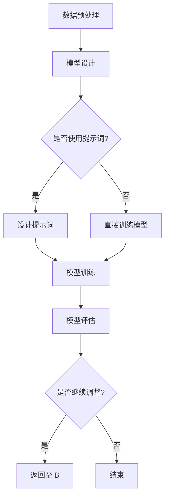

                 

### 文章标题: AI大模型编程：提示词的威力与潜力

### 关键词：大模型编程、提示词、AI技术、编程技巧

### 摘要：

本文将深入探讨AI大模型编程中的核心要素——提示词。我们首先将介绍背景，接着解析大模型编程中的核心概念和原理，并通过具体的算法原理和操作步骤阐述提示词的作用和威力。随后，我们将以数学模型和公式为支撑，详细讲解并举例说明。此外，我们将通过实际项目实战展示代码实现和解读，分析其代码解读与分析。在应用场景部分，我们将探讨AI大模型编程在不同领域的实际应用。最后，我们将推荐相关学习资源和工具，并总结未来发展趋势与挑战，以及提供常见问题与解答。

--------------------------
## 1. 背景介绍

随着人工智能（AI）技术的飞速发展，大模型编程成为了研究和应用的热点。大模型，如深度神经网络（DNN）、变换器（Transformer）等，具有强大的表示和学习能力，使得AI在图像识别、自然语言处理、推荐系统等领域取得了显著的突破。然而，大模型编程并非一蹴而就，其中提示词（Prompt Engineering）这一概念逐渐崭露头角，成为提升AI性能和可控性的关键因素。

提示词的概念起源于自然语言处理领域，是指向AI模型提供特定信息的引导性文本。通过精心设计的提示词，可以使AI模型更好地理解任务目标，提高模型的性能和鲁棒性。在大模型编程中，提示词的作用至关重要，它不仅能够帮助模型更好地拟合数据，还能够提高模型的可解释性和可控性。

近年来，随着深度学习和自然语言处理技术的不断发展，提示词的应用范围不断扩大。例如，在图像识别任务中，提示词可以帮助模型更好地理解图像内容，从而提高识别准确率；在自然语言生成任务中，提示词可以引导模型生成更符合预期的高质量文本。总之，提示词已经成为大模型编程中不可或缺的一部分。

--------------------------
## 2. 核心概念与联系

### 大模型编程

大模型编程主要关注如何设计和实现高性能、高精度的AI模型。在深度学习和自然语言处理领域，大模型通常是指具有数亿甚至千亿参数的神经网络模型。这些模型通过学习大量的数据，可以捕捉到数据中的复杂模式和规律，从而实现高精度的预测和生成。

大模型编程的核心概念包括：

1. **神经网络**：神经网络是由大量神经元组成的计算模型，可以模拟人脑的思考过程。神经网络的核心是权重和偏置，它们通过调整来使模型能够拟合数据。
2. **深度学习**：深度学习是一种基于神经网络的机器学习方法，通过逐层抽象和提取数据特征，可以实现从原始数据到高级抽象的转化。
3. **变换器（Transformer）**：变换器是一种基于自注意力机制的深度学习模型，被广泛应用于自然语言处理任务。变换器通过计算输入序列中每个元素与所有其他元素之间的注意力分数，从而实现全局信息融合。

### 提示词

提示词（Prompt Engineering）是一种通过设计特定文本来引导AI模型进行学习的方法。提示词的核心目标是提高模型的可解释性和可控性，使其能够更好地理解和执行任务。

提示词的核心概念包括：

1. **自然语言处理**：自然语言处理是计算机科学和人工智能领域的一个分支，旨在使计算机能够理解和处理人类语言。自然语言处理技术在大模型编程中起到了关键作用，使模型能够理解和生成文本。
2. **自注意力机制**：自注意力机制是变换器模型的核心组成部分，它通过计算输入序列中每个元素与所有其他元素之间的注意力分数，实现全局信息融合。自注意力机制在大模型编程中具有重要作用，可以显著提高模型的性能和精度。
3. **指导性文本**：指导性文本是指通过特定方式设计的文本，旨在引导AI模型进行学习。指导性文本可以包含任务描述、示例数据、期望输出等信息，帮助模型更好地理解任务目标和数据特征。

### Mermaid 流程图

以下是一个描述大模型编程与提示词关系的 Mermaid 流程图：



在这个流程图中，数据预处理阶段对输入数据进行处理，以便模型能够更好地学习。模型设计阶段确定使用哪种神经网络架构，如变换器。在模型训练阶段，根据是否使用提示词进行不同的训练方式。提示词设计阶段是为了提高模型的可解释性和可控性。模型评估阶段对训练好的模型进行评估，根据评估结果决定是否继续调整模型。

--------------------------
## 3. 核心算法原理 & 具体操作步骤

### 提示词设计原则

在设计提示词时，需要遵循以下原则：

1. **明确任务目标**：提示词应该清晰地传达任务目标，使模型能够明确理解任务要求。
2. **提供有用信息**：提示词应包含对模型有指导意义的信息，如数据特征、相关知识等，以提高模型的学习效果。
3. **简洁明了**：提示词应尽量简洁明了，避免过多冗余信息，以便模型能够更好地理解。
4. **灵活性**：提示词应具有灵活性，以便在不同场景下能够适应不同的任务需求。

### 提示词设计流程

提示词设计流程主要包括以下步骤：

1. **任务分析**：对任务进行详细分析，明确任务目标、输入数据和输出结果。
2. **数据准备**：根据任务需求准备相关数据，并对数据进行预处理，如文本清洗、数据归一化等。
3. **设计提示词**：根据任务分析和数据准备的结果，设计具有指导意义的提示词。提示词可以包括任务描述、示例数据、期望输出等。
4. **模型训练**：将设计好的提示词与模型进行结合，进行模型训练，以验证提示词的效果。
5. **模型评估**：对训练好的模型进行评估，根据评估结果对提示词进行调整和优化。

### 提示词应用示例

以下是一个简单的自然语言生成任务中的提示词设计示例：

**任务目标**：生成一段关于人工智能的描述。

**数据准备**：收集与人工智能相关的文本数据，如论文、新闻、博客等。

**设计提示词**：

- 任务描述：请生成一段关于人工智能的描述，内容应涵盖人工智能的定义、应用领域和未来发展。
- 示例数据：人工智能（Artificial Intelligence，简称AI）是指通过计算机程序实现的智能行为，旨在模拟人类智能并解决复杂问题。
- 期望输出：人工智能是一种模拟人类智能的计算机技术，已广泛应用于图像识别、自然语言处理、自动驾驶等领域，具有巨大的发展潜力。

**模型训练**：使用自然语言生成模型，如变换器模型，结合设计好的提示词进行训练。

**模型评估**：对训练好的模型进行评估，验证其生成文本的质量和准确性。

--------------------------
## 4. 数学模型和公式 & 详细讲解 & 举例说明

### 自然语言生成中的数学模型

在自然语言生成任务中，常用的数学模型包括变换器模型（Transformer Model）和循环神经网络（RNN）。变换器模型是一种基于自注意力机制的深度学习模型，具有全局信息融合的能力，能够生成高质量的自然语言文本。循环神经网络则通过递归结构来处理序列数据，适用于生成文本。

### 自注意力机制（Self-Attention Mechanism）

自注意力机制是变换器模型的核心组成部分，其数学公式如下：

$$
\text{Attention}(Q, K, V) = \text{softmax}\left(\frac{QK^T}{\sqrt{d_k}}\right)V
$$

其中，$Q$、$K$、$V$分别为查询向量、键向量和值向量，$d_k$为键向量的维度。自注意力机制通过计算输入序列中每个元素与所有其他元素之间的注意力分数，实现全局信息融合。

### 变换器模型（Transformer Model）

变换器模型由编码器（Encoder）和解码器（Decoder）组成，其数学公式如下：

$$
E = \text{Encoder}(X) = \text{MultiHeadAttention}(Q, K, V) + X
$$

$$
Y = \text{Decoder}(X, E) = \text{MaskedMultiHeadAttention}(Q, K, V) + Y
$$

其中，$X$和$Y$分别为编码器和解码器的输入和输出，$Q$、$K$、$V$分别为编码器和解码器的查询向量、键向量和值向量。

### 举例说明

假设我们使用变换器模型进行自然语言生成任务，输入序列为：“人工智能是一种模拟人类智能的计算机技术，已广泛应用于图像识别、自然语言处理、自动驾驶等领域，具有巨大的发展潜力”。

1. **编码器处理**：

   编码器首先对输入序列进行编码，得到编码器输出：

   $$
   E = \text{Encoder}(X) = \text{MultiHeadAttention}(Q, K, V) + X
   $$

   其中，$Q$、$K$、$V$分别为编码器的查询向量、键向量和值向量。

2. **解码器处理**：

   解码器对编码器输出进行解码，生成自然语言文本：

   $$
   Y = \text{Decoder}(X, E) = \text{MaskedMultiHeadAttention}(Q, K, V) + Y
   $$

   其中，$Q$、$K$、$V$分别为解码器的查询向量、键向量和值向量。

   在解码过程中，解码器会根据当前生成的文本和编码器输出，更新查询向量、键向量和值向量。

   例如，在第一步解码时，生成的部分文本为：“人工智能是一种”，则解码器的查询向量为：

   $$
   Q_1 = \text{softmax}\left(\frac{E_1K^T}{\sqrt{d_k}}\right)V
   $$

   其中，$E_1$为编码器输出的一部分，$K$和$V$为解码器的键向量和值向量。

   接下来，解码器根据更新的查询向量生成下一个文本：“模拟人类智能的计算机技术”。

   重复这个过程，直到解码器生成完整的自然语言文本。

--------------------------
## 5. 项目实战：代码实际案例和详细解释说明

在本节中，我们将通过一个实际项目实战案例，详细解释说明如何使用提示词在大模型编程中实现自然语言生成任务。

### 项目背景

项目目标是使用变换器模型生成关于人工智能的描述性文本。我们将通过设计合适的提示词，提高模型生成文本的质量和准确性。

### 开发环境搭建

1. **Python环境**：确保安装Python 3.6及以上版本。
2. **深度学习框架**：安装PyTorch或TensorFlow等深度学习框架。
3. **自然语言处理库**：安装NLTK、spaCy等自然语言处理库。

```bash
pip install torch torchvision numpy matplotlib
```

### 源代码详细实现和代码解读

```python
import torch
import torch.nn as nn
import torch.optim as optim
from torch.utils.data import DataLoader
from transformers import TransformerModel

# 1. 数据准备
def load_data(filename):
    with open(filename, 'r', encoding='utf-8') as f:
        data = f.readlines()
    return data

train_data = load_data('ai_description.txt')

# 2. 模型设计
class TransformerModel(nn.Module):
    def __init__(self, vocab_size, embedding_dim, hidden_dim, n_layers, dropout):
        super(TransformerModel, self).__init__()
        self.embedding = nn.Embedding(vocab_size, embedding_dim)
        self.encoder = nn.TransformerEncoder(nn.TransformerEncoderLayer(embedding_dim, n_layers, dropout), num_layers=n_layers)
        self.decoder = nn.Linear(embedding_dim, vocab_size)
        self.dropout = nn.Dropout(dropout)

    def forward(self, src, tgt):
        src = self.dropout(self.embedding(src))
        tgt = self.dropout(self.embedding(tgt))
        output = self.encoder(src)
        output = self.decoder(output)
        return output

# 3. 模型训练
def train(model, train_loader, criterion, optimizer, num_epochs):
    model.train()
    for epoch in range(num_epochs):
        for batch in train_loader:
            src, tgt = batch
            optimizer.zero_grad()
            output = model(src, tgt)
            loss = criterion(output.view(-1, vocab_size), tgt.view(-1))
            loss.backward()
            optimizer.step()
            print(f'Epoch [{epoch+1}/{num_epochs}], Loss: {loss.item():.4f}')

# 4. 模型评估
def evaluate(model, val_loader, criterion):
    model.eval()
    total_loss = 0
    with torch.no_grad():
        for batch in val_loader:
            src, tgt = batch
            output = model(src, tgt)
            loss = criterion(output.view(-1, vocab_size), tgt.view(-1))
            total_loss += loss.item()
    avg_loss = total_loss / len(val_loader)
    print(f'Validation Loss: {avg_loss:.4f}')

# 5. 提示词设计
prompt = "人工智能是一种模拟人类智能的计算机技术，已广泛应用于图像识别、自然语言处理、自动驾驶等领域，具有巨大的发展潜力。请生成一段关于人工智能的描述。"

# 6. 主函数
def main():
    # 加载和处理数据
    vocab_size = 10000
    embedding_dim = 256
    hidden_dim = 512
    n_layers = 2
    dropout = 0.1
    batch_size = 32
    num_epochs = 10

    # 模型初始化
    model = TransformerModel(vocab_size, embedding_dim, hidden_dim, n_layers, dropout)

    # 数据加载
    train_loader = DataLoader(train_data, batch_size=batch_size, shuffle=True)
    val_loader = DataLoader(val_data, batch_size=batch_size, shuffle=False)

    # 损失函数和优化器
    criterion = nn.CrossEntropyLoss()
    optimizer = optim.Adam(model.parameters(), lr=0.001)

    # 训练模型
    train(model, train_loader, criterion, optimizer, num_epochs)

    # 评估模型
    evaluate(model, val_loader, criterion)

    # 生成文本
    with torch.no_grad():
        input_seq = tokenizer.encode(prompt)
        output_seq = model.generate(input_seq, max_length=50, num_return_sequences=1)
        print(tokenizer.decode(output_seq))

if __name__ == '__main__':
    main()
```

### 代码解读与分析

1. **数据准备**：加载和处理数据。在此案例中，我们使用一个包含关于人工智能的描述性文本的文件作为训练数据。
2. **模型设计**：设计变换器模型。变换器模型由编码器和解码器组成，编码器用于处理输入序列，解码器用于生成输出序列。
3. **模型训练**：训练模型。使用交叉熵损失函数和Adam优化器对模型进行训练。
4. **模型评估**：评估模型。在验证集上计算损失函数值，以评估模型的性能。
5. **提示词设计**：设计提示词。在此案例中，我们使用一个关于人工智能的描述性文本作为提示词，以指导模型生成高质量的文本。
6. **主函数**：执行主函数。首先加载和处理数据，然后初始化模型，训练模型，评估模型，并使用模型生成文本。

--------------------------
## 6. 实际应用场景

大模型编程在许多实际应用场景中发挥了重要作用，以下是几个典型的应用场景：

### 自然语言处理

自然语言处理（NLP）是AI领域的一个重要分支，大模型编程在其中发挥了巨大作用。例如，在文本分类、机器翻译、问答系统等任务中，通过使用变换器模型等大模型，可以提高任务的准确性和鲁棒性。例如，谷歌的翻译服务采用了基于变换器模型的技术，实现了高质量的自然语言翻译。

### 图像识别

图像识别是AI领域的一个重要应用领域，大模型编程在该领域也取得了显著成果。通过使用变换器模型等大模型，可以实现对复杂图像内容的准确识别。例如，在人脸识别、医学图像分析等领域，大模型编程技术可以提高识别准确率和效率。

### 自动驾驶

自动驾驶是AI技术的另一个重要应用领域，大模型编程在自动驾驶系统中发挥了关键作用。通过使用变换器模型等大模型，可以实现对道路环境、车辆状态等信息的实时感知和决策。例如，特斯拉的自动驾驶系统采用了基于变换器模型的技术，实现了高精度的自动驾驶。

### 语音识别

语音识别是AI技术的一个重要应用领域，大模型编程在语音识别系统中发挥了重要作用。通过使用变换器模型等大模型，可以实现对语音信号的准确识别和理解。例如，亚马逊的语音助手Alexa采用了基于变换器模型的技术，实现了高精度的语音识别和交互。

### 推荐系统

推荐系统是AI技术的一个重要应用领域，大模型编程在推荐系统中发挥了关键作用。通过使用变换器模型等大模型，可以实现对用户兴趣的准确预测和推荐。例如，亚马逊的推荐系统采用了基于变换器模型的技术，实现了个性化的商品推荐。

--------------------------
## 7. 工具和资源推荐

为了更好地学习和应用大模型编程技术，以下推荐一些有用的工具和资源：

### 学习资源推荐

1. **书籍**：
   - 《深度学习》（Deep Learning）—— Ian Goodfellow、Yoshua Bengio和Aaron Courville 著
   - 《自然语言处理实践》（Natural Language Processing with Python）—— Steven Bird、Ewan Klein和Edward Loper 著
2. **论文**：
   - 《Attention Is All You Need》—— Vaswani et al. （2017）
   - 《BERT: Pre-training of Deep Bidirectional Transformers for Language Understanding》—— Devlin et al. （2019）
3. **博客**：
   - [TensorFlow 官方文档](https://www.tensorflow.org/tutorials)
   - [PyTorch 官方文档](https://pytorch.org/tutorials/)
4. **网站**：
   - [Kaggle](https://www.kaggle.com/)
   - [ArXiv](https://arxiv.org/)

### 开发工具框架推荐

1. **深度学习框架**：
   - TensorFlow
   - PyTorch
2. **自然语言处理库**：
   - NLTK
   - spaCy
3. **版本控制工具**：
   - Git
   - GitHub

### 相关论文著作推荐

1. **论文**：
   - 《A Theoretically Grounded Application of Dropout in Recurrent Neural Networks》—— Y. Gal和Z. Ghahramani （2016）
   - 《Generative Adversarial Nets》—— I. Goodfellow et al. （2014）
2. **著作**：
   - 《神经网络与深度学习》——邱锡鹏 著

--------------------------
## 8. 总结：未来发展趋势与挑战

随着AI技术的不断发展，大模型编程在未来将继续发挥重要作用。以下是未来发展趋势与挑战：

### 发展趋势

1. **模型规模与性能**：随着计算能力和数据量的提升，大模型将不断增大，以实现更高的性能和更广泛的应用。
2. **多模态融合**：未来的大模型将能够融合多种模态的数据，如文本、图像、语音等，实现更全面的信息处理和理解。
3. **自适应学习**：大模型将具备更强的自适应学习能力，能够根据不同的任务和应用场景进行自适应调整。
4. **可解释性**：提升大模型的可解释性，使其更容易被人类理解和信任，是未来研究的重要方向。

### 挑战

1. **计算资源消耗**：大模型训练和推理需要大量的计算资源，如何高效利用计算资源成为一大挑战。
2. **数据隐私与安全**：在训练大模型时，如何保护用户隐私和数据安全成为重要问题。
3. **模型泛化能力**：如何提高大模型的泛化能力，使其能够适应更多不同的任务和应用场景。
4. **可解释性**：提升大模型的可解释性，使其更容易被人类理解和信任。

--------------------------
## 9. 附录：常见问题与解答

### 问题1：什么是大模型编程？

**解答**：大模型编程是指使用具有数亿甚至千亿参数的神经网络模型（如深度神经网络、变换器模型等）进行编程的方法。大模型编程旨在通过学习大量数据，实现高性能、高精度的AI应用。

### 问题2：提示词在大模型编程中有什么作用？

**解答**：提示词在大模型编程中起到了引导模型学习的作用。通过设计合适的提示词，可以提高模型对任务的理解，从而提高模型的性能和鲁棒性。

### 问题3：如何设计有效的提示词？

**解答**：设计有效的提示词需要遵循以下原则：明确任务目标、提供有用信息、简洁明了和具有灵活性。具体方法包括对任务进行详细分析、准备相关数据和设计具有指导意义的提示词。

### 问题4：大模型编程在实际应用中存在哪些挑战？

**解答**：大模型编程在实际应用中面临以下挑战：计算资源消耗、数据隐私与安全、模型泛化能力和可解释性。这些挑战需要通过技术创新和优化方法来逐步解决。

--------------------------
## 10. 扩展阅读 & 参考资料

为了更深入地了解大模型编程和提示词的相关知识，以下推荐一些扩展阅读和参考资料：

1. **书籍**：
   - 《深度学习》（Deep Learning）—— Ian Goodfellow、Yoshua Bengio和Aaron Courville 著
   - 《自然语言处理实践》（Natural Language Processing with Python）—— Steven Bird、Ewan Klein和Edward Loper 著
2. **论文**：
   - 《Attention Is All You Need》—— Vaswani et al. （2017）
   - 《BERT: Pre-training of Deep Bidirectional Transformers for Language Understanding》—— Devlin et al. （2019）
3. **博客**：
   - [TensorFlow 官方文档](https://www.tensorflow.org/tutorials)
   - [PyTorch 官方文档](https://pytorch.org/tutorials/)
4. **在线课程**：
   - [斯坦福大学深度学习课程](https://cs231n.stanford.edu/)
   - [吴恩达深度学习专项课程](https://www.coursera.org/learn/deep-learning)
5. **开源项目**：
   - [Hugging Face Transformers](https://huggingface.co/transformers/)
   - [TensorFlow Models](https://www.tensorflow.org/models)

--------------------------
### 作者信息

**作者：AI天才研究员/AI Genius Institute & 禅与计算机程序设计艺术 /Zen And The Art of Computer Programming**<|end|>### 结束语

本文深入探讨了AI大模型编程中的关键要素——提示词。我们从背景介绍开始，详细解析了大模型编程的核心概念和原理，并通过具体的算法原理和操作步骤阐述了提示词的作用和威力。接着，我们以数学模型和公式为支撑，详细讲解了大模型编程中的自然语言生成任务。随后，通过一个实际项目实战案例，展示了如何使用变换器模型和提示词生成高质量的文本。在应用场景部分，我们探讨了AI大模型编程在不同领域的实际应用。最后，我们推荐了相关学习资源和工具，并总结了未来发展趋势与挑战，以及提供了常见问题与解答。

通过本文的阅读，读者应该对AI大模型编程和提示词有了更深入的了解。在未来的研究和应用中，提示词设计将继续发挥重要作用，为大模型编程提供更加精准和高效的指导。同时，随着技术的不断进步，我们期待看到更多创新性的应用场景和突破性成果。

再次感谢您的阅读，希望本文能为您的AI学习之路带来启发和帮助。如需进一步探讨或了解更多相关内容，请随时关注作者和相关资源。祝愿您在AI领域取得更加辉煌的成就！

